# JXLS 2.4.0 系列教程

**最简单应用**
需要的包
标签介绍，类介绍
直接输出

**循环**
容易出现的报错
简单循环，标签介绍

**分 sheet**
如何分 sheet

**循环嵌套**
如何嵌套

**高级应用，和 bug 修复**
map
统计
使用工具
静默模式
边距 bug

# （一）——最简单的模板导出

　　Java 中实现 excel 根据模板导出数据的方法有很多，一般简单的可以通过操作 POI 进行。还可以使用一些工具很轻松的实现模板导出。这些工具现在还在维护，而且做得比较好的国内的有 easyPOI，国外的就是这个 JXLS 了。

　　笔者使用 jxls 2 也有半年的时间了，半年前因项目原因需要导出大量的 excel 文件，所以找到了 jxls2，这是目前我用过最好的 excel 导出工具，基本可以完全满足所有的项目需要。不使用 easypoi 的原因是那时候测试时候效果不是很好，项目中有很多复杂的报表（大量单元格合并和单元格样式），easyPOI 处理合并单元格时候容易出现残损的情况。


　　今天我们着重介绍一下 JXLS 2.4.0 ，写文章前我搜索了下 JXLS 的教程，发现半年前我看到的是什么文章，现在的还是什么文章，大量的文章停留在 JXLS1.0 时代（作者 2.0 后重写了代码，使用方法完全不同）。唯一最新的一篇中文文章是 klguang 写的《jxls2.3- 简明教程》。剩下的就是官方文档了。其实官方文档也很不错，就是系统化不够，值此国庆之际，正好把我的工作中使用 JXLS 的经验写一下，让更多人接触这款优秀的工具。


　　首先，我推荐各位有能力的先上官网下载最新版本和了解下基础功能。（有没有被墙看缘分，公司的电信网络可以直接上，家里联通的要挂 VPN）

http://jxls.sourceforge.net/index.html

　　其次，推荐各位完整的看完 klguang 大神写的《jxls2.3- 简明教程》这篇文章。里面提供了 klguang 大神的工具类，本文也基于他的工具类进行介绍（部分代码进行修改）。

http://www.cnblogs.com/klguang/p/6425422.html


　　好，现在我们开始。


　　我这里使用 jxls 2.4.0 进行教程（不使用最新的 2.4.2 是因为我懒，教程用的 jar 包是我直接从公司项目拷的，懒得去测试新版本会不会有什么幺蛾子，不过我看了下更新说明，只是修复了一个 bug，应该问题不大）。2.4 和 2.3 在操作上没什么变化，但是在 jar 包的依赖上发生了变化，所以在使用 2.4 时候主要看我提供需要依赖的 jar 包文件。


 

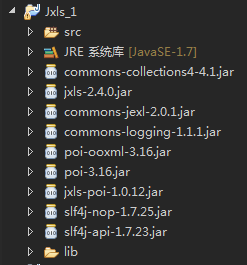


　　除了官方需要的 jar 包外，还需要加入几个依赖的包（都是必须的，少一个就报错）。文章后我给出依赖包的下载地址。用 Maven 的朋友我就不说怎么引包了，写上就自动下载依赖了。

接下来，我们在项目中复制 util 工具类：

```java
package com.test.util;

import java.io.File;
import java.io.FileInputStream;
import java.io.FileNotFoundException;
import java.io.FileOutputStream;
import java.io.IOException;
import java.io.InputStream;
import java.io.OutputStream;
import java.text.SimpleDateFormat;
import java.util.Date;
import java.util.HashMap;
import java.util.Map;

import org.jxls.common.Context;
import org.jxls.expression.JexlExpressionEvaluator;
import org.jxls.transform.Transformer;
import org.jxls.transform.poi.PoiTransformer;
import org.jxls.util.JxlsHelper;

/**
 * @author klguang
 */
public class JxlsUtils{
    
    public static void exportExcel(InputStream is, OutputStream os, Map<String, Object> model) throws IOException{
        Context context = PoiTransformer.createInitialContext();
        if (model != null) {
            for (String key : model.keySet()) {
                context.putVar(key, model.get(key));
            }
        }
        JxlsHelper jxlsHelper = JxlsHelper.getInstance();
        Transformer transformer  = jxlsHelper.createTransformer(is, os);
        //获得配置
        JexlExpressionEvaluator evaluator = (JexlExpressionEvaluator)transformer.getTransformationConfig().getExpressionEvaluator();
        //设置静默模式，不报警告
        //evaluator.getJexlEngine().setSilent(true);
        //函数强制，自定义功能
        Map<String, Object> funcs = new HashMap<String, Object>();
        funcs.put("utils", new JxlsUtils());    //添加自定义功能
        evaluator.getJexlEngine().setFunctions(funcs);
        //必须要这个，否者表格函数统计会错乱
        jxlsHelper.setUseFastFormulaProcessor(false).processTemplate(context, transformer);
    }

    public static void exportExcel(File xls, File out, Map<String, Object> model) throws FileNotFoundException, IOException {
            exportExcel(new FileInputStream(xls), new FileOutputStream(out), model);
    }
    
    public static void exportExcel(String templatePath, OutputStream os, Map<String, Object> model) throws Exception {
        File template = getTemplate(templatePath);
        if(template != null){
            exportExcel(new FileInputStream(template), os, model);    
        } else {
            throw new Exception("Excel 模板未找到。");
        }
    }
    
    //获取jxls模版文件
    public static File getTemplate(String path){
        File template = new File(path);
        if(template.exists()){
            return template;
        }
        return null;
    }    
    
    // 日期格式化
    public String dateFmt(Date date, String fmt) {
        if (date == null) {
            return "";
        }
        try {
            SimpleDateFormat dateFmt = new SimpleDateFormat(fmt);
            return dateFmt.format(date);
        } catch (Exception e) {
            e.printStackTrace();
        }
        return "";
    }
    
    // if判断
    public Object ifelse(boolean b, Object o1, Object o2) {
        return b ? o1 : o2;
    }
}
```


　　我在 klguang 的基础上略作了修改，有两点需要讲一下：

　　1. 静默模式是在导出 excel 模板时候，如果模板中标签名没有在传入的 map 中找到数值，会打印报告某某某标签没有赋值。如果开启静默模式后则不会报告。放心，出现严重异常还是会报错的。

　　2. 函数统计错乱，这个必须设置（setUseFastFormulaProcessor(false)），要不后续文章中会写到怎么做 excel 分 sheet 输出，如果不设置成 false，以后用 excel 自带函数统计相加会加错地方。

　　工欲善其事必先利其器，接着我们可以写一个 Main 方法了。

```java
public class TestMain {
    public static void main(String[] args) throws Exception {
        // 模板路径和输出流
        String templatePath = "E:/template.xls";
        OutputStream os = new FileOutputStream("E:/out.xls");
        // 定义一个Map，往里面放入要在模板中显示数据
        Map<String, Object> model = new HashMap<String, Object>();
        model.put("id", "001");
        model.put("name", "张三");
        model.put("age", 18);
        //调用之前写的工具类，传入模板路径，输出流，和装有数据Map
        JxlsUtils.exportExcel(templatePath, os, model);
        os.close();
        System.out.println("完成");
    }
}
```

　　就这么简单，接下来我们做事写模板。

　　在 E 盘建立一个名字叫 template.xls 的文件，然后在里面加入以下的内容。

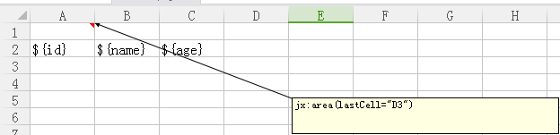


　　如果你前面看了 klguang 的教程，你应该知道里面的注释是什么意思。不过我还是简单讲一下：

　　第一步，在报表中最左上角（A1）加入一个注释 jx:area(lastCell="D3")，含义为模板的区域由 A1（加注释的单元格）到 D3。有一点说明：


　　区域最好比你设计的模板大一圈就是你的模板内容只到 C2，而你要设置区域到 D3。理由是在 2.3 版本中 lastCell 的值如果在有**表达式的单元格**或者在**合并后的单元格**，容易报空指针异常，2.4 好像没有这个问题了，不太确定。

　　第二步，在你设定的模板区域内写入表达式 ${ }，表达式中写入前面 model 中 put 的 “键”。

　　好了，模板写完，保存，执行 java 代码，我们就可以看到效果了：


 

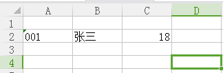


　　最后说明一下：

　　1.jxls 会自动根据你 model 中 put 的值来判断写入进 excel 中的是字符串还是数值。

　　2.A1 单元格这个被注释使用的单元格也是可以写表达式的。

　　3. 如果你在模板中写了一个 model 中找不到对应键的表达式，比如我在 A3 中写 ${aaaa}，再运行代码，则会报提示：


警告:` org.jxls.expression.JexlExpressionEvaluator.evaluate@61![0,4]: 'aaaa;' undefined variable aaaa`

　　如果不想要提示就在 JxlsUtils 类中设置静默模式：`evaluator.getJexlEngine().setSilent(true);`


　　**jar 包下载地址（内有官方 2.4.0 版本，2.4 依赖的 jar 包，klguang 的 demo）**：[这里下载](https://files.cnblogs.com/files/foxlee1024/教程1.rar)


　　接下来我计划写四篇文章，仔细的描述我使用 jxls 的一些技巧。JXLS 是一个很强大的 excel 操作工具，可以导入导出，模板导出，代码导出，xml 导出，导出显示图片，连接数据库等等功能。具体的功能有需要的同学请上官网查询。我只写一些我用到过的功能。


# （二）——循环导出一个链表的数据

**请务必先看上一篇文章，本文在上一篇文章的代码基础上修改而成。**


[JXLS 2.4.0 系列教程（一）——最简单的模板导出](http://www.cnblogs.com/foxlee1024/p/7616987.html)

　　上一篇文章我们介绍了 JXLS 和模板导出最简单的应用，现在我们要更进一步，介绍在模板中循环导出链表中的数据，在日常开发中，循环导出应该才是最常用的功能吧！

　　首先，我们要建立一个类模拟 javabean 对象。我们定义一个 person 类，里面有 id，name 和 age。

```java
public class Person {
    String id;
    String name;
    Integer age;
    public Person(String id, String name, Integer age) {
        super();
        this.id = id;
        this.name = name;
        this.age = age;
    }
    public Person() {
    }

    /** 以下省略了对应的get/set方法，请自行补齐 */
}
```

　　然后我们修改 main 方法，大体上和上一篇文章是一致的，只是模拟了从数据库取出 javabean 的过程，将取出的 javabean 对象放入 model 中，然后传给 JxlsUtils。

```java
public class TestMain {
    public static void main(String[] args) throws Exception {
        // 模板位置，输出流
        String templatePath = "E:/template2.xls";
        OutputStream os = new FileOutputStream("E:/out.xls");
        
        // 一个装有对象数据的链表
        List<Person> persons = new ArrayList<Person>();
        Person p1 = new Person("001", "张三", 18);
        Person p2 = new Person("002", "李四", 19);
        Person p3 = new Person("003", "王五", 20);
        persons.add(p1);
        persons.add(p2);
        persons.add(p3);
        
        Map<String, Object> model = new HashMap<String, Object>();
        model.put("person", persons);    // 把链表放进model中
        
        JxlsUtils.exportExcel(templatePath, os, model);
        os.close();
        System.out.println("完成");
    }
}
```


　　接下来我们设计模板：


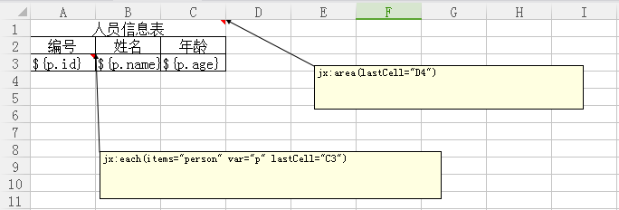


　　A1 单元格（A1 到 C1 合并单元格，名字还是 A1）中的注释：`jx:area(lastCell="D4")`，不用多讲划定模板的区域范围。依照上文讲的避免 bug 的原因，我们依然将区域范围设置成比模板内容至少大一圈。需要说明的是注释必须在左上角的 A1 中，但是可以在和 A1 合并后的单元格中。


　　A3 单元格的注释：`jx:each(items="person" var="p" lastCell="C3")`：


jx:each()  这是一个遍历注释，默认向下增加一行。官网写可以横向遍历（增加 direction 参数），我没有试过。

Items= 从 java 代码中传入的 model 的键值对中取出键名为 “person” 的对象，这个对象可以是集合，一般是链表。

Var= 每一条记录的变量名，命名为 p。

lastCell= 遍历数据在模板中最后一个单元格的位置。


　　然后在遍历的区域内写上 ${ } 表达式，以 var 中定义的变量名 . 传进来的对象属性为构成。

　　然后保存模板，执行 java 代码，就能看到下图的结果了。

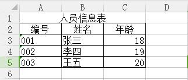


　　我们再来测试下复杂一点的模板呢？

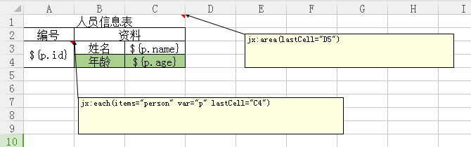


　　遍历的模板有两行，而且开头一列为合并的单元格，遍历模板第二行为有底纹的单元格，看看整个表格生成后会不会崩掉？我试过几个模板导出插件，很多都是单行遍历模板没问题，一旦出现多行数据和带有合并的单元格整个模板就会崩掉。

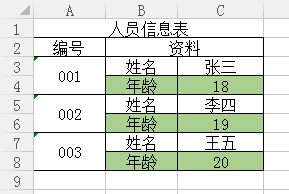


　　没毛病，完美。

　　最后说一点：如果 lastCell 的参数的值要设定为一个合并后的单元格，你不知道这个合并后的单元格名字是什么，那就用鼠标点一下该单元格，excel 左上角会显示这个合并单元格的名称的，就写这个名字就行。

　　例如上图 001 所在的合并单元格，用数据点击后 excel 提示的单元格名称为 A3，其实写 A3，A4 都行。


**2018-08-07 新增：**

　　还有一种用法，就是横向遍历显示 list 的数据。其实很简单，jx:each 的注释里只要写 direction="RIGHT" 就行了。

　　`jx:each(items="data" var="dat" lastCell="A3" direction="RIGHT")`

　　具体参照下图，我就不写代码了，都一样，只是模板的不同而已。

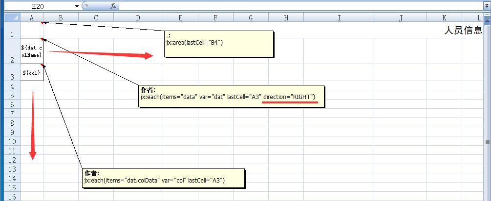


# （三）——嵌套循环是怎么做到的

**注：本文代码在第一篇文章基础上修改而成，请务必先阅读第一篇文章。**

http://www.cnblogs.com/foxlee1024/p/7616987.html

**本文也不会过多的讲解模板中遍历表达式的写法和说明，请先阅读第二篇文章。**

http://www.cnblogs.com/foxlee1024/p/7617120.html

　　原本第三篇文章我打算写 sheet 分页的实现的，后来发现难度比第四篇循环嵌套复杂一点点，我们本着循序渐进的原则，所以先讲讲怎么实现循环嵌套。


说明是嵌套循环？说白了就是大循环套小循环，请看下图：


 


　　我们设想一下，有一条哆啦 A 梦的流水生产线，生产线上在生成这哆啦 A 梦。我们知道，哆啦 A 梦的口袋中有很多不同的道具，那么我们在生成的时候就把这些道具预先放进哆啦 A 梦的口袋吧。

　　每一个产品的哆啦 A 梦拥有的道具都是不一样的，这样我们在表中就需要到了两个循环，第一层是哆啦 A 梦名称和拥有的道具，第二层循环是拥有的道具名称和道具功能。


　　Main 方法中导出的代码和原来没什么不同，所以我们先看看哆啦 A 梦的 javabean 是怎么设计的。

```java
public class Doraemon {
    private String name; // 哆啦A梦的名字
    private List<Tool> tools; // 拥有的道具，这是一个链表，存放的是Tool类
    
    public Doraemon(String name, List<Tool> tools) {
        super();
        this.name = name;
        this.tools = tools;
    }
    
    public Doraemon() {
    }
    
    /** 以下省略所有get/set方法，请自行添加 */
}
```


　　接下来我们看看 Tool 类：

```java
public class Tool {
    private String toolName; // 道具名
    private String toolFunction; // 道具功能
    
    public Tool(String toolName, String toolFunction) {
        super();
        this.toolName = toolName;
        this.toolFunction = toolFunction;
    }
    
    public Tool() {
    }
    
    /** 以下省略所有get/set方法，请自行添加 */
}
```


　　现在大家看明白了吗？其实就是在 Doraemon 类中加入了一个 List 链表，泛型为 Tool。可以预想的是，只要一层层创建好哆啦 A 梦这个对象（包括他的道具）后，再把多个多啦 A 梦放进一个链表中，然后传给 Jxls 工具就可以生成 excel 报表了。


　　现在我们看看 Main 方法是怎么写的，除了生成哆啦 A 梦对象的代码外，其他完全没有改动。

```java
public class TestMain2 {

    public static void main(String[] args) throws Exception {
        String templatePath = "E:/template6.xls";
        OutputStream os = new FileOutputStream("E:/out6.xls");
        
        Tool tool1 = new Tool("任意门","想去哪就去哪");
        Tool tool2 = new Tool("竹蜻蜓","想飞哪就飞哪");
        Tool tool3 = new Tool("空气炮","空气炮");
        Tool tool4 = new Tool("翻译饼干","翻译饼干");
        
        List<Doraemon> list = new ArrayList<Doraemon>();
        
        //制作一个哆啦A梦
        Doraemon doraemon1 = new Doraemon();
        //制作一号哆啦A梦的道具
        List<Tool> toolList1 = new ArrayList<Tool>();
        toolList1.add(tool1);
        toolList1.add(tool2);
        //设定一号哆啦A梦信息
        doraemon1.setName("哆啦A梦一号");
        doraemon1.setTools(toolList1);
        
        //制作一个哆啦A梦
        Doraemon doraemon2 = new Doraemon();
        //制作二号哆啦A梦的道具
        List<Tool> toolList2 = new ArrayList<Tool>();
        toolList2.add(tool3);
        toolList2.add(tool4);
        toolList2.add(tool1);
        //设定二号哆啦A梦信息
        doraemon2.setName("哆啦A梦二号");
        doraemon2.setTools(toolList2);
        
        list.add(doraemon1);
        list.add(doraemon2);
        
        Map<String, Object> model = new HashMap<String, Object>();
        model.put("data", list);    
        
        JxlsUtils.exportExcel(templatePath, os, model);
        os.close();
        System.out.println("完成");
    }
}
```


　　Main 方法不多解释，就是 new 出一个新的哆啦 A 梦后给他 set 入对应的数据（包括名字和拥有的道具），然后把一众哆啦 A 梦放进一个链表中，再传进 model 中。


　　重点是我们看看模板应该怎么写。

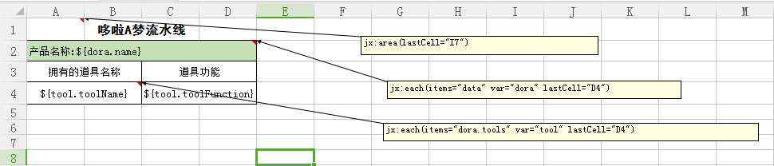


　　第一句不用多说，设定模板区域（我随便写的，可以写大一点）：

`jx:area(lastCell="I7")`

　　第二句是第一层循环，items 是 Main 方法中 model 放入的键名，里面存放有装着生产线所有哆啦 A 梦对象的一个链表。他的 var 值是 dora，在获取产品名称时就要写成 ${dora.name}。lastCell 的值写 C4，D4 都行。

`jx:each(items="data" var="dora" lastCell="D4")`

　　第三句是第二层循环，是哆啦 A 梦对象（Doraemon）里的 tools 属性，是个链表。由于上一层循环中 Doraemon 对象已经在 var 值中被命名成 dora，所以第二层循环的 items 写成 dora.tools。并且 var 值为 tool。这就意味着 Doraemon 对象 tools 属性中的单条遍历记录被命名成 tool。所以就可以在表达式中用 ${tool.toolName} 方法获取道具的名字（toolName）了。

`jx:each(items="dora.tools" var="tool" lastCell="D4")`

　　不明白的同学请仔细品味一下，items 相当于一个链表 List，而 var 相当于链表中存放的单个对象。要使用这些对象就要给他们在 var 中命名。


　　写好这三句注解后，就可以回到 main 方法中执行代码了。


 

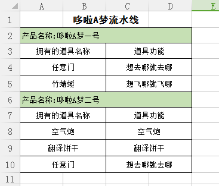

# （四）——多 sheet 是怎么做到的

**注：本文代码在第一篇文章基础上修改而成，请务必先阅读第一篇文章。**

http://www.cnblogs.com/foxlee1024/p/7616987.html

**本文也不会过多的讲解模板中遍历表达式的写法和说明，请先阅读第二篇文章。**

http://www.cnblogs.com/foxlee1024/p/7617120.html

　　这篇内容主要讲解一些如何导出多 sheet 的报表，我将用一个学生成绩表作为讲解案例。多 sheet 的导出不单单是简单分 sheet 而已，还加入了分页的功能。效果先看下图：

　　Sheet1


　　Sheet2

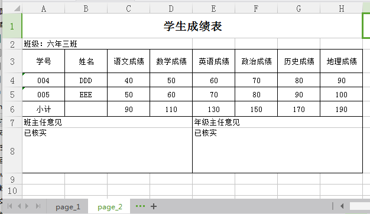


　　大家可以看到，两个不同 sheet 中，表结构是一样，但是里面的学生数据有了个分页的效果。这是怎么做到的呢？

　　这里，我们得从模板制作讲起，知道了多 sheet 模板的原理后，写代码就轻松多了。

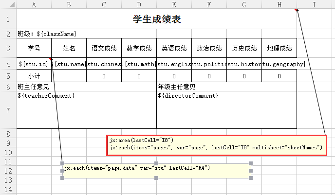


　　大家看红框里的注释：

`jx:area(lastCell="I8")`

`jx:each(items="pages", var="page", lastCell="I8" multisheet="sheetNames")`

　　第一行不用说，是划定模板区域。第二行看起来是一个很正常的遍历注释，但是里面多了一个 multisheet="sheetNames" 参数，这个参数就是分 sheet 的参数。我们连起来看就是，以整个 Excel 报表为一个遍历输出的对象，每一个 sheet 就是一条输出的记录。简单的说，就是遍历一个集合（List）items，将集合内每一个对象输出到每一个独立的 sheet 中。


　　只要写上 “multisheet” 属性 JXLS 就会自动的分 sheet 了。那么还有一个问题，就是 multisheet 属性的值 sheetNames 是什么意思？这个值是从 model 中传来的一个集合（一般用 List），里面存放着每一页 sheet 应该起的名字，JXLS 在读取 pages 进行分 sheet 遍历的时候，也会读取 sheetNames 进行遍历给每一个 sheet 改名。


　　接下来我们看看 A4 单元格的注释，大家看过第三篇文章应该知道怎么嵌套循环了，这里本质上也是一个嵌套，所以 A4 里的遍历标签的 items 写的值就是 A1（红框）遍历标签里的 page，然后点上对应的属性。


　　标签讲完了，具体怎么做呢？我们打算用一个叫做 Page 的类作为分页的 javaBean 对象，这个对象里存放着这一页应该显示的学生记录（List<Student>）和每一页的页名（sheet 名）。然后将这个 page 对象放进一个链表中，传给 model。


 

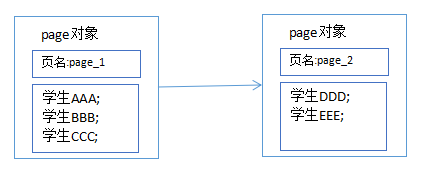


　　上图就是文章开头两张图片中学生成绩分页的链表示意图。

　　接下来我们开始写代码，假设数据库查询出来的结果就是一个装有学生对象的一长串链表。那么我们从最基本的学生类（student）开始写起，

```
jxlsHelper.processTemplate(context, transformer);
```

　　学生类没什么好说的，学生的基本信息。接下来我们写页面类（Page），也就是每一个 sheet 应该包含什么信息。

```
// 这个代码可以实现，但自定义功能函数不起作用了。同时如果前面已经获取了transformer，此方法会报错。
jxlsHelper.processTemplateAtCell(...)
```


　　这个类说两句，属性 data 的类型的 List，泛型如果你能确定传进来的对象就写上该对象，或者泛型继承，不能就写上问号。还有两个属性：currentPage 和 tolalPage 这算是保留属性，本篇教程中没有用到，但是我还是写上了，建议同学们也可以写上，因为当前页或总页码可以往后使用工具标签时候可以判断是否最后一页。


　　接下来是重点了，我们已经有了从数据库中查询的一长串装有学生对象的链表，有了每一页应该装什么数据的页面对象，接下来我们要做的就是分页了。


　　把一长串装有学生对象的链表截成一段段的数据，然后装进 page 对象中，然后再把一节一节装有数据的 page 对象装进一个新链表中。返回给 JXSL 的 model。


　　我们看下分页代码：

```java
public static void exportExcel(InputStream is, OutputStream os, Map<String, Object> model, boolean flag)
        throws IOException {
    Context context = PoiTransformer.createInitialContext();
    if (model != null) {
        for (String key : model.keySet()) {
            context.putVar(key, model.get(key));
        }
    }
    JxlsHelper jxlsHelper = JxlsHelper.getInstance();
    Transformer transformer = jxlsHelper.createTransformer(is, os);
    // 获得配置
    JexlExpressionEvaluator evaluator = (JexlExpressionEvaluator) transformer.getTransformationConfig().getExpressionEvaluator();
    // 设置静默模式，不报警告
    // evaluator.getJexlEngine().setSilent(true);
    // 函数强制，自定义功能
    Map<String, Object> funcs = new HashMap<String, Object>();
    funcs.put("utils", new JxlsUtils()); // 添加自定义功能
    evaluator.getJexlEngine().setFunctions(funcs);
    jxlsHelper.setDeleteTemplateSheet(flag);
    // 必须要这个，否者表格函数统计会错乱
    jxlsHelper.setUseFastFormulaProcessor(false);// .processTemplateAtCell(is, os, context, "x!A1");
 
    processTemplateAtCell(context, jxlsHelper, transformer);
}
private static void processTemplateAtCell(Context context, JxlsHelper jxlsHelper, Transformer transformer) throws IOException {
    AreaBuilder areaBuilder = jxlsHelper.getAreaBuilder();
    areaBuilder.setTransformer(transformer);
    List<Area> xlsAreaList = areaBuilder.build();
    if (xlsAreaList.isEmpty()) {
        throw new IllegalStateException("No XlsArea were detected for this processing");
    }
    Area firstArea = xlsAreaList.get(0);
    CellRef targetCellRef = new CellRef("Datas!A1");
    firstArea.applyAt(targetCellRef, context);
    if (jxlsHelper.isProcessFormulas()) {
        setFormulaProcessor(jxlsHelper, firstArea);
        firstArea.processFormulas();
    }
    String sourceSheetName = firstArea.getStartCellRef().getSheetName();
    if (!sourceSheetName.equalsIgnoreCase(targetCellRef.getSheetName())) {
        if (jxlsHelper.isHideTemplateSheet()) {
            transformer.setHidden(sourceSheetName, true);
        }
        if (jxlsHelper.isDeleteTemplateSheet()) {
            transformer.deleteSheet(sourceSheetName);
        }
    }
    transformer.write();
}
```


　　原理就是遍历传进来的一长串链表，然后根据判断将他截成一段后装进链表中，然后把链表封装进 page 类的 data 属性里，接着再把 page 类装进链表中，然后返回装有 page 对象的链表。


　　好了，全都齐全了，我们可以开始写 main 方法了。

```java
public class TestMain {
    public static void main(String[] args) throws Exception {
        // 模板位置，输出流
        String templatePath = "E:/template5.xls";
        OutputStream os = new FileOutputStream("E:/out5.xls");

        List<Student> list = generateData(); //    模拟数据库获取数据
        List<Page> page = DataByPage.byPage(list); // 把获取的数据进行分页转换        
        Map<String, Object> model = new HashMap<String, Object>();
        model.put("pages", page);
        model.put("sheetNames", getSheetName(page));
        model.put("className", "六年三班");
        model.put("teacherComment", "已核实");
        model.put("directorComment", "已核实");
        
        JxlsUtils.exportExcel(templatePath, os, model);
        os.close();
        System.out.println("完成");
    }
    
    /**
     * Excel 的分页名（页码）的封装
     * 此方法用来获取分好页的页名信息，将信息放入一个链表中返回
     */
    public static ArrayList<String> getSheetName(List<Page> page) {
        ArrayList<String> al = new ArrayList<String>();
        for (int i = 0; i < page.size(); i++) {
            al.add(page.get(i).getSheetName());
        }
        return al;
    }
    
    /**
     * 模拟生成数据
     */
    public static List<Student> generateData(){
        List<Student> list = new ArrayList<Student>();
        Student stu1 = new Student("001", "AAA", 10, 20, 30, 40, 50, 60);
        Student stu2 = new Student("002", "BBB", 20, 30, 40, 50, 60, 70);
        Student stu3 = new Student("003", "CCC", 30, 40, 50, 60, 70, 80);
        Student stu4 = new Student("004", "DDD", 40, 50, 60, 70, 80, 90);
        Student stu5 = new Student("005", "EEE", 50, 60, 70, 80, 90, 100);
        list.add(stu1);
        list.add(stu2);
        list.add(stu3);
        list.add(stu4);
        list.add(stu5);
        return list;
    }
}
```


　　其他没要讲的，唯一有一个就是需要一个 getSheetName() 方法，遍历获取每一个 page 的 sheeName，然后装进链表中。然后 put 入 model 的 sheetNames 键里。

　　模板就按照前边开头我们讲解的那个模板写，接下来我们运行一下代码。

　　当你看到控制台打出 “完成”，欣喜的打开 excel 文件时候，你会发现第一页 sheet 是空白的...... 从第二页开始才是真正的内容。然后你看到第一页的 sheet 名是你模板的 sheet 名，你就知道肯定是 JXLS 在复制模板时候没有删除模板页面造成的。


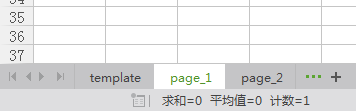


　　这个问题我没办法解决，我尝试过在 JxlsUtils 中设置 JxlsHelper 的属性：jxlsHelper.setDeleteTemplateSheet(true); 然而并没什么卵用，不知道是我设置的地方不对，还是别的原因。请知道解决方案的同学务必留言告知一下，万分感谢！

　　虽然没办法从根本上解决，但是可以找到凑活解决的办法，就是利用 POI 把多余的 sheet 给删掉，写一个工具类，代码如下：

```java
public class DelSheet {
    /** 
     * 删除指定的Sheet 
     * @param targetFile  目标文件 
     * @param sheetName   Sheet名称 
     */ 
    public static void deleteSheet(String targetFile,String sheetName) { 
        try { 
            FileInputStream fis = new FileInputStream(targetFile); 
            HSSFWorkbook wb = new HSSFWorkbook(fis); 
            fileWrite(targetFile, wb); 
            //删除Sheet 
            wb.removeSheetAt(wb.getSheetIndex(sheetName)); 
            fileWrite(targetFile, wb); 
            fis.close(); 
        } catch (Exception e) { 
            e.printStackTrace(); 
        } 
    } 
    
    /** 
     * 写隐藏/删除后的Excel文件 
     * @param targetFile  目标文件 
     * @param wb          Excel对象 
     * @throws Exception 
     */ 
    public static void fileWrite(String targetFile,HSSFWorkbook wb) throws Exception{
        FileOutputStream fileOut = new FileOutputStream(targetFile); 
        wb.write(fileOut); 
        fileOut.flush(); 
        fileOut.close(); 
    }
}
```

　　接下来我们就在 main 方法中，执行完 excel 导出的代码后调用下删除 sheet 的语句：

```java
JxlsUtils.exportExcel(templatePath, os, model);
os.close();
// 删除多出来的sheet
DelSheet.deleteSheet("E:/out5.xls", "template");
System.out.println("完成");
```

　　传入的是 excel 导出的路径和要删除的 sheet 名字，其实可以传入 sheet 的编号的，但是我觉得传入名字可以防止误删除。要传入编号的同学请自行修改 deleteSheet 方法，wb.getSheetIndex(sheetName) 既可以接收 String 也可以接收 Integer，如果我没有记错的话。

　　我们再运行一遍代码看看，我们就可以看到开头的那样的效果了！

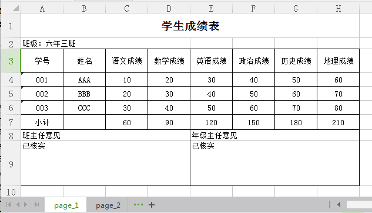


　　一般来说，这篇文章到这里应该就结束了。但是还有一个问题，就是如果我想做每一个学生的成绩分页呢？怎么做？就是一个学生独占一个 sheet。

　　我不卖关子了，我们记得，每一个 sheet 的信息其实是对应一个 page 对象的，这个对象里有一个 List<Student> data，所以在一个 sheet 里才能够将这个 data 取出，交给模板进行遍历。如果我们要一个学生独占一个 sheet，我们只需要在 Page 类中加入一个对象类型的属性就可以了，在模板中直接取这个对象具体的属性。这也是我为什么要用 page 对象的原因，扩展性高。

```java
public class Page {
    /**
     * 页面信息
     */
    private String sheetName; // 每个sheet名字
    private String currentPage; // 当前页
    private String tolalPage; // 总页

    /**
     * 页面遍历的数据 List 的泛型自行设置，如果所有数据都来着同一个类就写那个类， 
     * 不是同一个类有继承就写继承类的泛型，没有就写问号。
     */
    private List<?> data;
    
    /**
     * 一页只保存一个人的信息
     */
    private Object onlyOne;

　　/** 省略构造器和其他get/set方法 */

    public Object getOnlyOne() {
        return onlyOne;
    }
    public void setOnlyOne(Object onlyOne) {
        this.onlyOne = onlyOne;
    }
```

　　接下来我们修改一下 main 方法，把原本用来分页的 List<Page> page = DataByPage.byPage(list) 注释掉。然后新加一句 List<Page> page = individual(list) ：

```java
public static void main(String[] args) throws Exception {
        // 模板位置，输出流
        String templatePath = "E:/template5.xls";
        OutputStream os = new FileOutputStream("E:/out5.xls");

        List<Student> list = generateData(); //    模拟数据库获取数据
        //List<Page> page = DataByPage.byPage(list); // 把获取的数据进行分页转换
        List<Page> page = individual(list); // 一页一个人
        
        Map<String, Object> model = new HashMap<String, Object>();
        model.put("pages", page);
        model.put("sheetNames", getSheetName(page));
        model.put("className", "六年三班");
        model.put("teacherComment", "已核实");
        model.put("directorComment", "已核实");
        
        JxlsUtils.exportExcel(templatePath, os, model);
        os.close();
        // 删除多出来的sheet
        DelSheet.deleteSheet("E:/out5.xls", "template");
        System.out.println("完成");
}
```


　　Individual() 方法的代码如下：

```java
/**
     * 将数据获取的数据封装成一页一个人的List
     */
    public static List<Page> individual(List<Student> list){
        List<Page> pages = new ArrayList<Page>();
        for(int i = 0; i < list.size(); i++){
            Page p = new Page();
            p.setOnlyOne(list.get(i));
            p.setSheetName(list.get(i).getName());
            pages.add(p);
        }
        return pages;
    }
```


　　接收传进来的 List<Student> list 链表数据，然后遍历该链表，将其封装 Page 对象中，并且别忘了设置 sheetName。

　　模板是这样的：

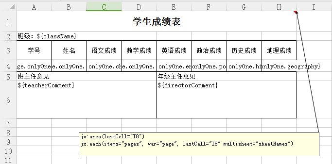

　　模板中不需要两层循环了，直接在页面中取 page 的 onlyOne 属性（装的是 Student 对象）的值就好了。例如：${page.onlyOne.id}、${page.onlyOne.chinese}。


　　行了，执行代码看一下效果：

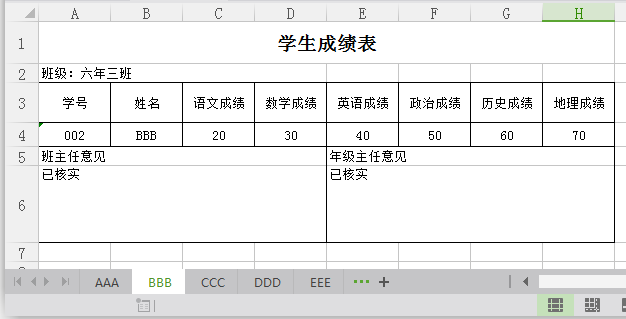


　　到这里就真的是结束了，这篇文章内容有点多，主要讲了分 sheet 导出的方法，本质上只是一种的，我先讲了比较复杂的，带有分页效果的分 sheet。然后再讲了单纯的分 sheet。介于代码比较多，我就把源码发上了让大家一起研究。源码里的 jar 包我给删掉了，要使用就在第一篇文章先下载 jar 包吧！


顺便说一句，前几篇教程的源码是不存在的，因为我每一篇都是在原来代码基础上改的，其实所有代码我都发上来了。这篇我是专门开新工程弄的例子。哦，还有一句，家里 eclipse 太久不用了，编码居然是 GBK 而不是通用的 UTF-8（写完了才发现），大家看着改吧。


　　**jar 包下载地址（内有官方 2.4.0 版本，2.4 依赖的 jar 包，klguang 的 demo）**：[这里下载](https://files.cnblogs.com/files/foxlee1024/教程1.rar)


　　**本文源码下载（内有模板，无 jar 包，请配合上边 jar 包使用）：** [源码下载](https://files.cnblogs.com/files/foxlee1024/教程4.rar)

##   拾遗 如何做页面小计 (自定义命令)

　　**注：阅读本文前，请先阅读第四篇文章。**

　　http://www.cnblogs.com/foxlee1024/p/7619845.html

　　前面写了第四篇教程，发现有些东西忘了讲了，这里补回来。

　　忘了讲两个点：

　　1. 本页小计怎么做。
  　　2. 在多 sheet 时候本页小计会出现错乱，怎么解决。

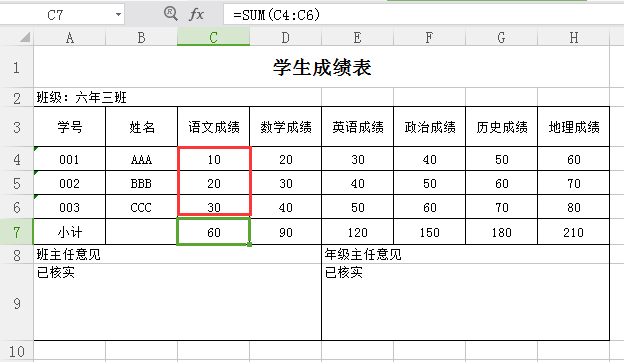


　　本页小计就是这个东西，在导出报表时候会自动统计累加遍历出来的数据。


　　实现起来很简单，看下图：

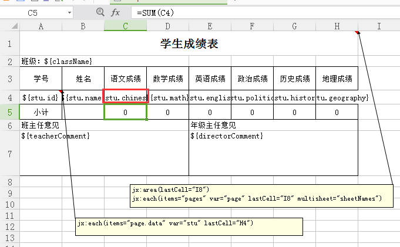


　　想统计语文成绩的遍历数据 ${stu.chinese}，就只要在将要统计的单元格里写上 “=SUM(C4)” 就行了。C4 就是语文成绩的单元格。Jxls 会自动帮你把统计范围扩大的。

　　数学成绩就写 = SUM(D4)，英语成绩就写 = SUM(E4)，以此类推。

　　还有一个问题，就是在多 sheet 中进行这样的统计的话，默认情况下会出现问题，就是 sheet1 统计的范围是 sheet1 的，sheet2 统计的范围还是 sheet1 的，sheet3 统计的范围依然是 sheet1 的。

　　这个问题很好解决，官方也提供了解决方案：

　　就是在 JxlsUtils 中修改 JxlsHelper 的属性：

```
jxlsHelper.setUseFastFormulaProcessor(false).processTemplate(context, transformer);
```


　　我之前代码里的 JxlsUtils 中已经修改了。这里只是告诉各位写这个是意义是什么。


# （五）——更进一步的应用和页面边距 bug 修复

**注：本文代码建立于前面写的代码。不过不看也不要紧。**

　　前面的文章把 JXLS 2.4.0 的基本使用写了一遍，现在讲讲一些更进一步的使用方法。我只写一些我用到过的方法，更多的高级使用方法请参考官网。

　　http://jxls.sourceforge.net/


## **一、Map 的应用**

　　从一开始，官方 dome 使用的 model 中的引用对象一直都是一个 javaBean 对象。后来我发现其实可以直接往 model 中放一个 map，然后也是直接用 “点” 的方式在 excel 中取出数据。

　　下面用第四篇文章——多 sheet 的源码做演示，我们先修改 main 方法，加入一个 HashMapMap：

```java
public static void main(String[] args) throws Exception {
        // 模板位置，输出流
        String templatePath = "E:/template5_2.xls";
        OutputStream os = new FileOutputStream("E:/out5_2.xls");

        List<Student> list = generateData(); //    模拟数据库获取数据
        //List<Page> page = DataByPage.byPage(list); // 把获取的数据进行分页转换
        List<Page> page = individual(list); // 一页一个人
        
        // 定义一个Map
        Map<String, String> tableInfo = new HashMap<String, String>();
        tableInfo.put("className", "六年三班2");
        tableInfo.put("teacherComment", "已核实2");
        tableInfo.put("directorComment", "已核实2");
        
        Map<String, Object> model = new HashMap<String, Object>();
        model.put("pages", page);
        model.put("sheetNames", getSheetName(page));
        model.put("tableInfo", tableInfo);
        //model.put("className", "六年三班");
        //model.put("teacherComment", "已核实");
        //model.put("directorComment", "已核实");
        
        JxlsUtils.exportExcel(templatePath, os, model);
        os.close();
        // 删除多出来的sheet
        DelSheet.deleteSheet("E:/out5_2.xls", "template");
        System.out.println("完成");
    }
```


　　把原来的 model 中 put 的多注释掉，然后把定义的 Map tableInfo 放入 model 中。

　　我们看看模板中怎么取：

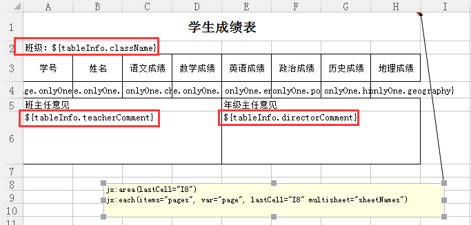


　　直接取新加入的 map 的键名，再 “点上”tableInfo 的键名。


　　就这样轻松的取出来了。Map 也是可以直接放进 model 中的，有时候 Map 用起来更加灵活，这就要自行选择了。

## **二、使用工具**

　　工具的使用先看 JxlsUtils 类。

```java
public class JxlsUtils{
    public static void exportExcel(InputStream is, OutputStream os, Map<String, Object> model) throws IOException{
        Context context = PoiTransformer.createInitialContext();
        if (model != null) {
            for (String key : model.keySet()) {
                context.putVar(key, model.get(key));
            }
        }
        JxlsHelper jxlsHelper = JxlsHelper.getInstance();
        Transformer transformer  = jxlsHelper.createTransformer(is, os);
        //获得配置
        JexlExpressionEvaluator evaluator = (JexlExpressionEvaluator)transformer.getTransformationConfig().getExpressionEvaluator();
        //设置静默模式，不报警告
        evaluator.getJexlEngine().setSilent(true);
        //函数强制，自定义功能
        Map<String, Object> funcs = new HashMap<String, Object>();
        funcs.put("utils", new JxlsUtils());    //添加自定义功能
        evaluator.getJexlEngine().setFunctions(funcs);
        //必须要这个，否者表格函数统计会错乱
        jxlsHelper.setUseFastFormulaProcessor(false).processTemplate(context, transformer);
    }
    public static void exportExcel(File xls, File out, Map<String, Object> model) throws FileNotFoundException, IOException {
            exportExcel(new FileInputStream(xls), new FileOutputStream(out), model);
    }
    public static void exportExcel(String templatePath, OutputStream os, Map<String, Object> model) throws Exception {
        File template = getTemplate(templatePath);
        if(template != null){
            exportExcel(new FileInputStream(template), os, model);    
        } else {
            throw new Exception("Excel 模板未找到。");
        }
    }
    //获取jxls模版文件
    public static File getTemplate(String path){
        File template = new File(path);
        if(template.exists()){
            return template;
        }
        return null;
    }    
    // 日期格式化
    public String dateFmt(Date date, String fmt) {
        if (date == null) {
            return "";
        }
        try {
            SimpleDateFormat dateFmt = new SimpleDateFormat(fmt);
            return dateFmt.format(date);
        } catch (Exception e) {
            e.printStackTrace();
        }
        return "";
    }
    // if判断
    public Object ifelse(boolean b, Object o1, Object o2) {
        return b ? o1 : o2;
    }
}
```

　　我们看到有一行：funcs.put("utils", new JxlsUtils());   // 添加自定义功能

```java
//函数强制，自定义功能
Map<String, Object> funcs = new HashMap<String, Object>();
funcs.put("utils", new JxlsUtils());    //添加自定义功能
evaluator.getJexlEngine().setFunctions(funcs);
```


　　这行代码的意思就是设置一个工具类 JxlsUtils()，在 excel 中的引用为 utils 。当你在 excel 中使用 utils 时就会调用 JxlsUtils() 类（可以是其他的类）的对应方法。

　　我们来看下模板怎么写：

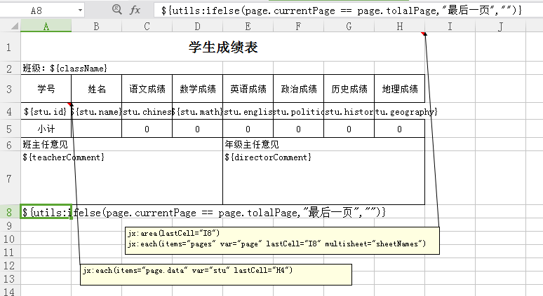


　　在模板中，你可以这样调用工具类：

`${utils:ifelse(page.currentPage == page.tolalPage,"最后一页","")}`

　　JXLS 会自动找到 utils 这个键对应的值 new JxlsUtils() ，然后在 JxlsUtils 类中找对应的 ifelse 方法，然后根据方法接收的参数自动把你在 excel 写的参数传进去，再把方法的返回值显示在 excel 中。


　　还记得我前面保存进 Page 中的当前页码和总页码这两个属性吗？现在就是使用使用他们了。用他们可以判断现在的 sheet 是不是最后一页，最后一页可以显示一些别的数据。一般说 ifelse 这个已经够用了，但是如果你有更加复杂的操作，你也可以自行定制自己需要的工具类。


## **三、JXLS 是支持模板多个 sheet 输出数据的**

　　这句话很奇怪，但是我一下子没想出别的表达。这个多 sheet 不是前面我们讲的分 sheet，是说你模板有本身就已经有很多个 sheet 了，每个 sheet 显示的表都不一样，不用担心，你存放进 model 中的数据是可以跨 sheet 的。只要你想取出就能取出，这个我就不演示了。


## **四、页面边距 bug**

　　这个 bug 一般人是真没有发现的，但是对我来说就是差点要了老命.... 我们公司项目导出的 excel 报表比较大，一张 A3 纸都只是勉勉强强够打印。所以平常边距要设定得很小，这个边距的 bug 就是你在模板中设定的页面边距并不会拷贝进你导出的文件的。


　　你可能试验了一下说，没有啊，我的没问题啊。我说的不会拷贝仅是在分页分 sheet 导出时候出现的问题。我举个例子，你在模板中设定了页面边距，然后导出，JXLS 会先把你的模板复制进导出的文件中，然后建立一个新的 sheet，然后在根据模板的设定把内容拷贝进新 sheet 中，然后再建立新 sheet 不断循环。


　　问题就出现在把模板拷进新 sheet 的过程中，如果你改变了模板的页面边距，再进行一个分 sheet 导出，不要用 POi 删除导出文件第一页空的模板 sheet，你查看第一页的页边距你发现是已经修改过的页边距，而你查看后面其他 sheet 的页边距就会是 excel 默认的页边距了。

　　不明白不要紧，你只要知道我已经解决了就好（新版本 2.4.2 我不知道作者有没有修复）。

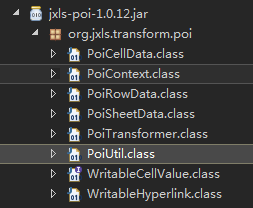


　　问题就出现在这个 PoiUtil 的文件上，我们打开看看，看到 copySheetProperties(Sheet src, Sheet dest) 这个方法，这个方法就是拷贝 sheet 属性的。

```java
public static void copySheetProperties(Sheet src, Sheet dest){
        dest.setAutobreaks(src.getAutobreaks());
        dest.setDisplayGridlines(src.isDisplayGridlines());
        dest.setVerticallyCenter(src.getVerticallyCenter());
        dest.setFitToPage(src.getFitToPage());
        dest.setForceFormulaRecalculation(src.getForceFormulaRecalculation());
        dest.setRowSumsRight(src.getRowSumsRight());
        dest.setRowSumsBelow( src.getRowSumsBelow() );
        //增加页边距保存
        dest.setMargin(Sheet.TopMargin, src.getMargin(Sheet.TopMargin));
        dest.setMargin(Sheet.LeftMargin, src.getMargin(Sheet.LeftMargin));
        dest.setMargin(Sheet.RightMargin, src.getMargin(Sheet.RightMargin));
        dest.setMargin(Sheet.BottomMargin, src.getMargin(Sheet.BottomMargin));
        
        copyPrintSetup(src, dest);
    }
```


　　这个方法内少写了对 sheet 页边距的拷贝，加上就行。加上后怎么放回包里？你可以自行打包.... 你也可以在你的项目目录上建立一个与 PoiUtil 类一模一样的路径，然后在里面放上修改后的类。Java 在找包时候会优先找你写的路径，这样就覆盖掉了包路径了。

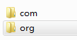

　　在 src 的根目录上，和 com 同级。

　　好了，这一篇文章就写到这里，写这篇文章时候我是懒的，我懒得再去做案例验证了，特别是最后的那个页边距的 bug，我在当初我在网络上根本找不到和我一样的问题。我也是花了些功夫才找到这个原因的。本来我应该做下案例把这个 bug 讲清楚些，但是我写到这里我已经有些懒了..... 说白了这个 bug 就是只有在分 sheet 导出时候才会出现的问题，能自己复现的就自己研究下，不能的，知道怎么解决了就行了。

　　**下载 PoiUtil 类：** [点这里下载](https://files.cnblogs.com/files/foxlee1024/PoiUtil.rar)

# （六）番外篇——导出图片（完结）

　　突然想起来有同学说过能不能导出图片，本来我是想说不懂的，后来我上官网查了查，还挺容易。我就简短的写一写怎么导出图片。

　　官方提供了导出图片标签：

`jx:image(lastCell="D10" src="image" imageType="PNG")`

　　这是在 java 中的代码调用：


```java
InputStream imageInputStream = ImageDemo.class.getResourceAsStream("business.png");
byte[] imageBytes = Util.toByteArray(imageInputStream);
context.putVar("image", imageBytes);
```

　　我把他写进以前的源码中，给同学们看看怎么导出图片。

　　还记得以前写过一个 person 类吗？

```java
public class Person {
    String id;
    String name;
    Integer age;
    byte[] img;
/** 省略构造器和get/set方法 */
}
```

　　我们加入一个新的属性 byte[] ，byte 数组 img。

　　然后我们看看 main 方法怎么写。

```java
public static void main(String[] args) throws Exception {
        // 模板位置，输出流
        String templatePath = "E:/template3.xls";
        OutputStream os = new FileOutputStream("E:/out4.xls");
        // 文件流，输入一张叫fly的png图片
        InputStream imageInputStream = new FileInputStream("E:/fly.png");
　　　　 // 使用工具方法把流转成byte数组
        byte[] imageBytes = Util.toByteArray(imageInputStream);
        
        // 一个装有对象数据的链表
        List<Person> persons = new ArrayList<Person>();
        Person p1 = new Person("001", "张三", 18);
        Person p2 = new Person("002", "李四", 19);
        Person p3 = new Person("003", "王五", 20);
　　　　 // 把图片转换的字节数组存进person对象中
        p1.setImg(imageBytes);
        p2.setImg(imageBytes);
        p3.setImg(imageBytes);
        persons.add(p1);
        persons.add(p2);
        persons.add(p3);

        Map<String, Object> model = new HashMap<String, Object>();
        model.put("person", persons);    // 把链表放进model中        
        JxlsUtils.exportExcel(templatePath, os, model);
        os.close();
        System.out.println("完成");
}
```

　　代码中有个流转字节数组的工具类 Util.toByteArray，这个工具类文章后我会提供下载链接。

　　下面看下导出模板：

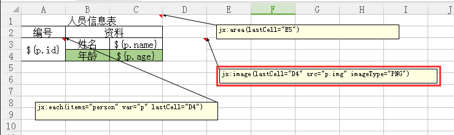


　　老生常谈的就不说了，说下画红框框的：

`jx:image(lastCell="D4" src="p.img" imageType="PNG")`


　　这是一个用来导出图片的标签，依照官方说明 imageType 图片类型默认是 PNG，支持：PNG, JPEG, EMF, WMF, PICT, DIB。

　　src 是 model 中传入的字节数组 byte[]。

　　lastCell 是图片结束位置，会自动拉伸填充完你定义的格子。比如你在 A1 中加入了这个注解，lastCell 写 C6，就会把 A1 到 C6 都拉伸填充完。

　　行，执行代码导出吧。 

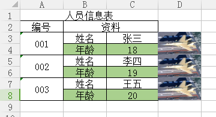


　　这里是把字节数组放在遍历对象里的遍历出来的，你要是不想遍历，而是只想显示一张图片，你看了这么多篇我写的文章，应该不用我说该怎么做吧？就是直接把字节数组放进 model 中，在 excel 中取出就行了。

　　官方图片导出简介：

　　http://jxls.sourceforge.net/reference/image_command.html#

　　下载工具类依赖的 jar 包：[commons-codec-1.10.rar](https://files.cnblogs.com/files/foxlee1024/commons-codec-1.10.rar)


　
