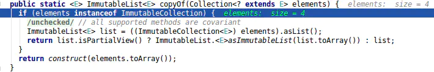

# Google Guava官方教程（中文版）

[github guava](https://github.com/google/guava/wiki)

Google Guava 中文教程:https://wizardforcel.gitbooks.io/guava-tutorial/content/index.html

**引言**

Guava工程包含了若干被Google的 Java项目广泛依赖 的核心库，例如：集合 [collections] 、缓存 [caching] 、原生类型支持 [primitives support] 、并发库 [concurrency libraries] 、通用注解 [common annotations] 、字符串处理 [string processing] 、I/O 等等。 所有这些工具每天都在被Google的工程师应用在产品服务中。

查阅Javadoc并不一定是学习这些库最有效的方式。在此，我们希望通过此文档为Guava中最流行和最强大的功能，提供更具可读性和解释性的说明。

***译文格式说明***

- Guava中的类被首次引用时，都会链接到Guava的API文档。如：[Optional](http://docs.guava-libraries.googlecode.com/git-history/release/javadoc/com/google/common/base/Optional.html)。
- Guava和JDK中的方法被引用时，一般都会链接到Guava或JDK的API文档，一些人所共知的JDK方法除外。如：`[Optional.of(T)](http://docs.guava-libraries.googlecode.com/git-history/release/javadoc/com/google/common/base/Optional.html#of%28T%29)`, Map.get(key)。
- 译者对文档的额外说明以斜体显示，并且以“*译者注__：*”开始。

## 1. 基本工具 [Basic utilities]

让使用Java语言变得更舒适

1.1 [使用和避免null](http://ifeve.com/using-and-avoiding-null/)：null是模棱两可的，会引起令人困惑的错误，有些时候它让人很不舒服。很多Guava工具类用快速失败拒绝null值，而不是盲目地接受

1.2 [前置条件](http://ifeve.com/google-guava-preconditions/): 让方法中的条件检查更简单

1.3 [常见Object方法](http://ifeve.com/google-guava-commonobjectutilities/): 简化Object方法实现，如hashCode()和toString()

1.4 [排序: Guava强大的”流畅风格比较器”](http://ifeve.com/google-guava-ordering/)

1.5 [Throwables](http://ifeve.com/google-guava-throwables/)：简化了异常和错误的传播与检查

## 2. 集合[Collections]

Guava对JDK集合的扩展，这是Guava最成熟和为人所知的部分

2.1 [不可变集合](http://ifeve.com/google-guava-immutablecollections/): 用不变的集合进行防御性编程和性能提升。

2.2 [新集合类型](http://ifeve.com/google-guava-newcollectiontypes/): multisets, multimaps, tables, bidirectional maps等

2.3 [强大的集合工具类](http://ifeve.com/google-guava-collectionutilities/): 提供java.util.Collections中没有的集合工具

2.4 [扩展工具类](http://ifeve.com/google-guava-collectionhelpersexplained/)：让实现和扩展集合类变得更容易，比如创建`Collection`的装饰器，或实现迭代器

## 3. [缓存](http://ifeve.com/google-guava-cachesexplained)[Caches]

Guava Cache：本地缓存实现，支持多种缓存过期策略

## 4. [函数式风格](http://ifeve.com/google-guava-functional/)[Functional idioms]

Guava的函数式支持可以显著简化代码，但请谨慎使用它

## 5. 并发[Concurrency]

强大而简单的抽象，让编写正确的并发代码更简单

5.1 [ListenableFuture](http://ifeve.com/google-guava-listenablefuture/)：完成后触发回调的Future

5.2 [Service框架](http://ifeve.com/google-guava-serviceexplained/)：抽象可开启和关闭的服务，帮助你维护服务的状态逻辑

## 6. [字符串处理](http://ifeve.com/google-guava-strings/)[Strings]

非常有用的字符串工具，包括分割、连接、填充等操作

## 7. [原生类型](http://ifeve.com/google-guava-primitives/)[Primitives]

扩展 JDK 未提供的原生类型（如int、char）操作， 包括某些类型的无符号形式

## 8. [区间](http://ifeve.com/google-guava-ranges/)[Ranges]

可比较类型的区间API，包括连续和离散类型

## 9. [I/O](http://ifeve.com/google-guava-io/)

简化I/O尤其是I/O流和文件的操作，针对Java5和6版本

## 10. [散列](http://ifeve.com/google-guava-hashing/)[Hash]

提供比`Object.hashCode()`更复杂的散列实现，并提供布鲁姆过滤器的实现

## 11. [事件总线](http://ifeve.com/google-guava-eventbus/)[EventBus]

发布-订阅模式的组件通信，但组件不需要显式地注册到其他组件中

## 12. [数学运算](http://ifeve.com/google-guava-math/)[Math]

优化的、充分测试的数学工具类

## 13. [反射](http://ifeve.com/guava-reflection/)[Reflection]

Guava 的 Java 反射机制工具类

# 1-基本工具

## 1.1-使用Optional和避免null

*[Doug Lea](http://en.wikipedia.org/wiki/Doug_Lea) 说，“Null 真糟糕。”*

*当[Sir C. A. R. Hoare](http://en.wikipedia.org/wiki/C._A._R._Hoare) 使用了null引用后说，”使用它导致了十亿美金的错误。”*

轻率地使用null可能会导致很多令人惊愕的问题。通过学习Google底层代码库，我们发现95%的集合类不接受null值作为元素。我们认为， 相比默默地接受null，使用快速失败操作拒绝null值对开发者更有帮助。

此外，Null的含糊语义让人很不舒服。Null很少可以明确地表示某种语义，例如，Map.get(key)返回Null时，可能表示map中的值是null，亦或map中没有key对应的值。Null可以表示失败、成功或几乎任何情况。使用Null以外的特定值，会让你的逻辑描述变得更清晰。

Null确实也有合适和正确的使用场景，如在性能和速度方面Null是廉价的，而且在对象数组中，出现Null也是无法避免的。但相对于底层库来说，在应用级别的代码中，Null往往是导致混乱，疑难问题和模糊语义的元凶，就如同我们举过的Map.get(key)的例子。最关键的是，Null本身没有定义它表达的意思。

鉴于这些原因，很多Guava工具类对Null值都采用快速失败操作，除非工具类本身提供了针对Null值的因变措施。此外，Guava还提供了很多工具类，让你更方便地用特定值替换Null值。

### **具体案例**

不要在Set中使用null，或者把null作为map的键值。使用特殊值代表null会让查找操作的语义更清晰。

如果你想把null作为map中某条目的值，更好的办法是 不把这一条目放到map中，而是单独维护一个”值为null的键集合” (null keys)。Map 中对应某个键的值是null，和map中没有对应某个键的值，是非常容易混淆的两种情况。因此，最好把值为null的键分离开，并且仔细想想，null值的键在你的项目中到底表达了什么语义。

如果你需要在列表中使用null——并且这个列表的数据是稀疏的，使用Map<Integer, E>可能会更高效，并且更准确地符合你的潜在需求。

此外，考虑一下使用自然的null对象——特殊值。举例来说，为某个enum类型增加特殊的枚举值表示null，比如java.math.RoundingMode就定义了一个枚举值UNNECESSARY，它表示一种不做任何舍入操作的模式，用这种模式做舍入操作会直接抛出异常。

如果你真的需要使用null值，但是null值不能和Guava中的集合实现一起工作，你只能选择其他实现。比如，用JDK中的Collections.unmodifiableList替代Guava的ImmutableList

### **Optional**

大多数情况下，开发人员使用null表明的是某种缺失情形：可能是已经有一个默认值，或没有值，或找不到值。例如，Map.get返回null就表示找不到给定键对应的值。

Guava用[Optional](http://docs.guava-libraries.googlecode.com/git-history/release/javadoc/com/google/common/base/Optional.html)表示可能为null的T类型引用。一个Optional实例可能包含非null的引用（我们称之为引用存在），也可能什么也不包括（称之为引用缺失）。它从不说包含的是null值，而是用存在或缺失来表示。但Optional从不会包含null值引用。

```java
Optional<Integer> possible = Optional.of(5);

possible.isPresent(); // returns true

possible.get(); // returns 5
```

Optional无意直接模拟其他编程环境中的”可选” or “可能”语义，但它们的确有相似之处。

Optional最常用的一些操作被罗列如下：

**创建Optional实例（以下都是静态方法）：**

| [`Optional.of(T)`](http://docs.guava-libraries.googlecode.com/git-history/release/javadoc/com/google/common/base/Optional.html#of(T)) | 创建指定引用的Optional实例，若引用为null则快速失败 |
| :----------------------------------------------------------- | :------------------------------------------------- |
| [`Optional.absent()`](http://docs.guava-libraries.googlecode.com/git-history/release/javadoc/com/google/common/base/Optional.html#absent()) | 创建引用缺失的Optional实例                         |
| [`Optional.fromNullable(T)`](http://docs.guava-libraries.googlecode.com/git-history/release/javadoc/com/google/common/base/Optional.html#fromNullable(T)) | 创建指定引用的Optional实例，若引用为null则表示缺失 |

**用Optional实例查询引用（以下都是非静态方法）：**

| [`boolean isPresent()`](http://docs.guava-libraries.googlecode.com/git-history/release/javadoc/com/google/common/base/Optional.html#isPresent()) | 如果Optional包含非null的引用（引用存在），返回true           |
| :----------------------------------------------------------- | :----------------------------------------------------------- |
| [`T get()`](http://docs.guava-libraries.googlecode.com/git-history/release/javadoc/com/google/common/base/Optional.html#get()) | 返回Optional所包含的引用，若引用缺失，则抛出java.lang.IllegalStateException |
| [`T or(T)`](http://docs.guava-libraries.googlecode.com/git-history/release/javadoc/com/google/common/base/Optional.html#or(T)) | 返回Optional所包含的引用，若引用缺失，返回指定的值           |
| [`T orNull()`](http://docs.guava-libraries.googlecode.com/git-history/release/javadoc/com/google/common/base/Optional.html#orNull()) | 返回Optional所包含的引用，若引用缺失，返回null               |
| [`Set asSet()`](http://docs.guava-libraries.googlecode.com/git-history/release/javadoc/com/google/common/base/Optional.html#asSet()) | 返回Optional所包含引用的单例不可变集，如果引用存在，返回一个只有单一元素的集合，如果引用缺失，返回一个空集合。 |

### **使用**Optional**的意义在哪儿？**

使用Optional除了赋予null语义，增加了可读性，最大的优点在于它是一种傻瓜式的防护。Optional迫使你积极思考引用缺失的情况，因为你必须显式地从Optional获取引用。直接使用null很容易让人忘掉某些情形，尽管FindBugs可以帮助查找null相关的问题，但是我们还是认为它并不能准确地定位问题根源。

如同输入参数，方法的返回值也可能是null。和其他人一样，你绝对很可能会忘记别人写的方法method(a,b)会返回一个null，就好像当你实现method(a,b)时，也很可能忘记输入参数a可以为null。将方法的返回类型指定为Optional，也可以迫使调用者思考返回的引用缺失的情形。

**其他处理null的便利方法**

当你需要用一个默认值来替换可能的null，请使用[`Objects.firstNonNull(T, T)`](http://docs.guava-libraries.googlecode.com/git-history/release/javadoc/com/google/common/base/Objects.html#firstNonNull(T, T)) 方法。如果两个值都是null，该方法会抛出NullPointerException。Optional也是一个比较好的替代方案，例如：Optional.of(first).or(second).

还有其它一些方法专门处理null或空字符串：[emptyToNull(String)](http://docs.guava-libraries.googlecode.com/git-history/release/javadoc/com/google/common/base/Strings.html#emptyToNull(java.lang.String))，[`nullToEmpty(String)`](http://docs.guava-libraries.googlecode.com/git-history/release/javadoc/com/google/common/base/Strings.html#nullToEmpty(java.lang.String))`，`[`isNullOrEmpty(String)`](http://docs.guava-libraries.googlecode.com/git-history/release/javadoc/com/google/common/base/Strings.html#isNullOrEmpty(java.lang.String))。我们想要强调的是，这些方法主要用来与混淆null/空的API进行交互。当每次你写下混淆null/空的代码时，Guava团队都泪流满面。（好的做法是积极地把null和空区分开，以表示不同的含义，在代码中把null和空同等对待是一种令人不安的坏味道。

## 1.2-前置条件Preconditions

前置条件：让方法调用的前置条件判断更简单。

Guava在[Preconditions](http://docs.guava-libraries.googlecode.com/git-history/release/javadoc/com/google/common/base/Preconditions.html)类中提供了若干前置条件判断的实用方法，我们强烈建议[在Eclipse中静态导入这些方法](http://ifeve.com/eclipse-static-import/)。每个方法都有三个变种：

- 没有额外参数：抛出的异常中没有错误消息；
- 有一个Object对象作为额外参数：抛出的异常使用Object.toString() 作为错误消息；
- 有一个String对象作为额外参数，并且有一组任意数量的附加Object对象：这个变种处理异常消息的方式有点类似printf，但考虑GWT的兼容性和效率，只支持%s指示符。例如：

```java
checkArgument(i >= 0, "Argument was %s but expected nonnegative", i);
checkArgument(i < j, "Expected i < j, but %s > %s", i, j);
```

| **方法声明（不包括额外参数）**                               | **描述**                                                     | **检查失败时抛出的异常**  |
| :----------------------------------------------------------- | :----------------------------------------------------------- | :------------------------ |
| [`checkArgument(boolean)`](http://docs.guava-libraries.googlecode.com/git-history/release/javadoc/com/google/common/base/Preconditions.html#checkArgument(boolean)) | 检查boolean是否为true，用来检查传递给方法的参数。            | IllegalArgumentException  |
| [`checkNotNull(T)`](http://docs.guava-libraries.googlecode.com/git-history/release/javadoc/com/google/common/base/Preconditions.html#checkNotNull(T)) | 检查value是否为null，该方法直接返回value，因此可以内嵌使用checkNotNull。 | NullPointerException      |
| [`checkState(boolean)`](http://docs.guava-libraries.googlecode.com/git-history/release/javadoc/com/google/common/base/Preconditions.html#checkState(boolean)) | 用来检查对象的某些状态。                                     | IllegalStateException     |
| [`checkElementIndex(int index, int size)`](http://docs.guava-libraries.googlecode.com/git-history/release/javadoc/com/google/common/base/Preconditions.html#checkElementIndex(int, int)) | 检查index作为索引值对某个列表、字符串或数组是否有效。index>=0 && index<size * | IndexOutOfBoundsException |
| [`checkPositionIndex(int index, int size)`](http://docs.guava-libraries.googlecode.com/git-history/release/javadoc/com/google/common/base/Preconditions.html#checkPositionIndex(int, int)) | 检查index作为位置值对某个列表、字符串或数组是否有效。index>=0 && index<=size * | IndexOutOfBoundsException |
| [`checkPositionIndexes(int start, int end, int size)`](http://docs.guava-libraries.googlecode.com/git-history/release/javadoc/com/google/common/base/Preconditions.html#checkPositionIndexes(int, int, int)) | 检查[start, end]表示的位置范围对某个列表、字符串或数组是否有效* | IndexOutOfBoundsException |

*译者注：*

**索引值常用来查找列表、字符串或数组中的元素，如**List.get(int), String.charAt(int)*

**位置值和位置范围常用来截取列表、字符串或数组，如List.subList(int，int), String.substring(int)*

相比Apache Commons提供的类似方法，我们把Guava中的Preconditions作为首选。Piotr Jagielski在[他的博客](http://piotrjagielski.com/blog/google-guava-vs-apache-commons-for-argument-validation/)中简要地列举了一些理由：

- 在静态导入后，Guava方法非常清楚明晰。checkNotNull清楚地描述做了什么，会抛出什么异常；
- checkNotNull直接返回检查的参数，让你可以在构造函数中保持字段的单行赋值风格：this.field = checkNotNull(field)
- 简单的、参数可变的printf风格异常信息。鉴于这个优点，在JDK7已经引入[Objects.requireNonNull](http://docs.oracle.com/javase/7/docs/api/java/util/Objects.html#requireNonNull(java.lang.Object,java.lang.String))的情况下，我们仍然建议你使用checkNotNull。

*在编码时，如果某个值有多重的前置条件，我们建议你把它们放到不同的行，这样有助于在调试时定位。此外，把每个前置条件放到不同的行，也可以帮助你编写清晰和有用的错误消息。*

## 1.3-常见Object方法

### **equals**

当一个对象中的字段可以为null时，实现Object.equals方法会很痛苦，因为不得不分别对它们进行null检查。使用[`Objects.equal`](http://docs.guava-libraries.googlecode.com/git-history/release/javadoc/com/google/common/base/Objects.html#equal(java.lang.Object, java.lang.Object))帮助你执行null敏感的equals判断，从而避免抛出NullPointerException。例如:

```java
Objects.equal("a", "a"); // returns true
Objects.equal(null, "a"); // returns false
Objects.equal("a", null); // returns false
Objects.equal(null, null); // returns true
```

*注意：JDK7引入的Objects类提供了一样的方法*[`_Objects.equals_`](http://docs.oracle.com/javase/7/docs/api/java/util/Objects.html#equals(java.lang.Object, java.lang.Object))*。*

### **hashCode**

用对象的所有字段作散列[hash]运算应当更简单。Guava的[`Objects.hashCode(Object...)`](http://docs.guava-libraries.googlecode.com/git-history/release/javadoc/com/google/common/base/Objects.html#hashCode(java.lang.Object...))会对传入的字段序列计算出合理的、顺序敏感的散列值。你可以使用Objects.hashCode(field1, field2, …, fieldn)来代替手动计算散列值。

*注意：JDK7引入的Objects类提供了一样的方法*[`_Objects.hash(Object...)_`](http://docs.oracle.com/javase/7/docs/api/java/util/Objects.html#hash(java.lang.Object...))

### **toString**

好的toString方法在调试时是无价之宝，但是编写toString方法有时候却很痛苦。使用 [Objects.toStringHelper](http://docs.guava-libraries.googlecode.com/git-history/release/javadoc/com/google/common/base/Objects.html#toStringHelper(java.lang.Object))可以轻松编写有用的toString方法。例如：

```java
// Returns "ClassName{x=1}"
Objects.toStringHelper(this).add("x", 1).toString();
// Returns "MyObject{x=1}"
Objects.toStringHelper("MyObject").add("x", 1).toString();
```

### **compare/compareTo**

实现一个比较器[Comparator]，或者直接实现Comparable接口有时也伤不起。考虑一下这种情况：

```java
class Person implements Comparable<Person> {
  private String lastName;
  private String firstName;
  private int zipCode;

  public int compareTo(Person other) {
    int cmp = lastName.compareTo(other.lastName);
    if (cmp != 0) {
      return cmp;
    }
    cmp = firstName.compareTo(other.firstName);
    if (cmp != 0) {
      return cmp;
    }
    return Integer.compare(zipCode, other.zipCode);
  }
}
```

这部分代码太琐碎了，因此很容易搞乱，也很难调试。我们应该能把这种代码变得更优雅，为此，Guava提供了[`ComparisonChain`](http://docs.guava-libraries.googlecode.com/git-history/release/javadoc/com/google/common/collect/ComparisonChain.html)。

ComparisonChain执行一种懒比较：它执行比较操作直至发现非零的结果，在那之后的比较输入将被忽略。

```java
public int compareTo(Foo that) {
    return ComparisonChain.start()
            .compare(this.aString, that.aString)
            .compare(this.anInt, that.anInt)
            .compare(this.anEnum, that.anEnum, Ordering.natural().nullsLast())
            .result();
}
```

这种[Fluent接口](http://en.wikipedia.org/wiki/Fluent_interface)风格的可读性更高，发生错误编码的几率更小，并且能避免做不必要的工作。更多Guava排序器工具可以在下一节里找到。

## 1.4-排序Ordering: Guava强大的”流畅风格比较器”

[排序器[Ordering\]](http://docs.guava-libraries.googlecode.com/git-history/release/javadoc/com/google/common/collect/Ordering.html)是Guava流畅风格比较器[Comparator]的实现，它可以用来为构建复杂的比较器，以完成集合排序的功能。

从实现上说，Ordering实例就是一个特殊的Comparator实例。Ordering把很多基于Comparator的静态方法（如Collections.max）包装为自己的实例方法（非静态方法），并且提供了链式调用方法，来定制和增强现有的比较器。

**创建排序器**：常见的排序器可以由下面的静态方法创建

| **方法**                                                     | **描述**                                               |
| :----------------------------------------------------------- | :----------------------------------------------------- |
| [`natural()`](http://docs.guava-libraries.googlecode.com/git-history/release/javadoc/com/google/common/collect/Ordering.html#natural()) | 对可排序类型做自然排序，如数字按大小，日期按先后排序   |
| [`usingToString()`](http://docs.guava-libraries.googlecode.com/git-history/release/javadoc/com/google/common/collect/Ordering.html#usingToString()) | 按对象的字符串形式做字典排序[lexicographical ordering] |
| [`from(Comparator)`](http://docs.guava-libraries.googlecode.com/git-history/release/javadoc/com/google/common/collect/Ordering.html#from(java.util.Comparator)) | 把给定的Comparator转化为排序器                         |

实现自定义的排序器时，除了用上面的from方法，也可以跳过实现Comparator，而直接继承Ordering：

```java
Ordering<String> byLengthOrdering = new Ordering<String>() {
  public int compare(String left, String right) {
    return Ints.compare(left.length(), right.length());
  }
};
```

**链式调用方法**：通过链式调用，可以由给定的排序器衍生出其它排序器

| **方法**                                                     | **描述**                                                     |
| :----------------------------------------------------------- | :----------------------------------------------------------- |
| [`reverse()`](http://docs.guava-libraries.googlecode.com/git-history/release/javadoc/com/google/common/collect/Ordering.html#reverse()) | 获取语义相反的排序器                                         |
| [`nullsFirst()`](http://docs.guava-libraries.googlecode.com/git-history/release/javadoc/com/google/common/collect/Ordering.html#nullsFirst()) | 使用当前排序器，但额外把null值排到最前面。                   |
| [`nullsLast()`](http://docs.guava-libraries.googlecode.com/git-history/release/javadoc/com/google/common/collect/Ordering.html#nullsLast()) | 使用当前排序器，但额外把null值排到最后面。                   |
| [`compound(Comparator)`](http://docs.guava-libraries.googlecode.com/git-history/release/javadoc/com/google/common/collect/Ordering.html#compound(java.util.Comparator)) | 合成另一个比较器，以处理当前排序器中的相等情况。             |
| [`lexicographical()`](http://docs.guava-libraries.googlecode.com/git-history/release/javadoc/com/google/common/collect/Ordering.html#lexicographical()) | 基于处理类型T的排序器，返回该类型的可迭代对象Iterable<T>的排序器。 |
| [`onResultOf(Function)`](http://docs.guava-libraries.googlecode.com/git-history/release/javadoc/com/…le/common/collect/Ordering.html#onResultOf(com.google.common.base.Function)) | 对集合中元素调用Function，再按返回值用当前排序器排序。       |

例如，你需要下面这个类的排序器。

```java
class Foo {
    @Nullable String sortedBy;
    int notSortedBy;
}
```

考虑到排序器应该能处理sortedBy为null的情况，我们可以使用下面的链式调用来合成排序器：

```java
Ordering<Foo> ordering = Ordering.natural().nullsFirst().onResultOf(new Function<Foo, String>() {
  public String apply(Foo foo) {
    return foo.sortedBy;
  }
});
```

当阅读链式调用产生的排序器时，应该从后往前读。上面的例子中，排序器首先调用apply方法获取sortedBy值，并把sortedBy为null的元素都放到最前面，然后把剩下的元素按sortedBy进行自然排序。之所以要从后往前读，是因为每次链式调用都是用后面的方法包装了前面的排序器。

*注：用compound方法包装排序器时，就不应遵循从后往前读的原则。为了避免理解上的混乱，请不要把compound写在一长串链式调用的中间，你可以另起一行，在链中最先或最后调用compound。*

超过一定长度的链式调用，也可能会带来阅读和理解上的难度。我们建议按下面的代码这样，在一个链中最多使用三个方法。此外，你也可以把Function分离成中间对象，让链式调用更简洁紧凑。

```java
Ordering<Foo> ordering = Ordering.natural().nullsFirst().onResultOf(sortKeyFunction)
```

**运用排序器：**Guava的排序器实现有若干操纵集合或元素值的方法

| **方法**                                                     | **描述**                                                     | **另请参见**                                                 |
| :----------------------------------------------------------- | :----------------------------------------------------------- | :----------------------------------------------------------- |
| [`greatestOf(Iterable iterable, int k)`](http://docs.guava-libraries.googlecode.com/git-history/release/javadoc/com/google/common/collect/Ordering.html#greatestOf(java.lang.Iterable, int)) | 获取可迭代对象中最大的k个元素。                              | [`leastOf`](http://docs.guava-libraries.googlecode.com/git-history/release/javadoc/com/google/common/collect/Ordering.html#leastOf(java.lang.Iterable, int)) |
| [`isOrdered(Iterable)`](http://docs.guava-libraries.googlecode.com/git-history/release/javadoc/com/google/common/collect/Ordering.html#isOrdered(java.lang.Iterable)) | 判断可迭代对象是否已按排序器排序：允许有排序值相等的元素。   | [`isStrictlyOrdered`](http://docs.guava-libraries.googlecode.com/git-history/release/javadoc/com/google/common/collect/Ordering.html#isStrictlyOrdered(java.lang.Iterable)) |
| [`sortedCopy(Iterable)`](http://docs.guava-libraries.googlecode.com/git-history/release/javadoc/com/google/common/collect/Ordering.html#sortedCopy(java.lang.Iterable)) | 判断可迭代对象是否已严格按排序器排序：不允许排序值相等的元素。 | [`immutableSortedCopy`](http://docs.guava-libraries.googlecode.com/git-history/release/javadoc/com/google/common/collect/Ordering.html#immutableSortedCopy(java.lang.Iterable)) |
| [`min(E, E)`](http://docs.guava-libraries.googlecode.com/git-history/release/javadoc/com/google/common/collect/Ordering.html#min(E, E)) | 返回两个参数中最小的那个。如果相等，则返回第一个参数。       | [`max(E, E)`](http://docs.guava-libraries.googlecode.com/git-history/release/javadoc/com/google/common/collect/Ordering.html#max(E, E)) |
| [`min(E, E, E, E...)`](http://docs.guava-libraries.googlecode.com/git-history/release/javadoc/com/google/common/collect/Ordering.html#min(E, E, E, E...)) | 返回多个参数中最小的那个。如果有超过一个参数都最小，则返回第一个最小的参数。 | [`max(E, E, E, E...)`](http://docs.guava-libraries.googlecode.com/git-history/release/javadoc/com/google/common/collect/Ordering.html#max(E, E, E, E...)) |
| [`min(Iterable)`](http://docs.guava-libraries.googlecode.com/git-history/release/javadoc/com/google/common/collect/Ordering.html#min(java.lang.Iterable)) | 返回迭代器中最小的元素。如果可迭代对象中没有元素，则抛出NoSuchElementException。 | [`max(Iterable)`](http://docs.guava-libraries.googlecode.com/git-history/release/javadoc/com/google/common/collect/Ordering.html#max(java.lang.Iterable)), [`min(Iterator)`](http://docs.guava-libraries.googlecode.com/git-history/release/javadoc/com/google/common/collect/Ordering.html#min(java.util.Iterator)), [`max(Iterator)`](http://docs.guava-libraries.googlecode.com/git-history/release/javadoc/com/google/common/collect/Ordering.html#max(java.util.Iterator)) |

## 1.5-Throwables：简化异常和错误的传播与检查

### 异常传播

有时候，你会想把捕获到的异常再次抛出。这种情况通常发生在Error或RuntimeException被捕获的时候，你没想捕获它们，但是声明捕获Throwable和Exception的时候，也包括了了Error或RuntimeException。Guava提供了若干方法，来判断异常类型并且重新传播异常。例如：

```java
try {
    someMethodThatCouldThrowAnything();
} catch (IKnowWhatToDoWithThisException e) {
    handle(e);
} catch (Throwable t) {
    Throwables.propagateIfInstanceOf(t, IOException.class);
    Throwables.propagateIfInstanceOf(t, SQLException.class);
    throw Throwables.propagate(t);
}
```

所有这些方法都会自己决定是否要抛出异常，但也能直接抛出方法返回的结果——例如，throw Throwables.propagate(t);—— 这样可以向编译器声明这里一定会抛出异常。

Guava中的异常传播方法简要列举如下：

| [RuntimeException propagate(Throwable)](http://docs.guava-libraries.googlecode.com/git-history/release/javadoc/com/google/common/base/Throwables.html#propagate(java.lang.Throwable)) | 如果Throwable是Error或RuntimeException，直接抛出；否则把Throwable包装成RuntimeException抛出。返回类型是RuntimeException，所以你可以像上面说的那样写成`throw Throwables.propagate(t)`，Java编译器会意识到这行代码保证抛出异常。 |
| :----------------------------------------------------------- | :----------------------------------------------------------- |
| [void propagateIfInstanceOf( Throwable, Class) throws X](http://docs.guava-libraries.googlecode.com/git-history/release/javadoc/com/…rowables.html#propagateIfInstanceOf(java.lang.Throwable, java.lang.Class)) | Throwable类型为X才抛出                                       |
| [void propagateIfPossible( Throwable)](http://docs.guava-libraries.googlecode.com/git-history/release/javadoc/com/google/common/base/Throwables.html#propagateIfPossible(java.lang.Throwable)) | Throwable类型为Error或RuntimeException才抛出                 |
| [void propagateIfPossible( Throwable, Class) throws X](http://goo.gl/pgDJC) | Throwable类型为X, Error或RuntimeException才抛出              |

### Throwables.propagate的用法

#### 模仿Java7的多重异常捕获和再抛出

通常来说，如果调用者想让异常传播到栈顶，他不需要写任何catch代码块。因为他不打算从异常中恢复，他可能就不应该记录异常，或者有其他的动作。他可能是想做一些清理工作，但通常来说，无论操作是否成功，清理工作都要进行，所以清理工作可能会放在finallly代码块中。但有时候，捕获异常然后再抛出也是有用的：也许调用者想要在异常传播之前统计失败的次数，或者有条件地传播异常。

当只对一种异常进行捕获和再抛出时，代码可能还是简单明了的。但当多种异常需要处理时，却可能变得一团糟：

```java
@Override public void run() {
    try {
        delegate.run();
    } catch (RuntimeException e) {
        failures.increment();
        throw e;
    }catch (Error e) {
        failures.increment();
        throw e;
    }
}
```

Java7用多重捕获解决了这个问题：

```java
    } catch (RuntimeException | Error e) {
        failures.increment();
        throw e;
    }
```

非Java7用户却受困于这个问题。他们想要写如下代码来统计所有异常，但是编译器不允许他们抛出Throwable（*译者注：这种写法把原本是Error或RuntimeException类型的异常修改成了Throwable，因此调用者不得不修改方法签名*）：

```java
    } catch (Throwable t) {
        failures.increment();
        throw t;
    }
```

解决办法是用throw Throwables.propagate(t)替换throw t。在限定情况下（捕获Error和RuntimeException），Throwables.propagate和原始代码有相同行为。然而，用Throwables.propagate也很容易写出有其他隐藏行为的代码。尤其要注意的是，这个方案只适用于处理RuntimeException 或Error。如果catch块捕获了受检异常，你需要调用propagateIfInstanceOf来保留原始代码的行为，因为Throwables.propagate不能直接传播受检异常。

总之，Throwables.propagate的这种用法也就马马虎虎，在Java7中就没必要这样做了。在其他Java版本中，它可以减少少量的代码重复，但简单地提取方法进行重构也能做到这一点。此外，使用propagate会意外地包装受检异常。

#### 非必要用法：把抛出的Throwable转为Exception

有少数API，尤其是Java反射API和（以此为基础的）Junit，把方法声明成抛出Throwable。和这样的API交互太痛苦了，因为即使是最通用的API通常也只是声明抛出Exception。当确定代码会抛出Throwable，而不是Exception或Error时，调用者可能会用Throwables.propagate转化Throwable。这里有个用Callable执行Junit测试的范例：

```java
public Void call() throws Exception {
    try {
        FooTest.super.runTest();
    } catch (Throwable t) {
        Throwables.propagateIfPossible(t, Exception.class);
        Throwables.propagate(t);
    }

    return null;
}
```

在这儿没必要调用propagate()方法，因为propagateIfPossible传播了Throwable之外的所有异常类型，第二行的propagate就变得完全等价于throw new RuntimeException(t)。（题外话：这个例子也提醒我们，propagateIfPossible可能也会引起混乱，因为它不但会传播参数中给定的异常类型，还抛出Error和RuntimeException）

这种模式（或类似于throw new RuntimeException(t)的模式）在Google代码库中出现了超过30次。（搜索’propagateIfPossible[;](https://wizardforcel.gitbooks.io/guava-tutorial/content/7.html#fn_;)* Exception.class[)];’）绝大多数情况下都明确用了”throw new RuntimeException(t)”。我们也曾想过有个”throwWrappingWeirdThrowable”方法处理Throwable到Exception的转化。但考虑到我们用两行代码实现了这个模式，除非我们也丢弃propagateIfPossible方法，不然定义这个throwWrappingWeirdThrowable方法也并没有太大必要。

### Throwables.propagate的有争议用法

#### 争议一：把受检异常转化为非受检异常

原则上，非受检异常代表bug，而受检异常表示不可控的问题。但在实际运用中，即使JDK也有所误用——如Object.clone()、Integer. parseInt(String)、URI(String)——或者至少对某些方法来说，没有让每个人都信服的答案，如URI.create(String)的异常声明。

因此，调用者有时不得不把受检异常和非受检异常做相互转化：

```java
try {
    return Integer.parseInt(userInput);
} catch (NumberFormatException e) {
    throw new InvalidInputException(e);
}
try {
    return publicInterfaceMethod.invoke();
} catch (IllegalAccessException e) {
    throw new AssertionError(e);
}
```

有时候，调用者会使用Throwables.propagate转化异常。这样做有没有什么缺点？最主要的恐怕是代码的含义不太明显。throw Throwables.propagate(ioException)做了什么？throw new RuntimeException(ioException)做了什么？这两者做了同样的事情，但后者的意思更简单直接。前者却引起了疑问：”它做了什么？它并不只是把异常包装进RuntimeException吧？如果它真的只做了包装，为什么还非得要写个方法？”。应该承认，这些问题部分是因为”propagate”的语义太模糊了（用来[抛出未声明的异常吗](http://www.eishay.com/2011/11/throw-undeclared-checked-exception-in.html)？）。也许”wrapIfChecked”更能清楚地表达含义。但即使方法叫做”wrapIfChecked”，用它来包装一个已知类型的受检异常也没什么优点。甚至会有其他缺点：也许比起RuntimeException，还有更合适的类型——如IllegalArgumentException。 我们有时也会看到propagate被用于传播可能为受检的异常，结果是代码相比以前会稍微简短点，但也稍微有点不清晰：

```
} catch (RuntimeException e) {
    throw e;
}catch (Exception e) {
    throw new RuntimeException(e);
}
} catch (Exception e) {
 throw Throwables.propagate(e);
}
```

然而，我们似乎故意忽略了把检查型异常转化为非检查型异常的合理性。在某些场景中，这无疑是正确的做法，但更多时候它被用于避免处理受检异常。这让我们的话题变成了争论受检异常是不是坏主意了，我不想对此多做叙述。但可以这样说，Throwables.propagate不是为了鼓励开发者忽略IOException这样的异常。

#### 争议二：异常穿隧

但是，如果你要实现不允许抛出异常的方法呢？有时候你需要把异常包装在非受检异常内。这种做法挺好，但我们再次强调，没必要用propagate方法做这种简单的包装。实际上，手动包装可能更好：如果你手动包装了所有异常（而不仅仅是受检异常），那你就可以在另一端解包所有异常，并处理极少数特殊场景。此外，你可能还想把异常包装成特定的类型，而不是像propagate这样统一包装成RuntimeException。

#### 争议三：重新抛出其他线程产生的异常

```
try {
    return future.get();
} catch (ExecutionException e) {
    throw Throwables.propagate(e.getCause());
}
```

对这样的代码要考虑很多方面：

- ExecutionException的cause可能是受检异常，见上文”争议一：把检查型异常转化为非检查型异常”。但如果我们确定future对应的任务不会抛出受检异常呢？（可能future表示runnable任务的结果——*译者注：如__ExecutorService中的submit(Runnable task, T result)方法*）如上所述，你可以捕获异常并抛出AssertionError。尤其对于Future，请考虑 [Futures.get](http://docs.guava-libraries.googlecode.com/git/javadoc/com/google/common/util/concurrent/Futures.html#getUnchecked(java.util.concurrent.Future))方法。（TODO：对future.get()抛出的另一个异常InterruptedException作一些说明）
- ExecutionException的cause可能直接是Throwable类型，而不是Exception或Error。（实际上这不大可能，但你想直接重新抛出cause的话，编译器会强迫你考虑这种可能性）见上文”用法二：把抛出Throwable改为抛出Exception”。
- ExecutionException的cause可能是非受检异常。如果是这样的话，cause会直接被Throwables.propagate抛出。不幸的是，cause的堆栈信息反映的是异常最初产生的线程，而不是传播异常的线程。通常来说，最好在异常链中同时包含这两个线程的堆栈信息，就像ExecutionException所做的那样。（这个问题并不单单和propagate方法相关；所有在其他线程中重新抛出异常的代码都需要考虑这点）

### 异常原因链

Guava提供了如下三个有用的方法，让研究异常的原因链变得稍微简便了，这三个方法的签名是不言自明的：

| [Throwable getRootCause(Throwable)](http://docs.guava-libraries.googlecode.com/git-history/release/javadoc/com/google/common/base/Throwables.html#getRootCause(java.lang.Throwable)) |
| :----------------------------------------------------------- |
| [List getCausalChain(Throwable)](http://docs.guava-libraries.googlecode.com/git-history/release/javadoc/com/google/common/base/Throwables.html#getCausalChain(java.lang.Throwable)) |
| [String getStackTraceAsString(Throwable)](http://docs.guava-libraries.googlecode.com/git-history/release/javadoc/com/…ogle/common/base/Throwables.html#getStackTraceAsString(java.lang.Throwable)) |

# 2-集合

## 2.1-不可变集合

### 范例

```
public static final ImmutableSet<String> COLOR_NAMES = ImmutableSet.of(
        "red",
        "orange",
        "yellow",
        "green",
        "blue",
        "purple");

class Foo {
    Set<Bar> bars;
    Foo(Set<Bar> bars) {
        this.bars = ImmutableSet.copyOf(bars); // defensive copy!
    }
}
```

### 1、为什么需要不可变集合

- （1）保证线程安全：在并发程序中，使用Immutable既保证线程安全性，也大大增强了并发时的效率（跟并发锁方式相比）。尤其当一个对象是值对象时，更应该考虑采用Immutable方式；
- （2）被不可信的类库使用时会很安全；
- （3）如果一个对象不需要支持修改操作(mutation)，将会节省空间和时间的开销；经过分析，所有不可变的集合实现都比可变集合更加有效地利用内存；
- （4）可以当作一个常量来对待，并且这个对象在以后也不会被改变。

将一个对象复制一份成immutable的，是一个防御性编程技术。

### 2、JDK中提供的不可变集合：真的做到了不可变？

在JDK类库中很多集合(List、Set、Map等)都可以调用Collections类提供的静态方法unmodifiableXXX(…)来得到一个不可修改的视图，例如：


```php
// 下面的代码利用Collections.unmodifiableList(list)得到一个不可修改的集合unmodifiableList
List list = new ArrayList();
list.add("wyp");
list.add("good");

List unmodifiableList = Collections.unmodifiableList(list);
System.out.println(unmodifiableList);//[wyp, good]
unmodifiableList.add("add");
```

当unmodifiableList.add(“add”)时，运行代码将会出现以下异常：


```php
Exception in thread "main" java.lang.UnsupportedOperationException
at java.util.Collections$UnmodifiableCollection.add(Collections.java:1018)
at com.wyp.test.testFiles(test.java:152)
at com.wyp.test.main(test.java:160)
```

说明如果直接add是不可以的，符合不可变的定义。
 一切看起来很不错，因为调用unmodifiableList.add()会抛出一个java.lang.UnsupportedOperationException。**但如果有用户修改了list，会发生什么情况**？在上述代码的下面加入以下代码:


```csharp
list.add("add");
System.out.println(unmodifiableList);
```

当你再次打印unmodifiableList的时候，你会发现结果是[wyp, good, add]，**多了一个"add"元素**。unmodifiableList不是不可变的吗？这显然不是我们期望的。

**说明：Collections.unmodifiableList(…)实现的不是真正的不可变集合，当原始集合被修改后，不可变集合里面的元素也是跟着发生变化。**

##### 利用JDK类库中提供的unmodifiableXXX方法最少存在以下几点不足：

- 笨拙：因为你每次都得写那么多代码；
- 不安全：如果没有引用到原来的集合，这种情况之下才会返回唯一真正永恒不变的集合；
- 效率很低：返回的不可修改的集合数据结构仍然具有可变集合的所有开销。

源码：


### 3、Guava提供的Immutable：真正的不可变集合

Guava类库中提供的Immutable才是真正的不可修改的集合。


```swift
import com.google.common.collect.ImmutableList;
ImmutableList immutableList = ImmutableList.of("wyp", "good");
```

- 当你往immutableList 中添加元素，也会抛出java.lang.UnsupportedOperationException异常；

- 修改原集合后，immutable集合不变：
  ```
   public void testImmutable(){
   ArrayList<String> stringArrayList = Lists.newArrayList("wo","bu","ke","bian");
   ImmutableList<String> immutableList = ImmutableList.copyOf(stringArrayList);
   // 尝试add： java.lang.UnsupportedOperationException
   // immutableList.add("!!!");
  ```

  

  

  ```csharp
      // 尝试修改原集合：immutableList不变，还是 [wo, bu, ke, bian]
      stringArrayList.add("!!!");
      System.out.println(immutableList);
    }
  ```

##### 阅读源码：Guava Immutable的实现原理

单步调试走起：


1:调用copyOf方法

------



2：对传入的集合做类型判断


如果传入的结合本身就是一个不可变集合，那么asList获取视图后返回；如果不是，则执行construct方法；

------


3：再调用asImmutableList方法，依旧把原集合传进去

------


4：asImmutableList方法


上一步的checkNotNull方法将原集合转换成了对象数组传开了进来，同时传入了这个数组的长度，这里用case对长度做了判断，以分别处理：

- case 0：长度是0，那么of应该是返回一个空的不可变集合，而一般来说这个空的不可变集合是可以复用的；

- case 1：长度是1，那么直接用这个元素new一个对象实例；

- default：这里有个地方没看懂

  

  ```xml
   if (length < elements.length) {
         elements = arraysCopyOf(elements, length);
   }
  ```

这里是由上一步而来的：


asImmutableList(Object[] elements) --> ImmutableList<E> asImmutableList(Object[] elements, int length)

所以这里的length就是elements的length，那么这个if又有何意义？不明白...反正是直接执行


```cpp
return new RegularImmutableList<E>(elements);
```

了，接着往下看：


RegularImmutableList

这是一个内部类，直借截取了一部分，里面有一个copyIntoArray方法


copyIntoArray

经过一系列调用，得到了一个array


最后一步一步返回。

## 2.2-新集合类型

[原文链接](https://code.google.com/p/guava-libraries/wiki/NewCollectionTypesExplained) [译文链接](http://ifeve.com/google-guava-newcollectiontypes) **译者：**沈义扬，校对：丁一

Guava引入了很多JDK没有的、但我们发现明显有用的新集合类型。这些新类型是为了和JDK集合框架共存，而没有往JDK集合抽象中硬塞其他概念。作为一般规则，Guava集合非常精准地遵循了JDK接口契约。

### Multiset

统计一个词在文档中出现了多少次，传统的做法是这样的：

```
Map<String, Integer> counts = new HashMap<String, Integer>();
for (String word : words) {
    Integer count = counts.get(word);
    if (count == null) {
        counts.put(word, 1);
    } else {
        counts.put(word, count + 1);
    }
}
```

这种写法很笨拙，也容易出错，并且不支持同时收集多种统计信息，如总词数。我们可以做的更好。

Guava提供了一个新集合类型 [Multiset](http://docs.guava-libraries.googlecode.com/git/javadoc/com/google/common/collect/Multiset.html)，它可以多次添加相等的元素。维基百科从数学角度这样定义Multiset：”集合[set]概念的延伸，它的元素可以重复出现…与集合[set]相同而与元组[tuple]相反的是，Multiset元素的顺序是无关紧要的：Multiset {a, a, b}和{a, b, a}是相等的”。——*译者注：这里所说的集合__[set]是数学上的概念，Multiset继承自JDK中的Collection接口，而不是Set接口，所以包含重复元素并没有违反原有的接口契约。*

可以用两种方式看待Multiset：

- 没有元素顺序限制的ArrayList<E>
- Map<E, Integer>，键为元素，值为计数

Guava的Multiset API也结合考虑了这两种方式： 当把Multiset看成普通的Collection时，它表现得就像无序的ArrayList：

- add(E)添加单个给定元素
- iterator()返回一个迭代器，包含Multiset的所有元素（包括重复的元素）
- size()返回所有元素的总个数（包括重复的元素）

当把Multiset看作Map<E, Integer>时，它也提供了符合性能期望的查询操作：

- count(Object)返回给定元素的计数。HashMultiset.count的复杂度为O(1)，TreeMultiset.count的复杂度为O(log n)。
- entrySet()返回Set<Multiset.Entry<E>>，和Map的entrySet类似。
- elementSet()返回所有不重复元素的Set<E>，和Map的keySet()类似。
- 所有Multiset实现的内存消耗随着不重复元素的个数线性增长。

值得注意的是，除了极少数情况，Multiset和JDK中原有的Collection接口契约完全一致——具体来说，TreeMultiset在判断元素是否相等时，与TreeSet一样用compare，而不是Object.equals。另外特别注意，Multiset.addAll(Collection)可以添加Collection中的所有元素并进行计数，这比用for循环往Map添加元素和计数方便多了。

| **方法**                                                     | **描述**                                                     |
| :----------------------------------------------------------- | :----------------------------------------------------------- |
| [count(E)](http://docs.guava-libraries.googlecode.com/git/javadoc/com/google/common/collect/Multiset.html#count(java.lang.Object)) | 给定元素在Multiset中的计数                                   |
| [elementSet()](http://docs.guava-libraries.googlecode.com/git/javadoc/com/google/common/collect/Multiset.html#elementSet()) | Multiset中不重复元素的集合，类型为Set<E>                     |
| [entrySet()](http://docs.guava-libraries.googlecode.com/git/javadoc/com/google/common/collect/Multiset.html#entrySet()) | 和Map的entrySet类似，返回Set<Multiset.Entry<E>>，其中包含的Entry支持getElement()和getCount()方法 |
| [add(E, int)](http://docs.guava-libraries.googlecode.com/git/javadoc/com/google/common/collect/Multiset.html#add(java.lang.Object,int)) | 增加给定元素在Multiset中的计数                               |
| [remove(E, int)](http://docs.guava-libraries.googlecode.com/git-history/release/javadoc/com/google/common/collect/Multiset.html#remove(java.lang.Object, int)) | 减少给定元素在Multiset中的计数                               |
| [setCount(E, int)](http://docs.guava-libraries.googlecode.com/git-history/release/javadoc/com/google/common/collect/Multiset.html#setCount(E, int)) | 设置给定元素在Multiset中的计数，不可以为负数                 |
| size()                                                       | 返回集合元素的总个数（包括重复的元素）                       |

### Multiset不是Map

请注意，Multiset<E>不是Map<E, Integer>，虽然Map可能是某些Multiset实现的一部分。准确来说Multiset是一种Collection类型，并履行了Collection接口相关的契约。关于Multiset和Map的显著区别还包括：

- Multiset中的元素计数只能是正数。任何元素的计数都不能为负，也不能是0。elementSet()和entrySet()视图中也不会有这样的元素。
- multiset.size()返回集合的大小，等同于所有元素计数的总和。对于不重复元素的个数，应使用elementSet().size()方法。（因此，add(E)把multiset.size()增加1）
- multiset.iterator()会迭代重复元素，因此迭代长度等于multiset.size()。
- Multiset支持直接增加、减少或设置元素的计数。setCount(elem, 0)等同于移除所有elem。
- 对multiset 中没有的元素，multiset.count(elem)始终返回0。

### Multiset的各种实现

Guava提供了多种Multiset的实现，大致对应JDK中Map的各种实现：

| **Map**           | **对应的\****Multiset**                                      | **是否支持\****null***\*元素** |
| :---------------- | :----------------------------------------------------------- | :----------------------------- |
| HashMap           | [HashMultiset](http://docs.guava-libraries.googlecode.com/git/javadoc/com/google/common/collect/HashMultiset.html) | 是                             |
| TreeMap           | [TreeMultiset](http://docs.guava-libraries.googlecode.com/git/javadoc/com/google/common/collect/TreeMultiset.html) | 是（如果comparator支持的话）   |
| LinkedHashMap     | [LinkedHashMultiset](http://docs.guava-libraries.googlecode.com/git/javadoc/com/google/common/collect/LinkedHashMultiset.html) | 是                             |
| ConcurrentHashMap | [ConcurrentHashMultiset](http://docs.guava-libraries.googlecode.com/git/javadoc/com/google/common/collect/ConcurrentHashMultiset.html) | 否                             |
| ImmutableMap      | [ImmutableMultiset](http://docs.guava-libraries.googlecode.com/git/javadoc/com/google/common/collect/ImmutableMultiset.html) | 否                             |

### SortedMultiset

[SortedMultiset](http://docs.guava-libraries.googlecode.com/git/javadoc/com/google/common/collect/SortedMultiset.html)是Multiset 接口的变种，它支持高效地获取指定范围的子集。比方说，你可以用 latencies.subMultiset(0,BoundType.CLOSED, 100, BoundType.OPEN).size()来统计你的站点中延迟在100毫秒以内的访问，然后把这个值和latencies.size()相比，以获取这个延迟水平在总体访问中的比例。

TreeMultiset实现SortedMultiset接口。在撰写本文档时，ImmutableSortedMultiset还在测试和GWT的兼容性。

### Multimap

每个有经验的Java程序员都在某处实现过Map<K, List<V>>或Map<K, Set<V>>，并且要忍受这个结构的笨拙。例如，Map<K, Set<V>>通常用来表示非标定有向图。Guava的 [Multimap](http://docs.guava-libraries.googlecode.com/git/javadoc/com/google/common/collect/Multimap.html)可以很容易地把一个键映射到多个值。换句话说，Multimap是把键映射到任意多个值的一般方式。

可以用两种方式思考Multimap的概念：”键-单个值映射”的集合：

```
a -> 1 a -> 2 a ->4 b -> 3 c -> 5
```

或者”键-值集合映射”的映射：

```
a -> [1, 2, 4] b -> 3 c -> 5
```

一般来说，Multimap接口应该用第一种方式看待，但asMap()视图返回Map<K, Collection<V>>，让你可以按另一种方式看待Multimap。重要的是，不会有任何键映射到空集合：一个键要么至少到一个值，要么根本就不在Multimap中。

很少会直接使用Multimap接口，更多时候你会用ListMultimap或SetMultimap接口，它们分别把键映射到List或Set。

### 修改Multimap

[Multimap.get(key)](http://docs.guava-libraries.googlecode.com/git/javadoc/com/google/common/collect/Multimap.html#get(K))以集合形式返回键所对应的值视图，即使没有任何对应的值，也会返回空集合。ListMultimap.get(key)返回List，SetMultimap.get(key)返回Set。

对值视图集合进行的修改最终都会反映到底层的Multimap。例如：

```
Set<Person> aliceChildren = childrenMultimap.get(alice);
aliceChildren.clear();
aliceChildren.add(bob);
aliceChildren.add(carol);
```

其他（更直接地）修改Multimap的方法有：

| **方法签名**                                                 | **描述**                                                     | **等价于**                                                   |
| :----------------------------------------------------------- | :----------------------------------------------------------- | :----------------------------------------------------------- |
| [put(K, V)](http://docs.guava-libraries.googlecode.com/git-history/release/javadoc/com/google/common/collect/Multimap.html#put(K, V)) | 添加键到单个值的映射                                         | multimap.get(key).add(value)                                 |
| [putAll(K, Iterable)](http://docs.guava-libraries.googlecode.com/git-history/release/javadoc/com/google/common/collect/Multimap.html#putAll(K, java.lang.Iterable)) | 依次添加键到多个值的映射                                     | Iterables.addAll(multimap.get(key), values)                  |
| [remove(K, V)](http://docs.guava-libraries.googlecode.com/git-history/release/javadoc/com/google/common/collect/Multimap.html#remove(java.lang.Object, java.lang.Object)) | 移除键到值的映射；如果有这样的键值并成功移除，返回true。     | multimap.get(key).remove(value)                              |
| [removeAll(K)](http://docs.guava-libraries.googlecode.com/git-history/release/javadoc/com/google/common/collect/Multimap.html#removeAll(java.lang.Object)) | 清除键对应的所有值，返回的集合包含所有之前映射到K的值，但修改这个集合就不会影响Multimap了。 | multimap.get(key).clear()                                    |
| [replaceValues(K, Iterable)](http://docs.guava-libraries.googlecode.com/git-history/release/javadoc/com/google/common/collect/Multimap.html#replaceValues(K, java.lang.Iterable)) | 清除键对应的所有值，并重新把key关联到Iterable中的每个元素。返回的集合包含所有之前映射到K的值。 | multimap.get(key).clear(); Iterables.addAll(multimap.get(key), values) |

### Multimap的视图

Multimap还支持若干强大的视图：

- [`asMap`](http://docs.guava-libraries.googlecode.com/git/javadoc/com/google/common/collect/Multimap.html#asMap())为Multimap<K, V>提供Map<K,Collection<V>>形式的视图。返回的Map支持remove操作，并且会反映到底层的Multimap，但它不支持put或putAll操作。更重要的是，如果你想为Multimap中没有的键返回null，而不是一个新的、可写的空集合，你就可以使用asMap().get(key)。（你可以并且应当把asMap.get(key)返回的结果转化为适当的集合类型——如SetMultimap.asMap.get(key)的结果转为Set，ListMultimap.asMap.get(key)的结果转为List——Java类型系统不允许ListMultimap直接为asMap.get(key)返回List——*译者注：也可以用__Multimaps中的asMap静态方法帮你完成类型转换*）
- [`entries`](http://docs.guava-libraries.googlecode.com/git/javadoc/com/google/common/collect/Multimap.html#entries())用Collection<Map.Entry<K, V>>返回Multimap中所有”键-单个值映射”——包括重复键。（对SetMultimap，返回的是Set）
- [`keySet`](http://docs.guava-libraries.googlecode.com/git/javadoc/com/google/common/collect/Multimap.html#keySet())用Set表示Multimap中所有不同的键。
- [`keys`](http://docs.guava-libraries.googlecode.com/git/javadoc/com/google/common/collect/Multimap.html#keys())用Multiset表示Multimap中的所有键，每个键重复出现的次数等于它映射的值的个数。可以从这个Multiset中移除元素，但不能做添加操作；移除操作会反映到底层的Multimap。
- [`values()`](http://docs.guava-libraries.googlecode.com/git-history/release/javadoc/com/google/common/collect/Multimap.html#values())用一个”扁平”的Collection<V>包含Multimap中的所有值。这有一点类似于Iterables.concat(multimap.asMap().values())，但它直接返回了单个Collection，而不像multimap.asMap().values()那样是按键区分开的Collection。

### Multimap不是Map

Multimap<K, V>不是Map<K,Collection<V>>，虽然某些Multimap实现中可能使用了map。它们之间的显著区别包括：

- Multimap.get(key)总是返回非null、但是可能空的集合。这并不意味着Multimap为相应的键花费内存创建了集合，而只是提供一个集合视图方便你为键增加映射值——*译者注：如果有这样的键，返回的集合只是包装了__Multimap中已有的集合；如果没有这样的键，返回的空集合也只是持有Multimap引用的栈对象，让你可以用来操作底层的Multimap。因此，返回的集合不会占据太多内存，数据实际上还是存放在Multimap中。*
- 如果你更喜欢像Map那样，为Multimap中没有的键返回null，请使用asMap()视图获取一个Map<K, Collection<V>>。（或者用静态方法[Multimaps.asMap()](http://docs.guava-libraries.googlecode.com/git/javadoc/com/google/common/collect/Multimaps.html#asMap(com.google.common.collect.ListMultimap))为ListMultimap返回一个Map<K, List<V>>。对于SetMultimap和SortedSetMultimap，也有类似的静态方法存在）
- 当且仅当有值映射到键时，Multimap.containsKey(key)才会返回true。尤其需要注意的是，如果键k之前映射过一个或多个值，但它们都被移除后，Multimap.containsKey(key)会返回false。
- Multimap.entries()返回Multimap中所有”键-单个值映射”——包括重复键。如果你想要得到所有”键-值集合映射”，请使用asMap().entrySet()。
- Multimap.size()返回所有”键-单个值映射”的个数，而非不同键的个数。要得到不同键的个数，请改用Multimap.keySet().size()。

### Multimap的各种实现

Multimap提供了多种形式的实现。在大多数要使用Map<K, Collection<V>>的地方，你都可以使用它们：

| **实现**                                                     | **键行为类似** | **值行为类似** |
| :----------------------------------------------------------- | :------------- | :------------- |
| [ArrayListMultimap](http://docs.guava-libraries.googlecode.com/git/javadoc/com/google/common/collect/ArrayListMultimap.html) | HashMap        | ArrayList      |
| [HashMultimap](http://docs.guava-libraries.googlecode.com/git/javadoc/com/google/common/collect/HashMultimap.html) | HashMap        | HashSet        |
| [LinkedListMultimap](http://docs.guava-libraries.googlecode.com/git/javadoc/com/google/common/collect/LinkedListMultimap.html)* | LinkedHashMap* | LinkedList*    |
| [LinkedHashMultimap](http://docs.guava-libraries.googlecode.com/git/javadoc/com/google/common/collect/LinkedHashMultimap.html)** | LinkedHashMap  | LinkedHashMap  |
| [TreeMultimap](http://docs.guava-libraries.googlecode.com/git/javadoc/com/google/common/collect/TreeMultimap.html) | TreeMap        | TreeSet        |
| [`ImmutableListMultimap`](http://docs.guava-libraries.googlecode.com/git/javadoc/com/google/common/collect/ImmutableListMultimap.html) | ImmutableMap   | ImmutableList  |
| [ImmutableSetMultimap](http://docs.guava-libraries.googlecode.com/git/javadoc/com/google/common/collect/ImmutableSetMultimap.html) | ImmutableMap   | ImmutableSet   |

除了两个不可变形式的实现，其他所有实现都支持null键和null值

*LinkedListMultimap.entries()保留了所有键和值的迭代顺序。详情见doc链接。

**LinkedHashMultimap保留了映射项的插入顺序，包括键插入的顺序，以及键映射的所有值的插入顺序。

请注意，并非所有的Multimap都和上面列出的一样，使用Map<K, Collection<V>>来实现（特别是，一些Multimap实现用了自定义的hashTable，以最小化开销）

如果你想要更大的定制化，请用[Multimaps.newMultimap(Map, Supplier)](http://docs.guava-libraries.googlecode.com/git/javadoc/com/google/common/co…ultimaps.html#newMultimap(java.util.Map, com.google.common.base.Supplier))或[list](http://docs.guava-libraries.googlecode.com/git/javadoc/com/google/common/collect/Multimaps.html#newListMultimap(java.util.Map, com.google.common.base.Supplier))和 [set](http://docs.guava-libraries.googlecode.com/git/javadoc/com/google/common/collect/Multimaps.html#newSetMultimap(java.util.Map, com.google.common.base.Supplier))版本，使用自定义的Collection、List或Set实现Multimap。

### BiMap

传统上，实现键值对的双向映射需要维护两个单独的map，并保持它们间的同步。但这种方式很容易出错，而且对于值已经在map中的情况，会变得非常混乱。例如：

```
Map<String, Integer> nameToId = Maps.newHashMap();
Map<Integer, String> idToName = Maps.newHashMap();

nameToId.put("Bob", 42);
idToName.put(42, "Bob");
//如果"Bob"和42已经在map中了，会发生什么?
//如果我们忘了同步两个map，会有诡异的bug发生...
```

[BiMap](http://docs.guava-libraries.googlecode.com/git/javadoc/com/google/common/collect/BiMap.html)是特殊的Map：

- 可以用 [inverse()](http://docs.guava-libraries.googlecode.com/git/javadoc/com/google/common/collect/BiMap.html#inverse())反转BiMap<K, V>的键值映射
- 保证值是唯一的，因此 [values()](http://docs.guava-libraries.googlecode.com/git-history/release/javadoc/com/google/common/collect/BiMap.html#values())返回Set而不是普通的Collection

在BiMap中，如果你想把键映射到已经存在的值，会抛出IllegalArgumentException异常。如果对特定值，你想要强制替换它的键，请使用 [BiMap.forcePut(key, value)](http://docs.guava-libraries.googlecode.com/git/javadoc/com/google/common/collect/BiMap.html#forcePut(java.lang.Object,java.lang.Object))。

```
BiMap<String, Integer> userId = HashBiMap.create();
...

String userForId = userId.inverse().get(id);
```

### BiMap的各种实现

| **键\****–***\*值实现** | **值\****–***\*键实现** | **对应的\****BiMap***\*实现**                                |
| :---------------------- | :---------------------- | :----------------------------------------------------------- |
| HashMap                 | HashMap                 | [HashBiMap](http://docs.guava-libraries.googlecode.com/git/javadoc/com/google/common/collect/HashBiMap.html) |
| ImmutableMap            | ImmutableMap            | [ImmutableBiMap](http://docs.guava-libraries.googlecode.com/git/javadoc/com/google/common/collect/ImmutableBiMap.html) |
| EnumMap                 | EnumMap                 | [EnumBiMap](http://docs.guava-libraries.googlecode.com/git-history/release/javadoc/com/google/common/collect/EnumBiMap.html) |
| EnumMap                 | HashMap                 | [EnumHashBiMap](http://docs.guava-libraries.googlecode.com/git-history/release/javadoc/com/google/common/collect/EnumHashBiMap.html) |

注：[Maps](https://code.google.com/p/guava-libraries/wiki/CollectionUtilitiesExplained#Maps)类中还有一些诸如synchronizedBiMap的BiMap工具方法.

### Table

```
Table<Vertex, Vertex, Double> weightedGraph = HashBasedTable.create();
weightedGraph.put(v1, v2, 4);
weightedGraph.put(v1, v3, 20);
weightedGraph.put(v2, v3, 5);

weightedGraph.row(v1); // returns a Map mapping v2 to 4, v3 to 20
weightedGraph.column(v3); // returns a Map mapping v1 to 20, v2 to 5
```

通常来说，当你想使用多个键做索引的时候，你可能会用类似Map<FirstName, Map<LastName, Person>>的实现，这种方式很丑陋，使用上也不友好。Guava为此提供了新集合类型[Table](http://docs.guava-libraries.googlecode.com/git/javadoc/com/google/common/collect/Table.html)，它有两个支持所有类型的键：”行”和”列”。Table提供多种视图，以便你从各种角度使用它：

- [rowMap()](http://docs.guava-libraries.googlecode.com/git/javadoc/com/google/common/collect/Table.html#rowMap())：用Map<R, Map<C, V>>表现Table<R, C, V>。同样的， [rowKeySet()](http://docs.guava-libraries.googlecode.com/git/javadoc/com/google/common/collect/Table.html#rowKeySet())返回”行”的集合Set<R>。
- [row(r)](http://docs.guava-libraries.googlecode.com/git/javadoc/com/google/common/collect/Table.html#row(R)) ：用Map<C, V>返回给定”行”的所有列，对这个map进行的写操作也将写入Table中。
- 类似的列访问方法：[columnMap()](http://docs.guava-libraries.googlecode.com/git/javadoc/com/google/common/collect/Table.html#columnMap())、[columnKeySet()](http://docs.guava-libraries.googlecode.com/git/javadoc/com/google/common/collect/Table.html#columnKeySet())、[column(c)](http://docs.guava-libraries.googlecode.com/git/javadoc/com/google/common/collect/Table.html#column(C))。（基于列的访问会比基于的行访问稍微低效点）
- [cellSet()](http://docs.guava-libraries.googlecode.com/git/javadoc/com/google/common/collect/Table.html#cellSet())：用元素类型为[Table.Cell](http://docs.guava-libraries.googlecode.com/git/javadoc/com/google/common/collect/Table.Cell.html)的Set表现Table<R, C, V>。Cell类似于Map.Entry，但它是用行和列两个键区分的。

Table有如下几种实现：

- [HashBasedTable](http://docs.guava-libraries.googlecode.com/git/javadoc/com/google/common/collect/HashBasedTable.html)：本质上用HashMap<R, HashMap<C, V>>实现；
- [TreeBasedTable](http://docs.guava-libraries.googlecode.com/git/javadoc/com/google/common/collect/TreeBasedTable.html)：本质上用TreeMap<R, TreeMap<C,V>>实现；
- [ImmutableTable](http://docs.guava-libraries.googlecode.com/git-history/release/javadoc/com/google/common/collect/ImmutableTable.html)：本质上用ImmutableMap<R, ImmutableMap<C, V>>实现；注：ImmutableTable对稀疏或密集的数据集都有优化。
- [ArrayTable](http://docs.guava-libraries.googlecode.com/git/javadoc/com/google/common/collect/ArrayTable.html)：要求在构造时就指定行和列的大小，本质上由一个二维数组实现，以提升访问速度和密集Table的内存利用率。ArrayTable与其他Table的工作原理有点不同，请参见Javadoc了解详情。

### ClassToInstanceMap

[ClassToInstanceMap](http://docs.guava-libraries.googlecode.com/git-history/release/javadoc/com/google/common/collect/ClassToInstanceMap.html)是一种特殊的Map：它的键是类型，而值是符合键所指类型的对象。

为了扩展Map接口，ClassToInstanceMap额外声明了两个方法：[T getInstance(Class)](http://docs.guava-libraries.googlecode.com/git-history/release/javadoc/com/google/common/collect/ClassToInstanceMap.html#getInstance(java.lang.Class)) 和[T putInstance(Class, T)](http://docs.guava-libraries.googlecode.com/git-history/release/javadoc/com/…llect/ClassToInstanceMap.html#putInstance(java.lang.Class,java.lang.Object))，从而避免强制类型转换，同时保证了类型安全。

ClassToInstanceMap有唯一的泛型参数，通常称为B，代表Map支持的所有类型的上界。例如：

```
ClassToInstanceMap<Number> numberDefaults=MutableClassToInstanceMap.create();
numberDefaults.putInstance(Integer.class, Integer.valueOf(0));
```

从技术上讲，ClassToInstanceMap<B>实现了Map<Class<? extends B>, B>——或者换句话说，是一个映射B的子类型到对应实例的Map。这让ClassToInstanceMap包含的泛型声明有点令人困惑，但请记住B始终是Map所支持类型的上界——通常B就是Object。

对于ClassToInstanceMap，Guava提供了两种有用的实现：[MutableClassToInstanceMap](http://docs.guava-libraries.googlecode.com/git-history/release/javadoc/com/google/common/collect/MutableClassToInstanceMap.html)和 [ImmutableClassToInstanceMap](http://docs.guava-libraries.googlecode.com/git-history/release/javadoc/com/google/common/collect/ImmutableClassToInstanceMap.html)。

### RangeSet

RangeSet描述了一组不相连的、非空的区间。当把一个区间添加到可变的RangeSet时，所有相连的区间会被合并，空区间会被忽略。例如：

```
RangeSet<Integer> rangeSet = TreeRangeSet.create();
rangeSet.add(Range.closed(1, 10)); // {[1,10]}
rangeSet.add(Range.closedOpen(11, 15));//不相连区间:{[1,10], [11,15)}
rangeSet.add(Range.closedOpen(15, 20)); //相连区间; {[1,10], [11,20)}
rangeSet.add(Range.openClosed(0, 0)); //空区间; {[1,10], [11,20)}
rangeSet.remove(Range.open(5, 10)); //分割[1, 10]; {[1,5], [10,10], [11,20)}
```

请注意，要合并Range.closed(1, 10)和Range.closedOpen(11, 15)这样的区间，你需要首先用[Range.canonical(DiscreteDomain)](http://docs.guava-libraries.googlecode.com/git-history/release/javadoc/com/…mmon/collect/Range.html#canonical(com.google.common.collect.DiscreteDomain))对区间进行预处理，例如DiscreteDomain.integers()。

注：RangeSet不支持GWT，也不支持JDK5和更早版本；因为，RangeSet需要充分利用JDK6中NavigableMap的特性。

### RangeSet的视图

RangeSet的实现支持非常广泛的视图：

- complement()：返回RangeSet的补集视图。complement也是RangeSet类型,包含了不相连的、非空的区间。
- subRangeSet(Range<C>)：返回RangeSet与给定Range的交集视图。这扩展了传统排序集合中的headSet、subSet和tailSet操作。
- asRanges()：用Set<Range<C>>表现RangeSet，这样可以遍历其中的Range。
- asSet(DiscreteDomain<C>)（仅ImmutableRangeSet支持）：用ImmutableSortedSet<C>表现RangeSet，以区间中所有元素的形式而不是区间本身的形式查看。（这个操作不支持DiscreteDomain 和RangeSet都没有上边界，或都没有下边界的情况）

### RangeSet的查询方法

为了方便操作，RangeSet直接提供了若干查询方法，其中最突出的有:

- contains(C)：RangeSet最基本的操作，判断RangeSet中是否有任何区间包含给定元素。
- rangeContaining(C)：返回包含给定元素的区间；若没有这样的区间，则返回null。
- encloses(Range<C>)：简单明了，判断RangeSet中是否有任何区间包括给定区间。
- span()：返回包括RangeSet中所有区间的最小区间。

### RangeMap

RangeMap描述了”不相交的、非空的区间”到特定值的映射。和RangeSet不同，RangeMap不会合并相邻的映射，即便相邻的区间映射到相同的值。例如：

```
RangeMap<Integer, String> rangeMap = TreeRangeMap.create();
rangeMap.put(Range.closed(1, 10), "foo"); //{[1,10] => "foo"}
rangeMap.put(Range.open(3, 6), "bar"); //{[1,3] => "foo", (3,6) => "bar", [6,10] => "foo"}
rangeMap.put(Range.open(10, 20), "foo"); //{[1,3] => "foo", (3,6) => "bar", [6,10] => "foo", (10,20) => "foo"}
rangeMap.remove(Range.closed(5, 11)); //{[1,3] => "foo", (3,5) => "bar", (11,20) => "foo"}
```

### RangeMap的视图

RangeMap提供两个视图：

- asMapOfRanges()：用Map<Range<K>, V>表现RangeMap。这可以用来遍历RangeMap。
- subRangeMap(Range<K>)：用RangeMap类型返回RangeMap与给定Range的交集视图。这扩展了传统的headMap、subMap和tailMap操作。

## 2.3-强大的集合工具类：java.util.Collections中未包含的集合工具

[原文链接](http://code.google.com/p/guava-libraries/wiki/CollectionUtilitiesExplained) [译文链接](http://ifeve.com/google-guava-collectionutilities) 译者：沈义扬，校对：丁一

*尚未完成: Queues, Tables工具类*

任何对JDK集合框架有经验的程序员都熟悉和喜欢[`java.util.Collections`](http://docs.oracle.com/javase/7/docs/api/java/util/Collections.html)包含的工具方法。Guava沿着这些路线提供了更多的工具方法：适用于所有集合的静态方法。这是Guava最流行和成熟的部分之一。

我们用相对直观的方式把工具类与特定集合接口的对应关系归纳如下：

| **集合接口**                                                 | **属于\****JDK***\*还是\****Guava** | **对应的\****Guava***\*工具类**                              |
| :----------------------------------------------------------- | :---------------------------------- | :----------------------------------------------------------- |
| Collection                                                   | JDK                                 | [`Collections2`](http://docs.guava-libraries.googlecode.com/git-history/release/javadoc/com/google/common/collect/Collections2.html)：不要和java.util.Collections混淆 |
| List                                                         | JDK                                 | [`Lists`](http://docs.guava-libraries.googlecode.com/git/javadoc/com/google/common/collect/Lists.html) |
| Set                                                          | JDK                                 | [`Sets`](http://docs.guava-libraries.googlecode.com/git/javadoc/com/google/common/collect/Sets.html) |
| SortedSet                                                    | JDK                                 | [`Sets`](http://docs.guava-libraries.googlecode.com/git/javadoc/com/google/common/collect/Sets.html) |
| Map                                                          | JDK                                 | [`Maps`](http://docs.guava-libraries.googlecode.com/git/javadoc/com/google/common/collect/Maps.html) |
| SortedMap                                                    | JDK                                 | [`Maps`](http://docs.guava-libraries.googlecode.com/git/javadoc/com/google/common/collect/Maps.html) |
| Queue                                                        | JDK                                 | [`Queues`](http://docs.guava-libraries.googlecode.com/git/javadoc/com/google/common/collect/Queues.html) |
| [Multiset](http://code.google.com/p/guava-libraries/wiki/NewCollectionTypesExplained#Multiset) | Guava                               | [`Multisets`](http://docs.guava-libraries.googlecode.com/git-history/release/javadoc/com/google/common/collect/Multisets.html) |
| [Multimap](http://code.google.com/p/guava-libraries/wiki/NewCollectionTypesExplained#Multimap) | Guava                               | [`Multimaps`](http://docs.guava-libraries.googlecode.com/git-history/release/javadoc/com/google/common/collect/Multimaps.html) |
| [BiMap](http://code.google.com/p/guava-libraries/wiki/NewCollectionTypesExplained#BiMap) | Guava                               | [`Maps`](http://docs.guava-libraries.googlecode.com/git-history/release/javadoc/com/google/common/collect/Maps.html) |
| [Table](http://code.google.com/p/guava-libraries/wiki/NewCollectionTypesExplained#Table) | Guava                               | [`Tables`](http://docs.guava-libraries.googlecode.com/git-history/release/javadoc/com/google/common/collect/Tables.html) |

*在找类似转化、过滤的方法？请看第四章，函数式风格。*

### 静态工厂方法

在JDK 7之前，构造新的范型集合时要讨厌地重复声明范型：

```
List<TypeThatsTooLongForItsOwnGood> list = new ArrayList<TypeThatsTooLongForItsOwnGood>();
```

我想我们都认为这很讨厌。因此Guava提供了能够推断范型的静态工厂方法：

```
List<TypeThatsTooLongForItsOwnGood> list = Lists.newArrayList();
Map<KeyType, LongishValueType> map = Maps.newLinkedHashMap();
```

可以肯定的是，JDK7版本的钻石操作符(<>)没有这样的麻烦：

```
List<TypeThatsTooLongForItsOwnGood> list = new ArrayList<>();
```

但Guava的静态工厂方法远不止这么简单。用工厂方法模式，我们可以方便地在初始化时就指定起始元素。

```
Set<Type> copySet = Sets.newHashSet(elements);
List<String> theseElements = Lists.newArrayList("alpha", "beta", "gamma");
```

此外，通过为工厂方法命名（Effective Java第一条），我们可以提高集合初始化大小的可读性：

```
List<Type> exactly100 = Lists.newArrayListWithCapacity(100);
List<Type> approx100 = Lists.newArrayListWithExpectedSize(100);
Set<Type> approx100Set = Sets.newHashSetWithExpectedSize(100);
```

确切的静态工厂方法和相应的工具类一起罗列在下面的章节。

注意：Guava引入的新集合类型没有暴露原始构造器，也没有在工具类中提供初始化方法。而是直接在集合类中提供了静态工厂方法，例如：

```
Multiset<String> multiset = HashMultiset.create();
```

### Iterables

在可能的情况下，Guava提供的工具方法更偏向于接受Iterable而不是Collection类型。在Google，对于不存放在主存的集合——比如从数据库或其他数据中心收集的结果集，因为实际上还没有攫取全部数据，这类结果集都不能支持类似size()的操作 ——通常都不会用Collection类型来表示。

因此，很多你期望的支持所有集合的操作都在[`Iterables`](http://docs.guava-libraries.googlecode.com/git-history/release/javadoc/com/google/common/collect/Iterables.html)类中。大多数Iterables方法有一个在[Iterators](http://docs.guava-libraries.googlecode.com/git-history/release/javadoc/com/google/common/collect/Iterators.html)类中的对应版本，用来处理Iterator。

截至Guava 1.2版本，Iterables使用`[FluentIterable](http://docs.guava-libraries.googlecode.com/git-history/release12/javadoc/com/google/common/collect/FluentIterable.html)类`进行了补充，它包装了一个Iterable实例，并对许多操作提供了”fluent”（链式调用）语法。

下面列出了一些最常用的工具方法，但更多Iterables的函数式方法将在第四章讨论。

### 常规方法

| [`concat(Iterable)`](http://docs.guava-libraries.googlecode.com/git-history/release/javadoc/com/google/common/collect/Iterables.html#concat(java.lang.Iterable)) | 串联多个iterables的懒视图*                                   | [`concat(Iterable...)`](http://docs.guava-libraries.googlecode.com/git-history/release/javadoc/com/google/common/collect/Iterables.html#concat(java.lang.Iterable...)) |
| :----------------------------------------------------------- | :----------------------------------------------------------- | :----------------------------------------------------------- |
| [`frequency(Iterable, Object)`](http://docs.guava-libraries.googlecode.com/git-history/release/javadoc/com/google/common/collect/Iterables.html#frequency(java.lang.Iterable, java.lang.Object)) | 返回对象在iterable中出现的次数                               | 与Collections.frequency (Collection, Object)比较；[Multiset](http://code.google.com/p/guava-libraries/wiki/NewCollectionTypesExplained#Multiset) |
| [`partition(Iterable, int)`](http://docs.guava-libraries.googlecode.com/git-history/release/javadoc/com/google/common/collect/Iterables.html#partition(java.lang.Iterable, int)) | 把iterable按指定大小分割，得到的子集都不能进行修改操作       | [`Lists.partition(List, int)`](http://docs.guava-libraries.googlecode.com/git-history/release/javadoc/com/google/common/collect/Lists.html#partition(java.util.List, int))；[`paddedPartition(Iterable, int)`](http://docs.guava-libraries.googlecode.com/git-history/release/javadoc/com/google/common/collect/Iterables.html#paddedPartition(java.lang.Iterable, int)) |
| [`getFirst(Iterable, T default)`](http://docs.guava-libraries.googlecode.com/git-history/release/javadoc/com/google/common/collect/Iterables.html#getFirst(java.lang.Iterable, T)) | 返回iterable的第一个元素，若iterable为空则返回默认值         | 与Iterable.iterator(). next()比较;[`FluentIterable.first()`](http://docs.guava-libraries.googlecode.com/git-history/release12/javadoc/com/google/common/collect/FluentIterable.html#first()) |
| [`getLast(Iterable)`](http://docs.guava-libraries.googlecode.com/git-history/release/javadoc/com/google/common/collect/Iterables.html#getLast(java.lang.Iterable)) | 返回iterable的最后一个元素，若iterable为空则抛出NoSuchElementException | [`getLast(Iterable, T default)`](http://docs.guava-libraries.googlecode.com/git-history/release/javadoc/com/google/common/collect/Iterables.html#getLast(java.lang.Iterable, T))； |

[`FluentIterable.last()`](http://docs.guava-libraries.googlecode.com/git-history/release12/javadoc/com/google/common/collect/FluentIterable.html#last()) | | [`elementsEqual(Iterable, Iterable)`](http://docs.guava-libraries.googlecode.com/git-history/release/javadoc/com/google/common/collect/Iterables.html#elementsEqual(java.lang.Iterable, java.lang.Iterable)) | 如果两个iterable中的所有元素相等且顺序一致，返回true | 与List.equals(Object)比较 | | [`unmodifiableIterable(Iterable)`](http://docs.guava-libraries.googlecode.com/git-history/release/javadoc/com/…ogle/common/collect/Iterables.html#unmodifiableIterable(java.lang.Iterable)) | 返回iterable的不可变视图 | 与Collections. unmodifiableCollection(Collection)比较 | | [`limit(Iterable, int)`](http://docs.guava-libraries.googlecode.com/git-history/release/javadoc/com/google/common/collect/Iterables.html#limit(java.lang.Iterable, int)) | 限制iterable的元素个数限制给定值 | [`FluentIterable.limit(int)`](http://docs.guava-libraries.googlecode.com/git-history/release12/javadoc/com/google/common/collect/FluentIterable.html#limit(int)) | | [`getOnlyElement(Iterable)`](http://docs.guava-libraries.googlecode.com/git-history/release/javadoc/com/google/common/collect/Iterables.html#getOnlyElement(java.lang.Iterable)) | 获取iterable中唯一的元素，如果iterable为空或有多个元素，则快速失败 | [`getOnlyElement(Iterable, T default)`](http://docs.guava-libraries.googlecode.com/git-history/release/javadoc/com/google/common/collect/Iterables.html#getOnlyElement(java.lang.Iterable, T)) |

**译者注：懒视图意味着如果还没访问到某个iterable中的元素，则不会对它进行串联操作。*

```
Iterable<Integer> concatenated = Iterables.concat(
        Ints.asList(1, 2, 3),
        Ints.asList(4, 5, 6)); // concatenated包括元素 1, 2, 3, 4, 5, 6
String lastAdded = Iterables.getLast(myLinkedHashSet);
String theElement = Iterables.getOnlyElement(thisSetIsDefinitelyASingleton);
//如果set不是单元素集，就会出错了！
```

### 与Collection方法相似的工具方法

通常来说，Collection的实现天然支持操作其他Collection，但却不能操作Iterable。

下面的方法中，如果传入的Iterable是一个Collection实例，则实际操作将会委托给相应的Collection接口方法。例如，往Iterables.size方法传入是一个Collection实例，它不会真的遍历iterator获取大小，而是直接调用Collection.size。

| **方法**                                                     | **类似的\****Collection***\*方法** | **等价的\****FluentIterable***\*方法**                       |
| :----------------------------------------------------------- | :--------------------------------- | :----------------------------------------------------------- |
| [`addAll(Collection addTo, Iterable toAdd)`](http://docs.guava-libraries.googlecode.com/git-history/release/javadoc/com/google/common/collect/Iterables.html#addAll(java.util.Collection, java.lang.Iterable)) | Collection.addAll(Collection)      |                                                              |
| [`contains(Iterable, Object)`](http://docs.guava-libraries.googlecode.com/git-history/release/javadoc/com/google/common/collect/Iterables.html#contains(java.lang.Iterable, java.lang.Object)) | Collection.contains(Object)        | [`FluentIterable.contains(Object)`](http://docs.guava-libraries.googlecode.com/git-history/release12/javadoc/com/google/common/collect/FluentIterable.html#contains(java.lang.Object)) |
| [`removeAll(Iterable removeFrom, Collection toRemove)`](http://docs.guava-libraries.googlecode.com/git-history/release/javadoc/com/google/common/collect/Iterables.html#removeAll(java.lang.Iterable, java.util.Collection)) | Collection.removeAll(Collection)   |                                                              |
| [`retainAll(Iterable removeFrom, Collection toRetain)`](http://docs.guava-libraries.googlecode.com/git-history/release/javadoc/com/google/common/collect/Iterables.html#retainAll(java.lang.Iterable, java.util.Collection)) | Collection.retainAll(Collection)   |                                                              |
| [`size(Iterable)`](http://docs.guava-libraries.googlecode.com/git-history/release/javadoc/com/google/common/collect/Iterables.html#size(java.lang.Iterable)) | Collection.size()                  | [`FluentIterable.size()`](http://docs.guava-libraries.googlecode.com/git-history/release12/javadoc/com/google/common/collect/FluentIterable.html#size()) |
| [`toArray(Iterable, Class)`](http://docs.guava-libraries.googlecode.com/git-history/release/javadoc/com/google/common/collect/Iterables.html#toArray(java.lang.Iterable, java.lang.Class)) | Collection.toArray(T[])            | [`FluentIterable.toArray(Class)`](http://docs.guava-libraries.googlecode.com/git-history/release12/javadoc/com/google/common/collect/FluentIterable.html#toArray(java.lang.Class)) |
| [`isEmpty(Iterable)`](http://docs.guava-libraries.googlecode.com/git-history/release/javadoc/com/google/common/collect/Iterables.html#isEmpty(java.lang.Iterable)) | Collection.isEmpty()               | [`FluentIterable.isEmpty()`](http://docs.guava-libraries.googlecode.com/git-history/release12/javadoc/com/google/common/collect/FluentIterable.html#isEmpty()) |
| [`get(Iterable, int)`](http://docs.guava-libraries.googlecode.com/git-history/release/javadoc/com/google/common/collect/Iterables.html#get(java.lang.Iterable, int)) | List.get(int)                      | [`FluentIterable.get(int)`](http://docs.guava-libraries.googlecode.com/git- history/release12/javadoc/com/google/common/collect/FluentIterable.html#get(int)) |
| [`toString(Iterable)`](http://docs.guava-libraries.googlecode.com/git-history/release/javadoc/com/google/common/collect/Iterables.html#toString(java.lang.Iterable)) | Collection.toString()              | [`FluentIterable.toString()`](http://docs.guava-libraries.googlecode.com/git-history/release12/javadoc/com/google/common/collect/FluentIterable.html#toString()) |

### FluentIterable

除了上面和第四章提到的方法，FluentIterable还有一些便利方法用来把自己拷贝到不可变集合

| ImmutableList      |                                                              |
| :----------------- | ------------------------------------------------------------ |
| ImmutableSet       | [`toImmutableSet()`](http://docs.guava-libraries.googlecode.com/git-history/release12/javadoc/com/google/common/collect/FluentIterable.html#toImmutableSet()) |
| ImmutableSortedSet | [`toImmutableSortedSet(Comparator)`](http://docs.guava-libraries.googlecode.com/git-history/release12/javadoc/co…mmon/collect/FluentIterable.html#toImmutableSortedSet(java.util.Comparator)) |

### Lists

除了静态工厂方法和函数式编程方法，[`Lists`](http://docs.guava-libraries.googlecode.com/git/javadoc/com/google/common/collect/Lists.html)为List类型的对象提供了若干工具方法。

| **方法**                                                     | **描述**                                                     |
| :----------------------------------------------------------- | :----------------------------------------------------------- |
| [`partition(List, int)`](http://docs.guava-libraries.googlecode.com/git-history/release/javadoc/com/google/common/collect/Lists.html#partition(java.util.List, int)) | 把List按指定大小分割                                         |
| [`reverse(List)`](http://docs.guava-libraries.googlecode.com/git-history/release/javadoc/com/google/common/collect/Lists.html#reverse(java.util.List)) | 返回给定List的反转视图。注: 如果List是不可变的，考虑改用[`ImmutableList.reverse()`](http://docs.guava-libraries.googlecode.com/git-history/release/javadoc/com/google/common/collect/ImmutableList.html#reverse())。 |

```
List countUp = Ints.asList(1, 2, 3, 4, 5);
List countDown = Lists.reverse(theList); // {5, 4, 3, 2, 1}
List<List> parts = Lists.partition(countUp, 2);//{{1,2}, {3,4}, {5}}
```

### 静态工厂方法

Lists提供如下静态工厂方法：

| **具体实现类型** | **工厂方法**                                                 |
| :--------------- | :----------------------------------------------------------- |
| ArrayList        | [basic](http://docs.guava-libraries.googlecode.com/git-history/release/javadoc/com/google/common/collect/Lists.html#newArrayList()), [with elements](http://docs.guava-libraries.googlecode.com/git-history/release/javadoc/com/google/common/collect/Lists.html#newArrayList(E...)), [from `Iterable`](http://docs.guava-libraries.googlecode.com/git-history/release/javadoc/com/google/common/collect/Lists.html#newArrayList(java.lang.Iterable)), [with exact capacity](http://docs.guava-libraries.googlecode.com/git-history/release/javadoc/com/google/common/collect/Lists.html#newArrayListWithCapacity(int)), [with expected size](http://docs.guava-libraries.googlecode.com/git-history/release/javadoc/com/google/common/collect/Lists.html#newArrayListWithExpectedSize(int)), [from `Iterator`](http://docs.guava-libraries.googlecode.com/git-history/release/javadoc/com/google/common/collect/Lists.html#newArrayList(java.util.Iterator)) |
| LinkedList       | [basic](http://docs.guava-libraries.googlecode.com/git-history/release/javadoc/com/google/common/collect/Lists.html#newLinkedList()), [from `Iterable`](http://docs.guava-libraries.googlecode.com/git-history/release/javadoc/com/google/common/collect/Lists.html#newLinkedList(java.lang.Iterable)) |

### Sets

[`Sets`](http://docs.guava-libraries.googlecode.com/git/javadoc/com/google/common/collect/Sets.html)工具类包含了若干好用的方法。

### 集合理论方法

我们提供了很多标准的集合运算（Set-Theoretic）方法，这些方法接受Set参数并返回[`SetView`](http://docs.guava-libraries.googlecode.com/git-history/release/javadoc/com/google/common/collect/Sets.SetView.html)，可用于：

- 直接当作Set使用，因为SetView也实现了Set接口；
- 用[`copyInto(Set)`](http://docs.guava-libraries.googlecode.com/git-history/release/javadoc/com/google/common/collect/Sets.SetView.html#copyInto(S))拷贝进另一个可变集合；
- 用[`immutableCopy()`](http://docs.guava-libraries.googlecode.com/git-history/release/javadoc/com/google/common/collect/Sets.SetView.html#immutableCopy())对自己做不可变拷贝。

| **方法**                                                     |
| :----------------------------------------------------------- |
| [`union(Set, Set)`](http://docs.guava-libraries.googlecode.com/git-history/release/javadoc/com/google/common/collect/Sets.html#union(java.util.Set, java.util.Set)) |
| [`intersection(Set, Set)`](http://docs.guava-libraries.googlecode.com/git-history/release/javadoc/com/google/common/collect/Sets.html#intersection(java.util.Set, java.util.Set)) |
| [`difference(Set, Set)`](http://docs.guava-libraries.googlecode.com/git-history/release/javadoc/com/google/common/collect/Sets.html#difference(java.util.Set, java.util.Set)) |
| [`symmetricDifference(Set, Set)`](http://docs.guava-libraries.googlecode.com/git-history/release/javadoc/com/google/common/collect/Sets.html#symmetricDifference(java.util.Set, java.util.Set)) |

使用范例：

```
Set<String> wordsWithPrimeLength = ImmutableSet.of("one", "two", "three", "six", "seven", "eight");
Set<String> primes = ImmutableSet.of("two", "three", "five", "seven");
SetView<String> intersection = Sets.intersection(primes,wordsWithPrimeLength);
// intersection包含"two", "three", "seven"
return intersection.immutableCopy();//可以使用交集，但不可变拷贝的读取效率更高
```

### 其他Set工具方法

| **方法**                                                     | **描述**               | **另请参见**                                                 |
| :----------------------------------------------------------- | :--------------------- | :----------------------------------------------------------- |
| [`cartesianProduct(List)`](http://docs.guava-libraries.googlecode.com/git-history/release/javadoc/com/google/common/collect/Sets.html#cartesianProduct(java.util.List)) | 返回所有集合的笛卡儿积 | [`cartesianProduct(Set...)`](http://docs.guava-libraries.googlecode.com/git-history/release/javadoc/com/google/common/collect/Sets.html#cartesianProduct(java.util.Set...)) |
| [`powerSet(Set)`](http://docs.guava-libraries.googlecode.com/git-history/release/javadoc/com/google/common/collect/Sets.html#powerSet(java.util.Set)) | 返回给定集合的所有子集 |                                                              |

```
Set<String> animals = ImmutableSet.of("gerbil", "hamster");
Set<String> fruits = ImmutableSet.of("apple", "orange", "banana");

Set<List<String>> product = Sets.cartesianProduct(animals, fruits);
// {{"gerbil", "apple"}, {"gerbil", "orange"}, {"gerbil", "banana"},
//  {"hamster", "apple"}, {"hamster", "orange"}, {"hamster", "banana"}}

Set<Set<String>> animalSets = Sets.powerSet(animals);
// {{}, {"gerbil"}, {"hamster"}, {"gerbil", "hamster"}}
```

### 静态工厂方法

Sets提供如下静态工厂方法：

| **具体实现类型** | **工厂方法**                                                 |
| :--------------- | :----------------------------------------------------------- |
| HashSet          | [basic](http://docs.guava-libraries.googlecode.com/git-history/release/javadoc/com/google/common/collect/Sets.html#newHashSet()), [with elements](http://docs.guava-libraries.googlecode.com/git-history/release/javadoc/com/google/common/collect/Sets.html#newHashSet(E...)), [from `Iterable`](http://docs.guava-libraries.googlecode.com/git-history/release/javadoc/com/google/common/collect/Sets.html#newHashSet(java.lang.Iterable)), [with expected size](http://docs.guava-libraries.googlecode.com/git-history/release/javadoc/com/google/common/collect/Sets.html#newHashSetWithExpectedSize(int)), [from `Iterator`](http://docs.guava-libraries.googlecode.com/git-history/release/javadoc/com/google/common/collect/Sets.html#newHashSet(java.util.Iterator)) |
| LinkedHashSet    | [basic](http://docs.guava-libraries.googlecode.com/git-history/release/javadoc/com/google/common/collect/Sets.html#newLinkedHashSet()), [from `Iterable`](http://docs.guava-libraries.googlecode.com/git-history/release/javadoc/com/google/common/collect/Sets.html#newLinkedHashSet(java.lang.Iterable)), [with expected size](http://docs.guava-libraries.googlecode.com/git-history/release/javadoc/com/google/common/collect/Sets.html#newLinkedHashSetWithExpectedSize(int)) |
| TreeSet          | [basic](http://docs.guava-libraries.googlecode.com/git-history/release/javadoc/com/google/common/collect/Sets.html#newTreeSet()), [with `Comparator`](http://docs.guava-libraries.googlecode.com/git-history/release/javadoc/com/google/common/collect/Sets.html#newTreeSet(java.util.Comparator)), [from `Iterable`](http://docs.guava-libraries.googlecode.com/git-history/release/javadoc/com/google/common/collect/Sets.html#newTreeSet(java.lang.Iterable)) |

### Maps

[`Maps`](http://docs.guava-libraries.googlecode.com/git-history/release/javadoc/com/google/common/collect/Maps.html)类有若干值得单独说明的、很酷的方法。

### uniqueIndex

[`Maps.uniqueIndex(Iterable,Function)`](http://docs.guava-libraries.googlecode.com/git-history/release/javadoc/com/google/common/collect/Maps.html#uniqueIndex(java.lang.Iterable, com.google.common.base.Function))通常针对的场景是：有一组对象，它们在某个属性上分别有独一无二的值，而我们希望能够按照这个属性值查找对象——*译者注：这个方法返回一个__Map，键为Function返回的属性值，值为Iterable中相应的元素，因此我们可以反复用这个Map进行查找操作。*

比方说，我们有一堆字符串，这些字符串的长度都是独一无二的，而我们希望能够按照特定长度查找字符串：

```
ImmutableMap<Integer, String> stringsByIndex = Maps.uniqueIndex(strings,
    new Function<String, Integer> () {
        public Integer apply(String string) {
            return string.length();
        }
    });
```

如果索引值不是独一无二的，请参见下面的Multimaps.index方法。

### difference

[`Maps.difference(Map, Map)`](http://docs.guava-libraries.googlecode.com/git-history/release/javadoc/com/google/common/collect/Maps.html#difference(java.util.Map, java.util.Map))用来比较两个Map以获取所有不同点。该方法返回MapDifference对象，把不同点的维恩图分解为：

| [`entriesInCommon()`](http://docs.guava-libraries.googlecode.com/git-history/release/javadoc/com/google/common/collect/MapDifference.html#entriesInCommon()) | 两个Map中都有的映射项，包括匹配的键与值                      |
| :----------------------------------------------------------- | :----------------------------------------------------------- |
| [`entriesDiffering()`](http://docs.guava-libraries.googlecode.com/git-history/release/javadoc/com/google/common/collect/MapDifference.html#entriesDiffering()) | 键相同但是值不同值映射项。返回的Map的值类型为[`MapDifference.ValueDifference`](http://docs.guava-libraries.googlecode.com/git-history/release/javadoc/com/google/common/collect/MapDifference.ValueDifference.html)，以表示左右两个不同的值 |
| [`entriesOnlyOnLeft()`](http://docs.guava-libraries.googlecode.com/git-history/release/javadoc/com/google/common/collect/MapDifference.html#entriesOnlyOnLeft()) | 键只存在于左边Map的映射项                                    |
| [`entriesOnlyOnRight()`](http://docs.guava-libraries.googlecode.com/git-history/release/javadoc/com/google/common/collect/MapDifference.html#entriesOnlyOnRight()) | 键只存在于右边Map的映射项                                    |

```
Map<String, Integer> left = ImmutableMap.of("a", 1, "b", 2, "c", 3);
Map<String, Integer> left = ImmutableMap.of("a", 1, "b", 2, "c", 3);
MapDifference<String, Integer> diff = Maps.difference(left, right);

diff.entriesInCommon(); // {"b" => 2}
diff.entriesInCommon(); // {"b" => 2}
diff.entriesOnlyOnLeft(); // {"a" => 1}
diff.entriesOnlyOnRight(); // {"d" => 5}
```

### 处理BiMap的工具方法

Guava中处理BiMap的工具方法在Maps类中，因为BiMap也是一种Map实现。

| **BiMap\****工具方法**                                       | **相应的\****Map***\*工具方法**  |
| :----------------------------------------------------------- | :------------------------------- |
| [`synchronizedBiMap(BiMap)`](http://docs.guava-libraries.googlecode.com/git-history/release/javadoc/com/…common/collect/Maps.html#synchronizedBiMap(com.google.common.collect.BiMap)) | Collections.synchronizedMap(Map) |
| [`unmodifiableBiMap(BiMap)`](http://docs.guava-libraries.googlecode.com/git-history/release/javadoc/com/…common/collect/Maps.html#unmodifiableBiMap(com.google.common.collect.BiMap)) | Collections.unmodifiableMap(Map) |

### 静态工厂方法

Maps提供如下静态工厂方法：

| **具体实现类型**            | **工厂方法**                                                 |
| :-------------------------- | :----------------------------------------------------------- |
| HashMap                     | [basic](http://docs.guava-libraries.googlecode.com/git-history/release/javadoc/com/google/common/collect/Maps.html#newHashMap()), [from `Map`](http://docs.guava-libraries.googlecode.com/git-history/release/javadoc/com/google/common/collect/Maps.html#newHashMap(java.util.Map)), [with expected size](http://docs.guava-libraries.googlecode.com/git-history/release/javadoc/com/google/common/collect/Maps.html#newHashMapWithExpectedSize(int)) |
| LinkedHashMap               | [basic](http://docs.guava-libraries.googlecode.com/git-history/release/javadoc/com/google/common/collect/Maps.html#newLinkedHashMap()), [from `Map`](http://docs.guava-libraries.googlecode.com/git-history/release/javadoc/com/google/common/collect/Maps.html#newLinkedHashMap(java.util.Map)) |
| TreeMap                     | [basic](http://docs.guava-libraries.googlecode.com/git-history/release/javadoc/com/google/common/collect/Maps.html#newTreeMap()), [from `Comparator`](http://docs.guava-libraries.googlecode.com/git-history/release/javadoc/com/google/common/collect/Maps.html#newTreeMap(java.util.Comparator)), [from `SortedMap`](http://docs.guava-libraries.googlecode.com/git-history/release/javadoc/com/google/common/collect/Maps.html#newTreeMap(java.util.SortedMap)) |
| EnumMap                     | [from `Class`](http://docs.guava-libraries.googlecode.com/git-history/release/javadoc/com/google/common/collect/Maps.html#newEnumMap(java.lang.Class)), [from `Map`](http://docs.guava-libraries.googlecode.com/git-history/release/javadoc/com/google/common/collect/Maps.html#newEnumMap(java.util.Map)) |
| ConcurrentMap：支持所有操作 | [basic](http://docs.guava-libraries.googlecode.com/git-history/release/javadoc/com/google/common/collect/Maps.html#newConcurrentMap()) |
| IdentityHashMap             | [basic](http://docs.guava-libraries.googlecode.com/git-history/release/javadoc/com/google/common/collect/Maps.html#newIdentityHashMap()) |

### Multisets

标准的Collection操作会忽略Multiset重复元素的个数，而只关心元素是否存在于Multiset中，如containsAll方法。为此，[`Multisets`](http://docs.guava-libraries.googlecode.com/git/javadoc/com/google/common/collect/Multisets.html)提供了若干方法，以顾及Multiset元素的重复性：

| **方法**                                                     | **说明**                                                     | **和\****Collection***\*方法的区别**                         |
| :----------------------------------------------------------- | :----------------------------------------------------------- | :----------------------------------------------------------- |
| [`containsOccurrences(Multiset sup, Multiset sub)`](http://docs.guava-libraries.googlecode.com/git-history/release/javadoc/com/…lect/Multisets.html#containsOccurrences(com.google.common.collect.Multiset, com.google.common.collect.Multiset)) | 对任意o，如果sub.count(o)<=super.count(o)，返回true          | Collection.containsAll忽略个数，而只关心sub的元素是否都在super中 |
| [`removeOccurrences(Multiset removeFrom, Multiset toRemove)`](http://docs.guava-libraries.googlecode.com/git-history/release/javadoc/com/…ollect/Multisets.html#removeOccurrences(com.google.common.collect.Multiset, com.google.common.collect.Multiset)) | 对toRemove中的重复元素，仅在removeFrom中删除相同个数。       | Collection.removeAll移除所有出现在toRemove的元素             |
| [`retainOccurrences(Multiset removeFrom, Multiset toRetain)`](http://docs.guava-libraries.googlecode.com/git-history/release/javadoc/com/…ollect/Multisets.html#retainOccurrences(com.google.common.collect.Multiset, com.google.common.collect.Multiset)) | 修改removeFrom，以保证任意o都符合removeFrom.count(o)<=toRetain.count(o) | Collection.retainAll保留所有出现在toRetain的元素             |
| [`intersection(Multiset, Multiset)`](http://docs.guava-libraries.googlecode.com/git-history/release/javadoc/com/…mon/collect/Multisets.html#intersection(com.google.common.collect.Multiset, com.google.common.collect.Multiset)) | 返回两个multiset的交集;                                      | 没有类似方法                                                 |

```
Multiset<String> multiset1 = HashMultiset.create();
multiset1.add("a", 2);

Multiset<String> multiset2 = HashMultiset.create();
multiset2.add("a", 5);

multiset1.containsAll(multiset2); //返回true；因为包含了所有不重复元素，
//虽然multiset1实际上包含2个"a"，而multiset2包含5个"a"
Multisets.containsOccurrences(multiset1, multiset2); // returns false

multiset2.removeOccurrences(multiset1); // multiset2 现在包含3个"a"
multiset2.removeAll(multiset1);//multiset2移除所有"a"，虽然multiset1只有2个"a"
multiset2.isEmpty(); // returns true
```

Multisets中的其他工具方法还包括：

| [`copyHighestCountFirst(Multiset)`](http://docs.guava-libraries.googlecode.com/git/javadoc/com/google/common/co…ct/Multisets.html#copyHighestCountFirst(com.google.common.collect.Multiset)) | 返回Multiset的不可变拷贝，并将元素按重复出现的次数做降序排列 |
| :----------------------------------------------------------- | :----------------------------------------------------------- |
| [`unmodifiableMultiset(Multiset)`](http://docs.guava-libraries.googlecode.com/git-history/release/javadoc/com/…ect/Multisets.html#unmodifiableMultiset(com.google.common.collect.Multiset)) | 返回Multiset的只读视图                                       |
| [`unmodifiableSortedMultiset(SortedMultiset)`](http://docs.guava-libraries.googlecode.com/git-history/release/javadoc/com/…s.html#unmodifiableSortedMultiset(com.google.common.collect.SortedMultiset)) | 返回SortedMultiset的只读视图                                 |

```
Multiset<String> multiset = HashMultiset.create();
multiset.add("a", 3);
multiset.add("b", 5);
multiset.add("c", 1);

ImmutableMultiset highestCountFirst = Multisets.copyHighestCountFirst(multiset);
//highestCountFirst，包括它的entrySet和elementSet，按{"b", "a", "c"}排列元素
```

### Multimaps

[`Multimaps`](http://docs.guava-libraries.googlecode.com/git-history/release/javadoc/com/google/common/collect/Multimaps.html)提供了若干值得单独说明的通用工具方法

### index

作为Maps.uniqueIndex的兄弟方法，[`Multimaps.index(Iterable, Function)`](http://docs.guava-libraries.googlecode.com/git-history/release/javadoc/com/google/common/collect/Multimaps.html#index(java.lang.Iterable, com.google.common.base.Function))通常针对的场景是：有一组对象，它们有共同的特定属性，我们希望按照这个属性的值查询对象，但属性值不一定是独一无二的。

比方说，我们想把字符串按长度分组。

```
ImmutableSet digits = ImmutableSet.of("zero", "one", "two", "three", "four", "five", "six", "seven", "eight", "nine");
Function<String, Integer> lengthFunction = new Function<String, Integer>() {
    public Integer apply(String string) {
        return string.length();
    }
};

ImmutableListMultimap<Integer, String> digitsByLength= Multimaps.index(digits, lengthFunction);
/*
*  digitsByLength maps:
*  3 => {"one", "two", "six"}
*  4 => {"zero", "four", "five", "nine"}
*  5 => {"three", "seven", "eight"}
*/
```

### invertFrom

鉴于Multimap可以把多个键映射到同一个值（*译者注：实际上这是任何__map都有的特性*），也可以把一个键映射到多个值，反转Multimap也会很有用。Guava 提供了[`invertFrom(Multimap toInvert, Multimap dest)`](http://docs.guava-libraries.googlecode.com/git-history/release/javadoc/com/…ommon/collect/Multimaps.html#invertFrom(com.google.common.collect.Multimap, M))做这个操作，并且你可以自由选择反转后的Multimap实现。

注：如果你使用的是ImmutableMultimap，考虑改用[`ImmutableMultimap.inverse()`](http://docs.guava-libraries.googlecode.com/git-history/release/javadoc/com/google/common/collect/ImmutableMultimap.html#inverse())做反转。

```
ArrayListMultimap<String, Integer> multimap = ArrayListMultimap.create();
multimap.putAll("b", Ints.asList(2, 4, 6));
multimap.putAll("a", Ints.asList(4, 2, 1));
multimap.putAll("c", Ints.asList(2, 5, 3));

TreeMultimap<Integer, String> inverse = Multimaps.invertFrom(multimap, TreeMultimap<String, Integer>.create());
//注意我们选择的实现，因为选了TreeMultimap，得到的反转结果是有序的
/*
* inverse maps:
*  1 => {"a"}
*  2 => {"a", "b", "c"}
*  3 => {"c"}
*  4 => {"a", "b"}
*  5 => {"c"}
*  6 => {"b"}
*/
```

### forMap

想在Map对象上使用Multimap的方法吗？[`forMap(Map)`](http://docs.guava-libraries.googlecode.com/git-history/release/javadoc/com/google/common/collect/Multimaps.html#forMap(java.util.Map))把Map包装成SetMultimap。这个方法特别有用，例如，与Multimaps.invertFrom结合使用，可以把多对一的Map反转为一对多的Multimap。

```
Map<String, Integer> map = ImmutableMap.of("a", 1, "b", 1, "c", 2);
SetMultimap<String, Integer> multimap = Multimaps.forMap(map);
// multimap：["a" => {1}, "b" => {1}, "c" => {2}]
Multimap<Integer, String> inverse = Multimaps.invertFrom(multimap, HashMultimap<Integer, String>.create());
// inverse：[1 => {"a","b"}, 2 => {"c"}]
```

### 包装器

Multimaps提供了传统的包装方法，以及让你选择Map和Collection类型以自定义Multimap实现的工具方法。

| 只读包装   | [`Multimap`](http://docs.guava-libraries.googlecode.com/git-history/release/javadoc/com/…ect/Multimaps.html#unmodifiableMultimap(com.google.common.collect.Multimap)) | [`ListMultimap`](http://docs.guava-libraries.googlecode.com/git-history/release/javadoc/com/…imaps.html#unmodifiableListMultimap(com.google.common.collect.ListMultimap)) | [`SetMultimap`](http://docs.guava-libraries.googlecode.com/git-history/release/javadoc/com/…ltimaps.html#unmodifiableSetMultimap(com.google.common.collect.SetMultimap)) | [`SortedSetMultimap`](http://docs.guava-libraries.googlecode.com/git-history/release/javadoc/com/…#unmodifiableSortedSetMultimap(com.google.common.collect.SortedSetMultimap)) |
| :--------- | :----------------------------------------------------------- | :----------------------------------------------------------- | :----------------------------------------------------------- | :----------------------------------------------------------- |
| 同步包装   | [`Multimap`](http://docs.guava-libraries.googlecode.com/git-history/release/javadoc/com/…ect/Multimaps.html#synchronizedMultimap(com.google.common.collect.Multimap)) | [`ListMultimap`](http://docs.guava-libraries.googlecode.com/git-history/release/javadoc/com/…imaps.html#synchronizedListMultimap(com.google.common.collect.ListMultimap)) | [`SetMultimap`](http://docs.guava-libraries.googlecode.com/git-history/release/javadoc/com/…ltimaps.html#synchronizedSetMultimap(com.google.common.collect.SetMultimap)) | [`SortedSetMultimap`](http://docs.guava-libraries.googlecode.com/git-history/release/javadoc/com/…#synchronizedSortedSetMultimap(com.google.common.collect.SortedSetMultimap)) |
| 自定义实现 | [`Multimap`](http://docs.guava-libraries.googlecode.com/git-history/release/javadoc/com/google/common/collect/Multimaps.html#newMultimap(java.util.Map, com.google.common.base.Supplier)) | [`ListMultimap`](http://docs.guava-libraries.googlecode.com/git-history/release/javadoc/com/google/common/collect/Multimaps.html#newListMultimap(java.util.Map, com.google.common.base.Supplier)) | [`SetMultimap`](http://docs.guava-libraries.googlecode.com/git-history/release/javadoc/com/google/common/collect/Multimaps.html#newSetMultimap(java.util.Map, com.google.common.base.Supplier)) | [`SortedSetMultimap`](http://docs.guava-libraries.googlecode.com/git-history/release/javadoc/com/google/common/collect/Multimaps.html#newSortedSetMultimap(java.util.Map, com.google.common.base.Supplier)) |

自定义Multimap的方法允许你指定Multimap中的特定实现。但要注意的是：

- Multimap假设对Map和Supplier产生的集合对象有完全所有权。这些自定义对象应避免手动更新，并且在提供给Multimap时应该是空的，此外还不应该使用软引用、弱引用或虚引用。
- 无法保证修改了Multimap以后，底层Map的内容是什么样的。
- 即使Map和Supplier产生的集合都是线程安全的，它们组成的Multimap也不能保证并发操作的线程安全性。并发读操作是工作正常的，但需要保证并发读写的话，请考虑用同步包装器解决。
- 只有当Map、Supplier、Supplier产生的集合对象、以及Multimap存放的键值类型都是可序列化的，Multimap才是可序列化的。
- Multimap.get(key)返回的集合对象和Supplier返回的集合对象并不是同一类型。但如果Supplier返回的是随机访问集合，那么Multimap.get(key)返回的集合也是可随机访问的。

请注意，用来自定义Multimap的方法需要一个Supplier参数，以创建崭新的集合。下面有个实现ListMultimap的例子——用TreeMap做映射，而每个键对应的多个值用LinkedList存储。

```
ListMultimap<String, Integer> myMultimap = Multimaps.newListMultimap(
    Maps.<String, Collection>newTreeMap(),
    new Supplier<LinkedList>() {
        public LinkedList get() {
            return Lists.newLinkedList();
        }
    });
```

### Tables

[`Tables`](http://docs.guava-libraries.googlecode.com/git-history/release/javadoc/com/google/common/collect/Tables.html)类提供了若干称手的工具方法。

### 自定义Table

堪比Multimaps.newXXXMultimap(Map, Supplier)工具方法，[`Tables.newCustomTable(Map, Supplier)`](http://docs.guava-libraries.googlecode.com/git-history/release/javadoc/com/google/common/collect/Tables.html#newCustomTable(java.util.Map, com.google.common.base.Supplier))允许你指定Table用什么样的map实现行和列。

```
// 使用LinkedHashMaps替代HashMaps
Table<String, Character, Integer> table = Tables.newCustomTable(
Maps.<String, Map<Character, Integer>>newLinkedHashMap(),
new Supplier<Map<Character, Integer>> () {
public Map<Character, Integer> get() {
return Maps.newLinkedHashMap();
}
});
```

### transpose

[`transpose(Table)`](http://docs.guava-libraries.googlecode.com/git-history/release/javadoc/com/google/common/collect/Tables.html#transpose(com.google.common.collect.Table))方法允许你把Table<C, R, V>转置成Table<R, C, V>。例如，如果你在用Table构建加权有向图，这个方法就可以把有向图反转。

### 包装器

还有很多你熟悉和喜欢的Table包装类。然而，在大多数情况下还请使用[`ImmutableTable`](http://docs.guava-libraries.googlecode.com/git-history/release/javadoc/com/google/common/collect/ImmutableTable.html)

| Unmodifiable                                                 |
| :----------------------------------------------------------- |
| [`Table`](http://docs.guava-libraries.googlecode.com/git-history/release/javadoc/com/…mmon/collect/Tables.html#unmodifiableTable(com.google.common.collect.Table)) |
| [`RowSortedTable`](http://docs.guava-libraries.googlecode.com/git-history/release/javadoc/com/…s.html#unmodifiableRowSortedTable(com.google.common.collect.RowSortedTable)) |

## 2.4-集合扩展工具类

[原文链接](http://code.google.com/p/guava-libraries/wiki/CollectionHelpersExplained) [译文链接](http://ifeve.com/google-guava-collectionhelpersexplained) 译者：沈义扬，校对：丁一

### 简介

有时候你需要实现自己的集合扩展。也许你想要在元素被添加到列表时增加特定的行为，或者你想实现一个Iterable，其底层实际上是遍历数据库查询的结果集。Guava为你，也为我们自己提供了若干工具方法，以便让类似的工作变得更简单。（毕竟，我们自己也要用这些工具扩展集合框架。）

### Forwarding装饰器

针对所有类型的集合接口，Guava都提供了Forwarding抽象类以简化[装饰者模式](http://en.wikipedia.org/wiki/Decorator_pattern)的使用。

Forwarding抽象类定义了一个抽象方法：delegate()，你可以覆盖这个方法来返回被装饰对象。所有其他方法都会直接委托给delegate()。例如说：ForwardingList.get(int)实际上执行了delegate().get(int)。

通过创建ForwardingXXX的子类并实现delegate()方法，可以选择性地覆盖子类的方法来增加装饰功能，而不需要自己委托每个方法——*译者注：因为所有方法都默认委托给__delegate()返回的对象，你可以只覆盖需要装饰的方法。*

此外，很多集合方法都对应一个”标准方法[standardxxx]”实现，可以用来恢复被装饰对象的默认行为，以提供相同的优点。比如在扩展AbstractList或JDK中的其他骨架类时，可以使用类似standardAddAll这样的方法。

让我们看看这个例子。假定你想装饰一个List，让其记录所有添加进来的元素。当然，无论元素是用什么方法——add(int, E), add(E), 或addAll(Collection)——添加进来的，我们都希望进行记录，因此我们需要覆盖所有这些方法。

```
class AddLoggingList<E> extends ForwardingList<E> {
    final List<E> delegate; // backing list
    @Override protected List<E> delegate() {
        return delegate;
    }
    @Override public void add(int index, E elem) {
        log(index, elem);
        super.add(index, elem);
    }
    @Override public boolean add(E elem) {
        return standardAdd(elem); // 用add(int, E)实现
    }
    @Override public boolean addAll(Collection<? extends E> c) {
        return standardAddAll(c); // 用add实现
    }
}
```

记住，默认情况下，所有方法都直接转发到被代理对象，因此覆盖ForwardingMap.put并不会改变ForwardingMap.putAll的行为。小心覆盖所有需要改变行为的方法，并且确保装饰后的集合满足接口契约。

通常来说，类似于AbstractList的抽象集合骨架类，其大多数方法在Forwarding装饰器中都有对应的”标准方法”实现。

对提供特定视图的接口，Forwarding装饰器也为这些视图提供了相应的”标准方法”实现。例如，ForwardingMap提供StandardKeySet、StandardValues和StandardEntrySet类，它们在可以的情况下都会把自己的方法委托给被装饰的Map，把不能委托的声明为抽象方法。

### PeekingIterator

有时候，普通的Iterator接口还不够。

Iterators提供一个[`Iterators.peekingIterator(Iterator)`](http://docs.guava-libraries.googlecode.com/git-history/release/javadoc/com/google/common/collect/Iterators.html#peekingIterator(java.util.Iterator))方法，来把Iterator包装为[`PeekingIterator`](http://docs.guava-libraries.googlecode.com/git-history/release/javadoc/com/google/common/collect/PeekingIterator.html)，这是Iterator的子类，它能让你事先窥视[[`peek()`](http://docs.guava-libraries.googlecode.com/git-history/release/javadoc/com/google/common/collect/PeekingIterator.html#peek())]到下一次调用next()返回的元素。

注意：Iterators.peekingIterator返回的PeekingIterator不支持在peek()操作之后调用remove()方法。

举个例子：复制一个List，并去除连续的重复元素。

```
List<E> result = Lists.newArrayList();
PeekingIterator<E> iter = Iterators.peekingIterator(source.iterator());
while (iter.hasNext()) {
    E current = iter.next();
    while (iter.hasNext() && iter.peek().equals(current)) {
        //跳过重复的元素
        iter.next();
    }
    result.add(current);
}
```

传统的实现方式需要记录上一个元素，并在特定情况下后退，但这很难处理且容易出错。相较而言，PeekingIterator在理解和使用上就比较直接了。

### AbstractIterator

实现你自己的Iterator？[`AbstractIterator`](http://docs.guava-libraries.googlecode.com/git-history/release/javadoc/com/google/common/collect/AbstractIterator.html)让生活更轻松。

用一个例子来解释AbstractIterator最简单。比方说，我们要包装一个iterator以跳过空值。

```
public static Iterator<String> skipNulls(final Iterator<String> in) {
    return new AbstractIterator<String>() {
        protected String computeNext() {
            while (in.hasNext()) {
                String s = in.next();
                if (s != null) {
                    return s;
                }
            }
            return endOfData();
        }
    };
}
```

你实现了[`computeNext()`](http://docs.guava-libraries.googlecode.com/git-history/release/javadoc/com/google/common/collect/AbstractIterator.html#computeNext())方法，来计算下一个值。如果循环结束了也没有找到下一个值，请返回endOfData()表明已经到达迭代的末尾。

注意：AbstractIterator继承了UnmodifiableIterator，所以禁止实现remove()方法。如果你需要支持remove()的迭代器，就不应该继承AbstractIterator。

### AbstractSequentialIterator

有一些迭代器用其他方式表示会更简单。[`AbstractSequentialIterator`](http://docs.guava-libraries.googlecode.com/git-history/release/javadoc/com/google/common/collect/AbstractSequentialIterator.html) 就提供了表示迭代的另一种方式。

```
Iterator<Integer> powersOfTwo = new AbstractSequentialIterator<Integer>(1) { // 注意初始值1!
    protected Integer computeNext(Integer previous) {
        return (previous == 1 << 30) ? null : previous * 2;
    }
};
```

我们在这儿实现了[`computeNext(T)`](http://docs.guava-libraries.googlecode.com/git-history/release/javadoc/com/google/common/collect/AbstractSequentialIterator.html#computeNext(T))方法，它能接受前一个值作为参数。

注意，你必须额外传入一个初始值，或者传入null让迭代立即结束。因为computeNext(T)假定null值意味着迭代的末尾——AbstractSequentialIterator不能用来实现可能返回null的迭代器。

# 3-缓存

## 范例

```
LoadingCache<Key, Graph> graphs = CacheBuilder.newBuilder()
        .maximumSize(1000)
        .expireAfterWrite(10, TimeUnit.MINUTES)
        .removalListener(MY_LISTENER)
        .build(
            new CacheLoader<Key, Graph>() {
                public Graph load(Key key) throws AnyException {
                    return createExpensiveGraph(key);
                }
        });
```

## 适用性

缓存在很多场景下都是相当有用的。例如，计算或检索一个值的代价很高，并且对同样的输入需要不止一次获取值的时候，就应当考虑使用缓存。 缓存在很多场景下都是相当有用的。例如，计算或检索一个值的代价很高，并且对同样的输入需要不止一次获取值的时候，就应当考虑使用缓存。

Guava Cache与ConcurrentMap很相似，但也不完全一样。最基本的区别是ConcurrentMap会一直保存所有添加的元素，直到显式地移除。相对地，Guava Cache为了限制内存占用，通常都设定为自动回收元素。在某些场景下，尽管LoadingCache 不回收元素，它也是很有用的，因为它会自动加载缓存。

通常来说，`Guava Cache`适用于：

- 你愿意消耗一些内存空间来提升速度。
- 你预料到某些键会被查询一次以上。
- 缓存中存放的数据总量不会超出内存容量。（Guava Cache是单个应用运行时的本地缓存。它不把数据存放到文件或外部服务器。如果这不符合你的需求，请尝试[Memcached](http://memcached.org/)这类工具）

如果你的场景符合上述的每一条，Guava Cache就适合你。

如同范例代码展示的一样，Cache实例通过CacheBuilder生成器模式获取，但是自定义你的缓存才是最有趣的部分。

*注*：如果你不需要Cache中的特性，使用ConcurrentHashMap有更好的内存效率——但Cache的大多数特性都很难基于旧有的ConcurrentMap复制，甚至根本不可能做到。

## 加载

在使用缓存前，首先问自己一个问题：有没有合理的默认方法来加载或计算与键关联的值？如果有的话，你应当使用CacheLoader。如果没有，或者你想要覆盖默认的加载运算，同时保留"获取缓存-如果没有-则计算"[get-if-absent-compute]的原子语义，你应该在调用get时传入一个Callable实例。缓存元素也可以通过Cache.put方法直接插入，但自动加载是首选的，因为它可以更容易地推断所有缓存内容的一致性。

### [CacheLoader](http://docs.guava-libraries.googlecode.com/git/javadoc/com/google/common/cache/CacheLoader.html)

LoadingCache是附带CacheLoader构建而成的缓存实现。创建自己的CacheLoader通常只需要简单地实现V load(K key) throws Exception方法。例如，你可以用下面的代码构建LoadingCache：

```
LoadingCache<Key, Graph> graphs = CacheBuilder.newBuilder()
        .maximumSize(1000)
        .build(
            new CacheLoader<Key, Graph>() {
                public Graph load(Key key) throws AnyException {
                    return createExpensiveGraph(key);
                }
            });

...
try {
    return graphs.get(key);
} catch (ExecutionException e) {
    throw new OtherException(e.getCause());
}
```

从LoadingCache查询的正规方式是使用[get(K)](http://docs.guava-libraries.googlecode.com/git/javadoc/com/google/common/cache/LoadingCache.html#get(K))方法。这个方法要么返回已经缓存的值，要么使用CacheLoader向缓存原子地加载新值。由于CacheLoader可能抛出异常，LoadingCache.get(K)也声明为抛出ExecutionException异常。如果你定义的CacheLoader没有声明任何检查型异常，则可以通过getUnchecked(K)查找缓存；但必须注意，一旦CacheLoader声明了检查型异常，就不可以调用getUnchecked(K)。

```
LoadingCache<Key, Graph> graphs = CacheBuilder.newBuilder()
        .expireAfterAccess(10, TimeUnit.MINUTES)
        .build(
            new CacheLoader<Key, Graph>() {
                public Graph load(Key key) { // no checked exception
                    return createExpensiveGraph(key);
                }
            });

...
return graphs.getUnchecked(key);
```

getAll(Iterable<? extends K>)方法用来执行批量查询。默认情况下，对每个不在缓存中的键，getAll方法会单独调用CacheLoader.load来加载缓存项。如果批量的加载比多个单独加载更高效，你可以重载[CacheLoader.loadAll](http://docs.guava-libraries.googlecode.com/git/javadoc/com/google/common/cache/CacheLoader.html#loadAll(java.lang.Iterable))来利用这一点。getAll(Iterable)的性能也会相应提升。

*注：CacheLoader.loadAll的实现可以为没有明确请求的键加载缓存值。例如，为某组中的任意键计算值时，能够获取该组中的所有键值，loadAll方法就可以实现为在同一时间获取该组的其他键值*。*校注：getAll(Iterable<? extends K>)方法会调用loadAll，但会筛选结果，只会返回请求的键值对。*

### [`Callable`](http://docs.oracle.com/javase/7/docs/api/java/util/concurrent/Callable.html)

所有类型的Guava Cache，不管有没有自动加载功能，都支持[get(K, Callable)](http://docs.guava-libraries.googlecode.com/git/javadoc/com/google/common/cache/Cache.html#get(java.lang.Object,java.util.concurrent.Callable))方法。这个方法返回缓存中相应的值，或者用给定的Callable运算并把结果加入到缓存中。在整个加载方法完成前，缓存项相关的可观察状态都不会更改。这个方法简便地实现了模式"如果有缓存则返回；否则运算、缓存、然后返回"。

```
Cache<Key, Graph> cache = CacheBuilder.newBuilder()
        .maximumSize(1000)
        .build(); // look Ma, no CacheLoader
...
try {
    // If the key wasn't in the "easy to compute" group, we need to
    // do things the hard way.
    cache.get(key, new Callable<Key, Graph>() {
        @Override
        public Value call() throws AnyException {
            return doThingsTheHardWay(key);
        }
    });
} catch (ExecutionException e) {
    throw new OtherException(e.getCause());
}
```

### 显式插入

使用[cache.put(key, value)](http://docs.guava-libraries.googlecode.com/git/javadoc/com/google/common/cache/Cache.html#put(K, V))方法可以直接向缓存中插入值，这会直接覆盖掉给定键之前映射的值。使用Cache.asMap()视图提供的任何方法也能修改缓存。但请注意，asMap视图的任何方法都不能保证缓存项被原子地加载到缓存中。进一步说，asMap视图的原子运算在Guava Cache的原子加载范畴之外，所以相比于Cache.asMap().putIfAbsent(K, V)，Cache.get(K, Callable<V>) 应该总是优先使用。

## 缓存回收

一个残酷的现实是，我们几乎一定没有足够的内存缓存所有数据。你你必须决定：什么时候某个缓存项就不值得保留了？Guava Cache提供了三种基本的缓存回收方式：基于容量回收、定时回收和基于引用回收。

### 基于容量的回收（size-based eviction）

如果要规定缓存项的数目不超过固定值，只需使用[`CacheBuilder.maximumSize(long)`](http://docs.guava-libraries.googlecode.com/git-history/release/javadoc/com/google/common/cache/CacheBuilder.html#maximumSize(long))。缓存将尝试回收最近没有使用或总体上很少使用的缓存项。——*警告*：在缓存项的数目达到限定值之前，缓存就可能进行回收操作——通常来说，这种情况发生在缓存项的数目逼近限定值时。

另外，不同的缓存项有不同的“权重”（weights）——例如，如果你的缓存值，占据完全不同的内存空间，你可以使用[`CacheBuilder.weigher(Weigher)`](http://docs.guava-libraries.googlecode.com/git-history/release/javadoc/com/…ommon/cache/CacheBuilder.html#weigher(com.google.common.cache.Weigher))指定一个权重函数，并且用[`CacheBuilder.maximumWeight(long)`](http://docs.guava-libraries.googlecode.com/git-history/release/javadoc/com/google/common/cache/CacheBuilder.html#maximumWeight(long))指定最大总重。在权重限定场景中，除了要注意回收也是在重量逼近限定值时就进行了，还要知道重量是在缓存创建时计算的，因此要考虑重量计算的复杂度。

```
LoadingCache<Key, Graph> graphs = CacheBuilder.newBuilder()
        .maximumWeight(100000)
        .weigher(new Weigher<Key, Graph>() {
            public int weigh(Key k, Graph g) {
                return g.vertices().size();
            }
        })
        .build(
            new CacheLoader<Key, Graph>() {
                public Graph load(Key key) { // no checked exception
                    return createExpensiveGraph(key);
                }
            });
```

### 定时回收（Timed Eviction）

```
CacheBuilder``提供两种定时回收的方法：
```

- [`expireAfterAccess(long, TimeUnit)`](http://docs.guava-libraries.googlecode.com/git-history/release/javadoc/com/…eBuilder.html#expireAfterAccess(long, java.util.concurrent.TimeUnit))：缓存项在给定时间内没有被读/写访问，则回收。请注意这种缓存的回收顺序和基于大小回收一样。
- [`expireAfterWrite(long, TimeUnit)`](http://docs.guava-libraries.googlecode.com/git-history/release/javadoc/com/…heBuilder.html#expireAfterWrite(long, java.util.concurrent.TimeUnit))：缓存项在给定时间内没有被写访问（创建或覆盖），则回收。如果认为缓存数据总是在固定时候后变得陈旧不可用，这种回收方式是可取的。

如下文所讨论，定时回收周期性地在写操作中执行，偶尔在读操作中执行。

#### 测试定时回收

对定时回收进行测试时，不一定非得花费两秒钟去测试两秒的过期。你可以使用[`Ticker`](http://docs.guava-libraries.googlecode.com/git-history/release/javadoc/com/google/common/base/Ticker.html)接口和[`CacheBuilder.ticker(Ticker)`](http://docs.guava-libraries.googlecode.com/git-history/release/javadoc/com/…e/common/cache/CacheBuilder.html#ticker(com.google.common.base.Ticker))方法在缓存中自定义一个时间源，而不是非得用系统时钟。

### 基于引用的回收（Reference-based Eviction）

通过使用弱引用的键、或弱引用的值、或软引用的值，Guava Cache可以把缓存设置为允许垃圾回收：

- [`CacheBuilder.weakKeys()`](http://docs.guava-libraries.googlecode.com/git/javadoc/com/google/common/cache/CacheBuilder.html#weakKeys())：使用弱引用存储键。当键没有其它（强或软）引用时，缓存项可以被垃圾回收。因为垃圾回收仅依赖恒等式（==），使用弱引用键的缓存用==而不是equals比较键。
- [`CacheBuilder.weakValues()`](http://docs.guava-libraries.googlecode.com/git/javadoc/com/google/common/cache/CacheBuilder.html#weakValues())：使用弱引用存储值。当值没有其它（强或软）引用时，缓存项可以被垃圾回收。因为垃圾回收仅依赖恒等式（==），使用弱引用值的缓存用==而不是equals比较值。
- [`CacheBuilder.softValues()`](http://docs.guava-libraries.googlecode.com/git/javadoc/com/google/common/cache/CacheBuilder.html#softValues())：使用软引用存储值。软引用只有在响应内存需要时，才按照全局最近最少使用的顺序回收。考虑到使用软引用的性能影响，我们通常建议使用更有性能预测性的缓存大小限定（见上文，基于容量回收）。使用软引用值的缓存同样用==而不是equals比较值。

### 显式清除

任何时候，你都可以显式地清除缓存项，而不是等到它被回收：

- 个别清除：[`Cache.invalidate(key)`](http://docs.guava-libraries.googlecode.com/git/javadoc/com/google/common/cache/Cache.html#invalidate(java.lang.Object))
- 批量清除：[`Cache.invalidateAll(keys)`](http://docs.guava-libraries.googlecode.com/git/javadoc/com/google/common/cache/Cache.html#invalidateAll(java.lang.Iterable))
- 清除所有缓存项：[`Cache.invalidateAll()`](http://docs.guava-libraries.googlecode.com/git/javadoc/com/google/common/cache/Cache.html#invalidateAll())

### 移除监听器

通过[`CacheBuilder.removalListener(RemovalListener)`](http://docs.guava-libraries.googlecode.com/git-history/release/javadoc/com/…eBuilder.html#removalListener(com.google.common.cache.RemovalListener))，你可以声明一个监听器，以便缓存项被移除时做一些额外操作。缓存项被移除时，[`RemovalListener`](http://docs.guava-libraries.googlecode.com/git-history/release/javadoc/com/google/common/cache/RemovalListener.html)会获取移除通知[`RemovalNotification`](http://docs.guava-libraries.googlecode.com/git-history/release/javadoc/com/google/common/cache/RemovalNotification.html)，其中包含移除原因[`RemovalCause`](http://docs.guava-libraries.googlecode.com/git-history/release/javadoc/com/google/common/cache/RemovalCause.html)、键和值。

请注意，RemovalListener抛出的任何异常都会在记录到日志后被丢弃[swallowed]。

```
CacheLoader<Key, DatabaseConnection> loader = new CacheLoader<Key, DatabaseConnection> () {
    public DatabaseConnection load(Key key) throws Exception {
        return openConnection(key);
    }
};

RemovalListener<Key, DatabaseConnection> removalListener = new RemovalListener<Key, DatabaseConnection>() {
    public void onRemoval(RemovalNotification<Key, DatabaseConnection> removal) {
        DatabaseConnection conn = removal.getValue();
        conn.close(); // tear down properly
    }
};

return CacheBuilder.newBuilder()
    .expireAfterWrite(2, TimeUnit.MINUTES)
    .removalListener(removalListener)
    .build(loader);
```

警告：默认情况下，监听器方法是在移除缓存时同步调用的。因为缓存的维护和请求响应通常是同时进行的，代价高昂的监听器方法在同步模式下会拖慢正常的缓存请求。在这种情况下，你可以使用[`RemovalListeners.asynchronous(RemovalListener, Executor)`](http://docs.guava-libraries.googlecode.com/git-history/release/javadoc/com/…om.google.common.cache.RemovalListener, java.util.concurrent.Executor))把监听器装饰为异步操作。

### 清理什么时候发生？

使用CacheBuilder构建的缓存不会"自动"执行清理和回收工作，也不会在某个缓存项过期后马上清理，也没有诸如此类的清理机制。相反，它会在写操作时顺带做少量的维护工作，或者偶尔在读操作时做——如果写操作实在太少的话。

这样做的原因在于：如果要自动地持续清理缓存，就必须有一个线程，这个线程会和用户操作竞争共享锁。此外，某些环境下线程创建可能受限制，这样CacheBuilder就不可用了。

相反，我们把选择权交到你手里。如果你的缓存是高吞吐的，那就无需担心缓存的维护和清理等工作。如果你的 缓存只会偶尔有写操作，而你又不想清理工作阻碍了读操作，那么可以创建自己的维护线程，以固定的时间间隔调用[`Cache.cleanUp()`](http://docs.guava-libraries.googlecode.com/git-history/v11.0.1/javadoc/com/google/common/cache/Cache.html#cleanUp())。[`ScheduledExecutorService`](http://docs.oracle.com/javase/1.5.0/docs/api/java/util/concurrent/ScheduledExecutorService.html)可以帮助你很好地实现这样的定时调度。

### 刷新

刷新和回收不太一样。正如[LoadingCache.refresh(K)](http://docs.guava-libraries.googlecode.com/git-history/release/javadoc/com/google/common/cache/LoadingCache.html#refresh(K))所声明，刷新表示为键加载新值，这个过程可以是异步的。在刷新操作进行时，缓存仍然可以向其他线程返回旧值，而不像回收操作，读缓存的线程必须等待新值加载完成。

如果刷新过程抛出异常，缓存将保留旧值，而异常会在记录到日志后被丢弃[swallowed]。

重载[CacheLoader.reload(K, V)](http://docs.guava-libraries.googlecode.com/git-history/release/javadoc/com/google/common/cache/CacheLoader.html#reload(K, V))可以扩展刷新时的行为，这个方法允许开发者在计算新值时使用旧的值。

```
//有些键不需要刷新，并且我们希望刷新是异步完成的
LoadingCache<Key, Graph> graphs = CacheBuilder.newBuilder()
        .maximumSize(1000)
        .refreshAfterWrite(1, TimeUnit.MINUTES)
        .build(
            new CacheLoader<Key, Graph>() {
                public Graph load(Key key) { // no checked exception
                    return getGraphFromDatabase(key);
                }

                public ListenableFuture<Key, Graph> reload(final Key key, Graph prevGraph) {
                    if (neverNeedsRefresh(key)) {
                        return Futures.immediateFuture(prevGraph);
                    }else{
                        // asynchronous!
                        ListenableFutureTask<Key, Graph> task=ListenableFutureTask.create(new Callable<Key, Graph>() {
                            public Graph call() {
                                return getGraphFromDatabase(key);
                            }
                        });
                        executor.execute(task);
                        return task;
                    }
                }
            });
```

[CacheBuilder.refreshAfterWrite(long, TimeUnit)](http://docs.guava-libraries.googlecode.com/git-history/release/javadoc/com/…eBuilder.html#refreshAfterWrite(long, java.util.concurrent.TimeUnit))可以为缓存增加自动定时刷新功能。和expireAfterWrite相反，refreshAfterWrite通过定时刷新可以让缓存项保持可用，但请注意：缓存项只有在被检索时才会真正刷新（如果CacheLoader.refresh实现为异步，那么检索不会被刷新拖慢）。因此，如果你在缓存上同时声明expireAfterWrite和refreshAfterWrite，缓存并不会因为刷新盲目地定时重置，如果缓存项没有被检索，那刷新就不会真的发生，缓存项在过期时间后也变得可以回收。

## 其他特性

### 统计

[`CacheBuilder.recordStats()`](http://docs.guava-libraries.googlecode.com/git-history/release12/javadoc/com/google/common/cache/CacheBuilder.html#recordStats())用来开启Guava Cache的统计功能。统计打开后，[`Cache.stats()`](http://docs.guava-libraries.googlecode.com/git/javadoc/com/google/common/cache/Cache.html#stats())方法会返回[`CacheStats`](http://docs.guava-libraries.googlecode.com/git/javadoc/com/google/common/cache/CacheStats.html)对象以提供如下统计信息：

- [`hitRate()`](http://docs.guava-libraries.googlecode.com/git/javadoc/com/google/common/cache/CacheStats.html#hitRate())：缓存命中率；
- [`averageLoadPenalty()`](http://docs.guava-libraries.googlecode.com/git/javadoc/com/google/common/cache/CacheStats.html#averageLoadPenalty())：加载新值的平均时间，单位为纳秒；
- [`evictionCount()`](http://docs.guava-libraries.googlecode.com/git/javadoc/com/google/common/cache/CacheStats.html#evictionCount())：缓存项被回收的总数，不包括显式清除。

此外，还有其他很多统计信息。这些统计信息对于调整缓存设置是至关重要的，在性能要求高的应用中我们建议密切关注这些数据。

### asMap视图

asMap视图提供了缓存的ConcurrentMap形式，但asMap视图与缓存的交互需要注意：

- cache.asMap()包含当前所有加载到缓存的项。因此相应地，cache.asMap().keySet()包含当前所有已加载键;
- asMap().get(key)实质上等同于cache.getIfPresent(key)，而且不会引起缓存项的加载。这和Map的语义约定一致。
- 所有读写操作都会重置相关缓存项的访问时间，包括Cache.asMap().get(Object)方法和Cache.asMap().put(K, V)方法，但不包括Cache.asMap().containsKey(Object)方法，也不包括在Cache.asMap()的集合视图上的操作。比如，遍历Cache.asMap().entrySet()不会重置缓存项的读取时间。

## 中断

缓存加载方法（如Cache.get）不会抛出InterruptedException。我们也可以让这些方法支持InterruptedException，但这种支持注定是不完备的，并且会增加所有使用者的成本，而只有少数使用者实际获益。详情请继续阅读。

Cache.get请求到未缓存的值时会遇到两种情况：当前线程加载值；或等待另一个正在加载值的线程。这两种情况下的中断是不一样的。等待另一个正在加载值的线程属于较简单的情况：使用可中断的等待就实现了中断支持；但当前线程加载值的情况就比较复杂了：因为加载值的CacheLoader是由用户提供的，如果它是可中断的，那我们也可以实现支持中断，否则我们也无能为力。

如果用户提供的CacheLoader是可中断的，为什么不让Cache.get也支持中断？从某种意义上说，其实是支持的：如果CacheLoader抛出InterruptedException，Cache.get将立刻返回（就和其他异常情况一样）；此外，在加载缓存值的线程中，Cache.get捕捉到InterruptedException后将恢复中断，而其他线程中InterruptedException则被包装成了ExecutionException。

原则上，我们可以拆除包装，把ExecutionException变为InterruptedException，但这会让所有的LoadingCache使用者都要处理中断异常，即使他们提供的CacheLoader不是可中断的。如果你考虑到所有非加载线程的等待仍可以被中断，这种做法也许是值得的。但许多缓存只在单线程中使用，它们的用户仍然必须捕捉不可能抛出的InterruptedException异常。即使是那些跨线程共享缓存的用户，也只是有时候能中断他们的get调用，取决于那个线程先发出请求。

对于这个决定，我们的指导原则是让缓存始终表现得好像是在当前线程加载值。这个原则让使用缓存或每次都计算值可以简单地相互切换。如果老代码（加载值的代码）是不可中断的，那么新代码（使用缓存加载值的代码）多半也应该是不可中断的。

如上所述，Guava Cache在某种意义上支持中断。另一个意义上说，Guava Cache不支持中断，这使得LoadingCache成了一个有漏洞的抽象：当加载过程被中断了，就当作其他异常一样处理，这在大多数情况下是可以的；但如果多个线程在等待加载同一个缓存项，即使加载线程被中断了，它也不应该让其他线程都失败（捕获到包装在ExecutionException里的InterruptedException），正确的行为是让剩余的某个线程重试加载。为此，我们记录了一个[bug](https://code.google.com/p/guava-libraries/issues/detail?id=1122)。然而，与其冒着风险修复这个bug，我们可能会花更多的精力去实现另一个建议AsyncLoadingCache，这个实现会返回一个有正确中断行为的Future对象。

# 4-函数式编程

[原文链接](http://code.google.com/p/guava-libraries/wiki/FunctionalExplained) [译文链接](http://ifeve.com/google-guava-functional) 译者：沈义扬，校对：丁一

## 注意事项

截至JDK7，Java中也只能通过笨拙冗长的匿名类来达到近似函数式编程的效果。预计JDK8中会有所改变，但Guava现在就想给JDK5以上用户提供这类支持。

过度使用Guava函数式编程会导致冗长、混乱、可读性差而且低效的代码。这是迄今为止最容易（也是最经常）被滥用的部分，如果你想通过函数式风格达成一行代码，致使这行代码长到荒唐，Guava团队会泪流满面。

比较如下代码：

```
Function<String, Integer> lengthFunction = new Function<String, Integer>() {
    public Integer apply(String string) {
        return string.length();
    }
};
Predicate<String> allCaps = new Predicate<String>() {
    public boolean apply(String string) {
        return CharMatcher.JAVA_UPPER_CASE.matchesAllOf(string);
    }
};
Multiset<Integer> lengths = HashMultiset.create(
     Iterables.transform(Iterables.filter(strings, allCaps), lengthFunction));
```

或FluentIterable的版本

```
Multiset<Integer> lengths = HashMultiset.create(
    FluentIterable.from(strings)
        .filter(new Predicate<String>() {
            public boolean apply(String string) {
                return CharMatcher.JAVA_UPPER_CASE.matchesAllOf(string);
            }
        })
        .transform(new Function<String, Integer>() {
            public Integer apply(String string) {
                return string.length();
            }
        }));
```

还有

```
Multiset<Integer> lengths = HashMultiset.create();
for (String string : strings) {
    if (CharMatcher.JAVA_UPPER_CASE.matchesAllOf(string)) {
        lengths.add(string.length());
    }
}
```

即使用了静态导入，甚至把Function和Predicate的声明放到别的文件，第一种代码实现仍然不简洁，可读性差并且效率较低。

截至JDK7，命令式代码仍应是默认和第一选择。不应该随便使用函数式风格，除非你绝对确定以下两点之一：

- 使用函数式风格以后，整个工程的代码行会净减少。在上面的例子中，函数式版本用了11行， 命令式代码用了6行，把函数的定义放到另一个文件或常量中，并不能帮助减少总代码行。
- 为了提高效率，转换集合的结果需要懒视图，而不是明确计算过的集合。此外，确保你已经阅读和重读了Effective Java的第55条，并且除了阅读本章后面的说明，你还真正做了性能测试并且有测试数据来证明函数式版本更快。

请务必确保，当使用Guava函数式的时候，用传统的命令式做同样的事情不会更具可读性。尝试把代码写下来，看看它是不是真的那么糟糕？会不会比你想尝试的极其笨拙的函数式 更具可读性。

## Functions[函数]和Predicates[断言]

本节只讨论直接与Function和Predicate打交道的Guava功能。一些其他工具类也和”函数式风格”相关，例如[`Iterables.concat(Iterable)`](http://docs.guava-libraries.googlecode.com/git-history/release/javadoc/com/google/common/collect/Iterables.html#concat(java.lang.Iterable))，和其他用常量时间返回视图的方法。尝试看看[2.3节的集合工具类](http://ifeve.com/google-guava-collectionutilities)。

Guava提供两个基本的函数式接口：

- Function<A, B>，它声明了单个方法B apply(A input)。Function对象通常被预期为引用透明的——没有副作用——并且引用透明性中的”相等”语义与equals一致，如a.equals(b)意味着function.apply(a).equals(function.apply(b))。
- Predicate<T>，它声明了单个方法boolean apply(T input)。Predicate对象通常也被预期为无副作用函数，并且”相等”语义与equals一致。

### 特殊的断言

字符类型有自己特定版本的Predicate——[`CharMatcher`](http://docs.guava-libraries.googlecode.com/git-history/release/javadoc/com/google/common/base/CharMatcher.html)，它通常更高效，并且在某些需求方面更有用。CharMatcher实现了Predicate<Character>，可以当作Predicate一样使用，要把Predicate转成CharMatcher，可以使用[`CharMatcher.forPredicate`](http://docs.guava-libraries.googlecode.com/git-history/release/javadoc/com/…common/base/CharMatcher.html#forPredicate(com.google.common.base.Predicate))。更多细节请参考第6章-字符串处理。

此外，对可比较类型和基于比较逻辑的Predicate，Range类可以满足大多数需求——它表示一个不可变区间。Range类实现了Predicate，用以判断值是否在区间内。例如，Range.atMost(2)就是个完全合法的Predicate<Integer>。更多使用Range的细节请参照第8章。

### 操作Functions和Predicates

[Functions](http://docs.guava-libraries.googlecode.com/git-history/release/javadoc/com/google/common/base/Functions.html)提供简便的Function构造和操作方法，包括：

| [`forMap(Map)`](http://docs.guava-libraries.googlecode.com/git/javadoc/com/google/common/base/Functions.html#forMap(java.util.Map)) | [`compose(Function, Function)`](http://docs.guava-libraries.googlecode.com/git/javadoc/com/google/common/base/Functions.html#compose(com.google.common.base.Function, com.google.common.base.Function)) | [`constant(T)`](http://docs.guava-libraries.googlecode.com/git/javadoc/com/google/common/base/Functions.html#constant(E)) |
| :----------------------------------------------------------- | :----------------------------------------------------------- | :----------------------------------------------------------- |
| [`identity()`](http://docs.guava-libraries.googlecode.com/git/javadoc/com/google/common/base/Functions.html#identity()) | [`toStringFunction()`](http://docs.guava-libraries.googlecode.com/git/javadoc/com/google/common/base/Functions.html#toStringFunction()) |                                                              |

细节请参考Javadoc。

相应地，[Predicates](http://docs.guava-libraries.googlecode.com/git-history/release/javadoc/com/google/common/base/Predicates.html)提供了更多构造和处理Predicate的方法，下面是一些例子：

| [`instanceOf(Class)`](http://docs.guava-libraries.googlecode.com/git/javadoc/com/google/common/base/Predicates.html#instanceOf(java.lang.Class)) | [`assignableFrom(Class)`](http://docs.guava-libraries.googlecode.com/git/javadoc/com/google/common/base/Predicates.html#assignableFrom(java.lang.Class)) | [`contains(Pattern)`](http://docs.guava-libraries.googlecode.com/git/javadoc/com/google/common/base/Predicates.html#contains(java.util.regex.Pattern)) |
| :----------------------------------------------------------- | :----------------------------------------------------------- | :----------------------------------------------------------- |
| [`in(Collection)`](http://docs.guava-libraries.googlecode.com/git/javadoc/com/google/common/base/Predicates.html#in(java.util.Collection)) | [`isNull()`](http://docs.guava-libraries.googlecode.com/git/javadoc/com/google/common/base/Predicates.html#isNull()) | [`alwaysFalse()`](http://docs.guava-libraries.googlecode.com/git/javadoc/com/google/common/base/Predicates.html#alwaysFalse()) |
| [`alwaysTrue()`](http://docs.guava-libraries.googlecode.com/git/javadoc/com/google/common/base/Predicates.html#alwaysTrue()) | [`equalTo(Object)`](http://docs.guava-libraries.googlecode.com/git/javadoc/com/google/common/base/Predicates.html#equalTo(T)) | [`compose(Predicate, Function)`](http://docs.guava-libraries.googlecode.com/git/javadoc/com/google/common/base/Predicates.html#compose(com.google.common.base.Predicate, com.google.common.base.Function)) |
| [`and(Predicate...)`](http://docs.guava-libraries.googlecode.com/git/javadoc/com/google/common/base/Predicates.html#and(com.google.common.base.Predicate...)) | [`or(Predicate...)`](http://docs.guava-libraries.googlecode.com/git/javadoc/com/google/common/base/Predicates.html#or(com.google.common.base.Predicate...)) | [`not(Predicate)`](http://docs.guava-libraries.googlecode.com/git/javadoc/com/google/common/base/Predicates.html#not(com.google.common.base.Predicate)) |

细节请参考Javadoc。

## 使用函数式编程

Guava提供了很多工具方法，以便用Function或Predicate操作集合。这些方法通常可以在集合工具类找到，如Iterables，Lists，Sets，Maps，Multimaps等。

### 断言

断言的最基本应用就是过滤集合。所有Guava过滤方法都返回”视图”——*译者注：即并非用一个新的集合表示过滤，而只是基于原集合的视图*。

| **集合类型** | **过滤方法**                                                 |
| :----------- | :----------------------------------------------------------- |
| Iterable     | [`Iterables.filter(Iterable, Predicate)`](http://docs.guava-libraries.googlecode.com/git-history/release/javadoc/com/google/common/collect/Iterables.html#filter(java.lang.Iterable, com.google.common.base.Predicate))[`FluentIterable.filter(Predicate)`](http://docs.guava-libraries.googlecode.com/git-history/release12/javadoc/co…common/collect/FluentIterable.html#filter(com.google.common.base.Predicate)) |
| Iterator     | [`Iterators.filter(Iterator, Predicate)`](http://docs.guava-libraries.googlecode.com/git-history/release/javadoc/com/google/common/collect/Iterators.html#filter(java.util.Iterator, com.google.common.base.Predicate)) |
| Collection   | [`Collections2.filter(Collection, Predicate)`](http://docs.guava-libraries.googlecode.com/git-history/release/javadoc/com/google/common/collect/Collections2.html#filter(java.util.Collection, com.google.common.base.Predicate)) |
| Set          | [`Sets.filter(Set, Predicate)`](http://docs.guava-libraries.googlecode.com/git-history/release/javadoc/com/google/common/collect/Sets.html#filter(java.util.Set, com.google.common.base.Predicate)) |
| SortedSet    | [`Sets.filter(SortedSet, Predicate)`](http://docs.guava-libraries.googlecode.com/git-history/release/javadoc/com/google/common/collect/Sets.html#filter(java.util.SortedSet, com.google.common.base.Predicate)) |
| Map          | [`Maps.filterKeys(Map, Predicate)`](http://docs.guava-libraries.googlecode.com/git-history/release/javadoc/com/google/common/collect/Maps.html#filterKeys(java.util.Map, com.google.common.base.Predicate))[`Maps.filterValues(Map, Predicate)`](http://docs.guava-libraries.googlecode.com/git-history/release/javadoc/com/google/common/collect/Maps.html#filterValues(java.util.Map, com.google.common.base.Predicate))[`Maps.filterEntries(Map, Predicate)`](http://docs.guava-libraries.googlecode.com/git-history/release/javadoc/com/google/common/collect/Maps.html#filterEntries(java.util.Map, com.google.common.base.Predicate)) |
| SortedMap    | [`Maps.filterKeys(SortedMap, Predicate)`](http://docs.guava-libraries.googlecode.com/git-history/release/javadoc/com/google/common/collect/Maps.html#filterKeys(java.util.SortedMap, com.google.common.base.Predicate))[`Maps.filterValues(SortedMap, Predicate)`](http://docs.guava-libraries.googlecode.com/git-history/release/javadoc/com/google/common/collect/Maps.html#filterValues(java.util.SortedMap, com.google.common.base.Predicate))[`Maps.filterEntries(SortedMap, Predicate)`](http://docs.guava-libraries.googlecode.com/git-history/release/javadoc/com/google/common/collect/Maps.html#filterEntries(java.util.SortedMap, com.google.common.base.Predicate)) |
| Multimap     | [`Multimaps.filterKeys(Multimap, Predicate)`](http://docs.guava-libraries.googlecode.com/git-history/release/javadoc/com/…ommon/collect/Multimaps.html#filterKeys(com.google.common.collect.Multimap, com.google.common.base.Predicate))[`Multimaps.filterValues(Multimap, Predicate)`](http://docs.guava-libraries.googlecode.com/git-history/release/javadoc/com/…mon/collect/Multimaps.html#filterValues(com.google.common.collect.Multimap, com.google.common.base.Predicate))[`Multimaps.filterEntries(Multimap, Predicate)`](http://docs.guava-libraries.googlecode.com/git-history/release/javadoc/com/…on/collect/Multimaps.html#filterEntries(com.google.common.collect.Multimap, com.google.common.base.Predicate)) |

*List的过滤视图被省略了，因为不能有效地支持类似get(int)的操作。请改用Lists.newArrayList(Collections2.filter(list, predicate))做拷贝过滤。

除了简单过滤，Guava另外提供了若干用Predicate处理Iterable的工具——通常在[`Iterables`](http://docs.guava-libraries.googlecode.com/git-history/release12/javadoc/com/google/common/collect/Iterables.html)工具类中，或者是[`FluentIterable`](http://docs.guava-libraries.googlecode.com/git-history/release12/javadoc/com/google/common/collect/FluentIterable.html)的”fluent”（链式调用）方法。

| **Iterables\****方法签名**                                   | **说明**                                                     | **另请参见**                                                 |
| :----------------------------------------------------------- | :----------------------------------------------------------- | :----------------------------------------------------------- |
| [`boolean all(Iterable, Predicate)`](http://docs.guava-libraries.googlecode.com/git-history/release/javadoc/com/google/common/collect/Iterables.html#all(java.lang.Iterable, com.google.common.base.Predicate)) | 是否所有元素满足断言？懒实现：如果发现有元素不满足，不会继续迭代 | [`Iterators.all(Iterator, Predicate)`](http://docs.guava-libraries.googlecode.com/git-history/release/javadoc/com/google/common/collect/Iterators.html#all(java.util.Iterator, com.google.common.base.Predicate))[`FluentIterable.allMatch(Predicate)`](http://docs.guava-libraries.googlecode.com/git-history/release12/javadoc/co…mmon/collect/FluentIterable.html#allMatch(com.google.common.base.Predicate)) |
| [`boolean any(Iterable, Predicate)`](http://docs.guava-libraries.googlecode.com/git-history/release/javadoc/com/google/common/collect/Iterables.html#any(java.lang.Iterable, com.google.common.base.Predicate)) | 是否有任意元素满足元素满足断言？懒实现：只会迭代到发现满足的元素 | [`Iterators.any(Iterator, Predicate)`](http://docs.guava-libraries.googlecode.com/git-history/release/javadoc/com/google/common/collect/Iterators.html#any(java.util.Iterator, com.google.common.base.Predicate))[`FluentIterable.anyMatch(Predicate)`](http://docs.guava-libraries.googlecode.com/git-history/release12/javadoc/co…mmon/collect/FluentIterable.html#anyMatch(com.google.common.base.Predicate)) |
| [`T find(Iterable, Predicate)`](http://docs.guava-libraries.googlecode.com/git-history/release/javadoc/com/google/common/collect/Iterables.html#find(java.lang.Iterable, com.google.common.base.Predicate)) | 循环并返回**一个**满足元素满足断言的元素，如果没有则抛出NoSuchElementException | [`Iterators.find(Iterator, Predicate)`](http://docs.guava-libraries.googlecode.com/git-history/release/javadoc/com/google/common/collect/Iterators.html#find(java.util.Iterator, com.google.common.base.Predicate)) [`Iterables.find(Iterable, Predicate, T default)`](http://docs.guava-libraries.googlecode.com/git-history/release/javadoc/com/google/common/collect/Iterables.html#find(java.lang.Iterable, com.google.common.base.Predicate, T)) [`Iterators.find(Iterator, Predicate, T default)`](http://docs.guava-libraries.googlecode.com/git-history/release/javadoc/com/google/common/collect/Iterators.html#find(java.util.Iterator, com.google.common.base.Predicate, T)) |
| [`Optional tryFind(Iterable, Predicate)`](http://docs.guava-libraries.googlecode.com/git-history/release/javadoc/com/google/common/collect/Iterables.html#tryFind(java.lang.Iterable, com.google.common.base.Predicate)) | 返回**一个**满足元素满足断言的元素，若没有则返回`O`ptional.absent() | [`Iterators.find(Iterator, Predicate)`](http://docs.guava-libraries.googlecode.com/git-history/release/javadoc/com/google/common/collect/Iterators.html#find(java.util.Iterator, com.google.common.base.Predicate)) [`Iterables.find(Iterable, Predicate, T default)`](http://docs.guava-libraries.googlecode.com/git-history/release/javadoc/com/google/common/collect/Iterables.html#find(java.lang.Iterable, com.google.common.base.Predicate, T)) [`Iterators.find(Iterator, Predicate, T default)`](http://docs.guava-libraries.googlecode.com/git-history/release/javadoc/com/google/common/collect/Iterators.html#find(java.util.Iterator, com.google.common.base.Predicate, T)) |
| [`indexOf(Iterable, Predicate)`](http://docs.guava-libraries.googlecode.com/git-history/release/javadoc/com/google/common/collect/Iterables.html#indexOf(java.lang.Iterable, com.google.common.base.Predicate)) | 返回第一个满足元素满足断言的元素索引值，若没有返回-1         | [`Iterators.indexOf(Iterator, Predicate)`](http://docs.guava-libraries.googlecode.com/git-history/release/javadoc/com/google/common/collect/Iterators.html#indexOf(java.util.Iterator, com.google.common.base.Predicate)) |
| [`removeIf(Iterable, Predicate)`](http://docs.guava-libraries.googlecode.com/git-history/release/javadoc/com/google/common/collect/Iterables.html#removeIf(java.lang.Iterable, com.google.common.base.Predicate)) | 移除所有满足元素满足断言的元素，实际调用Iterator.remove()方法 | [`Iterators.removeIf(Iterator, Predicate)`](http://docs.guava-libraries.googlecode.com/git-history/release/javadoc/com/google/common/collect/Iterators.html#removeIf(java.util.Iterator, com.google.common.base.Predicate)) |

### 函数

到目前为止，函数最常见的用途为转换集合。同样，所有的Guava转换方法也返回原集合的视图。

| **集合类型**  | **转换\****方法**                                            |
| :------------ | :----------------------------------------------------------- |
| Iterable      | [`Iterables.transform(Iterable, Function)`](http://docs.guava-libraries.googlecode.com/git-history/release/javadoc/com/google/common/collect/Iterables.html#transform(java.lang.Iterable, com.google.common.base.Function))[`FluentIterable.transform(Function)`](http://docs.guava-libraries.googlecode.com/git-history/release12/javadoc/co…mmon/collect/FluentIterable.html#transform(com.google.common.base.Function)) |
| Iterator      | [`Iterators.transform(Iterator, Function)`](http://docs.guava-libraries.googlecode.com/git-history/release/javadoc/com/google/common/collect/Iterators.html#transform(java.util.Iterator, com.google.common.base.Function)) |
| Collection    | [`Collections2.transform(Collection, Function)`](http://docs.guava-libraries.googlecode.com/git-history/release/javadoc/com/google/common/collect/Collections2.html#transform(java.util.Collection, com.google.common.base.Function)) |
| List          | [`Lists.transform(List, Function)`](http://docs.guava-libraries.googlecode.com/git-history/release/javadoc/com/google/common/collect/Lists.html#transform(java.util.List, com.google.common.base.Function)) |
| Map*          | [`Maps.transformValues(Map, Function)`](http://docs.guava-libraries.googlecode.com/git-history/release/javadoc/com/google/common/collect/Maps.html#transformValues(java.util.Map, com.google.common.base.Function))[`Maps.transformEntries(Map, EntryTransformer)`](http://docs.guava-libraries.googlecode.com/git-history/release/javadoc/com/google/common/collect/Maps.html#transformEntries(java.util.Map, com.google.common.collect.Maps.EntryTransformer)) |
| SortedMap*    | [`Maps.transformValues(SortedMap, Function)`](http://docs.guava-libraries.googlecode.com/git-history/release/javadoc/com/google/common/collect/Maps.html#transformValues(java.util.SortedMap, com.google.common.base.Function))[`Maps.transformEntries(SortedMap, EntryTransformer)`](http://docs.guava-libraries.googlecode.com/git-history/release/javadoc/com/google/common/collect/Maps.html#transformEntries(java.util.SortedMap, com.google.common.collect.Maps.EntryTransformer)) |
| Multimap*     | [`Multimaps.transformValues(Multimap, Function)`](http://docs.guava-libraries.googlecode.com/git-history/release/javadoc/com/…/collect/Multimaps.html#transformValues(com.google.common.collect.Multimap, com.google.common.base.Function))[`Multimaps.transformEntries(Multimap, EntryTransformer)`](http://docs.guava-libraries.googlecode.com/git-history/release/javadoc/com/…collect/Multimaps.html#transformEntries(com.google.common.collect.Multimap, com.google.common.collect.Maps.EntryTransformer)) |
| ListMultimap* | [`Multimaps.transformValues(ListMultimap, Function)`](http://docs.guava-libraries.googlecode.com/git-history/release/javadoc/com/…lect/Multimaps.html#transformValues(com.google.common.collect.ListMultimap, com.google.common.base.Function))[`Multimaps.transformEntries(ListMultimap, EntryTransformer)`](http://docs.guava-libraries.googlecode.com/git-history/release/javadoc/com/…ect/Multimaps.html#transformEntries(com.google.common.collect.ListMultimap, com.google.common.collect.Maps.EntryTransformer)) |
| Table         | [`Tables.transformValues(Table, Function)`](http://docs.guava-libraries.googlecode.com/git-history/release/javadoc/com/…common/collect/Tables.html#transformValues(com.google.common.collect.Table, com.google.common.base.Function)) |

*Map和[`Multimap`](http://docs.guava-libraries.googlecode.com/git-history/release/javadoc/com/google/common/collect/Multimap.html)有特殊的方法，其中有个[`EntryTransformer`](http://docs.guava-libraries.googlecode.com/git-history/release/javadoc/com/google/common/collect/Maps.EntryTransformer.html)参数，它可以使用旧的键值来计算，并且用计算结果替换旧值。

*对Set的转换操作被省略了，因为不能有效支持contains(Object)操作——*译者注：懒视图实际上不会全部计算转换后的**Set**元素，因此不能高效地支持**contains(Object)**。*请改用Sets.newHashSet(Collections2.transform(set, function))进行拷贝转换。

```
List<String> names;
Map<String, Person> personWithName;
List<Person> people = Lists.transform(names, Functions.forMap(personWithName));

ListMultimap<String, String> firstNameToLastNames;
// maps first names to all last names of people with that first name

ListMultimap<String, String> firstNameToName = Multimaps.transformEntries(firstNameToLastNames,
    new EntryTransformer<String, String, String> () {
        public String transformEntry(String firstName, String lastName) {
            return firstName + " " + lastName;
        }
    });
```

可以组合Function使用的类包括：

| Ordering    | [`Ordering.onResultOf(Function)`](http://docs.guava-libraries.googlecode.com/git-history/release/javadoc/com/…le/common/collect/Ordering.html#onResultOf(com.google.common.base.Function)) |
| :---------- | :----------------------------------------------------------- |
| Predicate   | [`Predicates.compose(Predicate, Function)`](http://docs.guava-libraries.googlecode.com/git-history/release/javadoc/com/google/common/base/Predicates.html#compose(com.google.common.base.Predicate, com.google.common.base.Function)) |
| Equivalence | [`Equivalence.onResultOf(Function)`](http://docs.guava-libraries.googlecode.com/git-history/release/javadoc/com/…le/common/base/Equivalence.html#onResultOf(com.google.common.base.Function)) |
| Supplier    | [`Suppliers.compose(Function, Supplier)`](http://docs.guava-libraries.googlecode.com/git-history/release/javadoc/com/google/common/base/Suppliers.html#compose(com.google.common.base.Function, com.google.common.base.Supplier)) |
| Function    | [`Functions.compose(Function, Function)`](http://docs.guava-libraries.googlecode.com/git-history/release/javadoc/com/google/common/base/Functions.html#compose(com.google.common.base.Function, com.google.common.base.Function)) |

此外，[ListenableFuture](http://code.google.com/p/guava-libraries/wiki/ListenableFutureExplained) API支持转换ListenableFuture。Futures也提供了接受[`AsyncFunction`](http://docs.guava-libraries.googlecode.com/git-history/release/javadoc/com/google/common/util/concurrent/AsyncFunction.html)参数的方法。AsyncFunction是Function的变种，它允许异步计算值。

| [`Futures.transform(ListenableFuture, Function)`](http://docs.guava-libraries.googlecode.com/git-history/release/javadoc/com/…/Futures.html#transform(com.google.common.util.concurrent.ListenableFuture, com.google.common.base.Function)) |
| :----------------------------------------------------------- |
| [`Futures.transform(ListenableFuture, Function, Executor)`](http://docs.guava-libraries.googlecode.com/git-history/release/javadoc/com/…/Futures.html#transform(com.google.common.util.concurrent.ListenableFuture, com.google.common.base.Function, java.util.concurrent.Executor)) |
| [`Futures.transform(ListenableFuture, AsyncFunction)`](http://docs.guava-libraries.googlecode.com/git-history/release/javadoc/com/…/Futures.html#transform(com.google.common.util.concurrent.ListenableFuture, com.google.common.util.concurrent.AsyncFunction)) |
| [`Futures.transform(ListenableFuture, AsyncFunction, Executor)`](http://docs.guava-libraries.googlecode.com/git-history/release/javadoc/com/…/Futures.html#transform(com.google.common.util.concurrent.ListenableFuture, com.google.common.util.concurrent.AsyncFunction, java.util.concurrent.Executor)) |

# 5-并发

## 5.1-google Guava包的ListenableFuture解析

并发编程是一个难题，但是一个强大而简单的抽象可以显著的简化并发的编写。出于这样的考虑，Guava 定义了 [ListenableFuture](http://docs.guava-libraries.googlecode.com/git-history/release/javadoc/com/google/common/util/concurrent/ListenableFuture.html)接口并继承了JDK concurrent包下的`Future` 接口。

**我们强烈地建议你在代码中多使用`ListenableFuture来代替JDK的` `Future`**, 因为：

- `大多数Futures` 方法中需要它。
- 转到`ListenableFuture` 编程比较容易。
- Guava提供的通用公共类封装了公共的操作方方法，不需要提供Future和`ListenableFuture的扩展方法。`

## 接口

传统JDK中的Future通过异步的方式计算返回结果:在多线程运算中可能或者可能在没有结束返回结果，Future是运行中的多线程的一个引用句柄，确保在服务执行返回一个Result。

ListenableFuture可以允许你注册回调方法(callbacks)，在运算（多线程执行）完成的时候进行调用, 或者在运算（多线程执行）完成后立即执行。这样简单的改进，使得可以明显的支持更多的操作，这样的功能在JDK concurrent中的Future是不支持的。

`ListenableFuture` 中的基础方法是[`addListener(Runnable, Executor)`](http://docs.guava-libraries.googlecode.com/git-history/release/javadoc/com/…ommon/util/concurrent/ListenableFuture.html#addListener(java.lang.Runnable, java.util.concurrent.Executor)), 该方法会在多线程运算完的时候，指定的Runnable参数传入的对象会被指定的Executor执行。

## 添加回调（Callbacks）

多数用户喜欢使用 [Futures.addCallback(ListenableFuture, FutureCallback, Executor)](http://docs.guava-libraries.googlecode.com/git-history/release/javadoc/com/…utures.html#addCallback(com.google.common.util.concurrent.ListenableFuture, com.google.common.util.concurrent.FutureCallback, java.util.concurrent.Executor))的方式, 或者 另外一个版本[version](http://docs.guava-libraries.googlecode.com/git-history/release/javadoc/com/…utures.html#addCallback(com.google.common.util.concurrent.ListenableFuture, com.google.common.util.concurrent.FutureCallback))（译者注：[addCallback](http://docs.guava-libraries.googlecode.com/git-history/release/javadoc/src-html/com/google/common/util/concurrent/Futures.html#line.1106)([ListenableFuture](http://docs.guava-libraries.googlecode.com/git-history/release/javadoc/com/google/common/util/concurrent/ListenableFuture.html)<V> future,[FutureCallback](http://docs.guava-libraries.googlecode.com/git-history/release/javadoc/com/google/common/util/concurrent/FutureCallback.html)<? super V> callback)），默认是采用 `MoreExecutors.sameThreadExecutor()线程池`, 为了简化使用，Callback采用轻量级的设计. [`FutureCallback`](http://docs.guava-libraries.googlecode.com/git-history/release/javadoc/com/google/common/util/concurrent/FutureCallback.html) 中实现了两个方法:

- [`onSuccess(V)`](http://docs.guava-libraries.googlecode.com/git-history/release/javadoc/com/google/common/util/concurrent/FutureCallback.html#onSuccess(V)),在Future成功的时候执行，根据Future结果来判断。
- [`onFailure(Throwable)`](http://docs.guava-libraries.googlecode.com/git-history/release/javadoc/com/…e/common/util/concurrent/FutureCallback.html#onFailure(java.lang.Throwable)), 在Future失败的时候执行，根据Future结果来判断。

## ListenableFuture的创建

对应JDK中的 [`ExecutorService.submit(Callable)`](http://docs.oracle.com/javase/1.5.0/docs/api/java/util/concurrent/ExecutorService.html#submit(java.util.concurrent.Callable)) 提交多线程异步运算的方式，Guava 提供了[`ListeningExecutorService`](http://docs.guava-libraries.googlecode.com/git-history/release/javadoc/com/google/common/util/concurrent/ListeningExecutorService.html) 接口, 该接口返回 `ListenableFuture` 而相应的 `ExecutorService` 返回普通的 `Future`。将 `ExecutorService` 转为 `ListeningExecutorService，`可以使用[MoreExecutors.listeningDecorator(ExecutorService)](http://docs.guava-libraries.googlecode.com/git-history/release/javadoc/com/…MoreExecutors.html#listeningDecorator(java.util.concurrent.ExecutorService))进行装饰。

```
ListeningExecutorService service = MoreExecutors.listeningDecorator(Executors.newFixedThreadPool(10));
ListenableFuture explosion = service.submit(new Callable() {
  public Explosion call() {
    return pushBigRedButton();
  }
});
Futures.addCallback(explosion, new FutureCallback() {
  // we want this handler to run immediately after we push the big red button!
  public void onSuccess(Explosion explosion) {
    walkAwayFrom(explosion);
  }
  public void onFailure(Throwable thrown) {
    battleArchNemesis(); // escaped the explosion!
  }
});
```

另外, 假如你是从 [FutureTask](http://docs.oracle.com/javase/1.5.0/docs/api/java/util/concurrent/FutureTask.html)转换而来的, Guava 提供[`ListenableFutureTask.create(Callable)`](http://docs.guava-libraries.googlecode.com/git-history/release/javadoc/com/…/concurrent/ListenableFutureTask.html#create(java.util.concurrent.Callable)) 和[`ListenableFutureTask.create(Runnable, V)`](http://docs.guava-libraries.googlecode.com/git-history/release/javadoc/com/…common/util/concurrent/ListenableFutureTask.html#create(java.lang.Runnable, V)). 和 JDK不同的是, `ListenableFutureTask` 不能随意被继承（译者注：ListenableFutureTask中的done方法实现了调用listener的操作）。

假如你喜欢抽象的方式来设置future的值，而不是想实现接口中的方法，可以考虑继承抽象类[`AbstractFuture`](http://docs.guava-libraries.googlecode.com/git-history/release/javadoc/com/google/common/util/concurrent/AbstractFuture.html) 或者直接使用 [`SettableFuture`](http://docs.guava-libraries.googlecode.com/git-history/release/javadoc/com/google/common/util/concurrent/SettableFuture.html) 。

假如你必须将其他API提供的Future转换成 `ListenableFuture`，你没有别的方法只能采用硬编码的方式[`JdkFutureAdapters.listenInPoolThread(Future)`](http://docs.guava-libraries.googlecode.com/git-history/release/javadoc/com/google/common/util/concurrent/JdkFutureAdapters.html) 来将 `Future` 转换成 `ListenableFuture`。尽可能地采用修改原生的代码返回 `ListenableFuture`会更好一些。

## Application

使用`ListenableFuture` 最重要的理由是它可以进行一系列的复杂链式的异步操作。

```
ListenableFuture rowKeyFuture = indexService.lookUp(query);
AsyncFunction<RowKey, QueryResult> queryFunction =
new AsyncFunction<RowKey, QueryResult>() {
public ListenableFuture apply(RowKey rowKey) {
return dataService.read(rowKey);
}
};
ListenableFuture queryFuture = Futures.transform(rowKeyFuture, queryFunction, queryExecutor);
```

其他更多的操作可以更加有效的支持而JDK中的Future是没法支持的.

不同的操作可以在不同的Executors中执行，单独的`ListenableFuture` 可以有多个操作等待。

当一个操作开始的时候其他的一些操作也会尽快开始执行–“fan-out”–`ListenableFuture` 能够满足这样的场景：促发所有的回调（callbacks）。反之更简单的工作是，同样可以满足“fan-in”场景，促发`ListenableFuture` 获取（get）计算结果，同时其它的Futures也会尽快执行：可以参考 [the implementation of `Futures.allAsList`](http://docs.guava-libraries.googlecode.com/git-history/release/javadoc/src-html/com/google/common/util/concurrent/Futures.html#line.1276) 。（译者注：fan-in和fan-out是软件设计的一个术语，可以参考这里： http://baike.baidu.com/view/388892.htm#1 或者看这里的解析 [Design Principles: Fan-In vs Fan-Out](http://it.toolbox.com/blogs/enterprise-solutions/design-principles-fanin-vs-fanout-16088) ，这里fan-out的实现就是封装的ListenableFuture通过回调，调用其它代码片段。fan-in的意义是可以调用其它Future）

| 方法                                                         | 描述                                                         | 参考                                                         |
| :----------------------------------------------------------- | :----------------------------------------------------------- | :----------------------------------------------------------- |
| [`transform(ListenableFuture, AsyncFunction, Executor)`](http://docs.guava-libraries.googlecode.com/git-history/release/javadoc/com/…/Futures.html#transform(com.google.common.util.concurrent.ListenableFuture, com.google.common.util.concurrent.AsyncFunction, java.util.concurrent.Executor))`*` | `返回一个新的ListenableFuture` ，该`ListenableFuture` 返回的result是由传入的`AsyncFunction` 参数指派到传入的 `ListenableFuture中`. | [`transform(ListenableFuture, AsyncFunction)`](http://docs.guava-libraries.googlecode.com/git-history/release/javadoc/com/…/Futures.html#transform(com.google.common.util.concurrent.ListenableFuture, com.google.common.util.concurrent.AsyncFunction)) |
| [`transform(ListenableFuture, Function, Executor)`](http://docs.guava-libraries.googlecode.com/git-history/release/javadoc/com/…/Futures.html#transform(com.google.common.util.concurrent.ListenableFuture, com.google.common.base.Function, java.util.concurrent.Executor)) | `返回一个新的ListenableFuture` ，该`ListenableFuture` 返回的result是由传入的`Function` 参数指派到传入的 `ListenableFuture中`. | [`transform(ListenableFuture, Function)`](http://docs.guava-libraries.googlecode.com/git-history/release/javadoc/com/…/Futures.html#transform(com.google.common.util.concurrent.ListenableFuture, com.google.common.base.Function)) |
| [`allAsList(Iterable>)`](http://docs.guava-libraries.googlecode.com/git-history/release/javadoc/com/google/common/util/concurrent/Futures.html#allAsList(java.lang.Iterable)) | `返回一个ListenableFuture` ，该`ListenableFuture` 返回的result是一个List，List中的值是每个ListenableFuture的返回值，假如传入的其中之一fails或者cancel，这个Future fails 或者canceled | [`allAsList(ListenableFuture...)`](http://docs.guava-libraries.googlecode.com/git-history/release/javadoc/com/…/Futures.html#allAsList(com.google.common.util.concurrent.ListenableFuture...)) |
| [`successfulAsList(Iterable>)`](http://docs.guava-libraries.googlecode.com/git-history/release/javadoc/com/…le/common/util/concurrent/Futures.html#successfulAsList(java.lang.Iterable)) | `返回一个ListenableFuture` ，该Future的结果包含所有成功的Future，按照原来的顺序，当其中之一Failed或者cancel，则用null替代 | [`successfulAsList(ListenableFuture...)`](http://docs.guava-libraries.googlecode.com/git-history/release/javadoc/com/…s.html#successfulAsList(com.google.common.util.concurrent.ListenableFuture...)) |

[`AsyncFunction`](http://docs.guava-libraries.googlecode.com/git-history/release/javadoc/com/google/common/util/concurrent/AsyncFunction.html) 中提供一个方法`ListenableFuture<B> apply(A input)，`它可以被用于异步变换值。

```
List<ListenableFuture> queries;
// The queries go to all different data centers, but we want to wait until they're all done or failed.

ListenableFuture<List> successfulQueries = Futures.successfulAsList(queries);

Futures.addCallback(successfulQueries, callbackOnSuccessfulQueries);
```

## CheckedFuture

Guava也提供了 [`CheckedFuture`](http://docs.guava-libraries.googlecode.com/git-history/release/javadoc/com/google/common/util/concurrent/CheckedFuture.html) 接口。`CheckedFuture` 是一个`ListenableFuture` ，其中包含了多个版本的get 方法，方法声明抛出检查异常.这样使得创建一个在执行逻辑中可以抛出异常的Future更加容易 。将 `ListenableFuture` 转换成`CheckedFuture`，可以使用 [`Futures.makeChecked(ListenableFuture, Function)`](http://docs.guava-libraries.googlecode.com/git-history/release/javadoc/com/…utures.html#makeChecked(com.google.common.util.concurrent.ListenableFuture, com.google.common.base.Function))。 Guava也提供了 [`CheckedFuture`](http://docs.guava-libraries.googlecode.com/git-history/release/javadoc/com/google/common/util/concurrent/CheckedFuture.html) 接口。`CheckedFuture` 是一个`ListenableFuture` ，其中包含了多个版本的get 方法，方法声明抛出检查异常.这样使得创建一个在执行逻辑中可以抛出异常的Future更加容易 。将 `ListenableFuture` 转换成`CheckedFuture`，可以使用 [`Futures.makeChecked(ListenableFuture, Function)`](http://docs.guava-libraries.googlecode.com/git-history/release/javadoc/com/…utures.html#makeChecked(com.google.common.util.concurrent.ListenableFuture, com.google.common.base.Function))。 Guava也提供了 [`CheckedFuture`](http://docs.guava-libraries.googlecode.com/git-history/release/javadoc/com/google/common/util/concurrent/CheckedFuture.html) 接口。`CheckedFuture` 是一个`ListenableFuture` ，其中包含了多个版本的get 方法，方法声明抛出检查异常.这样使得创建一个在执行逻辑中可以抛出异常的Future更加容易 。将 `ListenableFuture` 转换成`CheckedFuture`，可以使用 [`Futures.makeChecked(ListenableFuture, Function)`](http://docs.guava-libraries.googlecode.com/git-history/release/javadoc/com/…utures.html#makeChecked(com.google.common.util.concurrent.ListenableFuture, com.google.common.base.Function))。 Guava也提供了 [`CheckedFuture`](http://docs.guava-libraries.googlecode.com/git-history/release/javadoc/com/google/common/util/concurrent/CheckedFuture.html) 接口。`CheckedFuture` 是一个`ListenableFuture` ，其中包含了多个版本的get 方法，方法声明抛出检查异常.这样使得创建一个在执行逻辑中可以抛出异常的Future更加容易 。将 `ListenableFuture` 转换成`CheckedFuture`，可以使用 [`Futures.makeChecked(ListenableFuture, Function)`](http://docs.guava-libraries.googlecode.com/git-history/release/javadoc/com/…utures.html#makeChecked(com.google.common.util.concurrent.ListenableFuture, com.google.common.base.Function))。 Guava也提供了 [`CheckedFuture`](http://docs.guava-libraries.googlecode.com/git-history/release/javadoc/com/google/common/util/concurrent/CheckedFuture.html) 接口。`CheckedFuture` 是一个`ListenableFuture` ，其中包含了多个版本的get 方法，方法声明抛出检查异常.这样使得创建一个在执行逻辑中可以抛出异常的Future更加容易 。将 `ListenableFuture` 转换成`CheckedFuture`，可以使用 [`Futures.makeChecked(ListenableFuture, Function)`](http://docs.guava-libraries.googlecode.com/git-history/release/javadoc/com/…utures.html#makeChecked(com.google.common.util.concurrent.ListenableFuture, com.google.common.base.Function))。 Guava也提供了 [`CheckedFuture`](http://docs.guava-libraries.googlecode.com/git-history/release/javadoc/com/google/common/util/concurrent/CheckedFuture.html) 接口。`CheckedFuture` 是一个`ListenableFuture` ，其中包含了多个版本的get 方法，方法声明抛出检查异常.这样使得创建一个在执行逻辑中可以抛出异常的Future更加容易 。将 `ListenableFuture` 转换成`CheckedFuture`，可以使用 [`Futures.makeChecked(ListenableFuture, Function)`](http://docs.guava-libraries.googlecode.com/git-history/release/javadoc/com/…utures.html#makeChecked(com.google.common.util.concurrent.ListenableFuture, com.google.common.base.Function))。 Guava也提供了 [`CheckedFuture`](http://docs.guava-libraries.googlecode.com/git-history/release/javadoc/com/google/common/util/concurrent/CheckedFuture.html) 接口。`CheckedFuture` 是一个`ListenableFuture` ，其中包含了多个版本的get 方法，方法声明抛出检查异常.这样使得创建一个在执行逻辑中可以抛出异常的Future更加容易 。将 `ListenableFuture` 转换成`CheckedFuture`，可以使用 [`Futures.makeChecked(ListenableFuture, Function)`](http://docs.guava-libraries.googlecode.com/git-history/release/javadoc/com/…utures.html#makeChecked(com.google.common.util.concurrent.ListenableFuture, com.google.common.base.Function))。


## 5.2-Google-Guava Concurrent包里的Service框架浅析

[原文地址](https://code.google.com/p/guava-libraries/wiki/ServiceExplained) [译文地址](http://ifeve.com/?p=8680) 译者：何一昕 校对：方腾飞

**概述**

Guava包里的Service接口用于封装一个服务对象的运行状态、包括start和stop等方法。例如web服务器，RPC服务器、计时器等可以实现这个接口。对此类服务的状态管理并不轻松、需要对服务的开启/关闭进行妥善管理、特别是在多线程环境下尤为复杂。Guava包提供了一些基础类帮助你管理复杂的状态转换逻辑和同步细节。

**使用一个服务**

一个服务正常生命周期有：

- [Service.State.NEW](http://docs.guava-libraries.googlecode.com/git-history/release/javadoc/com/google/common/util/concurrent/Service.State.html#NEW)
- [Service.State.STARTING](http://docs.guava-libraries.googlecode.com/git-history/release/javadoc/com/google/common/util/concurrent/Service.State.html#STARTING)
- [Service.State.RUNNING](http://docs.guava-libraries.googlecode.com/git-history/release/javadoc/com/google/common/util/concurrent/Service.State.html#RUNNING)
- [Service.State.STOPPING](http://docs.guava-libraries.googlecode.com/git-history/release/javadoc/com/google/common/util/concurrent/Service.State.html#STOPPING)
- [Service.State.TERMINATED](http://docs.guava-libraries.googlecode.com/git-history/release/javadoc/com/google/common/util/concurrent/Service.State.html#TERMINATED)

服务一旦被停止就无法再重新启动了。如果服务在starting、running、stopping状态出现问题、会进入[`Service.State.FAILED`](http://docs.guava-libraries.googlecode.com/git-history/release/javadoc/com/google/common/util/concurrent/Service.State.html#FAILED).状态。调用 [`startAsync()`](http://docs.guava-libraries.googlecode.com/git-history/release/javadoc/com/google/common/util/concurrent/Service.html#startAsync())方法可以异步开启一个服务,同时返回this对象形成方法调用链。注意：只有在当前服务的状态是[`NEW`](http://docs.guava-libraries.googlecode.com/git-history/release/javadoc/com/google/common/util/concurrent/Service.State.html#NEW)时才能调用startAsync()方法，因此最好在应用中有一个统一的地方初始化相关服务。停止一个服务也是类似的、使用异步方法[`stopAsync()`](http://docs.guava-libraries.googlecode.com/git-history/release/javadoc/com/google/common/util/concurrent/Service.html#stopAsync()) 。但是不像startAsync(),多次调用这个方法是安全的。这是为了方便处理关闭服务时候的锁竞争问题。

**Service也提供了一些方法用于等待服务状态转换的完成:**

通过 [`addListener()`](http://docs.guava-libraries.googlecode.com/git-history/release/javadoc/com/google/common/util/concurrent/Service.html#addListener())方法异步添加监听器。此方法允许你添加一个 [`Service.Listener`](http://docs.guava-libraries.googlecode.com/git-history/release/javadoc/com/google/common/util/concurrent/Service.Listener.html) 、它会在每次服务状态转换的时候被调用。注意：最好在服务启动之前添加Listener（这时的状态是NEW）、否则之前已发生的状态转换事件是无法在新添加的Listener上被重新触发的。

同步使用[`awaitRunning()`](http://docs.guava-libraries.googlecode.com/git-history/release/javadoc/com/google/common/util/concurrent/Service.html#awaitRunning())。这个方法不能被打断、不强制捕获异常、一旦服务启动就会返回。如果服务没有成功启动，会抛出IllegalStateException异常。同样的， [`awaitTerminated()`](http://docs.guava-libraries.googlecode.com/git-history/release/javadoc/com/google/common/util/concurrent/Service.html#awaitTerminated()) 方法会等待服务达到终止状态（[`TERMINATED`](http://docs.guava-libraries.googlecode.com/git-history/release/javadoc/com/google/common/util/concurrent/Service.State.html#TERMINATED) 或者 [`FAILED`](http://docs.guava-libraries.googlecode.com/git-history/release/javadoc/com/google/common/util/concurrent/Service.State.html#FAILED)）。两个方法都有重载方法允许传入超时时间。

[`Service`](http://docs.guava-libraries.googlecode.com/git-history/release/javadoc/com/google/common/util/concurrent/Service.html) 接口本身实现起来会比较复杂、且容易碰到一些捉摸不透的问题。因此我们不推荐直接实现这个接口。而是请继承Guava包里已经封装好的基础抽象类。每个基础类支持一种特定的线程模型。

**基础实现类**

**AbstractIdleService**

[`AbstractIdleService`](http://docs.guava-libraries.googlecode.com/git-history/release/javadoc/com/google/common/util/concurrent/AbstractIdleService.html) 类简单实现了Service接口、其在running状态时不会执行任何动作–因此在running时也不需要启动线程–但需要处理开启/关闭动作。要实现一个此类的服务，只需继承AbstractIdleService类，然后自己实现[`startUp()`](http://docs.guava-libraries.googlecode.com/git-history/release/javadoc/com/google/common/util/concurrent/AbstractIdleService.html#startUp()) 和[`shutDown()`](http://docs.guava-libraries.googlecode.com/git-history/release/javadoc/com/google/common/util/concurrent/AbstractIdleService.html#shutDown())方法就可以了。

```
protected void startUp() {
servlets.add(new GcStatsServlet());
}
protected void shutDown() {}
```

如上面的例子、由于任何请求到GcStatsServlet时已经会有现成线程处理了，所以在服务运行时就不需要做什么额外动作了。

**AbstractExecutionThreadService**

[`AbstractExecutionThreadService`](http://docs.guava-libraries.googlecode.com/git-history/release/javadoc/com/google/common/util/concurrent/AbstractExecutionThreadService.html) 通过单线程处理启动、运行、和关闭等操作。你必须重载run()方法，同时需要能响应停止服务的请求。具体的实现可以在一个循环内做处理：

```
 public void run() {
   while (isRunning()) {
     // perform a unit of work
   }
 }
```

另外，你还可以重载[`triggerShutdown()`](http://docs.guava-libraries.googlecode.com/git-history/release/javadoc/com/…ommon/util/concurrent/AbstractExecutionThreadService.html#triggerShutdown())方法让run()方法结束返回。

重载startUp()和shutDown()方法是可选的，不影响服务本身状态的管理

```
 protected void startUp() {
dispatcher.listenForConnections(port, queue);
 }
 protected void run() {
   Connection connection;
   while ((connection = queue.take() != POISON)) {
     process(connection);
   }
 }
 protected void triggerShutdown() {
   dispatcher.stopListeningForConnections(queue);
   queue.put(POISON);
 }
```

start()内部会调用startUp()方法，创建一个线程、然后在线程内调用run()方法。stop()会调用 triggerShutdown()方法并且等待线程终止。

**AbstractScheduledService**

[`AbstractScheduledService`](http://docs.guava-libraries.googlecode.com/git-history/release/javadoc/com/google/common/util/concurrent/AbstractScheduledService.html)类用于在运行时处理一些周期性的任务。子类可以实现 [`runOneIteration()`](http://docs.guava-libraries.googlecode.com/git-history/release/javadoc/com/…ogle/common/util/concurrent/AbstractScheduledService.html#runOneIteration())方法定义一个周期执行的任务，以及相应的startUp()和shutDown()方法。为了能够描述执行周期，你需要实现[`scheduler()`](http://docs.guava-libraries.googlecode.com/git-history/release/javadoc/com/google/common/util/concurrent/AbstractScheduledService.html#scheduler())方法。通常情况下，你可以使用[`AbstractScheduledService.Scheduler`](http://docs.guava-libraries.googlecode.com/git-history/release/javadoc/com/google/common/util/concurrent/AbstractScheduledService.Scheduler.html)类提供的两种调度器：[`newFixedRateSchedule(initialDelay, delay, TimeUnit)`](http://docs.guava-libraries.googlecode.com/git-history/release/javadoc/com/…ncurrent/AbstractScheduledService.Scheduler.html#newFixedRateSchedule(long, long, java.util.concurrent.TimeUnit)) 和[`newFixedDelaySchedule(initialDelay, delay, TimeUnit)`](http://docs.guava-libraries.googlecode.com/git-history/release/javadoc/com/…current/AbstractScheduledService.Scheduler.html#newFixedDelaySchedule(long, long, java.util.concurrent.TimeUnit))，类似于JDK并发包中ScheduledExecutorService类提供的两种调度方式。如要自定义schedules则可以使用 [`CustomScheduler`](http://docs.guava-libraries.googlecode.com/git-history/release/javadoc/com/google/common/util/concurrent/AbstractScheduledService.CustomScheduler.html)类来辅助实现；具体用法见javadoc。

**AbstractService**

如需要自定义的线程管理、可以通过扩展 [`AbstractService`](http://docs.guava-libraries.googlecode.com/git-history/release/javadoc/com/google/common/util/concurrent/AbstractService.html)类来实现。一般情况下、使用上面的几个实现类就已经满足需求了，但如果在服务执行过程中有一些特定的线程处理需求、则建议继承AbstractService类。

继承AbstractService方法必须实现两个方法.

- **[`doStart()`](http://docs.guava-libraries.googlecode.com/git-history/release/javadoc/com/google/common/util/concurrent/AbstractService.html#doStart()):** 首次调用startAsync()时会同时调用doStart(),doStart()内部需要处理所有的初始化工作、如果启动成功则调用[`notifyStarted()`](http://docs.guava-libraries.googlecode.com/git-history/release/javadoc/com/google/common/util/concurrent/AbstractService.html#notifyStarted())方法；启动失败则调用[`notifyFailed()`](http://docs.guava-libraries.googlecode.com/git-history/release/javadoc/com/…mmon/util/concurrent/AbstractService.html#notifyFailed(java.lang.Throwable))
- **[`doStop()`](http://docs.guava-libraries.googlecode.com/git-history/release/javadoc/com/google/common/util/concurrent/AbstractService.html#doStop()):** 首次调用stopAsync()会同时调用doStop(),doStop()要做的事情就是停止服务，如果停止成功则调用 [`notifyStopped()`](http://docs.guava-libraries.googlecode.com/git-history/release/javadoc/com/google/common/util/concurrent/AbstractService.html#notifyStopped())方法；停止失败则调用 [`notifyFailed()`](http://docs.guava-libraries.googlecode.com/git-history/release/javadoc/com/…mmon/util/concurrent/AbstractService.html#notifyFailed(java.lang.Throwable))方法。

doStart和doStop方法的实现需要考虑下性能，尽可能的低延迟。如果初始化的开销较大，如读文件，打开网络连接，或者其他任何可能引起阻塞的操作，建议移到另外一个单独的线程去处理。

**使用ServiceManager**

除了对Service接口提供基础的实现类，Guava还提供了 [`ServiceManager`](http://docs.guava-libraries.googlecode.com/git-history/release/javadoc/com/google/common/util/concurrent/ServiceManager.html)类使得涉及到多个Service集合的操作更加容易。通过实例化ServiceManager类来创建一个Service集合，你可以通过以下方法来管理它们：

- **[`startAsync()`](http://docs.guava-libraries.googlecode.com/git-history/release/javadoc/com/google/common/util/concurrent/ServiceManager.html#startAsync())** ： 将启动所有被管理的服务。如果当前服务的状态都是NEW的话、那么你只能调用该方法一次、这跟 Service#startAsync()是一样的。
- **[`stopAsync()`](http://docs.guava-libraries.googlecode.com/git-history/release/javadoc/com/google/common/util/concurrent/ServiceManager.html#stopAsync())** **：**将停止所有被管理的服务。
- **[`addListener`](http://docs.guava-libraries.googlecode.com/git-history/release/javadoc/com/…html#addListener(com.google.common.util.concurrent.ServiceManager.Listener, java.util.concurrent.Executor))** **：**会添加一个[`ServiceManager.Listener`](http://docs.guava-libraries.googlecode.com/git-history/release/javadoc/com/google/common/util/concurrent/ServiceManager.Listener.html)，在服务状态转换中会调用该Listener
- **[`awaitHealthy()`](http://docs.guava-libraries.googlecode.com/git-history/release/javadoc/com/google/common/util/concurrent/ServiceManager.html#awaitHealthy())** **：**会等待所有的服务达到Running状态
- **[`awaitStopped()`](http://docs.guava-libraries.googlecode.com/git-history/release/javadoc/com/google/common/util/concurrent/ServiceManager.html#awaitStopped())：**会等待所有服务达到终止状态

检测类的方法有：

- **[`isHealthy()`](http://docs.guava-libraries.googlecode.com/git-history/release/javadoc/com/google/common/util/concurrent/ServiceManager.html#isHealthy()) \****：**如果所有的服务处于Running状态、会返回True
- **[`servicesByState()`](http://docs.guava-libraries.googlecode.com/git-history/release/javadoc/com/google/common/util/concurrent/ServiceManager.html#servicesByState())：**以状态为索引返回当前所有服务的快照
- **[`startupTimes()`](http://docs.guava-libraries.googlecode.com/git-history/release/javadoc/com/google/common/util/concurrent/ServiceManager.html#startupTimes()) ：**返回一个Map对象，记录被管理的服务启动的耗时、以毫秒为单位，同时Map默认按启动时间排序。

我们建议整个服务的生命周期都能通过ServiceManager来管理，不过即使状态转换是通过其他机制触发的、也不影响ServiceManager方法的正确执行。例如：当一个服务不是通过startAsync()、而是其他机制启动时，listeners 仍然可以被正常调用、awaitHealthy()也能够正常工作。ServiceManager 唯一强制的要求是当其被创建时所有的服务必须处于New状态。

附：TestCase、也可以作为练习Demo

**ServiceTest**

```
</pre>
/*
 * Copyright (C) 2013 The Guava Authors
 *
 * Licensed under the Apache License, Version 2.0 (the "License");
 * you may not use this file except in compliance with the License.
 * You may obtain a copy of the License at
 *
 * http://www.apache.org/licenses/LICENSE-2.0
 *
 * Unless required by applicable law or agreed to in writing, software
 * distributed under the License is distributed on an "AS IS" BASIS,
 * WITHOUT WARRANTIES OR CONDITIONS OF ANY KIND, either express or implied.
 * See the License for the specific language governing permissions and
 * limitations under the License.
 */

package com.google.common.util.concurrent;

import static com.google.common.util.concurrent.Service.State.FAILED;
import static com.google.common.util.concurrent.Service.State.NEW;
import static com.google.common.util.concurrent.Service.State.RUNNING;
import static com.google.common.util.concurrent.Service.State.STARTING;
import static com.google.common.util.concurrent.Service.State.STOPPING;
import static com.google.common.util.concurrent.Service.State.TERMINATED;

import junit.framework.TestCase;

/**
 * Unit tests for {@link Service}
 */
public class ServiceTest extends TestCase {

/** Assert on the comparison ordering of the State enum since we guarantee it. */
 public void testStateOrdering() {
 // List every valid (direct) state transition.
 assertLessThan(NEW, STARTING);
 assertLessThan(NEW, TERMINATED);

 assertLessThan(STARTING, RUNNING);
 assertLessThan(STARTING, STOPPING);
 assertLessThan(STARTING, FAILED);

 assertLessThan(RUNNING, STOPPING);
 assertLessThan(RUNNING, FAILED);

 assertLessThan(STOPPING, FAILED);
 assertLessThan(STOPPING, TERMINATED);
 }

 private static <T extends Comparable<? super T>> void assertLessThan(T a, T b) {
 if (a.compareTo(b) >= 0) {
 fail(String.format("Expected %s to be less than %s", a, b));
 }
 }
}
<pre>
```

AbstractIdleServiceTest

```
/*
 * Copyright (C) 2009 The Guava Authors
 *
 * Licensed under the Apache License, Version 2.0 (the "License");
 * you may not use this file except in compliance with the License.
 * You may obtain a copy of the License at
 *
 * http://www.apache.org/licenses/LICENSE-2.0
 *
 * Unless required by applicable law or agreed to in writing, software
 * distributed under the License is distributed on an "AS IS" BASIS,
 * WITHOUT WARRANTIES OR CONDITIONS OF ANY KIND, either express or implied.
 * See the License for the specific language governing permissions and
 * limitations under the License.
 */

package com.google.common.util.concurrent;

import static org.truth0.Truth.ASSERT;

import com.google.common.collect.Lists;

import junit.framework.TestCase;

import java.util.List;
import java.util.concurrent.Executor;
import java.util.concurrent.TimeUnit;
import java.util.concurrent.TimeoutException;

/**
 * Tests for {@link AbstractIdleService}.
 *
 * @author Chris Nokleberg
 * @author Ben Yu
 */
public class AbstractIdleServiceTest extends TestCase {

// Functional tests using real thread. We only verify publicly visible state.
 // Interaction assertions are done by the single-threaded unit tests.

public static class FunctionalTest extends TestCase {

private static class DefaultService extends AbstractIdleService {
 @Override protected void startUp() throws Exception {}
 @Override protected void shutDown() throws Exception {}
 }

public void testServiceStartStop() throws Exception {
 AbstractIdleService service = new DefaultService();
 service.startAsync().awaitRunning();
 assertEquals(Service.State.RUNNING, service.state());
 service.stopAsync().awaitTerminated();
 assertEquals(Service.State.TERMINATED, service.state());
 }

public void testStart_failed() throws Exception {
 final Exception exception = new Exception("deliberate");
 AbstractIdleService service = new DefaultService() {
 @Override protected void startUp() throws Exception {
 throw exception;
 }
 };
 try {
 service.startAsync().awaitRunning();
 fail();
 } catch (RuntimeException e) {
 assertSame(exception, e.getCause());
 }
 assertEquals(Service.State.FAILED, service.state());
 }

public void testStop_failed() throws Exception {
 final Exception exception = new Exception("deliberate");
 AbstractIdleService service = new DefaultService() {
 @Override protected void shutDown() throws Exception {
 throw exception;
 }
 };
 service.startAsync().awaitRunning();
 try {
 service.stopAsync().awaitTerminated();
 fail();
 } catch (RuntimeException e) {
 assertSame(exception, e.getCause());
 }
 assertEquals(Service.State.FAILED, service.state());
 }
 }

public void testStart() {
 TestService service = new TestService();
 assertEquals(0, service.startUpCalled);
 service.startAsync().awaitRunning();
 assertEquals(1, service.startUpCalled);
 assertEquals(Service.State.RUNNING, service.state());
 ASSERT.that(service.transitionStates).has().exactly(Service.State.STARTING).inOrder();
 }

public void testStart_failed() {
 final Exception exception = new Exception("deliberate");
 TestService service = new TestService() {
 @Override protected void startUp() throws Exception {
 super.startUp();
 throw exception;
 }
 };
 assertEquals(0, service.startUpCalled);
 try {
 service.startAsync().awaitRunning();
 fail();
 } catch (RuntimeException e) {
 assertSame(exception, e.getCause());
 }
 assertEquals(1, service.startUpCalled);
 assertEquals(Service.State.FAILED, service.state());
 ASSERT.that(service.transitionStates).has().exactly(Service.State.STARTING).inOrder();
 }

public void testStop_withoutStart() {
 TestService service = new TestService();
 service.stopAsync().awaitTerminated();
 assertEquals(0, service.startUpCalled);
 assertEquals(0, service.shutDownCalled);
 assertEquals(Service.State.TERMINATED, service.state());
 ASSERT.that(service.transitionStates).isEmpty();
 }

public void testStop_afterStart() {
 TestService service = new TestService();
 service.startAsync().awaitRunning();
 assertEquals(1, service.startUpCalled);
 assertEquals(0, service.shutDownCalled);
 service.stopAsync().awaitTerminated();
 assertEquals(1, service.startUpCalled);
 assertEquals(1, service.shutDownCalled);
 assertEquals(Service.State.TERMINATED, service.state());
 ASSERT.that(service.transitionStates)
 .has().exactly(Service.State.STARTING, Service.State.STOPPING).inOrder();
 }

public void testStop_failed() {
 final Exception exception = new Exception("deliberate");
 TestService service = new TestService() {
 @Override protected void shutDown() throws Exception {
 super.shutDown();
 throw exception;
 }
 };
 service.startAsync().awaitRunning();
 assertEquals(1, service.startUpCalled);
 assertEquals(0, service.shutDownCalled);
 try {
 service.stopAsync().awaitTerminated();
 fail();
 } catch (RuntimeException e) {
 assertSame(exception, e.getCause());
 }
 assertEquals(1, service.startUpCalled);
 assertEquals(1, service.shutDownCalled);
 assertEquals(Service.State.FAILED, service.state());
 ASSERT.that(service.transitionStates)
 .has().exactly(Service.State.STARTING, Service.State.STOPPING).inOrder();
 }

public void testServiceToString() {
 AbstractIdleService service = new TestService();
 assertEquals("TestService [NEW]", service.toString());
 service.startAsync().awaitRunning();
 assertEquals("TestService [RUNNING]", service.toString());
 service.stopAsync().awaitTerminated();
 assertEquals("TestService [TERMINATED]", service.toString());
 }

public void testTimeout() throws Exception {
 // Create a service whose executor will never run its commands
 Service service = new TestService() {
 @Override protected Executor executor() {
 return new Executor() {
 @Override public void execute(Runnable command) {}
 };
 }
 };
 try {
 service.startAsync().awaitRunning(1, TimeUnit.MILLISECONDS);
 fail("Expected timeout");
 } catch (TimeoutException e) {
 ASSERT.that(e.getMessage()).contains(Service.State.STARTING.toString());
 }
 }

private static class TestService extends AbstractIdleService {
 int startUpCalled = 0;
 int shutDownCalled = 0;
 final List<State> transitionStates = Lists.newArrayList();

@Override protected void startUp() throws Exception {
 assertEquals(0, startUpCalled);
 assertEquals(0, shutDownCalled);
 startUpCalled++;
 assertEquals(State.STARTING, state());
 }

@Override protected void shutDown() throws Exception {
 assertEquals(1, startUpCalled);
 assertEquals(0, shutDownCalled);
 shutDownCalled++;
 assertEquals(State.STOPPING, state());
 }

@Override protected Executor executor() {
 transitionStates.add(state());
 return MoreExecutors.sameThreadExecutor();
 }
 }
}

<pre>
```

**AbstractScheduledServiceTest**

```
</pre>
/*
 * Copyright (C) 2011 The Guava Authors
 *
 * Licensed under the Apache License, Version 2.0 (the "License");
 * you may not use this file except in compliance with the License.
 * You may obtain a copy of the License at
 *
 * http://www.apache.org/licenses/LICENSE-2.0
 *
 * Unless required by applicable law or agreed to in writing, software
 * distributed under the License is distributed on an "AS IS" BASIS,
 * WITHOUT WARRANTIES OR CONDITIONS OF ANY KIND, either express or implied.
 * See the License for the specific language governing permissions and
 * limitations under the License.
 */

package com.google.common.util.concurrent;

import com.google.common.util.concurrent.AbstractScheduledService.Scheduler;
import com.google.common.util.concurrent.Service.State;

import junit.framework.TestCase;

import java.util.concurrent.CountDownLatch;
import java.util.concurrent.CyclicBarrier;
import java.util.concurrent.ExecutionException;
import java.util.concurrent.Executors;
import java.util.concurrent.Future;
import java.util.concurrent.ScheduledExecutorService;
import java.util.concurrent.ScheduledFuture;
import java.util.concurrent.ScheduledThreadPoolExecutor;
import java.util.concurrent.TimeUnit;
import java.util.concurrent.atomic.AtomicBoolean;
import java.util.concurrent.atomic.AtomicInteger;

/**
 * Unit test for {@link AbstractScheduledService}.
 *
 * @author Luke Sandberg
 */

public class AbstractScheduledServiceTest extends TestCase {

volatile Scheduler configuration = Scheduler.newFixedDelaySchedule(0, 10, TimeUnit.MILLISECONDS);
 volatile ScheduledFuture<?> future = null;

volatile boolean atFixedRateCalled = false;
 volatile boolean withFixedDelayCalled = false;
 volatile boolean scheduleCalled = false;

final ScheduledExecutorService executor = new ScheduledThreadPoolExecutor(10) {
 @Override
 public ScheduledFuture<?> scheduleWithFixedDelay(Runnable command, long initialDelay,
 long delay, TimeUnit unit) {
 return future = super.scheduleWithFixedDelay(command, initialDelay, delay, unit);
 }
 };

public void testServiceStartStop() throws Exception {
 NullService service = new NullService();
 service.startAsync().awaitRunning();
 assertFalse(future.isDone());
 service.stopAsync().awaitTerminated();
 assertTrue(future.isCancelled());
 }

private class NullService extends AbstractScheduledService {
 @Override protected void runOneIteration() throws Exception {}
 @Override protected Scheduler scheduler() { return configuration; }
 @Override protected ScheduledExecutorService executor() { return executor; }
 }

public void testFailOnExceptionFromRun() throws Exception {
 TestService service = new TestService();
 service.runException = new Exception();
 service.startAsync().awaitRunning();
 service.runFirstBarrier.await();
 service.runSecondBarrier.await();
 try {
 future.get();
 fail();
 } catch (ExecutionException e) {
 // An execution exception holds a runtime exception (from throwables.propogate) that holds our
 // original exception.
 assertEquals(service.runException, e.getCause().getCause());
 }
 assertEquals(service.state(), Service.State.FAILED);
 }

public void testFailOnExceptionFromStartUp() {
 TestService service = new TestService();
 service.startUpException = new Exception();
 try {
 service.startAsync().awaitRunning();
 fail();
 } catch (IllegalStateException e) {
 assertEquals(service.startUpException, e.getCause());
 }
 assertEquals(0, service.numberOfTimesRunCalled.get());
 assertEquals(Service.State.FAILED, service.state());
 }

public void testFailOnExceptionFromShutDown() throws Exception {
 TestService service = new TestService();
 service.shutDownException = new Exception();
 service.startAsync().awaitRunning();
 service.runFirstBarrier.await();
 service.stopAsync();
 service.runSecondBarrier.await();
 try {
 service.awaitTerminated();
 fail();
 } catch (IllegalStateException e) {
 assertEquals(service.shutDownException, e.getCause());
 }
 assertEquals(Service.State.FAILED, service.state());
 }

public void testRunOneIterationCalledMultipleTimes() throws Exception {
 TestService service = new TestService();
 service.startAsync().awaitRunning();
 for (int i = 1; i < 10; i++) {
 service.runFirstBarrier.await();
 assertEquals(i, service.numberOfTimesRunCalled.get());
 service.runSecondBarrier.await();
 }
 service.runFirstBarrier.await();
 service.stopAsync();
 service.runSecondBarrier.await();
 service.stopAsync().awaitTerminated();
 }

public void testExecutorOnlyCalledOnce() throws Exception {
 TestService service = new TestService();
 service.startAsync().awaitRunning();
 // It should be called once during startup.
 assertEquals(1, service.numberOfTimesExecutorCalled.get());
 for (int i = 1; i < 10; i++) {
 service.runFirstBarrier.await();
 assertEquals(i, service.numberOfTimesRunCalled.get());
 service.runSecondBarrier.await();
 }
 service.runFirstBarrier.await();
 service.stopAsync();
 service.runSecondBarrier.await();
 service.stopAsync().awaitTerminated();
 // Only called once overall.
 assertEquals(1, service.numberOfTimesExecutorCalled.get());
 }

public void testDefaultExecutorIsShutdownWhenServiceIsStopped() throws Exception {
 final CountDownLatch terminationLatch = new CountDownLatch(1);
 AbstractScheduledService service = new AbstractScheduledService() {
 volatile ScheduledExecutorService executorService;
 @Override protected void runOneIteration() throws Exception {}

@Override protected ScheduledExecutorService executor() {
 if (executorService == null) {
 executorService = super.executor();
 // Add a listener that will be executed after the listener that shuts down the executor.
 addListener(new Listener() {
 @Override public void terminated(State from) {
 terminationLatch.countDown();
 }
 }, MoreExecutors.sameThreadExecutor());
 }
 return executorService;
 }

@Override protected Scheduler scheduler() {
 return Scheduler.newFixedDelaySchedule(0, 1, TimeUnit.MILLISECONDS);
 }};

service.startAsync();
 assertFalse(service.executor().isShutdown());
 service.awaitRunning();
 service.stopAsync();
 terminationLatch.await();
 assertTrue(service.executor().isShutdown());
 assertTrue(service.executor().awaitTermination(100, TimeUnit.MILLISECONDS));
 }

public void testDefaultExecutorIsShutdownWhenServiceFails() throws Exception {
 final CountDownLatch failureLatch = new CountDownLatch(1);
 AbstractScheduledService service = new AbstractScheduledService() {
 volatile ScheduledExecutorService executorService;
 @Override protected void runOneIteration() throws Exception {}

@Override protected void startUp() throws Exception {
 throw new Exception("Failed");
 }

@Override protected ScheduledExecutorService executor() {
 if (executorService == null) {
 executorService = super.executor();
 // Add a listener that will be executed after the listener that shuts down the executor.
 addListener(new Listener() {
 @Override public void failed(State from, Throwable failure) {
 failureLatch.countDown();
 }
 }, MoreExecutors.sameThreadExecutor());
 }
 return executorService;
 }

@Override protected Scheduler scheduler() {
 return Scheduler.newFixedDelaySchedule(0, 1, TimeUnit.MILLISECONDS);
 }};

try {
 service.startAsync().awaitRunning();
 fail("Expected service to fail during startup");
 } catch (IllegalStateException expected) {}
 failureLatch.await();
 assertTrue(service.executor().isShutdown());
 assertTrue(service.executor().awaitTermination(100, TimeUnit.MILLISECONDS));
 }

public void testSchedulerOnlyCalledOnce() throws Exception {
 TestService service = new TestService();
 service.startAsync().awaitRunning();
 // It should be called once during startup.
 assertEquals(1, service.numberOfTimesSchedulerCalled.get());
 for (int i = 1; i < 10; i++) {
 service.runFirstBarrier.await();
 assertEquals(i, service.numberOfTimesRunCalled.get());
 service.runSecondBarrier.await();
 }
 service.runFirstBarrier.await();
 service.stopAsync();
 service.runSecondBarrier.await();
 service.awaitTerminated();
 // Only called once overall.
 assertEquals(1, service.numberOfTimesSchedulerCalled.get());
 }

private class TestService extends AbstractScheduledService {
 CyclicBarrier runFirstBarrier = new CyclicBarrier(2);
 CyclicBarrier runSecondBarrier = new CyclicBarrier(2);

volatile boolean startUpCalled = false;
 volatile boolean shutDownCalled = false;
 AtomicInteger numberOfTimesRunCalled = new AtomicInteger(0);
 AtomicInteger numberOfTimesExecutorCalled = new AtomicInteger(0);
 AtomicInteger numberOfTimesSchedulerCalled = new AtomicInteger(0);
 volatile Exception runException = null;
 volatile Exception startUpException = null;
 volatile Exception shutDownException = null;

@Override
 protected void runOneIteration() throws Exception {
 assertTrue(startUpCalled);
 assertFalse(shutDownCalled);
 numberOfTimesRunCalled.incrementAndGet();
 assertEquals(State.RUNNING, state());
 runFirstBarrier.await();
 runSecondBarrier.await();
 if (runException != null) {
 throw runException;
 }
 }

@Override
 protected void startUp() throws Exception {
 assertFalse(startUpCalled);
 assertFalse(shutDownCalled);
 startUpCalled = true;
 assertEquals(State.STARTING, state());
 if (startUpException != null) {
 throw startUpException;
 }
 }

@Override
 protected void shutDown() throws Exception {
 assertTrue(startUpCalled);
 assertFalse(shutDownCalled);
 shutDownCalled = true;
 if (shutDownException != null) {
 throw shutDownException;
 }
 }

@Override
 protected ScheduledExecutorService executor() {
 numberOfTimesExecutorCalled.incrementAndGet();
 return executor;
 }

@Override
 protected Scheduler scheduler() {
 numberOfTimesSchedulerCalled.incrementAndGet();
 return configuration;
 }
 }

public static class SchedulerTest extends TestCase {
 // These constants are arbitrary and just used to make sure that the correct method is called
 // with the correct parameters.
 private static final int initialDelay = 10;
 private static final int delay = 20;
 private static final TimeUnit unit = TimeUnit.MILLISECONDS;

// Unique runnable object used for comparison.
 final Runnable testRunnable = new Runnable() {@Override public void run() {}};
 boolean called = false;

private void assertSingleCallWithCorrectParameters(Runnable command, long initialDelay,
 long delay, TimeUnit unit) {
 assertFalse(called); // only called once.
 called = true;
 assertEquals(SchedulerTest.initialDelay, initialDelay);
 assertEquals(SchedulerTest.delay, delay);
 assertEquals(SchedulerTest.unit, unit);
 assertEquals(testRunnable, command);
 }

public void testFixedRateSchedule() {
 Scheduler schedule = Scheduler.newFixedRateSchedule(initialDelay, delay, unit);
 schedule.schedule(null, new ScheduledThreadPoolExecutor(1) {
 @Override
 public ScheduledFuture<?> scheduleAtFixedRate(Runnable command, long initialDelay,
 long period, TimeUnit unit) {
 assertSingleCallWithCorrectParameters(command, initialDelay, delay, unit);
 return null;
 }
 }, testRunnable);
 assertTrue(called);
 }

public void testFixedDelaySchedule() {
 Scheduler schedule = Scheduler.newFixedDelaySchedule(initialDelay, delay, unit);
 schedule.schedule(null, new ScheduledThreadPoolExecutor(10) {
 @Override
 public ScheduledFuture<?> scheduleWithFixedDelay(Runnable command, long initialDelay,
 long delay, TimeUnit unit) {
 assertSingleCallWithCorrectParameters(command, initialDelay, delay, unit);
 return null;
 }
 }, testRunnable);
 assertTrue(called);
 }

private class TestCustomScheduler extends AbstractScheduledService.CustomScheduler {
 public AtomicInteger scheduleCounter = new AtomicInteger(0);
 @Override
 protected Schedule getNextSchedule() throws Exception {
 scheduleCounter.incrementAndGet();
 return new Schedule(0, TimeUnit.SECONDS);
 }
 }

public void testCustomSchedule_startStop() throws Exception {
 final CyclicBarrier firstBarrier = new CyclicBarrier(2);
 final CyclicBarrier secondBarrier = new CyclicBarrier(2);
 final AtomicBoolean shouldWait = new AtomicBoolean(true);
 Runnable task = new Runnable() {
 @Override public void run() {
 try {
 if (shouldWait.get()) {
 firstBarrier.await();
 secondBarrier.await();
 }
 } catch (Exception e) {
 throw new RuntimeException(e);
 }
 }
 };
 TestCustomScheduler scheduler = new TestCustomScheduler();
 Future<?> future = scheduler.schedule(null, Executors.newScheduledThreadPool(10), task);
 firstBarrier.await();
 assertEquals(1, scheduler.scheduleCounter.get());
 secondBarrier.await();
 firstBarrier.await();
 assertEquals(2, scheduler.scheduleCounter.get());
 shouldWait.set(false);
 secondBarrier.await();
 future.cancel(false);
 }

public void testCustomSchedulerServiceStop() throws Exception {
 TestAbstractScheduledCustomService service = new TestAbstractScheduledCustomService();
 service.startAsync().awaitRunning();
 service.firstBarrier.await();
 assertEquals(1, service.numIterations.get());
 service.stopAsync();
 service.secondBarrier.await();
 service.awaitTerminated();
 // Sleep for a while just to ensure that our task wasn't called again.
 Thread.sleep(unit.toMillis(3 * delay));
 assertEquals(1, service.numIterations.get());
 }

public void testBig() throws Exception {
 TestAbstractScheduledCustomService service = new TestAbstractScheduledCustomService() {
 @Override protected Scheduler scheduler() {
 return new AbstractScheduledService.CustomScheduler() {
 @Override
 protected Schedule getNextSchedule() throws Exception {
 // Explicitly yield to increase the probability of a pathological scheduling.
 Thread.yield();
 return new Schedule(0, TimeUnit.SECONDS);
 }
 };
 }
 };
 service.useBarriers = false;
 service.startAsync().awaitRunning();
 Thread.sleep(50);
 service.useBarriers = true;
 service.firstBarrier.await();
 int numIterations = service.numIterations.get();
 service.stopAsync();
 service.secondBarrier.await();
 service.awaitTerminated();
 assertEquals(numIterations, service.numIterations.get());
 }

private static class TestAbstractScheduledCustomService extends AbstractScheduledService {
 final AtomicInteger numIterations = new AtomicInteger(0);
 volatile boolean useBarriers = true;
 final CyclicBarrier firstBarrier = new CyclicBarrier(2);
 final CyclicBarrier secondBarrier = new CyclicBarrier(2);

@Override protected void runOneIteration() throws Exception {
 numIterations.incrementAndGet();
 if (useBarriers) {
 firstBarrier.await();
 secondBarrier.await();
 }
 }

@Override protected ScheduledExecutorService executor() {
 // use a bunch of threads so that weird overlapping schedules are more likely to happen.
 return Executors.newScheduledThreadPool(10);
 }

@Override protected void startUp() throws Exception {}

@Override protected void shutDown() throws Exception {}

@Override protected Scheduler scheduler() {
 return new CustomScheduler() {
 @Override
 protected Schedule getNextSchedule() throws Exception {
 return new Schedule(delay, unit);
 }};
 }
 }

public void testCustomSchedulerFailure() throws Exception {
 TestFailingCustomScheduledService service = new TestFailingCustomScheduledService();
 service.startAsync().awaitRunning();
 for (int i = 1; i < 4; i++) {
 service.firstBarrier.await();
 assertEquals(i, service.numIterations.get());
 service.secondBarrier.await();
 }
 Thread.sleep(1000);
 try {
 service.stopAsync().awaitTerminated(100, TimeUnit.SECONDS);
 fail();
 } catch (IllegalStateException e) {
 assertEquals(State.FAILED, service.state());
 }
 }

private static class TestFailingCustomScheduledService extends AbstractScheduledService {
 final AtomicInteger numIterations = new AtomicInteger(0);
 final CyclicBarrier firstBarrier = new CyclicBarrier(2);
 final CyclicBarrier secondBarrier = new CyclicBarrier(2);

@Override protected void runOneIteration() throws Exception {
 numIterations.incrementAndGet();
 firstBarrier.await();
 secondBarrier.await();
 }

@Override protected ScheduledExecutorService executor() {
 // use a bunch of threads so that weird overlapping schedules are more likely to happen.
 return Executors.newScheduledThreadPool(10);
 }

@Override protected Scheduler scheduler() {
 return new CustomScheduler() {
 @Override
 protected Schedule getNextSchedule() throws Exception {
 if (numIterations.get() > 2) {
 throw new IllegalStateException("Failed");
 }
 return new Schedule(delay, unit);
 }};
 }
 }
 }
}
<pre>
```

**AbstractServiceTest**

```
</pre>
/*
 * Copyright (C) 2009 The Guava Authors
 *
 * Licensed under the Apache License, Version 2.0 (the "License");
 * you may not use this file except in compliance with the License.
 * You may obtain a copy of the License at
 *
 * http://www.apache.org/licenses/LICENSE-2.0
 *
 * Unless required by applicable law or agreed to in writing, software
 * distributed under the License is distributed on an "AS IS" BASIS,
 * WITHOUT WARRANTIES OR CONDITIONS OF ANY KIND, either express or implied.
 * See the License for the specific language governing permissions and
 * limitations under the License.
 */

package com.google.common.util.concurrent;

import static java.lang.Thread.currentThread;
import static java.util.concurrent.TimeUnit.SECONDS;

import com.google.common.collect.ImmutableList;
import com.google.common.collect.Iterables;
import com.google.common.collect.Lists;
import com.google.common.util.concurrent.Service.Listener;
import com.google.common.util.concurrent.Service.State;

import junit.framework.TestCase;

import java.lang.Thread.UncaughtExceptionHandler;
import java.util.List;
import java.util.concurrent.CountDownLatch;
import java.util.concurrent.TimeUnit;
import java.util.concurrent.atomic.AtomicInteger;
import java.util.concurrent.atomic.AtomicReference;

import javax.annotation.concurrent.GuardedBy;

/**
 * Unit test for {@link AbstractService}.
 *
 * @author Jesse Wilson
 */
public class AbstractServiceTest extends TestCase {

private Thread executionThread;
 private Throwable thrownByExecutionThread;

public void testNoOpServiceStartStop() throws Exception {
 NoOpService service = new NoOpService();
 RecordingListener listener = RecordingListener.record(service);

assertEquals(State.NEW, service.state());
 assertFalse(service.isRunning());
 assertFalse(service.running);

service.startAsync();
 assertEquals(State.RUNNING, service.state());
 assertTrue(service.isRunning());
 assertTrue(service.running);

service.stopAsync();
 assertEquals(State.TERMINATED, service.state());
 assertFalse(service.isRunning());
 assertFalse(service.running);
 assertEquals(
 ImmutableList.of(
 State.STARTING,
 State.RUNNING,
 State.STOPPING,
 State.TERMINATED),
 listener.getStateHistory());
 }

public void testNoOpServiceStartAndWaitStopAndWait() throws Exception {
 NoOpService service = new NoOpService();

service.startAsync().awaitRunning();
 assertEquals(State.RUNNING, service.state());

service.stopAsync().awaitTerminated();
 assertEquals(State.TERMINATED, service.state());
 }

public void testNoOpServiceStartAsyncAndAwaitStopAsyncAndAwait() throws Exception {
 NoOpService service = new NoOpService();

service.startAsync().awaitRunning();
 assertEquals(State.RUNNING, service.state());

service.stopAsync().awaitTerminated();
 assertEquals(State.TERMINATED, service.state());
 }

public void testNoOpServiceStopIdempotence() throws Exception {
 NoOpService service = new NoOpService();
 RecordingListener listener = RecordingListener.record(service);
 service.startAsync().awaitRunning();
 assertEquals(State.RUNNING, service.state());

service.stopAsync();
 service.stopAsync();
 assertEquals(State.TERMINATED, service.state());
 assertEquals(
 ImmutableList.of(
 State.STARTING,
 State.RUNNING,
 State.STOPPING,
 State.TERMINATED),
 listener.getStateHistory());
 }

public void testNoOpServiceStopIdempotenceAfterWait() throws Exception {
 NoOpService service = new NoOpService();

service.startAsync().awaitRunning();

service.stopAsync().awaitTerminated();
 service.stopAsync();
 assertEquals(State.TERMINATED, service.state());
 }

public void testNoOpServiceStopIdempotenceDoubleWait() throws Exception {
 NoOpService service = new NoOpService();

service.startAsync().awaitRunning();
 assertEquals(State.RUNNING, service.state());

service.stopAsync().awaitTerminated();
 service.stopAsync().awaitTerminated();
 assertEquals(State.TERMINATED, service.state());
 }

public void testNoOpServiceStartStopAndWaitUninterruptible()
 throws Exception {
 NoOpService service = new NoOpService();

currentThread().interrupt();
 try {
 service.startAsync().awaitRunning();
 assertEquals(State.RUNNING, service.state());

service.stopAsync().awaitTerminated();
 assertEquals(State.TERMINATED, service.state());

assertTrue(currentThread().isInterrupted());
 } finally {
 Thread.interrupted(); // clear interrupt for future tests
 }
 }

private static class NoOpService extends AbstractService {
 boolean running = false;

@Override protected void doStart() {
 assertFalse(running);
 running = true;
 notifyStarted();
 }

@Override protected void doStop() {
 assertTrue(running);
 running = false;
 notifyStopped();
 }
 }

public void testManualServiceStartStop() throws Exception {
 ManualSwitchedService service = new ManualSwitchedService();
 RecordingListener listener = RecordingListener.record(service);

service.startAsync();
 assertEquals(State.STARTING, service.state());
 assertFalse(service.isRunning());
 assertTrue(service.doStartCalled);

service.notifyStarted(); // usually this would be invoked by another thread
 assertEquals(State.RUNNING, service.state());
 assertTrue(service.isRunning());

service.stopAsync();
 assertEquals(State.STOPPING, service.state());
 assertFalse(service.isRunning());
 assertTrue(service.doStopCalled);

service.notifyStopped(); // usually this would be invoked by another thread
 assertEquals(State.TERMINATED, service.state());
 assertFalse(service.isRunning());
 assertEquals(
 ImmutableList.of(
 State.STARTING,
 State.RUNNING,
 State.STOPPING,
 State.TERMINATED),
 listener.getStateHistory());

}

public void testManualServiceNotifyStoppedWhileRunning() throws Exception {
 ManualSwitchedService service = new ManualSwitchedService();
 RecordingListener listener = RecordingListener.record(service);

service.startAsync();
 service.notifyStarted();
 service.notifyStopped();
 assertEquals(State.TERMINATED, service.state());
 assertFalse(service.isRunning());
 assertFalse(service.doStopCalled);

assertEquals(
 ImmutableList.of(
 State.STARTING,
 State.RUNNING,
 State.TERMINATED),
 listener.getStateHistory());
 }

public void testManualServiceStopWhileStarting() throws Exception {
 ManualSwitchedService service = new ManualSwitchedService();
 RecordingListener listener = RecordingListener.record(service);

service.startAsync();
 assertEquals(State.STARTING, service.state());
 assertFalse(service.isRunning());
 assertTrue(service.doStartCalled);

service.stopAsync();
 assertEquals(State.STOPPING, service.state());
 assertFalse(service.isRunning());
 assertFalse(service.doStopCalled);

service.notifyStarted();
 assertEquals(State.STOPPING, service.state());
 assertFalse(service.isRunning());
 assertTrue(service.doStopCalled);

service.notifyStopped();
 assertEquals(State.TERMINATED, service.state());
 assertFalse(service.isRunning());
 assertEquals(
 ImmutableList.of(
 State.STARTING,
 State.STOPPING,
 State.TERMINATED),
 listener.getStateHistory());
 }

/**
 * This tests for a bug where if {@link Service#stopAsync()} was called while the service was
 * {@link State#STARTING} more than once, the {@link Listener#stopping(State)} callback would get
 * called multiple times.
 */
 public void testManualServiceStopMultipleTimesWhileStarting() throws Exception {
 ManualSwitchedService service = new ManualSwitchedService();
 final AtomicInteger stopppingCount = new AtomicInteger();
 service.addListener(new Listener() {
 @Override public void stopping(State from) {
 stopppingCount.incrementAndGet();
 }
 }, MoreExecutors.sameThreadExecutor());

service.startAsync();
 service.stopAsync();
 assertEquals(1, stopppingCount.get());
 service.stopAsync();
 assertEquals(1, stopppingCount.get());
 }

public void testManualServiceStopWhileNew() throws Exception {
 ManualSwitchedService service = new ManualSwitchedService();
 RecordingListener listener = RecordingListener.record(service);

service.stopAsync();
 assertEquals(State.TERMINATED, service.state());
 assertFalse(service.isRunning());
 assertFalse(service.doStartCalled);
 assertFalse(service.doStopCalled);
 assertEquals(ImmutableList.of(State.TERMINATED), listener.getStateHistory());
 }

public void testManualServiceFailWhileStarting() throws Exception {
 ManualSwitchedService service = new ManualSwitchedService();
 RecordingListener listener = RecordingListener.record(service);
 service.startAsync();
 service.notifyFailed(EXCEPTION);
 assertEquals(ImmutableList.of(State.STARTING, State.FAILED), listener.getStateHistory());
 }

public void testManualServiceFailWhileRunning() throws Exception {
 ManualSwitchedService service = new ManualSwitchedService();
 RecordingListener listener = RecordingListener.record(service);
 service.startAsync();
 service.notifyStarted();
 service.notifyFailed(EXCEPTION);
 assertEquals(ImmutableList.of(State.STARTING, State.RUNNING, State.FAILED),
 listener.getStateHistory());
 }

public void testManualServiceFailWhileStopping() throws Exception {
 ManualSwitchedService service = new ManualSwitchedService();
 RecordingListener listener = RecordingListener.record(service);
 service.startAsync();
 service.notifyStarted();
 service.stopAsync();
 service.notifyFailed(EXCEPTION);
 assertEquals(ImmutableList.of(State.STARTING, State.RUNNING, State.STOPPING, State.FAILED),
 listener.getStateHistory());
 }

public void testManualServiceUnrequestedStop() {
 ManualSwitchedService service = new ManualSwitchedService();

service.startAsync();

service.notifyStarted();
 assertEquals(State.RUNNING, service.state());
 assertTrue(service.isRunning());
 assertFalse(service.doStopCalled);

service.notifyStopped();
 assertEquals(State.TERMINATED, service.state());
 assertFalse(service.isRunning());
 assertFalse(service.doStopCalled);
 }

/**
 * The user of this service should call {@link #notifyStarted} and {@link
 * #notifyStopped} after calling {@link #startAsync} and {@link #stopAsync}.
 */
 private static class ManualSwitchedService extends AbstractService {
 boolean doStartCalled = false;
 boolean doStopCalled = false;

@Override protected void doStart() {
 assertFalse(doStartCalled);
 doStartCalled = true;
 }

@Override protected void doStop() {
 assertFalse(doStopCalled);
 doStopCalled = true;
 }
 }

public void testAwaitTerminated() throws Exception {
 final NoOpService service = new NoOpService();
 Thread waiter = new Thread() {
 @Override public void run() {
 service.awaitTerminated();
 }
 };
 waiter.start();
 service.startAsync().awaitRunning();
 assertEquals(State.RUNNING, service.state());
 service.stopAsync();
 waiter.join(100); // ensure that the await in the other thread is triggered
 assertFalse(waiter.isAlive());
 }

public void testAwaitTerminated_FailedService() throws Exception {
 final ManualSwitchedService service = new ManualSwitchedService();
 final AtomicReference<Throwable> exception = Atomics.newReference();
 Thread waiter = new Thread() {
 @Override public void run() {
 try {
 service.awaitTerminated();
 fail("Expected an IllegalStateException");
 } catch (Throwable t) {
 exception.set(t);
 }
 }
 };
 waiter.start();
 service.startAsync();
 service.notifyStarted();
 assertEquals(State.RUNNING, service.state());
 service.notifyFailed(EXCEPTION);
 assertEquals(State.FAILED, service.state());
 waiter.join(100);
 assertFalse(waiter.isAlive());
 assertTrue(exception.get() instanceof IllegalStateException);
 assertEquals(EXCEPTION, exception.get().getCause());
 }

public void testThreadedServiceStartAndWaitStopAndWait() throws Throwable {
 ThreadedService service = new ThreadedService();
 RecordingListener listener = RecordingListener.record(service);
 service.startAsync().awaitRunning();
 assertEquals(State.RUNNING, service.state());

service.awaitRunChecks();

service.stopAsync().awaitTerminated();
 assertEquals(State.TERMINATED, service.state());

throwIfSet(thrownByExecutionThread);
 assertEquals(
 ImmutableList.of(
 State.STARTING,
 State.RUNNING,
 State.STOPPING,
 State.TERMINATED),
 listener.getStateHistory());
 }

public void testThreadedServiceStopIdempotence() throws Throwable {
 ThreadedService service = new ThreadedService();

service.startAsync().awaitRunning();
 assertEquals(State.RUNNING, service.state());

service.awaitRunChecks();

service.stopAsync();
 service.stopAsync().awaitTerminated();
 assertEquals(State.TERMINATED, service.state());

throwIfSet(thrownByExecutionThread);
 }

public void testThreadedServiceStopIdempotenceAfterWait()
 throws Throwable {
 ThreadedService service = new ThreadedService();

service.startAsync().awaitRunning();
 assertEquals(State.RUNNING, service.state());

service.awaitRunChecks();

service.stopAsync().awaitTerminated();
 service.stopAsync();
 assertEquals(State.TERMINATED, service.state());

executionThread.join();

throwIfSet(thrownByExecutionThread);
 }

public void testThreadedServiceStopIdempotenceDoubleWait()
 throws Throwable {
 ThreadedService service = new ThreadedService();

service.startAsync().awaitRunning();
 assertEquals(State.RUNNING, service.state());

service.awaitRunChecks();

service.stopAsync().awaitTerminated();
 service.stopAsync().awaitTerminated();
 assertEquals(State.TERMINATED, service.state());

throwIfSet(thrownByExecutionThread);
 }

public void testManualServiceFailureIdempotence() {
 ManualSwitchedService service = new ManualSwitchedService();
 RecordingListener.record(service);
 service.startAsync();
 service.notifyFailed(new Exception("1"));
 service.notifyFailed(new Exception("2"));
 assertEquals("1", service.failureCause().getMessage());
 try {
 service.awaitRunning();
 fail();
 } catch (IllegalStateException e) {
 assertEquals("1", e.getCause().getMessage());
 }
 }

private class ThreadedService extends AbstractService {
 final CountDownLatch hasConfirmedIsRunning = new CountDownLatch(1);

/*
 * The main test thread tries to stop() the service shortly after
 * confirming that it is running. Meanwhile, the service itself is trying
 * to confirm that it is running. If the main thread's stop() call happens
 * before it has the chance, the test will fail. To avoid this, the main
 * thread calls this method, which waits until the service has performed
 * its own "running" check.
 */
 void awaitRunChecks() throws InterruptedException {
 assertTrue("Service thread hasn't finished its checks. "
 + "Exception status (possibly stale): " + thrownByExecutionThread,
 hasConfirmedIsRunning.await(10, SECONDS));
 }

@Override protected void doStart() {
 assertEquals(State.STARTING, state());
 invokeOnExecutionThreadForTest(new Runnable() {
 @Override public void run() {
 assertEquals(State.STARTING, state());
 notifyStarted();
 assertEquals(State.RUNNING, state());
 hasConfirmedIsRunning.countDown();
 }
 });
 }

@Override protected void doStop() {
 assertEquals(State.STOPPING, state());
 invokeOnExecutionThreadForTest(new Runnable() {
 @Override public void run() {
 assertEquals(State.STOPPING, state());
 notifyStopped();
 assertEquals(State.TERMINATED, state());
 }
 });
 }
 }

private void invokeOnExecutionThreadForTest(Runnable runnable) {
 executionThread = new Thread(runnable);
 executionThread.setUncaughtExceptionHandler(new UncaughtExceptionHandler() {
 @Override
 public void uncaughtException(Thread thread, Throwable e) {
 thrownByExecutionThread = e;
 }
 });
 executionThread.start();
 }

private static void throwIfSet(Throwable t) throws Throwable {
 if (t != null) {
 throw t;
 }
 }

public void testStopUnstartedService() throws Exception {
 NoOpService service = new NoOpService();
 RecordingListener listener = RecordingListener.record(service);

service.stopAsync();
 assertEquals(State.TERMINATED, service.state());

try {
 service.startAsync();
 fail();
 } catch (IllegalStateException expected) {}
 assertEquals(State.TERMINATED, Iterables.getOnlyElement(listener.getStateHistory()));
 }

public void testFailingServiceStartAndWait() throws Exception {
 StartFailingService service = new StartFailingService();
 RecordingListener listener = RecordingListener.record(service);

try {
 service.startAsync().awaitRunning();
 fail();
 } catch (IllegalStateException e) {
 assertEquals(EXCEPTION, service.failureCause());
 assertEquals(EXCEPTION, e.getCause());
 }
 assertEquals(
 ImmutableList.of(
 State.STARTING,
 State.FAILED),
 listener.getStateHistory());
 }

public void testFailingServiceStopAndWait_stopFailing() throws Exception {
 StopFailingService service = new StopFailingService();
 RecordingListener listener = RecordingListener.record(service);

service.startAsync().awaitRunning();
 try {
 service.stopAsync().awaitTerminated();
 fail();
 } catch (IllegalStateException e) {
 assertEquals(EXCEPTION, service.failureCause());
 assertEquals(EXCEPTION, e.getCause());
 }
 assertEquals(
 ImmutableList.of(
 State.STARTING,
 State.RUNNING,
 State.STOPPING,
 State.FAILED),
 listener.getStateHistory());
 }

public void testFailingServiceStopAndWait_runFailing() throws Exception {
 RunFailingService service = new RunFailingService();
 RecordingListener listener = RecordingListener.record(service);

service.startAsync();
 try {
 service.awaitRunning();
 fail();
 } catch (IllegalStateException e) {
 assertEquals(EXCEPTION, service.failureCause());
 assertEquals(EXCEPTION, e.getCause());
 }
 assertEquals(
 ImmutableList.of(
 State.STARTING,
 State.RUNNING,
 State.FAILED),
 listener.getStateHistory());
 }

public void testThrowingServiceStartAndWait() throws Exception {
 StartThrowingService service = new StartThrowingService();
 RecordingListener listener = RecordingListener.record(service);

try {
 service.startAsync().awaitRunning();
 fail();
 } catch (IllegalStateException e) {
 assertEquals(service.exception, service.failureCause());
 assertEquals(service.exception, e.getCause());
 }
 assertEquals(
 ImmutableList.of(
 State.STARTING,
 State.FAILED),
 listener.getStateHistory());
 }

public void testThrowingServiceStopAndWait_stopThrowing() throws Exception {
 StopThrowingService service = new StopThrowingService();
 RecordingListener listener = RecordingListener.record(service);

service.startAsync().awaitRunning();
 try {
 service.stopAsync().awaitTerminated();
 fail();
 } catch (IllegalStateException e) {
 assertEquals(service.exception, service.failureCause());
 assertEquals(service.exception, e.getCause());
 }
 assertEquals(
 ImmutableList.of(
 State.STARTING,
 State.RUNNING,
 State.STOPPING,
 State.FAILED),
 listener.getStateHistory());
 }

public void testThrowingServiceStopAndWait_runThrowing() throws Exception {
 RunThrowingService service = new RunThrowingService();
 RecordingListener listener = RecordingListener.record(service);

service.startAsync();
 try {
 service.awaitTerminated();
 fail();
 } catch (IllegalStateException e) {
 assertEquals(service.exception, service.failureCause());
 assertEquals(service.exception, e.getCause());
 }
 assertEquals(
 ImmutableList.of(
 State.STARTING,
 State.RUNNING,
 State.FAILED),
 listener.getStateHistory());
 }

public void testFailureCause_throwsIfNotFailed() {
 StopFailingService service = new StopFailingService();
 try {
 service.failureCause();
 fail();
 } catch (IllegalStateException e) {
 // expected
 }
 service.startAsync().awaitRunning();
 try {
 service.failureCause();
 fail();
 } catch (IllegalStateException e) {
 // expected
 }
 try {
 service.stopAsync().awaitTerminated();
 fail();
 } catch (IllegalStateException e) {
 assertEquals(EXCEPTION, service.failureCause());
 assertEquals(EXCEPTION, e.getCause());
 }
 }

public void testAddListenerAfterFailureDoesntCauseDeadlock() throws InterruptedException {
 final StartFailingService service = new StartFailingService();
 service.startAsync();
 assertEquals(State.FAILED, service.state());
 service.addListener(new RecordingListener(service), MoreExecutors.sameThreadExecutor());
 Thread thread = new Thread() {
 @Override public void run() {
 // Internally stopAsync() grabs a lock, this could be any such method on AbstractService.
 service.stopAsync();
 }
 };
 thread.start();
 thread.join(100);
 assertFalse(thread + " is deadlocked", thread.isAlive());
 }

public void testListenerDoesntDeadlockOnStartAndWaitFromRunning() throws Exception {
 final NoOpThreadedService service = new NoOpThreadedService();
 service.addListener(new Listener() {
 @Override public void running() {
 service.awaitRunning();
 }
 }, MoreExecutors.sameThreadExecutor());
 service.startAsync().awaitRunning(10, TimeUnit.MILLISECONDS);
 service.stopAsync();
 }

public void testListenerDoesntDeadlockOnStopAndWaitFromTerminated() throws Exception {
 final NoOpThreadedService service = new NoOpThreadedService();
 service.addListener(new Listener() {
 @Override public void terminated(State from) {
 service.stopAsync().awaitTerminated();
 }
 }, MoreExecutors.sameThreadExecutor());
 service.startAsync().awaitRunning();

Thread thread = new Thread() {
 @Override public void run() {
 service.stopAsync().awaitTerminated();
 }
 };
 thread.start();
 thread.join(100);
 assertFalse(thread + " is deadlocked", thread.isAlive());
 }

private static class NoOpThreadedService extends AbstractExecutionThreadService {
 final CountDownLatch latch = new CountDownLatch(1);
 @Override protected void run() throws Exception {
 latch.await();
 }
 @Override protected void triggerShutdown() {
 latch.countDown();
 }
 }

private static class StartFailingService extends AbstractService {
 @Override protected void doStart() {
 notifyFailed(EXCEPTION);
 }

@Override protected void doStop() {
 fail();
 }
 }

private static class RunFailingService extends AbstractService {
 @Override protected void doStart() {
 notifyStarted();
 notifyFailed(EXCEPTION);
 }

@Override protected void doStop() {
 fail();
 }
 }

private static class StopFailingService extends AbstractService {
 @Override protected void doStart() {
 notifyStarted();
 }

@Override protected void doStop() {
 notifyFailed(EXCEPTION);
 }
 }

private static class StartThrowingService extends AbstractService {

final RuntimeException exception = new RuntimeException("deliberate");

@Override protected void doStart() {
 throw exception;
 }

@Override protected void doStop() {
 fail();
 }
 }

private static class RunThrowingService extends AbstractService {

final RuntimeException exception = new RuntimeException("deliberate");

@Override protected void doStart() {
 notifyStarted();
 throw exception;
 }

@Override protected void doStop() {
 fail();
 }
 }

private static class StopThrowingService extends AbstractService {

final RuntimeException exception = new RuntimeException("deliberate");

@Override protected void doStart() {
 notifyStarted();
 }

@Override protected void doStop() {
 throw exception;
 }
 }

private static class RecordingListener extends Listener {
 static RecordingListener record(Service service) {
 RecordingListener listener = new RecordingListener(service);
 service.addListener(listener, MoreExecutors.sameThreadExecutor());
 return listener;
 }

final Service service;

RecordingListener(Service service) {
 this.service = service;
 }

@GuardedBy("this")
 final List<State> stateHistory = Lists.newArrayList();
 final CountDownLatch completionLatch = new CountDownLatch(1);

ImmutableList<State> getStateHistory() throws Exception {
 completionLatch.await();
 synchronized (this) {
 return ImmutableList.copyOf(stateHistory);
 }
 }

@Override public synchronized void starting() {
 assertTrue(stateHistory.isEmpty());
 assertNotSame(State.NEW, service.state());
 stateHistory.add(State.STARTING);
 }

@Override public synchronized void running() {
 assertEquals(State.STARTING, Iterables.getOnlyElement(stateHistory));
 stateHistory.add(State.RUNNING);
 service.awaitRunning();
 assertNotSame(State.STARTING, service.state());
 }

@Override public synchronized void stopping(State from) {
 assertEquals(from, Iterables.getLast(stateHistory));
 stateHistory.add(State.STOPPING);
 if (from == State.STARTING) {
 try {
 service.awaitRunning();
 fail();
 } catch (IllegalStateException expected) {
 assertNull(expected.getCause());
 assertTrue(expected.getMessage().equals(
 "Expected the service to be RUNNING, but was STOPPING"));
 }
 }
 assertNotSame(from, service.state());
 }

@Override public synchronized void terminated(State from) {
 assertEquals(from, Iterables.getLast(stateHistory, State.NEW));
 stateHistory.add(State.TERMINATED);
 assertEquals(State.TERMINATED, service.state());
 if (from == State.NEW) {
 try {
 service.awaitRunning();
 fail();
 } catch (IllegalStateException expected) {
 assertNull(expected.getCause());
 assertTrue(expected.getMessage().equals(
 "Expected the service to be RUNNING, but was TERMINATED"));
 }
 }
 completionLatch.countDown();
 }

@Override public synchronized void failed(State from, Throwable failure) {
 assertEquals(from, Iterables.getLast(stateHistory));
 stateHistory.add(State.FAILED);
 assertEquals(State.FAILED, service.state());
 assertEquals(failure, service.failureCause());
 if (from == State.STARTING) {
 try {
 service.awaitRunning();
 fail();
 } catch (IllegalStateException e) {
 assertEquals(failure, e.getCause());
 }
 }
 try {
 service.awaitTerminated();
 fail();
 } catch (IllegalStateException e) {
 assertEquals(failure, e.getCause());
 }
 completionLatch.countDown();
 }
 }

public void testNotifyStartedWhenNotStarting() {
 AbstractService service = new DefaultService();
 try {
 service.notifyStarted();
 fail();
 } catch (IllegalStateException expected) {}
 }

public void testNotifyStoppedWhenNotRunning() {
 AbstractService service = new DefaultService();
 try {
 service.notifyStopped();
 fail();
 } catch (IllegalStateException expected) {}
 }

public void testNotifyFailedWhenNotStarted() {
 AbstractService service = new DefaultService();
 try {
 service.notifyFailed(new Exception());
 fail();
 } catch (IllegalStateException expected) {}
 }

public void testNotifyFailedWhenTerminated() {
 NoOpService service = new NoOpService();
 service.startAsync().awaitRunning();
 service.stopAsync().awaitTerminated();
 try {
 service.notifyFailed(new Exception());
 fail();
 } catch (IllegalStateException expected) {}
 }

private static class DefaultService extends AbstractService {
 @Override protected void doStart() {}
 @Override protected void doStop() {}
 }

private static final Exception EXCEPTION = new Exception();
}
<pre>
```

**ServiceManagerTest**

```
</pre>
/*
 * Copyright (C) 2012 The Guava Authors
 *
 * Licensed under the Apache License, Version 2.0 (the "License");
 * you may not use this file except in compliance with the License.
 * You may obtain a copy of the License at
 *
 * http://www.apache.org/licenses/LICENSE-2.0
 *
 * Unless required by applicable law or agreed to in writing, software
 * distributed under the License is distributed on an "AS IS" BASIS,
 * WITHOUT WARRANTIES OR CONDITIONS OF ANY KIND, either express or implied.
 * See the License for the specific language governing permissions and
 * limitations under the License.
 */
package com.google.common.util.concurrent;

import static java.util.Arrays.asList;

import com.google.common.collect.ImmutableMap;
import com.google.common.collect.ImmutableSet;
import com.google.common.collect.Lists;
import com.google.common.collect.Sets;
import com.google.common.testing.NullPointerTester;
import com.google.common.testing.TestLogHandler;
import com.google.common.util.concurrent.ServiceManager.Listener;

import junit.framework.TestCase;

import java.util.Arrays;
import java.util.Collection;
import java.util.List;
import java.util.Set;
import java.util.concurrent.CountDownLatch;
import java.util.concurrent.Executor;
import java.util.concurrent.TimeUnit;
import java.util.concurrent.TimeoutException;
import java.util.logging.Formatter;
import java.util.logging.Level;
import java.util.logging.LogRecord;
import java.util.logging.Logger;

/**
 * Tests for {@link ServiceManager}.
 *
 * @author Luke Sandberg
 * @author Chris Nokleberg
 */
public class ServiceManagerTest extends TestCase {

private static class NoOpService extends AbstractService {
 @Override protected void doStart() {
 notifyStarted();
 }

@Override protected void doStop() {
 notifyStopped();
 }
 }

/*
 * A NoOp service that will delay the startup and shutdown notification for a configurable amount
 * of time.
 */
 private static class NoOpDelayedSerivce extends NoOpService {
 private long delay;

public NoOpDelayedSerivce(long delay) {
 this.delay = delay;
 }

@Override protected void doStart() {
 new Thread() {
 @Override public void run() {
 Uninterruptibles.sleepUninterruptibly(delay, TimeUnit.MILLISECONDS);
 notifyStarted();
 }
 }.start();
 }

@Override protected void doStop() {
 new Thread() {
 @Override public void run() {
 Uninterruptibles.sleepUninterruptibly(delay, TimeUnit.MILLISECONDS);
 notifyStopped();
 }
 }.start();
 }
 }

private static class FailStartService extends NoOpService {
 @Override protected void doStart() {
 notifyFailed(new IllegalStateException("failed"));
 }
 }

private static class FailRunService extends NoOpService {
 @Override protected void doStart() {
 super.doStart();
 notifyFailed(new IllegalStateException("failed"));
 }
 }

private static class FailStopService extends NoOpService {
 @Override protected void doStop() {
 notifyFailed(new IllegalStateException("failed"));
 }
 }

public void testServiceStartupTimes() {
 Service a = new NoOpDelayedSerivce(150);
 Service b = new NoOpDelayedSerivce(353);
 ServiceManager serviceManager = new ServiceManager(asList(a, b));
 serviceManager.startAsync().awaitHealthy();
 ImmutableMap<Service, Long> startupTimes = serviceManager.startupTimes();
 assertEquals(2, startupTimes.size());
 assertTrue(startupTimes.get(a) >= 150);
 assertTrue(startupTimes.get(b) >= 353);
 }

public void testServiceStartStop() {
 Service a = new NoOpService();
 Service b = new NoOpService();
 ServiceManager manager = new ServiceManager(asList(a, b));
 RecordingListener listener = new RecordingListener();
 manager.addListener(listener);
 assertState(manager, Service.State.NEW, a, b);
 assertFalse(manager.isHealthy());
 manager.startAsync().awaitHealthy();
 assertState(manager, Service.State.RUNNING, a, b);
 assertTrue(manager.isHealthy());
 assertTrue(listener.healthyCalled);
 assertFalse(listener.stoppedCalled);
 assertTrue(listener.failedServices.isEmpty());
 manager.stopAsync().awaitStopped();
 assertState(manager, Service.State.TERMINATED, a, b);
 assertFalse(manager.isHealthy());
 assertTrue(listener.stoppedCalled);
 assertTrue(listener.failedServices.isEmpty());
 }

public void testFailStart() throws Exception {
 Service a = new NoOpService();
 Service b = new FailStartService();
 Service c = new NoOpService();
 Service d = new FailStartService();
 Service e = new NoOpService();
 ServiceManager manager = new ServiceManager(asList(a, b, c, d, e));
 RecordingListener listener = new RecordingListener();
 manager.addListener(listener);
 assertState(manager, Service.State.NEW, a, b, c, d, e);
 try {
 manager.startAsync().awaitHealthy();
 fail();
 } catch (IllegalStateException expected) {
 }
 assertFalse(listener.healthyCalled);
 assertState(manager, Service.State.RUNNING, a, c, e);
 assertEquals(ImmutableSet.of(b, d), listener.failedServices);
 assertState(manager, Service.State.FAILED, b, d);
 assertFalse(manager.isHealthy());

manager.stopAsync().awaitStopped();
 assertFalse(manager.isHealthy());
 assertFalse(listener.healthyCalled);
 assertTrue(listener.stoppedCalled);
 }

public void testFailRun() throws Exception {
 Service a = new NoOpService();
 Service b = new FailRunService();
 ServiceManager manager = new ServiceManager(asList(a, b));
 RecordingListener listener = new RecordingListener();
 manager.addListener(listener);
 assertState(manager, Service.State.NEW, a, b);
 try {
 manager.startAsync().awaitHealthy();
 fail();
 } catch (IllegalStateException expected) {
 }
 assertTrue(listener.healthyCalled);
 assertEquals(ImmutableSet.of(b), listener.failedServices);

manager.stopAsync().awaitStopped();
 assertState(manager, Service.State.FAILED, b);
 assertState(manager, Service.State.TERMINATED, a);

assertTrue(listener.stoppedCalled);
 }

public void testFailStop() throws Exception {
 Service a = new NoOpService();
 Service b = new FailStopService();
 Service c = new NoOpService();
 ServiceManager manager = new ServiceManager(asList(a, b, c));
 RecordingListener listener = new RecordingListener();
 manager.addListener(listener);

manager.startAsync().awaitHealthy();
 assertTrue(listener.healthyCalled);
 assertFalse(listener.stoppedCalled);
 manager.stopAsync().awaitStopped();

assertTrue(listener.stoppedCalled);
 assertEquals(ImmutableSet.of(b), listener.failedServices);
 assertState(manager, Service.State.FAILED, b);
 assertState(manager, Service.State.TERMINATED, a, c);
 }

public void testToString() throws Exception {
 Service a = new NoOpService();
 Service b = new FailStartService();
 ServiceManager manager = new ServiceManager(asList(a, b));
 String toString = manager.toString();
 assertTrue(toString.contains("NoOpService"));
 assertTrue(toString.contains("FailStartService"));
 }

public void testTimeouts() throws Exception {
 Service a = new NoOpDelayedSerivce(50);
 ServiceManager manager = new ServiceManager(asList(a));
 manager.startAsync();
 try {
 manager.awaitHealthy(1, TimeUnit.MILLISECONDS);
 fail();
 } catch (TimeoutException expected) {
 }
 manager.awaitHealthy(100, TimeUnit.MILLISECONDS); // no exception thrown

manager.stopAsync();
 try {
 manager.awaitStopped(1, TimeUnit.MILLISECONDS);
 fail();
 } catch (TimeoutException expected) {
 }
 manager.awaitStopped(100, TimeUnit.MILLISECONDS); // no exception thrown
 }

/**
 * This covers a case where if the last service to stop failed then the stopped callback would
 * never be called.
 */
 public void testSingleFailedServiceCallsStopped() {
 Service a = new FailStartService();
 ServiceManager manager = new ServiceManager(asList(a));
 RecordingListener listener = new RecordingListener();
 manager.addListener(listener);
 try {
 manager.startAsync().awaitHealthy();
 fail();
 } catch (IllegalStateException expected) {
 }
 assertTrue(listener.stoppedCalled);
 }

/**
 * This covers a bug where listener.healthy would get called when a single service failed during
 * startup (it occurred in more complicated cases also).
 */
 public void testFailStart_singleServiceCallsHealthy() {
 Service a = new FailStartService();
 ServiceManager manager = new ServiceManager(asList(a));
 RecordingListener listener = new RecordingListener();
 manager.addListener(listener);
 try {
 manager.startAsync().awaitHealthy();
 fail();
 } catch (IllegalStateException expected) {
 }
 assertFalse(listener.healthyCalled);
 }

/**
 * This covers a bug where if a listener was installed that would stop the manager if any service
 * fails and something failed during startup before service.start was called on all the services,
 * then awaitStopped would deadlock due to an IllegalStateException that was thrown when trying to
 * stop the timer(!).
 */
 public void testFailStart_stopOthers() throws TimeoutException {
 Service a = new FailStartService();
 Service b = new NoOpService();
 final ServiceManager manager = new ServiceManager(asList(a, b));
 manager.addListener(new Listener() {
 @Override public void failure(Service service) {
 manager.stopAsync();
 }});
 manager.startAsync();
 manager.awaitStopped(10, TimeUnit.MILLISECONDS);
 }

private static void assertState(
 ServiceManager manager, Service.State state, Service... services) {
 Collection<Service> managerServices = manager.servicesByState().get(state);
 for (Service service : services) {
 assertEquals(service.toString(), state, service.state());
 assertEquals(service.toString(), service.isRunning(), state == Service.State.RUNNING);
 assertTrue(managerServices + " should contain " + service, managerServices.contains(service));
 }
 }

/**
 * This is for covering a case where the ServiceManager would behave strangely if constructed
 * with no service under management. Listeners would never fire because the ServiceManager was
 * healthy and stopped at the same time. This test ensures that listeners fire and isHealthy
 * makes sense.
 */
 public void testEmptyServiceManager() {
 Logger logger = Logger.getLogger(ServiceManager.class.getName());
 logger.setLevel(Level.FINEST);
 TestLogHandler logHandler = new TestLogHandler();
 logger.addHandler(logHandler);
 ServiceManager manager = new ServiceManager(Arrays.<Service>asList());
 RecordingListener listener = new RecordingListener();
 manager.addListener(listener, MoreExecutors.sameThreadExecutor());
 manager.startAsync().awaitHealthy();
 assertTrue(manager.isHealthy());
 assertTrue(listener.healthyCalled);
 assertFalse(listener.stoppedCalled);
 assertTrue(listener.failedServices.isEmpty());
 manager.stopAsync().awaitStopped();
 assertFalse(manager.isHealthy());
 assertTrue(listener.stoppedCalled);
 assertTrue(listener.failedServices.isEmpty());
 // check that our NoOpService is not directly observable via any of the inspection methods or
 // via logging.
 assertEquals("ServiceManager{services=[]}", manager.toString());
 assertTrue(manager.servicesByState().isEmpty());
 assertTrue(manager.startupTimes().isEmpty());
 Formatter logFormatter = new Formatter() {
 @Override public String format(LogRecord record) {
 return formatMessage(record);
 }
 };
 for (LogRecord record : logHandler.getStoredLogRecords()) {
 assertFalse(logFormatter.format(record).contains("NoOpService"));
 }
 }

/**
 * This is for a case where a long running Listener using the sameThreadListener could deadlock
 * another thread calling stopAsync().
 */

public void testListenerDeadlock() throws InterruptedException {
 final CountDownLatch failEnter = new CountDownLatch(1);
 Service failRunService = new AbstractService() {
 @Override protected void doStart() {
 new Thread() {
 @Override public void run() {
 notifyStarted();
 notifyFailed(new Exception("boom"));
 }
 }.start();
 }
 @Override protected void doStop() {
 notifyStopped();
 }
 };
 final ServiceManager manager = new ServiceManager(
 Arrays.asList(failRunService, new NoOpService()));
 manager.addListener(new ServiceManager.Listener() {
 @Override public void failure(Service service) {
 failEnter.countDown();
 // block forever!
 Uninterruptibles.awaitUninterruptibly(new CountDownLatch(1));
 }
 }, MoreExecutors.sameThreadExecutor());
 // We do not call awaitHealthy because, due to races, that method may throw an exception. But
 // we really just want to wait for the thread to be in the failure callback so we wait for that
 // explicitly instead.
 manager.startAsync();
 failEnter.await();
 assertFalse("State should be updated before calling listeners", manager.isHealthy());
 // now we want to stop the services.
 Thread stoppingThread = new Thread() {
 @Override public void run() {
 manager.stopAsync().awaitStopped();
 }
 };
 stoppingThread.start();
 // this should be super fast since the only non stopped service is a NoOpService
 stoppingThread.join(1000);
 assertFalse("stopAsync has deadlocked!.", stoppingThread.isAlive());
 }

/**
 * Catches a bug where when constructing a service manager failed, later interactions with the
 * service could cause IllegalStateExceptions inside the partially constructed ServiceManager.
 * This ISE wouldn't actually bubble up but would get logged by ExecutionQueue. This obfuscated
 * the original error (which was not constructing ServiceManager correctly).
 */
 public void testPartiallyConstructedManager() {
 Logger logger = Logger.getLogger("global");
 logger.setLevel(Level.FINEST);
 TestLogHandler logHandler = new TestLogHandler();
 logger.addHandler(logHandler);
 NoOpService service = new NoOpService();
 service.startAsync();
 try {
 new ServiceManager(Arrays.asList(service));
 fail();
 } catch (IllegalArgumentException expected) {}
 service.stopAsync();
 // Nothing was logged!
 assertEquals(0, logHandler.getStoredLogRecords().size());
 }

public void testPartiallyConstructedManager_transitionAfterAddListenerBeforeStateIsReady() {
 // The implementation of this test is pretty sensitive to the implementation  but we want to
 // ensure that if weird things happen during construction then we get exceptions.
 final NoOpService service1 = new NoOpService();
 // This service will start service1 when addListener is called. This simulates service1 being
 // started asynchronously.
 Service service2 = new Service() {
 final NoOpService delegate = new NoOpService();
 @Override public final void addListener(Listener listener, Executor executor) {
 service1.startAsync();
 delegate.addListener(listener, executor);
 }
 // Delegates from here on down
 @Override public final Service startAsync() {
 return delegate.startAsync();
 }

@Override public final Service stopAsync() {
 return delegate.stopAsync();
 }

@Override public final ListenableFuture<State> start() {
 return delegate.start();
 }

@Override public final ListenableFuture<State> stop() {
 return delegate.stop();
 }

@Override public State startAndWait() {
 return delegate.startAndWait();
 }

@Override public State stopAndWait() {
 return delegate.stopAndWait();
 }

@Override public final void awaitRunning() {
 delegate.awaitRunning();
 }

@Override public final void awaitRunning(long timeout, TimeUnit unit)
 throws TimeoutException {
 delegate.awaitRunning(timeout, unit);
 }

@Override public final void awaitTerminated() {
 delegate.awaitTerminated();
 }

@Override public final void awaitTerminated(long timeout, TimeUnit unit)
 throws TimeoutException {
 delegate.awaitTerminated(timeout, unit);
 }

@Override public final boolean isRunning() {
 return delegate.isRunning();
 }

@Override public final State state() {
 return delegate.state();
 }

@Override public final Throwable failureCause() {
 return delegate.failureCause();
 }
 };
 try {
 new ServiceManager(Arrays.asList(service1, service2));
 fail();
 } catch (IllegalArgumentException expected) {
 assertTrue(expected.getMessage().contains("started transitioning asynchronously"));
 }
 }

/**
 * This test is for a case where two Service.Listener callbacks for the same service would call
 * transitionService in the wrong order due to a race. Due to the fact that it is a race this
 * test isn't guaranteed to expose the issue, but it is at least likely to become flaky if the
 * race sneaks back in, and in this case flaky means something is definitely wrong.
 *
 * <p>Before the bug was fixed this test would fail at least 30% of the time.
 */

public void testTransitionRace() throws TimeoutException {
 for (int k = 0; k < 1000; k++) {
 List<Service> services = Lists.newArrayList();
 for (int i = 0; i < 5; i++) {
 services.add(new SnappyShutdownService(i));
 }
 ServiceManager manager = new ServiceManager(services);
 manager.startAsync().awaitHealthy();
 manager.stopAsync().awaitStopped(1, TimeUnit.SECONDS);
 }
 }

/**
 * This service will shutdown very quickly after stopAsync is called and uses a background thread
 * so that we know that the stopping() listeners will execute on a different thread than the
 * terminated() listeners.
 */
 private static class SnappyShutdownService extends AbstractExecutionThreadService {
 final int index;
 final CountDownLatch latch = new CountDownLatch(1);

SnappyShutdownService(int index) {
 this.index = index;
 }

@Override protected void run() throws Exception {
 latch.await();
 }

@Override protected void triggerShutdown() {
 latch.countDown();
 }

@Override protected String serviceName() {
 return this.getClass().getSimpleName() + "[" + index + "]";
 }
 }

public void testNulls() {
 ServiceManager manager = new ServiceManager(Arrays.<Service>asList());
 new NullPointerTester()
 .setDefault(ServiceManager.Listener.class, new RecordingListener())
 .testAllPublicInstanceMethods(manager);
 }

private static final class RecordingListener extends ServiceManager.Listener {
 volatile boolean healthyCalled;
 volatile boolean stoppedCalled;
 final Set<Service> failedServices = Sets.newConcurrentHashSet();

@Override public void healthy() {
 healthyCalled = true;
 }

@Override public void stopped() {
 stoppedCalled = true;
 }

@Override public void failure(Service service) {
 failedServices.add(service);
 }
 }
}
<pre>
```


# 6-字符串处理：分割，连接，填充

[原文链接](http://code.google.com/p/guava-libraries/wiki/StringsExplained) [译文链接](http://ifeve.com/google-guava-strings) 译者：沈义扬，校对：丁一

## 连接器[Joiner]

用分隔符把字符串序列连接起来也可能会遇上不必要的麻烦。如果字符串序列中含有null，那连接操作会更难。Fluent风格的[`Joiner`](http://docs.guava-libraries.googlecode.com/git/javadoc/com/google/common/base/Joiner.html)让连接字符串更简单。

```
Joiner joiner = Joiner.on("; ").skipNulls();
return joiner.join("Harry", null, "Ron", "Hermione");
```

上述代码返回”Harry; Ron; Hermione”。另外，useForNull(String)方法可以给定某个字符串来替换null，而不像skipNulls()方法是直接忽略null。 Joiner也可以用来连接对象类型，在这种情况下，它会把对象的toString()值连接起来。

```
Joiner.on(",").join(Arrays.asList(1, 5, 7)); // returns "1,5,7"
```

*警告：joiner实例总是不可变的。用来定义joiner目标语义的配置方法总会返回一个新的joiner实例。这使得joiner实例都是线程安全的，你可以将其定义为static final常量。*

## 拆分器[Splitter]

JDK内建的字符串拆分工具有一些古怪的特性。比如，String.split悄悄丢弃了尾部的分隔符。 问题：”,a,,b,”.split(“,”)返回？

1. “”, “a”, “”, “b”, “”
2. null, “a”, null, “b”, null
3. “a”, null, “b”
4. “a”, “b”
5. 以上都不对

正确答案是5：””, “a”, “”, “b”。只有尾部的空字符串被忽略了。 [`Splitter`](http://docs.guava-libraries.googlecode.com/git-history/release/javadoc/com/google/common/base/Splitter.html)使用令人放心的、直白的流畅API模式对这些混乱的特性作了完全的掌控。

```
Splitter.on(',')
        .trimResults()
        .omitEmptyStrings()
        .split("foo,bar,,   qux");
```

上述代码返回Iterable<String>，其中包含”foo”、”bar”和”qux”。Splitter可以被设置为按照任何模式、字符、字符串或字符匹配器拆分。

### 拆分器工厂

| **方法**                                                     | **描述**                                               | **范例**                                     |
| :----------------------------------------------------------- | :----------------------------------------------------- | :------------------------------------------- |
| [`Splitter.on(char)`](http://docs.guava-libraries.googlecode.com/git-history/release/javadoc/com/google/common/base/Splitter.html#on(char)) | 按单个字符拆分                                         | Splitter.on(‘;’)                             |
| [`Splitter.on(CharMatcher)`](http://docs.guava-libraries.googlecode.com/git-history/release/javadoc/com/google/common/base/Splitter.html#on(com.google.common.base.CharMatcher)) | 按字符匹配器拆分                                       | Splitter.on(CharMatcher.BREAKING_WHITESPACE) |
| [`Splitter.on(String)`](http://docs.guava-libraries.googlecode.com/git-history/release/javadoc/com/google/common/base/Splitter.html#on(java.lang.String)) | 按字符串拆分                                           | Splitter.on(“, “)                            |
| [`Splitter.on(Pattern)`](http://docs.guava-libraries.googlecode.com/git-history/release/javadoc/com/google/common/base/Splitter.html#on(java.util.regex.Pattern)) [`Splitter.onPattern(String)`](http://docs.guava-libraries.googlecode.com/git-history/release/javadoc/com/google/common/base/Splitter.html#onPattern(java.lang.String)) | 按正则表达式拆分                                       | Splitter.onPattern(“\r?\n”)                  |
| [`Splitter.fixedLength(int)`](http://docs.guava-libraries.googlecode.com/git-history/release/javadoc/com/google/common/base/Splitter.html#fixedLength(int)) | 按固定长度拆分；最后一段可能比给定长度短，但不会为空。 | Splitter.fixedLength(3)                      |

### 拆分器修饰符

| **方法**                                                     | **描述**                                               |
| :----------------------------------------------------------- | :----------------------------------------------------- |
| [`omitEmptyStrings()`](http://docs.guava-libraries.googlecode.com/git-history/release/javadoc/com/google/common/base/Splitter.html#omitEmptyStrings()) | 从结果中自动忽略空字符串                               |
| [`trimResults()`](http://docs.guava-libraries.googlecode.com/git-history/release/javadoc/com/google/common/base/Splitter.html#trimResults()) | 移除结果字符串的前导空白和尾部空白                     |
| [`trimResults(CharMatcher)`](http://docs.guava-libraries.googlecode.com/git-history/release/javadoc/com/…e/common/base/Splitter.html#trimResults(com.google.common.base.CharMatcher)) | 给定匹配器，移除结果字符串的前导匹配字符和尾部匹配字符 |
| [`limit(int)`](http://docs.guava-libraries.googlecode.com/git-history/release/javadoc/com/google/common/base/Splitter.html#limit(int)) | 限制拆分出的字符串数量                                 |

如果你想要拆分器返回List，只要使用Lists.newArrayList(splitter.split(string))或类似方法。 *警告：splitter实例总是不可变的。用来定义splitter目标语义的配置方法总会返回一个新的splitter实例。这使得splitter实例都是线程安全的，你可以将其定义为static final常量。*

## 字符匹配器[CharMatcher]

在以前的Guava版本中，StringUtil类疯狂地膨胀，其拥有很多处理字符串的方法：allAscii、collapse、collapseControlChars、collapseWhitespace、indexOfChars、lastIndexNotOf、numSharedChars、removeChars、removeCrLf、replaceChars、retainAllChars、strip、stripAndCollapse、stripNonDigits。 所有这些方法指向两个概念上的问题：

1. 怎么才算匹配字符？
2. 如何处理这些匹配字符？

为了收拾这个泥潭，我们开发了CharMatcher。

直观上，你可以认为一个CharMatcher实例代表着某一类字符，如数字或空白字符。事实上来说，CharMatcher实例就是对字符的布尔判断——CharMatcher确实也实现了[Predicate](http://code.google.com/p/guava-libraries/wiki/FunctionalExplained#Predicate)——但类似”所有空白字符”或”所有小写字母”的需求太普遍了，Guava因此创建了这一API。

然而使用CharMatcher的好处更在于它提供了一系列方法，让你对字符作特定类型的操作：修剪[trim]、折叠[collapse]、移除[remove]、保留[retain]等等。CharMatcher实例首先代表概念1：怎么才算匹配字符？然后它还提供了很多操作概念2：如何处理这些匹配字符？这样的设计使得API复杂度的线性增加可以带来灵活性和功能两方面的增长。

```
String noControl = CharMatcher.JAVA_ISO_CONTROL.removeFrom(string); //移除control字符
String theDigits = CharMatcher.DIGIT.retainFrom(string); //只保留数字字符
String spaced = CharMatcher.WHITESPACE.trimAndCollapseFrom(string, ' ');
//去除两端的空格，并把中间的连续空格替换成单个空格
String noDigits = CharMatcher.JAVA_DIGIT.replaceFrom(string, "*"); //用*号替换所有数字
String lowerAndDigit = CharMatcher.JAVA_DIGIT.or(CharMatcher.JAVA_LOWER_CASE).retainFrom(string);
// 只保留数字和小写字母
```

注：CharMatcher只处理char类型代表的字符；它不能理解0x10000到0x10FFFF的Unicode 增补字符。这些逻辑字符以代理对[surrogate pairs]的形式编码进字符串，而CharMatcher只能将这种逻辑字符看待成两个独立的字符。

### 获取字符匹配器

CharMatcher中的常量可以满足大多数字符匹配需求：

| [`ANY`](http://docs.guava-libraries.googlecode.com/git-history/release/javadoc/com/google/common/base/CharMatcher.html#ANY) | [`NONE`](http://docs.guava-libraries.googlecode.com/git-history/release/javadoc/com/google/common/base/CharMatcher.html#NONE) | [`WHITESPACE`](http://docs.guava-libraries.googlecode.com/git-history/release/javadoc/com/google/common/base/CharMatcher.html#WHITESPACE) | [`BREAKING_WHITESPACE`](http://docs.guava-libraries.googlecode.com/git-history/release/javadoc/com/google/common/base/CharMatcher.html#BREAKING_WHITESPACE) |
| :----------------------------------------------------------- | :----------------------------------------------------------- | :----------------------------------------------------------- | :----------------------------------------------------------- |
| [`INVISIBLE`](http://docs.guava-libraries.googlecode.com/git-history/release/javadoc/com/google/common/base/CharMatcher.html#INVISIBLE) | [`DIGIT`](http://docs.guava-libraries.googlecode.com/git-history/release/javadoc/com/google/common/base/CharMatcher.html#DIGIT) | [`JAVA_LETTER`](http://docs.guava-libraries.googlecode.com/git-history/release/javadoc/com/google/common/base/CharMatcher.html#JAVA_LETTER) | [`JAVA_DIGIT`](http://docs.guava-libraries.googlecode.com/git-history/release/javadoc/com/google/common/base/CharMatcher.html#JAVA_DIGIT) |
| [`JAVA_LETTER_OR_DIGIT`](http://docs.guava-libraries.googlecode.com/git-history/release/javadoc/com/google/common/base/CharMatcher.html#JAVA_LETTER_OR_DIGIT) | [`JAVA_ISO_CONTROL`](http://docs.guava-libraries.googlecode.com/git-history/release/javadoc/com/google/common/base/CharMatcher.html#JAVA_ISO_CONTROL) | [`JAVA_LOWER_CASE`](http://docs.guava-libraries.googlecode.com/git-history/release/javadoc/com/google/common/base/CharMatcher.html#JAVA_LOWER_CASE) | [`JAVA_UPPER_CASE`](http://docs.guava-libraries.googlecode.com/git-history/release/javadoc/com/google/common/base/CharMatcher.html#JAVA_UPPER_CASE) |
| [`ASCII`](http://docs.guava-libraries.googlecode.com/git-history/release/javadoc/com/google/common/base/CharMatcher.html#ASCII) | [`SINGLE_WIDTH`](http://docs.guava-libraries.googlecode.com/git-history/release/javadoc/com/google/common/base/CharMatcher.html#SINGLE_WIDTH) |                                                              |                                                              |

其他获取字符匹配器的常见方法包括：

| **方法**                                                     | **描述**                                                   |
| :----------------------------------------------------------- | :--------------------------------------------------------- |
| [`anyOf(CharSequence)`](http://docs.guava-libraries.googlecode.com/git-history/release/javadoc/com/google/common/base/CharMatcher.html#anyOf(java.lang.CharSequence)) | 枚举匹配字符。如CharMatcher.anyOf(“aeiou”)匹配小写英语元音 |
| [`is(char)`](http://docs.guava-libraries.googlecode.com/git-history/release/javadoc/com/google/common/base/CharMatcher.html#is(char)) | 给定单一字符匹配。                                         |
| [`inRange(char, char)`](http://docs.guava-libraries.googlecode.com/git-history/release/javadoc/com/google/common/base/CharMatcher.html#inRange(char, char)) | 给定字符范围匹配，如CharMatcher.inRange(‘a’, ‘z’)          |

此外，CharMatcher还有[`negate()`](http://docs.guava-libraries.googlecode.com/git-history/release/javadoc/com/google/common/base/CharMatcher.html#negate())、[`and(CharMatcher)`](http://docs.guava-libraries.googlecode.com/git-history/release/javadoc/com/google/common/base/CharMatcher.html#and(com.google.common.base.CharMatcher))和[`or(CharMatcher)`](http://docs.guava-libraries.googlecode.com/git-history/release/javadoc/com/google/common/base/CharMatcher.html#or(com.google.common.base.CharMatcher))方法。

### 使用字符匹配器

CharMatcher提供了[多种多样的方法](http://docs.guava-libraries.googlecode.com/git-history/release/javadoc/com/google/common/base/CharMatcher.html#method_summary)操作CharSequence中的特定字符。其中最常用的罗列如下：

| **方法**                                                     | **描述**                                                     |
| :----------------------------------------------------------- | :----------------------------------------------------------- |
| [`collapseFrom(CharSequence, char)`](http://docs.guava-libraries.googlecode.com/git-history/release/javadoc/com/google/common/base/CharMatcher.html#collapseFrom(java.lang.CharSequence, char)) | 把每组连续的匹配字符替换为特定字符。如WHITESPACE.collapseFrom(string, ‘ ‘)把字符串中的连续空白字符替换为单个空格。 |
| [`matchesAllOf(CharSequence)`](http://docs.guava-libraries.googlecode.com/git-history/release/javadoc/com/google/common/base/CharMatcher.html#matchesAllOf(java.lang.CharSequence)) | 测试是否字符序列中的所有字符都匹配。                         |
| [`removeFrom(CharSequence)`](http://docs.guava-libraries.googlecode.com/git-history/release/javadoc/com/google/common/base/CharMatcher.html#removeFrom(java.lang.CharSequence)) | 从字符序列中移除所有匹配字符。                               |
| [`retainFrom(CharSequence)`](http://docs.guava-libraries.googlecode.com/git-history/release/javadoc/com/google/common/base/CharMatcher.html#retainFrom(java.lang.CharSequence)) | 在字符序列中保留匹配字符，移除其他字符。                     |
| [`trimFrom(CharSequence)`](http://docs.guava-libraries.googlecode.com/git-history/release/javadoc/com/google/common/base/CharMatcher.html#trimFrom(java.lang.CharSequence)) | 移除字符序列的前导匹配字符和尾部匹配字符。                   |
| [`replaceFrom(CharSequence, CharSequence)`](http://docs.guava-libraries.googlecode.com/git-history/release/javadoc/com/google/common/base/CharMatcher.html#replaceFrom(java.lang.CharSequence, java.lang.CharSequence)) | 用特定字符序列替代匹配字符。                                 |

所有这些方法返回String，除了matchesAllOf返回的是boolean。

## 字符集[Charsets]

不要这样做字符集处理：

```
try {
    bytes = string.getBytes("UTF-8");
} catch (UnsupportedEncodingException e) {
    // how can this possibly happen?
    throw new AssertionError(e);
}
```

试试这样写：

```
bytes = string.getBytes(Charsets.UTF_8);
```

[`Charsets`](http://docs.guava-libraries.googlecode.com/git-history/release/javadoc/com/google/common/base/Charsets.html)针对所有Java平台都要保证支持的六种字符集提供了常量引用。尝试使用这些常量，而不是通过名称获取字符集实例。

## 大小写格式[CaseFormat]

CaseFormat被用来方便地在各种ASCII大小写规范间转换字符串——比如，编程语言的命名规范。CaseFormat支持的格式如下：

| **格式**                                                     | **范例**         |
| :----------------------------------------------------------- | :--------------- |
| [`LOWER_CAMEL`](http://docs.guava-libraries.googlecode.com/git-history/release/javadoc/com/google/common/base/CaseFormat.html#LOWER_CAMEL) | lowerCamel       |
| [`LOWER_HYPHEN`](http://docs.guava-libraries.googlecode.com/git-history/release/javadoc/com/google/common/base/CaseFormat.html#LOWER_HYPHEN) | lower-hyphen     |
| [`LOWER_UNDERSCORE`](http://docs.guava-libraries.googlecode.com/git-history/release/javadoc/com/google/common/base/CaseFormat.html#LOWER_UNDERSCORE) | lower_underscore |
| [`UPPER_CAMEL`](http://docs.guava-libraries.googlecode.com/git-history/release/javadoc/com/google/common/base/CaseFormat.html#UPPER_CAMEL) | UpperCamel       |
| [`UPPER_UNDERSCORE`](http://docs.guava-libraries.googlecode.com/git-history/release/javadoc/com/google/common/base/CaseFormat.html#UPPER_UNDERSCORE) | UPPER_UNDERSCORE |

CaseFormat的用法很直接：

```
CaseFormat.UPPER_UNDERSCORE.to(CaseFormat.LOWER_CAMEL, "CONSTANT_NAME")); // returns "constantName"
```

我们CaseFormat在某些时候尤其有用，比如编写代码生成器的时候。

# 7-原生类型

[原文链接](http://code.google.com/p/guava-libraries/wiki/PrimitivesExplained) [译文链接](http://ifeve.com/google-guava-primitives) 译者：沈义扬，校对：丁一

## 概述

Java的原生类型就是指基本类型：byte、short、int、long、float、double、char和boolean。

*在从Guava查找原生类型方法之前，可以先查查*[***Arrays\***](http://docs.oracle.com/javase/1.5.0/docs/api/java/util/Arrays.html)*类，或者对应的基础类型包装类，如*[***Integer\***](http://docs.oracle.com/javase/1.5.0/docs/api/java/lang/Integer.html)***。\***

原生类型不能当作对象或泛型的类型参数使用，这意味着许多通用方法都不能应用于它们。Guava提供了若干通用工具，包括原生类型数组与集合API的交互，原生类型和字节数组的相互转换，以及对某些原生类型的无符号形式的支持。

| **原生类型** | **Guava\****工具类（都在***\*com.google.common.primitives\****包***\*）** |
| :----------- | :----------------------------------------------------------- |
| byte         | [`Bytes`](http://docs.guava-libraries.googlecode.com/git-history/release/javadoc/com/google/common/primitives/Bytes.html), [`SignedBytes`](http://docs.guava-libraries.googlecode.com/git-history/release/javadoc/com/google/common/primitives/SignedBytes.html), [`UnsignedBytes`](http://docs.guava-libraries.googlecode.com/git-history/release/javadoc/com/google/common/primitives/UnsignedBytes.html) |
| short        | [`Shorts`](http://docs.guava-libraries.googlecode.com/git-history/release/javadoc/com/google/common/primitives/Shorts.html) |
| int          | [`Ints`](http://docs.guava-libraries.googlecode.com/git-history/release/javadoc/com/google/common/primitives/Ints.html), [`UnsignedInteger`](http://docs.guava-libraries.googlecode.com/git-history/release/javadoc/com/google/common/primitives/UnsignedInteger.html), [`UnsignedInts`](http://docs.guava-libraries.googlecode.com/git-history/release/javadoc/com/google/common/primitives/UnsignedInts.html) |
| long         | [`Longs`](http://docs.guava-libraries.googlecode.com/git-history/release/javadoc/com/google/common/primitives/Longs.html), [`UnsignedLong`](http://docs.guava-libraries.googlecode.com/git-history/release/javadoc/com/google/common/primitives/UnsignedLong.html), [`UnsignedLongs`](http://docs.guava-libraries.googlecode.com/git-history/release/javadoc/com/google/common/primitives/UnsignedLongs.html) |
| float        | [`Floats`](http://docs.guava-libraries.googlecode.com/git-history/release/javadoc/com/google/common/primitives/Floats.html) |
| double       | [`Doubles`](http://docs.guava-libraries.googlecode.com/git-history/release/javadoc/com/google/common/primitives/Doubles.html) |
| char         | [`Chars`](http://docs.guava-libraries.googlecode.com/git-history/release/javadoc/com/google/common/primitives/Chars.html) |
| boolean      | [`Booleans`](http://docs.guava-libraries.googlecode.com/git-history/release/javadoc/com/google/common/primitives/Booleans.html) |

Bytes工具类没有定义任何区分有符号和无符号字节的方法，而是把它们都放到了SignedBytes和UnsignedBytes工具类中，因为字节类型的符号性比起其它类型要略微含糊一些。

int和long的无符号形式方法在UnsignedInts和UnsignedLongs类中，但由于这两个类型的大多数用法都是有符号的，Ints和Longs类按照有符号形式处理方法的输入参数。

此外，Guava为int和long的无符号形式提供了包装类，即UnsignedInteger和UnsignedLong，以帮助你使用类型系统，以极小的性能消耗对有符号和无符号值进行强制转换。

在本章下面描述的方法签名中，我们用Wrapper表示JDK包装类，prim表示原生类型。（Prims表示相应的Guava工具类。）

## 原生类型数组工具

原生类型数组是处理原生类型集合的最有效方式（从内存和性能双方面考虑）。Guava为此提供了许多工具方法。

| **方法签名**                                   | **描述**                                             | **类似方法**                                                 | **可用性** |
| :--------------------------------------------- | :--------------------------------------------------- | :----------------------------------------------------------- | :--------- |
| List<Wrapper> asList(prim… backingArray)       | 把数组转为相应包装类的List                           | [Arrays.asList](http://docs.oracle.com/javase/6/docs/api/java/util/Arrays.html#asList(T...)) | 符号无关*  |
| prim[] toArray(Collection<Wrapper> collection) | 把集合拷贝为数组，和collection.toArray()一样线程安全 | [Collection.toArray()](http://docs.oracle.com/javase/6/docs/api/java/util/Collection.html#toArray()) | 符号无关   |
| prim[] concat(prim[]… arrays)                  | 串联多个原生类型数组                                 | [Iterables.concat](http://docs.guava-libraries.googlecode.com/git-history/release/javadoc/com/google/common/collect/Iterables.html#concat(java.lang.Iterable...)) | 符号无关   |
| boolean contains(prim[] array, prim target)    | 判断原生类型数组是否包含给定值                       | [Collection.contains](http://docs.oracle.com/javase/6/docs/api/java/util/Collection.html#contains(java.lang.Object)) | 符号无关   |
| int indexOf(prim[] array, prim target)         | 给定值在数组中首次出现处的索引，若不包含此值返回-1   | [List.indexOf](http://docs.oracle.com/javase/6/docs/api/java/util/List.html#indexOf(java.lang.Object)) | 符号无关   |
| int lastIndexOf(prim[] array, prim target)     | 给定值在数组最后出现的索引，若不包含此值返回-1       | [List.lastIndexOf](http://docs.oracle.com/javase/6/docs/api/java/util/List.html#lastIndexOf(java.lang.Object)) | 符号无关   |
| prim min(prim… array)                          | 数组中最小的值                                       | [Collections.min](http://docs.oracle.com/javase/6/docs/api/java/util/Collections.html#min(java.util.Collection)) | 符号相关*  |
| prim max(prim… array)                          | 数组中最大的值                                       | [Collections.max](http://docs.oracle.com/javase/6/docs/api/java/util/Collections.html#max(java.util.Collection)) | 符号相关   |
| String join(String separator, prim… array)     | 把数组用给定分隔符连接为字符串                       | [Joiner.on(separator).join](http://code.google.com/p/guava-libraries/wiki/StringsExplained#Joiner) | 符号相关   |
| Comparator<prim[]> lexicographicalComparator() | 按字典序比较原生类型数组的Comparator                 | [Ordering.natural().lexicographical()](http://docs.guava-libraries.googlecode.com/git-history/release/javadoc/com/google/common/collect/Ordering.html#lexicographical()) | 符号相关   |

*符号无关方法存在于Bytes, Shorts, Ints, Longs, Floats, Doubles, Chars, Booleans。而UnsignedInts, UnsignedLongs, SignedBytes, 或UnsignedBytes不存在。

*符号相关方法存在于SignedBytes, UnsignedBytes, Shorts, Ints, Longs, Floats, Doubles, Chars, Booleans, UnsignedInts, UnsignedLongs。而Bytes不存在。

## 通用工具方法

Guava为原生类型提供了若干JDK6没有的工具方法。但请注意，其中某些方法已经存在于JDK7中。

| **方法签名**                   | **描述**                                                     | **可用性**              |
| :----------------------------- | :----------------------------------------------------------- | :---------------------- |
| int compare(prim a, prim b)    | 传统的Comparator.compare方法，但针对原生类型。JDK7的原生类型包装类也提供这样的方法 | 符号相关                |
| prim checkedCast(long value)   | 把给定long值转为某一原生类型，若给定值不符合该原生类型，则抛出IllegalArgumentException | 仅适用于符号相关的整型* |
| prim saturatedCast(long value) | 把给定long值转为某一原生类型，若给定值不符合则使用最接近的原生类型值 | 仅适用于符号相关的整型  |

*这里的整型包括byte, short, int, long。不包括char, boolean, float, 或double。

***译者注：不符合主要是指long值超出prim类型的范围，比如过大的long超出int范围。*

注：com.google.common.math.DoubleMath提供了舍入double的方法，支持多种舍入模式。相见第12章的”浮点数运算”。

## 字节转换方法

Guava提供了若干方法，用来把原生类型按**大字节序**与字节数组相互转换。所有这些方法都是符号无关的，此外Booleans没有提供任何下面的方法。

| **方法或字段签名**                  | **描述**                                                     |
| :---------------------------------- | :----------------------------------------------------------- |
| int BYTES                           | 常量：表示该原生类型需要的字节数                             |
| prim fromByteArray(byte[] bytes)    | 使用字节数组的前Prims.BYTES个字节，按**大字节序**返回原生类型值；如果bytes.length <= Prims.BYTES，抛出IAE |
| prim fromBytes(byte b1, …, byte bk) | 接受Prims.BYTES个字节参数，按**大字节序**返回原生类型值      |
| byte[] toByteArray(prim value)      | 按**大字节序**返回value的字节数组                            |

## 无符号支持

JDK原生类型包装类提供了针对有符号类型的方法，而UnsignedInts和UnsignedLongs工具类提供了相应的无符号通用方法。UnsignedInts和UnsignedLongs直接处理原生类型：使用时，由你自己保证只传入了无符号类型的值。

此外，对int和long，Guava提供了无符号包装类（[UnsignedInteger](http://docs.guava-libraries.googlecode.com/git-history/release/javadoc/com/google/common/primitives/UnsignedInteger.html)和[UnsignedLong](http://docs.guava-libraries.googlecode.com/git-history/release/javadoc/com/google/common/primitives/UnsignedLong.html)），来帮助你以极小的性能消耗，对有符号和无符号类型进行强制转换。

### 无符号通用工具方法

JDK的原生类型包装类提供了有符号形式的类似方法。

| **方法签名**                                                 | **说明**                       |
| :----------------------------------------------------------- | :----------------------------- |
| [`int UnsignedInts.parseUnsignedInt(String)`](http://docs.guava-libraries.googlecode.com/git-history/release/javadoc/com/…ogle/common/primitives/UnsignedInts.html#parseUnsignedInt(java.lang.String))[`long UnsignedLongs.parseUnsignedLong(String)`](http://docs.guava-libraries.googlecode.com/git-history/release/javadoc/com/…le/common/primitives/UnsignedLongs.html#parseUnsignedLong(java.lang.String)) | 按无符号十进制解析字符串       |
| [`int UnsignedInts.parseUnsignedInt(String string, int radix)`](http://docs.guava-libraries.googlecode.com/git-history/release/javadoc/com/…ogle/common/primitives/UnsignedInts.html#parseUnsignedInt(java.lang.String, int))[`long UnsignedLongs.parseUnsignedLong(String string, int radix)`](http://docs.guava-libraries.googlecode.com/git-history/release/javadoc/com/…le/common/primitives/UnsignedLongs.html#parseUnsignedLong(java.lang.String)) | 按无符号的特定进制解析字符串   |
| [`String UnsignedInts.toString(int)`](http://docs.guava-libraries.googlecode.com/git-history/release/javadoc/com/google/common/primitives/UnsignedInts.html#toString(int))[`String UnsignedLongs.toString(long)`](http://docs.guava-libraries.googlecode.com/git-history/release/javadoc/com/google/common/primitives/UnsignedLongs.html#toString(long)) | 数字按无符号十进制转为字符串   |
| [`String UnsignedInts.toString(int value, int radix)`](http://docs.guava-libraries.googlecode.com/git-history/release/javadoc/com/google/common/primitives/UnsignedInts.html#toString(int, int))[`String UnsignedLongs.toString(long value, int radix)`](http://docs.guava-libraries.googlecode.com/git-history/release/javadoc/com/google/common/primitives/UnsignedLongs.html#toString(long, int)) | 数字按无符号特定进制转为字符串 |

### 无符号包装类

无符号包装类包含了若干方法，让使用和转换更容易。

| **方法签名**                                                 | **说明**                                                     |
| :----------------------------------------------------------- | :----------------------------------------------------------- |
| UnsignedPrim add(UnsignedPrim), subtract, multiply, divide, remainder | 简单算术运算                                                 |
| UnsignedPrim valueOf(BigInteger)                             | 按给定BigInteger返回无符号对象，若BigInteger为负或不匹配，抛出IAE |
| UnsignedPrim valueOf(long)                                   | 按给定long返回无符号对象，若long为负或不匹配，抛出IAE        |
| UnsignedPrim asUnsigned(prim value)                          | 把给定的值当作无符号类型。例如，UnsignedInteger.asUnsigned(1<<31)的值为2<sup>31</sup>,尽管1<<31当作int时是负的 |
| BigInteger bigIntegerValue()                                 | 用BigInteger返回该无符号对象的值                             |
| toString(), toString(int radix)                              | 返回无符号值的字符串表示                                     |

#  8-区间

[原文链接](http://code.google.com/p/guava-libraries/wiki/RangesExplained) [译文链接](http://ifeve.com/google-guava-ranges) **译文：**沈义扬

## 范例

[code lang=”java”]
List scores;
Iterable belowMedian =Iterables.filter(scores,Range.lessThan(median));
…
Range validGrades = Range.closed(1, 12);
for(int grade : ContiguousSet.create(validGrades, DiscreteDomain.integers())) {
…
}
[/code]

## 简介

区间，有时也称为范围，是特定域中的凸性（非正式说法为连续的或不中断的）部分。在形式上，凸性表示对a<=b<=c, range.contains(a)且range.contains(c)意味着range.contains(b)。

区间可以延伸至无限——例如，范围”x>3″包括任意大于3的值——也可以被限制为有限，如” 2<=x<5″。Guava用更紧凑的方法表示范围，有数学背景的程序员对此是耳熟能详的：

- (a..b) = {x | a < x < b}
- [a..b] = {x | a <= x <= b}
- [a..b) = {x | a <= x < b}
- (a..b] = {x | a < x <= b}
- (a..+∞) = {x | x > a}
- [a..+∞) = {x | x >= a}
- (-∞..b) = {x | x < b}
- (-∞..b] = {x | x <= b}
- (-∞..+∞) = 所有值

上面的a、b称为端点 。为了提高一致性，Guava中的Range要求上端点不能小于下端点。上下端点有可能是相等的，但要求区间是闭区间或半开半闭区间（至少有一个端点是包含在区间中的）：

- [a..a]：单元素区间
- [a..a); (a..a]：空区间，但它们是有效的
- (a..a)：无效区间

Guava用类型[Range](http://docs.guava-libraries.googlecode.com/git/javadoc/com/google/common/collect/Range.html)表示区间。所有区间实现都是不可变类型。

## 构建区间

区间实例可以由[Range](http://docs.guava-libraries.googlecode.com/git/javadoc/com/google/common/collect/Range.html)类的静态方法获取：

| (a..b)   | [open(C, C)](http://docs.guava-libraries.googlecode.com/git/javadoc/com/google/common/collect/Range.html#open(java.lang.Comparable,java.lang.Comparable)) |
| -------- | ------------------------------------------------------------ |
| [a..b]   | [closed(C, C)](http://docs.guava-libraries.googlecode.com/git/javadoc/com/google/common/collect/Range.html#closed(java.lang.Comparable,java.lang.Comparable)) |
| [a..b)   | [closedOpen(C, C)](http://docs.guava-libraries.googlecode.com/git/javadoc/com/google/common/collect/Range.html#closedOpen(java.lang.Comparable,java.lang.Comparable)) |
| (a..b]   | [openClosed(C, C)](http://docs.guava-libraries.googlecode.com/git/javadoc/com/google/common/collect/Range.html#openClosed(java.lang.Comparable,java.lang.Comparable)) |
| (a..+∞)  | [greaterThan(C)](http://docs.guava-libraries.googlecode.com/git/javadoc/com/google/common/collect/Range.html#greaterThan(C)) |
| [a..+∞)  | [atLeast(C)](http://docs.guava-libraries.googlecode.com/git/javadoc/com/google/common/collect/Range.html#atLeast(C)) |
| (-∞..b)  | [lessThan(C)](http://docs.guava-libraries.googlecode.com/git/javadoc/com/google/common/collect/Range.html#lessThan(C)) |
| (-∞..b]  | [atMost(C)](http://docs.guava-libraries.googlecode.com/git/javadoc/com/google/common/collect/Range.html#atMost(C)) |
| (-∞..+∞) | [all()](http://docs.guava-libraries.googlecode.com/git/javadoc/com/google/common/collect/Range.html#all()) |

[code lang=”java”]
Range.closed("left", "right"); //字典序在"left"和"right"之间的字符串，闭区间
Range.lessThan(4.0); //严格小于4.0的double值
[/code]

此外，也可以明确地指定边界类型来构造区间：

| 有界区间                        | [range(C, BoundType, C,  BoundType)](http://docs.guava-libraries.googlecode.com/git/javadoc/com/google/common/collect/Range.html#range(java.lang.Comparable,com.google.common.collect.BoundType,java.lang.Comparable,com.google.common.collect.BoundType)) |
| ------------------------------- | ------------------------------------------------------------ |
| 无上界区间：((a..+∞) 或[a..+∞)) | [downTo(C, BoundType)](http://docs.guava-libraries.googlecode.com/git/javadoc/com/google/common/collect/Range.html#downTo(java.lang.Comparable,com.google.common.collect.BoundType)) |
| 无下界区间：((-∞..b) 或(-∞..b]) | [upTo(C, BoundType)](http://docs.guava-libraries.googlecode.com/git/javadoc/com/google/common/collect/Range.html#upTo(java.lang.Comparable,com.google.common.collect.BoundType)) |

这里的[BoundType](http://docs.guava-libraries.googlecode.com/git/javadoc/com/google/common/collect/BoundType.html)是一个枚举类型，包含CLOSED和OPEN两个值。

[code lang=”java”]
Range.downTo(4, boundType);// (a..+∞)或[a..+∞)，取决于boundType
Range.range(1, CLOSED, 4, OPEN);// [1..4)，等同于Range.closedOpen(1, 4)
[/code]

## 区间运算

Range的基本运算是它的[contains(C)](http://docs.guava-libraries.googlecode.com/git/javadoc/com/google/common/collect/Range.html#contains(C)) 方法，和你期望的一样，它用来区间判断是否包含某个值。此外，Range实例也可以当作Predicate，并且在函数式编程中使用（译者注：见第4章）。任何Range实例也都支持containsAll(Iterable<? extends C>)方法：

[code lang=”java”]
Range.closed(1, 3).contains(2);//return true
Range.closed(1, 3).contains(4);//return false
Range.lessThan(5).contains(5); //return false
Range.closed(1, 4).containsAll(Ints.asList(1, 2, 3)); //return true
[/code]

### 查询运算

Range类提供了以下方法来 查看区间的端点：

- [hasLowerBound()](http://docs.guava-libraries.googlecode.com/git/javadoc/com/google/common/collect/Range.html#hasLowerBound())和[hasUpperBound()](http://docs.guava-libraries.googlecode.com/git/javadoc/com/google/common/collect/Range.html#hasUpperBound())：判断区间是否有特定边界，或是无限的；
- [lowerBoundType()](http://docs.guava-libraries.googlecode.com/git/javadoc/com/google/common/collect/Range.html#lowerBoundType())和[upperBoundType()](http://docs.guava-libraries.googlecode.com/git/javadoc/com/google/common/collect/Range.html#upperBoundType())：返回区间边界类型，CLOSED或OPEN；如果区间没有对应的边界，抛出IllegalStateException；
- [lowerEndpoint()](http://docs.guava-libraries.googlecode.com/git/javadoc/com/google/common/collect/Range.html#lowerEndpoint())和[upperEndpoint()](http://docs.guava-libraries.googlecode.com/git/javadoc/com/google/common/collect/Range.html#upperEndpoint())：返回区间的端点值；如果区间没有对应的边界，抛出IllegalStateException；
- [isEmpty()](http://docs.guava-libraries.googlecode.com/git-history/release/javadoc/com/google/common/collect/Range.html#isEmpty())：判断是否为空区间。

[code lang=”java”]
Range.closedOpen(4, 4).isEmpty(); // returns true
Range.openClosed(4, 4).isEmpty(); // returns true
Range.closed(4, 4).isEmpty(); // returns false
Range.open(4, 4).isEmpty(); // Range.open throws IllegalArgumentException
Range.closed(3, 10).lowerEndpoint(); // returns 3
Range.open(3, 10).lowerEndpoint(); // returns 3
Range.closed(3, 10).lowerBoundType(); // returns CLOSED
Range.open(3, 10).upperBoundType(); // returns OPEN
[/code]

### 关系运算

**包含[enclose]**

区间之间的最基本关系就是包含[[`encloses(Range)`](http://docs.guava-libraries.googlecode.com/git/javadoc/com/google/common/collect/Range.html#encloses(com.google.common.collect.Range))]：如果内区间的边界没有超出外区间的边界，则外区间包含内区间。包含判断的结果完全取决于区间端点的比较！

- [3..6] 包含[4..5] ；
- (3..6) 包含(3..6) ；
- [3..6] 包含[4..4)，虽然后者是空区间；
- (3..6]不 包含[3..6] ；
- [4..5]不 包含(3..6)，虽然前者包含了后者的所有值，离散域[discrete domains]可以解决这个问题（见8.5节）；
- [3..6]不 包含(1..1]，虽然前者包含了后者的所有值。

包含是一种[偏序关系](http://code.google.com/p/guava-libraries/wiki/GuavaTermsExplained#partial_ordering)[[partial ordering](http://code.google.com/p/guava-libraries/wiki/GuavaTermsExplained#partial_ordering)]。基于包含关系的概念，Range还提供了以下运算方法。

**相连[isConnected]**

`Range.isConnected(Range)`判断区间是否是相连的。具体来说，isConnected测试是否有区间同时包含于这两个区间，这等同于数学上的定义”两个区间的并集是连续集合的形式”（空区间的特殊情况除外）。

相连是一种自反的[[reflexive](http://code.google.com/p/guava-libraries/wiki/GuavaTermsExplained#reflexive)]、对称的[[symmetric](http://code.google.com/p/guava-libraries/wiki/GuavaTermsExplained#symmetric)]关系。

[code lang=”java”]
Range.closed(3, 5).isConnected(Range.open(5, 10)); // returns true
Range.closed(0, 9).isConnected(Range.closed(3, 4)); // returns true
Range.closed(0, 5).isConnected(Range.closed(3, 9)); // returns true
Range.open(3, 5).isConnected(Range.open(5, 10)); // returns false
Range.closed(1, 5).isConnected(Range.closed(6, 10)); // returns false
[/code]

**交集[intersection]**

[`Range.intersection(Range)`](http://docs.guava-libraries.googlecode.com/git/javadoc/com/google/common/collect/Range.html#intersection(com.google.common.collect.Range))返回两个区间的交集：既包含于第一个区间，又包含于另一个区间的最大区间。当且仅当两个区间是相连的，它们才有交集。如果两个区间没有交集，该方法将抛出IllegalArgumentException`。`

交集是可互换的[[commutative](http://code.google.com/p/guava-libraries/wiki/GuavaTermsExplained#commutative)] 、关联的[[associative](http://code.google.com/p/guava-libraries/wiki/GuavaTermsExplained#associative)] 运算[[operation](http://code.google.com/p/guava-libraries/wiki/GuavaTermsExplained#binary_operation)]。

[code lang=”java”]
Range.closed(3, 5).intersection(Range.open(5, 10)); // returns (5, 5]
Range.closed(0, 9).intersection(Range.closed(3, 4)); // returns [3, 4]
Range.closed(0, 5).intersection(Range.closed(3, 9)); // returns [3, 5]
Range.open(3, 5).intersection(Range.open(5, 10)); // throws IAE
Range.closed(1, 5).intersection(Range.closed(6, 10)); // throws IAE
[/code]

**跨区间[span]**

[`Range.span(Range)`](http://docs.guava-libraries.googlecode.com/git/javadoc/com/google/common/collect/Range.html#span(com.google.common.collect.Range))返回”同时包括两个区间的最小区间”，如果两个区间相连，那就是它们的并集。

span是可互换的[[commutative](http://code.google.com/p/guava-libraries/wiki/GuavaTermsExplained#commutative)] 、关联的[[associative](http://code.google.com/p/guava-libraries/wiki/GuavaTermsExplained#associative)] 、闭合的[[closed](http://code.google.com/p/guava-libraries/wiki/GuavaTermsExplained#closed)]运算[[operation](http://code.google.com/p/guava-libraries/wiki/GuavaTermsExplained#binary_operation)]。

[code lang=”java”]
Range.closed(3, 5).span(Range.open(5, 10)); // returns [3, 10)
Range.closed(0, 9).span(Range.closed(3, 4)); // returns [0, 9]
Range.closed(0, 5).span(Range.closed(3, 9)); // returns [0, 9]
Range.open(3, 5).span(Range.open(5, 10)); // returns (3, 10)
Range.closed(1, 5).span(Range.closed(6, 10)); // returns [1, 10]
[/code]

## 离散域

部分（但不是全部）可比较类型是离散的，即区间的上下边界都是可枚举的。

在Guava中，用[DiscreteDomain](http://docs.guava-libraries.googlecode.com/git/javadoc/com/google/common/collect/DiscreteDomain.html)实现类型C的离散形式操作。一个离散域总是代表某种类型值的全集；它不能代表类似”素数”、”长度为5的字符串”或”午夜的时间戳”这样的局部域。

[DiscreteDomain](http://docs.guava-libraries.googlecode.com/git/javadoc/com/google/common/collect/DiscreteDomain.html)提供的离散域实例包括：

| **类型** | **离散域**                                                   |
| -------- | ------------------------------------------------------------ |
| Integer  | [integers()](http://docs.guava-libraries.googlecode.com/git-history/release/javadoc/com/google/common/collect/DiscreteDomain.html#integers()) |
| Long     | [longs()](http://docs.guava-libraries.googlecode.com/git-history/release/javadoc/com/google/common/collect/DiscreteDomain.html#longs()) |

一旦获取了DiscreteDomain实例，你就可以使用下面的Range运算方法：

- [ContiguousSet.create(range, domain)](http://docs.guava-libraries.googlecode.com/git/javadoc/com/google/common/collect/ContiguousSet.html#create(com.google.common.collect.Range, com.google.common.collect.DiscreteDomain))：用ImmutableSortedSet<C>形式表示Range<C>中符合离散域定义的元素，并增加一些额外操作——*译者注：实际返回**ImmutableSortedSet**的子类**ContiguousSet*。（对无限区间不起作用，除非类型C本身是有限的，比如int就是可枚举的）
- [canonical(domain)](http://docs.guava-libraries.googlecode.com/git/javadoc/com/google/common/collect/Range.html#canonical(com.google.common.collect.DiscreteDomain))：把离散域转为区间的”规范形式”。如果ContiguousSet.create(a, domain).equals(ContiguousSet.create(b, domain))并且!a.isEmpty()，则有a.canonical(domain).equals(b.canonical(domain))。（这并不意味着a.equals(b)）

[code lang=”java”]
ImmutableSortedSet set = ContigousSet.create(Range.open(1, 5), iscreteDomain.integers());
//set包含[2, 3, 4]
ContiguousSet.create(Range.greaterThan(0), DiscreteDomain.integers());
//set包含[1, 2, …, Integer.MAX_VALUE]
[/code]

注意，ContiguousSet.create并没有真的构造了整个集合，而是返回了set形式的区间视图。

### 你自己的离散域

你可以创建自己的离散域，但必须记住DiscreteDomain契约的几个重要方面。

- 一个离散域总是代表某种类型值的全集；它不能代表类似”素数”或”长度为5的字符串”这样的局部域。所以举例来说，你无法构造一个DiscreteDomain以表示精确到秒的JODA DateTime日期集合：因为那将无法包含JODA DateTime的所有值。
- DiscreteDomain可能是无限的——比如BigInteger DiscreteDomain。这种情况下，你应当用minValue()和maxValue()的默认实现，它们会抛出NoSuchElementException。但Guava禁止把无限区间传入ContiguousSet.create——*译者注：那明显得不到一个可枚举的集合。*

## 如果我需要一个Comparator呢？

我们想要在Range的可用性与API复杂性之间找到特定的平衡，这部分导致了我们没有提供基于Comparator的接口：我们不需要操心区间是怎样基于不同Comparator互动的；所有API签名都是简单明确的；这样更好。

另一方面，如果你需要任意Comparator，可以按下列其中一项来做：

- 使用通用的Predicate接口，而不是Range类。（Range实现了Predicate接口，因此可以用Predicates.compose(range, function)获取Predicate实例）
- 使用包装类以定义期望的排序。

*译者注：实际上Range规定元素类型必须是Comparable，这已经满足了大多数需求。如果需要自定义特殊的比较逻辑，可以用Predicates.compose(range, function)组合比较的function。*


# 9-I/O

[原文链接](http://code.google.com/p/guava-libraries/wiki/IOExplained) [译文链接](http://ifeve.com/google-guava-io) **译者：**沈义扬

## 字节流和字符流

Guava使用术语”流” 来表示可关闭的，并且在底层资源中有位置状态的I/O数据流。术语”字节流”指的是InputStream或OutputStream，”字符流”指的是Reader 或Writer（虽然他们的接口Readable 和Appendable被更多地用于方法参数）。相应的工具方法分别在[`ByteStreams`](http://docs.guava-libraries.googlecode.com/git-history/release/javadoc/com/google/common/io/ByteStreams.html) 和[`CharStreams`](http://docs.guava-libraries.googlecode.com/git-history/release/javadoc/com/google/common/io/CharStreams.html)中。

大多数Guava流工具一次处理一个完整的流，并且/或者为了效率自己处理缓冲。还要注意到，接受流为参数的Guava方法不会关闭这个流：关闭流的职责通常属于打开流的代码块。

其中的一些工具方法列举如下：

| **ByteStreams**                                              | **CharStreams**                                              |
| :----------------------------------------------------------- | :----------------------------------------------------------- |
| [`byte[\] toByteArray(InputStream)`](http://docs.guava-libraries.googlecode.com/git-history/release/javadoc/com/google/common/io/ByteStreams.html#toByteArray(java.io.InputStream)) | [`String toString(Readable)`](http://docs.guava-libraries.googlecode.com/git-history/release/javadoc/com/google/common/io/CharStreams.html#toString(java.lang.Readable)) |
| N/A                                                          | [`List readLines(Readable)`](http://docs.guava-libraries.googlecode.com/git/javadoc/com/google/common/io/CharStreams.html#readLines(java.lang.Readable)) |
| [`long copy(InputStream, OutputStream)`](http://docs.guava-libraries.googlecode.com/git-history/release/javadoc/com/google/common/io/ByteStreams.html#copy(java.io.InputStream, java.io.OutputStream)) | [`long copy(Readable, Appendable)`](http://docs.guava-libraries.googlecode.com/git-history/release/javadoc/com/google/common/io/CharStreams.html#copy(java.lang.Readable, java.lang.Appendable)) |
| [`void readFully(InputStream, byte[\])`](http://docs.guava-libraries.googlecode.com/git-history/release/javadoc/com/google/common/io/ByteStreams.html#readFully(java.io.InputStream, byte[])) | N/A                                                          |
| [`void skipFully(InputStream, long)`](http://docs.guava-libraries.googlecode.com/git/javadoc/com/google/common/io/ByteStreams.html#skipFully(java.io.InputStream, long)) | [`void skipFully(Reader, long)`](http://docs.guava-libraries.googlecode.com/git/javadoc/com/google/common/io/CharStreams.html#skipFully(java.io.Reader, long)) |
| [`OutputStream nullOutputStream()`](http://docs.guava-libraries.googlecode.com/git/javadoc/com/google/common/io/ByteStreams.html#nullOutputStream()) | [`Writer nullWriter()`](http://docs.guava-libraries.googlecode.com/git/javadoc/com/google/common/io/CharStreams.html#nullWriter()) |

**关于InputSupplier 和OutputSupplier要注意：**

在ByteStreams、CharStreams以及com.google.common.io包中的一些其他类中，某些方法仍然在使用InputSupplier和OutputSupplier接口。这两个借口和相关的方法是不推荐使用的：它们已经被下面描述的source和sink类型取代了，并且最终会被移除。

## 源与汇

通常我们都会创建I/O工具方法，这样可以避免在做基础运算时总是直接和流打交道。例如，Guava有Files.toByteArray(File) 和Files.write(File, byte[])。然而，流工具方法的创建经常最终导致散落各处的相似方法，每个方法读取不同类型的源

或写入不同类型的汇[sink]。例如，Guava中的Resources.toByteArray(URL)和Files.toByteArray(File)做了同样的事情，只不过数据源一个是URL，一个是文件。

为了解决这个问题，Guava有一系列关于源与汇的抽象。源或汇指某个你知道如何从中打开流的资源，比如File或URL。源是可读的，汇是可写的。此外，源与汇按照字节和字符划分类型。

| **字节** | **字符**                                                     |                                                              |
| :------- | :----------------------------------------------------------- | ------------------------------------------------------------ |
| **读**   | [`ByteSource`](http://docs.guava-libraries.googlecode.com/git-history/release/javadoc/com/google/common/io/ByteSource.html) | [`CharSource`](http://docs.guava-libraries.googlecode.com/git-history/release/javadoc/com/google/common/io/CharSource.html) |
| **写**   | [`ByteSink`](http://docs.guava-libraries.googlecode.com/git-history/release/javadoc/com/google/common/io/ByteSink.html) | [`CharSink`](http://docs.guava-libraries.googlecode.com/git-history/release/javadoc/com/google/common/io/CharSink.html) |

源与汇API的好处是它们提供了通用的一组操作。比如，一旦你把数据源包装成了ByteSource，无论它原先的类型是什么，你都得到了一组按字节操作的方法。

### 创建源与汇

Guava提供了若干源与汇的实现：

| **字节**                                                     | **字符**                                                     |
| :----------------------------------------------------------- | :----------------------------------------------------------- |
| [`Files.asByteSource(File)`](http://docs.guava-libraries.googlecode.com/git/javadoc/com/google/common/io/Files.html#asByteSource(java.io.File)) | [`Files.asCharSource(File, Charset)`](http://docs.guava-libraries.googlecode.com/git/javadoc/com/google/common/io/Files.html#asCharSource(java.io.File, java.nio.charset.Charset)) |
| [`Files.asByteSink(File, FileWriteMode...)`](http://docs.guava-libraries.googlecode.com/git/javadoc/com/google/common/io/Files.html#asByteSink(java.io.File, com.google.common.io.FileWriteMode...)) | [`Files.asCharSink(File, Charset, FileWriteMode...)`](http://docs.guava-libraries.googlecode.com/git/javadoc/com/google/common/io/Files.html#asCharSink(java.io.File, java.nio.charset.Charset, com.google.common.io.FileWriteMode...)) |
| [`Resources.asByteSource(URL)`](http://docs.guava-libraries.googlecode.com/git/javadoc/com/google/common/io/Resources.html#asByteSource(java.net.URL)) | [`Resources.asCharSource(URL, Charset)`](http://docs.guava-libraries.googlecode.com/git/javadoc/com/google/common/io/Resources.html#asCharSource(java.net.URL, java.nio.charset.Charset)) |
| [`ByteSource.wrap(byte[\])`](http://docs.guava-libraries.googlecode.com/git/javadoc/com/google/common/io/ByteSource.html#wrap(byte[])) | [`CharSource.wrap(CharSequence)`](http://docs.guava-libraries.googlecode.com/git/javadoc/com/google/common/io/CharSource.html#wrap(java.lang.CharSequence)) |
| [`ByteSource.concat(ByteSource...)`](http://docs.guava-libraries.googlecode.com/git/javadoc/com/google/common/io/ByteSource.html#concat(com.google.common.io.ByteSource...)) | [`CharSource.concat(CharSource...)`](http://docs.guava-libraries.googlecode.com/git/javadoc/com/google/common/io/CharSource.html#concat(com.google.common.io.CharSource...)) |
| [`ByteSource.slice(long, long)`](http://docs.guava-libraries.googlecode.com/git/javadoc/com/google/common/io/ByteSource.html#slice(long, long)) | N/A                                                          |
| N/A                                                          | [`ByteSource.asCharSource(Charset)`](http://docs.guava-libraries.googlecode.com/git/javadoc/com/google/common/io/ByteSource.html#asCharSource(java.nio.charset.Charset)) |
| N/A                                                          | [`ByteSink.asCharSink(Charset)`](http://docs.guava-libraries.googlecode.com/git/javadoc/com/google/common/io/ByteSink.html#asCharSink(java.nio.charset.Charset)) |

此外，你也可以继承这些类，以创建新的实现。

注：把已经打开的流（比如InputStream）包装为源或汇听起来是很有诱惑力的，但是应该避免这样做。源与汇的实现应该在每次openStream()方法被调用时都创建一个新的流。始终创建新的流可以让源或汇管理流的整个生命周期，并且让多次调用openStream()返回的流都是可用的。此外，如果你在创建源或汇之前创建了流，你不得不在异常的时候自己保证关闭流，这压根就违背了发挥源与汇API优点的初衷。

### 使用源与汇

一旦有了源与汇的实例，就可以进行若干读写操作。

**通用操作**

所有源与汇都有一些方法用于打开新的流用于读或写。默认情况下，其他源与汇操作都是先用这些方法打开流，然后做一些读或写，最后保证流被正确地关闭了。这些方法列举如下：

- openStream()：根据源与汇的类型，返回InputStream、OutputStream、Reader或者Writer。
- openBufferedStream()：根据源与汇的类型，返回InputStream、OutputStream、BufferedReader或者BufferedWriter。返回的流保证在必要情况下做了缓冲。例如，从字节数组读数据的源就没有必要再在内存中作缓冲，这就是为什么该方法针对字节源不返回BufferedInputStream。字符源属于例外情况，它一定返回BufferedReader，因为BufferedReader中才有readLine()方法。

**源操作**

| **字节源**                                                   | **字符源**                                                   |
| :----------------------------------------------------------- | :----------------------------------------------------------- |
| [`byte[\] read()`](http://docs.guava-libraries.googlecode.com/git/javadoc/com/google/common/io/ByteSource.html#read()) | [`String read()`](http://docs.guava-libraries.googlecode.com/git/javadoc/com/google/common/io/CharSource.html#read()) |
| N/A                                                          | [`ImmutableList readLines()`](http://docs.guava-libraries.googlecode.com/git/javadoc/com/google/common/io/CharSource.html#readLines()) |
| N/A                                                          | [`String readFirstLine()`](http://docs.guava-libraries.googlecode.com/git/javadoc/com/google/common/io/CharSource.html#readFirstLine()) |
| [`long copyTo(ByteSink)`](http://docs.guava-libraries.googlecode.com/git/javadoc/com/google/common/io/ByteSource.html#copyTo(com.google.common.io.ByteSink)) | [`long copyTo(CharSink)`](http://docs.guava-libraries.googlecode.com/git/javadoc/com/google/common/io/CharSource.html#copyTo(com.google.common.io.CharSink)) |
| [`long copyTo(OutputStream)`](http://docs.guava-libraries.googlecode.com/git/javadoc/com/google/common/io/ByteSource.html#copyTo(java.io.OutputStream)) | [`long copyTo(Appendable)`](http://docs.guava-libraries.googlecode.com/git/javadoc/com/google/common/io/CharSource.html#copyTo(java.lang.Appendable)) |
| [`long size()`](http://docs.guava-libraries.googlecode.com/git/javadoc/com/google/common/io/ByteSource.html#size()) (in bytes) | N/A                                                          |
| [`boolean isEmpty()`](http://docs.guava-libraries.googlecode.com/git/javadoc/com/google/common/io/ByteSource.html#isEmpty()) | [`boolean isEmpty()`](http://docs.guava-libraries.googlecode.com/git/javadoc/com/google/common/io/CharSource.html#isEmpty()) |
| [`boolean contentEquals(ByteSource)`](http://docs.guava-libraries.googlecode.com/git/javadoc/com/google/common/io/ByteSource.html#contentEquals(com.google.common.io.ByteSource)) | N/A                                                          |
| [`HashCode hash(HashFunction)`](http://docs.guava-libraries.googlecode.com/git/javadoc/com/google/common/io/ByteSource.html#hash(com.google.common.hash.HashFunction)) | N/A                                                          |

汇操作

| **字节汇**                                                   | **字符汇**                                                   |
| :----------------------------------------------------------- | :----------------------------------------------------------- |
| [`void write(byte[\])`](http://docs.guava-libraries.googlecode.com/git/javadoc/com/google/common/io/ByteSink.html#write(byte[])) | [`void write(CharSequence)`](http://docs.guava-libraries.googlecode.com/git/javadoc/com/google/common/io/CharSink.html#write(java.lang.CharSequence)) |
| [`long writeFrom(InputStream)`](http://docs.guava-libraries.googlecode.com/git/javadoc/com/google/common/io/ByteSink.html#writeFrom(java.io.InputStream)) | [`long writeFrom(Readable)`](http://docs.guava-libraries.googlecode.com/git/javadoc/com/google/common/io/CharSink.html#writeFrom(java.lang.Readable)) |
| N/A                                                          | [`void writeLines(Iterable)`](http://docs.guava-libraries.googlecode.com/git/javadoc/com/google/common/io/CharSink.html#writeLines(java.lang.Iterable)) |
| N/A                                                          | [`void writeLines(Iterable, String)`](http://docs.guava-libraries.googlecode.com/git/javadoc/com/google/common/io/CharSink.html#writeLines(java.lang.Iterable, java.lang.String)) |

### 范例

```
//Read the lines of a UTF-8 text file
ImmutableList<String> lines = Files.asCharSource(file, Charsets.UTF_8).readLines();
//Count distinct word occurrences in a file
Multiset<String> wordOccurrences = HashMultiset.create(
        Splitter.on(CharMatcher.WHITESPACE)
            .trimResults()
            .omitEmptyStrings()
            .split(Files.asCharSource(file, Charsets.UTF_8).read()));

//SHA-1 a file
HashCode hash = Files.asByteSource(file).hash(Hashing.sha1());

//Copy the data from a URL to a file
Resources.asByteSource(url).copyTo(Files.asByteSink(file));
```

## 文件操作

除了创建文件源和文件的方法，Files类还包含了若干你可能感兴趣的便利方法。

| [`createParentDirs(File)`](http://docs.guava-libraries.googlecode.com/git-history/release/javadoc/com/google/common/io/Files.html#createParentDirs(java.io.File)) | 必要时为文件创建父目录                           |
| :----------------------------------------------------------- | :----------------------------------------------- |
| [`getFileExtension(String)`](http://docs.guava-libraries.googlecode.com/git-history/release/javadoc/com/google/common/io/Files.html#getFileExtension(java.lang.String)) | 返回给定路径所表示文件的扩展名                   |
| [`getNameWithoutExtension(String)`](http://docs.guava-libraries.googlecode.com/git/javadoc/com/google/common/io/Files.html#getNameWithoutExtension(java.lang.String)) | 返回去除了扩展名的文件名                         |
| [`simplifyPath(String)`](http://docs.guava-libraries.googlecode.com/git-history/release/javadoc/com/google/common/io/Files.html#simplifyPath(java.lang.String)) | 规范文件路径，并不总是与文件系统一致，请仔细测试 |
| [`fileTreeTraverser()`](http://docs.guava-libraries.googlecode.com/git/javadoc/com/google/common/io/Files.html#fileTreeTraverser()) | 返回TreeTraverser用于遍历文件树                  |


# 10-散列

[原文链接](http://code.google.com/p/guava-libraries/wiki/HashingExplained) [译文链接](http://ifeve.com/google-guava-hashing) **译者：**沈义扬

## 概述

Java内建的散列码[hash code]概念被限制为32位，并且没有分离散列算法和它们所作用的数据，因此很难用备选算法进行替换。此外，使用Java内建方法实现的散列码通常是劣质的，部分是因为它们最终都依赖于JDK类中已有的劣质散列码。

Object.hashCode往往很快，但是在预防碰撞上却很弱，也没有对分散性的预期。这使得它们很适合在散列表中运用，因为额外碰撞只会带来轻微的性能损失，同时差劲的分散性也可以容易地通过再散列来纠正（Java中所有合理的散列表都用了再散列方法）。然而，在简单散列表以外的散列运用中，Object.hashCode几乎总是达不到要求——因此，有了[com.google.common.hash](http://docs.guava-libraries.googlecode.com/git-history/release/javadoc/com/google/common/hash/package-summary.html)包。

## 散列包的组成

在这个包的Java doc中，我们可以看到很多不同的类，但是文档中没有明显地表明它们是怎样 一起配合工作的。在介绍散列包中的类之前，让我们先来看下面这段代码范例：

```
HashFunction hf = Hashing.md5();
HashCode hc = hf.newHasher()
        .putLong(id)
        .putString(name, Charsets.UTF_8)
        .putObject(person, personFunnel)
        .hash();
```

### HashFunction

[HashFunction](http://docs.guava-libraries.googlecode.com/git-history/release/javadoc/com/google/common/hash/HashFunction.html)是一个单纯的（引用透明的）、无状态的方法，它把任意的数据块映射到固定数目的位指，并且保证相同的输入一定产生相同的输出，不同的输入尽可能产生不同的输出。

### Hasher

HashFunction的实例可以提供有状态的[Hasher](http://docs.guava-libraries.googlecode.com/git-history/release/javadoc/com/google/common/hash/Hasher.html)，Hasher提供了流畅的语法把数据添加到散列运算，然后获取散列值。Hasher可以接受所有原生类型、字节数组、字节数组的片段、字符序列、特定字符集的字符序列等等，或者任何给定了Funnel实现的对象。

Hasher实现了PrimitiveSink接口，这个接口为接受原生类型流的对象定义了fluent风格的API

### Funnel

Funnel描述了如何把一个具体的对象类型分解为原生字段值，从而写入PrimitiveSink。比如，如果我们有这样一个类：

```
class Person {
    final int id;
    final String firstName;
    final String lastName;
    final int birthYear;
}
```

它对应的Funnel实现可能是：

```
Funnel<Person> personFunnel = new Funnel<Person>() {
    @Override
    public void funnel(Person person, PrimitiveSink into) {
        into
            .putInt(person.id)
            .putString(person.firstName, Charsets.UTF_8)
            .putString(person.lastName, Charsets.UTF_8)
            .putInt(birthYear);
    }
}
```

注：putString(“abc”, Charsets.UTF_8).putString(“def”, Charsets.UTF_8)完全等同于putString(“ab”, Charsets.UTF_8).putString(“cdef”, Charsets.UTF_8)，因为它们提供了相同的字节序列。这可能带来预料之外的散列冲突。增加某种形式的分隔符有助于消除散列冲突。

### HashCode

一旦Hasher被赋予了所有输入，就可以通过[hash()](http://docs.guava-libraries.googlecode.com/git-history/release/javadoc/com/google/common/hash/Hasher.html#hash())方法获取[HashCode](http://docs.guava-libraries.googlecode.com/git-history/release/javadoc/com/google/common/hash/HashCode.html)实例（多次调用hash()方法的结果是不确定的）。HashCode可以通过[asInt()](http://docs.guava-libraries.googlecode.com/git-history/release/javadoc/com/google/common/hash/HashCode.html#asInt())、[asLong()](http://docs.guava-libraries.googlecode.com/git-history/release/javadoc/com/google/common/hash/HashCode.html#asLong())、[asBytes()](http://docs.guava-libraries.googlecode.com/git-history/release/javadoc/com/google/common/hash/HashCode.html#asBytes())方法来做相等性检测，此外，[writeBytesTo(array, offset, maxLength)](http://docs.guava-libraries.googlecode.com/git-history/release/javadoc/com/google/common/hash/HashCode.html#writeBytesTo(byte[], int, int))把散列值的前maxLength字节写入字节数组。

## 布鲁姆过滤器[BloomFilter]

布鲁姆过滤器是哈希运算的一项优雅运用，它可以简单地基于Object.hashCode()实现。简而言之，布鲁姆过滤器是一种概率数据结构，它允许你检测某个对象是一定不在过滤器中，还是可能已经添加到过滤器了。[布鲁姆过滤器的维基页面](http://en.wikipedia.org/wiki/Bloom_filter)对此作了全面的介绍，同时我们推荐github中的一个[教程](http://billmill.org/bloomfilter-tutorial/)。

Guava散列包有一个内建的布鲁姆过滤器实现，你只要提供Funnel就可以使用它。你可以使用[create(Funnel funnel, int expectedInsertions, double falsePositiveProbability)](http://docs.guava-libraries.googlecode.com/git-history/release/javadoc/com/google/common/hash/BloomFilter.html#create(com.google.common.hash.Funnel, int, double))方法获取[BloomFilter](http://docs.guava-libraries.googlecode.com/git-history/release/javadoc/com/google/common/hash/BloomFilter.html)，缺省误检率[falsePositiveProbability]为3%。BloomFilter<T>提供了[boolean mightContain(T)](http://docs.guava-libraries.googlecode.com/git-history/release/javadoc/com/google/common/hash/BloomFilter.html#mightContain(T)) 和[void put(T)](http://docs.guava-libraries.googlecode.com/git-history/release/javadoc/com/google/common/hash/BloomFilter.html#put(T))，它们的含义都不言自明了。

```
BloomFilter<Person> friends = BloomFilter.create(personFunnel, 500, 0.01);
for(Person friend : friendsList) {
    friends.put(friend);
}

// 很久以后
if (friends.mightContain(dude)) {
    //dude不是朋友还运行到这里的概率为1%
    //在这儿，我们可以在做进一步精确检查的同时触发一些异步加载
}
```

## Hashing类

Hashing类提供了若干散列函数，以及运算HashCode对象的工具方法。

### 已提供的散列函数

| [`md5()`](http://docs.guava-libraries.googlecode.com/git-history/release12/javadoc/com/google/common/hash/Hashing.html#md5()) | [`murmur3_128()`](http://docs.guava-libraries.googlecode.com/git-history/release12/javadoc/com/google/common/hash/Hashing.html#murmur3_128()) | [`murmur3_32()`](http://docs.guava-libraries.googlecode.com/git-history/release12/javadoc/com/google/common/hash/Hashing.html#murmur3_32()) | [`sha1()`](http://docs.guava-libraries.googlecode.com/git-history/release12/javadoc/com/google/common/hash/Hashing.html#sha1()) |
| :----------------------------------------------------------- | :----------------------------------------------------------- | :----------------------------------------------------------- | :----------------------------------------------------------- |
| [`sha256()`](http://docs.guava-libraries.googlecode.com/git-history/release12/javadoc/com/google/common/hash/Hashing.html#sha256()) | [`sha512()`](http://docs.guava-libraries.googlecode.com/git-history/release12/javadoc/com/google/common/hash/Hashing.html#sha512()) | [`goodFastHash(int bits)`](http://docs.guava-libraries.googlecode.com/git-history/release12/javadoc/com/google/common/hash/Hashing.html#goodFastHash(int)) |                                                              |

### HashCode运算

| **方法**                                                     | **描述**                                                     |
| :----------------------------------------------------------- | :----------------------------------------------------------- |
| [`HashCode combineOrdered( Iterable)`](http://docs.guava-libraries.googlecode.com/git-history/release12/javadoc/com/google/common/hash/Hashing.html#combineOrdered(java.lang.Iterable)) | 以有序方式联接散列码，如果两个散列集合用该方法联接出的散列码相同，那么散列集合的元素可能是顺序相等的 |
| [`HashCode combineUnordered( Iterable)`](http://docs.guava-libraries.googlecode.com/git-history/release12/javadoc/com/google/common/hash/Hashing.html#combineUnordered(java.lang.Iterable)) | 以无序方式联接散列码，如果两个散列集合用该方法联接出的散列码相同，那么散列集合的元素可能在某种排序下是相等的 |
| [`int consistentHash( HashCode, int buckets)`](http://docs.guava-libraries.googlecode.com/git-history/release12/javadoc/co…le/common/hash/Hashing.html#consistentHash(com.google.common.hash.HashCode, int)) | 为给定的”桶”大小返回一致性哈希值。当”桶”增长时，该方法保证最小程度的一致性哈希值变化。详见[一致性哈希](http://en.wikipedia.org/wiki/Consistent_hashing)。 |

# 11-事件总线

[原文链接](http://code.google.com/p/guava-libraries/wiki/EventBusExplained) [译文连接](http://ifeve.com/google-guava-eventbus) **译者：**沈义扬

传统上，Java的**进程内事件分发**都是通过发布者和订阅者之间的显式注册实现的。设计[EventBus](http://docs.guava-libraries.googlecode.com/git-history/release/javadoc/com/google/common/eventbus/EventBus.html)就是为了取代这种显示注册方式，使组件间有了更好的解耦。EventBus不是通用型的发布-订阅实现，不适用于进程间通信。

## 范例

```
// Class is typically registered by the container.
class EventBusChangeRecorder {
    @Subscribe public void recordCustomerChange(ChangeEvent e) {
        recordChange(e.getChange());
    }
}
// somewhere during initialization
eventBus.register(new EventBusChangeRecorder());
// much later
public void changeCustomer() {
    ChangeEvent event = getChangeEvent();
    eventBus.post(event);
}
```

## 一分钟指南

把已有的进程内事件分发系统迁移到EventBus非常简单。

### 事件监听者[Listeners]

监听特定事件（如，CustomerChangeEvent）：

- 传统实现：定义相应的事件监听者类，如CustomerChangeEventListener；
- EventBus实现：以CustomerChangeEvent为唯一参数创建方法，并用[Subscribe](http://docs.guava-libraries.googlecode.com/git-history/release/javadoc/com/google/common/eventbus/Subscribe.html)注解标记。

把事件监听者注册到事件生产者：

- 传统实现：调用事件生产者的registerCustomerChangeEventListener方法；这些方法很少定义在公共接口中，因此开发者必须知道所有事件生产者的类型，才能正确地注册监听者；
- EventBus实现：在EventBus**实例**上调用[EventBus.register(Object)](http://docs.guava-libraries.googlecode.com/git-history/release/javadoc/com/google/common/eventbus/EventBus.html#register(java.lang.Object))方法；请保证事件生产者和监听者共享相同的EventBus**实例**。

按事件超类监听（如，EventObject甚至Object）：

- 传统实现：很困难，需要开发者自己去实现匹配逻辑；
- EventBus实现：EventBus自动把事件分发给事件超类的监听者，并且允许监听者声明监听接口类型和泛型的通配符类型（wildcard，如 ? super XXX）。

检测没有监听者的事件：

- 传统实现：在每个事件分发方法中添加逻辑代码（也可能适用AOP）；
- EventBus实现：监听[DeadEvent](http://docs.guava-libraries.googlecode.com/git-history/release/javadoc/com/google/common/eventbus/DeadEvent.html)；EventBus会把所有发布后没有监听者处理的事件包装为DeadEvent（对调试很便利）。

### 事件生产者[Producers]

管理和追踪监听者：

- 传统实现：用列表管理监听者，还要考虑线程同步；或者使用工具类，如EventListenerList；
- EventBus实现：EventBus内部已经实现了监听者管理。

向监听者分发事件：

- 传统实现：开发者自己写代码，包括事件类型匹配、异常处理、异步分发；
- EventBus实现：把事件传递给 [EventBus.post(Object)](http://docs.guava-libraries.googlecode.com/git-history/release/javadoc/com/google/common/eventbus/EventBus.html#post(java.lang.Object))方法。异步分发可以直接用EventBus的子类[AsyncEventBus](http://docs.guava-libraries.googlecode.com/git-history/release/javadoc/com/google/common/eventbus/AsyncEventBus.html)。

## 术语表

事件总线系统使用以下术语描述事件分发：

| 事件     | 可以向事件总线发布的对象                                     |
| :------- | :----------------------------------------------------------- |
| 订阅     | 向事件总线注册*监听者*以接受事件的行为                       |
| 监听者   | 提供一个*处理方法*，希望接受和处理事件的对象                 |
| 处理方法 | 监听者提供的公共方法，事件总线使用该方法向监听者发送事件；该方法应该用Subscribe注解 |
| 发布消息 | 通过事件总线向所有匹配的监听者提供事件                       |

## 常见问题解答[FAQ]

**为什么一定要创建\****EventBus***\*实例，而不是使用单例模式？**

EventBus不想给定开发者怎么使用；你可以在应用程序中按照不同的组件、上下文或业务主题分别使用不同的事件总线。这样的话，在测试过程中开启和关闭某个部分的事件总线，也会变得更简单，影响范围更小。

当然，如果你想在进程范围内使用唯一的事件总线，你也可以自己这么做。比如在容器中声明EventBus为全局单例，或者用一个静态字段存放EventBus，如果你喜欢的话。

简而言之，EventBus不是单例模式，是因为我们不想为你做这个决定。你喜欢怎么用就怎么用吧。

**可以从事件总线中注销监听者吗？**

当然可以，使用EventBus.unregister(Object)方法，但我们发现这种需求很少：

- 大多数监听者都是在启动或者模块懒加载时注册的，并且在应用程序的整个生命周期都存在；
- 可以使用特定作用域的事件总线来处理临时事件，而不是注册/注销监听者；比如在请求作用域[request-scoped]的对象间分发消息，就可以同样适用请求作用域的事件总线；
- 销毁和重建事件总线的成本很低，有时候可以通过销毁和重建事件总线来更改分发规则。

**为什么使用注解标记处理方法，而不是要求监听者实现接口？**

我们觉得注解和实现接口一样传达了明确的语义，甚至可能更好。同时，使用注解也允许你把处理方法放到任何地方，和使用业务意图清晰的方法命名。

传统的Java实现中，监听者使用方法很少的接口——通常只有一个方法。这样做有一些缺点:

- 监听者类对给定事件类型，只能有单一处理逻辑；
- 监听者接口方法可能冲突；
- 方法命名只和事件相关（handleChangeEvent），不能表达意图（recordChangeInJournal）；
- 事件通常有自己的接口，而没有按类型定义的公共父接口（如所有的UI事件接口）。

接口实现监听者的方式很难做到简洁，这甚至引出了一个模式，尤其是在Swing应用中，那就是用匿名类实现事件监听者的接口。比较以下两种实现：

```
class ChangeRecorder {
    void setCustomer(Customer cust) {
        cust.addChangeListener(new ChangeListener() {
            public void customerChanged(ChangeEvent e) {
                recordChange(e.getChange());
            }
        };
    }
}
//这个监听者类通常由容器注册给事件总线
class EventBusChangeRecorder {
    @Subscribe public void recordCustomerChange(ChangeEvent e) {
        recordChange(e.getChange());
    }
}
```

第二种实现的业务意图明显更加清晰：没有多余的代码，并且处理方法的名字是清晰和有意义的。

**通用的监听者接口\****Handler<T>***\*怎么样？**

有些人已经建议过用泛型定义一个通用的监听者接口Handler<T>。这有点牵扯到Java类型擦除的问题，假设我们有如下这个接口：

```
interface Handler<T> {
    void handleEvent(T event);
}
```

因为类型擦除，Java禁止一个类使用不同的类型参数多次实现同一个泛型接口（即不可能出现MultiHandler implements Handler<Type1>, Handler<Type2>）。这比起传统的Java事件机制也是巨大的退步，至少传统的Java Swing监听者接口使用了不同的方法把不同的事件区分开。

**EventBus\****不是破坏了静态类型，排斥了自动重构支持吗？**

有些人被EventBus的register(Object) 和post(Object)方法直接使用Object做参数吓坏了。

这里使用Object参数有一个很好的理由：EventBus对事件监听者类型和事件本身的类型都不作任何限制。

另一方面，处理方法必须要明确地声明参数类型——期望的事件类型（或事件的父类型）。因此，搜索一个事件的类型引用，可以马上找到针对该事件的处理方法，对事件类型的重命名也会在IDE中自动更新所有的处理方法。

在EventBus的架构下，你可以任意重命名@Subscribe注解的处理方法，并且这类重命名不会被传播（即不会引起其他类的修改），因为对EventBus来说，处理方法的名字是无关紧要的。如果测试代码中直接调用了处理方法，那么当然，重命名处理方法会引起测试代码的变动，但使用EventBus触发处理方法的代码就不会发生变更。我们认为这是EventBus的特性，而不是漏洞：能够任意重命名处理方法，可以让你的处理方法命名更清晰。

**如果我注册了一个没有任何处理方法的监听者，会发生什么？**

什么也不会发生。

EventBus旨在与容器和模块系统整合，Guice就是个典型的例子。在这种情况下，可以方便地让容器/工厂/运行环境传递任意创建好的对象给EventBus的register(Object)方法。

这样，任何容器/工厂/运行环境创建的对象都可以简便地通过暴露处理方法挂载到系统的事件模块。

**编译时能检测到\****EventBus***\*的哪些问题？**

Java类型系统可以明白地检测到的任何问题。比如，为一个不存在的事件类型定义处理方法。

**运行时往\****EventBus***\*注册监听者，可以立即检测到哪些问题？**

一旦调用了register(Object) 方法，EventBus就会检查监听者中的处理方法是否结构正确的[well-formedness]。具体来说，就是每个用@Subscribe注解的方法都只能有一个参数。

违反这条规则将引起IllegalArgumentException（这条规则检测也可以用APT在编译时完成，不过我们还在研究中）。

**哪些问题只能在之后事件传播的运行时才会被检测到？**

如果组件传播了一个事件，但找不到相应的处理方法，EventBus*可能*会指出一个错误（通常是指出@Subscribe注解的缺失，或没有加载监听者组件）。

*请注意这个指示并不一定表示应用有问题。一个应用中可能有好多场景会故意忽略某个事件，尤其当事件来源于不可控代码时*

你可以注册一个处理方法专门处理DeadEvent类型的事件。每当EventBus收到没有对应处理方法的事件，它都会将其转化为DeadEvent，并且传递给你注册的DeadEvent处理方法——你可以选择记录或修复该事件。

**怎么测试监听者和它们的处理方法？**

因为监听者的处理方法都是普通方法，你可以简便地在测试代码中模拟EventBus调用这些方法。

**为什么我不能在\****EventBus***\*上使用\****<**泛型**魔法***\*>\****？**

EventBus旨在很好地处理一大类用例。我们更喜欢针对大多数用例直击要害，而不是在所有用例上都保持体面。

此外，泛型也让EventBus的可扩展性——让它有益、高效地扩展，同时我们对EventBus的增补不会和你们的扩展相冲突——成为一个非常棘手的问题。

如果你真的很想用泛型，EventBus目前还不能提供，你可以提交一个问题并且设计自己的替代方案。

# 12-数学运算

[原文链接](http://code.google.com/p/guava-libraries/wiki/MathExplained) [译文链接](http://ifeve.com/google-guava-math) **译者：**沈义扬

## 范例

```
int logFloor = LongMath.log2(n, FLOOR);
int mustNotOverflow = IntMath.checkedMultiply(x, y);
long quotient = LongMath.divide(knownMultipleOfThree, 3, RoundingMode.UNNECESSARY); // fail fast on non-multiple of 3
BigInteger nearestInteger = DoubleMath.roundToBigInteger(d, RoundingMode.HALF_EVEN);
BigInteger sideLength = BigIntegerMath.sqrt(area, CEILING);
```

## 为什么使用Guava Math

- Guava Math针对各种不常见的溢出情况都有充分的测试；对溢出语义，Guava文档也有相应的说明；如果运算的溢出检查不能通过，将导致快速失败；
- Guava Math的性能经过了精心的设计和调优；虽然性能不可避免地依据具体硬件细节而有所差异，但Guava Math的速度通常可以与Apache Commons的MathUtils相比，在某些场景下甚至还有显著提升；
- Guava Math在设计上考虑了可读性和正确的编程习惯；IntMath.log2(x, CEILING) 所表达的含义，即使在快速阅读时也是清晰明确的。而32-Integer.numberOfLeadingZeros(x – 1)对于阅读者来说则不够清晰。

*注意：Guava Math和GWT格外不兼容，这是因为Java和Java Script语言的运算溢出逻辑不一样。*

## 整数运算

Guava Math主要处理三种整数类型：int、long和BigInteger。这三种类型的运算工具类分别叫做[IntMath](http://docs.guava-libraries.googlecode.com/git-history/release/javadoc/com/google/common/math/IntMath.html)、[LongMath](http://docs.guava-libraries.googlecode.com/git-history/release/javadoc/com/google/common/math/LongMath.html)和[BigIntegerMath](http://docs.guava-libraries.googlecode.com/git-history/release/javadoc/com/google/common/math/BigIntegerMath.html)。

### 有溢出检查的运算

Guava Math提供了若干有溢出检查的运算方法：结果溢出时，这些方法将快速失败而不是忽略溢出

| [`IntMath.checkedAdd`](http://docs.guava-libraries.googlecode.com/git-history/release/javadoc/com/google/common/math/IntMath.html#checkedAdd(int, int)) | [`LongMath.checkedAdd`](http://docs.guava-libraries.googlecode.com/git-history/release/javadoc/com/google/common/math/LongMath.html#checkedAdd(long, long)) |
| :----------------------------------------------------------- | :----------------------------------------------------------- |
| [`IntMath.checkedSubtract`](http://docs.guava-libraries.googlecode.com/git-history/release/javadoc/com/google/common/math/IntMath.html#checkedSubtract(int, int)) | [`LongMath.checkedSubtract`](http://docs.guava-libraries.googlecode.com/git-history/release/javadoc/com/google/common/math/LongMath.html#checkedSubtract(long, long)) |
| [`IntMath.checkedMultiply`](http://docs.guava-libraries.googlecode.com/git-history/release/javadoc/com/google/common/math/IntMath.html#checkedMultiply(int, int)) | [`LongMath.checkedMultiply`](http://docs.guava-libraries.googlecode.com/git-history/release/javadoc/com/google/common/math/LongMath.html#checkedMultiply(long, long)) |
| [`IntMath.checkedPow`](http://docs.guava-libraries.googlecode.com/git-history/release/javadoc/com/google/common/math/IntMath.html#checkedPow(int, int)) | [`LongMath.checkedPow`](http://docs.guava-libraries.googlecode.com/git-history/release/javadoc/com/google/common/math/LongMath.html#checkedPow(long, long)) |

```
IntMath.checkedAdd(Integer.MAX_VALUE, Integer.MAX_VALUE); // throws ArithmeticException
```

## 实数运算

IntMath、LongMath和BigIntegerMath提供了很多实数运算的方法，并把最终运算结果舍入成整数。这些方法接受一个[java.math.RoundingMode](http://docs.oracle.com/javase/7/docs/api/java/math/RoundingMode.html)枚举值作为舍入的模式：

- DOWN：向零方向舍入（去尾法）
- UP：远离零方向舍入
- FLOOR：向负无限大方向舍入
- CEILING：向正无限大方向舍入
- UNNECESSARY：不需要舍入，如果用此模式进行舍入，应直接抛出ArithmeticException
- HALF_UP：向最近的整数舍入，其中x.5远离零方向舍入
- HALF_DOWN：向最近的整数舍入，其中x.5向零方向舍入
- HALF_EVEN：向最近的整数舍入，其中x.5向相邻的偶数舍入

这些方法旨在提高代码的可读性，例如，divide(x, 3, CEILING) 即使在快速阅读时也是清晰。此外，这些方法内部采用构建整数近似值再计算的实现，除了在构建sqrt（平方根）运算的初始近似值时有浮点运算，其他方法的运算全过程都是整数或位运算，因此性能上更好。

| **运算**     | **IntMath**                                                  | **LongMath**                                                 | **BigIntegerMath**                                           |
| :----------- | :----------------------------------------------------------- | :----------------------------------------------------------- | :----------------------------------------------------------- |
| 除法         | [`divide(int, int, RoundingMode)`](http://docs.guava-libraries.googlecode.com/git-history/release/javadoc/com/google/common/math/IntMath.html#divide(int, int, java.math.RoundingMode)) | [`divide(long, long, RoundingMode)`](http://docs.guava-libraries.googlecode.com/git-history/release/javadoc/com/google/common/math/LongMath.html#divide(long, long, java.math.RoundingMode)) | [`divide(BigInteger, BigInteger, RoundingMode)`](http://docs.guava-libraries.googlecode.com/git-history/release/javadoc/com/google/common/math/BigIntegerMath.html#divide(java.math.BigInteger, java.math.BigInteger, java.math.RoundingMode)) |
| 2为底的对数  | [`log2(int, RoundingMode)`](http://docs.guava-libraries.googlecode.com/git-history/release/javadoc/com/google/common/math/IntMath.html#log2(int, java.math.RoundingMode)) | [`log2(long, RoundingMode)`](http://docs.guava-libraries.googlecode.com/git-history/release/javadoc/com/google/common/math/LongMath.html#log2(long, java.math.RoundingMode)) | [`log2(BigInteger, RoundingMode)`](http://docs.guava-libraries.googlecode.com/git-history/release/javadoc/com/google/common/math/BigIntegerMath.html#log2(java.math.BigInteger, java.math.RoundingMode)) |
| 10为底的对数 | [`log10(int, RoundingMode)`](http://docs.guava-libraries.googlecode.com/git-history/release/javadoc/com/google/common/math/IntMath.html#log10(int, java.math.RoundingMode)) | [`log10(long, RoundingMode)`](http://docs.guava-libraries.googlecode.com/git-history/release/javadoc/com/google/common/math/LongMath.html#log10(long, java.math.RoundingMode)) | [`log10(BigInteger, RoundingMode)`](http://docs.guava-libraries.googlecode.com/git-history/release/javadoc/com/google/common/math/BigIntegerMath.html#log10(java.math.BigInteger, java.math.RoundingMode)) |
| 平方根       | [`sqrt(int, RoundingMode)`](http://docs.guava-libraries.googlecode.com/git-history/release/javadoc/com/google/common/math/IntMath.html#sqrt(int, java.math.RoundingMode)) | [`sqrt(long, RoundingMode)`](http://docs.guava-libraries.googlecode.com/git-history/release/javadoc/com/google/common/math/LongMath.html#sqrt(long, java.math.RoundingMode)) | [`sqrt(BigInteger, RoundingMode)`](http://docs.guava-libraries.googlecode.com/git-history/release/javadoc/com/google/common/math/BigIntegerMath.html#sqrt(java.math.BigInteger, java.math.RoundingMode)) |

```
// returns 31622776601683793319988935444327185337195551393252
BigIntegerMath.sqrt(BigInteger.TEN.pow(99), RoundingMode.HALF_EVEN);
```

### 附加功能

Guava还另外提供了一些有用的运算函数

| **运算**    | **IntMath**                                                  | **LongMath**                                                 | **BigIntegerMath\**\**\***                                   |
| :---------- | :----------------------------------------------------------- | :----------------------------------------------------------- | :----------------------------------------------------------- |
| 最大公约数  | [`gcd(int, int)`](http://docs.guava-libraries.googlecode.com/git-history/release/javadoc/com/google/common/math/IntMath.html#gcd(int, int)) | [`gcd(long, long)`](http://docs.guava-libraries.googlecode.com/git-history/release/javadoc/com/google/common/math/LongMath.html#gcd(long, long)) | [`BigInteger.gcd(BigInteger)`](http://docs.oracle.com/javase/6/docs/api/java/math/BigInteger.html#gcd(java.math.BigInteger)) |
| 取模        | [`mod(int, int)`](http://docs.guava-libraries.googlecode.com/git-history/release/javadoc/com/google/common/math/IntMath.html#mod(int, int)) | [`mod(long, long)`](http://docs.guava-libraries.googlecode.com/git-history/release/javadoc/com/google/common/math/LongMath.html#mod(long, long)) | [`BigInteger.mod(BigInteger)`](http://docs.oracle.com/javase/6/docs/api/java/math/BigInteger.html#mod(java.math.BigInteger)) |
| 取幂        | [`pow(int, int)`](http://docs.guava-libraries.googlecode.com/git-history/release/javadoc/com/google/common/math/IntMath.html#pow(int, int)) | [`pow(long, int)`](http://docs.guava-libraries.googlecode.com/git-history/release/javadoc/com/google/common/math/LongMath.html#pow(long, int)) | [`BigInteger.pow(int)`](http://docs.oracle.com/javase/6/docs/api/java/math/BigInteger.html#pow(int)) |
| 是否2的幂   | [`isPowerOfTwo(int)`](http://docs.guava-libraries.googlecode.com/git-history/release/javadoc/com/google/common/math/IntMath.html#isPowerOfTwo(int)) | [`isPowerOfTwo(long)`](http://docs.guava-libraries.googlecode.com/git-history/release/javadoc/com/google/common/math/LongMath.html#isPowerOfTwo(long)) | [`isPowerOfTwo(BigInteger)`](http://docs.guava-libraries.googlecode.com/git-history/release/javadoc/com/google/common/math/BigIntegerMath.html#isPowerOfTwo(java.math.BigInteger)) |
| 阶乘*       | [`factorial(int)`](http://docs.guava-libraries.googlecode.com/git-history/release/javadoc/com/google/common/math/IntMath.html#factorial(int)) | [`factorial(int)`](http://docs.guava-libraries.googlecode.com/git-history/release/javadoc/com/google/common/math/LongMath.html#factorial(int)) | [`factorial(int)`](http://docs.guava-libraries.googlecode.com/git-history/release/javadoc/com/google/common/math/BigIntegerMath.html#factorial(int)) |
| 二项式系数* | [`binomial(int, int)`](http://docs.guava-libraries.googlecode.com/git-history/release/javadoc/com/google/common/math/IntMath.html#binomial(int, int)) | [`binomial(int, int)`](http://docs.guava-libraries.googlecode.com/git-history/release/javadoc/com/google/common/math/LongMath.html#binomial(int, int)) | [`binomial(int, int)`](http://docs.guava-libraries.googlecode.com/git-history/release/javadoc/com/google/common/math/BigIntegerMath.html#binomial(int, int)) |

*BigInteger的最大公约数和取模运算由JDK提供

*阶乘和二项式系数的运算结果如果溢出，则返回MAX_VALUE

## 浮点数运算

JDK比较彻底地涵盖了浮点数运算，但Guava在[DoubleMath](http://docs.guava-libraries.googlecode.com/git-history/release/javadoc/com/google/common/math/DoubleMath.html)类中也提供了一些有用的方法。

| [`isMathematicalInteger(double)`](http://docs.guava-libraries.googlecode.com/git-history/release/javadoc/com/google/common/math/DoubleMath.html#isMathematicalInteger(double)) | 判断该浮点数是不是一个整数                               |
| :----------------------------------------------------------- | :------------------------------------------------------- |
| [`roundToInt(double, RoundingMode)`](http://docs.guava-libraries.googlecode.com/git-history/release/javadoc/com/google/common/math/DoubleMath.html#roundToInt(double, java.math.RoundingMode)) | 舍入为int；对无限小数、溢出抛出异常                      |
| [`roundToLong(double, RoundingMode)`](http://docs.guava-libraries.googlecode.com/git-history/release/javadoc/com/google/common/math/DoubleMath.html#roundToLong(double, java.math.RoundingMode)) | 舍入为long；对无限小数、溢出抛出异常                     |
| [`roundToBigInteger(double, RoundingMode)`](http://docs.guava-libraries.googlecode.com/git-history/release/javadoc/com/google/common/math/DoubleMath.html#roundToBigInteger(double, java.math.RoundingMode)) | 舍入为BigInteger；对无限小数抛出异常                     |
| [`log2(double, RoundingMode)`](http://docs.guava-libraries.googlecode.com/git-history/release/javadoc/com/google/common/math/DoubleMath.html#log2(double, java.math.RoundingMode)) | 2的浮点对数，并且舍入为int，比JDK的Math.log(double) 更快 |

# 13-反射

**译者：[万天慧](http://weibo.com/beneo)(武祖)**

由于类型擦除，你不能够在运行时传递泛型类对象——你可能想强制转换它们，并假装这些对象是有泛型的，但实际上它们没有。

举个例子：

```
ArrayList<String> stringList = Lists.newArrayList();
ArrayList<Integer> intList = Lists.newArrayList();
System.out.println(stringList.getClass().isAssignableFrom(intList.getClass()));
returns true, even though ArrayList<String> is not assignable from ArrayList<Integer>
```

Guava提供了[TypeToken](http://docs.guava-libraries.googlecode.com/git/javadoc/com/google/common/reflect/TypeToken.html), 它使用了基于反射的技巧甚至让你在运行时都能够巧妙的操作和查询泛型类型。想象一下TypeToken是创建，操作，查询泛型类型（以及，隐含的类）对象的方法。

Guice用户特别注意：TypeToken与类[Guice](http://code.google.com/p/google-guice/)的[TypeLiteral](http://google-guice.googlecode.com/git/javadoc/com/google/inject/TypeLiteral.html)很相似，但是有一个点特别不同：它能够支持非具体化的类型，例如T，List<T>，甚至是List<? extends Number>；TypeLiteral则不能支持。TypeToken也能支持序列化并且提供了很多额外的工具方法。

## 背景：类型擦除与反射

Java不能在运行时保留对象的泛型类型信息。如果你在运行时有一个ArrayList<String>对象，你不能够判定这个对象是有泛型类型ArrayList<String>的 —— 并且通过不安全的原始类型，你可以将这个对象强制转换成ArrayList<Object>。

但是，反射允许你去检测方法和类的泛型类型。如果你实现了一个返回List的方法，并且你用反射获得了这个方法的返回类型，你会获得代表List<String>的[ParameterizedType](http://docs.oracle.com/javase/6/docs/api/java/lang/reflect/ParameterizedType.html)。

TypeToken类使用这种变通的方法以最小的语法开销去支持泛型类型的操作。

## 介绍

获取一个基本的、原始类的TypeToken非常简单：

```
TypeToken<String> stringTok = TypeToken.of(String.class);
TypeToken<Integer> intTok = TypeToken.of(Integer.class);
```

为获得一个含有泛型的类型的TypeToken —— 当你知道在编译时的泛型参数类型 —— 你使用一个空的匿名内部类：

```
TypeToken<List<String>> stringListTok = new TypeToken<List<String>>() {};
```

或者你想故意指向一个通配符类型：

```
TypeToken<Map<?, ?>> wildMapTok = new TypeToken<Map<?, ?>>() {};
```

TypeToken提供了一种方法来动态的解决泛型类型参数，如下所示：

```
static <K, V> TypeToken<Map<K, V>> mapToken(TypeToken<K> keyToken, TypeToken<V> valueToken) {
    return new TypeToken<Map<K, V>>() {}
        .where(new TypeParameter<K>() {}, keyToken)
        .where(new TypeParameter<V>() {}, valueToken);
}
...
TypeToken<Map<String, BigInteger>> mapToken = mapToken(
    TypeToken.of(String.class),
    TypeToken.of(BigInteger.class)
);
TypeToken<Map<Integer, Queue<String>>> complexToken = mapToken(
   TypeToken.of(Integer.class),
   new TypeToken<Queue<String>>() {}
);
```

注意如果mapToken只是返回了new TypeToken>()，它实际上不能把具体化的类型分配到K和V上面，举个例子

```
class Util {
    static <K, V> TypeToken<Map<K, V>> incorrectMapToken() {
        return new TypeToken<Map<K, V>>() {};
    }
}
System.out.println(Util.<String, BigInteger>incorrectMapToken());
// just prints out "java.util.Map<K, V>"
```

或者，你可以通过一个子类（通常是匿名）来捕获一个泛型类型并且这个子类也可以用来替换知道参数类型的上下文类。

```
abstract class IKnowMyType<T> {
    TypeToken<T> type = new TypeToken<T>(getClass()) {};
}
...
new IKnowMyType<String>() {}.type; // returns a correct TypeToken<String>
```

使用这种技术，你可以，例如，获得知道他们的元素类型的类。

## 查询

TypeToken支持很多种类能支持的查询，但是也会把通用的查询约束考虑在内。

支持的查询操作包括：

| 方法                   | 描述                                                         |
| :--------------------- | :----------------------------------------------------------- |
| getType()              | 获得包装的java.lang.reflect.Type.                            |
| getRawType()           | 返回大家熟知的运行时类                                       |
| getSubtype(Class<?>)   | 返回那些有特定原始类的子类型。举个例子，如果这有一个Iterable并且参数是List.class，那么返回将是List。 |
| getSupertype(Class<?>) | 产生这个类型的超类，这个超类是指定的原始类型。举个例子，如果这是一个Set并且参数是Iterable.class，结果将会是Iterable。 |
| isAssignableFrom(type) | 如果这个类型是 assignable from 指定的类型，并且考虑泛型参数，返回true。List<? extends Number>是assignable from List，但List没有. |
| getTypes()             | 返回一个Set，包含了这个所有接口，子类和类是这个类型的类。返回的Set同样提供了classes()和interfaces()方法允许你只浏览超类和接口类。 |
| isArray()              | 检查某个类型是不是数组，甚至是<? extends A[]>。              |
| getComponentType()     | 返回组件类型数组。                                           |

## resolveType

resolveType是一个可以用来“替代”context token（译者：不知道怎么翻译，只好去stackoverflow去问了）中的类型参数的一个强大而复杂的查询操作。例如，

```
TypeToken<Function<Integer, String>> funToken = new TypeToken<Function<Integer, String>>() {};

TypeToken<?> funResultToken = funToken.resolveType(Function.class.getTypeParameters()[1]));
// returns a TypeToken<String>
```

TypeToken将Java提供的TypeVariables和context token中的类型变量统一起来。这可以被用来一般性地推断出在一个类型相关方法的返回类型：

```
TypeToken<Map<String, Integer>> mapToken = new TypeToken<Map<String, Integer>>() {};
TypeToken<?> entrySetToken = mapToken.resolveType(Map.class.getMethod("entrySet").getGenericReturnType());
// returns a TypeToken<Set<Map.Entry<String, Integer>>>
```

## Invokable

Guava的Invokable是对java.lang.reflect.Method和java.lang.reflect.Constructor的流式包装。它简化了常见的反射代码的使用。一些使用例子：

#### 方法是否是public的?

JDK:

```
Modifier.isPublic(method.getModifiers())
```

Invokable:

```
invokable.isPublic()
```

#### 方法是否是package private?

JDK:

```
!(Modifier.isPrivate(method.getModifiers()) || Modifier.isPublic(method.getModifiers()))
```

Invokable:

```
invokable.isPackagePrivate()
```

#### 方法是否能够被子类重写？

JDK:

```
!(Modifier.isFinal(method.getModifiers())
|| Modifiers.isPrivate(method.getModifiers())
|| Modifiers.isStatic(method.getModifiers())
|| Modifiers.isFinal(method.getDeclaringClass().getModifiers()))
```

Invokable:

```
invokable.isOverridable()
```

#### 方法的第一个参数是否被定义了注解@Nullable？

JDK:

```
for (Annotation annotation : method.getParameterAnnotations[0]) {
    if (annotation instanceof Nullable) {
        return true;
    }
}
return false;
```

Invokable:

```
invokable.getParameters().get(0).isAnnotationPresent(Nullable.class)
```

#### 构造函数和工厂方法如何共享同样的代码？

你是否很想重复自己，因为你的反射代码需要以相同的方式工作在构造函数和工厂方法中？

Invokable提供了一个抽象的概念。下面的代码适合任何一种方法或构造函数：

```
invokable.isPublic();
invokable.getParameters();
invokable.invoke(object, args);
```

List的List.get(int)返回类型是什么？ Invokable提供了与众不同的类型解决方案：

```
Invokable<List<String>, ?> invokable = new TypeToken<List<String>>()        {}.method(getMethod);
invokable.getReturnType(); // String.class
```

## Dynamic Proxies

#### newProxy()

实用方法Reflection.newProxy(Class, InvocationHandler)是一种更安全，更方便的API，它只有一个单一的接口类型需要被代理来创建Java动态代理时

JDK:

```
Foo foo = (Foo) Proxy.newProxyInstance(
Foo.class.getClassLoader(),
new Class<?>[] {Foo.class},
invocationHandler);
```

Guava:

```
Foo foo = Reflection.newProxy(Foo.class, invocationHandler);
```

#### AbstractInvocationHandler

有时候你可能想动态代理能够更直观的支持equals()，hashCode()和toString()，那就是：

1. 一个代理实例equal另外一个代理实例，只要他们有同样的接口类型和equal的invocation handlers。
2. 一个代理实例的toString()会被代理到invocation handler的toString()，这样更容易自定义。

[AbstractInvocationHandler](http://docs.guava-libraries.googlecode.com/git/javadoc/com/google/common/reflect/AbstractInvocationHandler.html)实现了以上逻辑。

除此之外，AbstractInvocationHandler确保传递给[handleInvocation(Object, Method, Object[\])](http://docs.guava-libraries.googlecode.com/git/javadoc/com/google/common/re…ion(java.lang.Object, java.lang.reflect.Method, java.lang.Object[]))的参数数组永远不会空，从而减少了空指针异常的机会。

## ClassPath

严格来讲，Java没有平台无关的方式来浏览类和类资源。不过一定的包或者工程下，还是能够实现的，比方说，去检查某个特定的工程的惯例或者某种一直遵从的约束。

[ClassPath](http://docs.guava-libraries.googlecode.com/git/javadoc/com/google/common/reflect/ClassPath.html)是一种实用工具，它提供尽最大努力的类路径扫描。用法很简单：

```
ClassPath classpath = ClassPath.from(classloader); // scans the class path used by classloader
for (ClassPath.ClassInfo classInfo : classpath.getTopLevelClasses("com.mycomp.mypackage")) {
  ...
}
```

在上面的例子中，[ClassInfo](http://docs.guava-libraries.googlecode.com/git/javadoc/com/google/common/reflect/ClassPath.ClassInfo.html)是被加载类的句柄。它允许程序员去检查类的名字和包的名字，让类直到需要的时候才被加载。

值得注意的是，ClassPath是一个尽力而为的工具。它只扫描jar文件中或者某个文件目录下的class文件。也不能扫描非URLClassLoader的自定义class loader管理的class，所以不要将它用于关键任务生产任务。

## Class Loading

工具方法Reflection.initialize(Class…)能够确保特定的类被初始化——执行任何静态初始化。

使用这种方法的是一个代码异味，因为静态伤害系统的可维护性和可测试性。在有些情况下，你别无选择，而与传统的框架，操作间，这一方法有助于保持代码不那么丑。


# 14-互联网域名

## 介绍

[`InternetDomainName`](https://guava.dev/releases/snapshot/api/docs/com/google/common/net/InternetDomainName.html)是解析和操作域名的有用工具。它可以用作验证器、组件提取器，并用作以类型安全的方式传递域名的值类型。

但是，某些方面的`InternetDomainName`行为可能会令人惊讶，并且可能导致调用代码中出现错误。本文档解决了这些问题。

## 细节

### 公共后缀和私有域

根据相关的`InternetDomainName`RFC 规范，可以保证对象在句法上是有效的，但**不能**保证它对应于 Internet 上的实际可寻址域。如果不对域进行网络查找并尝试联系它，就不可能做到这一点，这对于大多数常见情况来说是不可接受的开销。

不过，确定给定域名 **是否**代表 Internet 上的实际域通常非常有用。为此，我们使用来自[公共后缀列表 (PSL)](http://publicsuffix.org/)的数据，该列表由 Mozilla 基金会维护。有一些方法`InternetDomainName` 可以确定给定域与 PSL 的关系。用最基本的术语来说，如果`domain.hasPublicSuffix()`返回`true`，那么该域 **可能**对应于一个真实的互联网地址；否则，它几乎肯定不会。

此时我们需要备份和定义一些术语。有四个感兴趣的术语：

- [顶级域 (TLD)](http://en.wikipedia.org/wiki/Top_level_domain)：没有子项的单标签域，例如`com`或`au`.
- Registry suffix：一个域，例如`com`或`co.uk`，由[域名注册机构](https://en.wikipedia.org/wiki/Domain_name_registry)（例如 [Verisign](https://en.wikipedia.org/wiki/.com)的`com`）控制，人们可以通过[域名注册商](https://en.wikipedia.org/wiki/Domain_name_registrar)（例如 Namecheap）在该域下注册子域。此类域名注册受到[ICANN](http://en.wikipedia.org/wiki/ICANN)等互联网管理机构的法律保护。
- [公共后缀](http://en.wikipedia.org/wiki/Public_Suffix_List)：此类别是注册表后缀的超集，还包括`blogspot.com`不受注册表控制但允许公众注册子域的后缀。在几种常见情况下，按公共后缀而不是注册后缀对域进行分类更为合适。例如，永远不要在公共后缀上设置 cookie。
- 有效顶级域：“公共后缀”的已弃用同义词。

在继续之前仔细阅读链接的文章是值得的。

一个主要的混淆来源是人们说“TLD”时他们指的是“注册后缀”或“公共后缀”。这三个都是独立的概念。所以，例如，

- `com`是所有三个：TLD、注册管理机构后缀和公共后缀
- `au`是 TLD，但不是注册后缀或公共后缀
- `com.au`是注册后缀和公共后缀，但不是 TLD
- `blogspot.com`是公共后缀，但既不是注册后缀也不是 TLD
- `squerf`不是三个中的一个

这种混淆尤其危险，因为 TLD 和注册管理机构后缀具有清晰、正式的定义，而公共后缀则没有。最后，公共后缀是可靠来源要求 PSL 维护者添加到列表中的东西。可靠的来源包括 ICANN 和国家/地区域管理器，但也包括提供服务的私营公司，这些服务共享（模糊地）定义公共后缀的特征——独立子域和 [supercookie](http://en.wikipedia.org/wiki/HTTP_cookie#supercookie)抑制。因此，例如，许多 Google 拥有的域（例如`blogspot.com`）都包含在 PSL 中。

回到`InternetDomainName`，只要我们将自己限制在使用 `hasPublicSuffix()`来验证该域是否是一个合理的 Internet 域，一切都很好。危险来自识别或提取“顶级私有域”的方法。从技术角度来看，顶级私有域只是公共后缀之前最右边的超级域。因此，例如， `www.foo.co.uk`公共后缀为`co.uk`，顶级私有域为 `foo.co.uk`.

正如 、 和 上的文档中所述`isUnderPublicSuffix()`， `isTopPrivateDomain()`这些`topPrivateDomain()`方法（大部分）唯一可靠的是确定可以在何处设置 cookie。然而，许多人实际上试图做的是从子域中找到“真实”域或“所有者”域。例如，在`mail.google.com`他们想标识`google.com`为所有者域。所以他们写

```
InternetDomainName owner =
    InternetDomainName.from("mail.google.com").topPrivateDomain();
```

...果然，`owner`以 domain 结尾`google.com`。事实上，这个成语（以及类似的成语）在很多时候都很管用。从直觉上看，“公共后缀下的域”在语义上应该等同于“所有者域”。

但事实并非如此，问题就出在这里。考虑`blogspot.com`，它出现在 PSL 中。虽然它具有公共后缀的特征——人们可以在其下注册域（用于他们的博客），并且不应允许在其上设置 cookie（以防止跨博客 cookie 恶作剧），但它本身就是一个可寻址域在互联网上（在撰写本文时恰好重定向到 `blogger.com`，但这很容易改变）。

因此，如果一个人在 , 上使用上面的习语`foo.blogspot.com`，`owner`将是同一个域，`foo.blogspot.com`. [这是对许多常见应用程序](https://wiki.mozilla.org/Public_Suffix_List/Uses)设置 cookie 的正确答案 ，但显然让许多人感到惊讶。

对于那些目标实际上是确定从注册局购买的域名的罕见应用程序，正确的抽象不是公共后缀而是注册局后缀。如果我们更改上面的代码以使用注册表后缀的并行方法：

```
InternetDomainName owner =
    InternetDomainName.from("foo.blogspot.com").topDomainUnderRegistrySuffix();
```

...然后我们以`owner`set to结束`blogspot.com`。

这张方便的表格总结了各种后缀类型之间的区别：

| `InternetDomainName` | `publicSuffix()` | `topPrivateDomain()` | `registrySuffix()` | `topDomainUnderRegistrySuffix()` |
| -------------------- | ---------------- | -------------------- | ------------------ | -------------------------------- |
| `google.com`         | `com`            | `google.com`         | `com`              | `google.com`                     |
| `co.uk`              | `co.uk`          | 不适用               | `co.uk`            | 不适用                           |
| `www.google.co.uk`   | `co.uk`          | `google.co.uk`       | `co.uk`            | `google.co.uk`                   |
| `foo.blogspot.com`   | `blogspot.com`   | `foo.blogspot.com`   | `com`              | `blogspot.com`                   |
| `google.invalid`     | 不适用           | 不适用               | 不适用             | 不适用                           |

这里的重要教训是：

- TLD、注册后缀和公共后缀不是一回事。
- 公共后缀由人类定义，用于严格限制的目的（主要是域验证和 supercookie 预防），并且变化不可预测。
- 在给定域与公共后缀的关系、该域响应 Web 请求的能力以及该域的“所有权”之间没有定义的映射。
- 在 ICANN 式域注册的意义上，注册后缀可以帮助您确定域的“所有权”；但此信息不如公共后缀适合大多数应用程序。
- 您可以使用它`InternetDomainName`来确定给定的字符串是否代表 Internet 上一个看似合理的可寻址域，并确定域的哪一部分可能允许设置 cookie。
- 您不能使用它`InternetDomainName`来确定某个域是否作为可寻址主机存在于 Internet 上。

请记住，如果您不听从这个建议，您的代码似乎可以处理大量不同的输入……但失败案例都是等待发生的错误，并且失败案例集将随着 PSL 更新的合并而改变进入底层代码`InternetDomainName`。