# 第 1 篇 - 在 Spring 或非 Spring 环境下如何使用


## 一、什么是 RestTemplate?

RestTemplate 是执行 HTTP 请求的同步阻塞式的客户端，它在 HTTP 客户端库（例如 JDK HttpURLConnection，Apache HttpComponents，okHttp 等）基础封装了更加简单易用的模板方法 API。也就是说 RestTemplate 是一个封装，底层的实现还是 java 应用开发中常用的一些 HTTP 客户端。但是相对于直接使用底层的 HTTP 客户端库，它的操作更加方便、快捷，能很大程度上提升我们的开发效率。

RestTemplate 作为 spring-web 项目的一部分，在 Spring 3.0 版本开始被引入。RestTemplate 类通过为 HTTP 方法（例如 GET，POST，PUT，DELETE 等）提供重载的方法，提供了一种非常方便的方法访问基于 HTTP 的 Web 服务。如果你的 Web 服务 API 基于标准的 RESTful 风格设计，使用效果将更加的完美。

> 根据 Spring 官方文档及源码中的介绍，RestTemplate 在将来的版本中它可能会被弃用，因为他们已在 Spring 5 中引入了 WebClient 作为非阻塞式 Reactive HTTP 客户端。但是 RestTemplate 目前在 Spring 社区内还是很多项目的 “重度依赖”，比如说 Spring Cloud。另外，RestTemplate 说白了是一个客户端 API 封装，和服务端相比，非阻塞 Reactive 编程的需求并没有那么高。 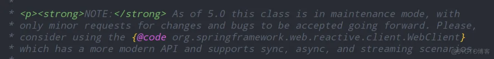

## 二、非 Spring 环境下使用 RestTemplate

> 为了方便后续开发测试，首先介绍一个网站给大家。JSONPlaceholder 是一个提供免费的在线 REST API 的网站，我们在开发时可以使用它提供的 url 地址测试下网络请求以及请求参数。或者当我们程序需要获取一些模拟数据、模拟图片时也可以使用它。

RestTemplate 是 spring 的一个 rest 客户端，在 spring-web 这个包下。这个包虽然叫做 spring-web，但是它的 RestTemplate 可以脱离 Spring 环境使用。

```xml
<dependency>
  <groupId>org.springframework</groupId>
  <artifactId>spring-web</artifactId>
  <version>5.2.6.RELEASE</version>
</dependency>
```

测试一下 Hello world，使用 RestTemplate 发送一个 GET 请求，并把请求得到的 JSON 数据结果打印出来。

```java
@Test
public void simpleTest()
{
    RestTemplate restTemplate = new RestTemplate();
    String url = "http://jsonplaceholder.typicode.com/posts/1";
    String str = restTemplate.getForObject(url, String.class);
    System.out.println(str);
}
```

服务端是 JSONPlaceholder 网站，帮我们提供的服务端 API。需要注意的是："http://jsonplaceholder.typicode.com/posts/1" 服务 URL，虽然 URL 里面有 posts 这个单词，但是它的英文含义是：帖子或者公告，而不是我们的 HTTP Post 协议。所以说 "http://jsonplaceholder.typicode.com/posts/1"，请求的数据是：id 为 1 的 Post 公告资源。打印结果如下： 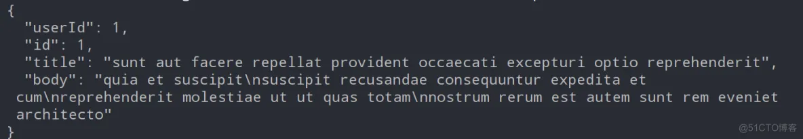

这里我们只是演示了 RestTemplate 最基础的用法，RestTemplate 会写成一个系列的文章，请大家关注。

## 三、Spring 环境下使用 RestTemplate

将 maven 坐标从 spring-web 换成 spring-boot-starter-web

```xml
<dependency>
    <groupId>org.springframework.boot</groupId>
    <artifactId>spring-boot-starter-web</artifactId>
</dependency>
```

将 RestTemplate 配置初始化为一个 Bean。这种初始化方法，是使用了 JDK 自带的 HttpURLConnection 作为底层 HTTP 客户端实现。我们还可以把底层实现切换为 Apache HttpComponents，okHttp 等，我们后续章节会为大家介绍。

```java
@Configuration
public class ContextConfig {

    //默认使用JDK 自带的HttpURLConnection作为底层实现
    @Bean
    public RestTemplate restTemplate(){
        RestTemplate restTemplate = new RestTemplate();
        return restTemplate;
    }
}
```

在需要使用 RestTemplate 的位置，注入并使用即可。

```java
@Resource //@AutoWired
  private RestTemplate restTemplate;
```

# 第 2 篇 - 多种底层 HTTP 客户端类库的切换


RestTemplate 只是对其他的 HTTP 客户端的封装，其本身并没有实现 HTTP 相关的基础功能。其底层实现是可以配置切换的，我们本小节就带着大家来看一下 RestTemplate 底层实现，及如何实现底层基础 HTTP 库的切换。

## 一、源码分析

RestTemplate 有一个非常重要的类叫做 HttpAccessor，可以理解为用于 HTTP 接触访问的基础类。下图为源码：

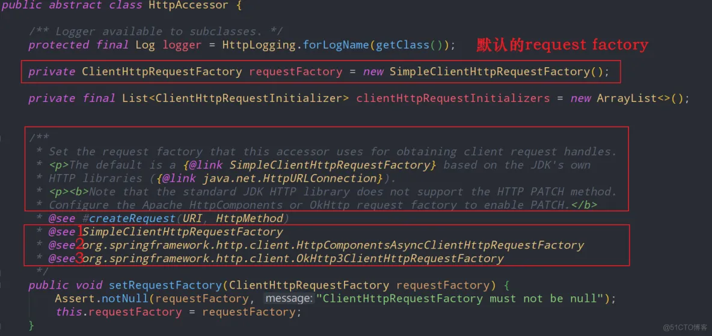

从源码中我们可以分析出以下几点信息

*   RestTemplate 支持至少三种 HTTP 客户端库。

*   SimpleClientHttpRequestFactory。对应的 HTTP 库是 java JDK 自带的 HttpURLConnection。
*   HttpComponentsAsyncClientHttpRequestFactory。对应的 HTTP 库是 Apache HttpComponents。
*   OkHttp3ClientHttpRequestFactory。对应的 HTTP 库是 OkHttp

  

*   java JDK 自带的 HttpURLConnection 是默认的底层 HTTP 实现客户端
*   SimpleClientHttpRequestFactory，即 java JDK 自带的 HttpURLConnection 不支持 HTTP 协议的 Patch 方法，如果希望使用 Patch 方法，需要将底层 HTTP 客户端实现切换为 Apache HttpComponents 或 OkHttp
*   可以通过设置 setRequestFactory 方法，来切换 RestTemplate 的底层 HTTP 客户端实现类库。

  

二、底层实现切换方法
----------

从开发人员的反馈，和网上的各种 HTTP 客户端性能以及易用程度评测来看，OkHttp 优于 Apache HttpComponents、Apache HttpComponents 优于 HttpURLConnection。所以我个人更建议大家将底层 HTTP 实现切换为 okHTTP。

> 以下所讲的切换方法，基于第一篇内容： ​[​精讲 RestTemplate 第 1 篇 - 在 Spring 或非 Spring 环境下如何使用​](http://www.zimug.com/java/spring/%E7%B2%BE%E8%AE%B2resttemplate%E7%AC%AC1%E7%AF%87-%E5%9C%A8spring%E6%88%96%E9%9D%9Espring%E7%8E%AF%E5%A2%83%E4%B8%8B%E5%A6%82%E4%BD%95%E4%BD%BF%E7%94%A8/.html)​

### 2.1. 切换为 okHTTP

首先通过 maven 坐标将 okHTTP 的包引入到项目中来

```xml
<dependency>
    <groupId>com.squareup.okhttp3</groupId>
    <artifactId>okhttp</artifactId>
    <version>4.7.2</version>
</dependency>
```

如果是 spring 环境下通过如下方式使用 OkHttp3ClientHttpRequestFactory 初始化 RestTemplate bean 对象。

```java
@Configuration
public class ContextConfig {
    @Bean("OKHttp3")
    public RestTemplate OKHttp3RestTemplate(){
        RestTemplate restTemplate = new RestTemplate(new OkHttp3ClientHttpRequestFactory());
        return restTemplate;
    }
}
```

如果是非 Spring 环境，直接​`​new RestTemplate(new OkHttp3ClientHttpRequestFactory()​`​之后使用就可以了。

### 2.2. 切换为 Apache HttpComponents

与切换为 okHTTP 方法类似、不再赘述。

```xml
<dependency>
    <groupId>org.apache.httpcomponents</groupId>
    <artifactId>httpclient</artifactId>
    <version>4.5.12</version>
</dependency>
```

使用 HttpComponentsClientHttpRequestFactory 初始化 RestTemplate bean 对象

```java
@Bean("httpClient")
public RestTemplate httpClientRestTemplate(){
    RestTemplate restTemplate = new RestTemplate(new HttpComponentsClientHttpRequestFactory());
    return restTemplate;
}
```

# 第 3 篇 - GET 请求使用方法详解


RestTemplate 可以发送 HTTP GET 请求，经常使用到的方法有两个：

*   getForObject()
*   getForEntity()

  

二者的主要区别在于，getForObject() 返回值是 HTTP 协议的响应体。getForEntity() 返回的是 ResponseEntity，ResponseEntity 是对 HTTP 响应的封装，除了包含响应体，还包含 HTTP 状态码、contentType、contentLength、Header 等信息。

> 为了方便后续开发测试，首先介绍一个网站给大家。​[​JSONPlaceholder​](http://jsonplaceholder.typicode.com/)​是一个提供免费的在线 REST API 的网站，我们在开发时可以使用它提供的 url 地址测试下网络请求以及请求参数。或者当我们程序需要获取一些模拟数据、模拟图片时也可以使用它。

一、 getForObject() 方法
--------------------

### 1.1. 以 String 的方式接受请求结果数据

在 Spring Boot 环境下写一个单元测试用例，以 String 类型接收响应结果信息

```java
@SpringBootTest
class ResttemplateWithSpringApplicationTests {

   @Resource
   private RestTemplate restTemplate;

   @Test
   void testSimple()  {
      String url = "http://jsonplaceholder.typicode.com/posts/1";
      String str = restTemplate.getForObject(url, String.class);
      System.out.println(str);
   }

}
```

getForObject 第二个参数为返回值的类型，String.class 以字符串的形式接受 getForObject 响应结果，

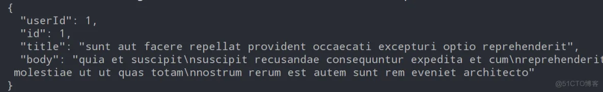

### 1.2. 以 POJO 对象的方式接受结果数据

在 Spring Boot 环境下写一个单元测试用例，以 java POJO 对象接收响应结果信息

```java
@Test
public void testPoJO() {
   String url = "http://jsonplaceholder.typicode.com/posts/1";
   PostDTO postDTO = restTemplate.getForObject(url, PostDTO.class);
   System.out.println(postDTO.toString());
}
```

输出打印结果如下：

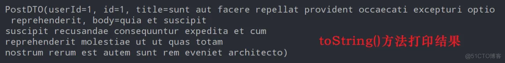

POJO 的定义如下，根据 JSON String 的数据格式定义。

```java
@Data
public class PostDTO {
    private int userId;
    private int id;
    private String title;
    private String body;
}
```

### 1.3. 以数组的方式接收请求结果

访问​[http://jsonplaceholder.typicode.com/posts">​http://jsonplaceholder.typicode.com/posts​](https://blog.51cto.com/u_14482423/%3Cspan%20class=)​ 可以获得 JSON 数组方式的请求结果

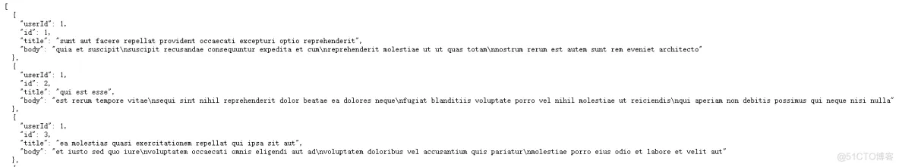

下一步就是我们该如何接收，使用方法也很简单。在 Spring Boot 环境下写一个单元测试用例，以数组的方式接收请求结果。

```java
@Test
public void testArrays() {
   String url = "http://jsonplaceholder.typicode.com/posts";
   PostDTO[] postDTOs = restTemplate.getForObject(url, PostDTO[].class);
   System.out.println("数组长度：" + postDTOs.length);
}
```

请求的结果被以数组的方式正确接收，输出如下：

### 1.4. 使用占位符号传参的几种方式

以下的几个请求都是在访问 "​​[​http://jsonplaceholder.typicode.com/posts/1"，只是使用了占位符语法，这样在业务使用上更加灵活。​](https://blog.51cto.com/u_14482423/%3Cspan%20class=)​

*   使用占位符的形式传递参数：

```java
String url = "http://jsonplaceholder.typicode.com/{1}/{2}";
PostDTO postDTO = restTemplate.getForObject(url, PostDTO.class, "posts", 1);
```

*   另一种使用占位符的形式：

```java
String url = "http://jsonplaceholder.typicode.com/{type}/{id}";
String type = "posts";
int id = 1;
PostDTO postDTO = restTemplate.getForObject(url, PostDTO.class, type, id);
```

*   我们也可以使用 map 装载参数：

```java
String url = "http://jsonplaceholder.typicode.com/{type}/{id}";
Map<String,Object> map = new HashMap<>();
map.put("type", "posts");
map.put("id", 1);
PostDTO  postDTO = restTemplate.getForObject(url, PostDTO.class, map);
```

二、getForEntity() 方法
-------------------

上面的所有的 getForObject 请求传参方法，getForEntity 都可以使用，**使用方法上也几乎是一致的**，只是在返回结果接收的时候略有差别。使用​`​ResponseEntity<T> responseEntity​`​来接收响应结果。用 responseEntity.getBody() 获取响应体。响应体内容同 getForObject 方法返回结果一致。剩下的这些响应信息就是 getForEntity 比 getForObject 多出来的内容。

*   `​HttpStatus statusCode = responseEntity.getStatusCode();​`​获取整体的响应状态信息
*   `​int statusCodeValue = responseEntity.getStatusCodeValue();​`​ 获取响应码值
*   `​HttpHeaders headers = responseEntity.getHeaders();​`​获取响应头
*   等

  

```java
@Test
public void testEntityPoJo() {
   String url = "http://jsonplaceholder.typicode.com/posts/5";
   ResponseEntity<PostDTO> responseEntity
               = restTemplate.getForEntity(url, PostDTO.class);
   PostDTO postDTO = responseEntity.getBody(); // 获取响应体
   System.out.println("HTTP 响应body：" + postDTO.toString());

   //以下是getForEntity比getForObject多出来的内容
   HttpStatus statusCode = responseEntity.getStatusCode(); // 获取响应码
   int statusCodeValue = responseEntity.getStatusCodeValue(); // 获取响应码值
   HttpHeaders headers = responseEntity.getHeaders(); // 获取响应头

   System.out.println("HTTP 响应状态：" + statusCode);
   System.out.println("HTTP 响应状态码：" + statusCodeValue);
   System.out.println("HTTP Headers信息：" + headers);
}
```

输出打印结果

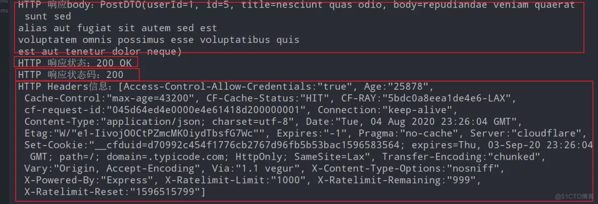

# 第 4 篇 - POST 请求方法使用详解


在上一节为大家介绍了 RestTemplate 的 GET 请求的两个方法：getForObject() 和 getForEntity()。其实 POST 请求方法和 GET 请求方法上大同小异，RestTemplate 的 POST 请求也包含两个主要方法：

*   postForObject()
*   postForEntity()

二者的主要区别在于，postForObject() 返回值是 HTTP 协议的响应体。postForEntity() 返回的是 ResponseEntity，ResponseEntity 是对 HTTP 响应的封装，除了包含响应体，还包含 HTTP 状态码、contentType、contentLength、Header 等信息。

一、postForObject 发送 JSON 格式请求
----------------------------

写一个单元测试用例，测试用例的内容是向指定的 URL 提交一个 Post(帖子).

```java
@SpringBootTest
class PostTests {

   @Resource
   private RestTemplate restTemplate;

   @Test
   void testSimple()  {
      // 请求地址
      String url = "http://jsonplaceholder.typicode.com/posts";

      // 要发送的数据对象
      PostDTO postDTO = new PostDTO();
      postDTO.setUserId(110);
      postDTO.setTitle("zimug 发布文章");
      postDTO.setBody("zimug 发布文章 测试内容");

      // 发送post请求，并输出结果
      PostDTO result = restTemplate.postForObject(url, postDTO, PostDTO.class);
      System.out.println(result);
   }
}
```


*   jsonplaceholder.typicode.com 是一个可以提供在线免费 RESTful 测试服务的一个网站
*   ”/posts" 服务接收 PostDTO 参数对象，并将请求结果以 JSON 字符串的形式进行响应。响应结果就是请求参数对象对应的 JSON 字符串。
*   所以 postForObject 方法第二个参数是请求数据对象，第三个参数是返回值类型

最终将返回值的打印结果如下：

 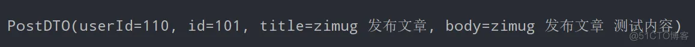

二、postForObject 模拟表单数据提交
------------------------

下面给大家写一个使用 postForObject 模拟表单数据提交的例子，即：提交 x-www-form-urlencoded 格式的数据

```java
@Test
public void testForm() {
   // 请求地址
   String url = "http://jsonplaceholder.typicode.com/posts";

   // 请求头设置,x-www-form-urlencoded格式的数据
   HttpHeaders headers = new HttpHeaders();
   headers.setContentType(MediaType.APPLICATION_FORM_URLENCODED);

   //提交参数设置
   MultiValueMap<String, String> map = new LinkedMultiValueMap<>();
   map.add("title", "zimug 发布文章第二篇");
   map.add("body", "zimug 发布文章第二篇 测试内容");

   // 组装请求体
   HttpEntity<MultiValueMap<String, String>> request =
               new HttpEntity<MultiValueMap<String, String>>(map, headers);

   // 发送post请求，并打印结果，以String类型接收响应结果JSON字符串
   String result = restTemplate.postForObject(url, request, String.class);
   System.out.println(result);
}
```

请求数据打印结果如下： 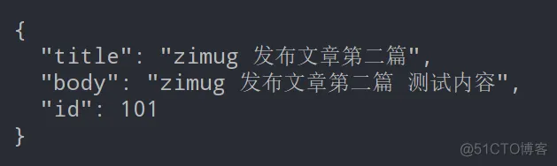

三、 url 支持占位符语法
--------------

如果 url 地址上面需要传递一些动态参数，可以使用占位符的方式：

```java
String url = "http://jsonplaceholder.typicode.com/{1}/{2}";
String url = "http://jsonplaceholder.typicode.com/{type}/{id}";
```

具体的用法和使用 GET 方法请求是一致的，所以请参考： ​[​精讲 RestTemplate 第 3 篇 - GET 请求使用方法详解​](http://www.zimug.com/java/spring/%E7%B2%BE%E8%AE%B2resttemplate%E7%AC%AC3%E7%AF%87-get%E8%AF%B7%E6%B1%82%E4%BD%BF%E7%94%A8%E6%96%B9%E6%B3%95%E8%AF%A6%E8%A7%A3/.html)​

四、postForEntity() 方法
--------------------

上面的所有的 postForObject 请求传参方法，postForEntity 都可以使用，**使用方法上也几乎是一致的**，只是在返回结果接收的时候略有差别。使用​`​ResponseEntity<T> responseEntity​`​来接收响应结果。用 responseEntity.getBody() 获取响应体。响应体内容同 postForObject 方法返回结果一致。剩下的这些响应信息就是 postForEntity 比 postForObject 多出来的内容。

*   *     

*   `​HttpStatus statusCode = responseEntity.getStatusCode();​`​获取整体的响应状态信息
*   `​int statusCodeValue = responseEntity.getStatusCodeValue();​`​ 获取响应码值
*   `​HttpHeaders headers = responseEntity.getHeaders();​`​获取响应头
*   等
    *     

```java
@Test
public void testEntityPoJo() {
   // 请求地址
   String url = "http://jsonplaceholder.typicode.com/posts";

   // 要发送的数据对象
   PostDTO postDTO = new PostDTO();
   postDTO.setUserId(110);
   postDTO.setTitle("zimug 发布文章");
   postDTO.setBody("zimug 发布文章 测试内容");

   // 发送post请求，并输出结果
   ResponseEntity<String> responseEntity
               = restTemplate.postForEntity(url, postDTO, String.class);
   String body = responseEntity.getBody(); // 获取响应体
   System.out.println("HTTP 响应body：" + postDTO.toString());

   //以下是postForEntity比postForObject多出来的内容
   HttpStatus statusCode = responseEntity.getStatusCode(); // 获取响应码
   int statusCodeValue = responseEntity.getStatusCodeValue(); // 获取响应码值
   HttpHeaders headers = responseEntity.getHeaders(); // 获取响应头

   System.out.println("HTTP 响应状态：" + statusCode);
   System.out.println("HTTP 响应状态码：" + statusCodeValue);
   System.out.println("HTTP Headers信息：" + headers);
}
```

输出打印结果 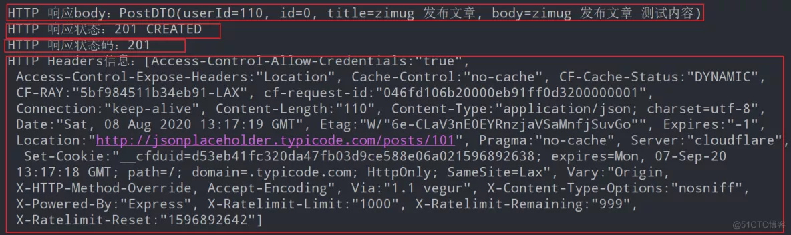

五、postForLocation() 方法的使用
-------------------------

postForLocation 的传参的类型、个数、用法基本都和 postForObject() 或 postForEntity() 一致。和前两者的唯一区别在于返回值是一个 URI。该 URI 返回值体现的是：用于提交完成数据之后的页面跳转，或数据提交完成之后的下一步数据操作 URI。

```java
@Test
public void testURI() {
   // 请求地址
   String url = "http://jsonplaceholder.typicode.com/posts";

   PostDTO postDTO = new PostDTO();
   postDTO.setUserId(110);
   postDTO.setTitle("zimug 发布文章");
   postDTO.setBody("zimug 发布文章 测试内容");

   // 发送post请求，并输出结果
   URI uri = restTemplate.postForLocation(url,postDTO);
   System.out.println(uri);
}
```

输出结果如下，含义是：提交了 post 之后，该 post 的 id 是 101，可以通过如下的连接去获取数据。 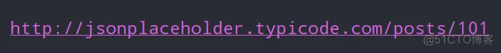


# 第 5 篇 - DELETE、PUT 等请求方法使用详解


> 为了方便后续开发测试，首先介绍一个网站给大家。​[​JSONPlaceholder​](http://jsonplaceholder.typicode.com/)​是一个提供免费的在线 REST API 的网站，我们在开发时可以使用它提供的 url 地址测试下网络请求以及请求参数。或者当我们程序需要获取一些模拟数据、模拟图片时也可以使用它。


一、RESTful 风格与 HTTP method
-------------------------

熟悉 RESTful 风格的朋友，应该了解 RESTful 风格 API 使用 HTTP method 表达对资源的操作。

<table><colgroup><col span="1" width="436"><col span="1" width="436"></colgroup><tbody><tr><td><p>常用 HTTP 方法</p></td><td><p>RESTful 风格语义（操作）</p></td></tr><tr><td><p>GET</p></td><td><p>查询、获取数据</p></td></tr><tr><td><p>POST</p></td><td><p>新增、提交数据</p></td></tr><tr><td><p>DELETE</p></td><td><p>删除数据</p></td></tr><tr><td><p>PUT</p></td><td><p>更新、修改数据</p></td></tr><tr><td><p>HEAD</p></td><td><p>获取 HTTP 请求头数据</p></td></tr><tr><td><p>OPTIONS</p></td><td><p>判断 URL 提供的当前 API 支持哪些 HTTP method 方法</p></td></tr></tbody></table>

在前面的章节，我已经为大家详细的介绍了 RestTemplate 的 GET 和 POST 的相关的使用方法，本节来为大家介绍 DELETE、PUT、HEAD、OPTIONS。

二、使用 DELETE 方法去删除资源
-------------------

删除一个已经存在的资源，使用 RestTemplate 的 delete(uri) 方法。该方法会向 URL 代表的资源发送一个 HTTP DELETE 方法请求。

```java
@Test
void testDelete()  {
   String url = "http://jsonplaceholder.typicode.com/posts/1";
   restTemplate.delete(url);
}
```

在前面章节测试类的基础上，写如上代码的测试用例。上面代码含义为删除 posts 列表里面的第 1 个帖子。

二、使用 PUT 方法去修改资源
----------------

修改一个已经存在的资源，使用 RestTemplate 的 put() 方法。该方法会向 URL 代表的资源发送一个 HTTP PUT 方法请求。

```java
@Test
void testPut()  {
   // 请求地址
   String url = "http://jsonplaceholder.typicode.com/posts/1";

   // 要发送的数据对象（修改数据）
   PostDTO postDTO = new PostDTO();
   postDTO.setUserId(110);
   postDTO.setTitle("zimug 发布文章");
   postDTO.setBody("zimug 发布文章 测试内容");

   // 发送PUT请求
   restTemplate.put(url, postDTO);
}
```

上面代码 RESTful 风格语义是：修改 posts 列表里面的第 1 个帖子。

三、通用请求方法 exchange 方法
--------------------

exchange 方法是一个通用的方法，它可以发送 GET、POST、DELETE、PUT 等等 HTTP 方法请求。

*   下面的两种方式发送 GET 请求效果是一样的

```java
//使用getForEntity发送GET请求
ResponseEntity<PostDTO> responseEntity
            = restTemplate.getForEntity(url, PostDTO.class);
//使用exchange发送GET请求
ResponseEntity<PostDTO> responseEntity = restTemplate.exchange(url, HttpMethod.GET,
            null, PostDTO.class);
```

*   下面的两种方式发送 POST 请求效果是一样的

```java
// 使用postForEntity发送POST请求
ResponseEntity<String> responseEntity
            = restTemplate.postForEntity(url, postDTO, String.class);
// 使用exchange发送POST请求
ResponseEntity<String> responseEntity
            = restTemplate.exchange(url, HttpMethod.POST,null, String.class);
```

*   下面的两种方式发送 DELETE 请求效果是一样的，只是一个有返回值，一个返回值为 void

```java
// 使用delete发送DELETE请求，返回值为void
restTemplate.delete(url);
// 使用exchange发送DELETE请求
ResponseEntity<String> result = restTemplate.exchange(url, HttpMethod.DELETE,null,String.class);
```

上面为大家举了几个用 exchange() 发送请求的例子，exchange() 还能针对很多的 HTTP method 类型发送请求，是通用方法！

四、使用 HEAD 方法获取 HTTP 请求头数据
-------------------------

使用 * headForHeaders()*API 获取某个资源的 URI 的请求头信息，并且只专注于获取 HTTP 请求头信息。

```java
@Test
public void testHEAD()  {
   String url = "http://jsonplaceholder.typicode.com/posts/1";
   HttpHeaders httpHeaders  = restTemplate.headForHeaders(url);

   //断言该资源接口数据为JSON类型
   assertTrue(httpHeaders.getContentType()
               .includes(MediaType.APPLICATION_JSON));
   System.out.println(httpHeaders);
}
```

请求头信息输出打印结果如下

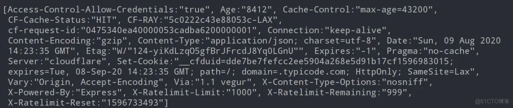

五、使用 OPTIONS 获取 HTTP 资源支持的 method
---------------------------------

下文代码使用 _optionsForAllow_ 测试该 URL 资源是否支持 GET、POST、PUT、DELETE，即增删改查。

```java
@Test
public void testOPTIONS()  {
   String url = "http://jsonplaceholder.typicode.com/posts/1";
   Set<HttpMethod> optionsForAllow  = restTemplate.optionsForAllow(url);

   HttpMethod[] supportedMethods
               = {HttpMethod.GET, HttpMethod.POST, HttpMethod.PUT, HttpMethod.DELETE};
   //测试该url资源是否支持GET、POST、PUT、DELETE，即增删改查
   assertTrue(optionsForAllow.containsAll(Arrays.asList(supportedMethods)));
}
```

# 第 6 篇 - 文件上传下载与大文件流式下载

> RestTemplate 是 HTTP 客户端库，所以为了使用 RestTemplate 进行文件上传和下载，需要我们先编写服务端的支持文件上传和下载的程序。请参考我之前写的一篇文章：​[​SpringBoot 实现本地存储文件上传及提供 HTTP 访问服务​](http://www.zimug.com/java/spring/springboot%E5%AE%9E%E7%8E%B0%E6%9C%AC%E5%9C%B0%E5%AD%98%E5%82%A8%E6%96%87%E4%BB%B6%E4%B8%8A%E4%BC%A0%E5%8F%8A%E6%8F%90%E4%BE%9Bhttp%E8%AE%BF%E9%97%AE%E6%9C%8D%E5%8A%A1/.html)​ 。按照此文完成学习之后，可以获得

*   一个以访问服务 URI 为 "/upload” 的文件上传服务端点
*   服务端点上传文件成功后会返回一个 HTTP 连接, 可以用来下载文件。

下面我们就开始学习使用 RestTemplate 是 HTTP 客户端库，进行文件的上传与下载。

一、文件上传
------

写一个单元测试类，来完成 RestTemplate 文件上传功能，具体实现细节参考代码注释

```java
@SpringBootTest
class UpDownLoadTests {

   @Resource
   private RestTemplate restTemplate;

   @Test
   void testUpload()  {
      // 文件上传服务上传接口
      String url = "http://localhost:8888/upload";
      // 待上传的文件（存在客户端本地磁盘）
      String filePath = "D:\\data\\local\\splash.png";

      // 封装请求参数
      FileSystemResource resource = new FileSystemResource(new File(filePath));
      MultiValueMap<String, Object> param = new LinkedMultiValueMap<>();
      param.add("uploadFile", resource);  //服务端MultipartFile uploadFile
      //param.add("param1", "test");   //服务端如果接受额外参数，可以传递

      // 发送请求并输出结果
      System.out.println("--- 开始上传文件 ---");
      String result = restTemplate.postForObject(url, param, String.class);
      System.out.println("--- 访问地址：" + result);
   }

}
```

输出结果如下：

```
--- 开始上传文件 ---
--- 访问地址：http://localhost:8888/2020/08/12/028b38f1-3f9b-4088-9bea-1af8c18cd619.png
```

文件上传之后，可以通过上面的访问地址，在浏览器访问。或者通过 RestTemplate 客户端进行下载。

二、文件下载
------

执行下列代码之后，被下载文件 url，会被正确的保存到本地磁盘目录 targetPath。

```java
@Test
void testDownLoad() throws IOException {
   // 待下载的文件地址
   String url = "http://localhost:8888/2020/08/12/028b38f1-3f9b-4088-9bea-1af8c18cd619.png";
   ResponseEntity<byte[]> rsp = restTemplate.getForEntity(url, byte[].class);
   System.out.println("文件下载请求结果状态码：" + rsp.getStatusCode());

   // 将下载下来的文件内容保存到本地
   String targetPath = "D:\\data\\local\\splash-down.png";
   Files.write(Paths.get(targetPath), Objects.requireNonNull(rsp.getBody(),
               "未获取到下载文件"));
}
```

这种下载方法实际上是将下载文件一次性加载到客户端本地内存，然后从内存将文件写入磁盘。这种方式对于小文件的下载还比较适合，如果文件比较大或者文件下载并发量比较大，容易造成内存的大量占用，从而降低应用的运行效率。

三、大文件下载
-------

这种下载方式的区别在于

*   设置了请求头 APPLICATION_OCTET_STREAM，表示以流的形式进行数据加载
*   RequestCallback 结合 File.copy 保证了接收到一部分文件内容，就向磁盘写入一部分内容。而不是全部加载到内存，最后再写入磁盘文件。

```java
@Test
void testDownLoadBigFile() throws IOException {
   // 待下载的文件地址
   String url = "http://localhost:8888/2020/08/12/028b38f1-3f9b-4088-9bea-1af8c18cd619.png";
   // 文件保存的本地路径
   String targetPath = "D:\\data\\local\\splash-down-big.png";
   //定义请求头的接收类型
   RequestCallback requestCallback = request -> request.getHeaders()
               .setAccept(Arrays.asList(MediaType.APPLICATION_OCTET_STREAM, MediaType.ALL));
   //对响应进行流式处理而不是将其全部加载到内存中
   restTemplate.execute(url, HttpMethod.GET, requestCallback, clientHttpResponse -> {
      Files.copy(clientHttpResponse.getBody(), Paths.get(targetPath));
      return null;
   });
}
```

# 第 7 篇 - 自定义请求失败异常处理


一、异常现象
------

在使用 RestTemplate 进行远程接口服务调用的时候，当请求的服务出现异常：超时、服务不存在等情况的时候（响应状态非 200、而是 400、500HTTP 状态码），就会抛出如下异常：

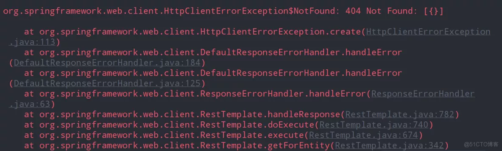

该异常我是模拟出来的，将正确的请求服务地址由 “/posts/1” 改成“/postss/1”。服务不存在所以抛出 404 异常。

```java
@Test
public void testEntity() {
   String url = "http://jsonplaceholder.typicode.com/postss/1";
   ResponseEntity<String> responseEntity
               = restTemplate.getForEntity(url, String.class);  //这行抛出异常
   //下面两行代码执行不到
   HttpStatus statusCode = responseEntity.getStatusCode(); // 获取响应码
   System.out.println("HTTP 响应状态：" + statusCode);
}
```

异常抛出之后，程序后面的代码就执行不到了，无法进行后面的代码执行。实际的业务开发中，有的时候我们更期望的结果是：不管你服务端是超时了还是服务不存在，我们都应该获得最终的请求结果（HTTP 请求结果状态 400、500），而不是获得一个抛出的异常。

二、源码解析 - 默认实现
-------------

首先我要说一个结论：RestTemplate 请求结果异常是可以自定义处理的。在开始进行自定义的异常处理逻辑之前，我们有必要看一下异常处理的默认实现。也就是：为什么会产生上面小节提到的现象？

*   ResponseErrorHandler 是 RestTemplate 请求结果的异常处理器接口
    *   接口的第一个方法 hasError 用于判断 HttpResponse 是否是异常响应（通过状态码）
    *   接口的第二个方法 handleError 用于处理异常响应结果（非 200 状态码段）
*   DefaultResponseErrorHandler 是 ResponseErrorHandler 的默认实现

所以我们就来看看 DefaultResponseErrorHandler 是如何来处理异常响应的？从 HttpResponse 解析出 Http StatusCode，如果状态码 StatusCode 为 null，就抛出 UnknownHttpStatusCodeException 异常。

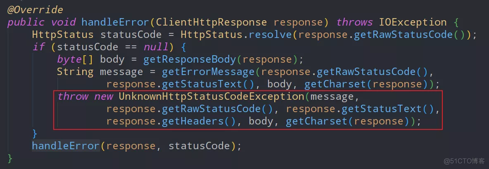

如果 StatusCode 存在，则解析出 StatusCode 的 series，也就是状态码段（除了 200 段，其他全是异常状态码）, 解析规则是 StatusCode/100 取整。

```java
public enum Series {

   INFORMATIONAL(1),  // 1xx/100
   SUCCESSFUL(2),  // 2xx/100
   REDIRECTION(3), // 3xx/100
   CLIENT_ERROR(4), // 4xx/100   ,客户端异常
   SERVER_ERROR(5); // 5xx/100 ，服务端异常
}
```

进一步针对客户端异常和服务端异常进行处理，处理的方法是抛出 HttpClientErrorException。也就是第一小节出现的异常的原因

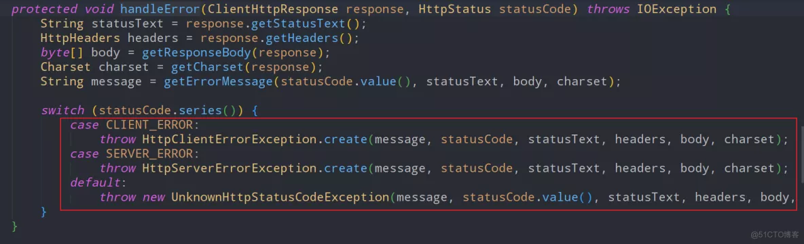

三、RestTemplate 自定义异常处理
----------------------

所以我们要实现自定义异常，实现 ResponseErrorHandler 接口就可以。

```java
public class MyRestErrorHandler implements ResponseErrorHandler {

    /**
     * 判断返回结果response是否是异常结果
     * 主要是去检查response 的HTTP Status
     * 仿造DefaultResponseErrorHandler实现即可
     */
    @Override
    public boolean hasError(ClientHttpResponse response) throws IOException {
        int rawStatusCode = response.getRawStatusCode();
        HttpStatus statusCode = HttpStatus.resolve(rawStatusCode);
        return (statusCode != null ? statusCode.isError(): hasError(rawStatusCode));
    }

    protected boolean hasError(int unknownStatusCode) {
        HttpStatus.Series series = HttpStatus.Series.resolve(unknownStatusCode);
        return (series == HttpStatus.Series.CLIENT_ERROR || series == HttpStatus.Series.SERVER_ERROR);
    }

    @Override
    public void handleError(ClientHttpResponse response) throws IOException {
        // 里面可以实现你自己遇到了Error进行合理的处理
        //TODO 将接口请求的异常信息持久化
    }
}
```

将 MyRestErrorHandler 在 RestTemplate 实例化的时候进行注册。参考： 《精讲 RestTemplate 第 1 篇 - 在 Spring 或非 Spring 环境下如何使用》 和 《精讲 RestTemplate 第 2 篇 - 多种底层 HTTP 客户端类库的切换》 进行实现

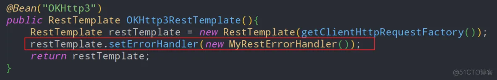

这时再去执行第一小节中的示例代码，就不会抛出异常。而是得到一个 HTTP Status 404 的结果。我们可以根据这个结果，在程序中继续向下执行代码。

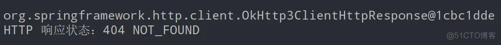

# 第 8 篇 - 请求失败自动重试机制


在上一节我们为大家介绍了，当 RestTemplate 发起远程请求异常时的自定义处理方法，我们可以通过自定义的方式解析出 HTTP Status Code 状态码，然后根据状态码和业务需求决定程序下一步该如何处理。 本节为大家介绍另外一种通用的异常的处理机制：那就是自动重试。也就是说，在 RestTemplate 发送请求得到非 200 状态结果的时候，间隔一定的时间再次发送 n 次请求。n 次请求都失败之后，最后抛出 HttpClientErrorException。 在开始本节代码之前，将上一节的 RestTemplate 自定义异常处理的代码注释掉，否则自动重试机制不会生效。如下（参考上一节代码）：

```java
//restTemplate.setErrorHandler(new MyRestErrorHandler());
```

一、Spring Retry 配置生效
-------------------

通过 maven 坐标引入 spring-retry，spring-retry 的实现依赖于面向切面编程，所以引入 aspectjweaver。以下配置过程都是基于 Spring Boot 应用。

```xml
<dependency>
    <groupId>org.springframework.retry</groupId>
    <artifactId>spring-retry</artifactId>
    <version>1.2.5.RELEASE</version>
</dependency>
<dependency>
   <groupId>org.aspectj</groupId>
   <artifactId>aspectjweaver</artifactId>
</dependency>
```

在 Spring Boot 应用入口启动类，也就是配置类的上面加上 @SpringRetry 注解，表示让重试机制生效。

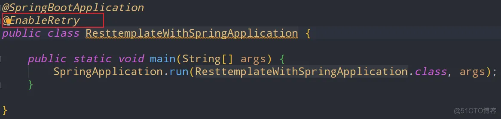

二、使用案例
------

*   *     

*   写一个模拟的业务类 RetryService ，在其里面注入 RestTemplate 。RestTemplate 实例化 Bean 配置参考： ​[​《精讲 RestTemplate 第 1 篇 - 在 Spring 或非 Spring 环境下如何使用》​](http://www.zimug.com/java/spring/%E7%B2%BE%E8%AE%B2resttemplate%E7%AC%AC1%E7%AF%87-%E5%9C%A8spring%E6%88%96%E9%9D%9Espring%E7%8E%AF%E5%A2%83%E4%B8%8B%E5%A6%82%E4%BD%95%E4%BD%BF%E7%94%A8/.html)​​ 和 ​[​《精讲 RestTemplate 第 2 篇 - 多种底层 HTTP 客户端类库的切换》​](http://www.zimug.com/java/spring/%E7%B2%BE%E8%AE%B2resttemplate%E7%AC%AC2%E7%AF%87-%E5%A4%9A%E7%A7%8D%E5%BA%95%E5%B1%82http%E5%AE%A2%E6%88%B7%E7%AB%AF%E7%B1%BB%E5%BA%93%E7%9A%84%E5%88%87%E6%8D%A2/.html)​ 进行实现。
*   将正确的请求服务地址由 “/posts/1” 改成“/postss/1”。服务不存在所以抛出 404 异常，是为了触发重试机制。
    *     

```java
@Service
public class RetryService {

  @Resource
  private RestTemplate restTemplate;

  private static final DateTimeFormatter DATE_TIME_FORMATTER = DateTimeFormatter.ofPattern("yyyy-MM-dd HH:mm:ss");

  @Retryable(value = RestClientException.class, maxAttempts = 3,
          backoff = @Backoff(delay = 5000L,multiplier = 2))
  public HttpStatus testEntity() {
    System.out.println("发起远程API请求:" + DATE_TIME_FORMATTER.format(LocalDateTime.now()));

    String url = "http://jsonplaceholder.typicode.com/postss/1";
    ResponseEntity<String> responseEntity
            = restTemplate.getForEntity(url, String.class);

    return responseEntity.getStatusCode(); // 获取响应码
  }

}
```


*   `​@Retryable​`​注解的方法在发生异常时会重试，参数说明：
    *   value：当指定异常发生时会进行重试 ,HttpClientErrorException 是 RestClientException 的子类。
    *   include：和 value 一样，默认空。如果 exclude 也为空时，所有异常都重试 
    *   exclude：指定异常不重试，默认空。如果 include 也为空时，所有异常都重试 
    *   maxAttemps：最大重试次数，默认 3 
    *   backoff：重试等待策略，默认空


* `​@Backoff​`​注解为重试等待的策略，参数说明：

  *   delay：指定重试的延时时间，默认为 1000 毫秒
  *   multiplier：指定延迟的倍数，比如设置 delay=5000，multiplier=2 时，第一次重试为 5 秒后，第二次为 10(5x2) 秒，第三次为 20(10x2) 秒。

  


写一个测试的 RetryController 对 RetryService 的 testEntity 方法进行调用

```java
@RestController
public class RetryController {

    @Resource
    private RetryService retryService;

    @GetMapping("/retry")
    public HttpStatus test() {
        return retryService.testEntity();
    }
}
```

三、测试结果
------

向 ​http://localhost:8080/retry">​http://localhost:8080/retry​​ 发起请求，结果如下：

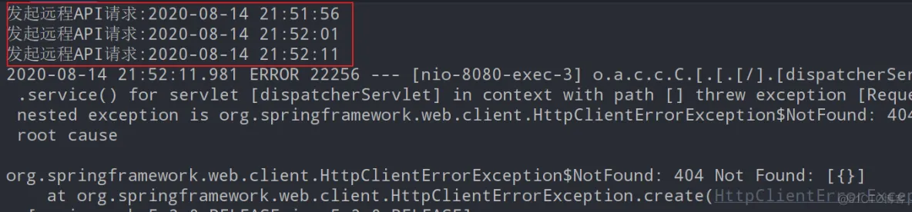

从结果可以看出：

*   *     

*   第一次请求失败之后，延迟 5 秒后重试
*   第二次请求失败之后，延迟 10 秒后重试
*   第三次请求失败之后，抛出异常
    *     

# 第 9 篇 - 如何通过 HTTP Basic Auth 认证


服务提供方通常会通过一定的授权、鉴权认证逻辑来保护 API 接口。其中比较简单、容易实现的方式就是使用 HTTP 的 Basic Auth 来实现接口访问用户的认证。我们本节就来为大家介绍一下，在服务端加入 Basic Auth 认证的情况下，该如何使用 RestTemplate 访问服务端接口。

一、HttpBasic 认证原理说明
------------------

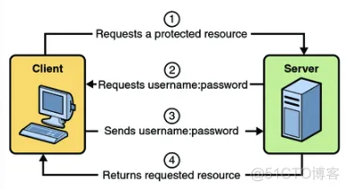

*   *     

*   首先，HttpBasic 模式要求传输的用户名密码使用 Base64 模式进行加密。如果用户名是 ​`​"admin"​`​​  ，密码是 “admin”，则将字符串​`​"admin:admin"​`​使用 Base64 编码算法加密。加密结果可能是：YWtaW46YWRtaW4=。
*   然后，在 Http 请求中使用 authorization 作为一个 HTTP 请求头 Header name，“Basic YWtaW46YWRtaW4=“作为 Header 的值，发送给服务端。（注意这里使用 Basic + 空格 + 加密串）
*   服务器在收到这样的请求时，到达 BasicAuthenticationFilter 过滤器，将提取 “authorization” 的 Header 值，并使用用于验证用户身份的相同算法 Base64 进行解码。
*   解码结果与登录验证的用户名密码匹配，匹配成功则可以继续过滤器后续的访问。
    *     

二、HTTP Basic Auth 服务端实现
-----------------------

如果你想自己搭建一个服务端，那么如何为 Spring Boot 服务添加 Basic Auth 认证？请参考我的另外一篇文章：​[​《Spring Security 系列之 Http Basic Auth 登录认证模式》​](https://www.kancloud.cn/hanxt/springsecurity/1221483)​ 。

当然我们也可以不用自己去搭建服务端，给大家介绍一个提供免费在线的 RESTful 接口服务的网站：httpbin.com。这个网站为我们提供了 Basic Auth 认证测试服务接口。如果我们只是为了学习 RestTemplate，直接用这个网站提供的服务就可以了。

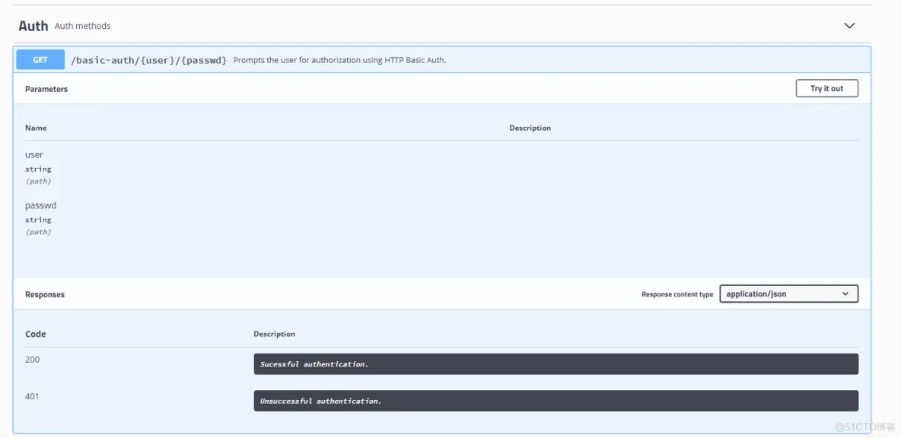

浏览器访问地址：​http://www.httpbin.org/#/Auth/get_basic_auth__user___passwd_">​http://www.httpbin.org/#/Auth/get_basic_auth__user___passwd_​​ ，这个接口服务是通过 OpenAPI（swagger）实现的，所以可以进行在线的访问测试。所以可以先通过页面操作测试一下，再开始下面学习使用 RestTemplate 访问服务端接口。

三、请求头方式携带认证信息
-------------

在 HTTP 请求头中携带 Basic Auth 认证的用户名和密码，具体实现参考下文代码注释：

```java
@SpringBootTest
class BasicAuthTests {

   @Resource
   private RestTemplate restTemplate;

   @Test
   void testBasicAuth() {
      //该url上携带用户名密码是httpbin网站测试接口的要求，
     //真实的业务是不需要在url上体现basic auth用户名密码的
      String url = "http://www.httpbin.org/basic-auth/admin/adminpwd";

      //在请求头信息中携带Basic认证信息(这里才是实际Basic认证传递用户名密码的方式)
      HttpHeaders headers = new HttpHeaders();
      headers.set("authorization",
                  "Basic " +
                  Base64.getEncoder()  
                       .encodeToString("admin:adminpwd".getBytes()));

     //发送请求
      HttpEntity<String> ans = restTemplate
                  .exchange(url,
                        HttpMethod.GET,   //GET请求
                        new HttpEntity<>(null, headers),   //加入headers
                        String.class);  //body响应数据接收类型
      System.out.println(ans);
   }

}
```

测试用例执行成功，说明 RestTemplate 正确的携带了 Basic 认证信息，得到正常的响应结果：200。 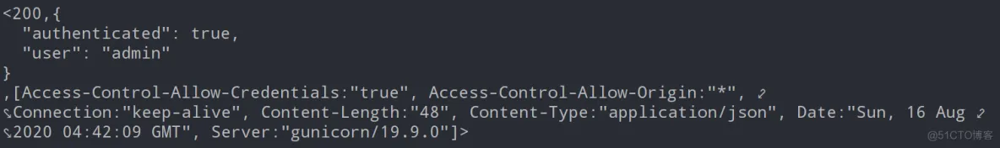

四、拦截器方式携带认证信息
-------------

第三小节中的代码虽然实现了功能，但是不够好。因为每一次发送 HTTP 请求，我们都需要去组装 HttpHeaders 信息，这样不好，造成大量的代码冗余。那么有没有一种方式可以实现可以一次性的为所有 RestTemplate 请求 API 添加 Http Basic 认证信息呢？答案就是：在 RestTemplate Bean 初始化的时候加入拦截器，以拦截器的方式统一添加 Basic 认证信息。

> 下面的代码结合注释去看，如果看不懂，需要去参考：​[​精讲 RestTemplate 第 2 篇 - 多种底层 HTTP 客户端类库的切换​](http://www.zimug.com/java/spring/%E7%B2%BE%E8%AE%B2resttemplate%E7%AC%AC2%E7%AF%87-%E5%A4%9A%E7%A7%8D%E5%BA%95%E5%B1%82http%E5%AE%A2%E6%88%B7%E7%AB%AF%E7%B1%BB%E5%BA%93%E7%9A%84%E5%88%87%E6%8D%A2/.html)​

```java
@Configuration
public class ContextConfig {

    @Bean("OKHttp3")
    public RestTemplate OKHttp3RestTemplate(){
        RestTemplate restTemplate = new RestTemplate(getClientHttpRequestFactory());
        //添加拦截器
        restTemplate.getInterceptors().add(getCustomInterceptor());
        return restTemplate;
    }
   //实现一个拦截器：使用拦截器为每一个HTTP请求添加Basic Auth认证用户名密码信息
    private ClientHttpRequestInterceptor getCustomInterceptor(){
        ClientHttpRequestInterceptor interceptor = (httpRequest, bytes, execution) -> {
            httpRequest.getHeaders().set("authorization",
                    "Basic " +
                            Base64.getEncoder()
                                    .encodeToString("admin:adminpwd".getBytes()));
            return execution.execute(httpRequest, bytes);
        };
        return interceptor;
    }

    //这段代码是《第3节-底层HTTP客户端实现切换》的内容
    private ClientHttpRequestFactory getClientHttpRequestFactory() {
        int timeout = 100000;
        OkHttp3ClientHttpRequestFactory clientHttpRequestFactory
                = new OkHttp3ClientHttpRequestFactory();
        clientHttpRequestFactory.setConnectTimeout(timeout);
        return clientHttpRequestFactory;
    }
}
```

在 RestTemplate Bean 初始化的时候加入拦截器之后，第三小节中的代码就可以省略 HttpHeaders Basic Auth 请求头携带信息的组装过程。发送请求，结果和第三小节中的效果是一样的。

五、进一步简化
-------

上面的方式使用了拦截器，但仍然是我们自己来封装 HTTP headers 请求头信息。进一步的简化方法就是，Spring RestTemplate 已经为我们提供了封装好的 Basic Auth 拦截器，我们直接使用就可以了，不需要我们自己去实现拦截器。

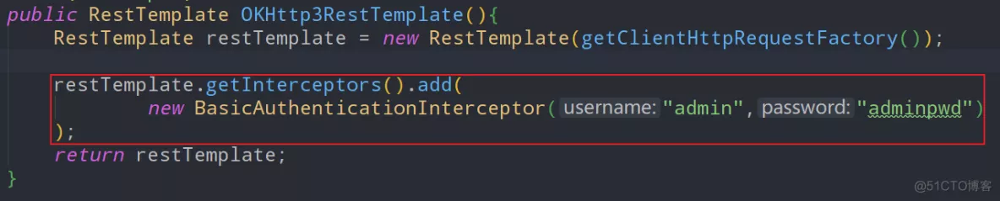

下面的方法是在 RestTemplate Bean 实例化的时候使用 RestTemplateBuilder，自带 basicAuthentication。所以到这里拦截器也不需要了（实际底层代码实现仍然是拦截器，只是 api 层面不需要指定拦截器了）。


发送请求，结果和第三小节中的效果是一样的。

# 第 10 篇 - 使用代理作为跳板发送请求


本节我们要为大家介绍一下，如何在使用 RestTemplate 发送请求的时候使用代理 Proxy。至于为什么要使用代理，给大家举一个简单的例子：一些做过爬虫的同学可能都知道，当爬虫高频的多次访问一个网站数据，可能导致请求客户端 Ip 被封锁的可能。很多情况下，做爬虫的企业就维护一个代理 IP 池，每发送一次请求，就更换一次 IP。 代理 Proxy 作为跳板成为服务的直接访问者，代理使用者（真正的客户端）是间接访问服务。这样在服务端看来，每次请求是代理发出的，从代理 IP 池中一直更换代理发送请求，这样能够降低 IP 封锁的可能。

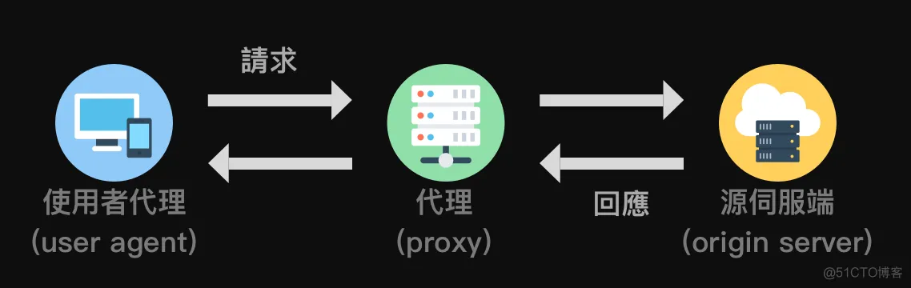

我们本节就来为大家介绍，作为一个代理使用者，该如何使用 RestTemplate 发送请求的时候使用代理 Proxy。

一、搭建一个代理服务器
-----------

笔者只从知识的层面去讲解使用方法，所以不做蝇营狗苟的勾当。代理服务器还是由我自己来搭建用来测试，在我的一个 CentOS 服务器上安装 tinyproxy，tinyproxy 可以提供代理服务。

```bash
# 安装tinyproxy 命令
sudo yum install tinyproxy -y
```

编辑 tinyproxy 的配置文件​`​vim /etc/tinyproxy/tinyproxy.conf​`​。为该代理配置允许访问的使用者客户端 ip，也就是我家的 ip，所以这个代理服务只能我用，其他人用不了。

```properties
# 代理服务端口
Port 1080
# 允许哪个客户端使用该代理程序？
Allow xxx.xxx.xxx.xxx
```

启动 tinyproxy 提供代理服务，最好检查一下防火墙是否开放了 1080 端口。

```shell
systemctl start tinyproxy.service
```

二、用于测试的服务端
----------

*   *     

*   我们这次要访问的服务端是：​`​http://www.httpbin.org​`​, 这个网站是提供在线的 HTTP 访问服务的网站。我们可以用它进行测试。
*   `​http://www.httpbin.org/ip​`​是我们本次要访问的服务，响应结果是访问者的 IP。
    *     

我在家里使用电脑访问这个服务的时候结果如下： 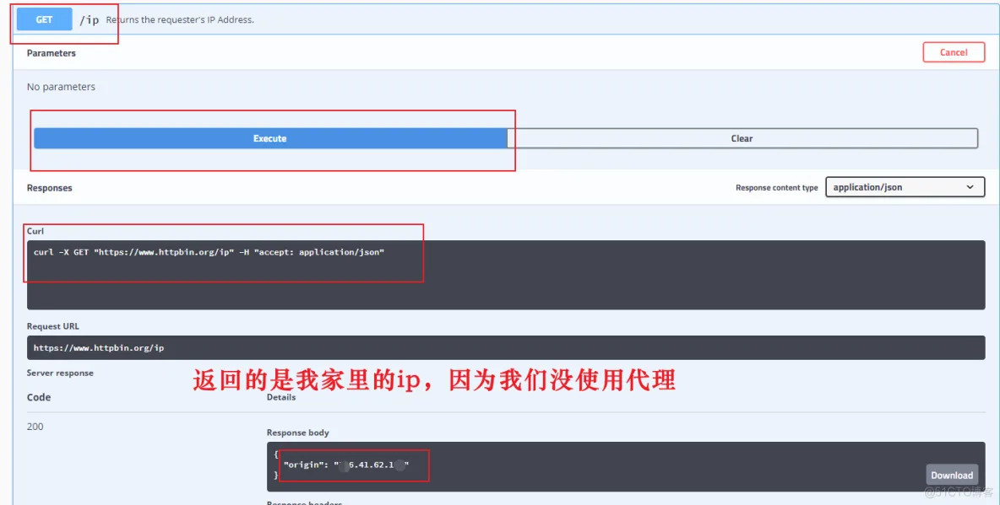 上图没有使用代理，所以返回的是我家的 ip。如果我使用代理访问，返回结果应该是 proxy 代理服务器的 ip 地址。

三、代理使用者 RestTemplate
--------------------

我的第一小节中的代理服务器的 ip 是 88.99.10.251，tinyproxy 代理服务端口 1080。下文代码通过 SimpleClientHttpRequestFactory 设置访问代理

```java
@SpringBootTest
class ProxyTests {

   @Resource
   private RestTemplate restTemplate;

   @Test
   void testProxyIp() {

      String url = "http://www.httpbin.org/ip";

      SimpleClientHttpRequestFactory requestFactory = new SimpleClientHttpRequestFactory();
      requestFactory.setProxy(
         new Proxy(
            Proxy.Type.HTTP,
            new InetSocketAddress("88.99.10.251", 1080)  //设置代理服务
         )
      );
      restTemplate.setRequestFactory(requestFactory);
      //发送请求
      String result = restTemplate.getForObject(url, String.class);
      System.out.println(result);  //打印响应结果
   }

}
```

代理类型可以是 HTTP 也可以是 SOCKS。下图是 "​http://www.httpbin.org/ip%22">​http://www.httpbin.org/ip"​​ 的请求响应结果，返回的是代理服务器的 ip，而不是我家里的 ip。说明我们为 RestTemplate 设置的代理生效了。

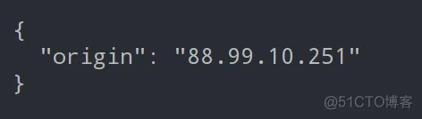

