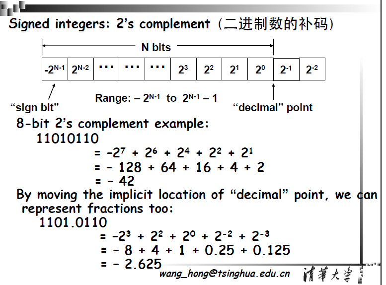

# Java 进制体系和进制转换

## 一、计算机基础概念
----

### 1. 位（bit）与字节（byte）


**位（bit，小写 b）**：计算机中最小的信息单位，表示二进制数据 `0` 或 `1`。

- **本质**：信息量的基本单位，底层类比为电子开关的“关（`0`）”与“开（`1`）”。

**字节（Byte，大写 B）**：计算机中常用的数据与存储容量的基本单位。**1 Byte = 8 bits**。

- 常见存储占用：单字符/数字占1字节，GBK编码汉字占2字节，UTF-8编码汉字占3~4字节。
- 历史背景：早期存在6位、7位字节标准，IBM体系最终奠定8位主流标准，8位二进制可覆盖256种状态，完全兼容标准ASCII字符集。


### 2. 常见字节单位换算表

以下表格列出了常见的字节单位，以及它们之间的关系：

| **单位名称** | **符号** | **换算关系**                     | **常见应用场景**         |
| ------------ | -------- | -------------------------------- | ------------------------ |
| **字节**     | B        | $1 \text{ B} = 8 \text{ bits}$   | 单个字符、指令长度       |
| **千字节**   | KB       | $1 \text{ KB} = 1024 \text{ B}$  | 纯文本文档、小型图片     |
| **兆字节**   | MB       | $1 \text{ MB} = 1024 \text{ KB}$ | MP3音乐、高清单张照片    |
| **吉字节**   | GB       | $1 \text{ GB} = 1024 \text{ MB}$ | 高清电影、大型3D游戏     |
| **太字节**   | TB       | $1 \text{ TB} = 1024 \text{ GB}$ | 消费级固态硬盘、移动硬盘 |
| **拍字节**   | PB       | $1 \text{ PB} = 1024 \text{ TB}$ | 企业级分布式数据中心     |
| **艾字节**   | EB       | $1 \text{ EB} = 1024 \text{ PB}$ | 全球互联网单日流量级别   |
| **泽字节**   | ZB       | $1 \text{ ZB} = 1024 \text{ EB}$ | 全球年度数据总总量级别   |
| **尧字节**   | YB       | $1 \text{ YB} = 1024 \text{ ZB}$ | 极大规模理论数据单位     |


## 二、进制系统与 Java 表示

### 1. 任意进制的数学展开原理（按权展开）

对于任意一个 $N$ 进制数 $D$，均可以按权展开为：

$$D = \sum k_i \times N^i$$

其中 **$N$ 为计数的基数**（Base），**$k_i$ 为第 $i$ 位的系数**（数码），**$N^i$ 为第 $i$ 位的权**（Weight）。

- 若包含整数和小数部分，设整数部分有 $n$ 位，小数部分有 $m$ 位，则 $i$ 的取值范围为从 $n-1$ 降至 $-m$。


### 2、十进制
十进制是日常生活和工作中最常使用的进位计数制。在十进制数中，每一位有 0~9 十个数码，所以计数的基数是 10。超过 9 的数必须用多位数表示，其中低位和相邻高位之间的关系是“逢十进一”，故称为十进制。例如

\[
143.75 = 1 \times 10^2 + 4 \times 10^1 + 3 \times 10^0 + 7 \times 10^{-1} + 5 \times 10^{-2}
\]

所以任意一个多位的十进制数 \(D\) 均可展开为
\[
D = \sum k_i \times 10^i
\tag{1.2.1}
\]

式中 \(k_i\) 是第 \(i\) 位的系数，它可以是 0~9 这十个数码中的任何一个。若整数部分的位数是 \(n\)、小数部分的位数为 \(m\)，则 \(i\) 包含从 \(n-1\) 到 0 的所有正整数和从 \(-1\) 到 \(-m\) 的所有负整数，整数部分的最高位为 \(n-1\)，最低位为 0；小数部分的最高位为 \(-1\)，最低位为 \(-m\)。

若以 \(N\) 取代式(1.2.1)中的 10，即可得到多位任意进制（\(N\) 进制）数展开式的普遍形式
\[
D = \sum k_i N^i
\tag{1.2.2}
\]
式中 \(i\) 的取值与式(1.2.1)的规定相同。\(N\) 称为计数的基数，\(k_i\) 为第 \(i\) 位的系数，\(N^i\) 称为第 \(i\) 位的权。

> **特点**：基数为 10，数码为 `0~9`，逢十进一。
>
> **示例**：
>
> $$(143.75)_{10} = 1 \times 10^2 + 4 \times 10^1 + 3 \times 10^0 + 7 \times 10^{-1} + 5 \times 10^{-2}$$


---

### 3、二进制
目前在数字电路中应用最广泛的是二进制。在二进制数中，每一位仅有 **0** 和 **1** 两个可能的数码，所以计数基数为 2。低位和相邻高位间的进位关系是“逢二进一”，故称为二进制。

根据式(1.2.2)，任何一个二进制数均可展开为
\[
D = \sum k_i 2^i
\tag{1.2.3}
\]
并可用上式计算出它所表示的十进制数的大小。例如
\[
\begin{align*}
(101.11)_2 &= 1 \times 2^2 + 0 \times 2^1 + 1 \times 2^0 + 1 \times 2^{-1} + 1 \times 2^{-2} \\
&= (5.75)_{10}
\end{align*}
\]

上式中分别使用下脚注 2 和 10 表示括号里的数是二进制数和十进制数。有时也用 B（Binary）和 D（Decimal）代替 2 和 10 这两个脚注。

> - **特点**：基数为 2，数码为 `0` 和 `1`，逢二进一。
>
> - **示例**：
>
>   $$(101.11)_2 = 1 \times 2^2 + 0 \times 2^1 + 1 \times 2^0 + 1 \times 2^{-1} + 1 \times 2^{-2} = (5.75)_{10}$$

---


### 4. 常见进制表示法（Java）

| **进制**     | **前缀**     | **字符范围** | **Java 字面量示例** | **对应十进制值** | **说明**                   |
| ------------ | ------------ | ------------ | ------------------- | ---------------- | -------------------------- |
| **二进制**   | `0b` 或 `0B` | `0, 1`       | `0b1010`            | `10`             | 计算机底层核心逻辑存储形式 |
| **八进制**   | `0`          | `0~7`        | `012`               | `10`             | 3位二进制可对应1位八进制   |
| **十进制**   | 无前缀       | `0~9`        | `10`                | `10`             | 日常开发、业务逻辑默认进制 |
| **十六进制** | `0x` 或 `0X` | `0~9, A~F`   | `0xA`               | `10`             | 4位二进制可对应1位十六进制 |

> ⚠️ **Java 避坑指南**： 在普通整数字面量前加上前导 `0` 会被 Java 编译器识别为**八进制**数。例如 `int price = 010;` 代表的实际是十进制的 `8`，在开发中应当严格禁止对普通十进制数加前导 `0`。

```java
int num = 42;
System.out.println(Integer.toBinaryString(num));  // 输出二进制：101010
System.out.println(Integer.toOctalString(num));   // 输出八进制：52
System.out.println(Integer.toHexString(num));     // 输出十六进制：2a

int a = 10;        // 十进制
int b = 0b1010;    // 二进制
int c = 012;       // 八进制
int d = 0xA;       // 十六进制
System.out.println(a == b && b == c && c == d);  // 输出 true
```


### 5. 16 进制（Hex）和 10 进制（Decimal）的相互转换

在 Java 中，16 进制（Hex）和 10 进制（Decimal）的相互转换非常频繁。主要可以分为**字面量表达**（直接写在代码里）和**字符串/数值转换**（运行时动态转换）两种场景。

#### 一、 字面量表达（在代码中直接书写）

在编写代码时，你可以直接使用特定的前缀来表示不同进制的数字，Java 编译器会自动将其识别为 10 进制数值。

- **10 进制字面量**：正常书写。
- **16 进制字面量**：以 `0x` 或 `0X` 开头。

```Java
int decimal = 42;       // 10 进制
int hex = 0x2A;         // 16 进制（2A 对应 10 进制的 42）

// 它们在内存中是一样的，可以直接比较
System.out.println(decimal == hex); // 输出: true
```

#### 二、 16 进制转 10 进制

通常是将一个代表 16 进制的**字符串**转换为 10 进制的**数值**。

##### 1. 使用 `Integer.parseInt()` 或 `Long.parseLong()`

这是最常用的方法，通过指定基数（Radix）为 `16` 来解析字符串。

> ⚠️ **注意**：输入的字符串**不能**包含 `0x` 前缀，否则会报 `NumberFormatException`。

```Java
String hexStr = "2a"; // 大小写均可

// 转换为 int
int decimal = Integer.parseInt(hexStr, 16); 
System.out.println(decimal); // 输出: 42
```

##### 2. 使用 `Integer.decode()`

如果你的字符串**带有 `0x` 或 `#` 前缀**，使用 `decode()` 会非常方便，它会自动识别前缀并转换。

```Java
String hexWithPrefix = "0x2A";

int decimal = Integer.decode(hexWithPrefix);
System.out.println(decimal); // 输出: 42
```

##### 3. 处理大数：`BigInteger`

如果 16 进制字符串非常长，超出了 `long` 的范围，需要使用 `BigInteger`。

```Java
String longHex = "7fffffffffffffff"; // 很大的16进制数

BigInteger bigDec = new BigInteger(longHex, 16);
System.out.println(bigDec); // 输出: 9223372036854775807
```

#### 三、 10 进制转 16 进制

将 10 进制的**数值**转换为 16 进制的**字符串**。

##### 1. 使用 `Integer.toHexString()`

这是最直接的方法，返回的是**小写**的 16 进制字符串，且不带 `0x` 前缀。

```Java
int decimal = 42;

String hexStr = Integer.toHexString(decimal);
System.out.println(hexStr); // 输出: 2a
```

##### 2. 使用 `String.format()`

如果你需要控制输出格式（比如固定长度、补零、大写、带前缀等），`String.format()` 是绝佳选择。

```Java
int decimal = 42;

// %x 表示小写，%X 表示大写
String hexStr1 = String.format("%x", decimal);  // "2a"
String hexStr2 = String.format("%X", decimal);  // "2A"

// 补零到4位长度
String hexStr3 = String.format("%04X", decimal); // "002A"
```

#### 总结速查表

| **转换方向**                        | **数据类型变化**             | **核心方法**                 | **备注**                          |
| ----------------------------------- | ---------------------------- | ---------------------------- | --------------------------------- |
| **16进制字面量**                    | `0x2A` $\rightarrow$ `int`   | 直接赋值 `int s = 0x2A;`     | 编译器自动处理                    |
| **16进制串 $\rightarrow$ 10进制数** | `String` $\rightarrow$ `int` | `Integer.parseInt(str, 16)`  | 字符串不能带 `0x`                 |
| **16进制串 $\rightarrow$ 10进制数** | `String` $\rightarrow$ `int` | `Integer.decode(str)`        | 字符串**必须/可以**带 `0x` 或 `#` |
| **10进制数 $\rightarrow$ 16进制串** | `int` $\rightarrow$ `String` | `Integer.toHexString(num)`   | 返回纯小写字符串                  |
| **10进制数 $\rightarrow$ 16进制串** | `int` $\rightarrow$ `String` | `String.format("%02X", num)` | 可灵活控制大小写及补零            |


## 三、机器数与真值

---

### 1. 概念定义

- **真值 (True Value)**：人类日常理解的、带有正负号的数学实际数值。如 `+5`, `-3`, `0.25`。
- **机器数 (Machine Number)**：数值在计算机内部存储的**真正二进制序列**，由**符号位**和**数值位**共同构成。

---

### 2. 无符号数与有符号数

- **无符号数 (Unsigned)**：所有二进制位都用于表示数值大小，只能表示非负数（$\ge 0$）。
- **有符号数 (Signed)**：最高位作为**符号位**（`0` 表示正数或零，`1` 表示负数）。
  - **Java 特性**：Java 中的 4 种整型（`byte, short, int, long`）**全部是有符号数**。若需要将其作为无符号数处理，需依赖包装类的特定 API（如 `Byte.toUnsignedInt(b)`）。

---

### 3. 为什么需要将“真值”转化为“机器数（补码）”存储？

1. **统一加法器电路**：通过将减法转化为加上一个负数（即 `A - B = A + (-B)`），使得 CPU 内部只需要设计极其精简的加法器电路，而无需专门配备减法器。
2. **消除“零”的歧义**：在原码和反码中，`+0` 和 `-0` 存在两种不同的二进制表现形式。采用补码后，`0` 的表示具有**唯一性**（即 `00000000`）。
3. **扩展负数表示范围**：8位二进制的原码能表示的范围是 `[-127, +127]`，而补码消除了 `-0` 的浪费，使得 `10000000` 能够额外表示 `-128`，从而将范围扩展为 `[-128, +127]`。


## 四、原码、反码与补码的演变历程

### 1. 编码的动机

为了在二进制中表示负数并简化运算，出现了原码、反码、补码三种方案。

------

### 2. 三种表示法

| **编码方式** | **正数映射规则**                 | **负数映射规则**                   | **核心特征及致命缺陷**                                       |
| ------------ | -------------------------------- | ---------------------------------- | ------------------------------------------------------------ |
| **原码**     | 最高位为 `0`，其余位为真值绝对值 | 最高位为 `1`，其余位为真值绝对值   | 简单直观，但**加减法电路极其复杂**，且 `+0` (`00000000`) 与 `-0` (`10000000`) 不唯一。 |
| **反码**     | 与原码完全相同                   | 符号位保持 `1`，数值位**按位取反** | 引入后可以解决部分减法计算，但仍然存在 `+0` 和 `-0` 两个零的问题，且存在跨零循环进位隐患。 |
| **补码**     | 与原码完全相同                   | 在反码的基础上，**末位加 1**       | **现代计算机的唯一通用整数标准**。统一了加减法，零的表示唯一，负数边界范围多扩充一个值。 |

------

### 3. 示例（8 位）

| 真值 | 原码     | 反码     | 补码     |
| ---- | -------- | -------- | -------- |
| +7   | 00000111 | 00000111 | 00000111 |
| -7   | 10000111 | 11111000 | 11111001 |

### 🛠 演进数学推导案例（以 $1 - 1 = 0$ 为例）


```Plaintext
【原码尝试】 1 + (-1) = [00000001]原 + [10000001]原 = [10000010]原 = -2  ❌ 结果错误
【反码尝试】 1 + (-1) = [00000001]反 + [11111110]反 = [11111111]反 = [10000000]原 = -0  🔺 数值对但存在-0
【补码标准】 1 + (-1) = [00000001]补 + [11111111]补 = [00000000]补（溢出位1被舍弃） = 0 	
```


### 5. 补码的原理

补码还原为十进制数每一位的权重



**二进制补码（2's complement）表示有符号数**的说明，核心内容可分为以下部分：

#### 1. 补码的结构与范围

- **N 位补码的权重分布**：
  - 最高位为 “符号位”，权重是\(-2^{N-1}\)；
  - 其余位为数值位（含整数、小数部分），权重对应\(2^{N-2}\)、\(2^{N-3}\)…\(2^0\)（整数）或\(2^{-1}\)、\(2^{-2}\)…（小数）。
- **表示范围**：\(-2^{N-1}\) 到 \(2^{N-1}-1\)，这是 N 位补码能覆盖的有符号整数区间。

**示例**：二进制补码 `1101.0110`

$$\text{真值} = (-1 \times 2^3) + (1 \times 2^2) + (0 \times 2^1) + (1 \times 2^0) + (0 \times 2^{-1}) + (1 \times 2^{-2}) + (1 \times 2^{-3}) + (0 \times 2^{-4})$$

$$\text{真值} = -8 + 4 + 0 + 1 + 0 + 0.25 + 0.125 = -2.625$$


## 五、进制转换

### 1. 二进制 → 十进制

将二进制数转换为等值的十进制数称为二-十转换。转换时只要将二进制数按式展开，然后将所有各项的数值按十进制数相加，就可以得到等值的十进制数了。例如

$$
\begin{align*}
(1011.01)_2 &= 1 \times 2^3 + 0 \times 2^2 + 1 \times 2^1 + 1 \times 2^0 + 0 \times 2^{-1} + 1 \times 2^{-2} \\
&= (11.25)_{10}
\end{align*}
$$

#### **方法：按权相加法**

> **整数法则**：从右向左，第 $i$ 位的数码乘以 $2^i$（$i$ 从 0 开始）。
>
> **小数法则**：从左向右，第 $j$ 位的数码乘以 $2^{-j}$（$j$ 从 1 开始）。

示例：

```
1010.101 = 1×2³ + 0×2² + 1×2¹ + 0×2⁰
         + 1×2⁻¹ + 0×2⁻² + 1×2⁻³
       = 10.625
```

#### Java 实现：

```java
public static double convert(String binary) {
    if (!binary.contains(".")) return Integer.parseInt(binary, 2);
    String[] parts = binary.split("\\.");
    int integerValue = Integer.parseInt(parts[0], 2);
    double frac = 0;
    for (int i = 0; i < parts[1].length(); i++)
        frac += (parts[1].charAt(i) - '0') * Math.pow(2, -(i + 1));
    return integerValue + frac;
}
```

### 2.十进制-->二进制数

#### 1、数学推理

十进制数转换为等值的二进制数。

首先讨论整数的转换。

假定十进制整数为 \((S)_{10}\)，等值的二进制数为 \((k_nk_{n-1}\dots k_0)_2\)，则可知
\[
\begin{align*}
(S)_{10} &= (k_n2^n + k_{n-1}2^{n-1} + \dots + k_12^1 + k_02^0)_2 \\
&= 2\bigl(k_n2^{n-1} + k_{n-1}2^{n-2} + \dots + k_1\bigr)_2 + k_0
\end{align*}
\tag{1.3.1}
\]

上式表明，若将 \((S)_{10}\) 除以 2，则得到的商为 \(k_n2^{n-1} + k_{n-1}2^{n-2} + \dots + k_1\)，而余数即 \(k_0\)。

同理，可将式(1.3.1)除以 2 得到的商写成
\[
\bigl(k_n2^{n-1} + k_{n-1}2^{n-2} + \dots + k_1\bigr)_2 = 2\bigl(k_n2^{n-2} + k_{n-1}2^{n-3} + \dots + k_2\bigr)_2 + k_1
\tag{1.3.2}
\]

由式(1.3.2)不难看出，若将 \((S)_{10}\) 除以 2 所得的商再次除以 2，则所得余数即 \(k_1\)。

依此类推，反复将每次得到的商再除以 2，就可求得二进制数的每一位了。

例如，将 \((173)_{10}\) 化为二进制数可如下进行

```
2 | 173  ........................ 余数 = 1 = k₀
2 |  86  ........................ 余数 = 0 = k₁
2 |  43  ........................ 余数 = 1 = k₂
2 |  21  ........................ 余数 = 1 = k₃
2 |  10  ........................ 余数 = 0 = k₄
2 |   5  ........................ 余数 = 1 = k₅
2 |   2  ........................ 余数 = 0 = k₆
2 |   1  ........................ 余数 = 1 = k₇
     0
```

故\((173)_{10}\)=\((10101101)_{2}\),


**其次讨论小数的转换。**

若 \((S)_{10}\) 是一个十进制的小数，对应的二进制小数为 \((0.k_{-1}k_{-2}\dots k_{-m})_2\)，则据式(1.2.3)可知
\[
(S)_{10} = \bigl(k_{-1}2^{-1} + k_{-2}2^{-2} + \dots + k_{-m}2^{-m}\bigr)_2
\]

将上式两边同乘以 2 得到
\[
2(S)_{10} = k_{-1} + \bigl(k_{-2}2^{-1} + k_{-3}2^{-2} + \dots + k_{-m}2^{-m+1}\bigr)_2
\tag{1.3.3}
\]

式(1.3.3)说明，将小数 \((S)_{10}\) 乘以 2 所得乘积的整数部分即 \(k_{-1}\)。

同理，将乘积的小数部分再乘以 2 又可得到
\[
2\bigl(k_{-2}2^{-1} + k_{-3}2^{-2} + \dots + k_{-m}2^{-m+1}\bigr)_2 = k_{-2} + \bigl(k_{-3}2^{-1} + \dots + k_{-m}2^{-m+2}\bigr)_2
\tag{1.3.4}
\]
亦即乘积的整数部分就是 \(k_{-2}\)。

依此类推，将每次乘 2 后所得乘积的小数部分再乘以 2，便可求出二进制小数的每一位了。

例如，将 \((0.8125)_{10}\) 化为二进制小数时可如下进行

```
      0.8125
    ×       2
    ----------
      1.6250  ........................ 整数部分 = 1 = k_{-1}
      0.6250
    ×       2
    ----------
      1.2500  ........................ 整数部分 = 1 = k_{-2}
      0.2500
    ×       2
    ----------
      0.5000  ........................ 整数部分 = 0 = k_{-3}
      0.5000
    ×       2
    ----------
      1.0000  ........................ 整数部分 = 1 = k_{-4}
```

故 \((0.8125)_{10} = (0.1101)_2\)


---

#### 2、 转换原理总结

十进制（Base 10）转为二进制（Base 2）时，遵循以下思路：

- **整数部分**：“除 2 取余，逆序排列”法。
- **小数部分**：“乘 2 取整，顺序排列”法。

---

#### 3、转换案例

1. 整数部分的转换 —— “除 2 取余法”

> ✅ 步骤：
>
> 1. 用 2 除十进制整数；
> 2. 记录 **余数**（0 或 1）；
> 3. 再用商继续除 2；
> 4. 直到商为 0；
> 5. 将余数 **倒序排列** 即为二进制结果。
>
> 🔹 示例：十进制 `173` 转二进制
>
> | 步骤    | 商   | 余数 |
> | ------- | ---- | ---- |
> | 173 ÷ 2 | 86   | 1    |
> | 86 ÷ 2  | 43   | 0    |
> | 43 ÷ 2  | 21   | 1    |
> | 21 ÷ 2  | 10   | 1    |
> | 10 ÷ 2  | 5    | 0    |
> | 5 ÷ 2   | 2    | 1    |
> | 2 ÷ 2   | 1    | 0    |
> | 1 ÷ 2   | 0    | 1    |
>
> 然后将余数 **倒序排列（从最后一行到第一行）**：
>
> ```
> 173₁₀ = 10101101₂
> ```
>
> ✅ 验证：
>  `1×128 + 0×64 + 1×32 + 0×16 + 1×8 + 1×4 + 0×2 + 1×1 = 173` ✅

---

2. 小数部分的转换 —— “乘 2 取整法”

> ✅ 步骤：
>
> 1. 用十进制小数部分 × 2；
> 2. 记录 **整数部分（0 或 1）**；
> 3. 取 **小数部分** 继续乘 2；
> 4. 重复，直到小数为 0 或达到精度要求；
> 5. 将取到的整数部分 **顺序排列**。
>
> 🔹 示例：十进制 `0.8125` 转二进制
>
> | 步骤               | 计算 | 整数部分 |
> | ------------------ | ---- | -------- |
> | 0.8125 × 2 = 1.625 | 1    |          |
> | 0.625 × 2 = 1.25   | 1    |          |
> | 0.25 × 2 = 0.5     | 0    |          |
> | 0.5 × 2 = 1.0      | 1    |          |
>
> 将每次得到的整数部分按顺序排列：
>
> ```
> 0.8125₁₀ = 0.1101₂
> ```
>
> ✅ 验证：
>  `1×(1/2) + 1×(1/4) + 0×(1/8) + 1×(1/16) = 0.8125` ✅

3. 合并整数与小数部分✅

```
(173.8125)₁₀ = (10101101.1101)₂
```

4. 验证 🔍 

将二进制 `10101101.1101` 转回十进制验证：

整数部分：

```
1×128 + 0×64 + 1×32 + 0×16 + 1×8 + 1×4 + 0×2 + 1×1 = 173
```

小数部分：

```
1×(1/2) + 1×(1/4) + 0×(1/8) + 1×(1/16) = 0.8125
```

合计：`173 + 0.8125 = 173.8125` ✅ 完全正确！

---

#### 4、 Java 实现转换代码


```java
public class DecimalToBinary {
  public static void main(String[] args) {
    String decimal = "173.8125";
    String binary = convert(decimal);
    System.out.println(
        "十进制 " + decimal + " 转换为二进制为：" + binary); //    十进制 173.8125 转换为二进制为：10101101.1101
  }

  public static String convert(String decimal) {
    // 分割整数和小数部分
    String[] parts = decimal.split("\\.");
    String integerStr = parts[0];
    String fractionalStr = parts.length > 1 ? parts[1] : "";

    // 转换整数部分
    int integerPart = Integer.parseInt(integerStr);
    String intBinary = convertInteger(integerPart);

    // 转换小数部分
    String fracBinary = convertFractional(fractionalStr);

    // 合并结果
    if (fracBinary.isEmpty()) {
      return intBinary;
    } else {
      return intBinary + "." + fracBinary;
    }
  }

  // 转换整数部分（除2取余法）
  private static String convertInteger(int n) {
    if (n == 0) return "0";
    StringBuilder sb = new StringBuilder();
    while (n > 0) {
      sb.insert(0, n % 2);
      n /= 2;
    }
    return sb.toString();
  }

  // 转换小数部分（乘2取整法）
  private static String convertFractional(String fractionalStr) {
    if (fractionalStr.isEmpty()) return "";

    // 将小数部分转换为 0.xxxx 的double值
    double fractional = Double.parseDouble("0." + fractionalStr);
    StringBuilder sb = new StringBuilder();
    int precision = 10; // 最多保留10位二进制小数

    while (fractional > 0 && precision-- > 0) {
      fractional *= 2;
      int bit = (int) fractional;
      sb.append(bit);
      fractional -= bit;
    }
    return sb.toString();
  }
}
```


## 六、数据存储与字节序（Endianness）

**字节序** 指的是多字节数据（如 `int, long`）在计算机内存中连续存储时的**字节排列顺序**。

### 1. 大端序 vs 小端序

- **大端序 (Big-Endian)**：数据的**最高有效字节 (MSB)** 存储在内存的**最低地址**（符合人类由高到低的阅读习惯）。
- **小端序 (Little-Endian)**：数据的**最低有效字节 (LSB)** 存储在内存的**最低地址**（符合主流 CPU 如 x86 架构的硬件处理逻辑）。

### 2. 示例（概念性）

假设有一个 32 位整数值：`0x12345678`

| 存储方式                 | 内存排列顺序（从低地址到高地址） |
| ------------------------ | -------------------------------- |
| **大端 (Big-Endian)**    | `12 34 56 78`                    |
| **小端 (Little-Endian)** | `78 56 34 12`                    |

---

### 3. JVM 内部一律采用大端序

Java 屏蔽了底层操作系统的字节序差异，**JVM 内部一律采用大端序**。当需要与外部 C/C++ 原生库（JNI）或特定文件流进行二进制交互时，需借助 `ByteBuffer` 调整字节序：

```java
import java.nio.*;

ByteBuffer buffer = ByteBuffer.allocate(4);
buffer.order(ByteOrder.LITTLE_ENDIAN); // 设置为小端
buffer.putInt(0x12345678);

buffer.rewind();
System.out.printf("0x%08X", buffer.getInt()); // 输出：0x78563412
```

常用方法：

| 方法                             | 作用                              |
| -------------------------------- | --------------------------------- |
| `order()`                        | 获取当前字节序                    |
| `order(ByteOrder.BIG_ENDIAN)`    | 设置为大端                        |
| `order(ByteOrder.LITTLE_ENDIAN)` | 设置为小端                        |
| `ByteOrder.nativeOrder()`        | 获取当前 JVM 运行平台的本地字节序 |


------

## 七、IEEE 754 浮点数标准

计算机中的浮点数由三部分组成，其真实数学公式为：$(-1)^{\text{sign}} \times (1.\text{fraction}) \times 2^{\text{exponent} - \text{bias}}$。

### 1. 结构拆解表

| **类型**   | **总位数** | **符号位 (Sign)** | **指数位 (Exponent)** | **尾数位 (Fraction)** | **指数偏移量 (Bias)** |
| ---------- | ---------- | ----------------- | --------------------- | --------------------- | --------------------- |
| **float**  | 32 bits    | 1 bit             | 8 bits                | 23 bits               | 127                   |
| **double** | 64 bits    | 1 bit             | 11 bits               | 52 bits               | 1023                  |

------

### 2. 特殊保留值规则

- **指数全 0，尾数全 0**：表示 $\pm 0$。
- **指数全 1，尾数全 0**：表示 $\pm \infty$（无穷大，例如 `1.0 / 0.0`）。
- **指数全 1，尾数非 0**：表示 **NaN**（Not a Number，非数，例如 `0.0 / 0.0` 或 `Math.sqrt(-1)`）。

------

### 3. **案例 : 单精度浮点数 (float) 转换 -  十进制 123.456f  转换为 IEEE 754 二进制表示**

为了更深入地理解 IEEE 754 标准，我们来补充一些浮点数和 IEEE 754 二进制表示之间转换的案例，包括单精度 (float) 和双精度 (double)。


**步骤 1:  确定符号位 (Sign bit)**

- 123.456 是正数，所以符号位为 **0**。

**步骤 2:  转换为二进制形式 (整数部分和小数部分)**

- **整数部分 (123):**  123 的二进制是 `1111011`

- **小数部分 (0.456):**  需要将小数部分转换为二进制。 我们可以通过不断乘以 2 并取整数部分来得到二进制小数：

  ```sh
  0.456 * 2 = 0.912  -> 整数部分: 0
  0.912 * 2 = 1.824  -> 整数部分: 1
  0.824 * 2 = 1.648  -> 整数部分: 1
  0.648 * 2 = 1.296  -> 整数部分: 1
  0.296 * 2 = 0.592  -> 整数部分: 0
  0.592 * 2 = 1.184  -> 整数部分: 1
  0.184 * 2 = 0.368  -> 整数部分: 0
  0.368 * 2 = 0.736  -> 整数部分: 0
  0.736 * 2 = 1.472  -> 整数部分: 1
  0.472 * 2 = 0.944  -> 整数部分: 0
  ... (继续下去，直到达到所需的精度或重复)
  ```

  所以，0.456 的二进制近似为 `011101001...`

- **合并整数和小数部分:**  123.456 的二进制近似为 `1111011.011101001...`

**步骤 3:  规格化 (Normalization) 并确定指数 (Exponent) 和尾数 (Mantissa)**

- **规格化:** 将二进制数表示为 `1.xxxx... × 2^指数` 的形式。  将小数点左移 6 位，得到 `1.111011011101001... × 2^6`
- **尾数 (Mantissa):**  小数点后的部分 `111011011101001...`  单精度尾数部分为 23 位，我们需要截取或舍入到 23 位。 假设我们截取前 23 位： `11101101110100100000000`
- **指数 (Exponent):**  指数是 6。  对于单精度浮点数，指数偏移量 (bias) 是 127。  所以，存储的指数值是 `6 + 127 = 133`。  133 的二进制是 `10000101`。

**步骤 4:  组合符号位、指数和尾数**

- **符号位:** `0`

- **指数:** `10000101`

- **尾数:** `11101101110100100000000`

- **IEEE 754 二进制表示 (单精度):**

  `0 10000101 11101101110100100000000`

  转换为十六进制表示（每 4 位二进制转换为 1 位十六进制）：

  `4 2 F 6 E 9 7 9`  ->  `0x42F6E979`

**验证 (使用 Java 代码)**

```Java
float floatValue = 123.456f;
int floatBits = Float.floatToIntBits(floatValue);
String hexString = String.format("%08X", floatBits); // 格式化为 8 位十六进制
System.out.println("Float 123.456f 的 IEEE 754 十六进制表示: 0x" + hexString);
// 输出: Float 123.456f 的 IEEE 754 十六进制表示: 0x42F6E979Java
```


### Float 类型与 byte 数组互相转换的 Java 工具类

你需要的是一个能将 Float 类型与 byte 数组互相转换的 Java 工具类，并且要求同时实现基于**位操作**和**ByteBuffer** 两种方式，

完整工具类代码

```java
import java.nio.ByteBuffer;
import java.nio.ByteOrder;

/**
 * Float 与 byte 数组互转工具类
 * 提供基于位操作和 ByteBuffer 两种实现方式
 */
public class FloatByteConverter {

    // ====================== 基于 ByteBuffer 的转换方式 ======================
    /**
     * ByteBuffer 方式：Float 转 byte 数组（默认大端序）
     * @param value 待转换的 Float 值
     * @return 转换后的 byte 数组（长度固定为4）
     */
    public static byte[] floatToBytesByByteBuffer(float value) {
        return floatToBytesByByteBuffer(value, ByteOrder.BIG_ENDIAN);
    }

    /**
     * ByteBuffer 方式：Float 转 byte 数组（指定字节序）
     * @param value 待转换的 Float 值
     * @param order 字节序（BIG_ENDIAN / LITTLE_ENDIAN）
     * @return 转换后的 byte 数组（长度固定为4）
     */
    public static byte[] floatToBytesByByteBuffer(float value, ByteOrder order) {
        ByteBuffer buffer = ByteBuffer.allocate(4); // Float 占4个字节
        buffer.order(order); // 设置字节序
        buffer.putFloat(value);
        return buffer.array();
    }

    /**
     * ByteBuffer 方式：byte 数组转 Float（默认大端序）
     * @param bytes 待转换的 byte 数组（长度必须为4）
     * @return 恢复后的 Float 值
     * @throws IllegalArgumentException 数组长度非法时抛出
     */
    public static float bytesToFloatByByteBuffer(byte[] bytes) {
        return bytesToFloatByByteBuffer(bytes, ByteOrder.BIG_ENDIAN);
    }

    /**
     * ByteBuffer 方式：byte 数组转 Float（指定字节序）
     * @param bytes 待转换的 byte 数组（长度必须为4）
     * @param order 字节序（BIG_ENDIAN / LITTLE_ENDIAN）
     * @return 恢复后的 Float 值
     * @throws IllegalArgumentException 数组长度非法时抛出
     */
    public static float bytesToFloatByByteBuffer(byte[] bytes, ByteOrder order) {
        if (bytes == null || bytes.length != 4) {
            throw new IllegalArgumentException("byte数组长度必须为4！");
        }
        ByteBuffer buffer = ByteBuffer.wrap(bytes);
        buffer.order(order);
        return buffer.getFloat();
    }

    // ====================== 基于位操作的转换方式 ======================
    /**
     * 位操作方式：Float 转 byte 数组（大端序）
     * 原理：先将 Float 转成 int（通过 Float.floatToIntBits），再对 int 按位拆分
     * @param value 待转换的 Float 值
     * @return 转换后的 byte 数组（长度固定为4）
     */
    public static byte[] floatToBytesByBitOperation(float value) {
        return floatToBytesByBitOperation(value, ByteOrder.BIG_ENDIAN);
    }

    /**
     * 位操作方式：Float 转 byte 数组（指定字节序）
     * @param value 待转换的 Float 值
     * @param order 字节序（BIG_ENDIAN / LITTLE_ENDIAN）
     * @return 转换后的 byte 数组（长度固定为4）
     */
    public static byte[] floatToBytesByBitOperation(float value, ByteOrder order) {
        // 将 Float 转换为对应的 int 位模式（符合 IEEE 754 标准）
        int intValue = Float.floatToIntBits(value);
        byte[] bytes = new byte[4];
        
        if (order == ByteOrder.BIG_ENDIAN) {
            // 大端序：高位在前（第0位存最高8位，第3位存最低8位）
            bytes[0] = (byte) (intValue >> 24);
            bytes[1] = (byte) (intValue >> 16);
            bytes[2] = (byte) (intValue >> 8);
            bytes[3] = (byte) intValue;
        } else {
            // 小端序：低位在前（第0位存最低8位，第3位存最高8位）
            bytes[0] = (byte) intValue;
            bytes[1] = (byte) (intValue >> 8);
            bytes[2] = (byte) (intValue >> 16);
            bytes[3] = (byte) (intValue >> 24);
        }
        return bytes;
    }

    /**
     * 位操作方式：byte 数组转 Float（大端序）
     * @param bytes 待转换的 byte 数组（长度必须为4）
     * @return 恢复后的 Float 值
     * @throws IllegalArgumentException 数组长度非法时抛出
     */
    public static float bytesToFloatByBitOperation(byte[] bytes) {
        return bytesToFloatByBitOperation(bytes, ByteOrder.BIG_ENDIAN);
    }

    /**
     * 位操作方式：byte 数组转 Float（指定字节序）
     * @param bytes 待转换的 byte 数组（长度必须为4）
     * @param order 字节序（BIG_ENDIAN / LITTLE_ENDIAN）
     * @return 恢复后的 Float 值
     * @throws IllegalArgumentException 数组长度非法时抛出
     */
    public static float bytesToFloatByBitOperation(byte[] bytes, ByteOrder order) {
        if (bytes == null || bytes.length != 4) {
            throw new IllegalArgumentException("byte数组长度必须为4！");
        }
        
        int intValue = 0;
        if (order == ByteOrder.BIG_ENDIAN) {
            // 大端序：拼接 int（注意 & 0xFF 防止符号位扩展）
            intValue = ((bytes[0] & 0xFF) << 24) 
                    | ((bytes[1] & 0xFF) << 16) 
                    | ((bytes[2] & 0xFF) << 8) 
                    | (bytes[3] & 0xFF);
        } else {
            // 小端序：拼接 int
            intValue = (bytes[0] & 0xFF) 
                    | ((bytes[1] & 0xFF) << 8) 
                    | ((bytes[2] & 0xFF) << 16) 
                    | ((bytes[3] & 0xFF) << 24);
        }
        // 将 int 位模式转回 Float
        return Float.intBitsToFloat(intValue);
    }

    // ====================== 测试方法 ======================
    public static void main(String[] args) {
        float testValue = 123.456f;
        ByteOrder order = ByteOrder.BIG_ENDIAN; // 可切换为 LITTLE_ENDIAN 测试

        // 测试 ByteBuffer 方式
        byte[] bytes1 = floatToBytesByByteBuffer(testValue, order);
        float restore1 = bytesToFloatByByteBuffer(bytes1, order);
        System.out.println("=== ByteBuffer 方式 ===");
        System.out.println("原始值：" + testValue);
        System.out.println("转换后的byte数组：" + java.util.Arrays.toString(bytes1));
        System.out.println("恢复后的值：" + restore1);

        // 测试位操作方式
        byte[] bytes2 = floatToBytesByBitOperation(testValue, order);
        float restore2 = bytesToFloatByBitOperation(bytes2, order);
        System.out.println("\n=== 位操作方式 ===");
        System.out.println("原始值：" + testValue);
        System.out.println("转换后的byte数组：" + java.util.Arrays.toString(bytes2));
        System.out.println("恢复后的值：" + restore2);

        // 验证两种方式的结果是否一致
        System.out.println("\n两种方式转换的byte数组是否一致：" + java.util.Arrays.equals(bytes1, bytes2));
    }
}
```

关键代码解释

1. **ByteBuffer 方式核心逻辑**：
   - `ByteBuffer.allocate(4)`：分配4字节缓冲区（Float 固定占4字节）。
   - `buffer.order(order)`：指定字节序（大端/小端），大端序是网络传输默认格式，小端序是大部分CPU的本地格式。
   - `buffer.putFloat()`/`buffer.getFloat()`：直接完成 Float 与字节数组的互转，底层已封装位操作，简洁且不易出错。

2. **位操作方式核心逻辑**：
   - `Float.floatToIntBits(value)`：将 Float 按 IEEE 754 标准转换为对应的 int 位模式（保留符号、指数、尾数的二进制结构）。
   - 按位拆分/拼接：通过移位（`>>`）和按位与（`& 0xFF`）操作拆分/拼接 int，`& 0xFF` 是为了将 byte 转换为无符号的8位值，避免符号位扩展导致错误。
   - `Float.intBitsToFloat(intValue)`：将 int 位模式还原为 Float。

3. **异常处理**：
   - 校验 byte 数组长度必须为4，避免数组越界或转换错误。

测试输出示例（大端序）

```
=== ByteBuffer 方式 ===
原始值：123.456
转换后的byte数组：[66, -4, 73, -52]
恢复后的值：123.45600128173828

=== 位操作方式 ===
原始值：123.456
转换后的byte数组：[66, -4, 73, -52]
恢复后的值：123.45600128173828

两种方式转换的byte数组是否一致：true
```

（注：Float 是单精度浮点数，存在微小精度损失，属于正常现象。）

总结

1. **ByteBuffer 方式**：代码简洁、可读性高、不易出错，推荐日常开发使用，底层已优化，性能足够。
2. **位操作方式**：更贴近底层原理，适合理解 Float 二进制存储结构，或需要手动控制位操作的场景。
3. **关键注意点**：转换和恢复时必须使用**相同的字节序**，否则会得到错误结果；byte 数组长度必须为4（Float 固定


## 八、Java 基本数据类型与包装类

### 1. 基本类型对照表

| 数据类型  | 字节数 | 取值范围                                    |
| :-------- | :----- | :------------------------------------------ |
| `byte`    | 1      | -128 到 127                                 |
| `short`   | 2      | -32768 到 32767                             |
| `int`     | 4      | -2147483648 到 2147483647                   |
| `long`    | 8      | -9223372036854775808 到 9223372036854775807 |
| `float`   | 4      | ±1.4E-45 到 ±3.4028235E38                   |
| `double`  | 8      | ±4.9E-324 到 ±1.7976931348623157E308        |
| `char`    | 2      | 0 到 65535                                  |
| `boolean` | 1      | `true` 或 `false`                           |


### 2. Java 包装类方法汇总（JDK 标准类库中）

去除了冷门、底层的位操作（如字节反转、书写方向等），保留了 80% 开发场景中会用到的 20% 核心方法。

#### 🔷 1. Boolean 类（最常用）

| **方法名**                      | **返回类型** | **核心作用**       | **避坑/小贴士**                                           |
| ------------------------------- | ------------ | ------------------ | --------------------------------------------------------- |
| `parseBoolean(String s)`        | `boolean`    | 字符串转基本布尔值 | 只有 `IgnoreCase("true")` 才返回 `true`，其余皆为 `false` |
| `valueOf(String/boolean)`       | `Boolean`    | 获取包装类对象     | 内部使用缓存，性能优于 `new Boolean()`                    |
| `compare(boolean x, boolean y)` | `int`        | 比较大小           | `true > false`。常用于 Stream 流排序                      |

#### 🔷 2. Character 类（刷题/文本处理高频）

① 字符类型判断（`isXxx` 系列）

- **`isDigit(char ch)`**：是否为数字 `0-9`。
- **`isLetter(char ch)`**：是否为英文字母。
- **`isLetterOrDigit(char ch)`**：是否为字母或数字（常用于验证账号、密码合法性）。
- **`isLowerCase / isUpperCase(char ch)`**：是否为小/大写字母。
- **`isWhitespace(char ch)`**：是否为空格、制表符 `\t`、换行符 `\n`。

② 字符转换与大小写

- **`toLowerCase / toUpperCase(char ch)`**：转小/大写。
- **`getNumericValue(char ch)`**：获取字符的数字值（例如 `'1'` $\rightarrow$ `1`，而直接强转 `(int)'1'` 会得到 ASCII 码 `49`）。

③ Unicode 增补字符（高级平面/Emoji处理）

> 📌 **大厂面试常考**：Java 的 `char` 是 16 位的，无法直接存 Emoji 等 4 字节字符（需要 2 个 `char` 拼成一个 `codePoint`）。

- **`codePointAt(CharSequence seq, int index)`**：获取指定位置的完整 Unicode 码点。
- **`charCount(int codePoint)`**：判断该码点占 1 个还是 2 个 `char`（Emoji 返回 `2`）。
- **`codePointCount(CharSequence seq, int begin, int end)`**：统计**真实字符数**，而不是 `length()` 里的 `char` 数量。

#### 🔷 3. 整型包装类（Byte / Short / Integer / Long）

这类方法在四个整型类中完全通用，以 `Integer` 为代表：

① 字符串与数值转换（核心三剑客）

- **`parseInt(String s)`**：字符串 $\rightarrow$ `int` 基本类型（纯数字串）。
- **`parseInt(String s, int radix)`**：按指定进制解析（如 `Integer.parseInt("2A", 16)` $\rightarrow$ `42`）。
- **`valueOf(String s)`**：字符串 $\rightarrow$ `Integer` 对象（高频使用，带 $-128 \sim 127$ 缓存池）。
- **`decode(String nm)`**：智能解析。支持 `0x`（16进制）、`0`（8进制）开头的字符串。

② 进制转换（转为字符串）

- **`toBinaryString(int i)`**：转二进制字符串。
- **`toHexString(int i)`**：转十六进制字符串（纯小写，不带 `0x`）。
- **`toOctalString(int i)`**：转八进制字符串。

③ 统计与比较（JDK 8+）

- **`bitCount(int i)`**：返回二进制中 **`1` 的个数**（LeetCode 经典位运算题常用）。
- **`compare(int x, int y)`**：比较大小，返回 `1, 0, -1`。

#### 🔷 4. 浮点型包装类（Float / Double）

除了具备与整型相似的 `parseXxx()`、`valueOf()` 之外，浮点型有其特有的状态判断：

- **`isNaN(double v)`**：判断是否是**非数字**（Not a Number，如 `0.0 / 0.0`）。

  > ⚠️ **注意**：在 Java 中，`double x = 0.0/0.0; x == Double.NaN` 永远返回 `false`，必须用 `Double.isNaN(x)` 判断。

- **`isInfinite(double v)`**：判断是否为**正无穷或负无穷**（如 `1.0 / 0.0`）。

- **`compare(double d1, double d2)`**：浮点数因为有精度问题，**绝不能**直接用 `==` 比较，推荐使用 `Double.compare()`。

#### 🔷 5. 通用转换：Number 抽象类方法

所有**数值型包装类**（Byte、Short、Integer、Long、Float、Double）都继承自 `Number`，因此它们都自带以下 6 个相互转换的基本类型方法：

Java

```
Integer num = 100;

byte b    = num.byteValue();
short s   = num.shortValue();
int i     = num.intValue();
long l    = num.longValue();
float f   = num.floatValue();
double d  = num.doubleValue();
```

#### 💡 终极记忆口诀

> - **`parseXxx()`** $\rightarrow$ 返回 **基本类型**（如 `int`、`double`）
> - **`valueOf()`** $\rightarrow$ 返回 **包装类对象**（如 `Integer`、`Double`，且自带缓存加速）
> - **`xxxValue()`** $\rightarrow$ 包装类**互转**基本类型
> - 所有包装类都是 **`final` 不可变类**（Immutable），线程安全。


------


## 九、总结

| 模块         | 核心要点                             |
| ------------ | ------------------------------------ |
| **位与字节** | 1 字节 = 8 位，是存储的基本单位      |
| **进制系统** | Java 支持二、八、十、十六进制常量    |
| **补码**     | 统一加减法，零唯一，现代通用标准     |
| **浮点数**   | 遵循 IEEE 754，精度由尾数长度决定    |
| **字节序**   | Java 默认大端，跨系统需注意          |
| **包装类**   | 提供类型转换、位操作与字符串解析功能 |

------


位运算符
====

位运算符矩阵指南
----

| **运算符** | **运算符名称** | **核心运算规则**                             | **核心应用场景**                           |
| ---------- | -------------- | -------------------------------------------- | ------------------------------------------ |
| `&`        | 按位与         | 对应位**都为 1** 才结果为 1，否则为 0        | 位掩码提取、清零特定位、**判断奇偶性**     |
| `|`        | 按位或         | 对应位**只要有 1** 结果就为 1，否则为 0      | 合并位标志、设置特定位为 1                 |
| `^`        | 按位异或       | 对应位**不同为 1**，相同为 0                 | 位状态翻转、自反加解密、无临时变量数据交换 |
| `~`        | 按位非         | 单目运算符，全体二进制位取反（0变1, 1变0）   | 取反码、构建特定反向掩码                   |
| `<<`       | 左移           | 全体左移，**右边低位一律补 0**               | 高效计算乘以 $2^n$（在不溢出的前提下）     |
| `>>`       | 算术右移       | 全体右移，**左边高位补符号位**（正补0负补1） | 高效计算除以 $2^n$（向下取整）             |
| `>>>`      | 无符号右移     | 全体右移，**左边高位一律补 0**（零扩展）     | 处理无符号数、哈希映射算法、ARGB 颜色拆解  |

运算过程：

```java
@Test
    public  void testBit() {
        // 正数 : 原码 反码 补码 一样
        // 负数数 : 补码=反码 + 1  【符号位始终保持不变】
      /*
         -10  运算转换成int
         原码：10000000 00000000 00000000 00001010
         反码: 11111111 11111111 11111111 11110101
         补码: 11111111 11111111 11111111 11110110 计算机底层保存
        */

        /* ------------------------------[-10 >> 2]-----------------------------------------
            [-10补码]       1 1111111 11111111 11111111 11110110
            补码>> 2运算后   1 1111111 11111111 11111111 11111101   考虑符号位，负数补1，正数补0
                    -1     1 1111111 11111111 11111111 11111100
             取反得到结果    1 0000000 00000000 00000000 00000011   结果十进制-3
         */
        System.out.println(-10 >> 2);// -3
        /*----------------------------[10 >> 2]-------------------------------------------
            10   00000000 00000000 00000000 00001010[原码,反码,补码]

           [补码]    00000000 00000000 00000000 00001010
            >> 2    00000000 00000000 00000000 00000010
                                       [补码还原]    -> 2
         */
        System.out.println(10 >> 2);// 2

        /*------------------------------[-10 << 2]-----------------------------------------
            [-10补码]       1 1111111 11111111 11111111 11110110
            补码<<2运算后    1 1111111 11111111 11111111 11011000   考虑符号位，负数补1，正数补0
                    -1     1 1111111 11111111 11111111 11010111
             取反得到结果    1 0000000 00000000 00000000 00101000   结果十进制-10
         */
        System.out.println(-10 << 2 );//-40
        /*-----------------------------[10 >> 2]------------------------------------------
            10   00000000 00000000 00000000 00001010[原码,反码,补码]

           [补码]    00000000 00000000 00000000 00001010
            << 2    00000000 00000000 00000000 00101000
                                       [补码还原]    -> 40
         */
        System.out.println(10 >> 2);// 40


        /* -------------------------[ -10 >>>2]----------------------------------------------
        -10补码         1 1111111 11111111 11111111 11110110
        补码>>>2运算后   0 0111111 11111111 11111111 11111101考虑符号位，负数补1，正数补0
        最高位0，反码一致 0 0111111 11111111 11111111 11111101
        最高位0，补码一致 0 0111111 11111111 11111111 11111101   结果十进制1073741821
         */
        System.out.println(-10 >>> 2);//1,073,741,821
        /* -------------------------[ 10 >>>2]----------------------------------------------
        10补码          0 0000000 00000000 00000000 00001010
        补码>>>2运算后   0 0000000 00000000 00000000 00000010
        最高位0，反码一致 0 0000000 00000000 00000000 00000010
        最高位0，补码一致 0 0000000 00000000 00000000 00000010   结果十进制1073741821
         */
        System.out.println(10 >>> 2);//2

       /*-------------------------- & | ^ ~ --------------------------------------
              原码           反码          补码
         -3   1000 0011     1111 1100     1111 1101
         10   0000 1010     0000 1010     0000 1010
         */

        // 1111 1101 & 0000 1010 = 0000 1000[补码]  -->  0000 1000[原码]   8
        System.out.println(-3 & 10);//8

        // 1111 1101 | 0000 1010 = 1111 1111[补码]  -->  1000 0001[原码]  -1
        System.out.println(-3 | 10);//-1

        // 1111 1101 | 0000 1010 = 1111 0111[补码]  -->  1000 1001[原码]  -9
        System.out.println(-3 ^ 10);//-9

        // ~1111 1101 =  0000 0010[补码]  -->  0000 0010[原码]  2
        System.out.println(~ -3 );//2

        // ~0000 1010 =  1111 0101[补码]  -->  1000 1011[原码]  -11
        System.out.println(~ 10 );//-11

        int i = 21;
        // 因为运算符优先级，需要加括号
        System.out.println("i << 2 : " + (i << 2));// 84 相当于* 2²
        System.out.println("i << 26 : " + (i << 26));// 1409286144
        System.out.println("i << 27 : " + (i << 27));// -1476395008

        int j = -21;
        System.out.println("i << 2 : " + (j << 2));// -84
        System.out.println("i << 26 : " + (j << 26));// -1409286144
        System.out.println("i << 27 : " + (j << 27));// 1476395008

        int m = 12, n = 5;
        System.out.println("m & n ： " + (m & n));//4
        System.out.println("m | n ： " + (m | n));//13
        System.out.println("m ^ n ： " + (m ^ n));//9

        System.out.println(~(6));// -7
        // 6的补码：      0000 0110
        // 取反          1111 1001
        //还原成原码：    1000 0111 = -7（原码、补码、反码不操作符号位）
    }
```

## 逻辑位运算符 (Logical Bitwise Operators)

逻辑位运算符对两个操作数的**对应位**进行逻辑运算。

### 按位与 (`&`) - AND

**运算规则:**  如果两个操作数的**对应位都为 1**，则结果位为 **1**，否则为 **0**。

**真值表:**

| 位 1 | 位 2 | 位 1 & 位 2 |
| :--- | :--- | :---------- |
| 0    | 0    | 0           |
| 0    | 1    | 0           |
| 1    | 0    | 0           |
| 1    | 1    | 1           |

**应用场景:**

- **位掩码 (Bit Masking):**  用于提取或清除某些位。 例如，要提取一个数的低 4 位，可以与 `0x0F` (二进制 `00001111`) 进行按位与运算。
- **判断某位是否为 1:**  将目标数与一个只有特定位为 1 的掩码进行按位与，如果结果非零，则说明目标数对应位为 1。

**示例 (8 位二进制):**

```
操作数 1:  01011010  (十进制 90)
操作数 2:  11001100  (十进制 204)
------------------
结果 (90 & 204): 01001000  (十进制 72)


// 位掩码示例：提取低 4 位
数:          10110111
掩码 (0x0F):  00001111
------------------
结果:         00000111  (提取了低 4 位)
```

#### **1、判断奇偶数**  

**原理：**

- **偶数和奇数的二进制表示**：
  - **偶数**的二进制表示中，**最低位（最右边一位）总是 0**。  例如，十进制 6 的二进制是 `00000110`，最低位是 0。
  - **奇数**的二进制表示中，**最低位总是 1**。 例如，十进制 7 的二进制是 `00000111`，最低位是 1。
- **按位与运算符 (`&`) 的作用**：
  - `x & y`  运算的结果是，如果 `x` 和 `y` 的对应位都为 1，则结果位为 1，否则为 0。
- **判断奇偶性的方法**：
  - 要判断一个整数 `num` 的奇偶性，我们可以将其与 **1** (二进制 `00000001`) 进行按位与运算： `num & 1`。
  - **如果结果为 0**： 说明 `num` 的二进制最低位是 0，因此 `num` 是**偶数**。
  - **如果结果为 1**： 说明 `num` 的二进制最低位是 1，因此 `num` 是**奇数**。

**示例 (假设使用 8 位二进制):**

- **判断 偶数 6:**

  ```
  数 (6 的二进制):   00000110
  1  (1 的二进制):   00000001
  ------------------
  结果 (6 & 1):     00000000  (十进制 0)
  ```

  结果为 0，所以 6 是偶数。

- **判断 奇数 7:**

  ```
  数 (7 的二进制):   00000111
  1  (1 的二进制):   00000001
  ------------------
  结果 (7 & 1):     00000001  (十进制 1)
  ```

  结果为 1，所以 7 是奇数。

**代码示例 (Java):**

```java
public class EvenOddCheck {
    public static void main(String[] args) {
        int num1 = 6;
        int num2 = 7;

        if ((num1 & 1) == 0) {
            System.out.println(num1 + " 是偶数"); // 输出：6 是偶数
        } else {
            System.out.println(num1 + " 是奇数");
        }

        if ((num2 & 1) == 0) {
            System.out.println(num2 + " 是偶数");
        } else {
            System.out.println(num2 + " 是奇数"); // 输出：7 是奇数
        }
    }
}
```

**优点：**

- **效率高:** 位运算是计算机底层直接支持的操作，速度非常快，比使用取模运算符 (`%`) 判断奇偶性通常更高效。
- **简洁:**  代码简洁明了，易于理解。


### 按位或 (`|`) - OR

**运算规则:**  如果两个操作数的**对应位只要有一个为 1**，则结果位为 **1**，否则为 **0**。

**真值表:**

| 位 1 | 位 2 | 位 1 `| `位 2 |
| :--- | :--- | :------------ |
| 0    | 0    | 0             |
| 0    | 1    | 1             |
| 1    | 0    | 1             |
| 1    | 1    | 1             |

**应用场景:**

- **设置某些位为 1:**  将目标数与一个特定位为 1 的掩码进行按位或运算，可以将目标数对应的位设置为 1，而其他位保持不变。
- **合并位标志:**  将多个表示不同状态的位标志合并为一个整数。

**示例 (8 位二进制):**

```
操作数 1:  01011010  (十进制 90)
操作数 2:  11001100  (十进制 204)
------------------
结果 (90 | 204): 11011110  (十进制 222)

// 设置低 4 位为 1
数:          10110000
掩码 (0x0F):  00001111
------------------
结果:         10111111  (低 4 位被设置为 1)
```


### 按位异或 (`^`) - XOR (Exclusive OR)

**运算规则:**  如果两个操作数的**对应位不同**，则结果位为 **1**，如果**相同**，则结果位为 **0**。

**真值表:**

| 位 1 | 位 2 | 位 1 ^ 位 2 |
| :--- | :--- | :---------- |
| 0    | 0    | 0           |
| 0    | 1    | 1           |
| 1    | 0    | 1           |
| 1    | 1    | 0           |


**应用场景:**

- **翻转特定位:**  将目标数与一个特定位为 1 的掩码进行异或运算，可以将目标数对应位进行翻转 (0 变 1, 1 变 0)，而其他位保持不变。

- **判断两个数是否相同:**  如果两个数异或的结果为 0，则说明这两个数相同。

- **简单加密/解密:**  异或运算具有自反性 (A ^ B ^ B = A)，可以用于简单的加密和解密。

- **交换两个数的值 (不使用临时变量):**  可以使用异或运算来交换两个变量的值，而无需借助额外的临时变量。

  - ```java
    a=a^b;      //a=a^b
    b=a^b;      //b=(a^b)^b=a^0=a
    a=a^b;      //a=(a^b)^(a^b^b)=0^b=0
    
    //只适合整数
    ```

**示例 (8 位二进制):**

```
操作数 1:  01011010  (十进制 90)
操作数 2:  11001100  (十进制 204)
------------------
结果 (90 ^ 204): 10010110  (十进制 150)

// 翻转低 4 位
数:          10110000
掩码 (0x0F):  00001111
------------------
结果:         10111111  (低 4 位被翻转)
```


### 按位非 (`~`) - NOT

**运算规则:**  **单目运算符**，对操作数的每一位进行**取反**操作，即 **0 变为 1，1 变为 0**。

**真值表:**

| 位   | ~ 位 |
| :--- | :--- |
| 0    | 1    |
| 1    | 0    |

**应用场景:**

- **位取反:**  对一个数的二进制位进行整体反转。
- **生成掩码:**  结合按位与和按位或，可以生成一些特定的掩码。

**示例 (8 位二进制):**

```
操作数:     01011010  (十进制 90)
------------------
结果 (~90): 10100101  (十进制 -91,  补码表示)

// 注意：对于有符号数，按位非会改变数的正负性，并且结果仍然是补码表示。
```


## 位移运算符 (Shift Operators)

### 左移 (Left Shift)  `<<`

**运算规则:**  将二进制数的所有位都向**左**移动指定的位数。  左移后，**右边空出的位用 0 填充**。

**效果:**  左移 `n` 位，相当于将原数乘以 2 的 `n` 次方 (2<sup>n</sup>)，在不溢出的情况下。

**符号位:** 左移运算中，**符号位也会跟着移动**。 如果移动后符号位发生变化（例如，正数左移后变为负数），则可能发生**溢出**，结果可能不再是预期的数值。

**示例 (8 位二进制, 假设原数为正数):**

```
原数 (十进制 3):   00000011
左移 1 位 (3 << 1): 00000110  (十进制 6, 3 * 2)
左移 2 位 (3 << 2): 00001100  (十进制 12, 3 * 4)
左移 3 位 (3 << 3): 00011000  (十进制 24, 3 * 8)
```

**示例 (8 位二进制, 假设原数为负数, 补码表示):**

```
原数 (十进制 -3, 补码): 11111101
左移 1 位 (-3 << 1):  11111010  (十进制 -6, -3 * 2)
左移 2 位 (-3 << 2):  11110100  (十进制 -12, -3 * 4)
左移 3 位 (-3 << 3):  11101000  (十进制 -24, -3 * 8)
```

### 右移 (Right Shift)  `>>`  (有符号右移)

**运算规则:** 将二进制数的所有位都向**右**移动指定的位数。  右移时，**左边空出的位用符号位填充**。 这被称为**符号位扩展**，目的是保持数值的正负性不变。

**效果:**  右移 `n` 位，相当于将原数除以 2 的 `n` 次方 (2<sup>n</sup>)，并向下取整 (对于正数和负数都适用)。

**符号位:**  右移运算会**保留原数的符号位**。  正数右移后仍然是正数或零，负数右移后仍然是负数。

**示例 (8 位二进制, 正数):**

```
原数 (十进制 12):  00001100
右移 1 位 (12 >> 1): 00000110  (十进制 6, 12 / 2)
右移 2 位 (12 >> 2): 00000011  (十进制 3, 12 / 4)
右移 3 位 (12 >> 3): 00000001  (十进制 1, 12 / 8 向下取整)
```

**示例 (8 位二进制, 负数, 补码表示):**

```
原数 (十进制 -12, 补码): 11110100
右移 1 位 (-12 >> 1):  11111010  (十进制 -6, -12 / 2)
右移 2 位 (-12 >> 2):  11111101  (十进制 -3, -12 / 4)
右移 3 位 (-12 >> 3):  11111110  (十进制 -2, -12 / 8 向下取整)
```

**注意负数右移的结果：** 负数右移是**向下取整**，例如 -12 >> 3 结果是 -2 而不是 -1。 这是因为负数除以 2 并向下取整的结果是更小的负数。

### 无符号右移 (Unsigned Right Shift)  `>>>`

**运算规则:**  将二进制数的所有位都向**右**移动指定的位数。  右移时，**左边空出的位用 0 填充**。 这被称为**零扩展**【`zero-fill（零-填充）` 】。

**效果:**  无符号右移将**忽略符号位**，将数视为**无符号数**进行右移。  对于正数，无符号右移和有符号右移结果相同。  但对于负数，结果会大相径庭。

**符号位:**  无符号右移**不保留符号位**。  即使原数是负数，右移后也可能变成正数 (因为最高位被填充为 0)。

**应用场景:**  无符号右移通常用于处理**无符号整数**，或者需要**逻辑右移**（即不考虑符号位，单纯的位移）的场景，例如位掩码、位标志位操作等。

**示例 (8 位二进制, 正数):**  与有符号右移结果相同

```
原数 (十进制 12):  00001100
无符号右移 1 位 (12 >>> 1): 00000110  (十进制 6)
```

**示例 (8 位二进制, 负数, 补码表示):**

```
原数 (十进制 -12, 补码): 11110100
无符号右移 1 位 (-12 >>> 1): 01111010  (十进制 122,  符号位变为 0，数值发生巨大变化)
无符号右移 2 位 (-12 >>> 2): 00111101  (十进制 61)
```

**可以看到，负数进行无符号右移后，由于符号位被 0 填充，整个数会变成一个很大的正数。**

> **Java中的无符号左移运算符**
>
> 与无符号右移不同，Java 中没有“<<<”运算符，因为逻辑 (<<) 和算术左移 (<<<) 操作是相同的。


# 数据类型宽化窄化

## 什么是符号扩展

符号扩展（Sign Extension）用于在数值类型转换时扩展二进制位的长度，以保证转换后的数值和原数值的符号（正或负）和大小相同，一般用于较窄的类型（如byte）向较宽的类型（如int）转换。扩展二进制位长度指的是，在原数值的二进制位左边补齐若干个符号位（0表示正，1表示负）。

举例来说，

> 如果用6个bit表示十进制数10，二进制码为"00 1010"，如果将它进行符号扩展为16bits长度，结果是"0000 0000 0000 1010"，即在左边补上10个0（因为10是正数，符号为0），符号扩展前后数值的大小和符号都保持不变；

> 如果用10bits表示十进制数-15，使用“2的补码”编码后，二进制码为"11 1111 0001"，如果将它进行符号扩展为16bits，结果是"1111 1111 1111 0001",即在左边补上6个1（因为-15是负数，符号为1），符号扩展前后数值的大小和符号都保持不变。

## 窄化 宽化的规则

这个规则是《Java解惑》总结的：

+ **如果最初的数值类型是有符号的(`int` `long` `short` `byte`)，那么就执行符号扩展；如果是char类型，那么不管它要被转换成什么类型，都执行零扩展。**
+ **还有另外一条规则也需要记住，如果目标类型的长度小于源类型的长度，则直接截取目标类型的长度。例如将int型转换成byte型，直接截取int型的右边8位**。

所以java在进行类型扩展时候会根据原始数据类型, 来执行符号扩展还是零扩展. 数值类型转数值类型的符号扩展不会改变值的符号和大小.

```java
符号位扩展：
   byte： -128  		 0x80 						        10000000	
   int ： -128 	   0xFFFFFF80	11111111111111111111111110000000
   
   
   byte： 64  		 	   0x40 						01000000	
   int ： 64 	   		   0x40					        01000000
```

## 显示隐式转换

> 隐式转换：byte转int，值不变，符号位扩展；char零位扩展
> 显式转换：int转byte，超出范围的部分被截断。
> 浮点数转整数：float和double转int，取整数部分。

在Java中，`byte`（1字节/8位）和`int`（4字节/32位）之间的相互转换涉及不同的数字类型转换规则。因为Java中的整型都是**有符号**的（使用二进制补码表示），所以在转换时需要特别注意符号位的扩展和截断。

### 1. byte 扩展为 int（宽幅转换 / Widening）

将一个小类型转换为大类型时，Java会自动进行**隐式类型转换**（自动提升）。

#### 核心机制：符号位扩展（Sign Extension）

当 `byte` 转换为 `int` 时，Java会用 `byte` 的最高位（符号位）来填充 `int` 高出的24个位。

- 如果 `byte` 是正数，高位补 `0`。
- 如果 `byte` 是负数，高位补 `1`。

Java

```java
byte b = -5;
int i = b; // 自动提升
System.out.println(i); // 输出 -5
```

#### 常见陷阱：保持无符号数值（Unsigned conversion）

如果你把 `byte` 当作无符号数处理（例如读取文件字节流，希望 `0xFF` 代表 `255` 而不是 `-1`），直接转换会变成负数。

**解决方案：使用按位与 `& 0xFF`**

```Java
byte b = (byte) 0xFF; // 二进制: 11111111 (补码表示 -1)
int i1 = b;           // 符号位扩展后变成 -1 (二进制: 11111111 11111111 11111111 11111111)
int i2 = b & 0xFF;    // 屏蔽高24位，变成 255 (二进制: 00000000 00000000 00000000 11111111)

// 或者在 Java 8+ 中使用：
int i3 = Byte.toUnsignedInt(b); // 结果也是 255
```

### 2. int 缩小为 byte（窄幅转换 / Narrowing）

将一个大类型转换为小类型时，Java不会自动处理，必须进行**显式强制类型转换**（Cast）。

#### 核心机制：直接截断（Truncation）

Java会直接**丢弃** `int` 高处的24个位，仅仅保留低8位。这意味着转换可能会导致**精度丢失**或**符号改变**。

```Java
int i = 257; // 二进制: 00000000 00000000 00000001 00000001
byte b = (byte) i; // 截断后只剩低8位: 00000001
System.out.println(b); // 输出 1
```

#### 符号改变的例子

如果 `int` 截断后的低8位最高位是 `1`，那么转换后的 `byte` 就会变成负数：

Java

```
int i = 128; // 二进制: 00000000 00000000 00000000 10000000
byte b = (byte) i; // 截断后低8位: 10000000
System.out.println(b); // 输出 -128 (因为 10000000 是 byte 的 -128 补码)
```

#### 总结对比

| **转换方向**                   | **转换方式**      | **核心动作**                          | **潜在风险**                       |
| ------------------------------ | ----------------- | ------------------------------------- | ---------------------------------- |
| **`byte` $\rightarrow$ `int`** | 自动转换（隐式）  | **符号位扩展**：高位补符号位（0或1）  | 无符号数丢失（需用 `& 0xFF` 解决） |
| **`int` $\rightarrow$ `byte`** | 强制转换 `(byte)` | **直接截断**：只保留低8位，丢弃高24位 | 数据溢出、正负号改变               |


### **`byte` 转 `int`：值不变，符号位扩展**

- **解释：** `byte` 是 8 位有符号整数，`int` 是 32 位有符号整数。当 `byte` 类型的值赋给 `int` 类型变量时，会发生隐式转换。

- **过程：**  因为 `int` 的表示范围更大，所以 `byte` 的值可以直接放入 `int` 中。关键在于**符号位扩展**。  `byte` 的最高位是符号位，在转换为 `int` 时，`int` 的高位（超出 `byte` 位数的部分）会用 `byte` 的符号位进行填充，以保持数值的正负性不变。

- **示例代码 (Java):**

  ```java
  byte myByte = -10; // byte 范围: -128 to 127
  int myInt = myByte; // 隐式转换 byte -> int
  
  System.out.println("byte 值: " + myByte);//byte 值: -10
  System.out.println("int 值 (隐式转换后): " + myInt);//int 值 (隐式转换后): -10
  ```

  **图形解释 (符号位扩展):**

  假设 `byte` 的二进制表示 (以 8 位为例) 是 `11110110` (-10 的补码表示)。 当隐式转换为 `int` (假设 32 位) 时，会进行符号位扩展，变成： `11111111 11111111 11111111 11110110` (仍然是 -10 的补码表示，只不过位数更多了)


### **`char` 转 `int`：零位扩展**

- **解释：** `char` 是 16 位无符号整数，表示 Unicode 字符，而 `int` 是 32 位有符号整数。 `char` 也可以隐式转换为 `int`。

- **过程：**  由于 `char` 是无符号的，表示的都是正数或零。在转换为 `int` 时，会进行**零位扩展**。  `int` 的高位（超出 `char` 位数的部分）会用 `0` 进行填充。 这确保了 `char` 的数值在转换为 `int` 后仍然保持其非负性。

- **示例代码 (Java):**

  ```Java
  char myChar = 40000; // Unicode 值为 40000 的字符 (实际显示可能为特殊字符)
  int myIntFromChar = myChar; // 隐式转换 char -> int
  
  System.out.println("char 值 (Unicode 十进制): " + (int)myChar); // 打印 char 的 Unicode 十进制值
  System.out.println("char 值 (字符): " + myChar); // 尝试打印字符本身
  System.out.println("int 值 (隐式转换后): " + myIntFromChar);
  ```

  **运行结果 (可能因字体而异，字符显示可能为特殊符号):**

  ```
  char 值 (Unicode 十进制): 40000
  char 值 (字符): 切
  int 值 (隐式转换后): 40000
  ```

  **二进制表示和零位扩展解释：**

  Unicode 值 40000 的二进制表示 (16 位) 如下 ：

  ```
  10011100 01000000
  ```

  您可以看到，这个 16 位二进制数的最左边一位（最高位）是 `1`。

  当 `char` (16 位无符号)  `myChar`  隐式转换为 `int` (32 位有符号)  `myIntFromChar` 时，会发生**零位扩展**。  这意味着，`int` 类型的高 16 位会用 `0` 填充，而 `char` 类型的 16 位值会直接复制到 `int` 类型的低 16 位。

  转换后的 `int` 的二进制表示 (32 位) 将是：

  ```
  00000000 00000000 10011100 01000000
  ```

  可以看到，即使 `char` 值的最高位是 `1`，在隐式转换为 `int` 时，仍然是**零位扩展**，而不是符号位扩展。  这是因为 **`char` 类型在 Java 中被定义为无符号类型**，所以它总是被当作非负数来处理，进行隐式类型转换时自然采用零位扩展。

### 浮点数和整数之间的转换规则

#### **浮点数和整数转换 (Float/Double to Integer)**

这个转换通常是**显式转换**，因为可能会发生数据丢失。规则主要有：

1. **截断取整 (Truncation):**

   - **规则:**  当浮点数转换为整数时，会直接**舍弃小数部分**，只保留整数部分。  这不是四舍五入，而是简单的向下取整（对于正数和零）和向上取整（对于负数）。

   - **示例 (以 Java 为例，其他语言规则类似):**

     ```Java
     float floatValue = 3.14159f;
     int intValueFromFloat = (int) floatValue; // 显式转换 float -> int
     System.out.println("Float value: " + floatValue + ", Integer value: " + intValueFromFloat); // 输出 3
     
     double doubleValue = -9.99;
     int intValueFromDouble = (int) doubleValue; // 显式转换 double -> int
     System.out.println("Double value: " + doubleValue + ", Integer value: " + intValueFromDouble); // 输出 -9
     ```

   - **注意:**  正数的小数部分直接舍去，负数的小数部分也是直接舍去，**向零取整**。 例如 3.99 转换为 3， -3.99 转换为 -3。

2. **溢出 (Overflow) 与范围限制:**

   - **规则:** 如果浮点数的值超出了目标整数类型的表示范围，结果将是**未定义行为**或**溢出**，具体行为取决于编程语言和编译器。

   - **示例 (以 Java 为例):**  `int` 类型的范围通常是大约 -2<sup>31</sup> 到 2<sup>31</sup>-1。 如果浮点数非常大或非常小，超过了这个范围，转换为 `int` 时会发生溢出。

     ```java
     double veryLargeDouble = 2.5e9; // 远大于 int 的最大值
     int intFromLargeDouble = (int) veryLargeDouble;
     System.out.println("Large Double value: " + veryLargeDouble + ", Integer value: " + intFromLargeDouble);
     // 输出的 int 值可能会是 int 的最大值，或者其他不可预测的值，取决于具体实现
     //Large Double value: 2.5E9, Integer value: 2147483647
     ```

   - **不同语言的行为:**  在某些语言中 (例如 C/C++)，超出范围的转换可能导致未定义行为，程序可能崩溃或产生不可预测的结果。 在 Java 中，对于超出 `int` 范围的浮点数转换为 `int`，通常会得到 `Integer.MAX_VALUE` 或 `Integer.MIN_VALUE`，或者进行模运算截断。  Python  的 `int()` 转换则可以处理任意大小的整数，所以不会真正溢出，而是会得到最接近的整数。

3. **特殊值:**

   - **NaN (Not a Number) 和 Infinity:** 如果浮点数是 `NaN` (非数值) 或无穷大 (正无穷 `Infinity`，负无穷 `-Infinity`)，转换为整数的结果通常是 `0`，或者在某些语言中可能会抛出异常。

   - **示例 (Java):**

     ```Java
     double nanValue = Double.NaN;
     int intFromNaN = (int) nanValue;
     System.out.println("NaN Double value: " + nanValue + ", Integer value: " + intFromNaN); // 输出 0
     
     double infinityValue = Double.POSITIVE_INFINITY;
     int intFromInfinity = (int) infinityValue;
     System.out.println("Infinity Double value: " + infinityValue + ", Integer value: " + intFromInfinity); // 输出 Integer.MAX_VALUE (或者其他取决于实现)
     ```

#### **整数转换为浮点数 (Integer to Float/Double)**

这个转换通常是**隐式转换**，因为从较小范围的整数类型转换为较大范围的浮点数类型，一般不会直接导致数据丢失（但可能会有精度损失）。规则主要有：

1. **精确表示范围内:**

   - **规则:**  当整数的值在浮点数能够**精确表示**的范围内时，转换后的浮点数能够精确地表示原始整数的值。

   - **范围:** `float` (单精度浮点数) 大约可以精确表示 +/- 2<sup>24</sup>  范围内的整数。 `double` (双精度浮点数) 大约可以精确表示 +/- 2<sup>53</sup> 范围内的整数。

   - **示例 (Java):**

     ```Java
     int smallIntValue = 100;
     float floatFromInt = smallIntValue; // 隐式转换 int -> float
     System.out.println("Integer value: " + smallIntValue + ", Float value: " + floatFromInt); // 输出 100.0
     
     long largeIntValue = 1234567890L; // 在 double 精确表示范围内
     double doubleFromLong = largeIntValue; // 隐式转换 long -> double
     System.out.println("Long value: " + largeIntValue + ", Double value: " + doubleFromLong); // 输出 1.23456789E9
     ```

2. **精度损失 (Precision Loss) 在大整数时:**

   - **规则:** 当整数的值超出了浮点数能够精确表示的范围时，进行转换可能会导致**精度损失**。  这意味着转换后的浮点数可能只是原始整数的近似值，而不是完全相等。

   - **原因:** 浮点数使用有限的位数来表示数值，包括符号、指数和尾数。  当整数非常大时，浮点数的尾数位数可能不足以精确表示所有整数位，因此会发生舍入，导致精度丢失。

   - **示例 (Java):**

     ```Java
     long veryLargeIntValue = 9007199254740992L; // 超过 float 精确范围，接近 double 精确范围的上限
     float floatFromLargeInt = veryLargeIntValue; // 隐式转换 long -> float (精度可能损失)
     System.out.println("Large Integer value: " + veryLargeIntValue + ", Float value: " + floatFromLargeInt);
     // 输出的 float 值可能不是精确的 9.007199254740992E15，而是近似值
     
     long evenLargerIntValue = 9223372036854775807L; // 超过 double 精确范围上限 (Long.MAX_VALUE)
     double doubleFromLargerInt = evenLargerIntValue; // 隐式转换 long -> double (精度可能损失)
     System.out.println("Even Larger Integer value: " + evenLargerIntValue + ", Double value: " + doubleFromLargerInt);
     // 输出的 double 值可能不是精确的 9.223372036854776E18，而是近似值
     ```

   - **观察:**  当整数值变得非常大时，转换为浮点数后，可能无法准确还原原始整数，浮点数只能表示最接近的可表示值。  您可能会看到打印出来的浮点数值和原始整数值在末尾数字上略有差异。

3. **符号和大小保持:**

   - **规则:**  从整数转换为浮点数，通常会保持数值的**符号**和**大致大小**。  正整数转换为正浮点数，负整数转换为负浮点数，零整数转换为零浮点数。

#### **总结:**

- **浮点数转整数 (显式):**  会发生**截断** (舍弃小数部分)。  注意**溢出**问题，超出整数范围可能导致不可预测的结果。 特殊值 `NaN` 和 `Infinity` 通常转换为 `0`。
- **整数转浮点数 (隐式):**  通常安全，但在整数值**超出浮点数精确表示范围**时，可能会发生**精度损失**。  符号和大致数值大小会保持。


### **其余演示代码：**

```java
// 隐式转换  填充符号位
byte b = 57;//0x39  
int i = b; // i 的值为 57   0x39

byte b1 = -71;//0xB9
int i1 = b; // i 的值为 -71 0xFFFFFFB9
补码：0xFFFFFFB9
反码：0xFFFFFFB8
原码：0x00000047 = 71


// 显式转换   截取
int i = 1048633;//0x100039
byte b = (byte) i; // b 的值为 57  0x39

int i1 = -2147483591; //0x80000039
byte b1 = (byte) i1; // b 的值为 57   0x39

// 整数与浮点数转换
float f = 10.35f;
double d = 20.6;

int i = (int) f;// 10
int j = (int) d;// 20
```


## **几个转型的例子**

在进行类型转换时，一定要了解表达式的含义，不能光靠感觉。最好的方法是将你的意图明确表达出来。

+ 在将一个`char`型数值`c`转型为一个宽度更宽的类型时，**并且不希望有符号扩展**，可以如下编码：

```java
int i = c & 0xffff;
```

上文曾提到过，`0xffff`是`int`型字面量，所以在进行`&`操作之前，编译器会自动将`c`转型成`int`型，即在`c`的二进制编码前添加16个0，然后再和`0xffff`进行`&`操作，所表达的意图是强制将前16置0，后16位保持不变。虽然这个操作不是必须的，但是明确表达了不进行符号扩展的意图。

+ **如果需要符号扩展**，则可以如下编码：

```java
int i = (short)c; //Cast causes sign extension
```

首先将`c`转换成`short`类型，它和char是 等宽度的，并且是有符号类型，再将short类型转换成int类型时，会自动进行符号扩展，即如果short为负数，则在左边补上16个1，否则补上16个0.

+ 如果在将一个byte数值b转型为一个char时，并且不希望有符号扩展，那么必须使用一个位掩码来限制它：

```java
char c = (char)(b & 0xff);
```

`(b & 0xff)`的结果是32位的int类型，前24被强制置0，后8位保持不变，然后转换成char型时，直接截取后16位。这样不管b是正数还是负数，转换成char时，都相当于是在左边补上8个0，即进行零扩展而不是符号扩展。

+ 如果需要符号扩展，则编码如下：

```java
char c = (char)b; //Sign extension is performed
```

此时为了明确表达需要符号扩展的意图，注释是必须的。

**测试**

```c
Integer c1 = 0x80000000;
System.out.println(c1);//-2147483648
System.out.println((long)c1);//-2147483648
System.out.println((c1&0x00000000ffffffffL));//2147483648
```

显然，强制向上转型是有符号扩展，结果不变，`&0x00000000ffffffffL`操作后，高32位补0，最后得到长整型`2147483648`的值

```java
Integer`源码也有将int转成无符号long型方法`toUnsignedLong
public static long toUnsignedLong(int x) {
        return ((long) x) & 0xffffffffL;
 }
```

## 窄数字类型提升至宽类型时使用符号位扩展还是零扩展

```java
System.out.println((int)(char)(byte)-1);// 65535  
```

结果为什么是65535而不是-1？

窄的整型转换成较宽的整型时符号扩展规则：如果最初的数值类型是有符号的，那么就执行符号扩展（即如果符号位为1，则扩展为1，如果为零，则扩展为0）；如果它是char，那么不管它将要被提升成什么类型，都执行零扩展。

了解上面的规则后，我们再来看看迷题：因为byte是有符号的类型，所以在将byte数值-1（二进制为：11111111）提升到char时，会发生符号位扩展，又符号位为1，所以就补8个1，最后为16个1；然后从char到int的提升时，由于是char型提升到其他类型，所以采用零扩展而不是符号扩展，结果int数值就成了65535。

如果将一个char数值c转型为一个宽度更宽的类型时，只是以零来扩展，但如果清晰表达以零扩展的意图，则可以考虑使用一个位掩码：

```java
int i = c & 0xffff;//实质上等同于：int i = c ;  
```

如果将一个char数值c转型为一个宽度更宽的整型，并且希望有符号扩展，那么就先将char转型为一个short，它与char上个具有同样的宽度，但是它是有符号的：

```java
int i = (short)c;  
```

如果将一个byte数值b转型为一个char，并且不希望有符号扩展，那么必须使用一个位掩码来限制它：

```java
char c = (char)(b & 0xff);// char c = (char) b;为有符号扩展  
```


##  ((byte)0x90 == 0x90)?

答案是不等的，尽管外表看起来是成立的，但是它却等于false。为了比较byte数值(byte)0x90和int数值0x90，Java通过拓宽原生类型将byte提升为int，然后比较这两个int数值。因为byte是一个有符号类型，所以这个转换执行的是符号扩展，将负的byte数值提升为了在数字上相等的int值（10010000?111111111111111111111111 10010000）。在本例中，该转换将(byte)0x90提升为int数值-112，它不等于int数值的0x90，即+144。

> 0x90   表示int  144，补码：10010000  
>
> (byte)0x90  :  强制转换成byte，截取后最高位成为符号位 ，表示值：-112
>
> ((byte)0x90 == 0x90)： 强转后byte与int运行提升为int，符号位扩展后还是-122 ！=144

解决办法：使用一个屏蔽码来消除符号扩展的影响，从而将byte转型为int。

```java
((byte)0x90 & 0xff)== 0x90  
```

## int整数相乘溢出

我们计算一天中的微秒数：

```java
long microsPerDay = 24 * 60 * 60 * 1000 * 1000;// 正确结果应为：86400000000  
System.out.println(microsPerDay);// 实际上为：500654080  
```

问题在于计算过程中溢出了。这个计算式完全是以int运算来执行的，并且只有在运算完成之后，其结果才被提升为long，而此时已经太迟：计算已经溢出。

解决方法使计算表达式的第一个因子明确为long型，这样可以强制表达式中所有的后续计算都用long运算来完成，这样结果就不会溢出：

```java
long microsPerDay = 24L * 60 * 60 * 1000 * 1000;  
```

##  负的十六进制与八进制字面常量

“数字字面常量”的类型都是int型，而不管他们是几进制，所以“2147483648”、“0x180000000（十六进制，共33位，所以超过了整数的取值范围）”字面常量是错误的，编译时会报超过[int的取值范围](https://so.csdn.net/so/search?q=int的取值范围&spm=1001.2101.3001.7020)了，所以要确定以long来表示

“2147483648L”、“0x180000000L”。

十进制字面常量只有一个特性，即所有的十进制字面常量都是正数，如果想写一个负的十进制，则需要在正的十进制字面常量前加上“-”即可。

十六进制或八进制字面常量可就不一定是正数或负数，是正还是负，则要根据当前情况看：如果十六进制和八进制字面常量的最高位被设置成了1，那么它们就是负数：

```java
System.out.println(0x80);//128   
//0x81看作是int型，最高位(第32位)为0，所以是正数  
System.out.println(0x81);//129   
System.out.println(0x8001);//32769  
System.out.println(0x70000001);//1879048193   
//字面量0x80000001为int型，最高位(第32位)为1，所以是负数  
System.out.println(0x80000001);//-2147483647  
//字面量0x80000001L强制转为long型，最高位（第64位）为0，所以是正数  
System.out.println(0x80000001L);//2147483649  
//最小int型  
System.out.println(0x80000000);//-2147483648  
//只要超过32位，就需要在字面常量后加L强转long，否则编译时出错  
System.out.println(0x8000000000000000L);//-9223372036854775808  
```

从上面可以看出，十六进制的字面常量表示的是int型，如果超过32位，则需要在后面加“L”，否则编译过不过。如

果为32，则为负int正数，超过32位，则为long型，但需明确指定为long。

```java
System.out.println(Long.toHexString(0x100000000L + 0xcafebabe));// cafebabe  
```

结果为什么不是0x1cafebabe？该程序执行的加法是一个混合类型的计算：左操作数是long型，而右操作数是int类型。为了执行该计算，Java将int类型的数值用拓宽原生类型转换提升为long类型，然后对两个long类型数值相加。因为int是有符号的整数类型，所以这个转换执行的是符号扩展。

这个加法的右操作数0xcafebabe为32位，将被提升为long类型的数值0xffffffffcafebabeL，之后这个数值加上了左操

作0x100000000L。当视为int类型时，经过符号扩展之后的右操作数的高32位是-1，而左操作数的第32位是1，两个数值相加得到了0：

```java
0x 0xffffffffcafebabeL
+0x 0000000100000000L
-----------------------------
0x 00000000cafebabeL
```

如果要得到正确的结果0x1cafebabe，则需在第二个操作数组后加上“L”明确看作是正的long型即可，此时相加时拓

展符号位就为0：

```java
System.out.println(Long.toHexString(0x100000000L + 0xcafebabeL));// 1cafebabe  
```


Java 位运算应用
========

## 一、开发注意事项

| 注意点               | 说明                                                         |
| -------------------- | ------------------------------------------------------------ |
| **避免隐式类型转换** | `byte` / `short` 在参与运算时会自动提升为 `int`，可能导致符号位干扰。 |
| **警惕符号扩展**     | 当小于 `int` 类型的数参与运算时，若需要保持无符号性，应使用 `& 0xFF`。 |
| **防止位移溢出**     | Java 位移超出类型长度会自动取模，例如 `x << 35 == x << 3`。  |

> 💡 位运算是 CPU 的底层能力，语言无关，但 Java 中封装了许多位运算优化场景（如 HashMap、线程池）。

------

## 二、JDK 中的位运算实例

1. **ThreadPoolExecutor**
    高 3 位保存线程池状态，低 29 位保存工作线程数量：

   ```java
   // ctl: 32位整型，高3位表示状态，低29位表示工作线程数
   private final AtomicInteger ctl = new AtomicInteger(ctlOf(RUNNING, 0));
   ```

2. **HashMap 容量与 Hash 优化**

   - 通过位运算将初始容量快速提升为 2 的幂次：

     ```java
     static final int tableSizeFor(int cap) {
         int n = cap - 1;
         n |= n >>> 1;
         n |= n >>> 2;
         n |= n >>> 4;
         n |= n >>> 8;
         n |= n >>> 16;
         return (n < 0) ? 1 : (n >= MAXIMUM_CAPACITY) ? MAXIMUM_CAPACITY : n + 1;
     }
     ```

   - hash 混合减少碰撞：

     ```java
     static final int hash(Object key) {
         int h;
         return (key == null) ? 0 : (h = key.hashCode()) ^ (h >>> 16);
     }
     ```

3. **Integer/Long 源码中大量使用位操作**
    如 `Integer.reverse()`, `bitCount()`, `highestOneBit()` 等。


## 三、Java 位运算基础规则

- 位运算只对 `int` 和 `long` 有效。
- `byte`, `short`, `char` 运算时会**自动提升为 int**。
- `int` 长度固定为 32 位，`long` 为 64 位。

```java
byte b = (byte) 0xff; // //  0xff 是int，补码按byte 【8字节】截取后-1
int unsignedInt = Byte.toUnsignedInt(b); // 255 将符号位也参与到运算，得到无符号数
```

包装类的parseLong、toUnsignedInt、 toBinaryString() 可以对字节形式转换。

```java
long l = Long.parseLong("ff", 16);//16 表示十六进制，将0xff 解析成long整数
System.out.println(l);//255


// 进制字符串与数字转换
int j = 0b11001001100101100000001011010010; // -912915758 负整数 
System.out.println("j = " + j);

//注意：使用Integer.parseInt解析会报错，范围限定在最大值和最小值之间，考虑符号位 超出了int范围
//int i = Integer.parseInt("11001001100101100000001011010010", 2);


int i = (int)Long.parseLong("11001001100101100000001011010010", 2);//2表示按二进制解析字符串 
System.out.println("i = " + i);
//        j = -912915758
//        i = -912915758


//打印进制
System.out.println(Integer.toBinaryString(10));//1010
System.out.println(Integer.toBinaryString(-10));//11111111111111111111111111111101
System.out.println(Integer.toOctalString(-10));//37777777766
System.out.println(Integer.toHexString(-10));//fffffff6
System.out.println(Long.toBinaryString(10));//1010
```

如上代码可知，Integer 和 Long 转换为补码时，Integer 为 32 位，Long 是 64 位。实际上上述的基本类型 32 位还是 64 位，均是直接定义在源码当中的，感兴趣直接看对应的 Integer 和 Long 的源码即可。


## 四、`0xFF` 的常见用途

在java中，byte short  int 运算都会转换成int计算，byte short 都是按符号位宽化。

### 1️⃣ 截断操作

- `0xFF` 表示一个字节掩码（8bit）。
- 用于只取低 8 位：

```java
int x = 0xABCD;
int lowByte = x & 0xFF; // 0xCD
```

> 十六进制 `0xff` 的长度是一个字节8bit，但是其**字面值是int**，底层补码 `0x000000ff`   ，那么一个 8bit 数与 其 与运算还是这个数本身，**但是一个 16bit 数与 0xff 就被截断了，比如 `1100110011001100 & 0xff 结果为 11001100`**。那如果想不被截断怎么办？把 0xff 扩展为二个字节即：0xffff，那么以此类推，0xffffff,0xffffffff 都出来了。

### 2️⃣ 无符号处理

Java 没有 unsigned 类型，为了适应与其他语言二进制通讯时各种数据的一致性，需要做一些处理,利用 `& 0xFF` 可实现无符号数的效果：

```java
int a = -127 & 0xFF; // 129
```

> -127 的补码：`11111111 11111111 11111111 10000001`
>  `& 0xFF` 之后得到 `00000000 00000000 00000000 10000001` 
>
> → [00000000 00000000 00000000 10000001]129


## 五、提取与拼装字节（大端序）

```java
int a = 0b11111111_10101010_11000011_10101010;

int b1 = (a >> 24) & 0xFF;
int b2 = (a >> 16) & 0xFF;
int b3 = (a >> 8)  & 0xFF;
int b4 = a & 0xFF;
```

输出：

```
11111111
10101010
11000011
10101010
```

## 六、Long 十六进制字符串转 Java Long（含符号位）

```java
public static void main(String[] args) {

    //将一个最高位为1的long 长度64bit的数转换成 java中long，显示为负数
    String hexStr = "ffffffffffffffff";//需要去掉0x 表示 -1，如果直接用Long.parseLong(hexStr, 16) 会报错

    //思路： 64bit 拆分成两个32bit int，用Long.parseLong(highHex, 16) 去解析成int，去除符号位干扰，在位运算合并
    String highHex = hexStr.substring(0, 8);
    String lowHex = hexStr.substring(8,16);

    long highPart = Long.parseLong(highHex, 16);
    long lowPart = Long.parseLong(lowHex, 16);

    // 确保高位部分正确扩展符号位
    long result = (highPart & 0xffffffffL) << 32 | lowPart;
    System.out.println(result);//-1

}
```

## 七、int ↔ byte[4] 转换（大端序）

在 Java 中，`int` 类型占 **4 个字节（32 位）**，因此在进行网络传输、文件写入或二进制协议解析时，通常需要将 `int` 拆分为 4 个 `byte`；反之，也需要从字节数组还原出整数值。

------

### 一、int 转 byte[] 的原理

Java 采用 **大端序 (Big-Endian)** 存储方式：

> 高位字节存在低地址，低位字节存在高地址。

也就是说：

```
int:  [b0][b1][b2][b3]
位序: 31..............0
```

例如：

```java
int a = 0x499602D2; // 十进制 1234567890
```

对应的二进制为：

```
01001001 10010110 00000010 11010010
```

#### 拆分逻辑

为了取出每个字节，可以依次右移并掩码 `0xFF`：

```java
byte[] bytes = new byte[4];
bytes[0] = (byte)((a >> 24) & 0xFF); // 取最高8位
bytes[1] = (byte)((a >> 16) & 0xFF);
bytes[2] = (byte)((a >> 8)  & 0xFF);
bytes[3] = (byte)(a & 0xFF);
```

输出结果：

```
[0x49, 0x96, 0x02, 0xD2]
```

#### 为什么要 `& 0xFF`

- `>>` 位移时会保留符号位（带符号右移）；
- `& 0xFF` 可以：
  - **截断只取 8 位**；
  - **消除符号扩展**，得到“无符号”字节值；
  - 保证负数或高位带 1 的情况仍能正确转成对应字节。

------

### 二、byte[] 转 int 的原理

将字节恢复为整数，与拆分操作相反：

```java
int result = ((bytes[0] & 0xFF) << 24) |
             ((bytes[1] & 0xFF) << 16) |
             ((bytes[2] & 0xFF) << 8)  |
             (bytes[3] & 0xFF);
```

这里的逻辑是：

- 通过 `& 0xFF` 把每个 byte 还原成 0~255 之间的正整数；
- 再通过 `<<` 左移到对应的权值位；
- 最后使用 `|` 按位或将所有部分合并。

#### 为什么是 “融合” 而不是 “截断”

- 拆分时是“取一部分”；
- 组装时是“组合整体”。
   因此要用 `|`（合并）而不是 `&`（掩码）。

------

### 三、错误示例与符号扩展问题

> 在 `byte[]` 合并回 `int` 时，必须对每个 `byte` 使用 `& 0xFF` 操作

✅ 正确做法：

```
(bytes[1] & 0xFF) << 16
```

这样确保移位前已经清除符号扩展。

如果忘记加 `& 0xFF`：

1. **原始整数 (int):** `int a = 0x499602D2;` (十进制 1234567890)

2. **拆分 (int -> byte[]) (正确)：** `byte[] bytes = new byte[4];`

   - `bytes[0] = 0x49;` (十进制 73)
   - `bytes[1] = 0x96;` (十进制 -106)
   - `bytes[2] = 0x02;` (十进制 2)
   - `bytes[3] = 0xD2;` (十进制 -46)

   **注意：** 这里的关键是 `bytes[1]` 和 `bytes[3]`。由于它们的最高位是 1，它们在 Java 中被解释为负数。

3. **合并 (byte[] -> int) (错误方式)：** `int b3 = (bytes[0] << 24) | (bytes[1] << 16) | (bytes[2] << 8) | (bytes[3]);`

------


**错误过程逐步分析**

我们将逐一分析 `|` 符号分隔的四个部分，看看当 `byte` 被提升为 `int` 时发生了什么：

#### 1. (bytes[0] << 24)

- `bytes[0]` 是 `0x49` (正数 73)。
- 提升为 `int` (无符号扩展，因为是正数): `0x00000049`
- 左移 24 位 (`<< 24`): `0x49000000`
- **结果：(正确)**


#### 2. (bytes[1] << 16)

- `bytes[1]` 是 `0x96` (负数 -106)。
- **【关键错误】** 提升为 `int` 时，发生 **符号扩展**： `0x96` (8位) -> `0xFFFFFF96` (32位)
- 左移 16 位 (`<< 16`): `0xFF960000`
- **结果：(错误)**
  - *期望值 (来自 `& 0xFF`):* `0x00960000`
  - *实际值 (符号扩展):* `0xFF960000`


#### 3. (bytes[2] << 8)

- `bytes[2]` 是 `0x02` (正数 2)。
- 提升为 `int`： `0x00000002`
- 左移 8 位 (`<< 8`): `0x00000200`
- **结果：(正确)**


#### 4. (bytes[3])

- `bytes[3]` 是 `0xD2` (负数 -46)。
- **【关键错误】** 提升为 `int` 时，发生 **符号扩展**： `0xD2` (8位) -> `0xFFFFFFD2` (32位)
- **结果：(错误)**
  - *期望值 (来自 `& 0xFF`):* `0x000000D2`
  - *实际值 (符号扩展):* `0xFFFFFFD2`

------


**最终的 `|` (按位或) 灾难**

现在，我们将这四个（部分错误的）中间值“融合”在一起：

```
  0x49000000   (来自 Term 1)
| 0xFF960000   (来自 Term 2 - 错误)
| 0x00000200   (来自 Term 3)
| 0xFFFFFFD2   (来自 Term 4 - 错误)
------------------
```

`|` (按位或) 操作的规则是：**只要有 1，结果就是 1**。

让我们用二进制（只看高位）来展示这种“污染”：

```
Term 1: 01001001 00000000 ...
Term 2: 11111111 10010110 ...
Term 4: 11111111 11111111 11111111 11010010
```

- **看最高 8 位 (bits 31-24):** `01001001` (from Term 1) `|` `11111111` (from Term 2) `|` `11111111` (from Term 4) 结果: `11111111` (即 `0xFF`) *Term 1 的 `0x49` 被完全覆盖了！*
- **看次高 8 位 (bits 23-16):** `00000000` (from Term 1) `|` `10010110` (from Term 2) `|` `11111111` (from Term 4) 结果: `11111111` (即 `0xFF`) *Term 2 的 `0x96` 也被 Term 4 覆盖了！*
- **看次低 8 位 (bits 15-8):** `00000000` (from Term 1,2) `|` `00000010` (from Term 3) `|` `11111111` (from Term 4) 结果: `11111111` (即 `0xFF`) *Term 3 的 `0x02` 也被 Term 4 覆盖了！*
- **看最低 8 位 (bits 7-0):** `... | 11010010` (from Term 4) 结果: `11010010` (即 `0xD2`)

**最终的错误结果: `0xFFFFFFD2`** (十进制 -46)


> 在不使用 `& 0xFF` 时：
>
> 1. **提升 (Promotion):** 任何为负的 `byte` 在参与位运算（`<<` 或 `|`）时，会被**符号扩展**为一个 32 位的 `int`，其高位的 24 位全被 1 填充。
> 2. **污染 (Contamination):** 当执行 `|` 操作时，这些被符号扩展出来的 `1`（例如 `0xFFFFFFD2` 中的 `FF`），会“覆盖”掉所有其他项在该位置的正确值。
> 3. **结果：** 最终结果被（错误地）“或”成了 `0xFFFFFFD2`，这恰好是 `bytes[3]` 符号扩展后的值，因为它的 `1` 覆盖了所有其他位。
>
> 而 `& 0xFF` (例如 `(bytes[1] & 0xFF)`) 的作用是在 **符号扩展之后**，但在 **位移之前**，将所有高 24 位清零，从而移除了所有“污染”的 `1`，确保只有那 8 位数据被保留。

------

### 四、示意图

```java
         ┌──────────────────────────┐
         │        int a = 0x12345678│
         └─────────────┬────────────┘
                       │ 拆分 →
┌────────────────────────────────────────────┐
│  [0x12] [0x34] [0x56] [0x78]              │
│   b[0]   b[1]   b[2]   b[3]               │
└────────────────────────────────────────────┘
                       │ 融合 →
┌────────────────────────────────────────────┐
│ ((b[0]&0xFF)<<24) | ((b[1]&0xFF)<<16) ... │
│ = 0x12345678                               │
└────────────────────────────────────────────┘
```


## 八、实用工具类：`BitOperationsUtil`

```java

public class BitOperationsUtil {
    
    /**
     * byte[4] → int（大端）
     */
    private static int byteArrayToInt(byte[] b) {
        if (b.length != 4) {
            throw new IllegalArgumentException("The byte array must have a length of exactly 4");
        }
        //这个函数将一个字节数组 b 中的四个字节按顺序组合成一个32位的整数。
        // 每个字节通过左移操作符 << 与 accum 进行合并，然后使用按位或操作符 | 进行合并。
        return ((b[0] & 0xFF) << 24) |
                ((b[1] & 0xFF) << 16) |
                ((b[2] & 0xFF) << 8) |
                (b[3] & 0xFF);
    }

    /**
     *int → byte[4]（大端）
     */
    public static byte[] intToByteArray(int value) {
       return new byte[]{
            (byte)((value >> 24) & 0xFF),
            (byte)((value >> 16) & 0xFF),
            (byte)((value >> 8) & 0xFF),
            (byte)(value & 0xFF)
        };
    }
    
    //实现小端序（Little-Endian），则字节顺序会相反
    public static byte[] intToByteArrayLE(int value) {
       return new byte[]{
            (byte)(value & 0xFF),
            (byte)((value >> 8) & 0xFF),
            (byte)((value >> 16) & 0xFF),
            (byte)((value >> 24) & 0xFF)
        };
	}

    /**
     *  byte[4] → float
     */
    public static float bytesToFloat(byte[] b) {
        int accum = byteArrayToInt(b);
        return Float.intBitsToFloat(accum);
    }
}
```

测试

```java
@Test
    public void testBytesToFloat() {
        // 测试用例1：正常情况
        byte[] bytes = {0x01, 0x02, 0x03, 0x04};
        float result = Bit2.bytesToFloat(bytes);

        assertEquals("The float value should be 16843009", 16843009f, result);

    }

    @Test
    public void testByteArrayToInt() {
        // 测试用例1：正常情况
        byte[] bytes = {0x01, 0x02, 0x03, 0x04};
        int result = Bit2.byteArrayToInt(bytes);
        assertEquals(, "The int value should be 16843009", 16843009, result);


    }

    @Test
    public void testIntToByteArray() {
        // 测试用例1：正常情况
        int value = 16843009;
        byte[] result = Bit2.intToByteArray(value);
        assertArrayEquals("The byte array should be {1, 2, 3, 4}", new byte[]{(byte) 0x01, (byte) 0x02, (byte) 0x03, (byte) 0x04}, result);

        // 测试用例2：边界情况
        value = 0;
        result = Bit2.intToByteArray(value);
        assertArrayEquals("The byte array should be {0, 0, 0, 0}", new byte[]{(byte) 0x00, (byte) 0x00, (byte) 0x00, (byte) 0x00}, result);

        // 测试用例3：边界情况
        value = Integer.MAX_VALUE;
        result = Bit2.intToByteArray(value);
        assertArrayEquals("The byte array should be {255, 255, 255, 255}", new byte[]{(byte) 0xff, (byte) 0xff, (byte) 0xff, (byte) 0xff}, result);
    }

```


#  操作补码特定位与寄存器位

> 本笔记系统讲解如何利用 **Java 位运算** 对整数补码的 **特定位进行设置、清除、翻转与校验**，并结合 **寄存器操作** 的实战应用，帮助深入掌握底层二进制控制技巧。

------

## 📖 目录

- 一、补码与位运算基础
- 二、修改特定位（置 1、清 0、翻转）
- 三、校验特定位是否为 0 或 1
- 四、校验多位（连续或分散）
- 五、掩码与位匹配原理
- 六、寄存器操作与应用
  - 6.1 寄存器位定义示例
  - 6.2 寄存器读取与判断
  - 6.3 寄存器写入与修改
- 七、常用位运算模板
- 八、可视化理解与原理图示
- 九、总结与扩展

------

## 一、补码与位运算基础

### ✅ 补码表示

Java 中所有整数类型（`byte`、`short`、`int`、`long`）均以 **补码（Two’s Complement）** 形式存储。

| 类型  | 位数 | 最高位（符号位） | 说明       |
| ----- | ---- | ---------------- | ---------- |
| byte  | 8    | 第 7 位          | 1 表示负数 |
| short | 16   | 第 15 位         | 1 表示负数 |
| int   | 32   | 第 31 位         | 1 表示负数 |
| long  | 64   | 第 63 位         | 1 表示负数 |

> 📌 **位编号约定**：本文中“第 n 位”指从**最低位（LSB）开始计数**，即最右边为第 0 位。

```java
int a = 5;   // 00000000 00000000 00000000 00000101
int b = -5;  // 11111111 11111111 11111111 11111011 (补码)
```


------

### ✅ 常见位运算符

| 运算符 | 含义       | 示例      | 说明                      |
| ------ | ---------- | --------- | ------------------------- |
| `&`    | 按位与     | `a & b`   | 两位都为 1 才为 1         |
| `\|`   | 按位或     | `a \| b`  | 只要有 1 即为 1           |
| `^`    | 按位异或   | `a ^ b`   | 不同为 1                  |
| `~`    | 按位取反   | `~a`      | 0→1，1→0                  |
| `<<`   | 左移       | `a << n`  | 向左移 n 位，低位补 0     |
| `>>`   | 算术右移   | `a >> n`  | 向右移 n 位，高位补符号位 |
| `>>>`  | 无符号右移 | `a >>> n` | 向右移 n 位，高位补 0     |

> ⚠️ **注意**：对 `int` 类型，`1 << n` 中 `n` 实际等价于 `n % 32`；对 `long` 则为 `n % 64`。操作前应确保 `n ∈ [0, 31]`（`int`）或 `[0, 63]`（`long`）。

------

## 二、修改特定位（置 1、清 0、翻转）

> 通过左移 (`<<`)、按位或 (`|`)、按位与 (`&`)、按位异或 (`^`) 等运算，可以对整数中任意一位进行精确控制。

------

### 🔹 1️⃣ 将某一位设为 1（置位）

```java
num |= (1 << n); // n从0开始
```

#### 📘 原理分析

1. **生成掩码**：`(1 << n)` 将数字 `1` 左移 n 位。

   - 例：`n = 3 → (1 << 3) = 0b00001000`

2. **执行按位或 (`|`) 运算**：

   - 按位或规则：

     ```java
     原位  掩码位  结果
      0     1     1
      1     1     1
      x     0     x   // 保持不变
     ```
   
   - 只要掩码为 1，该位强制变为 1；其他位保持不变。

#### 📊 示意

```java
num:   0b00001010
mask:  0b00000100   // (1 << 2)
---------------- |
result:0b00001110   ✅ 第2位被置1
```

------

### 🔹 2️⃣ 将某一位清零（设为 0）

```java
num &= ~(1 << n);
```

#### 📘 原理分析

1. `(1 << n)` 生成第 n 位为 1 的掩码；

2. 取反 `~`，得到第 n 位为 0、其他位为 1 的反掩码；

3. 按位与 `&` 规则：

   ```java
   原位  掩码位  结果
    1     0     0
    0     0     0
    x     1     x   // 保持不变
   ```

   这样仅第 n 位会被清零，其他位保持不变。

#### 📊 示意

```java
num:   0b00001110
mask:  0b00000100   // (1 << 2)
~mask: 0b11111011
---------------- &
result:0b00001010   ✅ 第2位被清0
```

------

### 🔹 3️⃣ 翻转某一位（0 → 1 或 1 → 0）

```java
num ^= (1 << n);
```

#### 📘 原理分析

1. `(1 << n)` 生成目标位掩码；

2. 按位异或 `^` 运算规则：

   ```java
   原位  掩码位  结果
    0     1     1
    1     1     0
    x     0     x // 保持不变
   ```

   → 掩码为 1 的位会反转，其余位保持不变。

#### 📊 示意

```java
num:   0b00001010
mask:  0b00000100   // (1 << 2)
---------------- ^
result:0b00001110   ✅ 第2位被翻转
```

------

### 🧠 小结

| 操作类型 | 表达式             | 掩码构造    | 运算逻辑                  | 结果特征    |
| -------- | ------------------ | ----------- | ------------------------- | ----------- |
| 置位     | `num \|= (1 << n)` | `(1 << n)`  | 只要掩码位为1 → 对应位变1 | 指定位设为1 |
| 清零     | `num &= ~(1 << n)` | `~(1 << n)` | 掩码位为0 → 对应位清0     | 指定位变为0 |
| 翻转     | `num ^= (1 << n)`  | `(1 << n)`  | 掩码位为1 → 对应位取反    | 指定位反转  |


## 三、位校验与掩码原理（单个位、多位、分散位）

> 位校验（Bit Checking）是位运算中最常见的应用场景，用于判断某一位或多位是否为 0 或 1。
>  其核心思想：通过“掩码（mask）”精准选中目标位，再用按位与 `&` 进行匹配比较。
>
> 核心思想：**构造掩码 → 按位与 → 比较结果**。

------

### 🔹 1️⃣ 校验单个位

#### ✅ 判断某位是否为 1

```java
boolean isBitSet = (num & (1 << n)) != 0;
```

#### ✅ 判断某位是否为 0

```java
boolean isBitZero = (num & (1 << n)) == 0;
```

#### 📘 原理说明

1. `(1 << n)` 将数字 `1` 左移 `n` 位，生成仅第 `n` 位为 1 的掩码。
    例如：`n = 3 → mask = 0b00001000`
2. `num & mask` 只保留第 `n` 位的值。
3. 如果结果不为 `0`，说明第 `n` 位是 `1`。

#### 真值表

| num(n位) | mask | `num & mask` | 判断结果 |
| -------- | ---- | ------------ | -------- |
| 0        | 1    | 0            | 位为 0   |
| 1        | 1    | 1            | 位为 1   |

#### 示例

```java
int num = 0b1010;
System.out.println((num & (1 << 1)) != 0); // true，第1位为1
System.out.println((num & (1 << 0)) == 0); // true，第0位为0
```

------

### 🔹 2️⃣ 校验连续多位（如第 3~5 位）

```java
int mask = 0b111 << 3; // 第3~5位掩码
boolean allOne  = (num & mask) == mask;
boolean allZero = (num & mask) == 0;
```

#### 📘 原理说明

- `(1 << k) - 1` 生成低 k 位全为 1 的掩码；
- 左移 `start` 位对齐目标区间；
- `(num & mask)` 提取目标范围内的位；
- 通过比较结果是否等于 `mask` 或 `0` 来判断是否全为 1 或全为 0。

#### 位运算示意

```java
num:   0b10111000
mask:  0b00111000
---------------- &
结果:  0b00111000 == mask ✅ → 目标区间全为1
```

------

### 🔹 3️⃣ 校验分散的多位（如第 1、3、6 位）

```java
int mask = (1 << 1) | (1 << 3) | (1 << 6);
boolean allOne = (num & mask) == mask;
boolean anyOne = (num & mask) != 0;
```

#### 📘 原理说明

1. 每个 `(1 << n)` 表示一个独立的位；
2. 使用按位或 `|` 合并多个目标位；
3. `(num & mask)` 只保留这些位；
   - 若等于 `mask` → 全为 1；
   - 若不为 `0` → 至少一位为 1。

#### 位运算示意

```java
num:   0b01010010
mask:  0b01001010
---------------- &
结果:  0b01000010 != mask ⚙️ → 部分为1
```


### 🔹 4️⃣ 掩码构造通用公式

掩码（mask）是位校验的核心，通过“1”标记目标位，“0”忽略非目标位。

#### ✅ 连续位掩码（区间型）

```java
int mask = ((1 << (end - start + 1)) - 1) << start;
```

**示例：**
 提取第 3~5 位
 → `mask = ((1 << 3) - 1) << 3 = 0b111000`

#### ✅ 分散位掩码（离散型）

```java
int mask = (1 << 1) | (1 << 3) | (1 << 6);
```

**示例：**
 第 1、3、6 位为目标位
 → `mask = 0b0101010`

#### ✅ 任意掩码判断

| 表达式                 | 含义说明         |
| ---------------------- | ---------------- |
| `(num & mask) == mask` | 所有掩码位都为 1 |
| `(num & mask) == 0`    | 所有掩码位都为 0 |
| `(num & mask) != 0`    | 至少有一位为 1   |

------

### 🔹 5️⃣ 校验原理

假设：

```java
num  = 0b10101010
mask = 0b00101010
```

计算：

```java
num & mask = 0b00101010
```

#### 🔍 判断逻辑

| 条件表达式             | 结果 | 含义             |
| ---------------------- | ---- | ---------------- |
| `(num & mask) == mask` | ✅    | 所有目标位均为 1 |
| `(num & mask) == 0`    | ❌    | 所有目标位均为 0 |
| 介于两者之间           | ⚙️    | 至少有一位为 1   |

#### 📘 位运算示意

```java
num :  0b10101010
mask:  0b00101010
---------------- &
结果:  0b00101010  → 等于 mask ✅
```

> 因结果等于 mask，说明所有掩码位对应的目标位都为 1。

------

### 🔹 6️⃣ 判断逻辑汇总表

| 校验类型   | 表达式                             | 判断条件  | 意义说明       | 应用场景       |
| ---------- | ---------------------------------- | --------- | -------------- | -------------- |
| 单个位为 1 | `(num & (1 << n)) != 0`            | 非 0      | 第 n 位为 1    | 判断单个标志   |
| 单个位为 0 | `(num & (1 << n)) == 0`            | 等于 0    | 第 n 位为 0    | 单位清零检测   |
| 多位全为 1 | `(num & mask) == mask`             | 等于 mask | 所有选中位为 1 | 校验标志组全开 |
| 多位全为 0 | `(num & mask) == 0`                | 等于 0    | 所有选中位为 0 | 检测组全关     |
| 任意位为 1 | `(num & mask) != 0`                | 非 0      | 至少一位为 1   | 检测部分激活   |
| 部分位为 1 | `(num & mask)` 介于 0 与 mask 之间 | 部分匹配  | 部分目标激活   | 多状态场景     |

------

## 四、常用位运算模板

| 功能          | 表达式                  | 说明                   |
| ------------- | ----------------------- | ---------------------- |
| 置位（设为1） | `num \|= (1 << n)`       | 第 n 位设为 1          |
| 清位（设为0） | `num &= ~(1 << n)`      | 第 n 位清零            |
| 翻转位        | `num ^= (1 << n)`       | 第 n 位取反            |
| 判断为1       | `(num & (1 << n)) != 0` | 判断第 n 位是否为 1    |
| 判断为0       | `(num & (1 << n)) == 0` | 判断第 n 位是否为 0    |
| 多位全为1     | `(num & mask) == mask`  | 掩码范围内全为 1       |
| 多位全为0     | `(num & mask) == 0`     | 掩码范围内全为 0       |
| 任意位为1     | `(num & mask) != 0`     | 掩码范围内至少一位为 1 |

> 💡 调试技巧：使用 `Integer.toBinaryString(num)` 查看二进制补码表示。
>
> ```java
> public static void printBits(int x) {
>     System.out.println(String.format("%32s", Integer.toBinaryString(x)).replace(' ', '0'));
> }
> ```

------

## 五、总结与扩展

| 要点         | 说明                                   |
| ------------ | -------------------------------------- |
| **核心思想** | 通过掩码精准定位与操作特定位           |
| **修改操作** | 使用 `\|`、`&`、`~`、`^` 控制位状态     |
| **校验逻辑** | `(num & mask) == mask` 或 `== 0`       |
| **工程实践** | 封装为工具类或枚举，提升可读性与安全性 |
| **调试利器** | `Integer.toBinaryString()`             |

------

📘 **延伸阅读**

- 《深入理解计算机系统》（CSAPP）第 2 章  
- Java Language Specification: Bitwise Operators  
- ARM / x86 寄存器手册中的位域定义


# 位运算技巧汇总

### 1. **用位运算代替取余（模2的幂）  -HashMap数组优化点**

当需要对2的幂（如2、4、8、16等）取余时，可以使用位与运算（`&`）代替`%`。

- **原理**：对一个数`n`模`2^k`等价于`n & (2^k - 1)`，因为`2^k - 1`是一个低`k`位全为1的二进制掩码。
- **公式**：`n % 2^k == n & (2^k - 1)`
- **例子**：
  - `n % 2` 等价于 `n & 1`（因为2^1 - 1 = 1）
    - 例：`7 % 2 = 1`，`7 & 1 = 1`（7的二进制`111`，与`001`按位与得`001`）
  - `n % 4` 等价于 `n & 3`（因为2^2 - 1 = 3）
    - 例：`10 % 4 = 2`，`10 & 3 = 2`（10的二进制`1010`，与`0011`按位与得`0010`）
  - `n % 8` 等价于 `n & 7`（因为2^3 - 1 = 7）
    - 例：`15 % 8 = 7`，`15 & 7 = 7`（15的二进制`1111`，与`0111`按位与得`0111`）

- **适用场景**：哈希表索引计算、循环数组下标、快速模运算等。

> Hashmap扩容：hash值对数组长度（2的幂次）取余计算索引位置
>
> ```
> 扩容前：长度为b，hash % b = a；	即hash =  n * b + a
> 
> 扩容后：长度为2b：计算 (n * b + a ) % 2b 
> 	当n为偶数时  余数 = a，		索引 a
> 	当n为奇数时  余数 = a + b，	索引 a+b
> ```
>
> 结论：扩容2倍后的位置为如下两个位置
> 		当前位置 a  或者 a+b
>
> 源码如下：
> ```java
> if (loTail != null) {
> 	loTail.next = null;
> 	newTab[j] = loHead;
> }
> if (hiTail != null) {
> 	hiTail.next = null;
> 	newTab[j + oldCap] = hiHead;
> }
> ```
>
> 

### 2. **判断奇偶性**

- **原理**：一个数的二进制最低位为1表示奇数，为0表示偶数。
- **公式**：`n & 1`（结果为1表示奇数，为0表示偶数）
- **例子**：
  - `6 & 1 = 0`（6的二进制`110`，最低位0，偶数）
  - `7 & 1 = 1`（7的二进制`111`，最低位1，奇数）

### 3. **判断是否为2的幂**

- **原理**：2的幂的二进制只有一个1，其余位为0（如4=`100`，8=`1000`）。`n & (n-1)`可以清除最低位的1，如果结果为0，则`n`是2的幂。
- **公式**：`n & (n-1) == 0`（且`n > 0`）
- **例子**：
  - `8 & 7 = 0`（8的二进制`1000`，7是`0111`，结果`0000`，是2的幂）
  - `6 & 5 = 4`（6的二进制`110`，5是`101`，结果`100`，不是2的幂）

### 4. **快速除以2的幂**

- **原理**：右移运算`>>`相当于除以2的幂。
- **公式**：`n >> k` 等价于 `n / 2^k`（向下取整）
- **例子**：
  - `16 >> 2 = 4`（16的二进制`10000`右移2位得`100`，即4，等价于`16 / 4`）
  - `10 >> 1 = 5`（10的二进制`1010`右移1位得`101`，即5，等价于`10 / 2`）

### 5. **交换两个数（不使用临时变量）**

- **原理**：使用异或运算`^`可以交换两个数。

- **公式**：

  ```c
  a ^= b;
  b ^= a;
  a ^= b;
  ```

- **例子**：交换`a=5`（`101`），`b=3`（`011`）：

  - `a = a ^ b = 101 ^ 011 = 110`（6）
  - `b = b ^ a = 011 ^ 110 = 101`（5）
  - `a = a ^ b = 110 ^ 101 = 011`（3）
  - 结果：`a=3`，`b=5`

### 6. **获取最低位1**

- **原理**：`n & (-n)`可以提取`n`的二进制表示中最低位的1。
- **公式**：`n & (-n)`（`-n`是`n`的二进制补码）
- **例子**：
  - `n=12`（二进制`1100`），`-n = ~n + 1 = ~1100 + 1 = 0011 + 1 = 0100`
  - `12 & (-12) = 1100 & 0100 = 0100`（即4，最低位1）

### 7. **快速判断两个数符号是否相同**

- **原理**：异或运算`^`后检查结果的符号位（最高位）。
- **公式**：`(a ^ b) >= 0`表示`a`和`b`符号相同。
- **例子**：
  - `a=5, b=3`：`5 ^ 3 = 6`（正数，符号相同）
  - `a=5, b=-3`：`5 ^ -3`（结果负数，符号不同）

### 8. **除数2的幂快速取余**

- **场景**：在长度为`n`（2的幂）的循环数组中，计算下标`i`的下一个位置。
- **公式**：`(i + 1) & (n - 1)` 等价于 `(i + 1) % n`
- **例子**：数组长度`n=8`，当前下标`i=7`：
  - `(7 + 1) & (8 - 1) = 8 & 7 = 0`（等价于`8 % 8 = 0`）
- 注意事项
  - 位运算高效，但需确保模数是2的幂，否则不适用。
  - 在负数运算时，注意补码表示可能影响结果。
  - 位运算可读性较低，建议在代码中添加注释说明。

### 9. 对齐 N 字节

**位运算写法（O (1) 最优解，无乘法除法，最快）**

```java
// 核心公式：向上 8 字节对齐
int alignedSize = (size + 7) & ~7;
```

> 原理讲解
>
> 1. **`+7`**：实现**向上取整**
>    - 如果 `size` 已经是 8 的倍数：`size +7` 不会进位到下一个 8 的倍数
>    - 如果不是：`+7` 会把余数补齐到下一个 8 的倍数
> 2. **`& ~7`**：把最后 3 位二进制清零
>    - 8 = 2³，二进制最后 3 位决定是否是 8 的倍数
>    - `~7` 是二进制 `...11111000`，按位与后最后 3 位强制为 0
>    - 等价于**向下取整到 8 的倍数**
>
> 组合起来就是：**先向上凑，再向下取整 = 最终向上 8 字节对齐**


二、示例验证

```java
public class ByteAlign {
    public static void main(String[] args) {
        // 测试用例
        int[] sizes = {0, 1, 7, 8, 9, 15, 16, 100};
        
        for (int size : sizes) {
            int aligned = (size + 7) & ~7;
            System.out.printf("原大小：%2d → 8字节对齐后：%2d%n", size, aligned);
        }
    }
}
```

```plaintext
原大小： 0 → 8字节对齐后： 0
原大小： 1 → 8字节对齐后： 8
原大小： 7 → 8字节对齐后： 8
原大小： 8 → 8字节对齐后： 8
原大小： 9 → 8字节对齐后：16
原大小：15 → 8字节对齐后：16
原大小：16 → 8字节对齐后：16
原大小：100 → 8字节对齐后：104
```

------

**三、通用公式（对齐 N 字节）**

如果需要**16 字节、32 字节、64 字节对齐**，只需要替换数字：

- 8 字节对齐：`(size + 7) & ~7`
- 16 字节对齐：`(size + 15) & ~15`
- 32 字节对齐：`(size + 31) & ~31`
- 64 字节对齐：`(size + 63) & ~63`

> 规则：**对齐 N 字节（N 是 2 的幂） → `(size + N-1) & ~(N-1)`**

------

四、为什么要用位运算？

对比普通数学计算写法：


```java
// 普通写法（乘法+除法，效率低）
int aligned = ((size + 7) / 8) * 8;

// 位运算写法（CPU 原生指令，极快）
int aligned = (size + 7) & ~7;
```

- 位运算**无除法、无乘法**，是底层操作，性能远超算术运算
- 嵌入式、网络编程、高性能框架**全部使用位运算对齐**

------

总结

1. **Java 8 字节对齐最优代码**：`(size + 7) & ~7`
2. 适用：`long` 数组、内存缓冲区、网络包、二进制协议对齐
3. 通用公式：`(size + N-1) & ~(N-1)`（N 必须是 2 的幂）
4. 优点：极快、简洁、底层通用


- 


# Java解惑

## 解惑3： int整数相乘溢出

我们计算一天中的微秒数：

```java
long microsPerDay = 24 * 60 * 60 * 1000 * 1000;// 正确结果应为：86400000000  
System.out.println(microsPerDay);// 实际上为：500654080  
```

问题在于计算过程中溢出了。这个计算式完全是以int运算来执行的，并且只有在运算完成之后，其结果才被提升为long，而此时已经太迟：计算已经溢出。

解决方法使计算表达式的第一个因子明确为long型，这样可以强制表达式中所有的后续计算都用long运算来完成，这样结果就不会溢出：

```java
long microsPerDay = 24L * 60 * 60 * 1000 * 1000;  
```


这个教训很简单：当**你在操作很大的数字时，千万要提防溢出——它可是一个缄默杀手**。即使用来保存结果的变量已足够大，也并不意味着要产生结果的计算具有正确的类型。当你拿不准时，就使用long运算来执行整个计算。

## 解惑5：十六进制字面量隐藏负数

下面的程序是对两个十六进制（hex）字面常量进行相加，然后打印出十六进制的结果。这个程序会打印出什么呢？

```cpp
public class JoyOfHex{
	public static void main(String[] args){
		System.out.println( Long.toHexString(0x100000000L + 0xcafebabe));
	}
}
```

看起来很明显，该程序应该打印出1cafebabe。毕竟，这确实就是十六进制数字 10000000016 与cafebabe16 的和。该程序使用的是long 型运算，它可以支持16 位十六进制数，因此运算溢出是不可能的。


然而，如果你运行该程序，你就会发现它打印出来的是cafebabe，并没有任何前导的1。这个输出表示的是正确结果的低32 位，但是不知何故，第33 位丢失了。看起来程序好像执行的是int 型运算而不是long 型运算，或者是忘了加第一个操作数。这里到底发生了什么呢？


**十进制字面常量具有一个很好的属性，即所有的十进制字面常量都是正的，而十六进制或是八进制字面常量并不具备这个属性**。要想书写一个负的十进制常量，可以使用一元取反操作符（-）连接一个十进制字面常量。以这种方式，你可以用十进制来书写任何int 或long 型的数值，不管它是正的还是负的，并且负的十进制常数可以很明确地用一个减号符号来标识。但是十六进制和八进制字面常量并不是这么回事，它们可以具有正的以及负的数值。如果十六进制和八进制字面常量的最高位被置位了，那么它们就是负数。在这个程序中，数字0xcafebabe是一个int 常量，它的最高位被置位了，所以它是一个负数。它等于十进制数值-889275714。


该程序执行的加法是一种混合类型的计算（mixed—type computation）：**左操作数是long类型，而右操作数是int类型**。为了执行该计算， Java将int类型的数值用拓宽原生类型转换[JLS 5.1.2]提升为long类型，然后对两个long类型数值相加。**因为int是有符号的整数类型，所以这个转换执行的是符号扩展**；它将负的int类型数值提升为一个以在数值上相等的long类型数值。


这个加法的右操作数0xcafebabe 被提升为了long 类型的数值0xffffffffcafebabeL。这个数值之后被加到了左操作数0x100000000L 上。当作为int 类型来被审视时，经过符号扩展之后的右操作数的高32 位是-1，而左操作数的高32 位是1，将这两个数值相加就得到了0，这也就解释了为什么在程序输出中前导1 丢失了。下面所示是用手写的加法实现。（在加法上面的数字是进位。）

```cobol
1111111
0xffffffffcafebabeL
+ 0x0000000100000000L
---------------------
0x00000000cafebabeL
```


订正该程序非常简单，只需用一个long 十六进制字面常量来表示右操作数即可。这就可以避免了具有破坏力的符号扩展，并且程序也就可以打印出我们所期望的结果1cafebabe：

```cpp
public class JoyOfHex{
	public static void main(String[] args){
		System.out.println(Long.toHexString(0x100000000L + 0xcafebabeL));
	}
}
```

这个谜题给我们的教训是：混**合类型的计算可能会产生混淆，尤其是十六进制和 八进制字面常量无需显式的减号符号就可以表示负的数值。为了避免这种窘境， 通常最好是避免混合类型的计算**。对于语言的设计者们来说，应该考虑支持无符 号的整数类型，从而根除符号扩展的可能性。可能会有这样的争辩：负的十六进 制和八进制字面常量应该被禁用，但是这可能会挫伤程序员，他们经常使用十六 进制字面常量来表示那些符号没有任何重要含义的


## 解惑6. 多重转换-窄数字类型提升至宽类型时使用符号位扩展还是零扩展


> ```java
> System.out.println((int)(char)(byte)-1);// 65535  
> ```
>
> **疑惑**：结果为什么是65535而不是-1？


> **窄的整型转换成较宽的整型时符号扩展规则：**
>
> + **如果最初的数值类型是有符号的，那么就执行符号扩展（即如果符号位为1，则扩展为1，如果为零，则扩展为0）；**
> + **如果它是char，那么不管它将要被提升成什么类型，都执行零扩展。**

了解上面的规则后，我们再来看看迷题：因为byte是有符号的类型，所以在将byte数值-1（二进制为：11111111）提升到char时，会发生符号位扩展，又符号位为1，所以就补8个1，最后为16个1；然后从char到int的提升时，由于是char型提升到其他类型，所以采用零扩展而不是符号扩展，结果int数值就成了65535。

如果将一个char数值c转型为一个宽度更宽的类型时，只是以零来扩展，但如果清晰表达以零扩展的意图，则可以考虑使用一个位掩码：

```java
int i = c & 0xffff;//实质上等同于：int i = c ;  
```

如果将一个char数值c转型为一个宽度更宽的整型，并且希望有符号扩展，那么就先将char转型为一个short，它与char上个具有同样的宽度，但是它是有符号的：

```java
int i = (short)c;  
```

如果将一个byte数值b转型为一个char，并且不希望有符号扩展，那么必须使用一个位掩码来限制它：

```java
char c = (char)(b & 0xff);// char c = (char) b;为有符号扩展  
```


## 解惑24 字节与int超范围比较的隐式符号位扩展

```java
class BigDelight {
    public static void main(String[] args) {
        for (byte b = Byte.MIN_VALUE; b < Byte.MAX_VALUE; b++) {
            if (b == 0x90)
                System.out.print("Joy!");
        }
    }
}
```

这个例子会打印什么呢？直觉上当然会打印的是Joy！但实际上==两边不会相等。


简单地说， 0x90是一个int常量，它超出了byte数值的范围。这与直觉是相悖的，因为0x90是一个两位的十六进制字面常量，每一个十六进制位都占据4个比特的位置，所以整个数值也只占据8个比特，即1个byte。问题在于byte是有符号类型。常量0x90是一个正的最高位被置位的8位int数值。合法的byte数值是从-128到+127，但是int常量0x90等于+144。


一个byte与一个int进行的比较是一个混合类型比较。如果你把byte数值想像为苹果，把int数值想像为桔子，那么该程序就是在拿苹果与桔子比较。请考虑表达式（（byte） 0x90 == 0x90），尽管外表看起来是成立的，但是它却等于false。为了比较byte数值(byte) 0x90和int数值0x90, Java通过拓宽原生类型转换将byte提升为 int[JLS 5.1.2]，然后比较这两个int数值。因为byte是一个有符号类型，所以这个转换执行的是符号扩展，将负的byte数值提升为了在数字上相等的int数值。在本例中，该转换将**`(byte)0x90`提升为int数值-112，**它不等于**int数值`0x90`，即+144**。

 

解决的办法有两种，一是把0x90装换为byte，这样这个值肯定是在Byte的最大值和最小值之间。第二种方法是以前提到过的通过 `(b & 0xff)`来实现无符号的扩展。混合类型比较真心害人。


## **解惑27 变幻莫测的i值**


与谜题26中的程序一样，下面的程序也包含了一个记录在终止前有多少次迭代的循环。与那个程序不同的是，这个程序使用的是左移操作符（<<）。你的任务照旧是要指出这个程序将打印什么。当你阅读这个程序时，请记住 Java 使用的是基于2的补码的二进制算术运算，因此-1在任何有符号的整数类型中（byte、short、int或long）的表示都是所有的位被置位：
```java
public class Shifty {
  public static void main(String[] args) {
    int i = 0;
    while (-1 << i != 0)
      i++;
    System.out.println(i);
  }
}
```


常量-1是所有32位都被置位的int数值（0xffffffff）。左移操作符将0移入到由移位所空出的右边的最低位，因此表达式（-1 << i）将i最右边的位设置为0，并保持其余的32 - i位为1。很明显，这个循环将完成32次迭代，因为-1 << i对任何小于32的i来说都不等于0。你可能期望终止条件测试在i等于32时返回false，从而使程序打印32，**但是它打印的并不是32。实际上，它不会打印任何东西，而是进入了一个无限循环。**

问题在于（-1 << 32）等于-1而不是0，**因为移位操作符之使用其右操作数的低5位作为移位长度，或者是低6位**，如果其左操作数是一个long类数值[JLS 15.19]。

> 这条规则作用于全部的三个移位操作符：<<、>>和>>>。移位长度总是介于0到31之间，如果左操作数是long类型的，则介于0到63之间。这个长度是对32取余的，如果左操作数是long类型的，则对64取余。如果试图对一个int数值移位32位，或者是对一个long数值移位64位，都只能返回这个数值自身的值。没有任何移位长度可以让一个int数值丢弃其所有的32位，或者是让一个long数值丢弃其所有的64位。

幸运的是，有一个非常容易的方式能够订正该问题。我们不是让-1重复地移位不同的移位长度，而是将前一次移位操作的结果保存起来，并且让它在每一次迭代时都向左再移1位。下面这个版本的程序就可以打印出我们所期望的32：

```java
public class Shifty {
  public static void main(String[] args) {
    int distance = 0;
    for (int val = -1; val != 0; val <<= 1)
      distance++;
    System.out.println(distance);
  }
}
```

这个订正过的程序说明了一条普遍的原则：如果可能的话，移位长度应该是常量。如果移位长度紧盯着你不放，那么你让其值超过31，或者如果左操作数是long类型的，让其值超过63的可能性就会大大降低。当然，你并不可能总是可以使用常量的移位长度。当你必须使用一个非常量的移位长度时，请确保你的程序可以应付这种容易产生问题的情况，或者压根就不会碰到这种情况。

前面提到的移位操作符的行为还有另外一个令人震惊的结果。很多程序员都希望具有负的移位长度的右移操作符可以起到左移操作符的作用，反之亦然。但是情况并非如此。右移操作符总是起到右移的作用，而左移操作符也总是起到左移的作用。负的移位长度通过只保留低5位而剔除其他位的方式被转换成了正的移位长度——如果左操作数是long类型的，则保留低6位。因此，如果要将一个int数值左移，其移位长度为-1，那么移位的效果是它被左移了31位。

**总之，移位长度是对32取余的，或者如果左操作数是long类型的，则对64取余**。因此，使用任何移位操作符和移位长度，都不可能将一个数值的所有位全部移走。同时，我们也不可能用右移操作符来执行左移操作，反之亦然。如果可能的话，请使用常量的移位长度，如果移位长度不能设为常量，那么就要千万当心。
语言设计者可能应该考虑将移位长度限制在从0到以位为单位的类型尺寸的范围内，并且修改移位长度为类型尺寸时的语义，让其返回0。尽管这可以避免在本谜题中所展示的混乱情况，但是它可能会带来负面的执行结果，因为Java的移位操作符的语义正是许多处理器上的移位指令的语义。


## 谜题28：循环者 毗邻的浮点数值增量小于 空隙

下面的谜题以及随后的五个谜题对你来说是扭转了局面，它们不是向你展示某些代码，然后询问你这些代码将做些什么，它们要让你去写代码，但是数量会很少。这些谜题被称为“循环者（looper）”。你眼前会展示出一个循环，它看起来应该很快就终止的，而你的任务就是写一个变量声明，在将它作用于该循环之上时，使得该循环无限循环下去。例如，考虑下面的for循环：

```java
for (int i = start; i <= start + 1; i++) {}
```

看起来它好像应该只迭代两次，但是通过利用在谜题26中所展示的溢出行为，可以使它无限循环下去。下面的的声明就采用了这项技巧：

```java
int start = Integer.MAX_VALUE - 1;
```


现在该轮到你了。什么样的声明能够让下面的循环变成一个无限循环？
`while (i == i + 1) {}`
仔细查看这个while循环，它真的好像应该立即终止。一个数字永远不会等于它自己加1，对吗？嗯，如果这个数字是无穷大的，又会怎样呢？Java强制要求使用IEEE 754浮点数算术运算[IEEE 754]，它可以让你用一个double或float来表示无穷大。正如我们在学校里面学到的，无穷大加1还是无穷大。如果i在循环开始之前被初始化为无穷大，那么终止条件测试(i == i + 1)就会被计算为true，从而使循环永远都不会终止。

你可以用任何被计算为无穷大的浮点算术表达式来初始化i，例如：
`double i = 1.0 / 0.0;`
不过，你最好是能够利用标准类库为你提供的常量：
`double i = Double.POSITIVE_INFINITY;`


事实上，你不必将i初始化为无穷大以确保循环永远执行。任何足够大的浮点数都可以实现这一目的，例如：
`double i = 1.0e40;`
这样做之所以可以起作用，是因为**一个浮点数值越大，它和其后继数值之间的间隔就越大。浮点数的这种分布是用固定数量的有效位来表示它们的必然结果。对一个足够大的浮点数加1不会改变它的值，因为1是不足以“填补它与其后继者之间的空隙”。**

浮点数操作返回的是最接近其精确的数学结果的浮点数值。一旦毗邻的浮点数值之间的距离大于2，那么对其中的一个浮点数值加1将不会产生任何效果，因为其结果没有达到两个数值之间的一半。对于float类型，加1不会产生任何效果的最小级数是225，即33,554,432；而对于double类型，最小级数是254，大约是1.8 × 1016。
毗邻的浮点数值之间的距离被称为一个ulp，它是“最小单位（unit in the last place）”的首字母缩写词。在5.0版中，引入了Math.ulp方法来计算float或double数值的ulp。

总之，用一个double或一个float数值来表示无穷大是可以的。大多数人在第一次听到这句话时，多少都会有一点吃惊，可能是因为我们无法用任何整数类型来表示无穷大的原因。第二点，将一个很小的浮点数加到一个很大的浮点数上时，将不会改变大的浮点数的值。这过于违背直觉了，因为对实际的数字来说这是不成立的。我们应该记住二进制浮点算术只是对实际算术的一种近似。


## 谜题29：Nan  一个不等于自身的数

请提供一个对i的声明，将下面的循环转变为一个无限循环：

```java
while (i != i) {}
```


这个循环可能比前一个还要使人感到困惑。不管在它前面作何种声明，它看起来确实应该立即终止。一个数字总是等于它自己，对吗？
对，但是IEEE 754浮点算术保留了一个特殊的值用来表示一个不是数字的数量[IEEE 754]。这个值就是NaN（“不是一个数字（Not a Number）”的缩写），对于所有没有良好的数字定义的浮点计算，例如0.0/0.0，其值都是它。规范中描述道，NaN不等于任何浮点数值，包括它自身在内[JLS 15.21.1]。因此，如果i在循环开始之前被初始化为NaN，那么终止条件测试(i != i)的计算结果就是true，循环就永远不会终止。很奇怪但却是事实。
你可以用任何计算结果为NaN的浮点算术表达式来初始化i，例如：
`double i = 0.0 / 0.0;`
同样，为了表达清晰，你可以使用标准类库提供的常量：
`double i = Double.NaN;`
NaN还有其他的惊人之处。任何浮点操作，只要它的一个或多个操作数为NaN，那么其结果为NaN。这条规则是非常合理的，但是它却具有奇怪的结果。例如，下面的程序将打印false：

```java
class Test {
  public static void main(String[] args) {
    double i = 0.0 / 0.0;
    System.out.println(i - i == 0);
  }
}
```


这条计算NaN的规则所基于的原理是：一旦一个计算产生了NaN，它就被损坏了，没有任何更进一步的计算可以修复这样的损坏。NaN值意图使受损的计算继续执行下去，直到方便处理这种情况的地方为止。
总之，float和double类型都有一个特殊的NaN值，用来表示不是数字的数量。对于涉及NaN值的计算，其规则很简单也很明智，但是这些规则的结果可能是违背直觉的。


## 谜题31：复合赋值隐式转换中的窄化宽化

请提供一个对i的声明，将下面的循环转变为一个无限循环：

```java
while (i != 0) {
  i >>>= 1;
}
```


回想一下，**>>>=是对应于无符号右移操作符的赋值操作符。0被从左移入到由移位操作而空出来的位上，即使被移位的负数也是如此。**

这个循环比前面三个循环要稍微复杂一点，因为其循环体非空。在其循环题中，i的值由它右移一位之后的值所替代。为了使移位合法，i必须是一个整数类型（byte、char、short、int或long）。无符号右移操作符把0从左边移入，因此看起来这个循环执行迭代的次数与最大的整数类型所占据的位数相同，即64次。如果你在循环的前面放置如下的声明，那么这确实就是将要发生的事情：
`long i = -1; // -1L has all 64 bits set`


你怎样才能将它转变为一个无限循环呢？解决本谜题的**关键在于`>>>=`是一个复合赋值操作符**。（复合赋值操作符包括`*=、/=、%=、+=、-=、<<=、>>=、>>>=、&=、^=和|=`。）有关混合操作符的一个不幸的事实是，**它们可能会自动地执行窄化原始类型转换**[JLS 15.26.2]，这种转换把一种数字类型转换成了另一种更缺乏表示能力的类型。**窄化原始类型转换可能会丢失级数的信息，或者是数值的精度[JLS 5.1.3]**。


让我们更具体一些，假设你在循环的前面放置了下面的声明：
`short i = -1;`
因为i的初始值**（(short)0xffff）**是非0的，所以循环体会被执行。在执行**移位操作**时，**第一步是将i提升为int类型**。所有算数操作都会对short、byte和char类型的操作数执行这样的提升。这种提升是一个拓宽原始类型转换，因此没有任何信息会丢失。这种提升执行的是符号扩展，**因此所产生的int数值是0xffffffff**。然后，这个数值右移1位，但不使用符号扩展，**因此产生了int数值0x7fffffff**。最后，这个数值被存回到i中。**为了将int数值存入short变量，Java执行的是可怕的窄化原始类型转换，它直接将高16位截掉。这样就只剩下(short)0xffff了，我们又回到了开始处**。循环的第二次以及后续的迭代行为都是一样的，因此循环将永远不会终止。


如果你将i声明为一个short或byte变量，并且初始化为任何负数，那么这种行为也会发生。如果你声明i为一个char，那么你将无法得到无限循环，因为char是无符号的，所以发生在移位之前的拓宽原始类型转换不会执行符号扩展。

总之，**不要在short、byte或char类型的变量之上使用复合赋值操作符。因为这样的表达式执行的是混合类型算术运算，它容易造成混乱。更糟的是，它们执行将隐式地执行会丢失信息的窄化转型，其结果是灾难性的。**
对语言设计者的教训是语言不应该自动地执行窄化转换。还有一点值得好好争论的是，Java是否应该禁止在short、byte和char变量上使用复合赋值操作符。


## 谜题34：float类型和int转换问题

与谜题26和27中的程序一样，下面的程序有一个单重的循环，它记录迭代的次数，并在循环终止时打印这个数。那么，这个程序会打印出什么呢？

```java
public class Count {
  public static void main(String[] args) {
    final int START = 2000000000;
    int count = 0;
    for (float f = START; f < START + 50; f++)
      count++;
    System.out.println(count);
  }
}
```


表面的分析也许会认为这个程序将打印50，毕竟，循环变量（f）被初始化为2,000,000,000，而终止值比初始值大50，并且这个循环具有传统的“半开”形式：它使用的是 < 操作符，这是的它包括初始值但是不包括终止值。

然而，这种分析遗漏了关键的一点：**循环变量是float类型的，而非int类型的**。回想一下谜题28，很明显，增量操作（f++）不能正常工作。F的初始值接近于Integer.MAX_VALUE，因此它需要用31位来精确表示，而float类型只能提供24位的精度。**对如此巨大的一个float数值进行增量操作将不会改变其值**。因此，**这个程序看起来应该无限地循环下去，因为f永远也不可能解决其终止值。但是，如果你运行该程序，就会发现它并没有无限循环下去，事实上，它立即就终止了，并打印出0。怎么回事呢？**


问题在于终止条件测试失败了，其方式与增量操作失败的方式非常相似。这个循环只有在循环索引f比(float)(START + 50)小的情况下才运行。在将一个int与一个float进行比较时，会自动执行从int到float的提升[JLS 15.20.1]。遗憾的是，这种提升是会导致精度丢失的三种拓宽原始类型转换的一种[JLS 5.1.2]。（另外两个是从long到float和从long到double。）

f的初始值太大了，以至于在对其加上50，然后将结果转型为float时，所产生的数值等于直接将f转换成float的数值。换句话说，`(float)2000000000 == 2000000050`，因此表达式`f < START + 50`即使是在循环体第一次执行之前就是false，所以，循环体也就永远的不到机会去运行。
订正这个程序非常简单，只需将循环变量的类型从float修改为int即可。这样就避免了所有与浮点数计算有关的不精确性：

```java
for (int f = START; f < START + 50; f++)
     count++;
```


如果不使用计算机，你如何才能知道2,000,000,050与2,000,000,000有相同的float表示呢？关键是要观察到2,000,000,000有10个因子都是2：它是一个2乘以9个10，而每个10都是5×2。这意味着2,000,000,000的二进制表示是以10个0结尾的。50的二进制表示只需要6位，所以将50加到2,000,000,000上不会对右边6位之外的其他为产生影响。特别是，从右边数过来的第7位和第8位仍旧是0。提升这个31位的int到具有24位精度的float会在第7位和第8位之间四舍五入，从而直接丢弃最右边的7位。而最右边的6位是2,000,000,000与2,000,000,050位以不同之处，因此它们的float表示是相同的。


这个谜题寓意很简单：**不要使用浮点数作为循环索引，因为它会导致无法预测的行为。如果你在循环体内需要一个浮点数，那么请使用int或long循环索引，并将其转换为float或double。在将一个int或long转换成一个float或double时，你可能会丢失精度，但是至少它不会影响到循环本身。当你使用浮点数时，要使用double而不是float，除非你肯定float提供了足够的精度，并且存在强制性的性能需求迫使你使用float。适合使用float而不是double的时刻是非常非常少的。**

对语言设计者的教训，仍然是悄悄地丢失精度对程序员来说是非常令人迷惑的。请查看谜题31有关这一点的深入讨论。


## 谜题59：整型字面常量的前面加上一个0；这会使它变成一个八进制字面常量

下面的程序在计算一个int数组中的元素两两之间的差，将这些差置于一个集合中，然后打印该集合的尺寸大小。那么，这个程序将打印出什么呢？

```java
import java.util.*;
public class Differences {
  public static void main(String[ ] args) {
    int vals[ ] = { 789, 678, 567, 456, 345, 234, 123, 012 };
    Set diffs = new HashSet();
    for (int i = 0; i < vals.length; i++)
      for (int j = i; j < vals.length; j++)
        diffs.add(vals[i] - vals[j]);
    System.out.println(diffs.size());
  }
}
```


外层循环迭代数组中的每一个元素，而内层循环从外层循环当前迭代到的元素开始迭代到数组中的最后一个元素。因此，这个嵌套的循环将遍历数组中每一种可能的两两组合。（元素可以与其自身组成一对。）这个嵌套循环中的每一次迭代都计算了一对元素之间的差（总是正的），并将这个差存储到了集合中，集合是可以消除重复元素的。因此，本谜题就带来了一个问题，在由vals数组中的元素结成的对中，有多少唯一的正的差存在呢？

当你仔细观察程序中的数组时，会发现其构成模式非常明显：**连续两个元素之间的差总是111**。因此，两个元素之间的差是它们在数组之间的偏移量之差的函数。如果两个元素是相同的，那么它们的差就是0；如果两个元素是相邻的，那么它们的差就是111；如果两个元素被另一个元素分割开了，那么它们的差就是222；以此类推。看起来不同的差的数量与元素间不同的距离的数量是相等的，也就是等于数组的尺寸，即8。**如果你运行该程序，就会发现它打印的是14。怎么回事呢？**


上面的分析有一个小的漏洞。要想了解清楚这个缺陷，我们可以通过将println语句中的.size()这几个字符移除掉，来打印出集合中的内容。这么做会产生下面的输出：
[111,222,446,557,668,113,335,444,779,224,0,333,555,666]
这些数字并非都是111的倍数。在vals数组中肯定有两个毗邻的元素的差是113。如果你观察该数组的声明，不可能很清楚地发现原因所在：
`int vals[ ] = { 789, 678, 567, 456, 345, 234, 123, 012 };`
但是如果你打印数组的内容，你就会看见下面的内容：
`[789,678,567,456,345,234,123,10]`
为什么数组中的最后一个元素是10而不是12呢？**因为以0开头的整数类型字面常量将被解释成为八进制数值[JLS 3.10.1]。这个隐晦的结构是从C编程语言那里遗留下来东西**，C语言产生于1970年代，那时八进制比现在要通用得多。

一旦你知道了012 == 10，就会很清楚为什么该程序打印出了14：有6个不涉及最后一个元素的唯一的非0差，有7个涉及最后一个元素的非0差，还有0，加在一起正好是14个唯一的差。订正该程序的方法更加明显：将八进制整型字面常量012替换为十进制整型字面常量12。如果你这么做了，该程序将打印出我们所期望的8。

本谜题的教训很简单：千万不要在一个整型字面常量的前面加上一个0；这会使它变成一个八进制字面常量。有意识地使用八进制整型字面常量的情况相当少见，你应该对所有的这种特殊用法增加注释。对语言设计者来说，在决定应该包含什么特性时，应该考虑到其限制条件。当有所迟疑时，应该将它剔除在外。


# 📚 Java 进制转换与字符串/数字互转全能指南

## 一、 16 进制与 10 进制的深层互转

在 Java 中，16 进制（Hex）和 10 进制（Decimal）的转换主要分为**字面量直接定义**和**运行时动态转换**。

### 1. 字面量表达（代码中直接书写）

在编写代码时，可以直接使用前缀来表示不同进制的数值。Java 编译器在编译时会自动将其转换为对应的 10 进制整型放入内存。

- **10 进制字面量**：正常书写。
- **16 进制字面量**：以 `0x` 或 `0X` 开头。

```Java
int decimal = 42;       // 10 进制
int hex = 0x2A;         // 16 进制（大小写不敏感）

System.out.println(decimal == hex); // 输出: true（内存中完全一致）
```

### 2. 16 进制字符串 $\rightarrow$ 10 进制数值

将运行时的 Hex 字符串转换为 10 进制数值，需要注意是否带有 `0x` 前缀：

```Java
// 方法 A：不带前缀的纯 Hex 转换（最常用）
String hexStr = "2a"; 
int dec1 = Integer.parseInt(hexStr, 16); // 42

// 方法 B：带 0x 或 # 前缀的转换（智能解析）
String hexWithPrefix = "0x2A";
int dec2 = Integer.decode(hexWithPrefix); // 42

// 方法 C：处理超出 Long 范围的超长 Hex
String longHex = "7fffffffffffffff";
BigInteger bigDec = new BigInteger(longHex, 16); // 9223372036854775807
```

### 3. 10 进制数值 $\rightarrow$ 16 进制字符串

```Java
int decimal = 42;

// 方法 A：最直接转换（返回小写，不带前缀）
String hexStr = Integer.toHexString(decimal); // "2a"

// 方法 B：格式化转换（支持大写、补零、前缀等）
String formattedHex = String.format("0x%04X", decimal); // "0x002A"
```

## 二、 字符串与数字转换（有符号 vs 无符号）

Java 默认采用**有符号（Signed）补码**存储整型，但在 Java 8 之后引入了无符号（Unsigned）的解析和显示 API。

### 1. 有符号解析与补码

在有符号视角下，首位为符号位（`0` 正 `1` 负）。

```Java
int a = Integer.parseInt("123");   // 123
int b = Integer.parseInt("-123");  // -123（支持负数前缀）

// 负数的内存表现（补码形式）
int x = -123;
System.out.println(Integer.toBinaryString(x)); 
// 输出: 11111111111111111111111110000101
```

### 2. 无符号解析与转换（Java 8+）

无符号解析允许我们将超出有符号正数范围的字符串（如 `"4294967295"`）直接解析进 32 位的 `int` 容器中，虽然它在内存中会呈现为 `-1` 的补码。

```Java
// 4294967295 是 0xFFFFFFFF
int u32 = Integer.parseUnsignedInt("4294967295"); 
System.out.println(u32); // 输出: -1 (因为内存中全为 1，有符号视角下是 -1)

// 将该内存数据还原为无符号值显示
long u32long = Integer.toUnsignedLong(u32);
System.out.println(u32long); // 输出: 4294967295
```

> 💡 **源码剖析 `Integer.toUnsignedLong(int x)`**
>
> ```Java
> public static long toUnsignedLong(int x) {
>     return ((long) x) & 0xffffffffL;
> }
> ```
>
> 此方法先将 `int` 拓宽为 `long`（高位补符号位），再通过 `& 0xffffffffL` 掩码抹去高 32 位的符号扩展，从而完美还原无符号的真实数值。

### 3. 有符号与无符号对照表

| **项目**      | **有符号整型**              | **无符号整型（Java 8+ 机制）**                 |
| ------------- | --------------------------- | ---------------------------------------------- |
| **类型容器**  | `int` (32位), `long` (64位) | 使用相同的 `int`/`long` 容器，但解释规则不同   |
| **支持负号**  | ✅ 支持 `-` 前缀             | ❌ 不支持（传入负号抛 `NumberFormatException`） |
| **表示 `-1`** | `-1`                        | 在 32 位中表现为 `4294967295` (`0xFFFFFFFF`)   |
| **解析方法**  | `parseInt(s, radix)`        | `parseUnsignedInt(s, radix)`                   |
| **转字符串**  | `toString(i, radix)`        | `toUnsignedString(i, radix)`                   |

## 三、 科学计数法格式化与解析

在科学计算与高精度显示场景，科学计数法的转换非常高频。

### 1. 数字格式化为科学计数法

通过 `String.format()` 或 `DecimalFormat` 控制输出。

```Java
double num = 12345.6789;

// 1. String.format 方式
String f1 = String.format("%e", num);    // "1.234568e+04" (默认保留6位小数)
String f2 = String.format("%.2E", num);  // "1.23E+04" (保留2位并大写E)

// 2. DecimalFormat 方式
DecimalFormat df = new DecimalFormat("0.###E0");
String f3 = df.format(num);              // "1.235E4" (去尾零)
```

### 2. 科学计数法字符串还原

Java 的 `Double.parseDouble()` 和 `BigDecimal` 构造器默认原生支持科学计数法字符串。

```Java
// 转换为 double
double val = Double.parseDouble("1.23E4");
System.out.println(val); // 12300.0

// 转换为 BigDecimal 并展开为普通数字字符串
BigDecimal bd = new BigDecimal("1.23E4");
System.out.println(bd.toPlainString()); // "12300"
```

## 四、 任意精度运算（超大数处理）

当数值超出 `Long.MAX_VALUE` 或需要进行绝对精确的财务计算时，必须引入 `BigInteger` 和 `BigDecimal`。

### 1. BigInteger（任意精度整数）

`BigInteger` 用于处理无上限的整数。由于它是不可变对象，所有计算都会返回一个新对象。

```Java
BigInteger a = new BigInteger("12345678901234567890");
BigInteger b = BigInteger.valueOf(987654321);

BigInteger sum = a.add(b);               // 加法
BigInteger multiply = a.multiply(b);     // 乘法
BigInteger[] res = a.divideAndRemainder(b); // res[0]是商，res[1]是余数
```

### 2. BigDecimal（任意精度小数）

主要用于金融、计费系统，规避 `double` 带来的二进制度精度丢失。

```Java
// ⚠️ 极度重要：必须使用 String 构造器，否则依然会丢失精度！
BigDecimal price = new BigDecimal("0.1"); 
BigDecimal count = new BigDecimal("3");

// 除法计算必须指定保留位数和舍入模式，否则遇到无限循环小数（如 1/3）会直接抛出 ArithmeticException
BigDecimal result = price.divide(count, 4, RoundingMode.HALF_UP); // 0.0333
```

## 五、 易错点、陷阱与面试高频考点

### 🚨 避坑指南

1. **`new BigDecimal(double)` 精度泄露**
   - **陷阱**：`new BigDecimal(0.1)` 实际会得到 `0.10000000000000000555111512...`。
   - **正解**：永远使用 `new BigDecimal("0.1")` 或 `BigDecimal.valueOf(0.1)`。
2. **`BigDecimal` 的比较问题**
   - **陷阱**：`new BigDecimal("1.0").equals(new BigDecimal("1.00"))` 会返回 `false`，因为 `equals()` 还会比对精度（Scale）。
   - **正解**：使用 `compareTo()`，`a.compareTo(b) == 0` 说明数值大小完全相等。
3. **16进制大数溢出解析**
   - **陷阱**：`Integer.parseInt("FFFFFFFF", 16)` 会直接抛出 `NumberFormatException`（因为有符号 int 最大为 `7FFFFFFF`，溢出了）。
   - **正解**：需要解析为无符号 int：`Integer.parseUnsignedInt("FFFFFFFF", 16)`；或者使用更大的容器：`Long.parseLong("FFFFFFFF", 16)`。

### 💬 面试高频考点

#### Q1：Java 如何将十六进制字符串 `"FFFFFFFF"` 转换为 10 进制无符号 `long`？

可以使用 Java 8 提供的无符号解析方法：

```Java
long val = Long.parseUnsignedLong("FFFFFFFF", 16);
System.out.println(val); // 4294967295
```

#### Q2：在不使用内置方法的情况下，如何高效地将 16 进制字符串转为 10 进制整型？

核心原理为**按权展开累加**，利用位移操作替代乘法以提升效率：

```Java
public static int hexToDec(String hex) {
    int dec = 0;
    for (int i = 0; i < hex.length(); i++) {
        char c = hex.charAt(i);
        int digit = Character.digit(c, 16); // 智能处理 '0'-'9', 'a'-'f', 'A'-'F'
        if (digit == -1) throw new NumberFormatException("非法字符: " + c);
        dec = (dec << 4) + digit; // 相当于 dec * 16 + digit
    }
    return dec;
}
```


