> 本文由 [简悦 SimpRead](http://ksria.com/simpread/) 转码， 原文地址 [juejin.cn](https://juejin.cn/post/6935056621156597796)

### 前言

上一篇文章《spring 中这些能升华代码的技巧，可能会让你爱不释手》发表之后，受到了不少读者的好评，很多读者都在期待续集。今天非常高兴的通知大家，你们要的续集来了。本文继续总结我认为 spring 中还不错的知识点，希望对您有所帮助。

### 一. @Conditional 的强大之处

不知道你们有没有遇到过这些问题：

*   某个功能需要根据项目中有没有某个 jar 判断是否开启该功能。
*   某个 bean 的实例化需要先判断另一个 bean 有没有实例化，再判断是否实例化自己。
*   某个功能是否开启，在配置文件中有个参数可以对它进行控制。 如果你有遇到过上述这些问题，那么恭喜你，本节内容非常适合你。

#### @ConditionalOnClass

问题 1 可以用 @`ConditionalOnClass`注解解决，代码如下：

```
public class A {
}

public class B {
}

@ConditionalOnClass(B.class)
@Configuration
public class TestConfiguration {

    @Bean
    public A a() {
      return new A();
    }
}
复制代码
```

如果项目中存在 B 类，则会实例化 A 类。如果不存在 B 类，则不会实例化 A 类。

有人可能会问：不是判断有没有某个 jar 吗？怎么现在判断某个类了？

最近无意间获得一份 BAT 大厂大佬写的刷题笔记，一下子打通了我的任督二脉，越来越觉得算法没有想象中那么难了。 [BAT 大佬写的刷题笔记，让我 offer 拿到手软](https://link.juejin.cn?target=https%3A%2F%2Fmp.weixin.qq.com%2Fs%2Ftq4HYlL5A4qL5Aka3jFNqw "https://mp.weixin.qq.com/s/tq4HYlL5A4qL5Aka3jFNqw")

> 直接判断有没有该 jar 下的某个关键类更简单。

> 这个注解有个升级版的应用场景：比如 common 工程中写了一个发消息的工具类 mqTemplate，业务工程引用了 common 工程，只需再引入消息中间件，比如 rocketmq 的 jar 包，就能开启 mqTemplate 的功能。而如果有另一个业务工程，通用引用了 common 工程，如果不需要发消息的功能，不引入 rocketmq 的 jar 包即可。

这个注解的功能还是挺实用的吧？

#### @ConditionalOnBean

问题 2 可以通过`@ConditionalOnBean`注解解决，代码如下：

```
@Configuration
public class TestConfiguration {

    @Bean
    public B b() {
        return new B();
    }

    @ConditionalOnBean()
    @Bean
    public A a() {
      return new A();
    }
}
复制代码
```

实例 A 只有在实例 B 存在时，才能实例化。

#### @ConditionalOnProperty

问题 3 可以通过`@ConditionalOnProperty`注解解决，代码如下：

```
@ConditionalOnProperty(prefix = "demo",,matchIfMissing=true )
@Configuration
public class TestConfiguration {

    @Bean
    public A a() {
      return new A();
    }
}
复制代码
```

在`applicationContext.properties`文件中配置参数：

```
demo.enable=false
复制代码
```

各参数含义：

*   prefix 表示参数名的前缀，这里是 demo
*   name 表示参数名
*   havingValue 表示指定的值，参数中配置的值需要跟指定的值比较是否相等，相等才满足条件
*   matchIfMissing 表示是否允许缺省配置。 这个功能可以作为开关，相比`EnableXXX`注解的开关更优雅，因为它可以通过参数配置是否开启，而`EnableXXX`注解的开关需要在代码中硬编码开启或关闭。

#### 其他的 Conditional 注解

当然，`spring`用得比较多的`Conditional`注解还有：ConditionalOnMissingClass、ConditionalOnMissingBean、ConditionalOnWebApplication 等。

下面用一张图整体认识一下 @Conditional 家族。

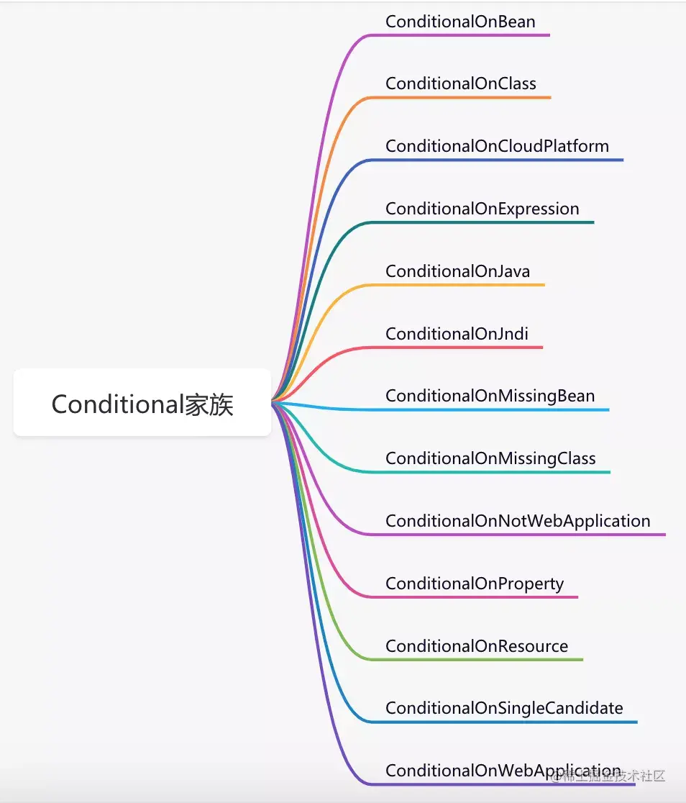

#### 自定义 Conditional

说实话，个人认为`springboot`自带的`Conditional`系列已经可以满足我们绝大多数的需求了。但如果你有比较特殊的场景，也可以自定义自定义 Conditional。

第一步，自定义注解：

```
@Conditional(MyCondition.class)
@Retention(RetentionPolicy.RUNTIME)
@Target({ElementType.TYPE, ElementType.METHOD})
@Documented
public @interface MyConditionOnProperty {
    String name() default "";

    String havingValue() default "";
}
复制代码
```

第二步，实现`Condition`接口：

```
public class MyCondition implements Condition {
    @Override
    public boolean matches(ConditionContext context, AnnotatedTypeMetadata metadata) {
        System.out.println("实现自定义逻辑");
        return false;
    }
}
复制代码
```

第三步，使用 @MyConditionOnProperty 注解。

`Conditional`的奥秘就藏在`ConfigurationClassParser`类的`processConfigurationClass`方法中： 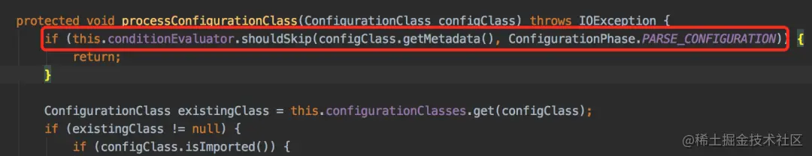

这个方法逻辑不复杂： 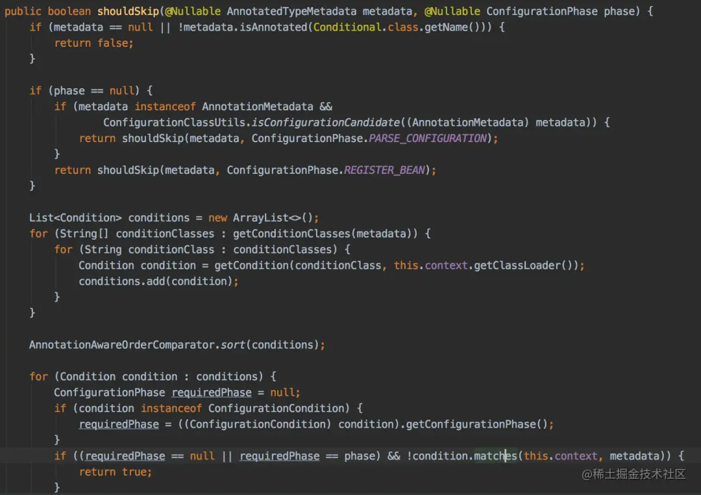

1.  先判断有没有使用 Conditional 注解，如果没有直接返回 false
    
2.  收集 condition 到集合中
    
3.  按 order 排序该集合
    
4.  遍历该集合，循环调用 condition 的 matchs 方法。
    

### 二. 如何妙用 @Import？

有时我们需要在某个配置类中引入另外一些类，被引入的类也加到`spring`容器中。这时可以使用`@Import`注解完成这个功能。

如果你看过它的源码会发现，引入的类支持三种不同类型。

但是我认为最好将普通类和`@Configuration`注解的配置类分开讲解，所以列了四种不同类型：

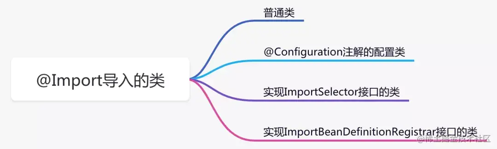

#### 普通类

这种引入方式是最简单的，被引入的类会被实例化 bean 对象。

```
public class A {
}

@Import(A.class)
@Configuration
public class TestConfiguration {
}
复制代码
```

通过`@Import`注解引入 A 类，spring 就能自动实例化 A 对象，然后在需要使用的地方通过`@Autowired`注解注入即可：

```
@Autowired
private A a;
复制代码
```

是不是挺让人意外的？不用加`@Bean`注解也能实例化 bean。

#### @Configuration 注解的配置类

这种引入方式是最复杂的，因为`@Configuration`注解还支持多种组合注解，比如：

*   @Import
*   @ImportResource
*   @PropertySource 等。

```
public class A {
}

public class B {
}

@Import(B.class)
@Configuration
public class AConfiguration {

    @Bean
    public A a() {
        return new A();
    }
}

@Import(AConfiguration.class)
@Configuration
public class TestConfiguration {
}
复制代码
```

通过`@Import`注解引入`@Configuration`注解的配置类，会把该配置类相关`@Import`、`@ImportResource`、`@PropertySource`等注解引入的类进行递归，一次性全部引入。

由于文章篇幅有限不过多介绍了，这里留点悬念，后面会出一篇文章专门介绍`@Configuration`注解，因为它实在太太太重要了。

#### 实现 ImportSelector 接口的类

这种引入方式需要实现`ImportSelector`接口：

```
public class AImportSelector implements ImportSelector {

private static final String CLASS_NAME = "com.sue.cache.service.test13.A";
    
 public String[] selectImports(AnnotationMetadata importingClassMetadata) {
        return new String[]{CLASS_NAME};
    }
}

@Import(AImportSelector.class)
@Configuration
public class TestConfiguration {
}
复制代码
```

这种方式的好处是`selectImports`方法返回的是数组，意味着可以同时引入多个类，还是非常方便的。

#### 实现 ImportBeanDefinitionRegistrar 接口的类

这种引入方式需要实现`ImportBeanDefinitionRegistrar`接口：

```
public class AImportBeanDefinitionRegistrar implements ImportBeanDefinitionRegistrar {
    @Override
    public void registerBeanDefinitions(AnnotationMetadata importingClassMetadata, BeanDefinitionRegistry registry) {
        RootBeanDefinition rootBeanDefinition = new RootBeanDefinition(A.class);
        registry.registerBeanDefinition("a", rootBeanDefinition);
    }
}

@Import(AImportBeanDefinitionRegistrar.class)
@Configuration
public class TestConfiguration {
}
复制代码
```

这种方式是最灵活的，能在`registerBeanDefinitions`方法中获取到`BeanDefinitionRegistry`容器注册对象，可以手动控制`BeanDefinition`的创建和注册。

当然`@import`注解非常人性化，还支持同时引入多种不同类型的类。

```
@Import({B.class,AImportBeanDefinitionRegistrar.class})
@Configuration
public class TestConfiguration {
}
复制代码
```

这四种引入类的方式各有千秋，总结如下：

1.  普通类，用于创建没有特殊要求的 bean 实例。
2.  @Configuration 注解的配置类，用于层层嵌套引入的场景。
3.  实现 ImportSelector 接口的类，用于一次性引入多个类的场景，或者可以根据不同的配置决定引入不同类的场景。
4.  实现 ImportBeanDefinitionRegistrar 接口的类，主要用于可以手动控制 BeanDefinition 的创建和注册的场景，它的方法中可以获取 BeanDefinitionRegistry 注册容器对象。

在`ConfigurationClassParser`类的`processImports`方法中可以看到这三种方式的处理逻辑： 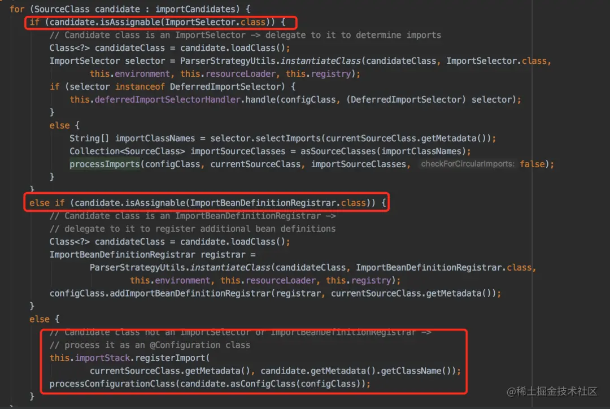

最后的 else 方法其实包含了：普通类和 @Configuration 注解的配置类两种不同的处理逻辑。

### 三. @ConfigurationProperties 赋值

我们在项目中使用配置参数是非常常见的场景，比如，我们在配置线程池的时候，需要在`applicationContext.propeties`文件中定义如下配置：

```
thread.pool.corePoolSize=5
thread.pool.maxPoolSize=10
thread.pool.queueCapacity=200
thread.pool.keepAliveSeconds=30
复制代码
```

方法一：通过`@Value`注解读取这些配置。

```
public class ThreadPoolConfig {

    @Value("${thread.pool.corePoolSize:5}")
    private int corePoolSize;

    @Value("${thread.pool.maxPoolSize:10}")
    private int maxPoolSize;

    @Value("${thread.pool.queueCapacity:200}")
    private int queueCapacity;

    @Value("${thread.pool.keepAliveSeconds:30}")
    private int keepAliveSeconds;

    @Value("${thread.pool.threadNamePrefix:ASYNC_}")
    private String threadNamePrefix;

    @Bean
    public Executor threadPoolExecutor() {
        ThreadPoolTaskExecutor executor = new ThreadPoolTaskExecutor();
        executor.setCorePoolSize(corePoolSize);
        executor.setMaxPoolSize(maxPoolSize);
        executor.setQueueCapacity(queueCapacity);
        executor.setKeepAliveSeconds(keepAliveSeconds);
        executor.setThreadNamePrefix(threadNamePrefix);
        executor.setRejectedExecutionHandler(new ThreadPoolExecutor.CallerRunsPolicy());
        executor.initialize();
        return executor;
    }
}
复制代码
```

这种方式使用起来非常简单，但建议在使用时都加上`:`，因为`:`后面跟的是默认值，比如：@Value("${thread.pool.corePoolSize:5}")，定义的默认核心线程数是 5。

> 假如有这样的场景：business 工程下定义了这个 ThreadPoolConfig 类，api 工程引用了 business 工程，同时 job 工程也引用了 business 工程，而 ThreadPoolConfig 类只想在 api 工程中使用。这时，如果不配置默认值，job 工程启动的时候可能会报错。

如果参数少还好，多的话，需要给每一个参数都加上 @Value 注解，是不是有点麻烦？

此外，还有一个问题，@Value 注解定义的参数看起来有点分散，不容易辨别哪些参数是一组的。

这时，@ConfigurationProperties 就派上用场了，它是 springboot 中新加的注解。

第一步，先定义 ThreadPoolProperties 类

@Data @Component @ConfigurationProperties("thread.pool") public class ThreadPoolProperties {

```
private int corePoolSize;
private int maxPoolSize;
private int queueCapacity;
private int keepAliveSeconds;
private String threadNamePrefix;
复制代码
```

} 第二步，使用 ThreadPoolProperties 类

@Configuration public class ThreadPoolConfig {

```
@Autowired
private ThreadPoolProperties threadPoolProperties;

@Bean
public Executor threadPoolExecutor() {
    ThreadPoolTaskExecutor executor = new ThreadPoolTaskExecutor();
    executor.setCorePoolSize(threadPoolProperties.getCorePoolSize());
    executor.setMaxPoolSize(threadPoolProperties.getMaxPoolSize());
    executor.setQueueCapacity(threadPoolProperties.getQueueCapacity());
    executor.setKeepAliveSeconds(threadPoolProperties.getKeepAliveSeconds());
    executor.setThreadNamePrefix(threadPoolProperties.getThreadNamePrefix());
    executor.setRejectedExecutionHandler(new ThreadPoolExecutor.CallerRunsPolicy());
    executor.initialize();
    return executor;
}
复制代码
```

} 使用`@ConfigurationProperties`注解，可以将`thread.pool`开头的参数直接赋值到`ThreadPoolProperties`类的同名参数中，这样省去了像`@Value`注解那样一个个手动去对应的过程。

这种方式显然要方便很多，我们只需编写`xxxProperties`类，spring 会自动装配参数。此外，不同系列的参数可以定义不同的 xxxProperties 类，也便于管理，推荐优先使用这种方式。

它的底层是通过：`ConfigurationPropertiesBindingPostProcessor`类实现的，该类实现了`BeanPostProcessor`接口，在`postProcessBeforeInitialization`方法中解析`@ConfigurationProperties`注解，并且绑定数据到相应的对象上。

绑定是通过 Binder 类的 bindObject 方法完成的：

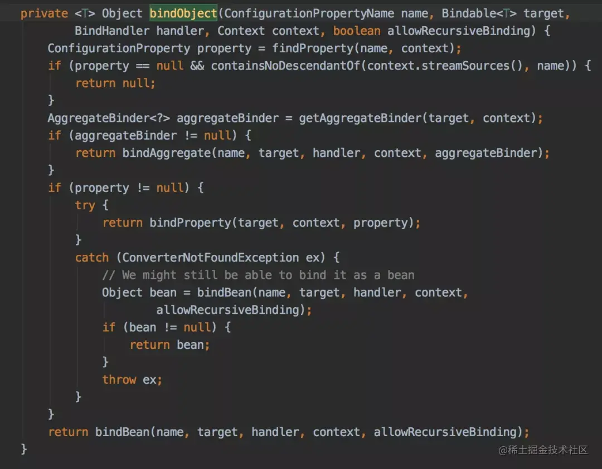 以上这段代码会递归绑定数据，主要考虑了三种情况：

*   bindAggregate 绑定集合类
*   bindBean 绑定对象
*   bindProperty 绑定参数 前面两种情况最终也会调用到 bindProperty 方法。 「此外，友情提醒一下：」

使用`@ConfigurationProperties`注解有些场景有问题，比如：在`apollo`中修改了某个参数，正常情况可以动态更新到`@ConfigurationProperties`注解定义的 xxxProperties 类的对象中，但是如果出现比较复杂的对象，比如：

```
private Map<String, Map<String,String>>  urls;
复制代码
```

可能动态更新不了。

这时候该怎么办呢？

答案是使用`ApolloConfigChangeListener`监听器自己处理：

```
@ConditionalOnClass(com.ctrip.framework.apollo.spring.annotation.EnableApolloConfig.class)
public class ApolloConfigurationAutoRefresh implements ApplicationContextAware {
   private ApplicationContext applicationContext;
   
   @Override
   public void setApplicationContext(ApplicationContext applicationContext) throws BeansException {
        this.applicationContext = applicationContext;
   }
   
    @ApolloConfigChangeListener
    private void onChange(ConfigChangeEvent changeEvent{
        refreshConfig(changeEvent.changedKeys());
    }
    private void refreshConfig(Set<String> changedKeys){
       System.out.println("将变更的参数更新到相应的对象中");
    }
}
复制代码
```

### 四. spring 事务要如何避坑？

spring 中的事务功能主要分为：`声明式事务`和`编程式事务`。

### 声明式事务

大多数情况下，我们在开发过程中使用更多的可能是声明式事务，即使用`@Transactional`注解定义的事务，因为它用起来更简单，方便。

只需在需要执行的事务方法上，加上`@Transactional`注解就能自动开启事务：

```
@Service
public class UserService {

    @Autowired
    private UserMapper userMapper;
    
    @Transactional
    public void add(UserModel userModel) {
        userMapper.insertUser(userModel);
    }
}
复制代码
```

这种声明式事务之所以能生效，是因为它的底层使用了`AOP`，创建了代理对象，调用`TransactionInterceptor`拦截器实现事务的功能。

> spring 事务有个特别的地方：它获取的数据库连接放在 ThreadLocal 中的，也就是说同一个线程中从始至终都能获取同一个数据库连接，可以保证同一个线程中多次数据库操作在同一个事务中执行。

正常情况下是没有问题的，但是如果使用不当，事务会失效，主要原因如下： 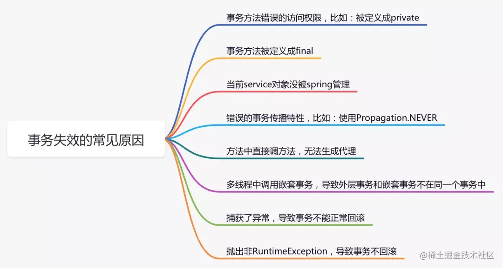

除了上述列举的问题之外，由于`@Transactional`注解最小粒度是要被定义在方法上，如果有多层的事务方法调用，可能会造成大事务问题。 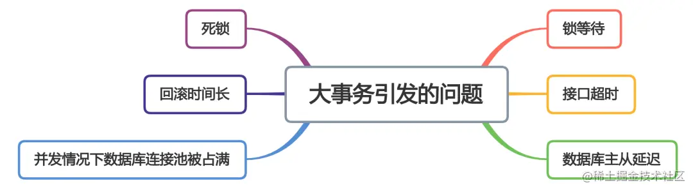 所以，建议在实际工作中少用 @Transactional 注解开启事务。

### 编程式事务

一般情况下编程式事务我们可以通过`TransactionTemplate`类开启事务功能。有个好消息，就是`springboot`已经默认实例化好这个对象了，我们能直接在项目中使用。

```
@Service
public class UserService {
   @Autowired
   private TransactionTemplate transactionTemplate;
   
   ...
   
   public void save(final User user) {
         transactionTemplate.execute((status) => {
            doSameThing...
            return Boolean.TRUE;
         })
   }
}
复制代码
```

使用`TransactionTemplate`的编程式事务能避免很多事务失效的问题，但是对大事务问题，不一定能够解决，只是说相对于使用`@Transactional`注解要好些。

### 五. 跨域问题的解决方案

关于跨域问题，前后端的解决方案还是挺多的，这里我重点说说 spring 的解决方案，目前有三种： 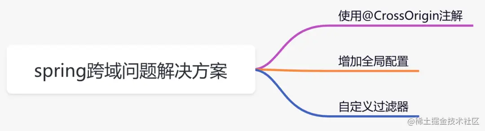

#### 一. 使用 @CrossOrigin 注解

```
@RequestMapping("/user")
@RestController
public class UserController {

    @CrossOrigin(origins = "http://localhost:8016")
    @RequestMapping("/getUser")
    public String getUser(@RequestParam("name") String name) {
        System.out.println("name:" + name);
        return "success";
    }
}
复制代码
```

该方案需要在跨域访问的接口上加`@CrossOrigin`注解，访问规则可以通过注解中的参数控制，控制粒度更细。如果需要跨域访问的接口数量较少，可以使用该方案。

#### 二. 增加全局配置

```
@Configuration
public class WebConfig implements WebMvcConfigurer {

    @Override
    public void addCorsMappings(CorsRegistry registry) {
        registry.addMapping("/**")
                .allowedOrigins("*")
                .allowedMethods("GET", "POST")
                .allowCredentials(true)
                .maxAge(3600)
                .allowedHeaders("*");

    }
}
复制代码
```

该方案需要实现`WebMvcConfigurer`接口，重写`addCorsMappings`方法，在该方法中定义跨域访问的规则。这是一个全局的配置，可以应用于所有接口。

#### 三. 自定义过滤器

```
@WebFilter("corsFilter")
@Configuration
public class CorsFilter implements Filter {

    @Override
    public void init(FilterConfig filterConfig) throws ServletException {

    }

    @Override
    public void doFilter(ServletRequest request, ServletResponse response, FilterChain chain) throws IOException, ServletException {
        HttpServletResponse httpServletResponse = (HttpServletResponse) response;
        httpServletResponse.setHeader("Access-Control-Allow-Origin", "*");
        httpServletResponse.setHeader("Access-Control-Allow-Methods", "POST, GET");
        httpServletResponse.setHeader("Access-Control-Max-Age", "3600");
        httpServletResponse.setHeader("Access-Control-Allow-Headers", "x-requested-with");
        chain.doFilter(request, response);
    }

    @Override
    public void destroy() {

    }
}
复制代码
```

该方案通过在请求的`header`中增加`Access-Control-Allow-Origin`等参数解决跨域问题。

顺便说一下，使用`@CrossOrigin`注解 和 实现`WebMvcConfigurer`接口的方案，spring 在底层最终都会调用到`DefaultCorsProcessor`类的`handleInternal`方法：

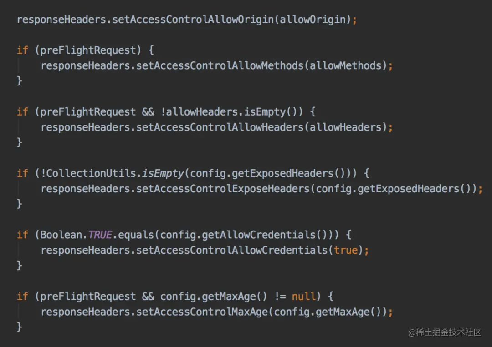 最终三种方案殊途同归，都会往 header 中添加跨域需要参数，只是实现形式不一样而已。

### 六. 如何自定义 starter

以前在没有使用`starter`时，我们在项目中需要引入新功能，步骤一般是这样的：

*   在 maven 仓库找该功能所需 jar 包
*   在 maven 仓库找该 jar 所依赖的其他 jar 包
*   配置新功能所需参数 以上这种方式会带来三个问题：

1.  如果依赖包较多，找起来很麻烦，容易找错，而且要花很多时间。
2.  各依赖包之间可能会存在版本兼容性问题，项目引入这些 jar 包后，可能没法正常启动。
3.  如果有些参数没有配好，启动服务也会报错，没有默认配置。 「为了解决这些问题，springboot 的 starter 机制应运而生」。

starter 机制带来这些好处：

1.  它能启动相应的默认配置。
2.  它能够管理所需依赖，摆脱了需要到处找依赖 和 兼容性问题的困扰。
3.  自动发现机制，将 spring.factories 文件中配置的类，自动注入到 spring 容器中。
4.  遵循 “约定大于配置” 的理念。 在业务工程中只需引入 starter 包，就能使用它的功能，太爽了。

下面用一张图，总结 starter 的几个要素： 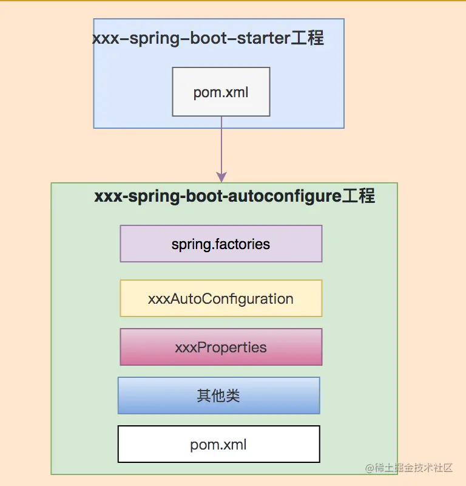

接下来我们一起实战，定义一个自己的 starter。

第一步，创建 id-generate-starter 工程： 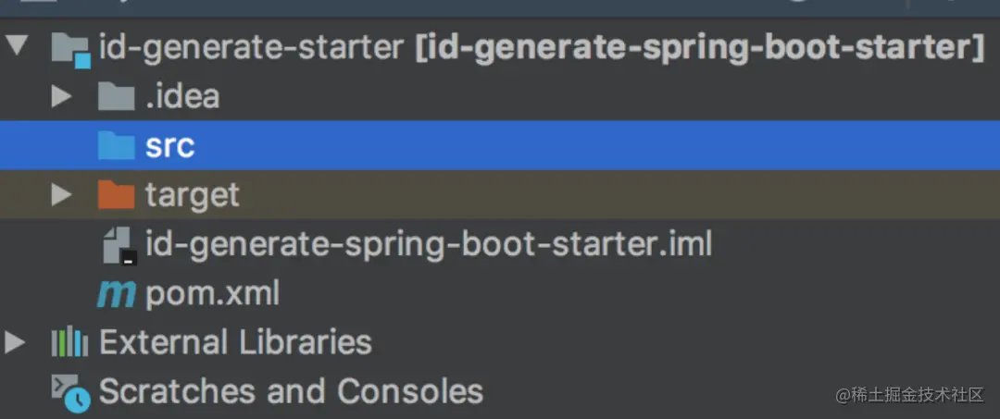 其中的`pom.xml`配置如下：

```
<?xml version="1.0" encoding="UTF-8"?>

<project xmlns="http://maven.apache.org/POM/4.0.0" xmlns:xsi="http://www.w3.org/2001/XMLSchema-instance" xsi:schemaLocation="http://maven.apache.org/POM/4.0.0 http://maven.apache.org/xsd/maven-4.0.0.xsd">
    <modelVersion>4.0.0</modelVersion>

    <version>1.3.1</version>
    <groupId>com.sue</groupId>
    <artifactId>id-generate-spring-boot-starter</artifactId>
    <name>id-generate-spring-boot-starter</name>
    <dependencies>
        <dependency>
            <groupId>com.sue</groupId>
            <artifactId>id-generate-spring-boot-autoconfigure</artifactId>
            <version>1.3.1</version>
        </dependency>
    </dependencies>
</project>
复制代码
```

第二步，创建 id-generate-spring-boot-autoconfigure 工程： 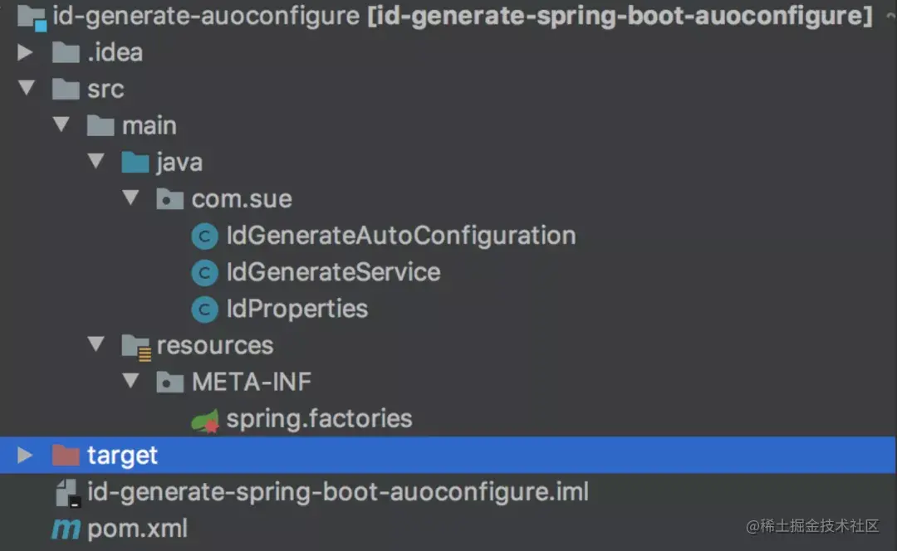 该项目当中包含：

*   pom.xml
*   spring.factories
*   IdGenerateAutoConfiguration
*   IdGenerateService
*   IdProperties

pom.xml 配置如下：

```
<?xml version="1.0" encoding="UTF-8"?>

<project xmlns="http://maven.apache.org/POM/4.0.0" xmlns:xsi="http://www.w3.org/2001/XMLSchema-instance" xsi:schemaLocation="http://maven.apache.org/POM/4.0.0 http://maven.apache.org/xsd/maven-4.0.0.xsd">

    <parent>
        <groupId>org.springframework.boot</groupId>
        <artifactId>spring-boot-starter-parent</artifactId>
        <version>2.0.4.RELEASE</version>
    </parent>
    <modelVersion>4.0.0</modelVersion>
    <version>1.3.1</version>
    <groupId>com.sue</groupId>
    <artifactId>id-generate-spring-boot-autoconfigure</artifactId>
    <name>id-generate-spring-boot-autoconfigure</name>

    <dependencies>
        <dependency>
            <groupId>org.springframework.boot</groupId>
            <artifactId>spring-boot-starter</artifactId>
        </dependency>

        <dependency>
            <groupId>org.springframework.boot</groupId>
            <artifactId>spring-boot-autoconfigure</artifactId>
        </dependency>

        <dependency>
            <groupId>org.springframework.boot</groupId>
            <artifactId>spring-boot-configuration-processor</artifactId>
            <optional>true</optional>
        </dependency>
    </dependencies>

    <build>
        <plugins>
            <plugin>
                <groupId>org.apache.maven.plugins</groupId>
                <artifactId>maven-compiler-plugin</artifactId>
                <configuration>
                    <source>1.8</source>
                    <target>1.8</target>
                </configuration>
            </plugin>
        </plugins>
    </build>
</project>
复制代码
```

`spring.factories`配置如下：

```
org.springframework.boot.autoconfigure.EnableAutoConfiguration=com.sue.IdGenerateAutoConfiguration

IdGenerateAutoConfiguration类：

@ConditionalOnClass(IdProperties.class)
@EnableConfigurationProperties(IdProperties.class)
@Configuration
public class IdGenerateAutoConfiguration {

    @Autowired
    private IdProperties properties;

    @Bean
    public IdGenerateService idGenerateService() {
        return new IdGenerateService(properties.getWorkId());
    }
}
复制代码
```

IdGenerateService 类：

```
public class IdGenerateService {

    private Long workId;

    public IdGenerateService(Long workId) {
        this.workId = workId;
    }

    public Long generate() {
        return new Random().nextInt(100) + this.workId;
    }
}
复制代码
```

IdProperties 类：

```
@ConfigurationProperties(prefix = IdProperties.PREFIX)
public class IdProperties {


    public static final String PREFIX = "sue";

    private Long workId;

    public Long getWorkId() {
        return workId;
    }

    public void setWorkId(Long workId) {
        this.workId = workId;
    }
}
复制代码
```

这样在业务项目中引入相关依赖:

```
<dependency>
      <groupId>com.sue</groupId>
      <artifactId>id-generate-spring-boot-starter</artifactId>
      <version>1.3.1</version>
</dependency>
复制代码
```

就能使用注入使用 IdGenerateService 的功能了

```
@Autowired
private IdGenerateService idGenerateService;
复制代码
```

完美。

### 七. 项目启动时的附加功能

有时候我们需要在项目启动时定制化一些附加功能，比如：加载一些系统参数、完成初始化、预热本地缓存等，该怎么办呢？

好消息是`springboot`提供了：

*   CommandLineRunner
*   ApplicationRunner 这两个接口帮助我们实现以上需求。

它们的用法还是挺简单的，以`ApplicationRunner`接口为例：

```
@Component
public class TestRunner implements ApplicationRunner {

    @Autowired
    private LoadDataService loadDataService;

    public void run(ApplicationArguments args) throws Exception {
        loadDataService.load();
    }
    
}
复制代码
```

实现`ApplicationRunner`接口，重写`run`方法，在该方法中实现自己定制化需求。

如果项目中有多个类实现了`ApplicationRunner`接口，他们的执行顺序要怎么指定呢？

答案是使用`@Order(n)`注解，n 的值越小越先执行。当然也可以通过`@Priority`注解指定顺序。

`springboot`项目启动时主要流程是这样的： 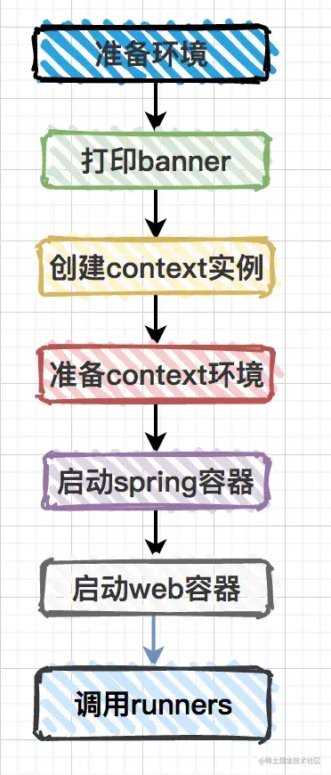

在`SpringApplication`类的`callRunners`方法中，我们能看到这两个接口的具体调用：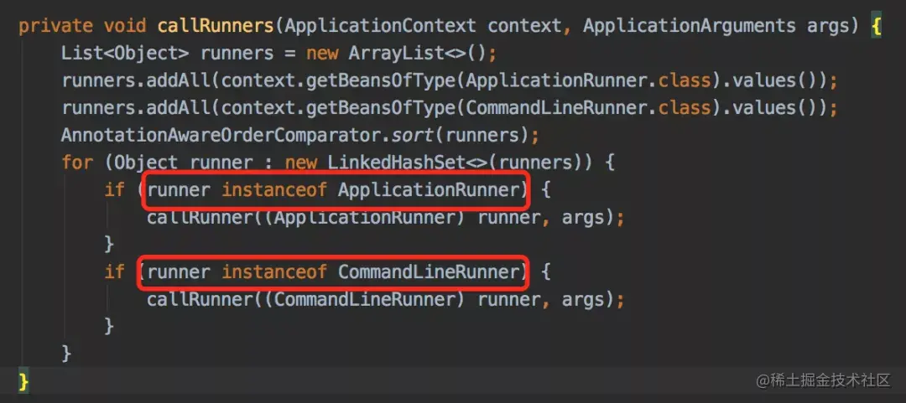

最后还有一个问题：这两个接口有什么区别？

`CommandLineRunner`接口中`run`方法的参数为`String数组` `ApplicationRunner`中`run`方法的参数为`ApplicationArguments`，该参数包含了`String数组参数` 和 `一些可选参数`。

最近无意间获得一份 BAT 大厂大佬写的刷题笔记，一下子打通了我的任督二脉，越来越觉得算法没有想象中那么难了。 [BAT 大佬写的刷题笔记，让我 offer 拿到手软](https://link.juejin.cn?target=https%3A%2F%2Fmp.weixin.qq.com%2Fs%2Ftq4HYlL5A4qL5Aka3jFNqw "https://mp.weixin.qq.com/s/tq4HYlL5A4qL5Aka3jFNqw")

### 唠唠家常

写着写着又有这么多字了，按照惯例，为了避免篇幅过长，今天就先写到这里。预告一下，后面会有 AOP、BeanPostProcessor、Configuration 注解等核心知识点的专题，每个主题的内容都挺多的，可以期待一下喔。

### 最后说一句 (求关注，别白嫖我)

如果这篇文章对您有所帮助，或者有所启发的话，帮忙关注一下，您的支持是我坚持写作最大的动力。

求一键三连：点赞、转发、在看。

关注公众号：【苏三说技术】，里面有我最新的文章，在公众号中回复：面试、代码神器、开发手册、时间管理有超赞的粉丝福利，另外回复：加群，可以跟很多 BAT 大厂的前辈交流和学习。