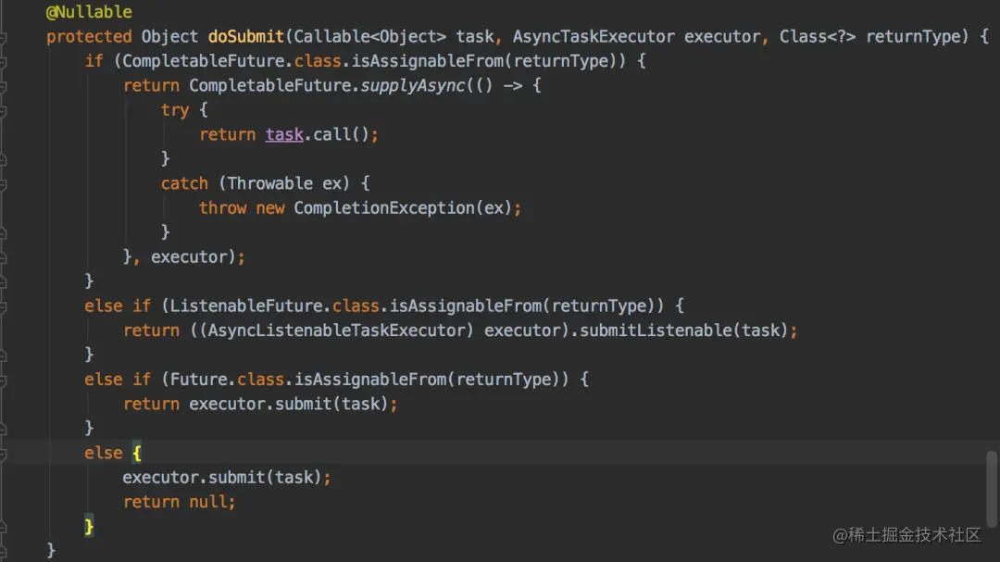

> 本文由 [简悦 SimpRead](http://ksria.com/simpread/) 转码， 原文地址 [juejin.cn](https://juejin.cn/post/6931630572720619534)

### 前言

最近越来越多的读者认可我的文章，还是件挺让人高兴的事情。有些读者私信我说希望后面多分享 spring 方面的文章，这样能够在实际工作中派上用场。正好我对 spring 源码有过一定的研究，并结合我这几年实际的工作经验，把 spring 中我认为不错的知识点总结一下，希望对您有所帮助。

### 一 如何获取 spring 容器对象

### 1. 实现 BeanFactoryAware 接口

```
@Service
public class PersonService implements BeanFactoryAware {
    private BeanFactory beanFactory;

    @Override
    public void setBeanFactory(BeanFactory beanFactory) throws BeansException {
        this.beanFactory = beanFactory;
    }

    public void add() {
        Person person = (Person) beanFactory.getBean("person");
    }
}
复制代码
```

实现`BeanFactoryAware`接口，然后重写`setBeanFactory`方法，就能从该方法中获取到 spring 容器对象。

### 2. 实现 ApplicationContextAware 接口

```
@Service
public class PersonService2 implements ApplicationContextAware {
    private ApplicationContext applicationContext;

    @Override
    public void setApplicationContext(ApplicationContext applicationContext) throws BeansException {
        this.applicationContext = applicationContext;
    }

    public void add() {
        Person person = (Person) applicationContext.getBean("person");
    }

}
复制代码
```

实现`ApplicationContextAware`接口，然后重写`setApplicationContext`方法，也能从该方法中获取到 spring 容器对象。

最近无意间获得一份 BAT 大厂大佬写的刷题笔记，一下子打通了我的任督二脉，越来越觉得算法没有想象中那么难了。 [BAT 大佬写的刷题笔记，让我 offer 拿到手软](https://link.juejin.cn?target=https%3A%2F%2Fmp.weixin.qq.com%2Fs%2Ftq4HYlL5A4qL5Aka3jFNqw "https://mp.weixin.qq.com/s/tq4HYlL5A4qL5Aka3jFNqw")

### 3. 实现 ApplicationListener 接口

```
@Service
public class PersonService3 implements ApplicationListener<ContextRefreshedEvent> {
    private ApplicationContext applicationContext;


    @Override
    public void onApplicationEvent(ContextRefreshedEvent event) {
        applicationContext = event.getApplicationContext();
    }

    public void add() {
        Person person = (Person) applicationContext.getBean("person");
    }

}
复制代码
```

实现`ApplicationListener`接口，需要注意的是该接口接收的泛型是`ContextRefreshedEvent`类，然后重写`onApplicationEvent`方法，也能从该方法中获取到 spring 容器对象。

此外，不得不提一下`Aware`接口，它其实是一个空接口，里面不包含任何方法。

它表示已感知的意思，通过这类接口可以获取指定对象，比如：

*   通过 BeanFactoryAware 获取 BeanFactory
*   通过 ApplicationContextAware 获取 ApplicationContext
*   通过 BeanNameAware 获取 BeanName 等 `Aware`接口是很常用的功能，目前包含如下功能：


### 二 如何初始化 bean

spring 中支持 3 种初始化 bean 的方法：

*   xml 中指定 init-method 方法
*   使用 @PostConstruct 注解
*   实现 InitializingBean 接口 第一种方法太古老了，现在用的人不多，具体用法就不介绍了。

### 1. 使用 @PostConstruct 注解

```
@Service
public class AService {

    @PostConstruct
    public void init() {
        System.out.println("===初始化===");
    }
}
复制代码
```

在需要初始化的方法上增加`@PostConstruct`注解，这样就有初始化的能力。

### 2. 实现 InitializingBean 接口

```
@Service
public class BService implements InitializingBean {

    @Override
    public void afterPropertiesSet() throws Exception {
        System.out.println("===初始化===");
    }
}
复制代码
```

实现`InitializingBean`接口，重写`afterPropertiesSet`方法，该方法中可以完成初始化功能。

这里顺便抛出一个有趣的问题：`init-method`、`PostConstruct` 和 `InitializingBean` 的执行顺序是什么样的？

决定他们调用顺序的关键代码在`AbstractAutowireCapableBeanFactory`类的`initializeBean`方法中。


这段代码中会先调用`BeanPostProcessor的postProcessBeforeInitialization`方法，而`PostConstruct`是通过`InitDestroyAnnotationBeanPostProcessor`实现的，它就是一个`BeanPostProcessor`，所以`PostConstruct`先执行。

而`invokeInitMethods`方法中的代码： 

决定了先调用`InitializingBean`，再调用`init-method`。

所以得出结论，他们的调用顺序是： 

### 三 自定义自己的 Scope

我们都知道 spring 默认支持的`Scope`只有两种：

*   singleton 单例，每次从 spring 容器中获取到的 bean 都是同一个对象。
    
*   prototype 多例，每次从 spring 容器中获取到的 bean 都是不同的对象。 spring web 又对 Scope 进行了扩展，增加了：
    
*   RequestScope 同一次请求从 spring 容器中获取到的 bean 都是同一个对象。
    
*   SessionScope 同一个会话从 spring 容器中获取到的 bean 都是同一个对象。 即便如此，有些场景还是无法满足我们的要求。
    

比如，我们想在同一个线程中从 spring 容器获取到的 bean 都是同一个对象，该怎么办？

这就需要自定义 Scope 了。

第一步实现 Scope 接口：

```
public class ThreadLocalScope implements Scope {

    private static final ThreadLocal THREAD_LOCAL_SCOPE = new ThreadLocal();

    @Override
    public Object get(String name, ObjectFactory<?> objectFactory) {
        Object value = THREAD_LOCAL_SCOPE.get();
        if (value != null) {
            return value;
        }

        Object object = objectFactory.getObject();
        THREAD_LOCAL_SCOPE.set(object);
        return object;
    }

    @Override
    public Object remove(String name) {
        THREAD_LOCAL_SCOPE.remove();
        return null;
    }

    @Override
    public void registerDestructionCallback(String name, Runnable callback) {

    }

    @Override
    public Object resolveContextualObject(String key) {
        return null;
    }

    @Override
    public String getConversationId() {
        return null;
    }
}
复制代码
```

第二步将新定义的 Scope 注入到 spring 容器中：

```
@Component
public class ThreadLocalBeanFactoryPostProcessor implements BeanFactoryPostProcessor {

    @Override
    public void postProcessBeanFactory(ConfigurableListableBeanFactory beanFactory) throws BeansException {
        beanFactory.registerScope("threadLocalScope", new ThreadLocalScope());
    }
}
复制代码
```

第三步使用新定义的 Scope：

```
@Scope("threadLocalScope")
@Service
public class CService {

    public void add() {
    }
}
复制代码
```

### 四 别说 FactoryBean 没用

说起`FactoryBean`就不得不提`BeanFactory`，因为面试官老喜欢问它们的区别。

*   BeanFactory：spring 容器的顶级接口，管理 bean 的工厂。
*   FactoryBean：并非普通的工厂 bean，它隐藏了实例化一些复杂 Bean 的细节，给上层应用带来了便利。

如果你看过 spring 源码，会发现它有 70 多个地方在用 FactoryBean 接口。


上面这张图足以说明该接口的重要性，请勿忽略它好吗？

特别提一句：`mybatis`的`SqlSessionFactory`对象就是通过`SqlSessionFactoryBean`类创建的。

我们一起定义自己的 FactoryBean：

```
@Component
public class MyFactoryBean implements FactoryBean {

    @Override
    public Object getObject() throws Exception {
        String data1 = buildData1();
        String data2 = buildData2();
        return buildData3(data1, data2);
    }

    private String buildData1() {
        return "data1";
    }

    private String buildData2() {
        return "data2";
    }

    private String buildData3(String data1, String data2) {
        return data1 + data2;
    }


    @Override
    public Class<?> getObjectType() {
        return null;
    }
}
复制代码
```

获取 FactoryBean 实例对象：

```
@Service
public class MyFactoryBeanService implements BeanFactoryAware {
    private BeanFactory beanFactory;

    @Override
    public void setBeanFactory(BeanFactory beanFactory) throws BeansException {
        this.beanFactory = beanFactory;
    }

    public void test() {
        Object myFactoryBean = beanFactory.getBean("myFactoryBean");
        System.out.println(myFactoryBean);
        Object myFactoryBean1 = beanFactory.getBean("&myFactoryBean");
        System.out.println(myFactoryBean1);
    }
}
复制代码
```

*   `getBean("myFactoryBean");`获取的是`MyFactoryBeanService`类中`getObject`方法返回的对象，
    
*   `getBean("&myFactoryBean");`获取的才是`MyFactoryBean`对象。
    

最近无意间获得一份 BAT 大厂大佬写的刷题笔记，一下子打通了我的任督二脉，越来越觉得算法没有想象中那么难了。 [BAT 大佬写的刷题笔记，让我 offer 拿到手软](https://link.juejin.cn?target=https%3A%2F%2Fmp.weixin.qq.com%2Fs%2Ftq4HYlL5A4qL5Aka3jFNqw "https://mp.weixin.qq.com/s/tq4HYlL5A4qL5Aka3jFNqw")

### 五 轻松自定义类型转换

spring 目前支持 3 中类型转换器：

*   Converter<S,T>：将 S 类型对象转为 T 类型对象
*   ConverterFactory<S, R>：将 S 类型对象转为 R 类型及子类对象
*   GenericConverter：它支持多个 source 和目标类型的转化，同时还提供了 source 和目标类型的上下文，这个上下文能让你实现基于属性上的注解或信息来进行类型转换。

这 3 种类型转换器使用的场景不一样，我们以`Converter<S,T>`为例。假如：接口中接收参数的实体对象中，有个字段的类型是 Date，但是实际传参的是字符串类型：2021-01-03 10:20:15，要如何处理呢？

第一步，定义一个实体 User：

```
@Data
public class User {

    private Long id;
    private String name;
    private Date registerDate;
}
复制代码
```

第二步，实现 Converter 接口：

```
public class DateConverter implements Converter<String, Date> {

    private SimpleDateFormat simpleDateFormat = new SimpleDateFormat("yyyy-MM-dd HH:mm:ss");

    @Override
    public Date convert(String source) {
        if (source != null && !"".equals(source)) {
            try {
                simpleDateFormat.parse(source);
            } catch (ParseException e) {
                e.printStackTrace();
            }
        }
        return null;
    }
}
复制代码
```

第三步，将新定义的类型转换器注入到 spring 容器中：

```
@Configuration
public class WebConfig extends WebMvcConfigurerAdapter {

    @Override
    public void addFormatters(FormatterRegistry registry) {
        registry.addConverter(new DateConverter());
    }
}
复制代码
```

第四步，调用接口

```
@RequestMapping("/user")
@RestController
public class UserController {

    @RequestMapping("/save")
    public String save(@RequestBody User user) {
        return "success";
    }
}
复制代码
```

请求接口时 User 对象中 registerDate 字段会被自动转换成 Date 类型。

### 六 spring mvc 拦截器，用过的都说好

spring mvc 拦截器根 spring 拦截器相比，它里面能够获取`HttpServletRequest`和`HttpServletResponse` 等 web 对象实例。

spring mvc 拦截器的顶层接口是：`HandlerInterceptor`，包含三个方法：

*   preHandle 目标方法执行前执行
*   postHandle 目标方法执行后执行
*   afterCompletion 请求完成时执行

为了方便我们一般情况会用`HandlerInterceptor`接口的实现类`HandlerInterceptorAdapter`类。

假如有权限认证、日志、统计的场景，可以使用该拦截器。

第一步，继承 HandlerInterceptorAdapter 类定义拦截器：

```
public class AuthInterceptor extends HandlerInterceptorAdapter {

    @Override
    public boolean preHandle(HttpServletRequest request, HttpServletResponse response, Object handler)
            throws Exception {
        String requestUrl = request.getRequestURI();
        if (checkAuth(requestUrl)) {
            return true;
        }

        return false;
    }

    private boolean checkAuth(String requestUrl) {
        System.out.println("===权限校验===");
        return true;
    }
}
复制代码
```

第二步，将该拦截器注册到 spring 容器：

```
@Configuration
public class WebAuthConfig extends WebMvcConfigurerAdapter {
 
    @Bean
    public AuthInterceptor getAuthInterceptor() {
        return new AuthInterceptor();
    }

    @Override
    public void addInterceptors(InterceptorRegistry registry) {
        registry.addInterceptor(getAuthInterceptor());
    }
}
复制代码
```

第三步，在请求接口时 spring mvc 通过该拦截器，能够自动拦截该接口，并且校验权限。

该拦截器其实相对来说，比较简单，可以在`DispatcherServlet`类的`doDispatch`方法中看到调用过程：


顺便说一句，这里只讲了 spring mvc 的拦截器，并没有讲 spring 的拦截器，是因为我有点小私心，后面就会知道。

### 七 Enable 开关真香

不知道你有没有用过`Enable`开头的注解，比如：EnableAsync、EnableCaching、EnableAspectJAutoProxy 等，这类注解就像开关一样，只要在`@Configuration`定义的配置类上加上这类注解，就能开启相关的功能。

是不是很酷？

让我们一起实现一个自己的开关：

第一步，定义一个 LogFilter：

```
public class LogFilter implements Filter {
    @Override
    public void init(FilterConfig filterConfig) throws ServletException {

    }

    @Override
    public void doFilter(ServletRequest request, ServletResponse response, FilterChain chain) throws IOException, ServletException {
        System.out.println("记录请求日志");
        chain.doFilter(request, response);
        System.out.println("记录响应日志");
    }

    @Override
    public void destroy() {
        
    }
}
复制代码
```

第二步，注册 LogFilter：

```
@ConditionalOnWebApplication
public class LogFilterWebConfig {

    @Bean
    public LogFilter timeFilter() {
        return new LogFilter();
    }
}
复制代码
```

注意，这里用了`@ConditionalOnWebApplication`注解，没有直接使用`@Configuration`注解。

第三步，定义开关 @EnableLog 注解：

```
@Target(ElementType.TYPE)
@Retention(RetentionPolicy.RUNTIME)
@Documented
@Import(LogFilterWebConfig.class)
public @interface EnableLog {

}
复制代码
```

第四步，只需在`springboot`启动类加上`@EnableLog`注解即可开启 LogFilter 记录请求和响应日志的功能。

### 八 RestTemplate 拦截器的春天

我们使用`RestTemplate`调用远程接口时，有时需要在`header`中传递信息，比如：traceId，source 等，便于在查询日志时能够串联一次完整的请求链路，快速定位问题。

这种业务场景就能通过`ClientHttpRequestInterceptor`接口实现，具体做法如下：

第一步，实现 ClientHttpRequestInterceptor 接口：

```
public class RestTemplateInterceptor implements ClientHttpRequestInterceptor {

    @Override
    public ClientHttpResponse intercept(HttpRequest request, byte[] body, ClientHttpRequestExecution execution) throws IOException {
        request.getHeaders().set("traceId", MdcUtil.get());
        return execution.execute(request, body);
    }
}
复制代码
```

第二步，定义配置类：

```
@Configuration
public class RestTemplateConfiguration {

    @Bean
    public RestTemplate restTemplate() {
        RestTemplate restTemplate = new RestTemplate();
        restTemplate.setInterceptors(Collections.singletonList(restTemplateInterceptor()));
        return restTemplate;
    }

    @Bean
    public RestTemplateInterceptor restTemplateInterceptor() {
        return new RestTemplateInterceptor();
    }
}
复制代码
```

其中 MdcUtil 其实是利用 MDC 工具在`ThreadLocal`中存储和获取 traceId

```
public class MdcUtil {

    private static final String TRACE_ID = "TRACE_ID";

    public static String get() {
        return MDC.get(TRACE_ID);
    }

    public static void add(String value) {
        MDC.put(TRACE_ID, value);
    }
}
复制代码
```

当然，这个例子中没有演示 MdcUtil 类的 add 方法具体调的地方，我们可以在 filter 中执行接口方法之前，生成 traceId，调用 MdcUtil 类的 add 方法添加到 MDC 中，然后在同一个请求的其他地方就能通过 MdcUtil 类的 get 方法获取到该 traceId。

### 九 统一异常处理

以前我们在开发接口时，如果出现异常，为了给用户一个更友好的提示，例如：

```
@RequestMapping("/test")
@RestController
public class TestController {

    @GetMapping("/add")
    public String add() {
        int a = 10 / 0;
        return "成功";
    }
}
复制代码
```

如果不做任何处理请求 add 接口结果直接报错： 

what？用户能直接看到错误信息？

这种交互方式给用户的体验非常差，为了解决这个问题，我们通常会在接口中捕获异常：

```
@GetMapping("/add")
public String add() {
        String result = "成功";
        try {
            int a = 10 / 0;
        } catch (Exception e) {
            result = "数据异常";
        }
        return result;
}
复制代码
```

接口改造后，出现异常时会提示：“数据异常”，对用户来说更友好。

看起来挺不错的，但是有问题。。。

如果只是一个接口还好，但是如果项目中有成百上千个接口，都要加上异常捕获代码吗？

答案是否定的，这时全局异常处理就派上用场了：`RestControllerAdvice`。

```
@RestControllerAdvice
public class GlobalExceptionHandler {

    @ExceptionHandler(Exception.class)
    public String handleException(Exception e) {
        if (e instanceof ArithmeticException) {
            return "数据异常";
        }
        if (e instanceof Exception) {
            return "服务器内部异常";
        }
        retur nnull;
    }
}
复制代码
```

只需在`handleException`方法中处理异常情况，业务接口中可以放心使用，不再需要捕获异常（有人统一处理了）。真是爽歪歪。

### 十 异步也可以这么优雅

以前我们在使用异步功能时，通常情况下有三种方式：

*   继承 Thread 类
*   实现 Runable 接口
*   使用线程池

让我们一起回顾一下：

#### 继承 Thread 类

```
public class MyThread extends Thread {

    @Override
    public void run() {
        System.out.println("===call MyThread===");
    }

    public static void main(String[] args) {
        new MyThread().start();
    }
}
复制代码
```

#### 实现 Runable 接口

```
public class MyWork implements Runnable {
    @Override
    public void run() {
        System.out.println("===call MyWork===");
    }

    public static void main(String[] args) {
        new Thread(new MyWork()).start();
    }
}
复制代码
```

#### 使用线程池

```
public class MyThreadPool {

    private static ExecutorService executorService = new ThreadPoolExecutor(1, 5, 60, TimeUnit.SECONDS, new ArrayBlockingQueue<>(200));

    static class Work implements Runnable {

        @Override
        public void run() {
            System.out.println("===call work===");
        }
    }

    public static void main(String[] args) {
        try {
            executorService.submit(new MyThreadPool.Work());
        } finally {
            executorService.shutdown();
        }

    }
}
复制代码
```

这三种实现异步的方法不能说不好，但是 spring 已经帮我们抽取了一些公共的地方，我们无需再继承`Thread`类或实现`Runable`接口，它都搞定了。

如何 spring 异步功能呢？

第一步，springboot 项目启动类上加`@EnableAsync`注解。

```
@EnableAsync
@SpringBootApplication
public class Application {

    public static void main(String[] args) {
        new SpringApplicationBuilder(Application.class).web(WebApplicationType.SERVLET).run(args);
    }
}
复制代码
```

第二步，在需要使用异步的方法上加上 @Async 注解：

```
@Service
public class PersonService {

    @Async
    public String get() {
        System.out.println("===add==");
        return "data";
    }
}
复制代码
```

然后在使用的地方调用一下：personService.get(); 就拥有了异步功能，是不是很神奇。

默认情况下，spring 会为我们的异步方法创建一个线程去执行，如果该方法被调用次数非常多的话，需要创建大量的线程，会导致资源浪费。

这时，我们可以定义一个线程池，异步方法将会被自动提交到线程池中执行。

```
@Configuration
public class ThreadPoolConfig {

    @Value("${thread.pool.corePoolSize:5}")
    private int corePoolSize;

    @Value("${thread.pool.maxPoolSize:10}")
    private int maxPoolSize;

    @Value("${thread.pool.queueCapacity:200}")
    private int queueCapacity;

    @Value("${thread.pool.keepAliveSeconds:30}")
    private int keepAliveSeconds;

    @Value("${thread.pool.threadNamePrefix:ASYNC_}")
    private String threadNamePrefix;

    @Bean
    public Executor MessageExecutor() {
        ThreadPoolTaskExecutor executor = new ThreadPoolTaskExecutor();
        executor.setCorePoolSize(corePoolSize);
        executor.setMaxPoolSize(maxPoolSize);
        executor.setQueueCapacity(queueCapacity);
        executor.setKeepAliveSeconds(keepAliveSeconds);
        executor.setThreadNamePrefix(threadNamePrefix);
        executor.setRejectedExecutionHandler(new ThreadPoolExecutor.CallerRunsPolicy());
        executor.initialize();
        return executor;
    }
}
复制代码
```

spring 异步的核心方法： 

根据返回值不同，处理情况也不太一样，具体分为如下情况： 

### 十一 听说缓存好用，没想到这么好用

spring cache 架构图：


它目前支持多种缓存：


我们在这里以 caffeine 为例，它是 spring 官方推荐的。

第一步，引入 caffeine 的相关 jar 包

```
<dependency>
    <groupId>org.springframework.boot</groupId>
    <artifactId>spring-boot-starter-cache</artifactId>
</dependency>
<dependency>
    <groupId>com.github.ben-manes.caffeine</groupId>
    <artifactId>caffeine</artifactId>
    <version>2.6.0</version>
</dependency>
复制代码
```

第二步，配置`CacheManager`，开启`EnableCaching`

```
@Configuration
@EnableCaching
public class CacheConfig {
    @Bean
    public CacheManager cacheManager(){
        CaffeineCacheManager cacheManager = new CaffeineCacheManager();
        //Caffeine配置
        Caffeine<Object, Object> caffeine = Caffeine.newBuilder()
                //最后一次写入后经过固定时间过期
                .expireAfterWrite(10, TimeUnit.SECONDS)
                //缓存的最大条数
                .maximumSize(1000);
        cacheManager.setCaffeine(caffeine);
        return cacheManager;
    }
}
复制代码
```

第三步，使用`Cacheable`注解获取数据

```
@Service
public class CategoryService {
   
   //category是缓存名称,#type是具体的key，可支持el表达式
   @Cacheable(value = "category", key = "#type")
   public CategoryModel getCategory(Integer type) {
       return getCategoryByType(type);
   }

   private CategoryModel getCategoryByType(Integer type) {
       System.out.println("根据不同的type:" + type + "获取不同的分类数据");
       CategoryModel categoryModel = new CategoryModel();
       categoryModel.setId(1L);
       categoryModel.setParentId(0L);
       categoryModel.setName("电器");
       categoryModel.setLevel(3);
       return categoryModel;
   }
}
复制代码
```

调用 categoryService.getCategory() 方法时，先从`caffine`缓存中获取数据，如果能够获取到数据则直接返回该数据，不会进入方法体。如果不能获取到数据，则直接方法体中的代码获取到数据，然后放到 caffine 缓存中。

最近无意间获得一份 BAT 大厂大佬写的刷题笔记，一下子打通了我的任督二脉，越来越觉得算法没有想象中那么难了。 [BAT 大佬写的刷题笔记，让我 offer 拿到手软](https://link.juejin.cn?target=https%3A%2F%2Fmp.weixin.qq.com%2Fs%2Ftq4HYlL5A4qL5Aka3jFNqw "https://mp.weixin.qq.com/s/tq4HYlL5A4qL5Aka3jFNqw")

### 最后说一句 (求关注，别白嫖我)

如果这篇文章对您有所帮助，或者有所启发的话，帮忙关注一下，您的支持是我坚持写作最大的动力。

求一键三连：点赞、转发、在看。

关注公众号：【苏三说技术】，在公众号中回复：面试、代码神器、开发手册、时间管理有超赞的粉丝福利，另外回复：加群，可以跟很多 BAT 大厂的前辈交流和学习。