> 本文由 [简悦 SimpRead](http://ksria.com/simpread/) 转码， 原文地址 [juejin.cn](https://juejin.cn/post/6911692836714840077)

### 1. 由同事抛的一个问题开始

最近项目组的一个同事遇到了一个问题，问我的意见，一下子引起的我的兴趣，因为这个问题我也是第一次遇到。平时自认为对 spring 循环依赖问题还是比较了解的，直到遇到这个和后面的几个问题后，重新刷新了我的认识。

我们先看看当时出问题的代码片段：

```
@Service
publicclass TestService1 {

    @Autowired
    private TestService2 testService2;

    @Async
    public void test1() {
    }
}
复制代码
```

```
@Service
publicclass TestService2 {

    @Autowired
    private TestService1 testService1;

    public void test2() {
    }
}
复制代码
```

这两段代码中定义了两个 Service 类：TestService1 和 TestService2，在 TestService1 中注入了 TestService2 的实例，同时在 TestService2 中注入了 TestService1 的实例，这里构成了循环依赖。

只不过，这不是普通的循环依赖，因为 TestService1 的 test1 方法上加了一个`@Async`注解。

大家猜猜程序启动后运行结果会怎样？

```
org.springframework.beans.factory.BeanCurrentlyInCreationException: Error creating bean with name 'testService1': Bean with name 'testService1' has been injected into other beans [testService2] in its raw version as part of a circular reference, but has eventually been wrapped. This means that said other beans do not use the final version of the bean. This is often the result of over-eager type matching - consider using 'getBeanNamesOfType' with the 'allowEagerInit' flag turned off, for example.
复制代码
```

报错了。。。原因是出现了循环依赖。

「不科学呀，spring 不是号称能解决循环依赖问题吗，怎么还会出现？」

如果把上面的代码稍微调整一下：

```
@Service
publicclass TestService1 {

    @Autowired
    private TestService2 testService2;

    public void test1() {
    }
}
复制代码
```

把 TestService1 的 test1 方法上的`@Async`注解去掉，TestService1 和 TestService2 都需要注入对方的实例，同样构成了循环依赖。

但是重新启动项目，发现它能够正常运行。这又是为什么？

带着这两个问题，让我们一起开始 spring 循环依赖的探秘之旅。

### 2. 什么是循环依赖？

循环依赖：说白是一个或多个对象实例之间存在直接或间接的依赖关系，这种依赖关系构成了构成一个环形调用。

第一种情况：自己依赖自己的直接依赖

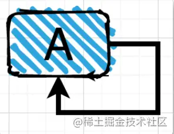

第二种情况：两个对象之间的直接依赖 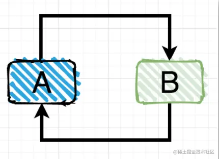

第三种情况：多个对象之间的间接依赖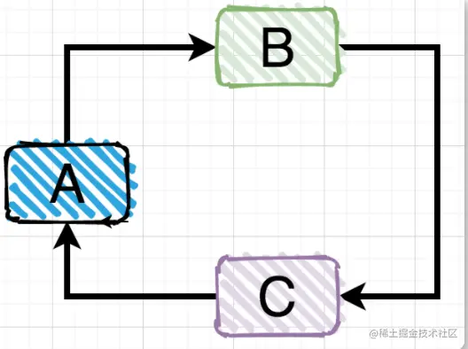

前面两种情况的直接循环依赖比较直观，非常好识别，但是第三种间接循环依赖的情况有时候因为业务代码调用层级很深，不容易识别出来。

### 3. 循环依赖的 N 种场景

spring 中出现循环依赖主要有以下场景： 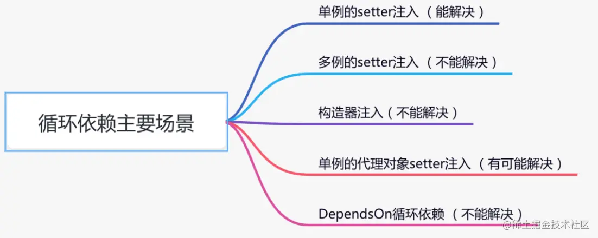

#### 单例的 setter 注入

这种注入方式应该是 spring 用的最多的，代码如下：

```
@Service
publicclass TestService1 {

    @Autowired
    private TestService2 testService2;

    public void test1() {
    }
}
复制代码
```

```
@Service
publicclass TestService2 {

    @Autowired
    private TestService1 testService1;

    public void test2() {
    }
}
复制代码
```

这是一个经典的循环依赖，但是它能正常运行，得益于 spring 的内部机制，让我们根本无法感知它有问题，因为 spring 默默帮我们解决了。

spring 内部有三级缓存：

*   singletonObjects 一级缓存，用于保存实例化、注入、初始化完成的 bean 实例
*   earlySingletonObjects 二级缓存，用于保存实例化完成的 bean 实例
*   singletonFactories 三级缓存，用于保存 bean 创建工厂，以便于后面扩展有机会创建代理对象。

下面用一张图告诉你，spring 是如何解决循环依赖的： 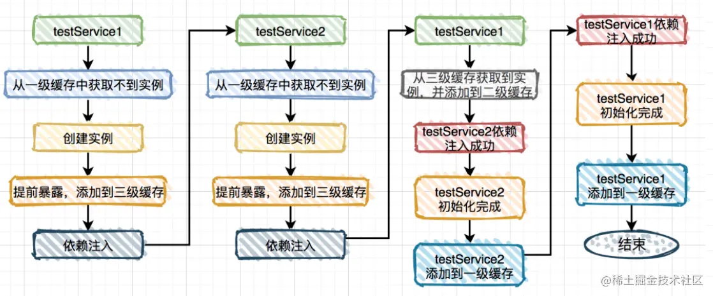 图 1

细心的朋友可能会发现在这种场景中第二级缓存作用不大。 那么问题来了，为什么要用第二级缓存呢？ 试想一下，如果出现以下这种情况，我们要如何处理？

```
@Service
publicclass TestService1 {

    @Autowired
    private TestService2 testService2;
    @Autowired
    private TestService3 testService3;

    public void test1() {
    }
}
复制代码
```

```
@Service
publicclass TestService2 {

    @Autowired
    private TestService1 testService1;

    public void test2() {
    }
}
复制代码
```

```
@Service
publicclass TestService3 {

    @Autowired
    private TestService1 testService1;

    public void test3() {
    }
}
复制代码
```

TestService1 依赖于 TestService2 和 TestService3，而 TestService2 依赖于 TestService1，同时 TestService3 也依赖于 TestService1。

按照上图的流程可以把 TestService1 注入到 TestService2，并且 TestService1 的实例是从第三级缓存中获取的。

假设不用第二级缓存，TestService1 注入到 TestService3 的流程如图： 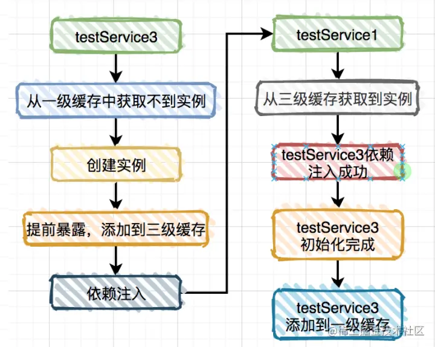 图 2

TestService1 注入到 TestService3 又需要从第三级缓存中获取实例，而第三级缓存里保存的并非真正的实例对象，而是 ObjectFactory 对象。说白了，两次从三级缓存中获取都是 ObjectFactory 对象，而通过它创建的实例对象每次可能都不一样的。

这样不是有问题？

为了解决这个问题，spring 引入的第二级缓存。上面图 1 其实 TestService1 对象的实例已经被添加到第二级缓存中了，而在 TestService1 注入到 TestService3 时，只用从第二级缓存中获取该对象即可。 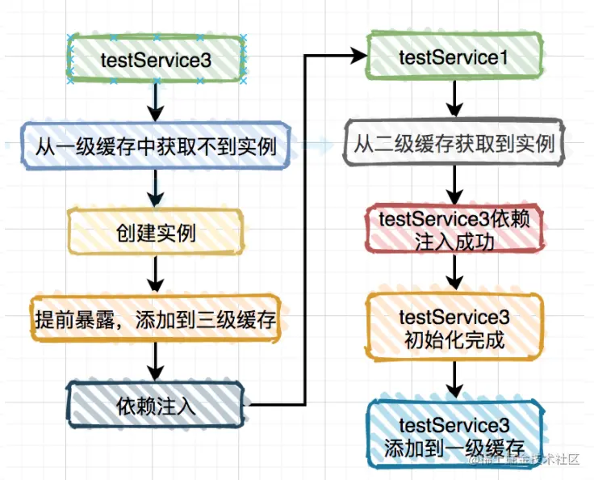 图 3

还有个问题，第三级缓存中为什么要添加 ObjectFactory 对象，直接保存实例对象不行吗？

答：不行，因为假如你想对添加到三级缓存中的实例对象进行增强，直接用实例对象是行不通的。

针对这种场景 spring 是怎么做的呢？

答案就在 AbstractAutowireCapableBeanFactory 类 doCreateBean 方法的这段代码中： 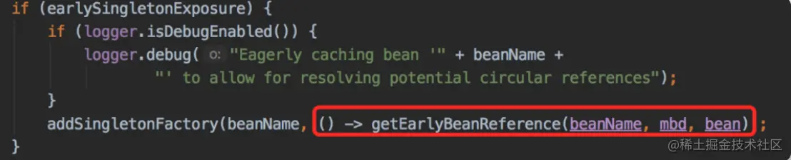

它定义了一个匿名内部类，通过 getEarlyBeanReference 方法获取代理对象，其实底层是通过 AbstractAutoProxyCreator 类的 getEarlyBeanReference 生成代理对象。

#### 多例的 setter 注入

这种注入方法偶然会有，特别是在多线程的场景下，具体代码如下：

```
@Scope(ConfigurableBeanFactory.SCOPE_PROTOTYPE)
@Service
publicclass TestService1 {

    @Autowired
    private TestService2 testService2;

    public void test1() {
    }
}
复制代码
```

```
@Scope(ConfigurableBeanFactory.SCOPE_PROTOTYPE)
@Service
publicclass TestService2 {

    @Autowired
    private TestService1 testService1;

    public void test2() {
    }
}
复制代码
```

很多人说这种情况 spring 容器启动会报错，其实是不对的，我非常负责任的告诉你程序能够正常启动。

为什么呢？

其实在`AbstractApplicationContext`类的`refresh`方法中告诉了我们答案，它会调用`finishBeanFactoryInitialization`方法，该方法的作用是为了`spring`容器启动的时候提前初始化一些`bean`。该方法的内部又调用了`preInstantiateSingletons`方法。 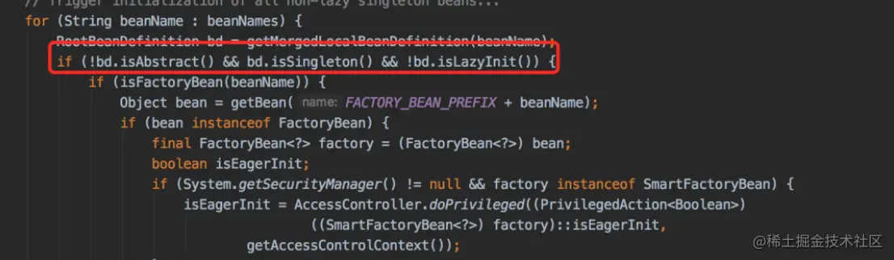

标红的地方明显能够看出：非抽象、单例 并且非懒加载的类才能被提前初始 bean。 而多例即`SCOPE_PROTOTYPE`类型的类，非单例，不会被提前初始化 bean，所以程序能够正常启动。

如何让他提前初始化 bean 呢？

只需要再定义一个单例的类，在它里面注入 TestService1

```
@Service
publicclass TestService3 {

    @Autowired
    private TestService1 testService1;
}
复制代码
```

重新启动程序，执行结果：

```
Requested bean is currently in creation: Is there an unresolvable circular reference?
复制代码
```

果然出现了循环依赖。

注意：这种循环依赖问题是无法解决的，因为它没有用缓存，每次都会生成一个新对象。

#### 构造器注入

这种注入方式是`spring4.x`以上的版本中官方推荐的方式，看看如下代码：

```
@Service
publicclass TestService1 {

    public TestService1(TestService2 testService2) {
    }
}
@Service
publicclass TestService2 {

    public TestService2(TestService1 testService1) {
    }
}
复制代码
```

运行结果：

```
Requested bean is currently in creation: Is there an unresolvable circular reference?
复制代码
```

出现了循环依赖，为什么呢？ 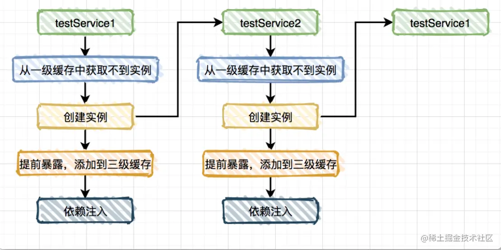

从图中的流程看出构造器注入只是添加了三级缓存，并没有使用缓存，所以也无法解决循环依赖问题。

#### 单例的代理对象 setter 注入

这种注入方式其实也比较常用，比如平时使用：`@Async`注解的场景，会通过`AOP`自动生成代理对象。

我那位同事的问题也是这种情况。

```
@Service
publicclass TestService1 {

    @Autowired
    private TestService2 testService2;

    @Async
    public void test1() {
    }
}
复制代码
```

```
@Service
publicclass TestService2 {

    @Autowired
    private TestService1 testService1;

    public void test2() {
    }
}
复制代码
```

从前面得知程序启动会报错，出现了循环依赖：

```
org.springframework.beans.factory.BeanCurrentlyInCreationException: Error creating bean with name 'testService1': Bean with name 'testService1' has been injected into other beans [testService2] in its raw version as part of a circular reference, but has eventually been wrapped. This means that said other beans do not use the final version of the bean. This is often the result of over-eager type matching - consider using 'getBeanNamesOfType' with the 'allowEagerInit' flag turned off, for example.
复制代码
```

为什么会循环依赖呢？

答案就在下面这张图中： 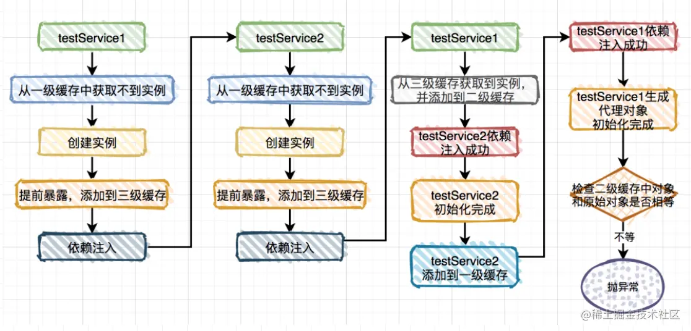

说白了，bean 初始化完成之后，后面还有一步去检查：第二级缓存 和 原始对象 是否相等。由于它对前面流程来说无关紧要，所以前面的流程图中省略了，但是在这里是关键点，我们重点说说：

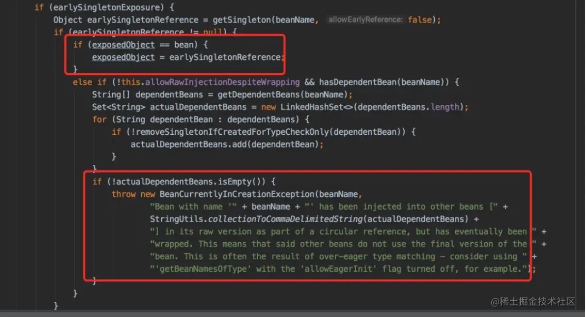

那位同事的问题正好是走到这段代码，发现第二级缓存 和 原始对象不相等，所以抛出了循环依赖的异常。

如果这时候把 TestService1 改个名字，改成：TestService6，其他的都不变。

```
@Service
publicclass TestService6 {

    @Autowired
    private TestService2 testService2;

    @Async
    public void test1() {
    }
}
复制代码
```

再重新启动一下程序，神奇般的好了。

what？ 这又是为什么？

这就要从 spring 的 bean 加载顺序说起了，默认情况下，spring 是按照文件完整路径递归查找的，按路径 + 文件名排序，排在前面的先加载。所以 TestService1 比 TestService2 先加载，而改了文件名称之后，TestService2 比 TestService6 先加载。

为什么 TestService2 比 TestService6 先加载就没问题呢？

答案在下面这张图中：

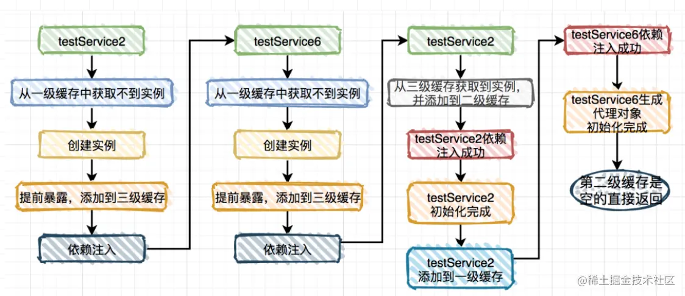

这种情况 testService6 中其实第二级缓存是空的，不需要跟原始对象判断，所以不会抛出循环依赖。

#### DependsOn 循环依赖

还有一种有些特殊的场景，比如我们需要在实例化 Bean A 之前，先实例化 Bean B，这个时候就可以使用 @DependsOn 注解。

```
@DependsOn(value = "testService2")
@Service
publicclass TestService1 {

    @Autowired
    private TestService2 testService2;

    public void test1() {
    }
}
复制代码
```

```
@DependsOn(value = "testService1")
@Service
publicclass TestService2 {

    @Autowired
    private TestService1 testService1;

    public void test2() {
    }
}
复制代码
```

程序启动之后，执行结果：

```
Circular depends-on relationship between 'testService2' and 'testService1'
复制代码
```

这个例子中本来如果 TestService1 和 TestService2 都没有加 @DependsOn 注解是没问题的，反而加了这个注解会出现循环依赖问题。

这又是为什么？

答案在`AbstractBeanFactory`类的`doGetBean`方法的这段代码中： 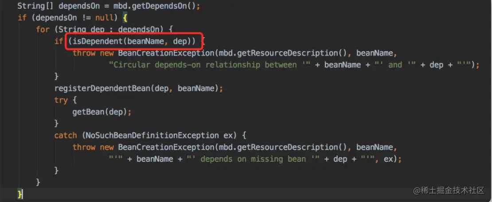

它会检查 dependsOn 的实例有没有循环依赖，如果有循环依赖则抛异常。

### 4. 出现循环依赖如何解决？

项目中如果出现循环依赖问题，说明是 spring 默认无法解决的循环依赖，要看项目的打印日志，属于哪种循环依赖。目前包含下面几种情况： 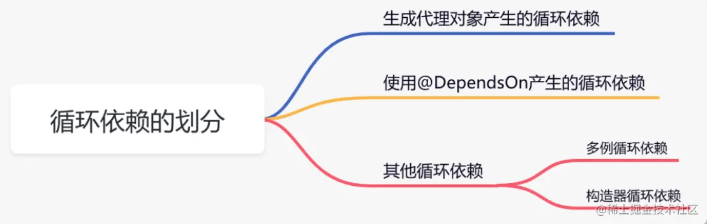

#### 生成代理对象产生的循环依赖

这类循环依赖问题解决方法很多，主要有：

1.  使用`@Lazy`注解，延迟加载
2.  使用`@DependsOn`注解，指定加载先后关系
3.  修改文件名称，改变循环依赖类的加载顺序

#### 使用 @DependsOn 产生的循环依赖

这类循环依赖问题要找到`@DependsOn`注解循环依赖的地方，迫使它不循环依赖就可以解决问题。

#### 多例循环依赖

这类循环依赖问题可以通过把 bean 改成单例的解决。

#### 构造器循环依赖

这类循环依赖问题可以通过使用`@Lazy`注解解决。

当然最好的解决循环依赖问题最佳方案是从代码设计上规避，但是复杂的系统中有可能没法避免。

### 最后说一句 (求关注，别白嫖我)

如果这篇文章对您有所帮助，或者有所启发的话，帮忙扫描下发二维码关注一下，您的支持是我坚持写作最大的动力。

求一键三连：点赞、转发、在看。 关注公众号：苏三说技术，在公众号中回复：面试、代码神器、开发手册、时间管理有超赞的粉丝福利，另外回复：加群，可以跟很多 BAT 大厂的前辈交流和学习。