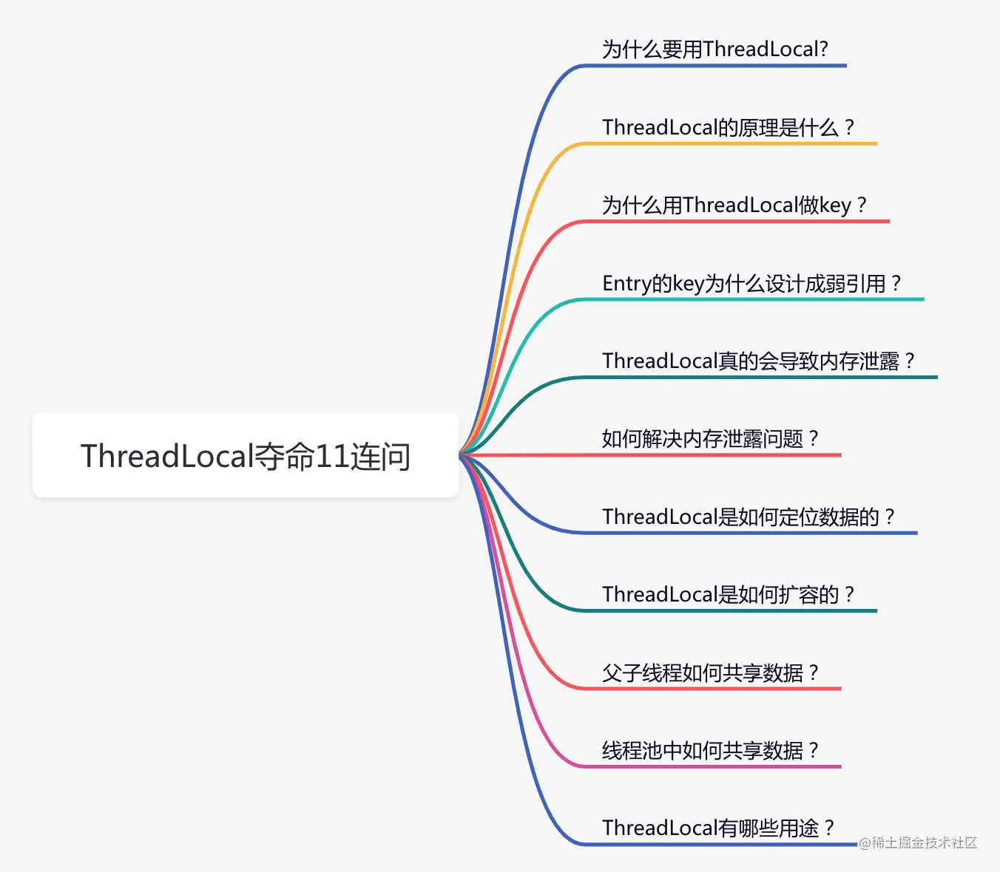
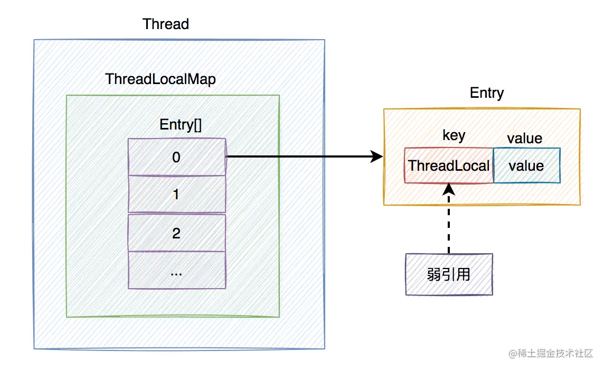
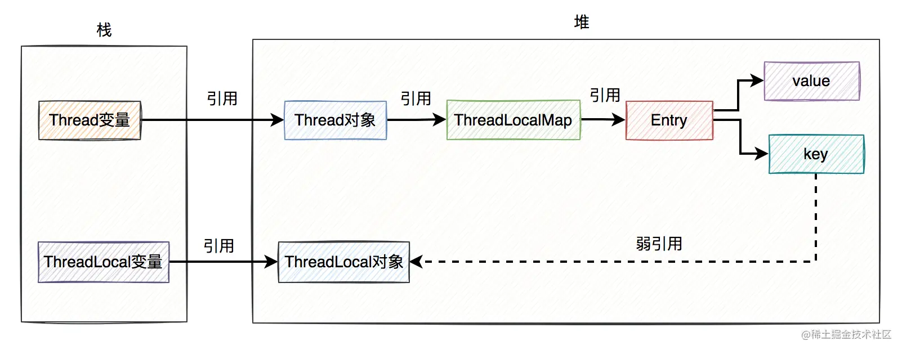
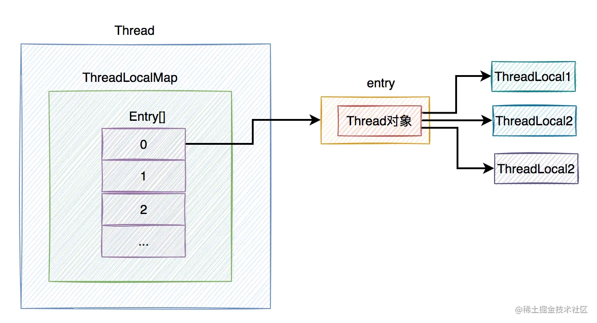
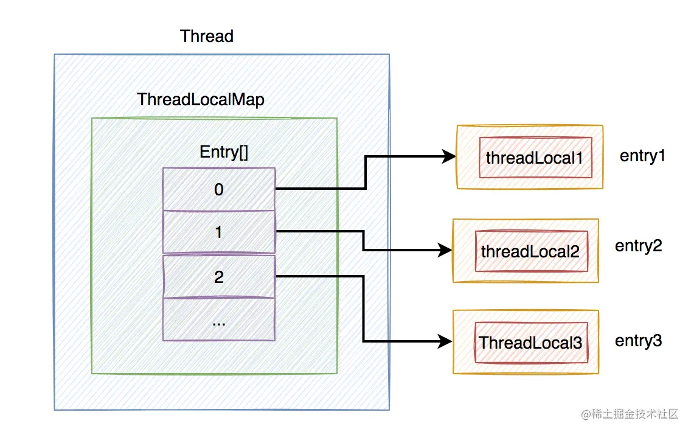
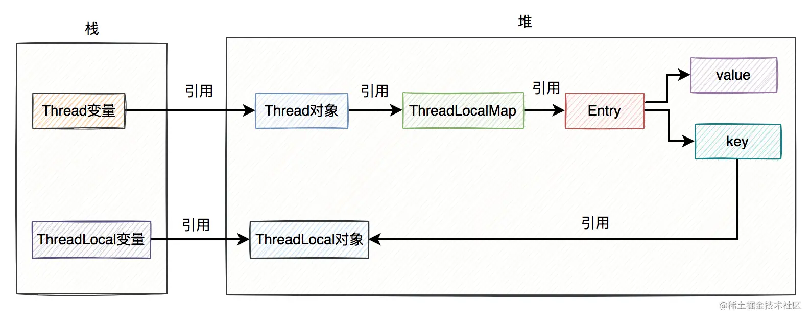
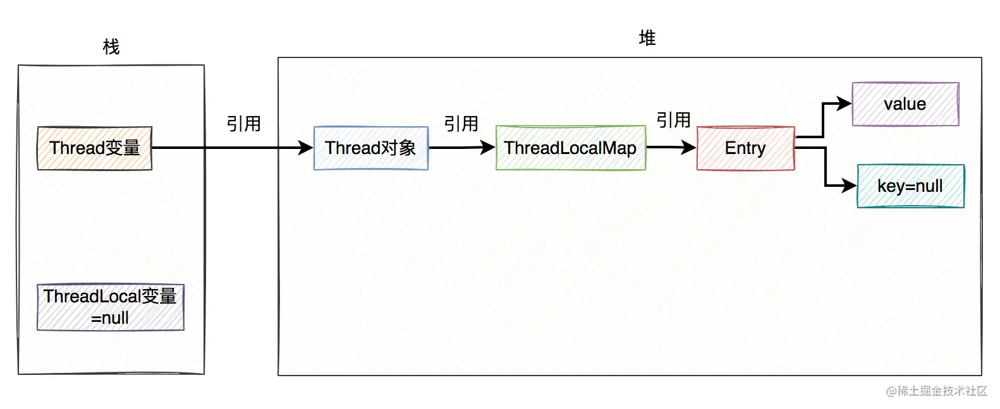
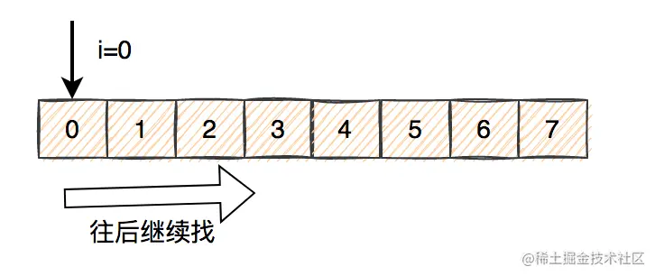
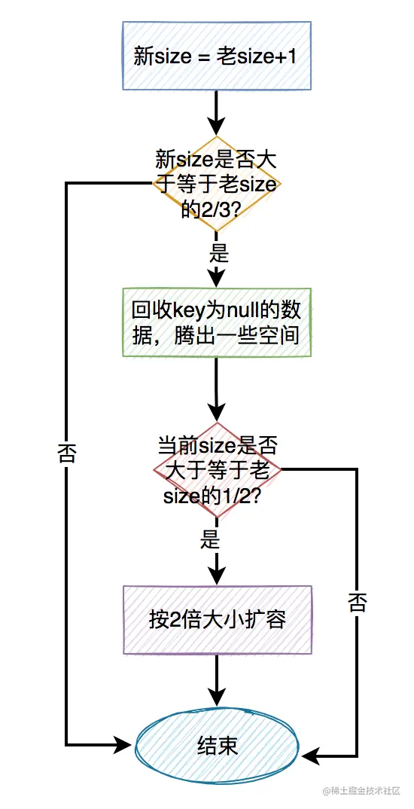

> 本文由 [简悦 SimpRead](http://ksria.com/simpread/) 转码， 原文地址 [juejin.cn](https://juejin.cn/post/7097754858593189901)

前言
--

前一段时间，有同事使用`ThreadLocal`踩坑了，正好引起了我的兴趣。

所以近期，我抽空把 ThreadLocal 的源码再研究了一下，越看越有意思，发现里面的东西还真不少。

我把精华浓缩了一下，汇集成了下面 11 个问题，看看你能顶住第几个？ 

1. 为什么要用 ThreadLocal?
---------------------

并发编程是一项非常重要的技术，它让我们的程序变得更加高效。

但在并发的场景中，如果有多个线程同时修改公共变量，可能会出现线程安全问题，即该变量最终结果可能出现异常。

为了解决线程安全问题，`JDK`出现了很多技术手段，比如：使用`synchronized`或`Lock`，给访问公共资源的代码上锁，保证了代码的`原子性`。

但在高并发的场景中，如果多个线程同时竞争一把锁，这时会存在大量的锁等待，可能会浪费很多时间，让系统的响应时间一下子变慢。

因此，`JDK`还提供了另外一种用空间换时间的新思路：`ThreadLocal`。

它的核心思想是：共享变量在每个`线程`都有一个`副本`，每个线程操作的都是自己的副本，对另外的线程没有影响。

例如：

```
@Service
public class ThreadLocalService {
    private static final ThreadLocal<Integer> threadLocal = new ThreadLocal<>();

    public void add() {
        threadLocal.set(1);
        doSamething();
        Integer integer = threadLocal.get();
    }
}
复制代码
```

2. ThreadLocal 的原理是什么？
----------------------

为了搞清楚 ThreadLocal 的底层实现原理，我们不得不扒一下源码。

`ThreadLocal`的内部有一个静态的内部类叫：`ThreadLocalMap`。

```
public class ThreadLocal<T> {
     ...
     public T get() {
        //获取当前线程
        Thread t = Thread.currentThread();
        //获取当前线程的成员变量ThreadLocalMap对象
        ThreadLocalMap map = getMap(t);
        if (map != null) {
            //根据threadLocal对象从map中获取Entry对象
            ThreadLocalMap.Entry e = map.getEntry(this);
            if (e != null) {
                @SuppressWarnings("unchecked")
                //获取保存的数据
                T result = (T)e.value;
                return result;
            }
        }
        //初始化数据
        return setInitialValue();
    }
    
    private T setInitialValue() {
        //获取要初始化的数据
        T value = initialValue();
        //获取当前线程
        Thread t = Thread.currentThread();
        //获取当前线程的成员变量ThreadLocalMap对象
        ThreadLocalMap map = getMap(t);
        //如果map不为空
        if (map != null)
            //将初始值设置到map中，key是this，即threadLocal对象，value是初始值
            map.set(this, value);
        else
           //如果map为空，则需要创建新的map对象
            createMap(t, value);
        return value;
    }
    
    public void set(T value) {
        //获取当前线程
        Thread t = Thread.currentThread();
        //获取当前线程的成员变量ThreadLocalMap对象
        ThreadLocalMap map = getMap(t);
        //如果map不为空
        if (map != null)
            //将值设置到map中，key是this，即threadLocal对象，value是传入的value值
            map.set(this, value);
        else
           //如果map为空，则需要创建新的map对象
            createMap(t, value);
    }
    
     static class ThreadLocalMap {
        ...
     }
     ...
}
复制代码
```

`ThreadLocal`的`get`方法、`set`方法和`setInitialValue`方法，其实最终操作的都是`ThreadLocalMap`类中的数据。

其中`ThreadLocalMap`类的内部如下：

```
static class ThreadLocalMap {
    static class Entry extends WeakReference<ThreadLocal<?>> {
        Object value;

        Entry(ThreadLocal<?> k, Object v) {
            super(k);
            value = v;
        }
   }
   ...
   private Entry[] table;
   ...
}
复制代码
```

`ThreadLocalMap`里面包含一个静态的内部类`Entry`，该类继承于`WeakReference`类，说明`Entry`是一个弱引用。

`ThreadLocalMap`内部还包含了一个`Entry`数组，其中：`Entry` = `ThreadLocal` + `value`。

而`ThreadLocalMap`被定义成了`Thread`类的成员变量。

```
public class Thread implements Runnable {
    ...
    ThreadLocal.ThreadLocalMap threadLocals = null;
}
复制代码
```

下面用一张图从宏观上，认识一下 ThreadLocal 的整体结构：  从上图中看出，在每个`Thread`类中，都有一个`ThreadLocalMap`的成员变量，该变量包含了一个`Entry数组`，该数组真正保存了 ThreadLocal 类 set 的数据。

`Entry`是由 threadLocal 和 value 组成，其中 threadLocal 对象是弱引用，在`GC`的时候，会被自动回收。而 value 就是 ThreadLocal 类 set 的数据。

下面用一张图总结一下引用关系：  上图中除了 Entry 的 key 对 ThreadLocal 对象是`弱引用`，其他的引用都是`强引用`。

需要特别说明的是，上图中 ThreadLocal 对象我画到了堆上，其实在实际的业务场景中不一定在堆上。因为如果 ThreadLocal 被定义成了 static 的，ThreadLocal 的对象是类共用的，可能出现在方法区。

3. 为什么用 ThreadLocal 做 key？
--------------------------

不知道你有没有思考过这样一个问题：`ThreadLocalMap`为什么要用`ThreadLocal`做 key，而不是用`Thread`做 key？

如果在你的应用中，一个线程中只使用了一个`ThreadLocal`对象，那么使用`Thread`做 key 也未尝不可。

```
@Service
public class ThreadLocalService {
    private static final ThreadLocal<Integer> threadLocal = new ThreadLocal<>();
}    
复制代码
```

但实际情况中，你的应用，一个线程中很有可能不只使用了一个 ThreadLocal 对象。这时使用`Thread`做 key 不就出有问题？

```
@Service
public class ThreadLocalService {
    private static final ThreadLocal<Integer> threadLocal1 = new ThreadLocal<>();
    private static final ThreadLocal<Integer> threadLocal2 = new ThreadLocal<>();
    private static final ThreadLocal<Integer> threadLocal3 = new ThreadLocal<>();
}    
复制代码
```

假如使用`Thread`做 key 时，你的代码中定义了 3 个 ThreadLocal 对象，那么，通过 Thread 对象，它怎么知道要获取哪个 ThreadLocal 对象呢？

如下图所示： 

因此，不能使用`Thread`做 key，而应该改成用`ThreadLocal`对象做 key，这样才能通过具体 ThreadLocal 对象的`get`方法，轻松获取到你想要的 ThreadLocal 对象。

如下图所示： 

4. Entry 的 key 为什么设计成弱引用？
-------------------------

前面说过，Entry 的 key，传入的是 ThreadLocal 对象，使用了`WeakReference`对象，即被设计成了弱引用。

那么，为什么要这样设计呢？

假如 key 对 ThreadLocal 对象的弱引用，改为强引用。  我们都知道 ThreadLocal 变量对 ThreadLocal 对象是有强引用存在的。

即使 ThreadLocal 变量生命周期完了，设置成 null 了，但由于 key 对 ThreadLocal 还是强引用。

此时，如果执行该代码的`线程`使用了`线程池`，一直长期存在，不会被销毁。

就会存在这样的`强引用链`：Thread 变量 -> Thread 对象 -> ThreadLocalMap -> Entry -> key -> ThreadLocal 对象。

那么，ThreadLocal 对象和 ThreadLocalMap 都将不会被`GC`回收，于是产生了`内存泄露`问题。

为了解决这个问题，JDK 的开发者们把 Entry 的 key 设计成了`弱引用`。

> `弱引用`的对象，在 GC 做垃圾清理的时候，就会被自动回收了。

如果 key 是弱引用，当 ThreadLocal 变量指向 null 之后，在 GC 做垃圾清理的时候，key 会被自动回收，其值也被设置成 null。

如下图所示：  **接下来，最关键的地方来了。**

由于当前的 ThreadLocal 变量已经被指向`null`了，但如果直接调用它的`get`、`set`或`remove`方法，很显然会出现`空指针异常`。因为它的生命已经结束了，再调用它的方法也没啥意义。

此时，如果系统中还定义了另外一个 ThreadLocal 变量 b，调用了它的`get`、`set`或`remove`，三个方法中的任何一个方法，都会自动触发清理机制，将 key 为 null 的 value 值清空。

如果 key 和 value 都是 null，那么 Entry 对象会被 GC 回收。如果所有的 Entry 对象都被回收了，ThreadLocalMap 也会被回收了。

这样就能最大程度的解决`内存泄露`问题。

需要特别注意的地方是：

1.  key 为 null 的条件是，ThreadLocal 变量指向`null`，并且 key 是弱引用。如果 ThreadLocal 变量没有断开对 ThreadLocal 的强引用，即 ThreadLocal 变量没有指向 null，GC 就贸然的把弱引用的 key 回收了，不就会影响正常用户的使用？
2.  如果当前 ThreadLocal 变量指向`null`了，并且 key 也为 null 了，但如果没有其他 ThreadLocal 变量触发`get`、`set`或`remove`方法，也会造成内存泄露。

下面看看弱引用的例子：

```
public static void main(String[] args) {
    WeakReference<Object> weakReference0 = new WeakReference<>(new Object());
    System.out.println(weakReference0.get());
    System.gc();
    System.out.println(weakReference0.get());
}
复制代码
```

打印结果：

```
java.lang.Object@1ef7fe8e
null
复制代码
```

传入 WeakReference 构造方法的是直接 new 处理的对象，没有其他引用，在调用 gc 方法后，弱引用对象会被自动回收。

但如果出现下面这种情况：

```
public static void main(String[] args) {
    Object object = new Object();
    WeakReference<Object> weakReference1 = new WeakReference<>(object);
    System.out.println(weakReference1.get());
    System.gc();
    System.out.println(weakReference1.get());
}
复制代码
```

执行结果：

```
java.lang.Object@1ef7fe8e
java.lang.Object@1ef7fe8e
复制代码
```

先定义了一个强引用 object 对象，在 WeakReference 构造方法中将 object 对象的引用作为参数传入。这时，调用 gc 后，弱引用对象不会被自动回收。

我们的 Entry 对象中的 key 不就是第二种情况吗？在 Entry 构造方法中传入的是 ThreadLocal 对象的引用。

如果将 object 强引用设置为 null：

```
public static void main(String[] args) {
    Object object = new Object();
    WeakReference<Object> weakReference1 = new WeakReference<>(object);
    System.out.println(weakReference1.get());
    System.gc();
    System.out.println(weakReference1.get());

    object=null;
    System.gc();
    System.out.println(weakReference1.get());
}
复制代码
```

执行结果：

```
java.lang.Object@6f496d9f
java.lang.Object@6f496d9f
null
复制代码
```

第二次 gc 之后，弱引用能够被正常回收。

> 由此可见，如果强引用和弱引用同时关联一个对象，那么这个对象是不会被 GC 回收。也就是说这种情况下 Entry 的 key，一直都不会为 null，除非强引用主动断开关联。

此外，你可能还会问这样一个问题：**Entry 的 value 为什么不设计成弱引用？**

答：Entry 的 value 如果只是被 Entry 引用，有可能咩被业务系统中的其他地方引用。如果将 value 改成了弱引用，被 GC 贸然回收了（数据突然没了），可能会导致业务系统出现异常。

而相比之下，Entry 的 key，管理的地方就非常明确了。

这就是 Entry 的 key 被设计成弱引用，而 value 没被设计成弱引用的原因。

5. ThreadLocal 真的会导致内存泄露？
-------------------------

通过上面的 Entry 对象中的 key 设置成弱引用，并且使用`get`、`set`或`remove`方法清理 key 为 null 的 value 值，就能彻底解决内存泄露问题？

答案是否定的。

如下图所示：  假如 ThreadLocalMap 中存在很多 key 为 null 的 Entry，但后面的程序，一直都没有调用过有效的 ThreadLocal 的`get`、`set`或`remove`方法。

那么，Entry 的 value 值一直都没被清空。

所以会存在这样一条`强引用链`：Thread 变量 -> Thread 对象 -> ThreadLocalMap -> Entry -> value -> Object。

其结果就是：Entry 和 ThreadLocalMap 将会长期存在下去，会导致`内存泄露`。

6. 如何解决内存泄露问题？
--------------

前面说过的 ThreadLocal 还是会导致内存泄露的问题，我们有没有解决办法呢？

答：有办法，调用 ThreadLocal 对象的`remove`方法。

不是在一开始就调用 remove 方法，而是在使用完 ThreadLocal 对象之后。列如：

先创建一个 CurrentUser 类，其中包含了 ThreadLocal 的逻辑。

```
public class CurrentUser {
    private static final ThreadLocal<UserInfo> THREA_LOCAL = new ThreadLocal();
    
    public static void set(UserInfo userInfo) {
        THREA_LOCAL.set(userInfo);
    }
    
    public static UserInfo get() {
       THREA_LOCAL.get();
    }
    
    public static void remove() {
       THREA_LOCAL.remove();
    }
}
复制代码
```

然后在业务代码中调用相关方法：

```
public void doSamething(UserDto userDto) {
   UserInfo userInfo = convert(userDto);
   
   try{
     CurrentUser.set(userInfo);
     ...
     
     //业务代码
     UserInfo userInfo = CurrentUser.get();
     ...
   } finally {
      CurrentUser.remove();
   }
}
复制代码
```

需要我们特别注意的地方是：一定要在`finally`代码块中，调用`remove`方法清理没用的数据。如果业务代码出现异常，也能及时清理没用的数据。

`remove`方法中会把 Entry 中的 key 和 value 都设置成 null，这样就能被 GC 及时回收，无需触发额外的清理机制，所以它能解决内存泄露问题。

7. ThreadLocal 是如何定位数据的？
------------------------

前面说过 ThreadLocalMap 对象底层是用 Entry 数组保存数据的。

那么问题来了，ThreadLocal 是如何定位 Entry 数组数据的？

在 ThreadLocal 的 get、set、remove 方法中都有这样一行代码：

```
int i = key.threadLocalHashCode & (len-1);
复制代码
```

通过 key 的 hashCode 值，`与`数组的长度减 1。其中 key 就是 ThreadLocal 对象，`与`数组的长度减 1，相当于除以数组的长度减 1，然后`取模`。

这是一种 hash 算法。

接下来给大家举个例子：假设 len=16，key.threadLocalHashCode=31，

于是： int i = 31 & 15 = 15

相当于：int i = 31 % 16 = 15

计算的结果是一样的，但是使用`与运算`效率跟高一些。

为什么与运算效率更高？

答：因为 ThreadLocal 的初始大小是`16`，每次都是按`2`倍扩容，数组的大小其实一直都是 2 的 n 次方。这种数据有个规律就是高位是 0，低位都是 1。在做与运算时，可以不用考虑高位，因为与运算的结果必定是 0。只需考虑低位的与运算，所以效率更高。

如果使用 hash 算法定位具体位置的话，就可能会出现`hash冲突`的情况，即两个不同的 hashCode 取模后的值相同。

ThreadLocal 是如何解决 hash 冲突的呢？

我们看看`getEntry`是怎么做的：

```
private Entry getEntry(ThreadLocal<?> key) {
    //通过hash算法获取下标值
    int i = key.threadLocalHashCode & (table.length - 1);
    Entry e = table[i];
    //如果下标位置上的key正好是我们所需要寻找的key
    if (e != null && e.get() == key)
        //说明找到数据了，直接返回
        return e;
    else
        //说明出现hash冲突了，继续往后找
        return getEntryAfterMiss(key, i, e);
}
复制代码
```

再看看`getEntryAfterMiss`方法：

```
private Entry getEntryAfterMiss(ThreadLocal<?> key, int i, Entry e) {
    Entry[] tab = table;
    int len = tab.length;

    //判断Entry对象如果不为空，则一直循环
    while (e != null) {
        ThreadLocal<?> k = e.get();
        //如果当前Entry的key正好是我们所需要寻找的key
        if (k == key)
            //说明这次真的找到数据了
            return e;
        if (k == null)
            //如果key为空，则清理脏数据
            expungeStaleEntry(i);
        else
            //如果还是没找到数据，则继续往后找
            i = nextIndex(i, len);
        e = tab[i];
    }
    return null;
}
复制代码
```

关键看看`nextIndex`方法：

```
private static int nextIndex(int i, int len) {
    return ((i + 1 < len) ? i + 1 : 0);
}
复制代码
```

当通过 hash 算法计算出的下标小于数组大小，则将下标值加 1。否则，即下标大于等于数组大小，下标变成 0 了。下标变成 0 之后，则循环一次，下标又变成 1。。。

寻找的大致过程如下图所示：  如果找到最后一个，还是没有找到，则再从头开始找。  不知道你有没有发现，它构成了一个：`环形`。

ThreadLocal 从数组中找数据的过程大致是这样的：

1.  通过 key 的 hashCode 取余计算出一个下标。
2.  通过下标，在数组中定位具体 Entry，如果 key 正好是我们所需要的 key，说明找到了，则直接返回数据。
3.  如果第 2 步没有找到我们想要的数据，则从数组的下标位置，继续往后面找。
4.  如果第 3 步中找 key 的正好是我们所需要的 key，说明找到了，则直接返回数据。
5.  如果还是没有找到数据，再继续往后面找。如果找到最后一个位置，还是没有找到数据，则再从头，即下标为 0 的位置，继续从前往后找数据。
6.  直到找到第一个 Entry 为空为止。

8. ThreadLocal 是如何扩容的？
----------------------

从上面得知，ThreadLocal 的初始大小是`16`。那么问题来了，ThreadLocal 是如何扩容的？

在`set`方法中会调用`rehash`方法：

```
private void set(ThreadLocal<?> key, Object value) {
    Entry[] tab = table;
    int len = tab.length;
    int i = key.threadLocalHashCode & (len-1);

    for (Entry e = tab[i];
         e != null;
         e = tab[i = nextIndex(i, len)]) {
        ThreadLocal<?> k = e.get();

        if (k == key) {
            e.value = value;
            return;
        }

        if (k == null) {
            replaceStaleEntry(key, value, i);
            return;
        }
    }

    tab[i] = new Entry(key, value);
    int sz = ++size;
    if (!cleanSomeSlots(i, sz) && sz >= threshold)
        rehash();
}
复制代码
```

注意一下，其中有个判断条件是：sz(之前的 size+1) 如果大于或等于 threshold 的话，则调用 rehash 方法。

threshold 默认是 0，在创建 ThreadLocalMap 时，调用它的构造方法：

```
ThreadLocalMap(ThreadLocal<?> firstKey, Object firstValue) {
    table = new Entry[INITIAL_CAPACITY];
    int i = firstKey.threadLocalHashCode & (INITIAL_CAPACITY - 1);
    table[i] = new Entry(firstKey, firstValue);
    size = 1;
    setThreshold(INITIAL_CAPACITY);
}
复制代码
```

调用 setThreshold 方法给 threshold 设置一个值，而这个值 INITIAL_CAPACITY 是默认的大小 16。

```
private void setThreshold(int len) {
    threshold = len * 2 / 3;
}
复制代码
```

也就是第一次设置的 threshold = 16 * 2 / 3， 取整后的值是：10。

换句话说当 sz 大于等于 10 时，就可以考虑扩容了。

rehash 代码如下：

```
private void rehash() {
    //先尝试回收一次key为null的值，腾出一些空间
    expungeStaleEntries();

    if (size >= threshold - threshold / 4)
        resize();
}
复制代码
```

在真正扩容之前，先尝试回收一次 key 为 null 的值，腾出一些空间。

如果回收之后的 size 大于等于 threshold 的 3/4 时，才需要真正的扩容。

计算公式如下：

```
16 * 2 * 4 / 3 * 4 - 16 * 2 / 3 * 4 = 8
复制代码
```

也就是说添加数据后，新的 size 大于等于老 size 的`1/2`时，才需要扩容。

```
private void resize() {
    Entry[] oldTab = table;
    int oldLen = oldTab.length;
    //按2倍的大小扩容
    int newLen = oldLen * 2;
    Entry[] newTab = new Entry[newLen];
    int count = 0;

    for (int j = 0; j < oldLen; ++j) {
        Entry e = oldTab[j];
        if (e != null) {
            ThreadLocal<?> k = e.get();
            if (k == null) {
                e.value = null; // Help the GC
            } else {
                int h = k.threadLocalHashCode & (newLen - 1);
                while (newTab[h] != null)
                    h = nextIndex(h, newLen);
                newTab[h] = e;
                count++;
            }
        }
    }

    setThreshold(newLen);
    size = count;
    table = newTab;
}
复制代码
```

resize 中每次都是按 2 倍的大小扩容。

扩容的过程如下图所示：  扩容的关键步骤如下：

1.  老 size + 1 = 新 size
2.  如果新 size 大于等于老 size 的 2/3 时，需要考虑扩容。
3.  扩容前先尝试回收一次 key 为 null 的值，腾出一些空间。
4.  如果回收之后发现 size 还是大于等于老 size 的 1/2 时，才需要真正的扩容。
5.  每次都是按 2 倍的大小扩容。

9. 父子线程如何共享数据？
--------------

前面介绍的 ThreadLocal 都是在`一个线程`中保存和获取数据的。

但在实际工作中，有可能是在父子线程中共享数据的。即在父线程中往 ThreadLocal 设置了值，在子线程中能够获取到。

例如：

```
public class ThreadLocalTest {

    public static void main(String[] args) {
        ThreadLocal<Integer> threadLocal = new ThreadLocal<>();
        threadLocal.set(6);
        System.out.println("父线程获取数据：" + threadLocal.get());

        new Thread(() -> {
            System.out.println("子线程获取数据：" + threadLocal.get());
        }).start();
    }
}
复制代码
```

执行结果：

```
父线程获取数据：6
子线程获取数据：null
复制代码
```

你会发现，在这种情况下使用 ThreadLocal 是行不通的。main 方法是在主线程中执行的，相当于父线程。在 main 方法中开启了另外一个线程，相当于子线程。

显然通过 ThreadLocal，无法在父子线程中共享数据。

那么，该怎么办呢？

答：使用`InheritableThreadLocal`，它是 JDK 自带的类，继承了 ThreadLocal 类。

修改代码之后：

```
public class ThreadLocalTest {

    public static void main(String[] args) {
        InheritableThreadLocal<Integer> threadLocal = new InheritableThreadLocal<>();
        threadLocal.set(6);
        System.out.println("父线程获取数据：" + threadLocal.get());

        new Thread(() -> {
            System.out.println("子线程获取数据：" + threadLocal.get());
        }).start();
    }
}
复制代码
```

执行结果：

```
父线程获取数据：6
子线程获取数据：6
复制代码
```

果然，在换成 InheritableThreadLocal 之后，在子线程中能够正常获取父线程中设置的值。

其实，在 Thread 类中除了成员变量 threadLocals 之外，还有另一个成员变量：inheritableThreadLocals。

Thread 类的部分代码如下：

```
ThreadLocal.ThreadLocalMap threadLocals = null;
ThreadLocal.ThreadLocalMap inheritableThreadLocals = null;
复制代码
```

最关键的一点是，在它的`init`方法中会将父线程中往 ThreadLocal 设置的值，拷贝一份到子线程中。

感兴趣的小伙伴，可以找我私聊。或者看看我后面的文章，后面还会有专栏。

10. 线程池中如何共享数据？
---------------

在真实的业务场景中，一般很少用`单独的线程`，绝大多数，都是用的`线程池`。

那么，在线程池中如何共享 ThreadLocal 对象生成的数据呢？

因为涉及到不同的线程，如果直接使用 ThreadLocal，显然是不合适的。

我们应该使用 InheritableThreadLocal，具体代码如下：

```
private static void fun1() {
    InheritableThreadLocal<Integer> threadLocal = new InheritableThreadLocal<>();
    threadLocal.set(6);
    System.out.println("父线程获取数据：" + threadLocal.get());

    ExecutorService executorService = Executors.newSingleThreadExecutor();

    threadLocal.set(6);
    executorService.submit(() -> {
        System.out.println("第一次从线程池中获取数据：" + threadLocal.get());
    });

    threadLocal.set(7);
    executorService.submit(() -> {
        System.out.println("第二次从线程池中获取数据：" + threadLocal.get());
    });
}
复制代码
```

执行结果：

```
父线程获取数据：6
第一次从线程池中获取数据：6
第二次从线程池中获取数据：6
复制代码
```

由于这个例子中使用了单例线程池，固定线程数是 1。

第一次 submit 任务的时候，该线程池会自动创建一个线程。因为使用了 InheritableThreadLocal，所以创建线程时，会调用它的 init 方法，将父线程中的 inheritableThreadLocals 数据复制到子线程中。所以我们看到，在主线程中将数据设置成 6，第一次从线程池中获取了正确的数据 6。

之后，在主线程中又将数据改成 7，但在第二次从线程池中获取数据却依然是 6。

因为第二次 submit 任务的时候，线程池中已经有一个线程了，就直接拿过来复用，不会再重新创建线程了。所以不会再调用线程的 init 方法，所以第二次其实没有获取到最新的数据 7，还是获取的老数据 6。

那么，这该怎么办呢？

答：使用`TransmittableThreadLocal`，它并非 JDK 自带的类，而是阿里巴巴开源 jar 包中的类。

可以通过如下 pom 文件引入该 jar 包：

```
<dependency>
   <groupId>com.alibaba</groupId>
   <artifactId>transmittable-thread-local</artifactId>
   <version>2.11.0</version>
   <scope>compile</scope>
</dependency>
复制代码
```

代码调整如下：

```
private static void fun2() throws Exception {
    TransmittableThreadLocal<Integer> threadLocal = new TransmittableThreadLocal<>();
    threadLocal.set(6);
    System.out.println("父线程获取数据：" + threadLocal.get());

    ExecutorService ttlExecutorService = TtlExecutors.getTtlExecutorService(Executors.newFixedThreadPool(1));

    threadLocal.set(6);
    ttlExecutorService.submit(() -> {
        System.out.println("第一次从线程池中获取数据：" + threadLocal.get());
    });

    threadLocal.set(7);
    ttlExecutorService.submit(() -> {
        System.out.println("第二次从线程池中获取数据：" + threadLocal.get());
    });

}
复制代码
```

执行结果：

```
父线程获取数据：6
第一次从线程池中获取数据：6
第二次从线程池中获取数据：7
复制代码
```

我们看到，使用了 TransmittableThreadLocal 之后，第二次从线程中也能正确获取最新的数据 7 了。

nice。

如果你仔细观察这个例子，你可能会发现，代码中除了使用`TransmittableThreadLocal`类之外，还使用了`TtlExecutors.getTtlExecutorService`方法，去创建`ExecutorService`对象。

这是非常重要的地方，如果没有这一步，`TransmittableThreadLocal`在线程池中共享数据将不会起作用。

创建`ExecutorService`对象，底层的 submit 方法会`TtlRunnable`或`TtlCallable`对象。

以 TtlRunnable 类为例，它实现了`Runnable`接口，同时还实现了它的 run 方法：

```
public void run() {
    Map<TransmittableThreadLocal<?>, Object> copied = (Map)this.copiedRef.get();
    if (copied != null && (!this.releaseTtlValueReferenceAfterRun || this.copiedRef.compareAndSet(copied, (Object)null))) {
        Map backup = TransmittableThreadLocal.backupAndSetToCopied(copied);

        try {
            this.runnable.run();
        } finally {
            TransmittableThreadLocal.restoreBackup(backup);
        }
    } else {
        throw new IllegalStateException("TTL value reference is released after run!");
    }
}
复制代码
```

这段代码的主要逻辑如下：

1.  把当时的 ThreadLocal 做个备份，然后将父类的 ThreadLocal 拷贝过来。
2.  执行真正的 run 方法，可以获取到父类最新的 ThreadLocal 数据。
3.  从备份的数据中，恢复当时的 ThreadLocal 数据。

11. ThreadLocal 有哪些用途？
----------------------

最后，一起聊聊 ThreadLocal 有哪些用途？

老实说，使用 ThreadLocal 的场景挺多的。

下面列举几个常见的场景：

1.  在 spring 事务中，保证一个线程下，一个事务的多个操作拿到的是一个 Connection。
2.  在 hiberate 中管理 session。
3.  在 JDK8 之前，为了解决 SimpleDateFormat 的线程安全问题。
4.  获取当前登录用户上下文。
5.  临时保存权限数据。
6.  使用 MDC 保存日志信息。

等等，还有很多业务场景，这里就不一一列举了。

由于篇幅有限，今天的内容先分享到这里。希望你看了这篇文章，会有所收获。

接下来留几个问题给大家思考一下：

1.  ThreadLocal 变量为什么建议要定义成 static 的？
2.  Entry 数组为什么要通过 hash 算法计算下标，即直线寻址法，而不直接使用下标值？
3.  强引用和弱引用有什么区别？
4.  Entry 数组大小，为什么是 2 的 N 次方？
5.  使用 InheritableThreadLocal 时，如果父线程中重新 set 值，在子线程中能够正确的获取修改后的新值吗？

敬请期待我的下一篇文章，谢谢。

### 最后说一句 (求关注，别白嫖我)

如果这篇文章对您有所帮助，或者有所启发的话，帮忙扫描下发二维码关注一下，您的支持是我坚持写作最大的动力。

求一键三连：点赞、转发、在看。

关注公众号：【苏三说技术】，在公众号中回复：面试、代码神器、开发手册、时间管理有超赞的粉丝福利，另外回复：加群，可以跟很多 BAT 大厂的前辈交流和学习。