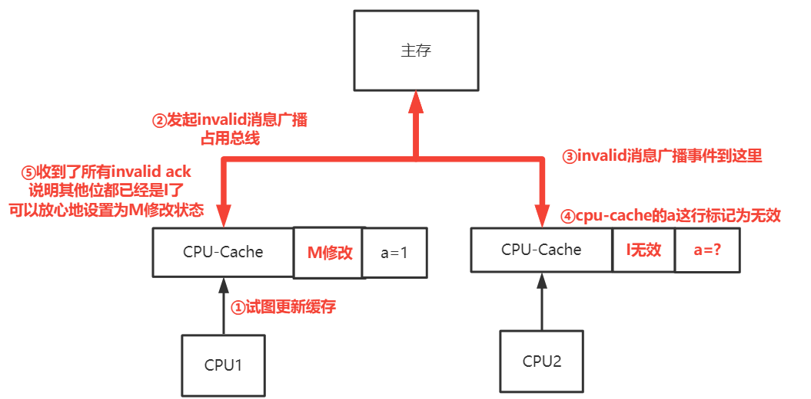

> 本文将为你解答一下三大误区问题： 1. MESI 缓存一致性，为什么要设置 4 种状态这么复杂？是否都是同步、阻塞地保证缓存一致？ 2. 更新变量后，另一个线程...

《深入理解 Java 虚拟机》第二版中，关于 volatile 的原理，特地先讲述了如下图所示的 JMM 内存模型：  
  
它用了 8 种内存操作，以及多种规则，来告诉你特定情况下线程间的数据会如何同步。  
**然而这个模型实际上已经在 JDK5 之后的虚拟机规范中被废弃了。**  
最新官方文档中是采用 “happens-before” 模型来帮助 java 程序员分析多线程环境下的运行情况。  
关于 happends-before 模型的详细解释，建议阅读《java 并发编程的艺术》一书的第三章节。  
本文并不讨论 happends-before 模型，只讨论底层原理，希望借着理解 volatile，去理解一下它和 CPU 之间的关系。关于这部分内容，网上其实有很多错误的解读，根本原因在于没有从真正底层运行的原理考虑，导致了很多误区的产生。

本文将为你解答一下三大误区问题：

1.  MESI 缓存一致性，为什么要设置 4 种状态这么复杂？是否都是同步、阻塞地保证缓存一致？
2.  更新变量后，另一个线程真的永远不可见吗？多线程问题的本质是什么？
3.  volatile 保证一致性的真正底层运行逻辑是什么？

以上问题，我将从 CPU 的层面，以超长图解和文字的形式，为你完整呈现。


为什么需要这个 JMM 模型？用来做什么的？
----------------------

这是为了给 java 开发者提供屏蔽平台差异性的、统一的多线程执行语义  
不同的操作系统或者不同的 CPU，其对多线程并发问题的支持情况是不同的，但 jvm 尽量在背后将其实现成一套统一的逻辑。  
**即你按照我的关键字操作，就可以像 JMM 模型里那样运作，不需要关心背后的 CPU 怎么跑的**

上述模型和背后操作系统、CPU 实现有什么关系？工作内存对应什么，主内存对应什么？
-----------------------------------------


*   主内存对应于 java 堆中的对象实例部分（物理硬件的内存）
*   工作内存对应于虚拟机栈中的部分区域（ 寄存器，高速缓存， 线程主要访问读写的都是工作内存）

什么是 CPU 缓存？CPU 缓存长什么样？
----------------------

CPU 缓存可以理解为一个容量有限的哈希表。  
将某地址数据根据地址做哈希，映射到缓存的某一行，并且有替换的情况。  
而划分两列，则是避免一出现 hash 冲突，就马上淘汰原内容的情况。  
因此增加了备用列。通过这样一个多行两列的结构，根据内存地址实现了缓存的功能。  


2 个 CPU 同时更新数据时，有什么办法避免同时修改主存？
------------------------------

*   一种方式是使用总线锁：确保 CPU 在持有总线锁期间，处理器可以独占任何共享内存。

总线锁的代价是开销很大，其他 CPU 会一直在等待总线释放，读和写操作都无法处理。

*   另一种方式是缓存锁，锁住各自的缓存，并**通过缓存一致性协议 MESI 来进行和主存的同步。**

画了很多张图，顺便带上很多文字，来解释 MESI 协议的原理：  
首先，CPU1 和 CPU2 中的缓存都是空的， 因此缓存状态位是 “I”（Invalid）  
后面会相继提到各个状态的变化。  


* * *

此时主存会将 a 的数据返回给 CPU1， 并把 CPU1 的缓存状态**设置为独占 E（Exclude)**  


为什么要设计独占状态？
-----------

目的是为了**减少不必要的全局同步消息。**  
当这个 a 变量只有 CPU1 使用时，无论 CPU1 怎么修改，也只有 CPU1 在查看，没必要把信息同步给其他 CPU，从而提升了效率， 对于一些不参与竞争的变量来说，非常有用。

* * *

好，独占的问题搞定，那么当 CPU2 也读取时，会发生什么？  
此时就会不再是独占状态了，2 个 CPU 同时被修改为共享状态 S（Share）  


为什么 CPU2 对 a 值的获取，能够修改 CPU1 的状态？
--------------------------------

这是因为 CPU 可以通过总线广播 + 监听消息来变更状态， 也称嗅探机制。  
**即 CPU 核心都会经常监听总线上的广播事件，根据事件（消息）类型，来做不同的应对。**  
因此当 CPU2 更改后，总线会广播 read 消息，当 CPU1 收到 read 消息，并确认这个数据的地址和自己缓存中的地址是一致的时候，就会修改状态为 S 了。

* * *

上述问题搞定，再看最关键的**修改缓存**的部分了！

1.  当 CPU1 触发对 a 变量的修改时，会先发送一个 Invalid 消息。
2.  CPU1 此时会等待不动，停止任何操作，类似于阻塞了，它在等待其他 CPU 给他回应。
3.  当其他的 CPU 收到 Invalid 消息时，会将缓存中的 a 变量修改为 I（Invalid）无效状态
4.  当所有 CPU 都处理完成时，总线为 CPU1 返回 Invalid ack 消息，CPU1 才放心的将 S 状态修改为了 M（modify）状态。  
    结合下面的图进行阅读更佳，注意图中的序号：  
      
    很容易想到， 要将其他 CPU 设置为无效的原因，是为了保证其他 CPU 后面再次试图取 a 值时，取到的是最新的，而不是缓存的错误数据。

修改完 M 状态后，发生了什么？是直接同步回内存吗？
--------------------------

不是的！M 状态此时就像 “独占状态” 一样，贪婪地占有这个缓存，后续的修改、读取，都直接读这个缓存，不再走任何总线

其目的和独占状态 E 一样，都是为了减少非竞争情况下不必要的总线消耗  


* * *

那么什么时候 Modify 状态会变化呢？  
当其他的 CPU 试图获取 a 值，就会发生变化。其过程与 Exclude 独占状态到 Share 状态 是类似的  
  


上面的内容给我一种感觉，MESI 协议中，一直在给我们传达一个信息：**MESI 设置那么多状态，主要是为了避免每次都竞争。竞争只是偶然发生的，我们要尽可能少地乱锁总线！**

不可见的误区例子
--------

从上面可以看到，当我们修改缓存时，会通过触发对其他缓存的无效化，达到变量对其他线程 “可见” 的效果。  
因此，**MESI 缓存一致性协议已经实现了缓存的可见性**，  
下面这种例子中，当 flag=true 时， 其他 CPU 通过 MESI 协议，是能够感知到 flag 的变化的，因为缓存一定会在那个时刻被设置为无效，从而获取最新的数据。

```java
class A {
    static boolean flag = false;
    static int num = 0;
    public static void main(String[] args) throws InterruptedException {
        new Thread(()->{
            while (!flag){
               num++;
            }
        }).start();
        flag = true;
    }
	//输出结果
}
```

首先可以看这个知乎问题的回答，如果看不懂，可以看我为你整理的详细解释：  
[https://www.zhihu.com/question/277395220](https://www.zhihu.com/question/277395220)

* * *

每个 java 线程有自己的寄存器。  
线程寄存器和 CPU 缓存的关系？

* * *

上面的 MESI 协议图中，其实缺少了 2 个关键的优化，这 2 个优化点，也成了可见性问题的根源。  
为了好好讲清楚这 2 个优化点带来的影响，我特地放到这里才讲述，也将会帮助你大大理解 “可见性” 问题的本质！

首先我们回到 CPU1 修改 a 值时的那张图：  


里面提到，CPU1 会等待所有 CPU 都将状态位置为 I（无效）后，才开始修改状态并更新。那么有个问题：

CPU1 等待其他 CPU 清空缓存的阻塞等待行为会不会太慢了？
--------------------------------

如果 CPU1 后面有好几条和 a 无关的指令（例如 b=3,d=e 等)，都在为了等待 a 的更新而不执行，未免太浪费时间了！

因此 MESI 设计了一个叫做 **“StoreBuffer”** 的东西，它会接收 CPU1 的修改动作，并由 StoreBuffer 来触发 “阻塞等待 -> 全部收到 ->修改状态 M”的动作。  
而 CPU1 则继续管自己去执行后续与 a 无关的指令。  
因此 **StoreBuffer 就像是一个异步的 “生产者消息队列”。**，如下所示：  


但是还有个问题，因为是等待所有 CPU 将 a 状态改为 I，这个修改动作是需要时间的。  
如果有一个 CPU 修改的比较慢，可能会导致 StoreBuffer 这个生产者队列出现队满的情况，于是继续引发了阻塞。

有什么办法能加快响应速度 Invalid 消息的响应速度呢？
------------------------------

那就是**再引入一个 “异步的消费者队列”，名叫 Invalid Queue**  
这样其他 CPU 收到消息时，先别急着处理，而是存到这个 Queue 中，然后直接返回 Invalid 消息，这样响应就变快了！ 也就是更新动作，和失效消息的接收，都加了一个队列！  
如下图所示：  


多线程问题与 StoreBuffer、Invalid-Queue 之间的关系
--------------------------------------

终于来到了关键的部分了。  
从刚才的描述中，可以看到 CPU 引入了 2 个异步的队列，来处理数据的更新动作。  
那么就可能存在赋值的动作被放入异步队列，导致延迟触发的情况。  
而正是这个延迟放入的动作，可能导致数据延迟修改，**即使没有发生指令重排序。**  
这样干讲比较难懂，还是需要结合代码和图解。  
首先是这个经典的多线程代码：

```
class ReorderExample {
       int a = 0;
       boolean flag = false;
       public void writer() {
           a = 1;                  // 1
           flag = true;            // 2
       }
       Public void reader() {
           while (flag != true) {            // 3
             ;
           }
           int c =  a * 2;     // 4
           …………
       }
}
```

按照设想，程序员本是希望有如下的表现：  
  
但是事与愿违，当 reader 方法中离开了 flag 循环时，a 的值仍然是初始化值 0，导致 c 的值为 0。

那么在了解了刚才的 CPU 原理后，我们终于可以开始分析这段代码为什么会发生这种问题了：

1.  当线程 writer 执行 a=1 时，CPU 要做更新，会通过上面提到的异步机制进行更新。如果这个 CPU 此时堆积了很多的写操作，会导致 a=1 这个动作在异步队列中处于等待。  
    
    
2.  时间片切换，线程 writer 切到了另一个 CPU 上  
      
    注意一个很重要的点：  
    **线程执行指令，并非只在 1 个 CPU 上运行，是可以通过时间片轮转切换的。因此 CPU 和线程并非完全绑定的关系**
    
3.  flag=true 动作在 CPU2 上迅速响应，很快完成了缓存一致性  
    
    

4.reader 线程读到了最新的 flag，却没有读到新的 a，导致了 a 还在用旧的值。  


因此可以看到，**正是 CPU 之间缓存更新的延迟，导致了多线程不同步问题的发生**

这里不谈论那让人费解的内存屏障， 只要记住一点：  
**对于 volatile 变量，一旦更新，不会走 CPU 异步更新，而是在这个 CPU 阻塞住，直到写动作完整完成，才会继续下一个指令的运行**  
本质上是利用的 #LOCK 指令。  
它的作用就是必须等待该变量的 storeBuffer 的清空，读取时也必须等待 InvalidQueue 的清空，才能去做写和读。从而保证不会出现因异步导致的多线程不同步问题

* * *

写文章不容易，学习也不容易，给我点个关注点个赞，未来会持续更新具有思考深度的学习文章。欢迎在华为云社区共同交流和学习。

MESI 缓存一致性原理图解如下：  


多线程同步问题如下：  


