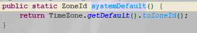

> 本文由 [简悦 SimpRead](http://ksria.com/simpread/) 转码， 原文地址 [www.cnblogs.com](https://www.cnblogs.com/yourbatman/p/14307194.html) 目录

前言
==

本系列的目的是明明白白、彻彻底底的搞定日期 / 时间处理的几乎所有 case。[上篇文章](https://mp.weixin.qq.com/s/VdoQt88JfjPJTL9XgohZJQ) 铺设所有涉及到的概念解释，例如 GMT、UTC、夏令时、时间戳等等，若你还没看过，不仅强烈建议而是**强制建议**你前往用花 5 分钟看一下，因为日期时间处理较为特殊，实战必须基于对概念的了解，否则很可能依旧雾里看花。

> 说明：日期 / 时间的处理是日常开发非常常见的老大难，究其原因就是对日期时间的相关概念、应用场景不熟悉，所以不要忽视它

上篇概念，本文落地实操，二者相辅相成，缺一不可。本文内容较多，文字较长，预计超 2w 字，旨在全面的彻底帮你搞定 Java 对日期时间的处理，**建议你可收藏**，作为参考书留以备用。

本文提纲
----


版本约定
----

*   JDK：8

正文
==

上文铺了这么多概念，作为一枚 Javaer 最关心当然是这些 “概念” 在 Java 里的落地。平时工作中遇到时间如何处理？用 Date 还是 JDK 8 之后的日期时间 API？如何解决跨时区转换等等头大问题。A 哥向来管生管养，管杀管埋，因此本文就带你领略一下，Java 是如何实现 GMT 和 UTC 的？

众所周知，JDK 以版本 8 为界，有两套处理日期 / 时间的 API：


虽然我一直鼓励弃用 Date 而支持在项目中只使用 JSR 310 日期时间类型，但是呢，由于 Date 依旧有庞大的存量用户，所以本文也不落单，对二者的实现均进行阐述。

Date 类型实现
---------

java.util.Date 在 JDK 1.0 就已存在，用于表示日期 + 时间的类型，纵使年代已非常久远，并且此类的具有职责不单一，使用很不方便等诸多毛病，但由于十几二十年的历史原因存在，它的生命力依旧顽强，用户量巨大。

先来认识下 Date，看下这个例子的输出：

```java
@Test
public void test1() {
    Date currDate = new Date();
    System.out.println(currDate.toString());
    // 已经@Deprecated
    System.out.println(currDate.toLocaleString());
    // 已经@Deprecated
    System.out.println(currDate.toGMTString());
}
```

运行程序，输出：

```
Fri Jan 15 10:22:34 CST 2021
2021-1-15 10:22:34
15 Jan 2021 02:22:34 GMT
```

**第一个：标准的 UTC 时间（CST 就代表了偏移量 +0800）**  
第二个：本地时间，根据本地时区显示的时间格式  
第三个：GTM 时间，也就是格林威治这个时候的时间，可以看到它是凌晨 2 点（北京时间是上午 10 点哦）

第二个、第三个其实在 JDK 1.1 就都标记为 @Deprecated 过期了，基本禁止再使用。若需要转换为本地时间 or GTM 时间输出的话，请使用格式化器 java.text.DateFormat 去处理。

### 时区 / 偏移量 TimeZone

在 JDK8 之前，Java 对时区和偏移量都是使用`java.util.TimeZone`来表示的。

一般情况下，使用静态方法`TimeZone#getDefault()`即可获得当前 JVM 所运行的时区，比如你在中国运行程序，这个方法返回的就是中国时区（也叫北京时区、北京时间）。

有的时候你需要做**带时区**的时间转换，譬如：接口返回值中既要有展示北京时间，也要展示纽约时间。这个时候就要获取到纽约的时区，以北京时间为基准在其上进行带时区转换一把：

```java
@Test
public void test2() {
    String patternStr = "yyyy-MM-dd HH:mm:ss";
    // 北京时间（new出来就是默认时区的时间）
    Date bjDate = new Date();

    // 得到纽约的时区
    TimeZone newYorkTimeZone = TimeZone.getTimeZone("America/New_York");
    // 根据此时区 将北京时间转换为纽约的Date
    DateFormat newYorkDateFormat = new SimpleDateFormat(patternStr);
    newYorkDateFormat.setTimeZone(newYorkTimeZone);
    System.out.println("这是北京时间：" + new SimpleDateFormat(patternStr).format(bjDate));
    System.out.println("这是纽约时间：" + newYorkDateFormat.format(bjDate));
}
```

运行程序，输出：

```
这是北京时间：2021-01-15 11:48:16
这是纽约时间：2021-01-14 22:48:16
```

(11 + 24) - 22 = 13，北京比纽约快 13 个小时没毛病。

> 注意：两个时间表示的应该是同一时刻，也就是常说的时间戳值是相等的

那么问题来了，你怎么知道获取纽约的时区用`America/New_York`这个 zoneId 呢？随便写个字符串行不行？

答案是当然不行，这是有章可循的。下面我介绍两种查阅 zoneId 的方式，任你挑选：

**方式一**：用 Java 程序把所有可用的 zoneId 打印出来，然后查阅

```java
@Test
public void test3() {
    String[] availableIDs = TimeZone.getAvailableIDs();
    System.out.println("可用zoneId总数：" + availableIDs.length);
    for (String zoneId : availableIDs) {
        System.out.println(zoneId);
    }
}
```

运行程序，输出（大部分符合规律：/ 前表示所属州，/ 表示城市名称）：

```
可用zoneId总数：628
Africa/Abidjan
Africa/Accra
...
Asia/Chongqing // 亚洲/重庆
Asia/Shanghai // 亚洲/上海
Asia/Dubai // 亚洲/迪拜
...
America/New_York // 美洲/纽约
America/Los_Angeles // 美洲/洛杉矶
...
Europe/London // 欧洲/伦敦
...
Etc/GMT
Etc/GMT+0
Etc/GMT+1
...
```

值得注意的是并没有 Asia/Beijing 哦。

> 说明：此结果基于 JDK 8 版本，不同版本输出的总个数可能存在差异，但主流的 ZoneId 一般不会有变化

**方式二**：  
zoneId 的列表是 jre 维护的一个文本文件，路径是你 JDK/JRE 的安装路径。地址在.\jre\lib 目录的为未`tzmappings`的文本文件里。打开这个文件去 ctrl + f 找也是可以达到查找的目的的。

这两种房子可以帮你找到 ZoneId 的字典方便查阅，但是还有这么一种情况：当前所在的城市呢，在 **tzmappings** 文件里根本没有（比如没有收录），那要获取这个地方的时间去显示怎么破呢？虽然概率很小，但不见得没有嘛，毕竟全球那么多国家那么多城市呢~

Java 自然也考虑到了这一点，因此也是有办法的：指定其时区数字表示形式，其实也叫偏移量（不要告诉我这个地方的时区都不知道，那就真没救了），如下示例

```java
@Test
public void test4() {
    System.out.println(TimeZone.getTimeZone("GMT+08:00").getID());
    System.out.println(TimeZone.getDefault().getID());

    // 纽约时间
    System.out.println(TimeZone.getTimeZone("GMT-05:00").getID());
    System.out.println(TimeZone.getTimeZone("America/New_York").getID());
}
```

运行程序，输出：

```
GMT+08:00 // 效果等同于Asia/Shanghai
Asia/Shanghai
GMT-05:00 // 效果等同于America/New_York
America/New_York
```

值得注意的是，这里只能用`GMT+08:00`，而不能用`UTC+08:00`，原因下文有解释。

#### 设置默认时区

一般来说，JVM 在哪里跑，默认时区就是哪。对于国内程序员来讲，一般只会接触到东八区，也就是北京时间（本地时间）。随着国际合作越来越密切，很多时候需要日期时间国际化处理，举个很实际的例子：同一份应用在阿里云部署、在 AWS（海外）上也部署一份供海外用户使用，此时**同一份代码**部署在不同的时区了，怎么破？

倘若时区不同，那么势必影响到程序的运行结果，很容易带来计算逻辑的错误，很可能就乱套了。Java 让我们有多种方式可以**手动**设置 / 修改默认时区：

1.  API 方式： 强制将时区设为北京时区`TimeZone.setDefault(TimeZone.getDefault().getTimeZone("GMT+8"));`
2.  JVM 参数方式：`-Duser.timezone=GMT+8`
3.  运维设置方式：将操作系统主机时区设置为北京时区，这是推荐方式，可以完全对开发者无感，也方便了运维统一管理

据我了解，很多公司在阿里云、腾讯云、国内外的云主机上部署应用时，全部都是采用运维设置统一时区：中国时区，这种方式来管理的，这样对程序来说就消除了默认时区不一致的问题，对开发者友好。

### 让人恼火的夏令时

你知道吗，中国曾经也使用过夏令时。

> 什么是夏令时？[戳这里](https://mp.weixin.qq.com/s/VdoQt88JfjPJTL9XgohZJQ)

离现在最近是 1986 年至 1991 年用过夏令时（每年 4 月中旬的第一个周日 2 时 - 9 月中旬的第一个星期日 2 时止）：  
_1986 年 5 月 4 日至 9 月 14 日_  
_1987 年 4 月 12 日至 9 月 13 日_  
_1988 年 4 月 10 日至 9 月 11 日_  
_1989 年 4 月 16 日至 9 月 17 日_  
_1990 年 4 月 15 日至 9 月 16 日_  
_1991 年 4 月 14 日至 9 月 15 日_

夏令时是一个 “非常烦人” 的东西，大大的增加了日期时间处理的复杂度。比如这个灵魂拷问：若你的出生日期是 1988-09-11 00:00:00（夏令时最后一天）且存进了数据库，想一想，对此日期的格式化有没有可能就会出问题呢，有没有可能被你格式化成 1988-09-10 23:00:00 呢？

针对此拷问，我模拟了如下代码：

```java
@Test
public void test5() throws ParseException {
    String patterStr = "yyyy-MM-dd";
    DateFormat dateFormat = new SimpleDateFormat(patterStr);

    String birthdayStr = "1988-09-11";
    // 字符串 -> Date -> 字符串
    Date birthday = dateFormat.parse(birthdayStr);
    long birthdayTimestamp = birthday.getTime();
    System.out.println("老王的生日是：" + birthday);
    System.out.println("老王的生日的时间戳是：" + birthdayTimestamp);

    System.out.println("==============程序经过一番周转，我的同时 方法入参传来了生日的时间戳=============");
    // 字符串 -> Date -> 时间戳 -> Date -> 字符串
    birthday = new Date(birthdayTimestamp);
    System.out.println("老王的生日是：" + birthday);
    System.out.println("老王的生日的时间戳是：" + dateFormat.format(birthday));
}
```

这段代码，在不同的 JDK 版本下运行，**可能**出现不同的结果，有兴趣的可 copy 过去自行试试。

关于 JDK 处理夏令时（特指中国的夏令时）确实出现过问题且造成过 bug，当时对应的 JDK 版本是`1.8.0_2xx`之前版本格式化那个日期出问题了，在这之后的版本貌似就没问题了。这里我提供的版本信息仅供参考，若有遇到类似 case 就升级 JDK 版本到最新吧，一般就不会有问题了。

> 发生这个情况是在 JDK 非常小的版本号之间，不太好定位精确版本号界限，所以仅供参考

总的来说，只要你使用的是较新版本的 JDK，开发者是无需关心夏令时问题的，即使全球仍有很多国家在使用夏令时，咱们只需要面向**时区**做时间转换就没问题。

### Date 时区无关性

类 Date 表示一个特定的时间**瞬间**，精度为毫秒。既然表示的是瞬间 / 时刻，那它必然和时区是无关的，看下面代码：

```java
@Test
public void test6() {
    String patterStr = "yyyy-MM-dd HH:mm:ss";
    Date currDate = new Date(System.currentTimeMillis());

    // 北京时区
    DateFormat bjDateFormat = new SimpleDateFormat(patterStr);
    bjDateFormat.setTimeZone(TimeZone.getDefault());
    // 纽约时区
    DateFormat newYorkDateFormat = new SimpleDateFormat(patterStr);
    newYorkDateFormat.setTimeZone(TimeZone.getTimeZone("America/New_York"));
    // 伦敦时区
    DateFormat londonDateFormat = new SimpleDateFormat(patterStr);
    londonDateFormat.setTimeZone(TimeZone.getTimeZone("Europe/London"));

    System.out.println("毫秒数:" + currDate.getTime() + ", 北京本地时间:" + bjDateFormat.format(currDate));
    System.out.println("毫秒数:" + currDate.getTime() + ", 纽约本地时间:" + newYorkDateFormat.format(currDate));
    System.out.println("毫秒数:" + currDate.getTime() + ", 伦敦本地时间:" + londonDateFormat.format(currDate));
}
```

运行程序，输出：

```
毫秒数:1610696040244, 北京本地时间:2021-01-15 15:34:00
毫秒数:1610696040244, 纽约本地时间:2021-01-15 02:34:00
毫秒数:1610696040244, 伦敦本地时间:2021-01-15 07:34:00
```

也就是说，同一个毫秒值，根据时区 / 偏移量的不同可以展示多地的时间，这就证明了 Date 它的时区无关性。

**确切的说：Date 对象里存的是自格林威治时间（ GMT）1970 年 1 月 1 日 0 点至 Date 所表示时刻所经过的毫秒数**，是个数值。

### 读取字符串为 Date 类型

这是开发中极其常见的一种需求：client 请求方扔给你一个字符串如 "2021-01-15 18:00:00"，然后你需要把它转为 Date 类型，怎么破？

问题来了，光秃秃的扔给我个字符串说是 15 号晚上 6 点时间，我咋知道你指的是北京的晚上 6 点，还是东京的晚上 6 点呢？还是纽约的晚上 6 点呢？


因此，对于字符串形式的日期时间，只有指定了时区才有意义。也就是说**字符串 + 时区** 才能精确知道它是什么时刻，否则是存在歧义的。

也许你可能会说了，自己平时开发中前端就是扔个字符串给我，然后我就给格式化为一个 Date 类型，并没有传入时区参数，运行这么久也没见出什么问题呀。如下所示：

```java
@Test
public void test7() throws ParseException {
    String patterStr = "yyyy-MM-dd HH:mm:ss";

    // 模拟请求参数的时间字符串
    String dateStrParam = "2020-01-15 18:00:00";

    // 模拟服务端对此服务换转换为Date类型
    DateFormat dateFormat = new SimpleDateFormat(patterStr);
    System.out.println("格式化器用的时区是：" + dateFormat.getTimeZone().getID());
    Date date = dateFormat.parse(dateStrParam);
    System.out.println(date);
}
```

运行程序，输出：

```
格式化器用的时区是：Asia/Shanghai
Wed Jan 15 18:00:00 CST 2020
```

看起来结果没问题。事实上，这是因为默认情况下你们交互双发就达成了契约：双方均使用的是北京时间（时区），既然是相同时区，所以互通有无不会有任何问题。不信你把你接口给海外用户调试试？

对于格式化器来讲，虽然说编程过程中一般情况下我们并不需要给 DateFormat 设置时区（那就用默认时区呗）就可正常转换。但是作为高手的你必须清清楚楚，明明白白的知道这是由于交互双发默认**有个相同时区的契约存在**。

### SimpleDateFormat 格式化

Java 中对 Date 类型的输入输出 / 格式化，推荐使用 DateFormat 而非用其`toString()`方法。

DateFormat 是一个时间格式化器抽象类，SimpleDateFormat 是其具体实现类，用于以**语言环境敏感**的方式格式化和解析日期。它允许格式化 (日期→文本)、解析(文本→日期) 和规范化。

> 划重点：对语言环境敏感，也就是说对环境 Locale、时区 TimeZone 都是敏感的。既然敏感，那就是**可定制的**

对于一个格式化器来讲，**模式**（模版）是其关键因素，了解一下：

**日期 / 时间模式**：  
格式化的模式由指定的字符串组成，未加引号的大写 / 小写字母（A-Z a-z）代表特定模式，用来表示模式含义，若想**原样输出**可以用单引号''包起来，除了英文字母其它均不解释原样输出 / 匹配。下面是它规定的模式字母（其它字母原样输出）：

<table><thead><tr><th>字母</th><th>含义</th><th>匹配类型</th><th>示例</th></tr></thead><tbody><tr><td><strong>y</strong></td><td>年</td><td>Year</td><td>2020,20</td></tr><tr><td><strong>M</strong></td><td>月</td><td>Month</td><td>July; Jul; 07</td></tr><tr><td><strong>d</strong></td><td>月中的天数（俗称日，最大值 31）</td><td>Number</td><td>10</td></tr><tr><td><strong>H</strong></td><td>小时 (0-23)</td><td>Number</td><td>0,23</td></tr><tr><td><strong>m</strong></td><td>分钟 (0-59)</td><td>Number</td><td>30,59</td></tr><tr><td><strong>s</strong></td><td>秒 (0-59)</td><td>Number</td><td>30,59</td></tr><tr><td>---</td><td>---</td><td>---</td><td>yyyy-MM-dd HH:mm:ss（分隔符可以是任意字符，甚至汉字）</td></tr><tr><td><strong>Y</strong></td><td>当前周所在的年份</td><td>Year</td><td>2020（不建议使用，周若跨年有坑）</td></tr><tr><td><strong>S</strong></td><td>毫秒数 (1-999)</td><td>Number</td><td>999</td></tr><tr><td><strong>a</strong></td><td>am/pm</td><td>Text</td><td>PM</td></tr><tr><td><strong>z</strong></td><td>时区</td><td>通用时区</td><td>Pacific Standard Time; PST; GMT-08:00</td></tr><tr><td><strong>Z</strong></td><td>时区</td><td>RFC 822 时区</td><td>-0800,+0800</td></tr><tr><td><strong>X</strong></td><td>时区</td><td>ISO 8601 时区</td><td>-08; -0800; -08:00</td></tr><tr><td><strong>G</strong></td><td>年代</td><td>Text</td><td>AD(公元)、BC(公元前)</td></tr><tr><td><strong>D</strong></td><td>年中的天数 (1-366)</td><td>Number</td><td>360</td></tr><tr><td><strong>w</strong></td><td>年中的周数 (1-54)</td><td>Number</td><td>27</td></tr><tr><td><strong>W</strong></td><td>月中的周数 (1-5)</td><td>Number</td><td>3</td></tr><tr><td><strong>E</strong></td><td>星期几名称</td><td>Text</td><td>Tuesday; Tue</td></tr><tr><td><strong>u</strong></td><td>星期几数字 (1=Monday...)</td><td>Number</td><td>1</td></tr><tr><td><strong>k</strong></td><td>小时 (1-24)</td><td>Number</td><td>不建议使用</td></tr><tr><td><strong>K/h</strong></td><td>am/pm 小时数字</td><td>Number</td><td>一般配合 a 一起使用</td></tr></tbody></table>

这个表格里出现了一些 “特殊” 的匹配类型，做如下解释：

*   **Text**：格式化 (Date -> String)，如果模式字母的数目是 4 个或更多，则使用完整形式；否则，如果可能的话，使用简短或缩写形式。对于解析（String -> Date），这两种形式都一样，与模式字母的数量无关

```java
@Test
public void test9() throws ParseException {
    String patternStr = "G GG GGGGG E EE EEEEE a aa aaaaa";
    Date currDate = new Date();

    System.out.println("↓↓↓↓↓↓↓↓↓↓↓↓↓↓↓↓↓↓↓↓中文地区模式↓↓↓↓↓↓↓↓↓↓↓↓↓↓↓↓↓↓↓↓");
    System.out.println("====================Date->String====================");
    DateFormat dateFormat = new SimpleDateFormat(patternStr, Locale.CHINA);
    System.out.println(dateFormat.format(currDate));

    System.out.println("====================String->Date====================");
    String dateStrParam = "公元 公元 公元 星期六 星期六 星期六 下午 下午 下午";
    System.out.println(dateFormat.parse(dateStrParam));

    System.out.println("↓↓↓↓↓↓↓↓↓↓↓↓↓↓↓↓↓↓↓↓英文地区模式↓↓↓↓↓↓↓↓↓↓↓↓↓↓↓↓↓↓↓↓");
    System.out.println("====================Date->String====================");
    dateFormat = new SimpleDateFormat(patternStr, Locale.US);
    System.out.println(dateFormat.format(currDate));

    System.out.println("====================String->Date====================");
    dateStrParam = "AD ad bC Sat SatUrday sunDay PM PM Am";
    System.out.println(dateFormat.parse(dateStrParam));
}
```

运行程序，输出：

```
↓↓↓↓↓↓↓↓↓↓↓↓↓↓↓↓↓↓↓↓中文地区模式↓↓↓↓↓↓↓↓↓↓↓↓↓↓↓↓↓↓↓↓
====================Date->String====================
公元 公元 公元 星期六 星期六 星期六 下午 下午 下午
====================String->Date====================
Sat Jan 03 12:00:00 CST 1970
↓↓↓↓↓↓↓↓↓↓↓↓↓↓↓↓↓↓↓↓英文地区模式↓↓↓↓↓↓↓↓↓↓↓↓↓↓↓↓↓↓↓↓
====================Date->String====================
AD AD AD Sat Sat Saturday PM PM PM
====================String->Date====================
Sun Jan 01 00:00:00 CST 1970
```

观察打印结果，除了符合模式规则外，还能在 **String -> Date 解析时**总结出两点结论：

1.  英文单词，不分区大小写。如 SatUrday sunDay 都是没问题，但是**不能**有拼写错误
2.  若有多个 part 表示一个意思，那么 last win。如 Sat SatUrday sunDay 最后一个生效

对于 Locale 地域参数，因为中文不存在格式、缩写方面的特性，因此这些规则只对英文地域（如 Locale.US 生效）

*   **Number**：格式化 (Date -> String)，模式字母的数量是数字的【最小】数量，较短的数字被零填充到这个数量。对于解析 (String -> Date)，模式字母的数量将被忽略，除非需要分隔两个相邻的字段
*   **Year**：对于格式化和解析，如果模式字母的数量是 4 个或更多，则使用特定于日历的长格式。否则，使用日历特定的简短或缩写形式
*   **Month**：如果模式字母的数量是 3 个或更多，则被解释为文本；否则，它将被解释为一个数字。
*   **通用时区**：如果该时区有名称，如 Pacific Standard Time、PST、CST 等那就用名称，否则就用 GMT 规则的字符串，如：GMT-08:00
*   **RFC 822 时区**：遵循 RFC 822 格式，向下兼容通用时区（名称部分除外）
*   **ISO 8601 时区**：对于格式化，如果与 GMT 的偏移值为 0（也就是格林威治时间喽），则生成 “Z”；如果模式字母的数量为 1，则忽略小时的任何分数。例如，如果模式是“X”，时区是“GMT+05:30”，则生成“+05”。在进行解析时，“Z” 被解析为 UTC 时区指示符。一般时区不被接受。如果模式字母的数量是 4 个或更多，在构造 SimpleDateFormat 或应用模式时抛出 IllegalArgumentException。
    *   这个规则理解起来还是比较费劲的，在开发中一般不太建议使用此种模式。若要使用请务必本地做好测试

SimpleDateFormat 的使用很简单，重点是了解其规则模式。最后关于 SimpleDateFormat 的使用再强调这两点哈：

1.  SimpleDateFormat 并非线程安全类，使用时请务必注意并发安全问题
2.  若使用 SimpleDateFormat 去格式化成非本地区域（默认 Locale）的话，那就必须在构造的时候就指定好，如 Locale.US
3.  对于 Date 类型的任何格式化、解析请统一使用 SimpleDateFormat

JSR 310 类型
----------

曾经有个人做了个很有意思的投票，统计对 Java API 的**不满意**程度。最终 Java Date/Calendar API 斩获第二烂（第一烂是 Java XML/DOM），体现出它烂的点较多，这里给你例举几项：

1.  定义并不一致，在 java.util 和 java.sql 包中竟然都有 Date 类，而且呢对它进行格式化 / 解析类竟然又跑到 java.text 去了，精神分裂啊
2.  java.util.Date 等类在建模日期的设计上行为不一致，缺陷明显。包括易变性、糟糕的偏移值、默认值、命名等等
3.  java.util.Date 同时包含日期和时间，而其子类 java.sql.Date 却仅包含日期，这是什么神继承？


```java
@Test
public void test10() {
    long currMillis = System.currentTimeMillis();

    java.util.Date date = new Date(currMillis);
    java.sql.Date sqlDate = new java.sql.Date(currMillis);
    java.sql.Time time = new Time(currMillis);
    java.sql.Timestamp timestamp = new Timestamp(currMillis);

    System.out.println("java.util.Date：" + date);
    System.out.println("java.sql.Date：" + sqlDate);
    System.out.println("java.sql.Time：" + time);
    System.out.println("java.sql.Timestamp：" + timestamp);
}
```

运行程序，输出：

```
java.util.Date：Sat Jan 16 21:50:36 CST 2021
java.sql.Date：2021-01-16
java.sql.Time：21:50:36
java.sql.Timestamp：2021-01-16 21:50:36.733
```

*   国际化支持得并不是好，比如跨时区操作、夏令时等等

Java 自己也实在忍不了这么难用的日期时间 API 了，于是在 2014 年随着 Java 8 的发布引入了全新的 JSR 310 日期时间。JSR-310 源于精品时间库 joda-time 打造，解决了上面提到的**所有问题**，是整个 Java 8 最大亮点之一。

JSR 310 日期 / 时间 **所有的** API 都在 java.time 这个包内，没有例外。


当然喽，本文重点并不在于讨论 JSR 310 日期 / 时间体系，而是看看 JSR 310 日期时间类型是如何处理上面 Date 类型遇到的那些 case 的。

### 时区 / 偏移量 ZoneId

在 JDK 8 之前，Java 使用`java.util.TimeZone`来表示时区。而在 JDK 8 里分别使用了 ZoneId 表示时区，ZoneOffset 表示 UTC 的偏移量。

值得提前强调，时区和偏移量在概念和实际作用上是有较大区别的，主要体现在：

1.  UTC 偏移量仅仅记录了偏移的小时分钟而已，除此之外无任何其它信息。举个例子：+08:00 的意思是比 UTC 时间早 8 小时，没有地理 / 时区含义，相应的 - 03:30 代表的意思仅仅是比 UTC 时间晚 3 个半小时
2.  时区是特定于地区而言的，它和地理上的地区（包括规则）强绑定在一起。比如整个中国都叫东八区，纽约在西五区等等

> 中国没有夏令时，所有东八区对应的偏移量永远是 + 8；纽约有夏令时，因此它的偏移量可能是 - 4 也可能是 - 5 哦

**综合来看，时区更好用**。令人恼火的夏令时问题，若你使用 UTC 偏移量去表示那么就很麻烦，因为它可变：一年内的某些时期在原来基础上偏移量 +1，某些时期 -1；但若你使用 ZoneId 时区去表示就很方便喽，比如纽约是西五区，你在任何时候获取其当地时间都是能得到正确答案的，因为它内置了对夏令时规则的处理，也就是说啥时候 + 1 啥时候 - 1 时区自己门清，不需要 API 调用者关心。

UTC 偏移量更像是一种写死偏移量数值的做法，这在天朝这种没有时区规则（没有夏令时）的国家不会存在问题，东八区和 UTC+08:00 效果永远一样。但在一些夏令时国家（如美国、法国等等），就只能根据时区去获取当地时间喽。所以当你不了解当地规则时，最好是使用时区而非偏移量。

#### ZoneId


它代表一个时区的 ID，如 Europe/Paris。它规定了一些规则可用于将一个 Instant 时间戳转换为本地日期 / 时间 LocalDateTime。

上面说了时区 ZoneId 是包含有规则的，实际上描述偏移量何时以及如何变化的实际规则由`java.time.zone.ZoneRules`定义。ZoneId 则只是一个用于获取底层规则的 ID。之所以采用这种方法，是因为**规则是由政府定义的，并且经常变化，而 ID 是稳定的**。

对于 API 调用者来说只需要使用这个 ID（也就是 ZoneId）即可，而需无关心更为底层的时区规则 ZoneRules，和 “政府” 同步规则的事是它领域内的事就交给它喽。如：夏令时这条规则是由各国政府制定的，而且不同国家不同年一般都不一样，这个事就交由 JDK 底层的 ZoneRules 机制自行 sync，使用者无需关心。

ZoneId 在系统内是唯一的，它共包含三种类型的 ID：

1.  最简单的 ID 类型：ZoneOffset，它由'Z'和以'+'或'-'开头的 id 组成。如：Z、+18:00、-18:00
2.  另一种类型的 ID 是带有某种前缀形式的偏移样式 ID，例如'GMT+2'或'UTC+01:00'。可识别的（合法的）前缀是'UTC'， 'GMT'和'UT'
3.  第三种类型是基于区域的 ID（推荐使用）。基于区域的 ID 必须包含两个或多个字符，且不能以'UTC'、'GMT'、'UT' '+'或'-'开头。基于区域的 id 由配置定义好的，如 Europe/Paris

概念说了一大推，下面给几个代码示例感受下吧。

1、获取系统默认的 ZoneId：

```java
@Test
public void test1() {
    // JDK 1.8之前做法
    System.out.println(TimeZone.getDefault());
    // JDK 1.8之后做法
    System.out.println(ZoneId.systemDefault());
}

输出：
Asia/Shanghai
sun.util.calendar.ZoneInfo[id="Asia/Shanghai",offset=28800000,dstSavings=0,useDaylight=false,transitions=29,lastRule=null]
```

二者结果是一样的，都是 Asia/Shanghai。因为 ZoneId 方法底层就是依赖 TimeZone，如图：




2、指定字符串得到一个 ZoneId：

```java
@Test
public void test2() {
    System.out.println(ZoneId.of("Asia/Shanghai"));
    // 报错：java.time.zone.ZoneRulesException: Unknown time-zone ID: Asia/xxx
    System.out.println(ZoneId.of("Asia/xxx"));
}
```

很明显，这个字符串也是不能随便写的。那么问题来了，可写的有哪些呢？同样的 ZoneId 提供了 API 供你获取到所有可用的字符串 id，有兴趣的同学建议自行尝试：

```java
@Test
public void test3() {
    ZoneId.getAvailableZoneIds();
}
```

3、根据偏移量得到一个 ZoneId：

```java
@Test
public void test4() {
    ZoneId zoneId = ZoneId.ofOffset("UTC", ZoneOffset.of("+8"));
    System.out.println(zoneId);
    // 必须是大写的Z
    zoneId = ZoneId.ofOffset("UTC", ZoneOffset.of("Z"));
    System.out.println(zoneId);
}

输出：
UTC+08:00
UTC
```

这里第一个参数传的前缀，可用值为："GMT", "UTC", or "UT"。当然还可以传空串，那就直接返回第二个参数 ZoneOffset。若以上都不是就报错

注意：根据偏移量得到的 ZoneId 内部并无现成时区规则可用，因此对于有夏令营的国家转换可能出问题，一般不建议这么去做。

4、从日期里面获得时区：

```java
@Test
public void test5() {
    System.out.println(ZoneId.from(ZonedDateTime.now()));
    System.out.println(ZoneId.from(ZoneOffset.of("+8")));

    // 报错：java.time.DateTimeException: Unable to obtain ZoneId from TemporalAccessor:
    System.out.println(ZoneId.from(LocalDateTime.now()));
    System.out.println(ZoneId.from(LocalDate.now()));
}
```

虽然方法入参是 TemporalAccessor，但是只接受带时区的类型，LocalXXX 是不行的，使用时稍加注意。

#### ZoneOffset

距离格林威治 / UTC 的时区偏移量，例如 + 02:00。值得注意的是它继承自 ZoneId，所以也可当作一个 ZoneId 来使用的，当然并不建议你这么去做，请独立使用。

时区偏移量是时区与格林威治 / UTC 之间的时间差。这通常是固定的小时数和分钟数。世界不同的地区有不同的时区偏移量。在 ZoneId 类中捕获关于偏移量如何随一年的地点和时间而变化的规则（主要是夏令时规则），所以继承自 ZoneId。

1、最小 / 最大偏移量：因为偏移量传入的是数字，这个是有限制的哦

```java
@Test
public void test6() {
    System.out.println("最小偏移量：" + ZoneOffset.MIN);
    System.out.println("最小偏移量：" + ZoneOffset.MAX);
    System.out.println("中心偏移量：" + ZoneOffset.UTC);
    // 超出最大范围
    System.out.println(ZoneOffset.of("+20"));
}

输出：
最小偏移量：-18:00
最小偏移量：+18:00
中心偏移量：Z

java.time.DateTimeException: Zone offset hours not in valid range: value 20 is not in the range -18 to 18
```

2、通过时分秒构造偏移量（使用很方便，推荐）：

```java
@Test
public void test7() {
    System.out.println(ZoneOffset.ofHours(8));
    System.out.println(ZoneOffset.ofHoursMinutes(8, 8));
    System.out.println(ZoneOffset.ofHoursMinutesSeconds(8, 8, 8));

    System.out.println(ZoneOffset.ofHours(-5));

    // 指定一个精确的秒数  获取实例（有时候也很有用处）
    System.out.println(ZoneOffset.ofTotalSeconds(8 * 60 * 60));
}

// 输出：
+08:00
+08:08
+08:08:08
-05:00
+08:00
```

看来，偏移量是能精确到秒的哈，只不过一般来说精确到分钟已经到顶了。

##### 设置默认时区

ZoneId 并没有提供设置默认时区的方法，但是通过文章可知 ZoneId 获取默认时区底层依赖的是`TimeZone.getDefault()`方法，因此设置默认时区方式完全遵照 TimeZone 的方式即可（共三种方式，还记得吗？）。

### 让人恼火的夏令时

因为有夏令时规则的存在，让操作日期 / 时间的复杂度大大增加。但还好 JDK 尽量的屏蔽了这些规则对使用者的影响。因此：推荐使用时区（ZoneId）转换日期 / 时间，一般情况下不建议使用偏移量 ZoneOffset 去搞，这样就不会有夏令时的烦恼啦。

### JSR 310 时区相关性

java.util.Date 类型它具有时区无关性，带来的弊端就是一旦涉及到国际化时间转换等需求时，使用 Date 来处理是很不方便的。

JSR 310 解决了 Date 存在的一系列问题：对日期、时间进行了分开表示（LocalDate、LocalTime、LocalDateTime），对本地时间和带时区的时间进行了分开管理。LocalXXX 表示本地时间，也就是说是当前 JVM 所在时区的时间；ZonedXXX 表示是一个**带有时区**的日期时间，它们能非常方便的互相完成转换。

```java
@Test
public void test8() {
    // 本地日期/时间
    System.out.println("================本地时间================");
    System.out.println(LocalDate.now());
    System.out.println(LocalTime.now());
    System.out.println(LocalDateTime.now());

    // 时区时间
    System.out.println("================带时区的时间ZonedDateTime================");
    System.out.println(ZonedDateTime.now()); // 使用系统时区
    System.out.println(ZonedDateTime.now(ZoneId.of("America/New_York"))); // 自己指定时区
    System.out.println(ZonedDateTime.now(Clock.systemUTC())); // 自己指定时区
    System.out.println("================带时区的时间OffsetDateTime================");
    System.out.println(OffsetDateTime.now()); // 使用系统时区
    System.out.println(OffsetDateTime.now(ZoneId.of("America/New_York"))); // 自己指定时区
    System.out.println(OffsetDateTime.now(Clock.systemUTC())); // 自己指定时区
}
```

运行程序，输出：

```java
================本地时间================
2021-01-17
09:18:40.703
2021-01-17T09:18:40.703
================带时区的时间ZonedDateTime================
2021-01-17T09:18:40.704+08:00[Asia/Shanghai]
2021-01-16T20:18:40.706-05:00[America/New_York]
2021-01-17T01:18:40.709Z
================带时区的时间OffsetDateTime================
2021-01-17T09:18:40.710+08:00
2021-01-16T20:18:40.710-05:00
2021-01-17T01:18:40.710Z
```

本地时间的输出非常 “干净”，可直接用于显示。带时区的时间显示了该时间代表的是哪个时区的时间，毕竟不指定时区的时间是没有任何意义的。LocalXXX 因为它具有时区无关性，因此它不能代表一个瞬间 / 时刻。

另外，关于 LocalDateTime、OffsetDateTime、ZonedDateTime 三者的跨时区转换问题，以及它们的详解，因为内容过多放在了下文专文阐述，保持关注。

### 读取字符串为 JSR 310 类型

一个独立的日期时间类型字符串如 2021-05-05T18:00-04:00 它是没有任何意义的，因为没有时区无法确定它代表那个瞬间，这是理论当然也适合 JSR 310 类型喽。

遇到一个日期时间格式字符串，要解析它一般有这两种情况：

1.  不带时区 / 偏移量的字符串：要么不理它说转换不了，要么就**约定一个时区**（一般用系统默认时区），使用 LocalDateTime 来解析

```java
@Test
public void test11() {
    String dateTimeStrParam = "2021-05-05T18:00";
    LocalDateTime localDateTime = LocalDateTime.parse(dateTimeStrParam);
    System.out.println("解析后：" + localDateTime);
}

输出：
解析后：2021-05-05T18:00
```

2.  带时区字 / 偏移量的符串：

```java
@Test
public void test12() {
    // 带偏移量 使用OffsetDateTime 
    String dateTimeStrParam = "2021-05-05T18:00-04:00";
    OffsetDateTime offsetDateTime = OffsetDateTime.parse(dateTimeStrParam);
    System.out.println("带偏移量解析后：" + offsetDateTime);

	// 带时区 使用ZonedDateTime 
    dateTimeStrParam = "2021-05-05T18:00-05:00[America/New_York]";
    ZonedDateTime zonedDateTime = ZonedDateTime.parse(dateTimeStrParam);
    System.out.println("带时区解析后：" + zonedDateTime);
}

输出：
带偏移量解析后：2021-05-05T18:00-04:00
带时区解析后：2021-05-05T18:00-04:00[America/New_York]
```

请注意**带时区解析后**这个结果：字符串参数偏移量明明是 - 05，为毛转换为 ZonedDateTime 后偏移量成为了 - 04 呢？？？

这里是我故意造了这么一个 case 引起你的重视，对此结果我做如下解释：


如图，在 2021.03.14 - 2021.11.07 期间，纽约的偏移量是 - 4，其余时候是 - 5。本例的日期是 2021-05-05 处在夏令时之中，因此偏移量是 - 4，这就解释了为何你显示的写了 - 5 最终还是成了 - 4。

### JSR 310 格式化

针对 JSR 310 日期时间类型的格式化 / 解析，有个专门的类`java.time.format.DateTimeFormatter`用于处理。

DateTimeFormatter 也是一个不可变的类，所以是线程安全的，比 SimpleDateFormat 靠谱多了吧。另外它还内置了非常多的格式化模版**实例**供以使用，形如：

<table><thead><tr><th>格式化器</th><th>示例</th></tr></thead><tbody><tr><td>ofLocalizedDate(dateStyle)</td><td>'2021-01-03'</td></tr><tr><td>ofLocalizedTime(timeStyle)</td><td>'10:15:30'</td></tr><tr><td>ofLocalizedDateTime(dateTimeStyle)</td><td>'3 Jun 2021 11:05:30'</td></tr><tr><td><strong>ISO_LOCAL_DATE</strong></td><td>'2021-12-03'</td></tr><tr><td><strong>ISO_LOCAL_TIME</strong></td><td>'10:15:30'</td></tr><tr><td><strong>ISO_LOCAL_DATE_TIME</strong></td><td>'2021-12-03T10:15:30'</td></tr><tr><td>ISO_OFFSET_DATE_TIME</td><td>'2021-12-03T10:15:30+01:00'</td></tr><tr><td>ISO_ZONED_DATE_TIME</td><td>'2021-12-03T10:15:30+01:00[Europe/Paris]'</td></tr></tbody></table>

```java
@Test
public void test13() {
    System.out.println(DateTimeFormatter.ISO_LOCAL_DATE.format(LocalDate.now()));
    System.out.println(DateTimeFormatter.ISO_LOCAL_TIME.format(LocalTime.now()));
    System.out.println(DateTimeFormatter.ISO_LOCAL_DATE_TIME.format(LocalDateTime.now()));
}

输出：
2021-01-17
22:43:21.398
2021-01-17T22:43:21.4
```

若想自定义模式 pattern，和 Date 一样它也可以自己指定任意的 pattern **日期 / 时间模式**。由于本文在 Date 部分详细介绍了日期 / 时间模式，各个字母代表什么意思以及如何使用，这里就不再赘述了哈。

> 虽然 DateTimeFormatter 支持的模式比 Date 略有增加，但大体还保持一致，个人觉得这块无需再花精力。若真有需要再查官网也不迟

```java
@Test
public void test14() {
    DateTimeFormatter formatter = DateTimeFormatter.ofPattern("第Q季度 yyyy-MM-dd HH:mm:ss", Locale.US);

    // 格式化输出
    System.out.println(formatter.format(LocalDateTime.now()));

    // 解析
    String dateTimeStrParam = "第1季度 2021-01-17 22:51:32";
    LocalDateTime localDateTime = LocalDateTime.parse(dateTimeStrParam, formatter);
    System.out.println("解析后的结果：" + localDateTime);
}
```

Q/q：季度，如 3; 03; Q3; 3rd quarter。

最佳实践
----

*   **弃用 Date，拥抱 JSR 310**

每每说到 JSR 310 日期 / 时间时我都会呼吁，保持惯例我这里继续啰嗦一句：放弃 Date 甚至禁用 Date，使用 JSR 310 日期 / 时间吧，它才是日期时间处理的最佳实践。

另外，在使用期间关于制定时区（默认时区时）依旧有一套我心目中的最佳实践存在，这里分享给你：

*   **永远显式的指定你需要的时区，即使你要获取的是默认时区**

```java
// 方式一：普通做法
LocalDateTime.now();

// 方式二：最佳实践
LocalDateTime.now(ZoneId.systemDefault());
```

如上代码二者效果一模一样。但是方式二是最佳实践。

理由是：这样做能让代码带有**明确的意图**，消除模棱两可的可能性，即使获取的是默认时区。拿方式一来说吧，它就存在意图不明确的地方：到底是代码编写者忘记指定时区欠考虑了，还是就想用默认时区呢？这个答案如果不通读上下文是无法确定的，从而造成了不必要的沟通维护成本。因此即使你是要获取默认时区，也请显示的用 ZoneId.systemDefault() 写上去。

*   **使用 JVM 的默认时区需当心，建议时区和当前会话保持绑定**

这个最佳实践在特殊场景用得到。这么做的理由是：JVM 的默认时区通过静态方法 TimeZone#setDefault() 可全局设置，因此 JVM 的任何一个线程都可以随意更改默认时区。若关于时间处理的代码**对时区非常敏感**的话，最佳实践是你把时区信息和当前会话绑定，这样就可以不用再受到其它线程潜在影响了，确保了健壮性。

> 说明：会话可能只是当前请求，也可能是一个 Session，具体 case 具体分析

总结
==

通过[上篇文章](https://mp.weixin.qq.com/s/VdoQt88JfjPJTL9XgohZJQ) 对日期时间相关概念的铺垫，加上本文的实操代码演示，达到弄透 Java 对日期时间的处理基本不成问题。

两篇文章的内容较多，信息量均比较大，消化起来需要些时间。一方面我建议你先搜藏留以当做参考书备用，另一方面建议多实践，代码这东西只有多写写才能有更深体会。

后面会**再用 3 -4 篇文章**对这前面这两篇的细节、使用场景进行补充，比如如何去匹配 ZoneId 和 Offset 的对应关系，LocalDateTime、OffsetDateTime、ZonedDateTime 跨时区互转问题、在 Spring MVC 场景下使用的最佳实践等等，敬请关注，一起进步。

本文思考题
-----

看完了不一定懂，看懂了不一定会。来，文末 3 个思考题帮你复盘：

1.  Date 类型如何处理夏令时？
2.  ZoneId 和 ZoneOffset 有什么区别？
3.  平时项目若遇到日期时间的处理，有哪些最佳实践？

推荐阅读
----

[**GMT UTC CST ISO 夏令时 时间戳，都是些什么鬼？**](https://mp.weixin.qq.com/s/VdoQt88JfjPJTL9XgohZJQ)

