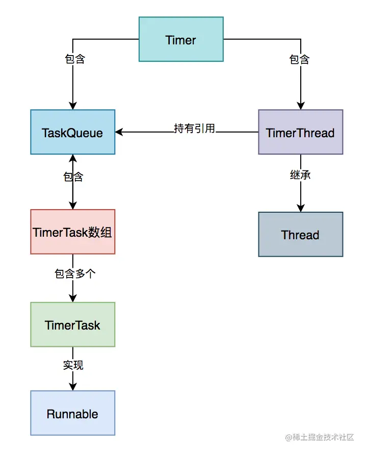
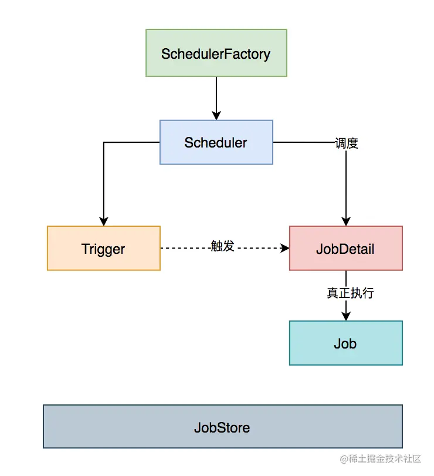
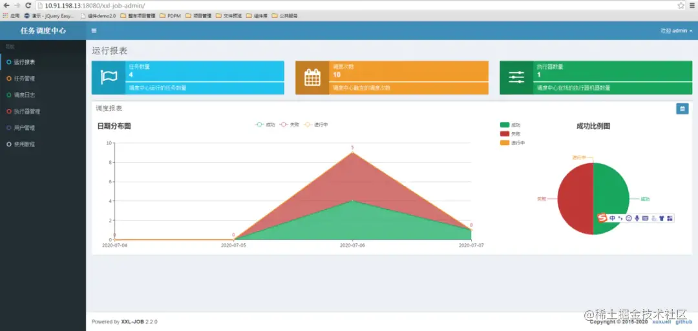
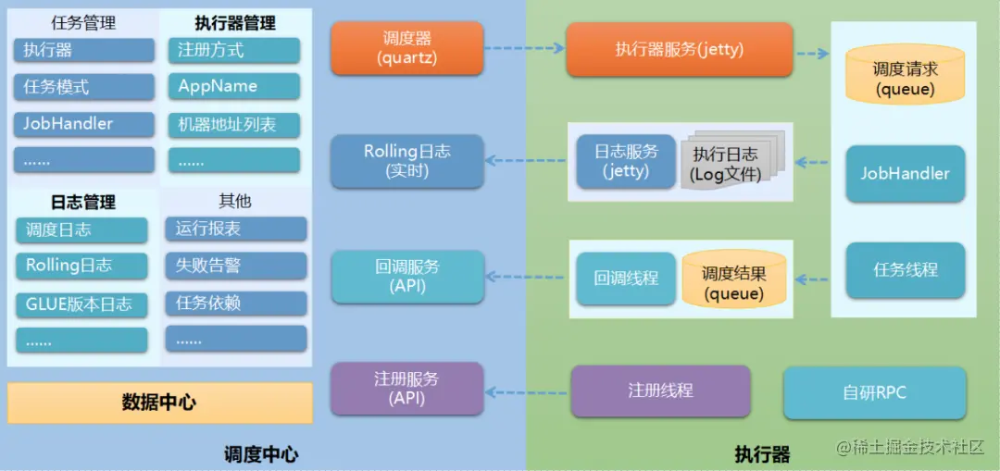
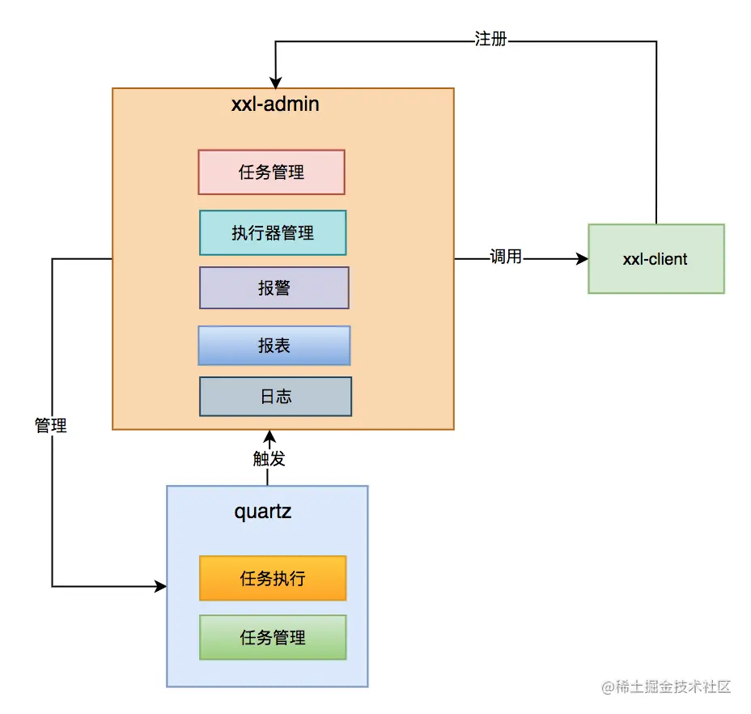

> 本文由 [简悦 SimpRead](http://ksria.com/simpread/) 转码， 原文地址 [juejin.cn](https://juejin.cn/post/6949745535842517006)

前言
==

最近有几个读者私信给我，问我他们的业务场景，要用什么样的定时任务。确实，在不用的业务场景下要用不同的定时任务，其实我们的选择还是挺多的。我今天给大家总结 10 种非常实用的定时任务，总有一种是适合你的。

一. linux 自带的定时任务
================

crontab
-------

不知道你有没有遇到过这种场景：有时需要临时统计线上的数据，然后导出到 excel 表格中。这种需求有时较为复杂，光靠写 sql 语句是无法满足需求的，这就需要写 java 代码了。然后将该程序打成一个 jar 包，在线上环境执行，最后将生成的 excel 文件下载到本地。

为了减小对线上环境的影响，我们一般会选择在`凌晨1-2点`，趁用户量少的时候，执行统计程序。（其实凌晨 4 点左右，用户才是最少的）

由于时间太晚了，我们完全没必要守在那里等执行结果，一个定时任务就能可以搞定。

那么，这种情况用哪种定时任务更合适呢？

答案是：`linux`系统的`crontab`。（不过也不排除有些项目没部署在 linux 系统中）

运行`crontab -e`，可以编辑定时器，然后加入如下命令：

```
0 2 * * * /usr/local/java/jdk1.8/bin/java -jar /data/app/tool.jar > /logs/tool.log &

复制代码
```

就可以在`每天凌晨2点`，定时执行`tool.jar`程序，并且把日志输出到`tool.log`文件中。当然你也可以把后面的执行 java 程序的命令写成 shell 脚本，更方便维护。

使用这种定时任务支持方便修改定时规则，有界面可以统一管理配置的各种定时脚本。

crontab 命令的基本格式如下：

```
crontab [参数] [文件名]

复制代码
```

如果没有指定文件名，则接收键盘上输入的命令，并将它载入到`crontab`。

参数功能对照表如下：


以上参数，如果没有使用`-u`指定用户，则默认使用的当前用户。

通过`crontab -e`命令编辑文件内容，具体语法如下：

```
[分] [小时] [日期] [月] [星期] 具体任务

复制代码
```

其中：

*   分，表示多少分钟，范围：0-59
    
*   小时，表示多少小时，范围：0-23
    
*   日期，表示具体在哪一天，范围：1-31
    
*   月，表示多少月，范围：1-12
    
*   星期，表示多少周，范围：0-7，0 和 7 都代表星期日
    

还有一些特殊字符，比如：

*   `*`代表如何时间，比如：`*1***` 表示每天凌晨 1 点执行。
    
*   `/`代表每隔多久执行一次，比如：`*/5 ****` 表示每隔 5 分钟执行一次。
    
*   `,`代表支持多个，比如：`10 7,9,12 ***` 表示在每天的 7、9、12 点 10 分各执行一次。
    
*   `-`代表支持一个范围，比如：`10 7-9 ***` 表示在每天的 7、8、9 点 10 分各执行一次。
    

此外，顺便说一下`crontab`需要`crond`服务支持，`crond`是`linux`下用来周期地执行某种任务的一个守护进程，在安装`linux`操作系统后，默认会安装`crond`服务工具，且`crond`服务默认就是自启动的。`crond`进程每分钟会定期检查是否有要执行的任务，如果有，则会自动执行该任务。

可以通过以下命令操作相关服务：

```
service crond status // 查看运行状态
service crond start //启动服务
service crond stop //关闭服务
service crond restart //重启服务
service crond reload //重新载入配置

复制代码
```

**使用`crontab`的优缺点：**

*   优点：方便修改定时规则，支持一些较复杂的定时规则，通过文件可以统一管理配好的各种定时脚本。
    
*   缺点：如果定时任务非常多，不太好找，而且必须要求操作系统是`linux`，否则无法执行。
    

二. jdk 自带的定时任务
--------------

1.Thread
--------

各位亲爱的朋友，你没看错，`Thread`类真的能做定时任务。如果你看过一些定时任务框架的源码，你最后会发现，它们的底层也会使用`Thread`类。

实现这种定时任务的具体代码如下：

```
public static void init() {
    new Thread(() -> {
        while (true) {
            try {
                System.out.println("doSameThing");
                Thread.sleep(1000 * 60 * 5);
            } catch (Exception e) {
                log.error(e);
            }
        }
    }).start();
}

复制代码
```

使用`Thread`类可以做最简单的定时任务，在`run`方法中有个`while`的死循环（当然还有其他方式），执行我们自己的任务。有个需要特别注意的地方是，需要用`try...catch`捕获异常，否则如果出现异常，就直接退出循环，下次将无法继续执行了。

这种方式做的定时任务，只能周期性执行，不能支持定时在某个时间点执行。

此外，该线程可以定义成`守护线程`，在后台默默执行就好。

使用场景：比如项目中有时需要每隔 10 分钟去下载某个文件，或者每隔 5 分钟去读取模板文件生成静态 html 页面等等，一些简单的周期性任务场景。

**使用`Thread`类的优缺点：**

*   优点：这种定时任务非常简单，学习成本低，容易入手，对于那些简单的周期性任务，是个不错的选择。
    
*   缺点：不支持指定某个时间点执行任务，不支持延迟执行等操作，功能过于单一，无法应对一些较为复杂的场景。
    

2.Timer
-------

`Timer`类是 jdk 专门提供的定时器工具，用来在后台线程计划执行指定任务，在`java.util`包下，要跟`TimerTask`一起配合使用。



`Timer`类其实是一个任务调度器，它里面包含了一个`TimerThread`线程，在这个线程中无限循环从`TaskQueue`中获取`TimerTask`（该类实现了 Runnable 接口），调用其`run`方法，就能异步执行定时任务。我们需要继承`TimerTask`类，实现它的`run`方法，在该方法中加上自己的业务逻辑。

实现这种定时任务的具体代码如下：

```
public class TimerTest {

    public static void main(String[] args) {
        Timer timer = new Timer();
        timer.schedule(new TimerTask() {
            @Override
            public void run() {
                System.out.println("doSomething");
            }
        },2000,1000);
    }
}

复制代码
```

先实例化一个`Timer`类，然后调用它的`schedule`方法，在该方法中实例化`TimerTask`类，业务逻辑写在`run`方法中。`schedule`方法最后的两次参数分别表示：`延迟时间` 和 `间隔时间`，单位是毫秒。上面例子中，设置的定时任务是每隔 1 秒执行一次，延迟 2 秒执行。

主要包含 6 个方法：

*   `schedule(TimerTask task, Date time)`, 指定任务 task 在指定时间 time 执行
    
*   `schedule(TimerTask task, long delay)`, 指定任务 task 在指定延迟 delay 后执行
    
*   `schedule(TimerTask task, Date firstTime,long period)`, 指定任务 task 在指定时间 firstTime 执行后，进行重复固定延迟频率 peroid 的执行
    
*   `schedule(TimerTask task, long delay, long period)`, 指定任务 task 在指定延迟 delay 后，进行重复固定延迟频率 peroid 的执行
    
*   `scheduleAtFixedRate(TimerTask task,Date firstTime,long period)`, 指定任务 task 在指定时间 firstTime 执行后，进行重复固定延迟频率 peroid 的执行
    
*   `scheduleAtFixedRate(TimerTask task, long delay, long period)`, 指定任务 task 在指定延迟 delay 后，进行重复固定延迟频率 peroid 的执行
    

**不过使用`Timer`实现定时任务有以下问题：**

1.  由于`Timer`是单线程执行任务，如果其中一个任务耗时非常长，会影响其他任务的执行。
    
2.  如果`TimerTask`抛出`RuntimeException`，Timer 会停止所有任务的运行。
    

**使用`Timer`类的优缺点：**

*   优点：非常方便实现多个周期性的定时任务，并且支持延迟执行，还支持在指定时间之后支持，功能还算强大。
    
*   缺点：如果其中一个任务耗时非常长，会影响其他任务的执行。并且如果`TimerTask`抛出`RuntimeException`，`Timer`会停止所有任务的运行，所以阿里巴巴开发者规范中不建议使用它。
    

3.ScheduledExecutorService
--------------------------

`ScheduledExecutorService`是 JDK1.5 + 版本引进的定时任务，该类位于`java.util.concurrent`并发包下。

`ScheduledExecutorService`是基于多线程的，设计的初衷是为了解决`Timer`单线程执行，多个任务之间会互相影响的问题。

它主要包含 4 个方法：

*   `schedule(Runnable command,long delay,TimeUnit unit)`，带延迟时间的调度，只执行一次，调度之后可通过 Future.get() 阻塞直至任务执行完毕。
    
*   `schedule(Callable<V> callable,long delay,TimeUnit unit)`，带延迟时间的调度，只执行一次，调度之后可通过 Future.get() 阻塞直至任务执行完毕，并且可以获取执行结果。
    
*   `scheduleAtFixedRate`，表示以固定频率执行的任务，如果当前任务耗时较多，超过定时周期 period，则当前任务结束后会立即执行。
    
*   `scheduleWithFixedDelay`，表示以固定延时执行任务，延时是相对当前任务结束为起点计算开始时间。
    

实现这种定时任务的具体代码如下：

```
public class ScheduleExecutorTest {

    public static void main(String[] args) {
        ScheduledExecutorService scheduledExecutorService = Executors.newScheduledThreadPool(5);
        scheduledExecutorService.scheduleAtFixedRate(() -> {
            System.out.println("doSomething");
        },1000,1000, TimeUnit.MILLISECONDS);
    }
}

复制代码
```

调用`ScheduledExecutorService`类的`scheduleAtFixedRate`方法实现周期性任务，每隔 1 秒钟执行一次，每次延迟 1 秒再执行。

这种定时任务是阿里巴巴开发者规范中用来替代`Timer`类的方案，对于多线程执行周期性任务，是个不错的选择。

**ScheduledExecutorService 的优缺点：**

*   优点：基于多线程的定时任务，多个任务之间不会相关影响，支持周期性的执行任务，并且带延迟功能。
    
*   缺点：不支持一些较复杂的定时规则。
    

三. spring 支持的定时任务
=================

1.spring task
-------------

`spring task`是`spring3`以上版本自带的定时任务，实现定时任务的功能时，需要引入`spring-context`包，目前它支持：`xml` 和 `注解` 两种方式。

### 1. 项目实战

由于 xml 方式太古老了，我们以 springboot 项目中注解方式为例。

**第一步**，在 pom.xml 文件中引入`spring-context`相关依赖。

```
<dependency>
    <groupId>org.springframework</groupId>
    <artifactId>spring-context</artifactId>
</dependency>

复制代码
```

**第二步**，在 springboot 启动类上加上`@EnableScheduling`注解。

```
@EnableScheduling
@SpringBootApplication
public class Application {

    public static void main(String[] args) {
        new SpringApplicationBuilder(Application.class).web(WebApplicationType.SERVLET).run(args);
    }
}

复制代码
```

**第三步**，使用`@Scheduled`注解定义定时规则。

```
@Service
public class SpringTaskTest {

    @Scheduled(cron = "${sue.spring.task.cron}")
    public void fun() {
        System.out.println("doSomething");
    }
}

复制代码
```

**第四步**，在`applicationContext.properties`文件中配置参数：

```
sue.spring.task.cron=*/10 * * * * ?

复制代码
```

这样就能每隔 10 秒执行一次 fun 方法了。

### 2. cron 规则

spring4 以上的版本中，cron 表达式包含 6 个参数：

```
[秒] [分] [时] [日期] [月] [星期]

复制代码
```

**还支持几个常用的特殊符号：**

*   `*`：表示任何时间触发任务
    
*   `,`：表示指定的时间触发任务
    
*   `-`：表示一段时间内触发任务
    
*   `/`：表示从哪一个时刻开始，每隔多长时间触发一次任务。
    
*   `?`：表示用于月中的天和周中的天两个子表达式，表示不指定值。
    

**cron 表达式参数具体含义：**

1.  秒，取值范围：0-59，支持`*`、`,`、`-`、`/`。
    
2.  分，取值范围：0-59，支持`*`、`,`、`-`、`/`。
    
3.  时，取值范围：0-23，支持`*`、`,`、`-`、`/`。
    
4.  日期，取值范围：1-31，支持`*`、`,`、`-`、`/`。比秒多了`?`，表示如果指定的`星期`触发了，则配置的`日期`变成无效。
    
5.  月，取值范围：1-12，支持`*`、`,`、`-`、`/`。
    
6.  星期，取值范围：1~7，1 代表星期天，6 代表星期六，其他的以此类推。支持`*`、`,`、`-`、`/`、`?`。比秒多了`?`，表示如果指定的`日期`触发了，则配置的`星期`变成无效。
    

**常见 cron 表达式使用举例：**

*   `0 0 0 1 * ?`  每月 1 号零点执行
    
*   `0 0 2 * * ?`  每天凌晨 2 点执行
    
*   `0 0 2 * * ?`  每天凌晨 2 点执行
    
*   `0 0/5 11 * * ?` 每天 11 点 - 11 点 55 分，每隔 5 分钟执行一次
    
*   `0 0 18 ? * WED` 每周三下午 6 点执行
    

spring task 先通过 ScheduledAnnotationBeanPostProcessor 类的 processScheduled 方法，解析和收集`Scheduled`注解中的参数，包含：cron 表达式。

然后在 ScheduledTaskRegistrar 类的 afterPropertiesSet 方法中，默认初始化一个单线程的`ThreadPoolExecutor`执行任务。

对 spring task 感兴趣的小伙伴，可以加我微信找我私聊。

**使用`spring task`的优缺点：**

*   优点：spring 框架自带的定时功能，springboot 做了非常好的封装，开启和定义定时任务非常容易，支持复杂的`cron`表达式，可以满足绝大多数单机版的业务场景。单个任务时，当前次的调度完成后，再执行下一次任务调度。
    
*   缺点：默认单线程，如果前面的任务执行时间太长，对后面任务的执行有影响。不支持集群方式部署，不能做数据存储型定时任务。
    

2.spring quartz
---------------

`quartz`是`OpenSymphony`开源组织在`Job scheduling`领域的开源项目，是由 java 开发的一个开源的任务日程管理系统。

quartz 能做什么？

*   作业调度：调用各种框架的作业脚本，例如 shell,hive 等。
    
*   定时任务：在某一预定的时刻，执行你想要执行的任务。
    

架构图如下：



quartz 包含的主要接口如下：

*   `Scheduler` 代表调度容器，一个调度容器中可以注册多个 JobDetail 和 Trigger。
    
*   `Job` 代表工作，即要执行的具体内容。
    
*   `JobDetail` 代表具体的可执行的调度程序，Job 是这个可执行程调度程序所要执行的内容。
    
*   `JobBuilder` 用于定义或构建 JobDetail 实例。
    
*   `Trigger` 代表调度触发器，决定什么时候去调。
    
*   `TriggerBuilder` 用于定义或构建触发器。
    
*   `JobStore` 用于存储作业和任务调度期间的状态。
    

### 1. 项目实战

我们还是以`springboot`集成`quartz`为例。

**第一步**，在 pom.xml 文件中引入`quartz`相关依赖。

```
<dependency>
    <groupId>org.springframework.boot</groupId>
    <artifactId>spring-boot-starter-quartz</artifactId>
</dependency>

复制代码
```

**第二步**，创建真正的定时任务执行类，该类继承`QuartzJobBean`。

```
public class QuartzTestJob extends QuartzJobBean {
    @Override
    protected void executeInternal(JobExecutionContext context) throws JobExecutionException {
        String userName = (String) context.getJobDetail().getJobDataMap().get("userName");
        System.out.println("userName:" + userName);
    }
}

复制代码
```

**第三步**，创建调度程序`JobDetail`和调度器`Trigger`。

```
@Configuration
public class QuartzConfig {
    @Value("${sue.spring.quartz.cron}")
    private String testCron;

    /**
     * 创建定时任务
     */
    @Bean
    public JobDetail quartzTestDetail() {
        JobDetail jobDetail = JobBuilder.newJob(QuartzTestJob.class)
                .withIdentity("quartzTestDetail", "QUARTZ_TEST")
                .usingJobData("userName", "susan")
                .storeDurably()
                .build();
        return jobDetail;
    }

    /**
     * 创建触发器
     */
    @Bean
    public Trigger quartzTestJobTrigger() {
        //每隔5秒执行一次
        CronScheduleBuilder cronScheduleBuilder = CronScheduleBuilder.cronSchedule(testCron);

        //创建触发器
        Trigger trigger = TriggerBuilder.newTrigger()
                .forJob(quartzTestDetail())
                .withIdentity("quartzTestJobTrigger", "QUARTZ_TEST_JOB_TRIGGER")
                .withSchedule(cronScheduleBuilder)
                .build();
        return trigger;
    }
}

复制代码
```

**第四步**，在`applicationContext.properties`文件中配置参数：

```
sue.spring.quartz.cron=*/5 * * * * ?

复制代码
```

这样就能每隔 5 秒执行一次 QuartzTestJob 类的 executeInternal 方法了。

CronTrigger 配置格式:

```
[秒] [分] [小时] [日] [月] [周] [年]

复制代码
```

`spring quartz`跟`spring task`的`cron`表达式规则基本一致，只是`spring4`以上的版本去掉了后面的`年`，而`quartz`的`CronTrigger`的`年`是非必填的，这里我就不做过多介绍了。

**使用`spring quartz`的优缺点：**

*   优点：默认是多线程异步执行，单个任务时，在上一个调度未完成时，下一个调度时间到时，会另起一个线程开始新的调度，多个任务之间互不影响。支持复杂的`cron`表达式，它能被集群实例化，支持分布式部署。
    
*   缺点：相对于 spring task 实现定时任务成本更高，需要手动配置`QuartzJobBean`、`JobDetail`和`Trigger`等。需要引入了第三方的`quartz`包，有一定的学习成本。不支持并行调度，不支持失败处理策略和动态分片的策略等。
    

四. 分布式定时任务
==========

1.xxl-job
---------

`xxl-job`是大众点评（许雪里）开发的一个分布式任务调度平台，其核心设计目标是开发迅速、学习简单、轻量级、易扩展。现已开放源代码并接入多家公司线上产品线，开箱即用。

`xxl-job`框架对`quartz`进行了扩展，使用`mysql`数据库存储数据，并且内置 jetty 作为`RPC`服务调用。

主要特点如下：

1.  有界面维护定时任务和触发规则，非常容易管理。
    
2.  能动态启动或停止任务
    
3.  支持弹性扩容缩容
    
4.  支持任务失败报警
    
5.  支持动态分片
    
6.  支持故障转移
    
7.  Rolling 实时日志
    
8.  支持用户和权限管理
    

管理界面：



整体架构图如下：

使用 quartz 架构图如下：



### 项目实战

`xxl-admin`管理后台部署和 mysql 脚本执行等这些前期准备工作，我就不过多介绍了，有需求的朋友可以找我私聊，这些更偏向于运维的事情。

假设前期工作已经 OK 了，接下来我们需要：

**第一步**，在 pom.xml 文件中引入`xxl-job`相关依赖。

```
<dependency>
   <groupId>com.xuxueli</groupId>
   <artifactId>xxl-job-core</artifactId>
</dependency>

复制代码
```

**第二步**，在`applicationContext.properties`文件中配置参数：

```
xxl.job.admin.address: http://localhost:8088/xxl-job-admin/
xxl.job.executor.appname: xxl-job-executor-sample
xxl.job.executor.port: 8888
xxl.job.executor.logpath: /data/applogs/xxl-job/

复制代码
```

**第三步**，创建 HelloJobHandler 类继承`IJobHandler`类：

```
@JobHandler(value = "helloJobHandler")
@Component
public class HelloJobHandler extends IJobHandler {

    @Override
    public ReturnT<String> execute(String param) {
        System.out.println("XXL-JOB, Hello World.");
        return SUCCESS;
    }
}

复制代码
```

这样定时任务就配置好了。

> 建议把定时任务单独部署到另外一个服务中，跟 api 服务分开。根据我以往的经验，job 大部分情况下，会对数据做批量操作，如果操作的数据量太大，可能会对服务的内存和 cpu 资源造成一定的影响。

**使用`xxl-job`的优缺点：**

*   优点：有界面管理定时任务，支持弹性扩容缩容、动态分片、故障转移、失败报警等功能。它的功能非常强大，很多大厂在用，可以满足绝大多数业务场景。
    
*   缺点：和`quartz`一样，通过数据库分布式锁，来控制任务不能重复执行。在任务非常多的情况下，有一些性能问题。
    

2.elastic-job
-------------

`elastic-job`是当当网开发的弹性分布式任务调度系统，功能丰富强大，采用 zookeeper 实现分布式协调，实现任务高可用以及分片。它是专门为高并发和复杂业务场景开发。

`elastic-job`目前是`apache`的`shardingsphere`项目下的一个子项目，官网地址：[shardingsphere.apache.org/elasticjob/…](https://link.juejin.cn?target=http%3A%2F%2Fshardingsphere.apache.org%2Felasticjob%2F%25E3%2580%2582 "http://shardingsphere.apache.org/elasticjob/%E3%80%82")

`elastic-job`在 2.x 之后，出了两个产品线：`Elastic-Job-Lite`和`Elastic-Job-Cloud`，而我们一般使用 Elastic-Job-Lite 就能够满足需求。Elastic-Job-Lite 定位为轻量级无中心化解决方案，使用 jar 包的形式提供分布式任务的协调服务，外部仅依赖于 Zookeeper。。

主要特点如下：

*   分布式调度协调
    
*   弹性扩容缩容
    
*   失效转移
    
*   错过执行作业重触发
    
*   作业分片一致性，保证同一分片在分布式环境中仅一个执行实例
    
*   自诊断并修复分布式不稳定造成的问题
    
*   支持并行调度
    

整体架构图：


### 项目实战

**第一步**，在 pom.xml 文件中引入`elastic-job`相关依赖。

```
<dependency>
    <groupId>com.dangdang</groupId>
    <artifactId>elastic-job-lite-core</artifactId>
</dependency>
<dependency>
    <groupId>com.dangdang</groupId>
    <artifactId>elastic-job-lite-spring</artifactId>
</dependency>

复制代码
```

**第二步**，增加 ZKConfig 类，配置`zookeeper`：

```
@Configuration
@ConditionalOnExpression("'${zk.serverList}'.length() > 0")
public class ZKConfig {

    @Bean
    public ZookeeperRegistryCenter registry(@Value("${zk.serverList}") String serverList,
                                             @Value("${zk.namespace}") String namespace) {
        return new ZookeeperRegistryCenter(new ZookeeperConfiguration(serverList, namespace));
    }

}

复制代码
```

**第三步**，定义一个类实现`SimpleJob`接口：

```
public class TestJob implements SimpleJob {

    @Override
    public void execute(ShardingContext shardingContext){
        System.out.println("ShardingTotalCount:"+shardingContext.getShardingTotalCount());
        System.out.println("ShardingItem:"+shardingContext.getShardingItem());
    }
}

复制代码
```

**第四步**，增加 JobConfig 配置任务：

```
@Configuration
public class JobConfig {
    @Value("${sue.spring.elatisc.cron}")
    private String testCron;
    @Value("${sue.spring.elatisc.itemParameters}")
    private  String shardingItemParameters;
    @Value("${sue.spring.elatisc.jobParameters}")
    private String jobParameters =;
    @Value("${sue.spring.elatisc.shardingTotalCount}")
    private int shardingTotalCount;
    
    @Autowired
    private ZookeeperRegistryCenter registryCenter;

    @Bean
    public SimpleJob testJob() {
        return new TestJob();
    }

    @Bean
    public JobScheduler simpleJobScheduler(final SimpleJob simpleJob) {
        return new SpringJobScheduler(simpleJob, registryCenter, getConfiguration(simpleJob.getClass(),
                cron, shardingTotalCount, shardingItemParameters, jobParameters));
    }

    private geConfiguration getConfiguration(Class<? extends SimpleJob> jobClass,String cron,int shardingTotalCount,String shardingItemParameters,String jobParameters) {
        JobCoreConfiguration simpleCoreConfig = JobCoreConfiguration.newBuilder(jobClass.getName(), testCron, shardingTotalCount).
                shardingItemParameters(shardingItemParameters).jobParameter(jobParameters).build();
        SimpleJobConfiguration simpleJobConfig = new SimpleJobConfiguration(simpleCoreConfig, jobClass.getCanonicalName());
        LiteJobConfiguration jobConfig = LiteJobConfiguration.newBuilder(simpleJobConfig).overwrite(true).build();
        return jobConfig;
    }
}
复制代码
```

其中：

*   cron：cron 表达式，定义触发规则。
    
*   shardingTotalCount：定义作业分片总数
    
*   shardingItemParameters：定义分配项参数，一般用分片序列号和参数用等号分隔，多个键值对用逗号分隔，分片序列号从 0 开始，不可大于或等于作业分片总数。
    
*   jobParameters：作业自定义参数
    

**第五步**，在`applicationContext.properties`文件中配置参数：

```
spring.application.name=elasticjobDemo
zk.serverList=localhost:2181
zk.namespace=elasticjobDemo
sue.spring.elatisc.cron=0/5 * * * * ?
sue.spring.elatisc.itemParameters=0=A,1=B,2=C,3=D
sue.spring.elatisc.jobParameters=test
sue.spring.elatisc.shardingTotalCount=4

复制代码
```

这样定时任务就配置好了，创建定时任务的步骤，相对于`xxl-job`来说要繁琐一些。

**使用`elastic-job`的优缺点：**

*   优点：支持分布式调度协调，支持分片，适合高并发，和一些业务相对来说较复杂的场景。
    
*   缺点：需要依赖于 zookeeper，实现定时任务相对于`xxl-job`要复杂一些，要对分片规则非常熟悉。
    

3. 其他分布式定时任务
------------

### 1. Saturn

Saturn 是唯品会开源的一个分布式任务调度平台。取代传统的 Linux Cron/Spring Batch Job 的方式，做到全域统一配置，统一监控，任务高可用以及分片并发处理。

Saturn 是在当当开源的 Elastic-Job 基础上，结合各方需求和我们的实践见解改良而成。使用案例：唯品会、酷狗音乐、新网银行、海融易、航美在线、量富征信等。 

github 地址：[github.com/vipshop/Sat…](https://link.juejin.cn?target=https%3A%2F%2Fgithub.com%2Fvipshop%2FSaturn%2F "https://github.com/vipshop/Saturn/")

### 2. TBSchedule

 TBSchedule 是阿里开发的一款分布式任务调度平台，旨在将调度作业从业务系统中分离出来，降低或者是消除和业务系统的耦合度，进行高效异步任务处理。

目前被广泛应用在阿里巴巴、淘宝、支付宝、京东、聚美、汽车之家、国美等很多互联网企业的流程调度系统中。

github 地址：[github.com/taobao/TBSc…](https://link.juejin.cn?target=https%3A%2F%2Fgithub.com%2Ftaobao%2FTBSchedule "https://github.com/taobao/TBSchedule")

老实说优秀的定时任务还是挺多的，不是说哪种定时任务牛逼我们就一定要用哪种，而是要根据实际业务需求选择。每种定时任务都有优缺点，合理选择既能满足业务需求，又能避免资源浪费，才是上上策。当然在实际的业务场景，通常会多种定时任务一起配合使用。

顺便说一句，欢迎亲爱的小伙伴们，找我一起聊聊：你用过哪些定时任务，遇到过哪些问题，以及如何解决问题的。如果有相关问题也可以问我。

希望我们能够共同进步，一起成长。

### 最后说一句 (求关注，别白嫖我)

如果这篇文章对您有所帮助，或者有所启发的话，帮忙扫描下发二维码关注一下，您的支持是我坚持写作最大的动力。

求一键三连：点赞、转发、在看。

关注公众号：【苏三说技术】，在公众号中回复：面试、代码神器、开发手册、时间管理有超赞的粉丝福利，另外回复：加群，可以跟很多 BAT 大厂的前辈交流和学习。