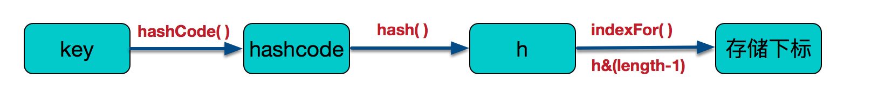

简介
==

JDK1.7 中 HashMap 多线程成环问题，几乎已经成了 Java 程序员人人需要了解的知识了，本文就带大家来一切重现一下 HashMap 死循环 ？

前置知识复习
======

阅读本文前，最好确保你知道 JDK1.7 实现的 HashMap （以下简称 HashMap）[learn more](https://blog.csdn.net/woshimaxiao1/article/details/83661464) 有以下几个特点：

*   首先 HashMap 采用的数据结构是**数组 + 链表**。

*   使用 new HashMap() 创建对象时，如果构造器参数中没有传入数据，那么就不会调用 **inflateTable** 来为 table 数组申请内存。

*   HashMap 的成员变量 **threshold** 表示扩容发生的边界值，**loadFactor** 表示负载因子，**table.length** 可以表示内部容量。

*   HashMap 扩容判断是在调用 put 或者 putAll 的时候，且如果需要扩容，**扩容（resize）发生在实际插入新数据（createEntry）之前。**以 put 举例，扩容条件是 `(size >= threshold) && (null != table[bucketIndex])` 这个稍后举例。

*   HashMap 当前内部容量总是 `2^n` ，**每次扩容 Entry 数组长度扩大 1 倍**，即新容量为 $2^{n+1}$。threshold 总是等于 capacity * loadFactor

*   HashMap 的扩容方法是 **resize**，扩容时需要创建一个新的 Entry 数组，然后把数据从旧的 Entry 数组迁移到新的 Entry 数组，这个过程的迁移函数是 **transfer**

哈希算法
====

哈希算法就是把任意长度的消息压缩至固定长度的消息摘要。相同的输入经过 hash 函数计算得到的结果总是相同的。

> 虽然从理论上讲，只要哈希结果长度足够长，那么不同的输入，就会产生各不相同的散列值。  
> 然而事实上，散列值的空间通常远小于输入的空间，不同的输入可能会散列成相同的输出。此时就会产生哈希冲突。  
> 解决哈希冲突的方法有很多种，HashMap 采用的是链式地址法，也就产生了数组 + 链表的数据结构。

HashMap 利用了哈希算法，把当前元素的关键字通过某个函数映射到数组中的某个位置。



算法：先求输入对象 key 的 hashCode，然后再经过高低位异或计算 (^) 得到最终的散列值 hash，然后再调用 indexFor，得到数组下标。

# jdk1.7中的HashMap 

## 死循环分析+定位

在jdk1.8中对HashMap做了很多优化，这里先分析在jdk1.7中的问题，相信大家都知道在jdk1.7多线程环境下HashMap容易出现死循环，这里我们先用代码来模拟出现死循环的情况：

```java
public class HashMapTest {

    public static void main(String[] args) {
        HashMapThread thread0 = new HashMapThread();
        HashMapThread thread1 = new HashMapThread();
        HashMapThread thread2 = new HashMapThread();
        HashMapThread thread3 = new HashMapThread();
        HashMapThread thread4 = new HashMapThread();
        thread0.start();
        thread1.start();
        thread2.start();
        thread3.start();
        thread4.start();
    }
}

class HashMapThread extends Thread {
    private static AtomicInteger ai = new AtomicInteger();
    private static Map map = new HashMap<>();

    @Override
    public void run() {
        while (ai.get() < 1000000) {
            map.put(ai.get(), ai.get());
            ai.incrementAndGet();
        }
    }
}
```

上述代码比较简单，就是开多个线程不断进行put操作，并且HashMap与AtomicInteger都是全局共享的。

在多运行几次该代码后，出现如下死循环情形：


其中有几次还会出现数组越界的情况：


这里我们着重分析为什么会出现死循环的情况，通过jps和jstack命名查看死循环情况，结果如下：


从堆栈信息中可以看到出现死循环的位置，通过该信息可明确知道死循环发生在HashMap的扩容函数中，根源在transfer函数中，jdk1.7中HashMap的transfer函数如下：

```java
void transfer(Entry[] newTable, boolean rehash) {
        int newCapacity = newTable.length;
        for (Entry e : table) {
            while(null != e) {
                Entry next = e.next;
                if (rehash) {
                    e.hash = null == e.key ? 0 : hash(e.key);
                }
                int i = indexFor(e.hash, newCapacity);
                e.next = newTable[i];
                newTable[i] = e;
                e = next;
            }
        }
    }
```

总结下该函数的主要作用：

**在对table进行扩容到newTable后，需要将原来数据转移到newTable中，注意10-12行代码，这里可以看出在转移元素的过程中，使用的是头插法，也就是链表的顺序会翻转，这里也是形成死循环的关键点。**


通过反射访问 HashMap 成员方法
-------------------

现在，我们不能直接调用 `indexFor`，`hash`，`capacity` 这些成员方法，所以我写了一个 `HashMapWrapper` 来封装反射逻辑。

```java
import java.lang.reflect.Field;
import java.lang.reflect.Method;
import java.util.*;

public class HashMapWrapper {
    // 代理 java.util.HashMap 类
    private HashMap hashMap;

    public HashMapWrapper(HashMap hashMap) {
        this.hashMap = hashMap;
    }

    // 计算对象 k 在 Entry 数组的数组下标
    public int indexFor(Object k) {
        return indexFor(hash(k), capacity());
    }

    // 通过反射运行 HashMap#hash(Object)
    int hash(Object k) {
        try {
            Method hash = HashMap.class.getDeclaredMethod("hash", Object.class);
            hash.setAccessible(true);
            return (Integer) hash.invoke(hashMap, k);
        } catch (Exception e) {
            e.printStackTrace();
        }
        return -1;
    }

    // 通过反射运行 HashMap#indexFor(int, int)
    int indexFor(int h, int length) {
        try {
            Method indexFor = HashMap.class.getDeclaredMethod("indexFor", int.class, int.class);
            indexFor.setAccessible(true);
            return (Integer) indexFor.invoke(hashMap, h, length);
        } catch (Exception e) {
            e.printStackTrace();
        }
        return -1;
    }

    // 通过反射运行 HashMap#capacity()
    int capacity() {
        try {
            Method capacity = HashMap.class.getDeclaredMethod("capacity");
            capacity.setAccessible(true);
            return (Integer) capacity.invoke(hashMap);
        } catch (Exception e) {
            e.printStackTrace();
        }
        return -1;
    }

    // 获取 Entry 数组指定下标下的链表
    LinkedList<Object> getKeysOfTable(int index) {
        LinkedList<Object> result = new LinkedList<Object>();
        try {
            // 通过反射访问 HashMap#table 即 Entry 数组
            Field table = HashMap.class.getDeclaredField("table");
            table.setAccessible(true);
            Object[] array = (Object[]) table.get(hashMap);
            getKeys(array[index], result);
            return result;
        } catch (Exception e) {
            e.printStackTrace();
        }
        return result;
    }

    // 递归函数，辅助遍历 Entry 链表结构，并将 Entry 的 key 添加到 keys 链表中
    private void getKeys(Object o, LinkedList<Object> keys) throws Exception {
        if (o == null) return;
        Field key = o.getClass().getDeclaredField("key");
        key.setAccessible(true);
        keys.add(key.get(o));
        Field next = o.getClass().getDeclaredField("next");
        next.setAccessible(true);
        getKeys(next.get(o), keys);
    }
}
```

找出发生哈希冲突的输入值
------------

> 对应不同的关键字可能获得相同的 hash 值，即 key1≠key2，但是 f(key1)=f(key2)。这种现象就是哈希冲突。

现在我想要找出一组能够产生哈希冲突的关键字。而且成环的条件至少需要 2 个 Entry 元素，且 next 互相指向彼此。  
**因此，我需要找的这组关键字，扩容前会在同一地址发生哈希冲突，且扩容后仍然会在同一地址发生哈希冲突**

```java
import java.util.HashMap;

public class Main {

    public static void main(String[] args) {
        HashMap<Integer, Object> hashMap = new HashMap<Integer, Object>(4);
        HashMapWrapper wrapper = new HashMapWrapper(hashMap);
        // new HashMap 之后，不会立即给 Entry 数组分配内存
        // HashMap 是允许 null 作为 key 的，因此我用 null 来触发 inflateTable 初始化 Entry 数组
        hashMap.put(null, null);
        for (int i = 0; i < 100; i++) {
            int index = wrapper.indexFor(i);
            // 寻找在数组下标为 1 的位置发生冲突的关键字
            if (index == 1) {
                System.out.print(i);
                System.out.print(" ");
            }
        }

    }
}
```

初始容量为 4 时，在数组下标为 1 位置发生哈希冲突的关键字如下：

> 1 5 9 13 16 20 24 28 35 39 43 47 50 54 58 62 65 69 73 77 80 84 88 92 99

修改初始容量为 8 时，在数组下标为 1 位置发生哈希冲突的关键字如下：

> 1 9 16 24 35 43 50 58 69 77 84 92

我挑选了 1 9 16 24 作为我的实验值。

单一线程 HashMap 扩容
===============

```java
import java.util.HashMap;

public class ShowNoProblem {

    public static void main(String[] args) {
        HashMap<Integer, Object> hashMap = new HashMap<Integer, Object>(4, 0.5f);
        HashMapWrapper wrapper = new HashMapWrapper(hashMap);
        hashMap.put(1, null);
        hashMap.put(9, null);
        System.out.println("扩容前容量：" + wrapper.capacity());
        System.out.println(wrapper.getKeysOfTable(1));
        hashMap.put(16, null);
        System.out.println("扩容后容量：" + wrapper.capacity());
        System.out.println(wrapper.getKeysOfTable(1));
    }
}
```

控制台输出结果如下：

> 扩容前容量：4  
> [9, 1]  
> 扩容后容量：8  
> [16, 1, 9]


**HashMap.Entry** 有 **key**, **value**, **hash**, **next** 四个属性。图中主要展示了三种属性，并且反映出了 HashMap 的数组 + 链表的数据结构。

resize 扩容函数
-----------

```java
void resize(int newCapacity) {
    // 暂存老 Entry 数组的引用
    Entry[] oldTable = table;
    // 暂存老 Entry 数组的内部容量
    int oldCapacity = oldTable.length;
    // 条件成立：已经达到最大容量，无法继续扩容
    if (oldCapacity == MAXIMUM_CAPACITY) {
        // 提高扩容临界阈值，这样就不会再扩容了
        threshold = Integer.MAX_VALUE;
        return;
    }
    // 申请一个新的数组，容量为新的容量
    // 如果是 put 单个元素时引起的扩容，newCapacity 等于 2 * oldCapacity，扩大一倍
    // 如果是 putAll 多个元素时引起的扩容，newCapacity 等于 2^n * oldCapacity。
    Entry[] newTable = new Entry[newCapacity];
    transfer(newTable, initHashSeedAsNeeded(newCapacity));
    table = newTable;
    // 修改扩容阈值
    threshold = (int)Math.min(newCapacity * loadFactor, MAXIMUM_CAPACITY + 1);
}
```

transfer 转移函数
-------------

```java
/**
 * Transfers all entries from current table to newTable.
 */
void transfer(Entry[] newTable, boolean rehash) {
    // 执行 transfer 之前，已经申请了一块新的数组，新的容量就等于新的数组长度
    int newCapacity = newTable.length;
    // 外层：顺序遍历老数组上的 Entry 引用
    for (Entry<K,V> e : table) {
        // 从头结点开始依次遍历链表中的所有元素
        // e 表示当前正在访问的 Entry，e 相当于“遍历移动指针”
        while(null != e) {
            // 暂存 e 的 next，防止修改 e.next 引起的遍历指针丢失
            Entry<K,V> next = e.next;
            if (rehash) {
                e.hash = null == e.key ? 0 : hash(e.key);
            }
            int i = indexFor(e.hash, newCapacity);
            // 使用“头插法”把 e 从老 Entry 数组转移到新 Entry 数组
            // 先修改 e 的 next 指向，指向新 Entry 数组的当前头结点
            e.next = newTable[i];
            // 修改新 Entry 数组的头结点为 e
            newTable[i] = e;
            // 此时，移动当前遍历结点为暂存的 next 结点。
            // 表示的是老 Entry 数组中的下一个元素，现在已经是新的头结点了
            e = next;
        }
    }
}
```

createEntry 创建
--------------

使用 “头插法” 向链表中添加新的元素。

```java
void createEntry(int hash, K key, V value, int bucketIndex) {
    // 暂存当前的链表头结点，防止老的头结点丢失
    Entry<K,V> e = table[bucketIndex];
    // new 一个新的 Entry 覆盖头结点，且新的 Entry 头结点的 next 指向老的头结点 e
    table[bucketIndex] = new Entry<>(hash, key, value, e);
    // HashMap 内部元素数量 + 1
    size++;
}
```

多线程 HashMap 成环问题再现
==================

```java
import java.util.HashMap;

public class ShowProblem {

    public static void main(String[] args) {
        final HashMap<Integer, Object> hashMap = new HashMap<Integer, Object>(4, 0.5f);
        final HashMapWrapper wrapper = new HashMapWrapper(hashMap);
        hashMap.put(1, null);
        hashMap.put(9, null);
        new Thread(new Runnable() {
            public void run() {
                hashMap.put(16, null);
                System.out.println("扩容后容量：" + wrapper.capacity());
                System.out.println(wrapper.getKeysOfTable(1));
            }
        }, "a").start();
        new Thread(new Runnable() {
            public void run() {
                hashMap.put(24, null);
                System.out.println("扩容后容量：" + wrapper.capacity());
                System.out.println(wrapper.getKeysOfTable(1));
            }
        }, "b").start();
    }
}
```

预先设置断点
------

直接运行这段代码，不容易复现此问题，我们需要借助断点。在以下几个位置设置条件断点：

首先，HashMap resize 方法内 581 行和 582 行设置条件断点，条件为 `Thread.currentThread().getName().equals("a") || Thread.currentThread().getName().equals("b")`。


然后，在 HashMap transfer 方法 594 行设置断点，条件为 `Thread.currentThread().getName().equals("a")`


Debug 顺序
--------

**启动 Debug** ，线程 a 和线程 b 的代码停留在 transfer 这一行：


我的这次运行时，红色 √ 是在线程 a，如果你的 红色 √ 在线程 b，那你切换到线程 a。

**继续运行线程 a 的代码**，让 a 停留在 transfer 方法 next 暂存 e.next 指针之后。


这时候，不要再运行线程 a 的代码了，选中线程 b，并让线程 b 的 transfer 方法执行完。


此时切换到线程 a 进行观察，你发现 next.next == e 成立。此时已经成环。


我知道，这样子还是不够直观，并不太容易记住到底怎么成环的，下面我再给出示意图。

成环示意图
=====

为了表现出过程，这次画图我简化一点，Entry 中只显示 key 关键字，next 指针直接用箭头表示。

**线程 a 和线程 b 执行过分别申请了新 table 数组，并作为参数传给 transfer 方法**。

> `Entry[] newTable = new Entry[newCapacity];`  
>
> `transfer(newTable, initHashSeedAsNeeded(newCapacity));`

线程 a 执行到 transfer 的 594 行时被我停住了，线程 b 也刚好执行到 transfer 的 594 行，情况如图所示：


如上图所示，局部变量 e，next 以及方法参数 newTable 都在线程 a 和线程 b 的栈帧中存放着。此时，两个 newTable 都是空的。

线程 b 继续运行，执行完 transfer 方法，停在 HashMap 的 582 行 `this.table = newTable;` (即使让线程 b 都执行完，结果还是一样的，你可以试一试)，此时结果如下：


即顺序遍历线程 b 中的 newTable[1] 位置的链表，key 的值依次为 **1, 9**。上图绿色连线就可以表示线程 b 的 newTable。

**现在转而执行 线程 a 的代码**

```java
// newTable[1]等于 null, 所以 Entry(key=9).next 指向 null
e.next = newTable[i];  
// 头结点指向 Entry(key=9)
newTable[i] = e;
```

继续看下图：


如上图所示，红色连线表示就是线程 a 的 newTable[1] 上的链表。

```java
// 当前线程 a 的栈帧中的 e 被修改为 Entry(key=1)
e = next;

(... 新的一轮循环, 此时 e 指向 Entry(key=1) )

// next 指向 Entry(key=9)
Entry<K,V> next = e.next;
(...省略部分代码)
// newTable[1]等于 Entry(key=9), 所以 Entry(key=1).next 指向 Entry(key=9)
e.next = newTable[i];  
// 修改头结点指向 Entry(key=1)
newTable[i] = e;
```

线程 a 运行到 HashMap 的 600 行 `e = next` 停住时，此时的情形如下图：


如上图所示，我们发现此时线程 a 的 newTable[1] 的链表已经和线程 b 的 newTable[1] 的链表重合了。**而且线程 a 栈帧上的 e 和 next 居然交换位置了！**

transfer 方法并不会创建新的 Entry，所以线程 a 和线程 b 是用的同样的 Entry 对象。线程 b 在之前的操作，影响了现在线程 a 的执行。

线程 a 再运行一轮循环：

```java
// 当前线程 a 的栈帧中的 e 被修改为 Entry(key=9)
e = next;

(... 新的一轮循环, 此时 e 指向 Entry(key=9) )

// next 指向 Entry(key=1)
Entry<K,V> next = e.next;
(...省略部分代码)
// newTable[1]等于 Entry(key=1), 所以 Entry(key=9).next 指向 Entry(key=1)
e.next = newTable[i];  
// 修改头结点指向 Entry(key=9)
newTable[i] = e;
```

然后停在 HashMap 600 行，观察此时的状态：


此时就已经成环了。

我们可以再让线程 a 执行一轮循环：


依旧是停在 HashMap 600 行，之后就是最后这两个状态不断切换，不断循环。


# jdk1.8中HashMap

在jdk1.8中对HashMap进行了优化，在发生hash碰撞，不再采用头插法方式，而是直接插入链表尾部，因此不会出现环形链表的情况，但是在多线程的情况下仍然不安全，这里我们看jdk1.8中HashMap的put操作源码：

```java
final V putVal(int hash, K key, V value, boolean onlyIfAbsent,
                   boolean evict) {
        Node[] tab; Node p; int n, i;
        if ((tab = table) == null || (n = tab.length) == 0)
            n = (tab = resize()).length;
        if ((p = tab[i = (n - 1) & hash]) == null) // 如果没有hash碰撞则直接插入元素
            tab[i] = newNode(hash, key, value, null);
        else {
            Node e; K k;
            if (p.hash == hash &&
                ((k = p.key) == key || (key != null && key.equals(k))))
                e = p;
            else if (p instanceof TreeNode)
                e = ((TreeNode)p).putTreeVal(this, tab, hash, key, value);
            else {
                for (int binCount = 0; ; ++binCount) {
                    if ((e = p.next) == null) {
                        p.next = newNode(hash, key, value, null);
                        if (binCount >= TREEIFY_THRESHOLD - 1) // -1 for 1st
                            treeifyBin(tab, hash);
                        break;
                    }
                    if (e.hash == hash &&
                        ((k = e.key) == key || (key != null && key.equals(k))))
                        break;
                    p = e;
                }
            }
            if (e != null) { // existing mapping for key
                V oldValue = e.value;
                if (!onlyIfAbsent || oldValue == null)
                    e.value = value;
                afterNodeAccess(e);
                return oldValue;
            }
        }
        ++modCount;
        if (++size > threshold)
            resize();
        afterNodeInsertion(evict);
        return null;
    }
```

这是jdk1.8中HashMap中put操作的主函数， 注意第6行代码，如果没有hash碰撞则会直接插入元素。

如果线程A和线程B同时进行put操作，刚好这两条不同的数据hash值一样，并且该位置数据为null，所以这线程A、B都会进入第6行代码中。

假设一种情况，线程A进入后还未进行数据插入时挂起，而线程B正常执行，从而正常插入数据，然后线程A获取CPU时间片，此时线程A不用再进行hash判断了，问题出现：线程A会把线程B插入的数据给覆盖，发生线程不安全。

# **总结：为什么使用 hashmap 会造成死循环呢？**

**这个原因主要是因为 hashMap 在 resize 过程中对链表进行了一次倒序处理**。

假设两个线程同时进行 resize, A->B 第一线程在处理过程中比较慢，第二个线程已经完成了倒序编程了 B->A 那么就出现了循环，B->A->B. 这样就出现了就会出现 CPU 使用率飙升。


首先HashMap是线程不安全的，其主要体现：

> 1. 在jdk1.7中，在多线程环境下，扩容时会造成环形链或数据丢失。
> 2. 在jdk1.8中，在多线程环境下，会发生数据覆盖的情况。
