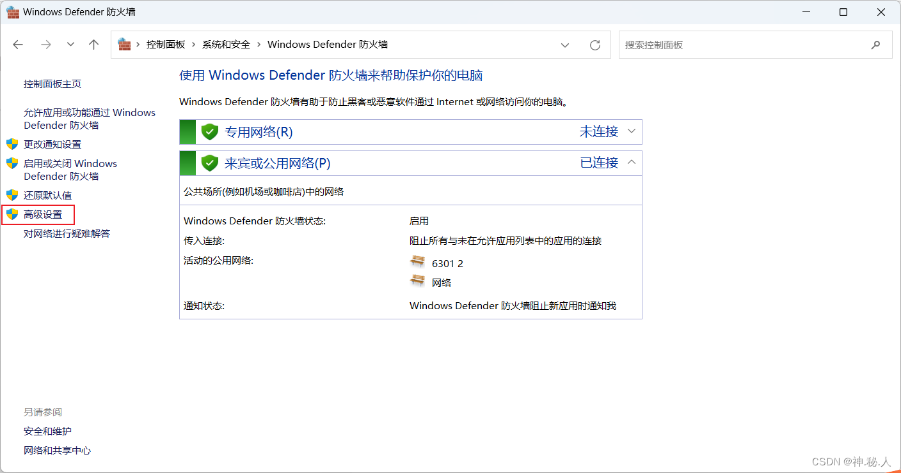
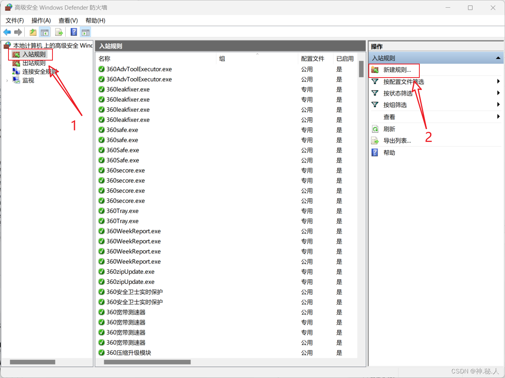
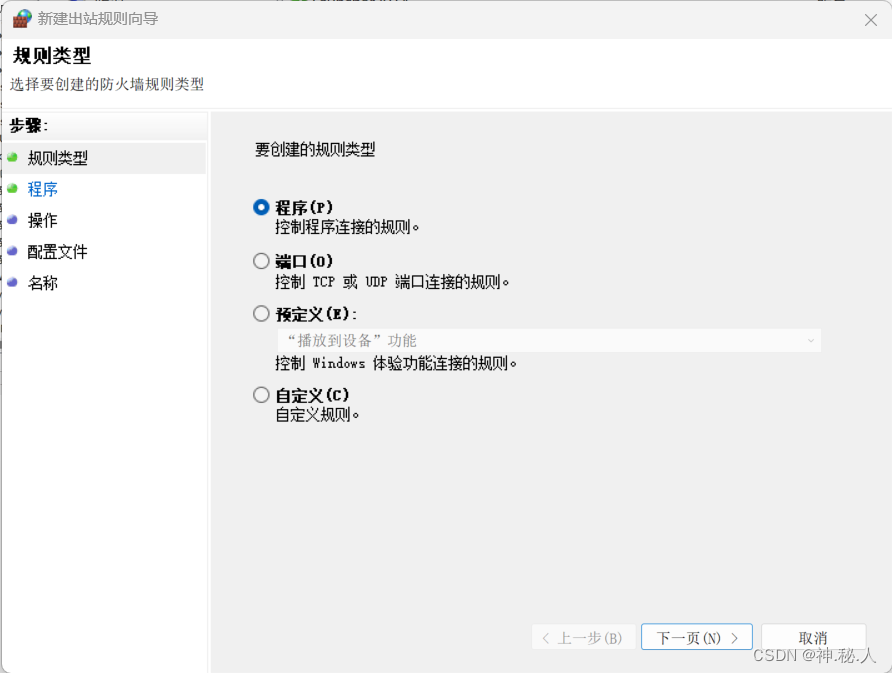
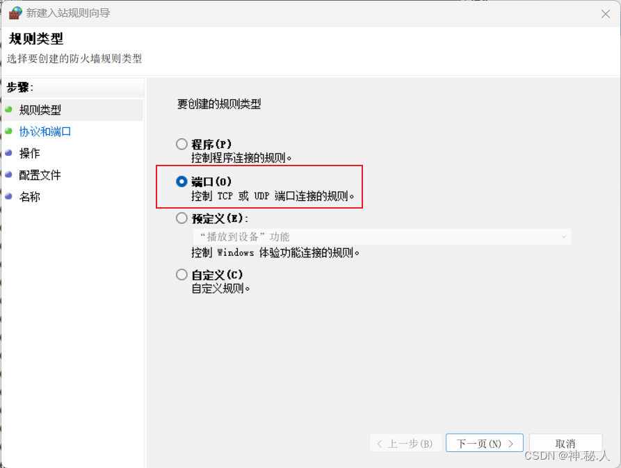
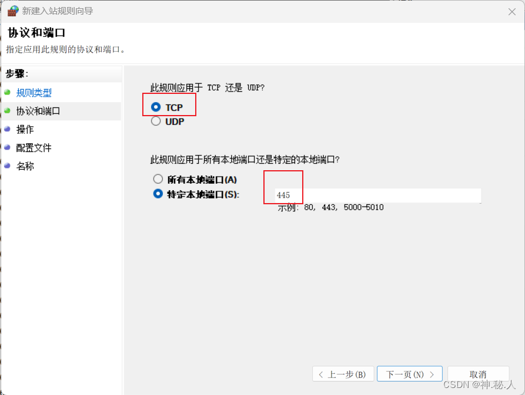
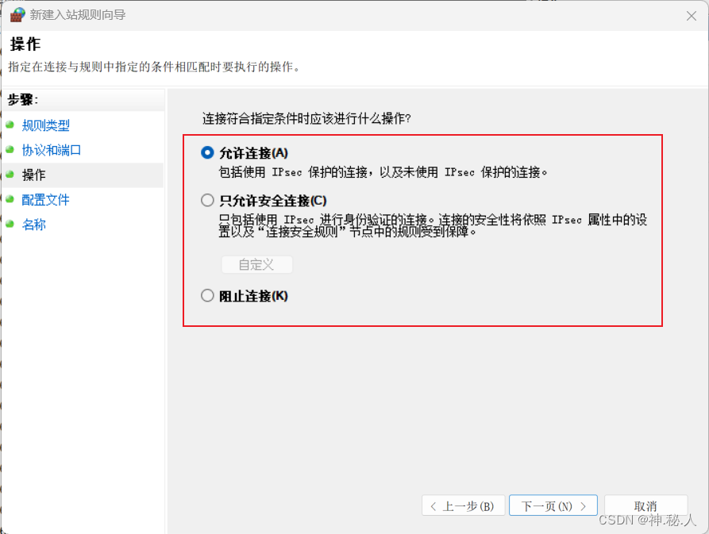
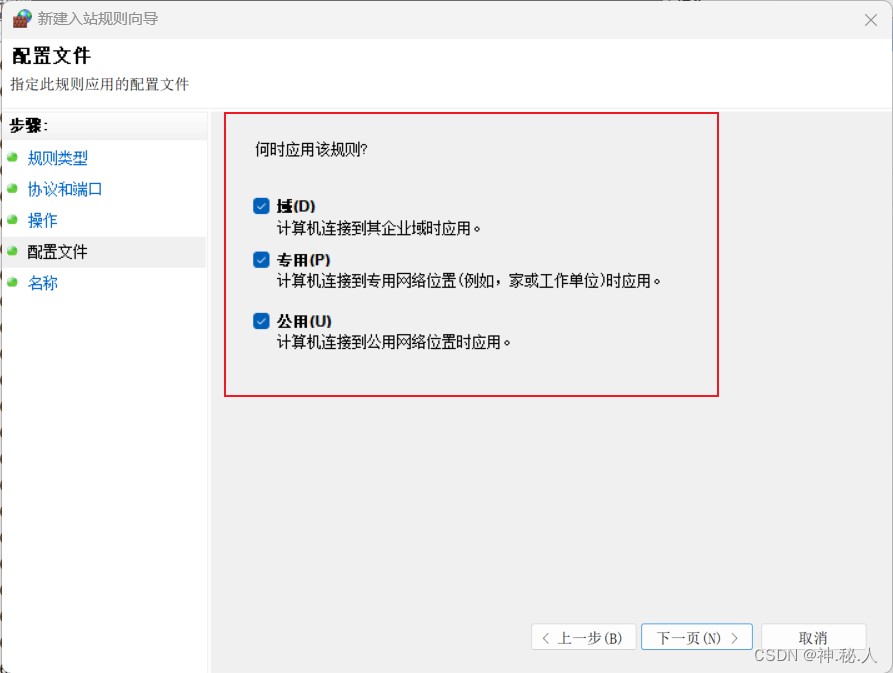
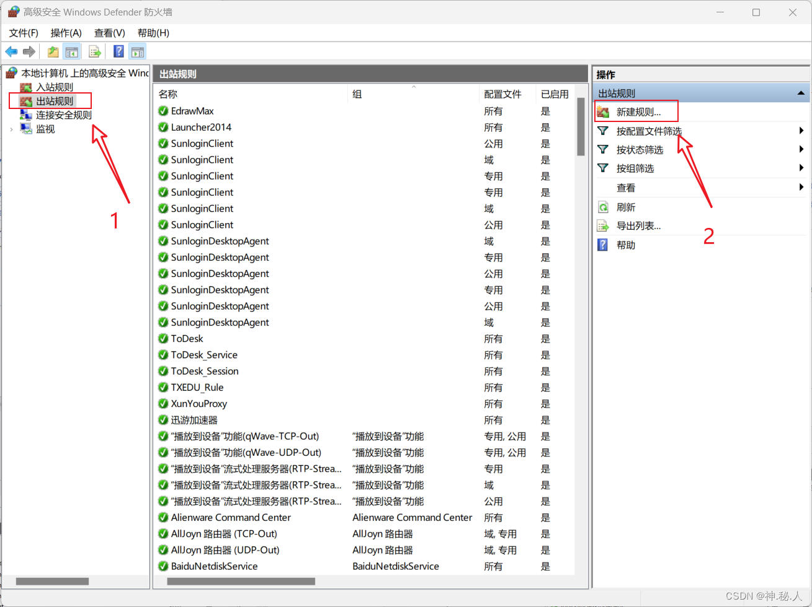

> 本文由 [简悦 SimpRead](http://ksria.com/simpread/) 转码， 原文地址 [blog.csdn.net](https://blog.csdn.net/qq_30054403/article/details/129266119)

# 【操作方法】windows 防火墙添加出入站规则方法

说明

注意：做策略，主要要清楚策略的作用，入站策略主要控制其他主机对本主机的访问权限，出站策略则主要控制本主机对其他主机的访问权限，只有搞清楚到底是谁要访问谁，策略做了才能按照预期目的生效。

注：打开防火墙方法，参阅[【操作方法】windows 开启、关闭防火墙方法](https://blog.csdn.net/qq_30054403/article/details/129266182?spm=1001.2014.3001.5501)

## 一、入站规则

### 1. 打开防火墙，点击 “高级设置”



### 2. 点击 “入站规则” 后点击“新建规则”



出现如下界面，根据需要新建规则即可  


### 3. 例

比如需要被人远程访问共享文件，则需要放通自身的 [445 端口](https://so.csdn.net/so/search?q=445%E7%AB%AF%E5%8F%A3&spm=1001.2101.3001.7020)，就可以按照如下操作

#### 3.1 选择 “端口”



#### 3.2 添加需要放通的端口



#### 3.3 选择操作动作为 “允许连接”



#### 3.4 选择应用区域，此处我选择所有区域



## 二、出站规则

### 1. 点击 “出站规则” 后点击“新建规则”

  
出现如下界面，根据需要新建规则即可  


其他同入站规则

# 命令行开启防火墙

如果是，那么现在，我将为大家介绍一种高逼格的方式：

```
第一步： 打开Windows PowerShell(管理员)
第二步：查看当前防火墙状态：netsh advfirewall show allprofiles
第三步：关闭防火墙：netsh advfirewall set allprofiles state off
第四步：开启防火墙：netsh advfirewall set allprofiles state on
```

