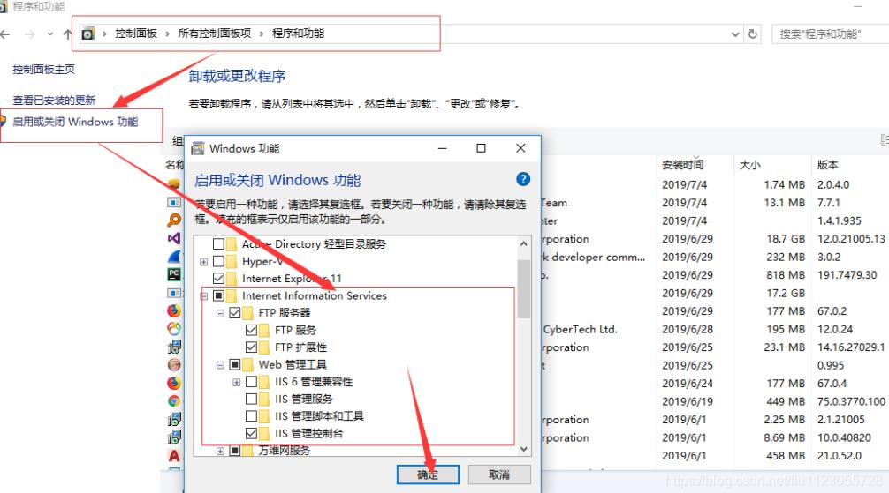
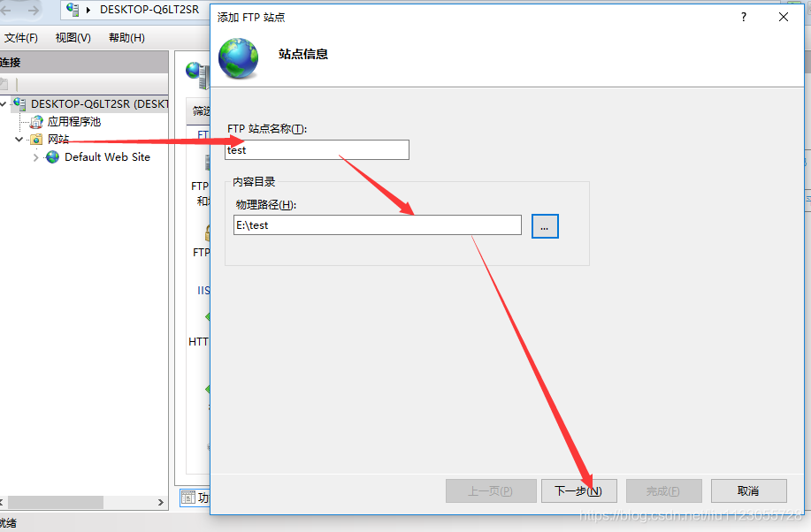
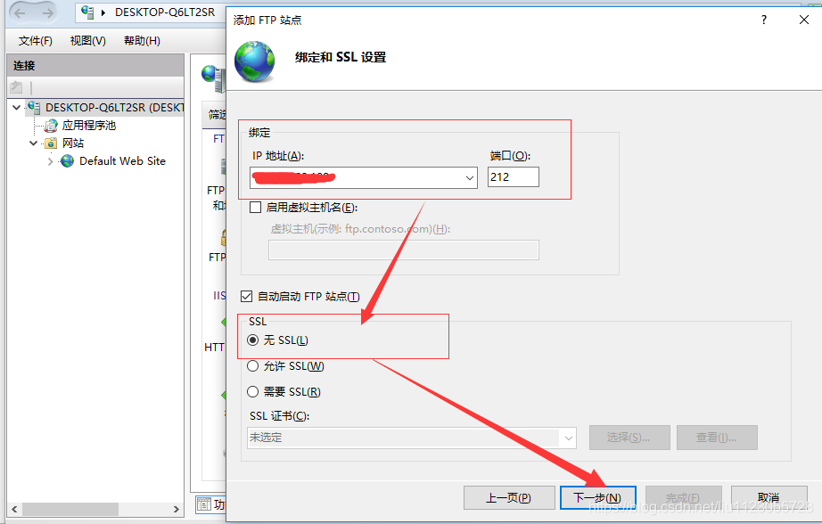
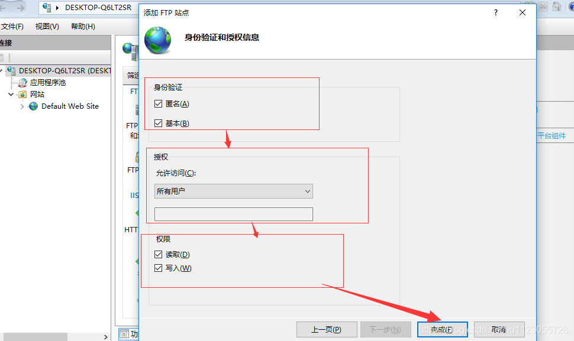
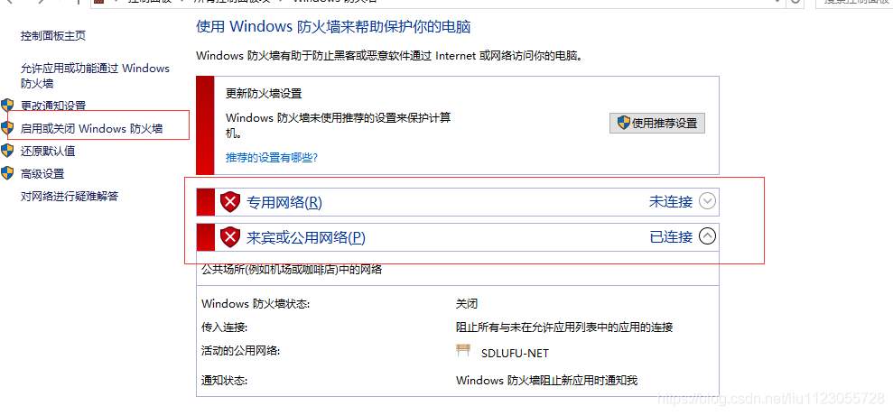
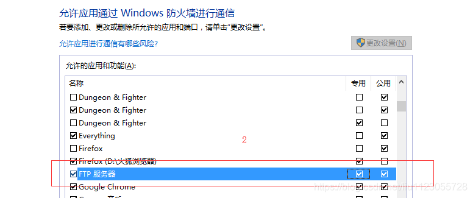

#  一、搭建 FTP 服务器 

 参考博客：https://www.jb51.net/article/259779.htm 

### 1、打开ftp服务

**操作步骤**：

1. 按下`Win + R`组合键，输入`control`并回车，打开控制面板；
2. 点击「程序」→「程序和功能」→「启用或关闭 Windows 功能」；
3. 在弹出的窗口中，展开「Internet Information Services」→「FTP 服务器」，勾选「FTP 服务」和「FTP 扩展性」；同时确保「Web 管理工具」下的「IIS 管理控制台」已勾选（用于后续配置）；
4. 点击「确定」，系统会自动安装相关组件，等待安装完成后无需重启（若提示重启可按需操作




>  补充说明：若勾选后提示组件安装失败，可检查系统更新是否完整，或通过「控制面板→疑难解答→Windows 更新」修复组件依赖问题。 

### 2、 配置 IIS FTP 站点 

**方法：win+R输入inetmgr打开iss管理器** 

> 若提示 “找不到文件”，需确认 IIS 管理控制台已安装）； 

1)、网站—>添加FTP站点…—>站点信息

****

2）、输入IP和端口号，IP就是自己电脑的ip,端口号最好改一下，21端口有可能被占用。



3)、身份验证和授权信息



### 3、关闭防火墙或设置启用防火墙允许ftp通过防火墙

#### 允许ftp通过防火墙

1)、关闭防火墙



2)、启用防火墙允许ftp通过防火墙



FTP 服务需通过防火墙放行，推荐两种方式（二选一）：

#### 方式 1：临时关闭防火墙（仅测试用）

1. 按下`Win + R`，输入`control firewall.cpl`回车，打开「Windows Defender 防火墙」；
2. 点击左侧「关闭 Windows Defender 防火墙」，分别关闭「专用网络设置」和「公用网络设置」；

> 注意：测试完成后务必重新开启防火墙，避免系统安全风险。

#### 方式 2：永久放行 FTP 端口（推荐）

1. 打开防火墙后，点击左侧「高级设置」→「入站规则」→「新建规则」；
2. 规则类型选择「端口」→「下一步」；
3. 选择「TCP」，输入特定本地端口（如 21 或自定义的 2121）→「下一步」；
4. 选择「允许连接」→「下一步」；
5. 勾选「专用」「公用」（按需）→「下一步」；
6. 命名规则（如「FTP 端口 21 放行」），点击「完成」；
7. 重复上述步骤，放行 FTP 被动模式端口段（默认 50000-50099，可在 IIS 中自定义：右键 FTP 站点→「FTP 防火墙支持」→设置「数据通道端口范围」）。


### 4、测试

 在浏览器地址栏输入`ftp://本机IP:端口`（如`ftp://192.168.1.100:21`），若能访问 FTP 文件夹，说明服务正常。 


使用FileZilla FTP Client连接上述的windows ftp服务器，ip地址就是pc电脑的ip，端口21，匿名连接即可。

到此，一个不需要输入验证就可以登录的FTP已经搭建完成。

\--

本文转自 <https://www.cnblogs.com/tenWood/p/18397133>，如有侵权，请联系删除。


#  二、设置 FTP 服务开机自动启动 

在 Windows 系统中，若要让 FTP 相关服务实现开机自动启动，可按照以下步骤操作（适配你搭建 FTP 的环境）：

### 方法 1：通过服务管理器设置（推荐）

1. 按下 `Win + R`，输入 `services.msc` 并回车，打开「服务」面板；

2. 在服务列表中，找到以下核心 FTP 相关服务（根据你搭建的 FTP 类型选择）：

   - 若为 IIS 搭建的 FTP：找到「Microsoft FTP Service」（ （服务名：FTPSVC） ；
   - 若涉及基础网络服务：可检查「World Wide Web Publishing Service」（IIS 核心服务）、「Server」（服务器服务）；

   > 通过`sc query | findstr FTP`查询名称

3. 双击该服务，在弹出的属性窗口中：

   - 「启动类型」下拉框选择「自动」（若需延迟启动，可选「自动（延迟启动）」）；
   - 若服务当前未运行，点击「启动」按钮，再点击「确定」保存设置；

   

4. 重复上述步骤，确保所有 FTP 依赖的服务（如 IIS Admin Service）均设为「自动」启动。

### 方法 2：通过任务计划程序设置

若需更精细的开机启动控制（如指定启动账户、延迟启动），可通过任务计划程序配置：

1. 按下 `Win + R`，输入 `taskschd.msc` 并回车，打开「任务计划程序」；

2. 点击右侧「创建基本任务」，按向导提示：

   - 名称：自定义（如「FTP 开机启动」），描述可选；

   - 触发器：选择「当计算机启动时」；

   - 操作：选择「启动程序」；

   - 程序 / 脚本：输入 

     ```
     net start
     ```

      后接服务名（如 

     ```
     net start Microsoft FTP Service
     ```

     ，FTPSVC 是 FTP Publishing Service 的服务名）；

     

     （可通过 

     ```
     sc query | findstr FTP
     ```

      命令查询 FTP 服务的准确服务名）

   - 完成向导，勾选「当单击完成时，打开此任务的属性对话框」，确认「运行用户」为管理员权限，「不管用户是否登录都要运行」；

   

3. 在任务属性中，切换到「条件」选项卡，取消勾选「唤醒计算机运行此任务」（按需），「设置」选项卡可调整延迟启动时间。

### 方法 3：通过注册表（进阶，谨慎操作）

1. 按下 `Win + R`，输入 `regedit` 回车，打开注册表编辑器；

2. 定位到开机启动项路径：

   ```
   HKEY_LOCAL_MACHINE\SOFTWARE\Microsoft\Windows\CurrentVersion\Run
   ```
   
3. 右键空白处→「新建」→「字符串值」，命名为「FTPStart」；

4. 双击该值，「数值数据」输入服务启动命令（如 `cmd /c net start FTPSVC`），点击确定；

   
   
   ✨ 注意：注册表修改有误可能导致系统异常，操作前建议备份注册表。

### 验证是否生效

设置完成后，可重启电脑，然后通过以下方式验证：

- 再次打开 `services.msc`，检查 FTP 相关服务是否为「正在运行」状态；
- 用 FileZilla 等工具尝试连接 FTP 服务器，确认服务正常启动。

### 补充说明

- 若搭建的是第三方 FTP 软件（如 FileZilla Server），可直接在软件设置中找到「开机自动启动」选项（通常在软件的「设置」→「通用」/「服务」板块）；
- 确保操作账户拥有管理员权限，否则可能无法修改服务启动类型。

# 三、常见问题排查

1. **FTP 连接失败**：

   - 检查 IP 和端口是否正确：确保客户端连接的 IP 是本机对外 IP，端口已放行；
   - 检查服务状态：通过`services.msc`确认 Microsoft FTP Service 已运行；
   - 检查物理路径权限：确保 FTP 文件夹给「Everyone」分配了读写权限（测试用，生产环境需限制）。

   

2. **开机自启失效**：

   - 检查服务启动类型：确认「启动类型」为「自动」，而非「手动」或「禁用」；
   - 检查账户权限：修改服务属性→「登录」选项卡，确认登录账户为「本地系统账户」或有管理员权限的账户；
   - 查看事件日志：「控制面板→管理工具→事件查看器」→「Windows 日志→系统」，筛选「来源」为「Service Control Manager」，查看服务启动失败的原因。

   

3. **被动模式无法上传 / 下载**：

   - 在 IIS 管理器中，右键 FTP 站点→「FTP 防火墙支持」，填写「外部 IP 地址」（本机公网 IP），并设置「数据通道端口范围」（如 50000-50099）；
   - 在防火墙中放行该端口段（参考防火墙配置步骤）。

   

# 四、进阶优化（可选）

1. 配置 FTP SSL 加密：

   - 申请 SSL 证书（自签名或 CA 证书），在 IIS 管理器中绑定到 FTP 站点；
   - 右键 FTP 站点→「FTP SSL 设置」，选择「允许 SSL 连接」或「要求 SSL 连接」，提升传输安全性。

   

2. 限制 FTP 并发连接数：

   - 右键 FTP 站点→「高级设置」，修改「最大连接数」「连接超时时间」，避免服务器资源耗尽。

   

3. 日志监控：

   - 开启 FTP 日志：右键 FTP 站点→「FTP 站点日志」，设置日志保存路径，可通过日志排查访问异常。