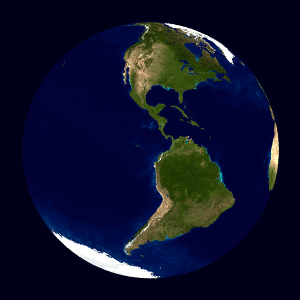

日期 / 时间的处理是平时开发中非常常见的场景，若只是简单的格式化场景那就还好，一旦涉及到时区、跨地域跨时区时间转换场景，甚至当还有 GMT 时间、UTC 时间等一堆概念堆上来的时候，总是心理发虚，招架不住。

在地球村的信息化时代背景下，跨国企业 / 跨国做生意的公司越来越多，所以我们程序员遇到不同时区之间的日期 / 时间转换 / 显示的概率大大增加。譬如说：电商平台的商品下单时间，你给中国人页面里展示北京时间是 ok 的，但你总不能给美国人也展示北京时间吧？否则美国人看到很多订单的下单时间是凌晨 1、2 点，还以为午夜凶铃呢。

Java 在版本 8 之前用 Date 类型来表示日期 / 时间，自版本 8 起引入了 JSR 310 日期 / 时间类型。两套体系对于本地时间、时区时间、带时区的格式化都有着不同的处理办法。

A 哥因为跨时区日期转换问题，最近搞了一起**生产事故**，为此我痛定思痛，决定把经验整理成文，目的是以后再也不踩这方面的坑，同时也帮助大家。

本部分一共会分两篇文章叙述：

1.  概念篇：科普 GMT、UTC、时区、时间戳、夏令时等常见概念以及背景
    
2.  实战篇：在 1 的基础上（概念必须先知晓，否则实战无法进行），Java 是如何来处理 GMT/UTC 时间、时区、偏移量、夏令时... 的
    

这两篇文章搞完，自己再也不用不担心在日期 / 时间方面埋 bug 了。**相信我，这两篇文章十分具有收藏价值**。

本文提纲
----

版本约定
----

*   JDK：8
    

✍正文
===

下面将围绕一些日期 / 时间的概念分别做主题讲解，这些名词你无一例外的都听过，但我猜测大概率你并不理解，甚至是知晓它们的区别。

GMT：格林威治时间
----------

格林威治（也称：格林尼治）时间，也叫世界时（Universal Time），也叫世界标准时间。是指位于**英国伦敦**郊区的【皇家格林尼治天文台】的标准时间，是本初子午线上的地方时，是 **0 时区**的区时。

众所周知，天朝统一用的北京时间是位于东八区（+8）与标准时间相差 8 小时。什么含义？举个例子：若 GMT（英国伦敦的格林威治）现在是上午 11 点，那中国北京时间现在就是 11 + 8 = 19 点（下午 7 点）。

将这个公式再抽象一下，可表示为：本地时间 = GMT＋时区差

北京位于东八区，则时区差 N=+8，美国纽约位于西五区，则时区差 N=-5。这么算来，若北京时间是晚上 23 点的话，美国纽约时间就是**当天**上午 10 点（23 - 8 - 5 = 10）

### 凭什么格林威治作为标准时间？

你可能会问，大家都有腰间盘，为何格林威治的那么突出呢？

大背景是这样子的：19 世纪开始，世界各国来往开始频繁，而欧洲大陆、美洲大陆和亚洲大陆都有各自的时区，为提高沟通效率避免混乱，各国的代表 1884 年在美国华盛顿召开了国际大会，选出英国伦敦的格林威治作为全球时间的**中心点**，并由它负责维护和计算，从 1924 年开始，格林威治天文台每小时就会向全世界播报时间（截止到 1979 年）。

> ❝
> 
> 在美国华盛顿开会，确定英国伦敦作为时间中心点，还蛮滑稽 O(∩_∩)O 哈哈~
> 
> ❞

其实选择英国格林威治最主要原因是：当时大部分的船只都**已经**以格林威治子午线做为参考标准，毕竟曾经的英国可是日不落帝国，大航海时代末便开始称霸世界，拳头里面出政权。

格林威治天文台在计时领域的权威是非常大的，譬如离我们最近的一次 “时间风波”：在即将跨世纪的时候，世界各国对 21 世纪到底应该从 2000 年开始还是从 2001 年开始争论不休，最终还是格林威治天文台出面平息了争论，开新闻发布会宣布 **21 世纪始于 2001 年**。

### 地球自转

地球绕自转轴**自西向东**的转动（太阳东起西落），所以东时区的人会比西时区的人**早**一些看到太阳，从而时间上会早一点。

以本初子午线为中心，按照地球自转方向，每隔经度 15° 划分一个时区的方法，全球共分为 24 个时区：东 1 区至东 12 区，西 1 区至西 12 区，其中东西 12 区跨度都是 7.5° 也叫半时区。

### 中国有哪几个时区？

1 个，这是一个错得比较合理的答案。合理是因为中国虽然幅员辽阔，但全国使用统一的北京时间，所以很容易被误以为只有一个时区。

错是因为拍脑袋想一想就知道，中国东西横跨 5000 + 公里，怎么可能只躺在一个时区呢？正确答案是：中国大陆共横跨 **5** 个时区，各个时区大致的方位图如下：

看图就清晰明了的知道天朝为何选用东八区时间作为全国标准时间了吧？没错，仅就因为北京在东八区，即使地图上只有弹丸大小，但就是这么豪横。

中国用统一时间在沟通上确实方便得多，减少了很多不必要的麻烦。但是也带来一些 “小问题”，比如新疆的朋友（位于东 5/6 区）实际比东八区的北京时间**晚了** 2-3 个小时，我们正常 7 点天黑准备吃完饭的时候，新疆那边还太阳当空照呢，还蛮有意思的~

#### 美国有哪几个时区？

说到时区，就不得不提及计划再次伟大的美国了。美国同样的幅员辽阔，横跨了 4 个时区：

如图所示共有四个时区时间，按照图中颜色划分开（并非严格划分，不然出现同一小区隔壁时间比你晚 1 小时就尴尬了），从右到左依次为：

1.  **东部时区（ET）**：西 5 区，代表城市：华盛顿特区、纽约、迈阿密等，也称纽约时间。北京时间 = ET + 13h
    
2.  **中部时区（CT）**：西 6 区，代表城市：芝加哥、休斯顿等。北京时间 = CT + 14h
    
3.  **山地时区（MT）**：西 7 区，代表城市：丹佛、凤凰城等。北京时间 = MT + 15h
    
4.  **太平洋时区（PST）**：西 8 区，代表城市：洛杉矶、拉斯维加斯、西雅图等。北京时间 = ET + 16h
    

### GMT 和 Http 协议的渊源

这是我 “偶遇” 的一个知识点，在这里也一并分享给你。

Http 1.1 协议对日期时间传输格式是有严格规定的，支持如下三种格式：

其中第一种格式是互联网传输的**标准格式**，也是现行的标准。2、3 种纯是为了兼容 Http 1.0 而设计，现在基本已经淘汰没人再会使用，所以事实上的格式只有第一种这 1 种，作为一个有经验的程序员对这种格式应该不陌生。

另外，还有个关键的知识点：所有 HTTP 日期 / 时间戳都必须用格林威治标准时间 (GMT) 表示，**没有例外**。对于 HTTP 来说，GMT 完全等于 UTC(协调世界时)。

> ❝
> 
> 当然喽，这一切都是由浏览器自动帮你完成的，毕竟 Http 协议是浏览器去搞的不是
> 
> ❞

UTC：世界标准时间
----------

Coordinated Universal Time 直译为：世界协调时间。它是以**原子时**作为计量单位的时间，计算结果极其严谨和精密。它比 GMT 时间更来得精准，误差值必须保持在 0.9 秒以内，倘若大于 0.9 秒就会通过**闰秒**来 “解决”。

原子时：物质的原子内部发射的电磁振荡频率为基准的时间计量系统。美国的物理实验市在 2014 年造出了人类历史上最精确的原子钟，**50 亿年误差 1s**，可谓相当靠谱了。中国的铯原子钟也能确保 2000 万年误差不超过 1s。

大事记：1979 年 12 月初内瓦举行的世界无线电行政大会通过决议，确定用 “世界协调时间（UTC 时间）” 取代“格林威治时间（GMT 时间）”，作为无线电通信领域内的**国际标准**时间。

### UTC 和 GMT 的区别

UTC 和 GMT 都称作世界标准时间，为毛有了 GMT 还搞出个 UTC，到底有何区别，下面做出简述。

**GMT**：老的时间计量标准，根据地球的自转和公转来计算时间的，自转一圈是一天，公转一圈是一年。但是呢，地球公转的轨道是椭圆形的：

并且后来人们发现地球的自转时间也并不是恒定的，这么一来就会造成有一天时间长一些，有一天时间短一些的情况，误差较大给人感觉时间不那么 “精准” 了，因此迫切需要一个更加精准的方案来计时，UTC 诞生了。

**UTC**：1967 年人类制作出原子钟，从而 “发明” 了 UTC 时间正式投入使用。它是真正意义上的标准时间，以原子钟所定义的秒长为基础，UTC 时间认为一个太阳日（一天）总是恒定的 86400 秒（24 小时）。

UTC 是协调时间，含义为：**一切以我为基准，全部想我看齐**。所以称它为世界标准时间是没毛病的，而把 GMT 称作格林威治当地时间更为合适（也叫旧的标准时间）。

### UTC 和 GMT 的联系

由于在大多数情况下，UTC 时间能与 GMT 时间互换。对此很多同学就丈二和尚摸不着头脑了，他俩这不就一样的吗？

其实非也。这里用通俗易懂的一句话来告知它俩的联系：UTC 是标准时间参照，像 GMT（格林威治时间）、ET（美国东部时间）、PST（太平洋时间）、CST（北京时间）等等都是**具体**的时区时间。GMT 能和 UTC 直接转换，仅仅是因为碰巧 GMT 是 0 时区时间，数值上刚好和 UTC 是相等的（不需要精确到秒的情况下，二者可以视为相等），看起来一样，但是概念含义上请务必区分开来哈。

### UTC 与偏移量

在日常生活中，我们所使用的时间肯定是**本地时间**。在只有 GMT 的时候，本地时间是通过时区计算出来的，而现在 UTC 才是标准参考，因此采用 UTC 和偏移量（Offset）的方式来表示本地时间：

这个偏移量可表示为：`UTC -`或`UTC +`，后面接`小时数,分钟数`。如：UTC +9:30 表示澳大利亚中央标准时间，UTC +8 表示中国标准时间。偏移量常见的表示形式有：`±[hh]:[mm]`、`±[hh][mm]`、`±[hh]`这三种方式均可。

举个例子：现在 UTC 时间是`10:30z`（z 表示偏移量 = 0），那么北京时间现在若是`1630 +0800`（下午 4 点半），对应的纽约时间就是`0530 -0500`（早上 5 点半）。

> ❝
> 
> 注意：在 UTC 的世界里并无时区的概念，而是偏移量（时间点跟上偏移量才是一个正规的 UTC 时间），它和时区并无直接关系
> 
> ❞

可以看到偏移量可以精确到分钟级别控制，非常精细化。全球只有 24 个时区（只能精确到小时），但偏移量有 “无数个”。当然喽为了方便沟通，时间日期联盟组织把世界主要国家 / 城市的偏移量汇总起来且都给取了个`Time zone name`名称用于沟通，共好几百个，部分截图如下：

偏移量和国家 / 城市名称的全部对应关系，请参考网址（直接访问，无需梯子）：https://www.timeanddate.com/time/zones

CST
---

CST 这个缩写比较尴尬的是它可以同时代表四个不同的时间：

*   CST (China Standard Time) ：中国标准时间 UTC+8:00
    
*   Central Standard Time (USA) UTC-6:00
    
*   Central Standard Time (Australia) UTC+9:30
    
*   Cuba Standard Time UTC-4:00
    

CST 到底啥意思就看如何翻译喽，所以需要根据上下文语境自行抉择哈。

ISO
---

在时间日期上它全称是 ISO 8601，是一种日期 / 时间表示方法的规范。规定了一种明确的、国际上都能理解的日历和时钟格式。

这一 ISO 标准有助于消除各种日 - 日惯例、文化和时区对全球业务产生的影响。它提供了一种显示日期和时间的方式，这种方式是明确定义的，对人和机器都是可以理解的。当日期用数字表示时，它们可以以不同的方式进行解释。例如，01/05/12 可以表示 2012 年 1 月 5 日或 2012 年 5 月 1 日。在个人层面上，这种不确定性可能非常令人沮丧，在商业环境中，它可能非常昂贵。在日期不明确的情况下，组织会议和交付、书写合同和购买机票都是非常困难的。

ISO 8601 通过制定一种国际公认的日期表示方式来解决这种不确定性：`YYYY-MM-DD`。例如 September 27, 2012 就会被表示为 2012-09-27。

很多开发语言内置了一些常用的 ISO 标准日期 / 时间格式，如 Java 中的：

*   **ISO.DATE**：yyyy-MM-dd, e.g. "2000-10-31"
    
*   **ISO.TIME**：HH:mm:ss.SSSXXX, e.g. "01:30:00.000-05:00"
    
*   **ISO.DATE_TIME**：yyyy-MM-dd'T'HH:mm:ss.SSSXXX, e.g. "2000-10-31T01:30:00.000-05:00".
    

夏令时
---

DST（Daylight Saving Time），夏令时又称夏季时间（可没有冬令时哦）。它是为节约能源而**人为规定**地方时间的制度（鼓励人们早睡早起，不要浪费电，夏天日照时间长尽量多用自然资源），全球约 40% 的国家在夏季使用夏令时，其他国家则全年只使用标准时间。正在使用夏令时的代表国家：美国、欧盟、俄罗斯等等。

每年的夏令时时间段还不一样（一般在 3 月的第 2 个周日开始），比如美国 2020 年夏令时时间是：2020 年 3 月 8 日 - 2020 年 11 月 1 日。具体做法是：在 3.8 号这天将时钟往前拨拨 1 个小时，11.1 号这天还原回来。

> ❝
> 
> 中国在 1986 - 1992 年短暂搞过一段时间，但太麻烦就 “废弃” 了
> 
> ❞

大事记：目前全世界有近 110 个国家每年要实行夏令时。自 2011 年 3 月 27 日开始俄罗斯**永久使用**夏令时，把时间拨快一小时，不再调回。

时间戳
---

时间戳一般指的 UNIX 时间，或类 UNIX 系统（比如 Linux、MacOS 等）使用的时间表示方式。定义为：从 UTC 时间的`1970-1-1 0:0:0`起到现在的总秒数（秒是毫秒、微妙、纳秒的总称）。

但是不可忽略的一个 case：由于闰秒的存在，那么当闰秒发生时，就极有可能出现同一个时间戳表示两个时刻的情况（类似时钟回拨），而且闰秒还没规律所以无法程序式的避免，怎么破？

这个时候就需要一种专门的对时协议来保证了，它就是：网络时间协议。

### 网络时间协议

网络时间协议 Network Time Protocol（NTP）是用来使计算机时间同步化的一种协议，它可以使计算机对其服务器或时钟源（如石英钟，GPS 等等) 做同步化，它可以提供**高精准度**的时间校正（LAN 上与标准间差小于 1 毫秒，WAN 上几十毫秒），且可介由加密确认的方式来防止恶毒的协议攻击。

NTP 的目的是在无序的 Internet 环境中提供精确和健壮的时间服务，各大操作系统（windows/Linux）对 NTP 都有实现。

✍总结
===

简单地讲呢，GMT 格林威治时间可认为是以前的标准时间，而 UTC 时间是现在在使用的世界时间标准；时区是以本初子午线为中心来划分的，东为正西为负，本处子午线就位于英国伦敦的格林威治；夏令时是地方的时间制度（并非全球标准），施行夏令时的地方，每年有 2 天很特殊，即一天只有 23 个小时，另一天则有 25 个小时。

从源头上彻底了解了这些概念，将会让我们在处理与时间相关的问题时如虎添翼。本文介绍了好些个日期 / 时间方面的概念，文字偏多，所以建议你收藏起来当作参考书来使用。

下篇文章将会接着本文内容，站在实战的角度，介绍 Java 是如何实现 GMT 和 UTC 时间的，以及各种 case 下的使用和避坑指南，欢迎关注我。

♨本文思考题♨
-------

看完了不一定懂，看懂了不一定会。来，文末 3 个思考题帮你复盘：

1.  中国是南半球还是北半球？东半球还是西半球？
    
2.  GMT 时间和 UTC 时间有何区别和联系？
    
3.  中国有夏令时没？
    

☀推荐阅读☀
------

*   ......
    
*   [**7. JDK 拍了拍你：字符串拼接一定记得用 MessageFormat#format**](https://mp.weixin.qq.com/s?__biz=MzI0MTUwOTgyOQ==&mid=2247491315&idx=1&sn=e31b557e3c637578d343a86580a72e07&scene=21#wechat_redirect)
    
*   [**8. 格式化器大一统 -- Spring 的 Formatter 抽象**](https://mp.weixin.qq.com/s?__biz=MzI0MTUwOTgyOQ==&mid=2247491457&idx=1&sn=dc16a2b7f069df4b0329e66365efd980&scene=21#wechat_redirect)
    
*   [**9. 细节见真章，Formatter 注册中心的设计很讨巧**](https://mp.weixin.qq.com/s?__biz=MzI0MTUwOTgyOQ==&mid=2247491641&idx=1&sn=794c1fadf5d5144df83079a549d3b15f&scene=21#wechat_redirect)
    
*   ......
    

