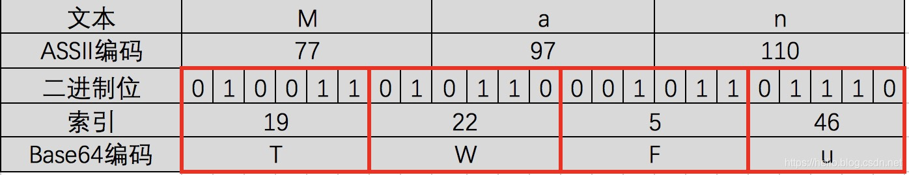
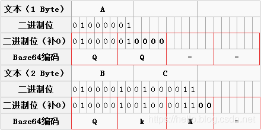

> 本文由 [简悦 SimpRead](http://ksria.com/simpread/) 转码， 原文地址 [blog.csdn.net](https://blog.csdn.net/wo541075754/article/details/81734770?app_version=5.8.0&csdn_share_tail=%7B%22type%22%3A%22blog%22%2C%22rType%22%3A%22article%22%2C%22rId%22%3A%2281734770%22%2C%22source%22%3A%22qq_35024768%22%7D&utm_source=app)

> 在互联网中的每一刻，你可能都在享受着 [Base64](https://so.csdn.net/so/search?q=Base64&spm=1001.2101.3001.7020) 带来的便捷，但对于 Base64 的基础原理又了解多少？今天这篇博文带领大家了解一下 Base64 的底层实现。

Base64 的由来
----------

目前 Base64 已经成为网络上常见的传输 8Bit 字节代码的编码方式之一。在做支付系统时，系统之间的报文交互都需要使用 Base64 对明文进行转码，然后再进行签名或[加密](https://so.csdn.net/so/search?q=%E5%8A%A0%E5%AF%86&spm=1001.2101.3001.7020)，之后再进行（或再次 Base64）传输。那么，Base64 到底起到什么作用呢？

在参数传输的过程中经常遇到的一种情况：使用全英文的没问题，但一旦涉及到中文就会出现乱码情况。与此类似，网络上传输的字符并不全是可打印的字符，比如二进制文件、图片等。Base64 的出现就是为了解决此问题，它是基于 64 个可打印的字符来表示二进制的数据的一种方法。

电子邮件刚问世的时候，只能传输英文，但后来随着用户的增加，中文、日文等文字的用户也有需求，但这些字符并不能被服务器或网关有效处理，因此 Base64 就登场了。随之，Base64 在 URL、Cookie、网页传输少量二进制文件中也有相应的使用。

Base64 的编码原理
------------

Base64 的原理比较简单，每当我们使用 Base64 时都会先定义一个类似这样的数组：

```
['A', 'B', 'C', ... 'a', 'b', 'c', ... '0', '1', ... '+', '/']
```

上面就是 Base64 的索引表，字符选用了 "A-Z、a-z、0-9、+、/" 64 个可打印字符，这是标准的 Base64 协议规定。在日常使用中我们还会看到 “=” 或“==”号出现在 Base64 的编码结果中，“=”在此是作为填充字符出现，后面会讲到。

### 具体转换步骤

*   第一步，将待转换的字符串每三个字节分为一组，每个字节占 8bit，那么共有 24 个二进制位。
*   第二步，将上面的 24 个二进制位每 6 个一组，共分为 4 组。
*   第三步，在每组前面添加两个 0，每组由 6 个变为 8 个二进制位，总共 32 个二进制位，即四个字节。
*   第四步，根据 Base64 编码对照表（见下图）获得对应的值。`0b111111=63`

```
0　A　　17　R　　　34　i　　　51　z
1　B　　18　S　　　35　j　　　52　0
2　C　　19　T　　　36　k　　　53　1
3　D　　20　U　　　37　l　　　54　2
4　E　　21　V　　　38　m　　　55　3
5　F　　22　W　　　39　n　　　56　4
6　G　　23　X　　　40　o　　　57　5
7　H　　24　Y　　　41　p　　　58　6
8　I　　25　Z　　　42　q　　　59　7
9　J　　26　a　　　43　r　　　60　8
10　K　　27　b　　　44　s　　　61　9
11　L　　28　c　　　45　t　　　62　+
12　M　　29　d　　　46　u　　　63　/
13　N　　30　e　　　47　v
14　O　　31　f　　　48　w　　　
15　P　　32　g　　　49　x
16　Q　　33　h　　　50　y
```

从上面的步骤我们发现：

*   Base64 字符表中的字符原本用 6 个 bit 就可以表示，现在前面添加 2 个 0，变为 8 个 bit，会造成一定的浪费。因此，Base64 编码之后的文本，要比原文大约三分之一。
*   为什么使用 3 个字节一组呢？因为 6 和 8 的最小公倍数为 24，三个字节正好 24 个二进制位，每 6 个 bit 位一组，恰好能够分为 4 组。

### 示例说明

以下图的表格为示例，我们具体分析一下整个过程。



*   第一步：“M”、“a”、"n" 对应的 ASCII 码值分别为 77，97，110，对应的二进制值是 01001101、01100001、01101110。如图第二三行所示，由此组成一个 24 位的二进制字符串。
*   第二步：如图红色框，将 24 位每 6 位二进制位一组分成四组。
*   第三步：在上面每一组前面补两个 0，扩展成 32 个二进制位，此时变为四个字节：00010011、00010110、00000101、00101110。分别对应的值（Base64 编码索引）为：19、22、5、46。
*   第四步：用上面的值在 Base64 编码表中进行查找，分别对应：T、W、F、u。因此 “Man”Base64 编码之后就变为：TWFu。

### 位数不足情况

上面是按照三个字节来举例说明的，如果字节数不足三个，那么该如何处理？



*   两个字节：两个字节共 16 个二进制位，依旧按照规则进行分组。此时总共 16 个二进制位，每 6 个一组，则第三组缺少 2 位，用 0 补齐，得到三个 Base64 编码，第四组完全没有数据则用 “=” 补上。因此，上图中 “BC” 转换之后为“QKM=”；
*   一个字节：一个字节共 8 个二进制位，依旧按照规则进行分组。此时共 8 个二进制位，每 6 个一组，则第二组缺少 4 位，用 0 补齐，得到两个 Base64 编码，而后面两组没有对应数据，都用 “=” 补上。因此，上图中 “A” 转换之后为“QQ==”；

### 注意事项

*   大多数编码都是由字符串转化成二进制的过程，而 Base64 的编码则是从二进制转换为字符串。与常规恰恰相反，
*   Base64 编码主要用在传输、存储、表示二进制领域，不能算得上加密，只是无法直接看到明文。也可以通过打乱 Base64 编码来进行加密。
*   中文有多种编码（比如：utf-8、gb2312、gbk 等），不同编码对应 Base64 编码结果都不一样。

延伸
--

上面我们已经看到了 Base64 就是用 6 位（2 的 6 次幂就是 64）表示字符，因此成为 Base64。同理，Base32 就是用 5 位，Base16 就是用 4 位。大家可以按照上面的步骤进行演化一下。

Java 验证
-------

最后，我们用一段 Java 代码来验证一下上面的转换结果：

```java
import sun.misc.BASE64Encoder;


public class Base64Utils {

	public static void main(String[] args) {
		String man = "Man";
		String a = "A";
		String bc = "BC";

		BASE64Encoder encoder = new BASE64Encoder();
		System.out.println("Man base64结果为：" + encoder.encode(man.getBytes()));
		System.out.println("BC base64结果为：" + encoder.encode(bc.getBytes()));
		System.out.println("A base64结果为：" + encoder.encode(a.getBytes()));
	}
}
```

打印结果为：

```java
Man base64结果为：TWFu
BC base64结果为：QkM=
A base64结果为：QQ==
```

以上结果与我们分析所得完全一致。


## 核心源码

```java

        private int encode0(byte[] src, int off, int end, byte[] dst) {
            char[] base64 = isURL ? toBase64URL : toBase64;
            int sp = off;
            int slen = (end - off) / 3 * 3;
            int sl = off + slen;
            if (linemax > 0 && slen  > linemax / 4 * 3)
                slen = linemax / 4 * 3;
            int dp = 0;
            while (sp < sl) {
                int sl0 = Math.min(sp + slen, sl);
                for (int sp0 = sp, dp0 = dp ; sp0 < sl0; ) {
                    //拼接三个字节
                    int bits = (src[sp0++] & 0xff) << 16 |
                               (src[sp0++] & 0xff) <<  8 |
                               (src[sp0++] & 0xff);
                    // 6位进行编码
                    dst[dp0++] = (byte)base64[(bits >>> 18) & 0x3f];
                    dst[dp0++] = (byte)base64[(bits >>> 12) & 0x3f];
                    dst[dp0++] = (byte)base64[(bits >>> 6)  & 0x3f];
                    dst[dp0++] = (byte)base64[bits & 0x3f];
                }
                int dlen = (sl0 - sp) / 3 * 4;
                dp += dlen;
                sp = sl0;
                if (dlen == linemax && sp < end) {
                    for (byte b : newline){
                        dst[dp++] = b;
                    }
                }
            }
```

