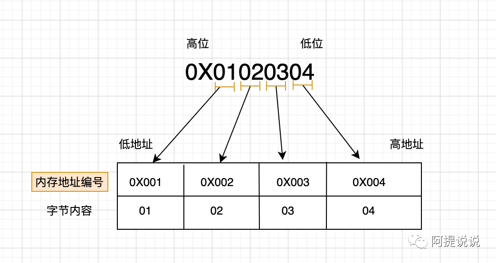
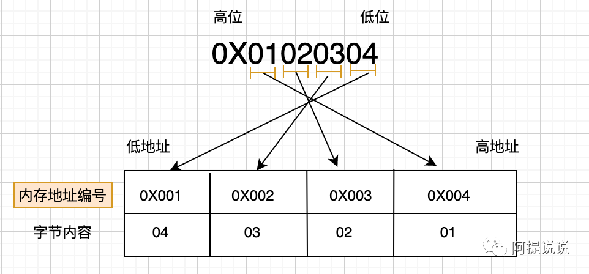

**简介：** 【Java】- 一文了解 Java 中的大端和小端

> Java 整型的字节序是（）
>
> A.Little-Endian（小端）
>
> B.Big-Endian(大端)
>
> C. 由运行程序的 CPU 决定
>
> D. 由编译程序的 CPU 决定

对于大小端，我估计肯定有很多开发人员跟我一样都没听过

由于 Java 是跨平台的，JVM 为我们屏蔽了大量的底层细节和复杂性，导致在平时的时候根本不会接触到。以下是我通过大量咨询，查找整理的结果。

**字节序**：指多字节数据在计算机内存中存储或者网络传输时各字节的存储顺序，有`大端`和`小端`两种方式

**大端**：指高位字节存放在内存的低地址端，低位字节存放在内存的高地址端。十六进制整数`0x01020304`在内存中存储方式，由于一个整型在内存中占 4 个字节，因此被划分成 4 份分别存储在连续的内存地址位中



**小端**：指低位字节放在内存的低地址端，高位字节放在内存的高地址端。同样`0x01020304`在内存中的存储方式为



在计算机中既可以是`大端`存储，也可以`小端`存储，跟 CPU 架构有关，IA 架构 (Intel、AMD) 的 CPU 中是 Little-Endian，而 PowerPC 、SPARC 和 Motorola 处理器是 Big-Endian

`基于Java8`, 在 Java 中提供了一个 api 可以获取 CPU 使用的字节序：

```java
ByteOrder byteOrder = ByteOrder.nativeOrder();
//LITTLE_ENDIAN,CPU是Intel的
System.out.println(byteOrder);
```

通过查看`ByteOrder.nativeOrder()` 源码，其最后调用了`Bits.byteOrder()`

```java
// -- Processor and memory-system properties --
private static final ByteOrder byteOrder;
static ByteOrder byteOrder() {
    if (byteOrder == null)
        throw new Error("Unknown byte order");
    return byteOrder;
}
/**
* 通过返回0x01,还是0x08来判断CPU使用的是BIG_ENDIAN，还是LITTLE_ENDIAN
**/
static {
    long a = unsafe.allocateMemory(8);
    try {
        unsafe.putLong(a, 0x0102030405060708L);
        byte b = unsafe.getByte(a);
        switch (b) {
        case 0x01: byteOrder = ByteOrder.BIG_ENDIAN;     break;
        case 0x08: byteOrder = ByteOrder.LITTLE_ENDIAN;  break;
        default:
            assert false;
            byteOrder = null;
        }
    } finally {
        unsafe.freeMemory(a);
    }
}
```

对于 Java, 其实既有使用大端，也有使用小端，对于 ByteBuffer，默认使用的 Big-Endian（大端），也可以对默认方式进行修改，如下例子

```java
int x = 0x01020304;
ByteBuffer byteBuffer = ByteBuffer.wrap(new byte[4]);
byteBuffer.asIntBuffer().put(x);
String before = Arrays.toString(byteBuffer.array());
System.out.println("默认字节序："+byteBuffer.order().toString() + "," + "内存数据："+before);
byteBuffer.order(ByteOrder.LITTLE_ENDIAN);
byteBuffer.asIntBuffer().put(x);
String after = Arrays.toString(byteBuffer.array());
System.out.println("修改字节序："+byteBuffer.order().toString()+","+"内存数据："+after);
```

```
默认字节序：BIG_ENDIAN,内存数据：[1, 2, 3, 4]
修改字节序：LITTLE_ENDIAN,内存数据：[4, 3, 2, 1]
```

通过查看`ByteBuffer.wrap`，其声明了一个`HeapByteBuffer`

```java
public static ByteBuffer wrap(byte[] array, int offset, int length)
{
      try {
          return new HeapByteBuffer(array, offset, length);
      } catch (IllegalArgumentException x) {
          throw new IndexOutOfBoundsException();
      }
}
```

所以`byteBuffer.asIntBuffer()`实际调用了`HeapByteBuffer`中的方法

```java
public IntBuffer asIntBuffer() {
    int size = this.remaining() >> 2;
    int off = offset + position();
    return (bigEndian
            ? (IntBuffer)(new ByteBufferAsIntBufferB(this,-1,0,size,size,off))
            : (IntBuffer)(new ByteBufferAsIntBufferL(this,-1,0,size,size,off)));
}
```

`bigEndian`表示是否是大端，默认为 true，所以后面 put 的时候实际是往`ByteBufferAsIntBufferB`大端中存储数据，但也可以调整为使用小端来存储数据，`byteBuffer.order(ByteOrder.LITTLE_ENDIAN);`

这题的答案是 B, 但实际却是 Java 中既能有大端也能有小端，只是 Java 默认使用了大端