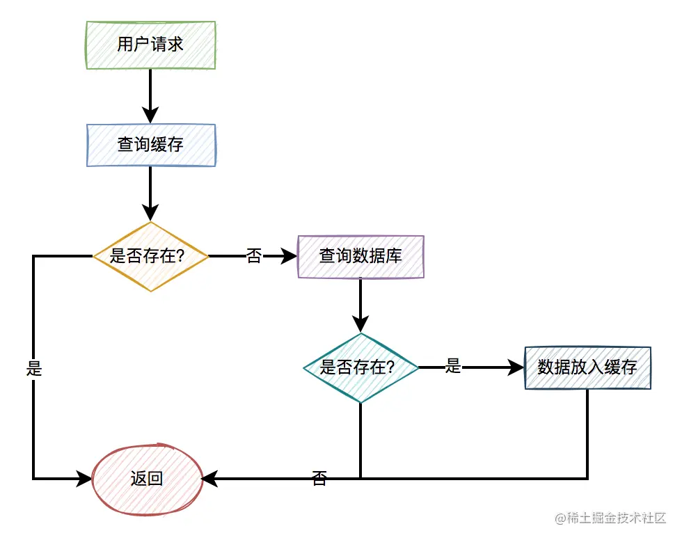
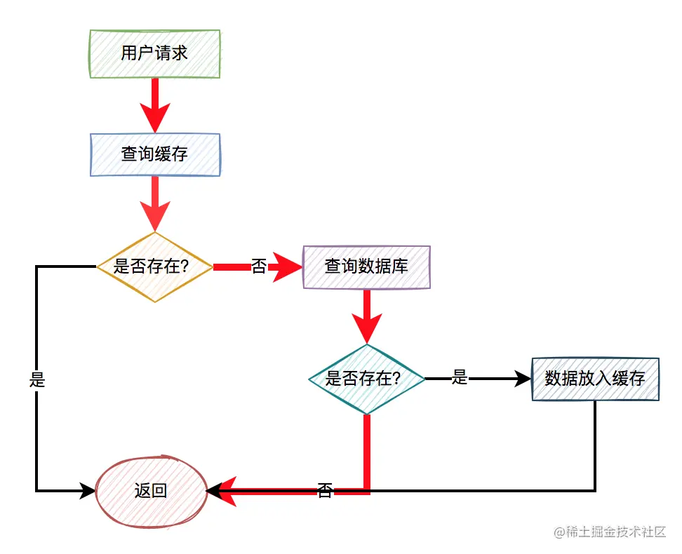
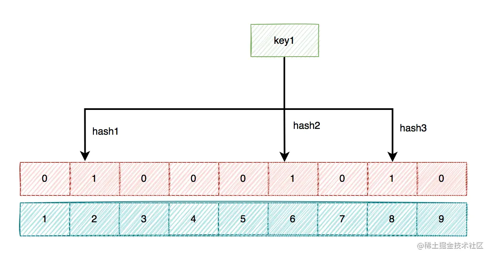
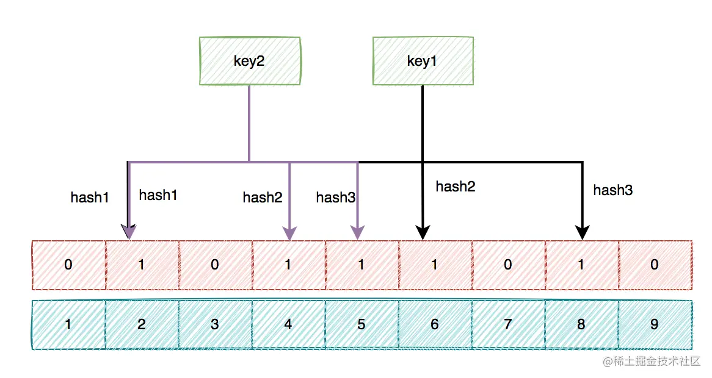
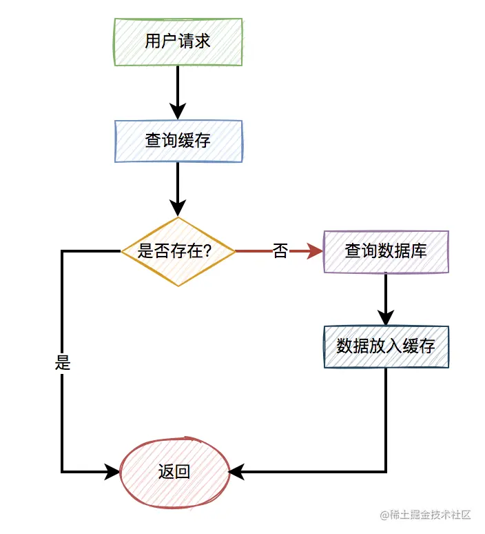
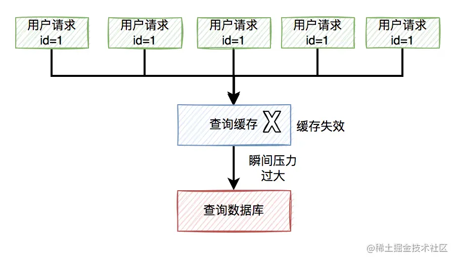
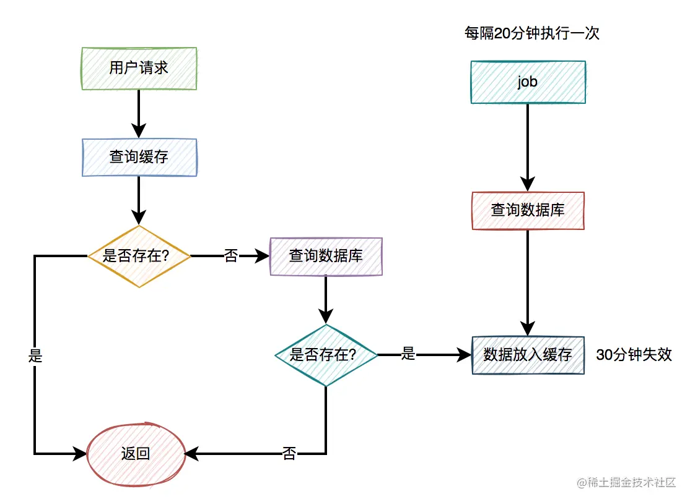
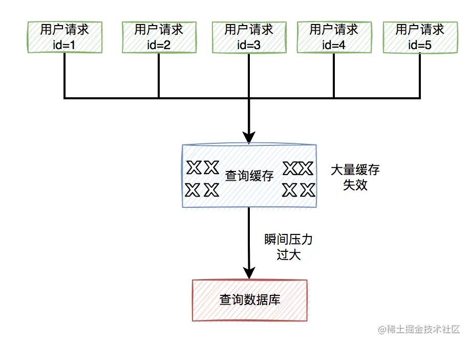
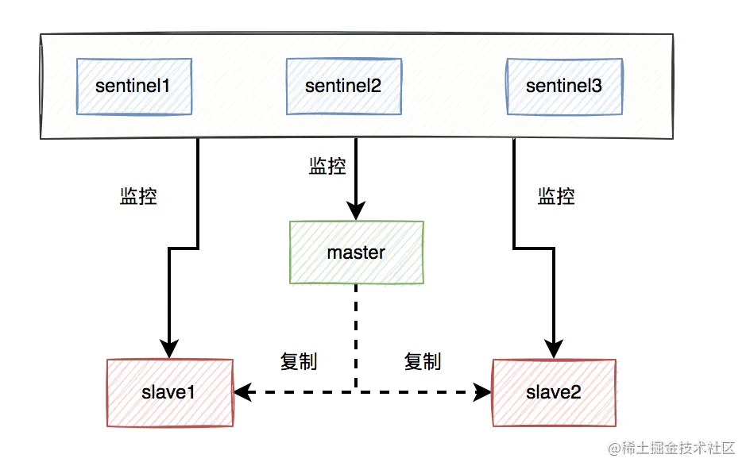
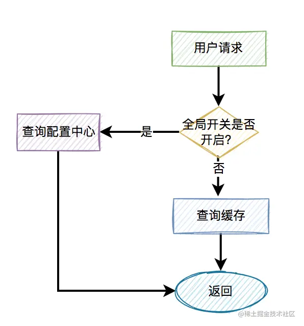

> 本文由 [简悦 SimpRead](http://ksria.com/simpread/) 转码， 原文地址 [juejin.cn](https://juejin.cn/post/7045800214849912869)

前言
--

对于从事后端开发的同学来说，`缓存`已经变成的项目中必不可少的技术之一。

没错，缓存能给我们系统显著的提升性能。但如果你使用不好，或者缺乏相关经验，它也会带来很多意想不到的问题。

今天我们一起聊聊如果在项目中引入了缓存，可能会给我们带来的下面这三大问题。看看你中招了没？

1. 缓存穿透问题
---------

大部分情况下，加缓存的目的是：为了减轻数据库的压力，提升系统的性能。

### 1.1 我们是如何用缓存的？

一般情况下，如果有用户请求过来，先查缓存，如果缓存中存在数据，则直接返回。如果缓存中不存在，则再查数据库，如果数据库中存在，则将数据放入缓存，然后返回。如果数据库中也不存在，则直接返回失败。

流程图如下：  上面的这张图小伙们肯定再熟悉不过了，因为大部分缓存都是这样用的。

最近无意间获得一份 BAT 大厂大佬写的刷题笔记，一下子打通了我的任督二脉，越来越觉得算法没有想象中那么难了。

[BAT 大佬写的刷题笔记，让我 offer 拿到手软](https://link.juejin.cn?target=https%3A%2F%2Fmp.weixin.qq.com%2Fs%3F__biz%3DMzkwNjMwMTgzMQ%3D%3D%26mid%3D2247490336%26idx%3D1%26sn%3D2f9db262746f692136cd6ce7179fc208%26source%3D41%23wechat_redirect%2522 "https://mp.weixin.qq.com/s?__biz=MzkwNjMwMTgzMQ==&mid=2247490336&idx=1&sn=2f9db262746f692136cd6ce7179fc208&source=41#wechat_redirect%22")

### 1.2 什么是缓存穿透？

但如果出现以下这两种特殊情况，比如：

1.  用户请求的 id 在缓存中不存在。
2.  恶意用户伪造不存在的 id 发起请求。

这样的用户请求导致的结果是：每次从缓存中都查不到数据，而需要查询数据库，同时数据库中也没有查到该数据，也没法放入缓存。也就是说，每次这个用户请求过来的时候，都要查询一次数据库。

 图中标红的箭头表示每次走的路线。

很显然，缓存根本没起作用，好像被`穿透`了一样，每次都会去访问数据库。

这就是我们所说的：`缓存穿透问题`。

如果此时穿透了缓存，而直接数据库的请求数量非常多，数据库可能因为扛不住压力而挂掉。呜呜呜。

那么问题来了，如何解决这个问题呢？

### 1.3 校验参数

我们可以对用户 id 做检验。

比如你的合法 id 是 15xxxxxx，以 15 开头的。如果用户传入了 16 开头的 id，比如：16232323，则参数校验失败，直接把相关请求拦截掉。这样可以过滤掉一部分恶意伪造的用户 id。

### 1.4 布隆过滤器

如果数据比较少，我们可以把数据库中的数据，全部放到内存的一个 map 中。

这样能够非常快速的识别，数据在缓存中是否存在。如果存在，则让其访问缓存。如果不存在，则直接拒绝该请求。

但如果数据量太多了，有数千万或者上亿的数据，全都放到内存中，很显然会占用太多的内存空间。

那么，有没有办法减少内存空间呢？

答：这就需要使用`布隆过滤器`了。

布隆过滤器底层使用 bit 数组存储数据，该数组中的元素默认值是 0。

布隆过滤器第一次初始化的时候，会把数据库中所有已存在的 key，经过一些列的 hash 算法（比如：三次 hash 算法）计算，每个 key 都会计算出多个位置，然后把这些位置上的元素值设置成 1。  之后，有用户 key 请求过来的时候，再用相同的 hash 算法计算位置。

*   如果多个位置中的元素值都是 1，则说明该 key 在数据库中已存在。这时允许继续往后面操作。
*   如果有 1 个以上的位置上的元素值是 0，则说明该 key 在数据库中不存在。这时可以拒绝该请求，而直接返回。

使用布隆过滤器确实可以解决缓存穿透问题，但同时也带来了两个问题：

1.  存在误判的情况。
2.  存在数据更新问题。

先看看为什么会存在误判呢？

上面我已经说过，初始化数据时，针对每个 key 都是通过多次 hash 算法，计算出一些位置，然后把这些位置上的元素值设置成 1。

但我们都知道 hash 算法是会出现 hash 冲突的，也就是说不同的 key，可能会计算出相同的位置。  上图中的下标为 2 的位置就出现了 hash 冲突，key1 和 key2 计算出了一个相同的位置。

如果有几千万或者上亿的数据，布隆过滤器中的 hash 冲突会非常明显。

如果某个用户 key，经过多次 hash 计算出的位置，其元素值，恰好都被其他的 key 初始化成了 1。此时，就出现了误判，原本这个 key 在数据库中是不存在的，但布隆过滤器确认为存在。

> 如果布隆过滤器判断出某个 key 存在，可能出现误判。如果判断某个 key 不存在，则它在数据库中一定不存在。

通常情况下，布隆过滤器的误判率还是比较少的。即使有少部分误判的请求，直接访问了数据库，但如果访问量并不大，对数据库影响也不大。

此外，如果想减少误判率，可以适当增加 hash 函数，图中用的 3 次 hash，可以增加到 5 次。

其实，布隆过滤器最致命的问题是：如果数据库中的数据更新了，需要同步更新布隆过滤器。但它跟数据库是两个数据源，就可能存在数据不一致的情况。

比如：数据库中新增了一个用户，该用户数据需要实时同步到布隆过滤。但由于网络异常，同步失败了。  这时刚好该用户请求过来了，由于布隆过滤器没有该 key 的数据，所以直接拒绝了该请求。但这个是正常的用户，也被`拦截`了。

很显然，如果出现了这种正常用户被拦截了情况，有些业务是无法容忍的。所以，布隆过滤器要看实际业务场景再决定是否使用，它帮我们解决了缓存穿透问题，但同时了带来了新的问题。

### 1.5 缓存空值

上面使用布隆过滤器，虽说可以过滤掉很多不存在的用户 id 请求。但它除了增加系统的复杂度之外，会带来两个问题：

1.  布隆过滤器存在误杀的情况，可能会把少部分正常用户的请求也过滤了。
2.  如果用户信息有变化，需要实时同步到布隆过滤器，不然会有问题。

所以，通常情况下，我们很少用布隆过滤器解决缓存穿透问题。其实，还有另外一种更简单的方案，即：`缓存空值`。

当某个用户 id 在缓存中查不到，在数据库中也查不到时，也需要将该用户 id 缓存起来，只不过值是空的。这样后面的请求，再拿相同的用户 id 发起请求时，就能从缓存中获取空数据，直接返回了，而无需再去查一次数据库。

优化之后的流程图如下：  关键点是不管从数据库有没有查到数据，都将结果放入缓存中，只是如果没有查到数据，缓存中的值是空的罢了。

2. 缓存击穿问题
---------

### 2.1 什么是缓存击穿？

有时候，我们在访问热点数据时。比如：我们在某个商城购买某个热门商品。

为了保证访问速度，通常情况下，商城系统会把商品信息放到缓存中。但如果某个时刻，该商品到了过期时间失效了。

此时，如果有大量的用户请求同一个商品，但该商品在缓存中失效了，一下子这些用户请求都直接怼到数据库，可能会造成瞬间数据库压力过大，而直接挂掉。

流程图如下：  那么，如何解决这个问题呢？

### 2.2 加锁

数据库压力过大的根源是，因为同一时刻太多的请求访问了数据库。

如果我们能够限制，同一时刻只有一个请求才能访问某个 productId 的数据库商品信息，不就能解决问题了？

答：没错，我们可以用`加锁`的方式，实现上面的功能。

伪代码如下：

```
try {
  String result = jedis.set(productId, requestId, "NX", "PX", expireTime);
  if ("OK".equals(result)) {
    return queryProductFromDbById(productId);
  }
} finally{
    unlock(productId,requestId);
}  
return null;
复制代码
```

在访问数据库时加锁，防止多个相同 productId 的请求同时访问数据库。

然后，还需要一段代码，把从数据库中查询到的结果，又重新放入缓存中。办法挺多的，在这里我就不展开了。

### 2.3 自动续期

出现缓存击穿问题是由于 key 过期了导致的。那么，我们换一种思路，在 key 快要过期之前，就自动给它续期，不就 OK 了？

答：没错，我们可以用 job 给指定 key 自动续期。

比如说，我们有个分类功能，设置的缓存过期时间是 30 分钟。但有个 job 每隔 20 分钟执行一次，自动更新缓存，重新设置过期时间为 30 分钟。  这样就能保证，分类缓存不会失效。

此外，在很多请求第三方平台接口时，我们往往需要先调用一个获取 token 的接口，然后用这个 token 作为参数，请求真正的业务接口。一般获取到的 token 是有有效期的，比如 24 小时之后失效。

如果我们每次请求对方的业务接口，都要先调用一次获取 token 接口，显然比较麻烦，而且性能不太好。

这时候，我们可以把第一次获取到的 token 缓存起来，请求对方业务接口时从缓存中获取 token。

同时，有一个 job 每隔一段时间，比如每隔 12 个小时请求一次获取 token 接口，不停刷新 token，重新设置 token 的过期时间。

### 2.4 缓存不失效

此外，对于很多热门 key，其实是可以不用设置过期时间，让其永久有效的。

比如参与秒杀活动的热门商品，由于这类商品 id 并不多，在缓存中我们可以不设置过期时间。

在秒杀活动开始前，我们先用一个程序提前从数据库中查询出商品的数据，然后同步到缓存中，提前做`预热`。

等秒杀活动结束一段时间之后，我们再`手动删除`这些无用的缓存即可。

3. 缓存雪崩问题
---------

### 3.1 什么是缓存雪崩？

前面已经聊过缓存击穿问题了。

而缓存雪崩是缓存击穿的升级版，缓存击穿说的是某一个热门 key 失效了，而缓存雪崩说的是有多个热门 key 同时失效。看起来，如果发生缓存雪崩，问题更严重。

缓存雪崩目前有两种：

1.  有大量的热门缓存，同时失效。会导致大量的请求，访问数据库。而数据库很有可能因为扛不住压力，而直接挂掉。
2.  缓存服务器 down 机了，可能是机器硬件问题，或者机房网络问题。总之，造成了整个缓存的不可用。

归根结底都是有大量的请求，透过缓存，而直接访问数据库了。  那么，要如何解决这个问题呢？

### 3.2 过期时间加随机数

为了解决缓存雪崩问题，我们首先要尽量避免缓存同时失效的情况发生。

这就要求我们不要设置相同的过期时间。

可以在设置的过期时间基础上，再加个 1~60 秒的随机数。

```
实际过期时间 = 过期时间 + 1~60秒的随机数
复制代码
```

这样即使在高并发的情况下，多个请求同时设置过期时间，由于有随机数的存在，也不会出现太多相同的过期 key。

### 3.3 高可用

针对缓存服务器 down 机的情况，在前期做系统设计时，可以做一些高可用架构。

比如：如果使用了 redis，可以使用哨兵模式，或者集群模式，避免出现单节点故障导致整个 redis 服务不可用的情况。

 使用哨兵模式之后，当某个 master 服务下线时，自动将该 master 下的某个 slave 服务升级为 master 服务，替代已下线的 master 服务继续处理请求。

### 3.4 服务降级

如果做了高可用架构，redis 服务还是挂了，该怎么办呢？

这时候，就需要做服务降级了。

我们需要配置一些默认的兜底数据。

程序中有个全局开关，比如有 10 个请求在最近一分钟内，从 redis 中获取数据失败，则全局开关打开。后面的新请求，就直接从配置中心中获取默认的数据。  当然，还需要有个 job，每隔一定时间去从 redis 中获取数据，如果在最近一分钟内可以获取到两次数据（这个参数可以自己定），则把全局开关关闭。后面来的请求，又可以正常从 redis 中获取数据了。

最近无意间获得一份 BAT 大厂大佬写的刷题笔记，一下子打通了我的任督二脉，越来越觉得算法没有想象中那么难了。

[BAT 大佬写的刷题笔记，让我 offer 拿到手软](https://link.juejin.cn?target=https%3A%2F%2Fmp.weixin.qq.com%2Fs%3F__biz%3DMzkwNjMwMTgzMQ%3D%3D%26mid%3D2247490336%26idx%3D1%26sn%3D2f9db262746f692136cd6ce7179fc208%26source%3D41%23wechat_redirect%2522 "https://mp.weixin.qq.com/s?__biz=MzkwNjMwMTgzMQ==&mid=2247490336&idx=1&sn=2f9db262746f692136cd6ce7179fc208&source=41#wechat_redirect%22")

需要特别说一句，该方案并非所有的场景都适用，需要根据实际业务场景决定。