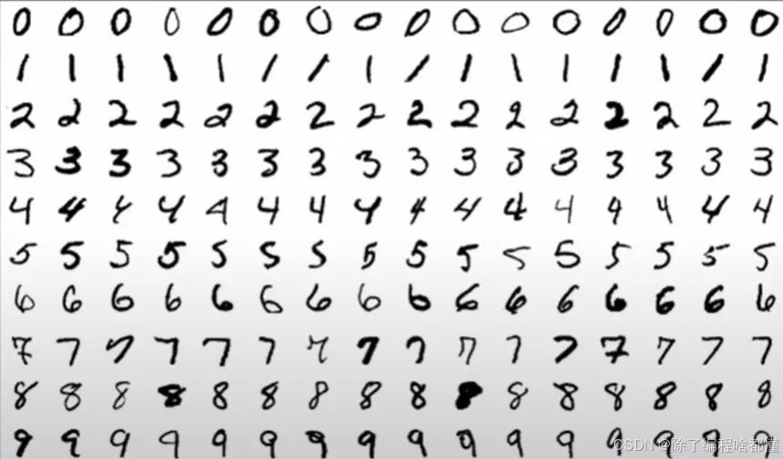

一、核心概念
------

### 1.1 机器学习

机器学习是一个通过利用统计学知识，将数据输入到计算机中进行训练并完成特定目标任务的过程。这种归纳学习的方法可以让计算机学习一些特征并进行一系列复杂的任务，比如识别照片中的物体。由于需要写复杂的逻辑以及测量标准，这些任务在传统计算科学领域中很难实现。

[02 train your first model - Deep Java Library](https://docs.djl.ai/master/docs/demos/jupyter/tutorial/02_train_your_first_model.html "02 train your first model - Deep Java Library")

以下示例用于推理：

- [Image classification example
  图像分类示例](https://github.com/deepjavalibrary/djl/blob/master/examples/docs/image_classification.md)
- [Segment anything 2 example
  片段 anything 2 示例](https://github.com/deepjavalibrary/djl/blob/master/examples/docs/segment_anything_2.md)
- [Single-shot object detection example
  单次对象检测示例](https://github.com/deepjavalibrary/djl/blob/master/examples/docs/object_detection.md)
- [Face detection example 人脸检测示例](https://github.com/deepjavalibrary/djl/blob/master/examples/docs/face_detection.md)
- [Face recognition example
  人脸识别示例](https://github.com/deepjavalibrary/djl/blob/master/examples/docs/face_recognition.md)
- [Instance segmentation example
  实例分割示例](https://github.com/deepjavalibrary/djl/blob/master/examples/docs/instance_segmentation.md)
- [Semantic segmentation example
  语义分割示例](https://github.com/deepjavalibrary/djl/blob/master/examples/docs/semantic_segmentation.md)
- [Pose estimation example 姿态估计示例](https://github.com/deepjavalibrary/djl/blob/master/examples/docs/pose_estimation.md)
- [Action recognition example
  动作识别示例](https://github.com/deepjavalibrary/djl/blob/master/examples/docs/action_recognition.md)
- [Image generation with BigGAN example
  使用 BigGAN 进行图像生成示例](https://github.com/deepjavalibrary/djl/blob/master/examples/docs/biggan.md)
- [Image enhancement with Super-Resolution example
  使用超分辨率进行图像增强示例](https://github.com/deepjavalibrary/djl/blob/master/examples/docs/super_resolution.md)
- [Bert question and answer example
  BERT 问答示例](https://github.com/deepjavalibrary/djl/blob/master/examples/docs/BERT_question_and_answer.md)
- [Speech recognition example
  语音识别示例](https://github.com/deepjavalibrary/djl/blob/master/examples/docs/speech_recognition.md)

### 1.2 深度学习

深度学习是机器学习的一个分支，主要侧重于对于人工神经网络的开发。人工神经网络是通过研究人脑如何学习和实现目标的过程中归纳而得出一套计算逻辑。它通过模拟部分人脑神经间信息传递的过程，从而实现各类复杂的任务。深度学习中的 “深度” 来源于我们会在人工神经网络中编织构建出许多层（layer）从而进一步对数据信息进行更深层的传导。深度学习技术应用范围十分广泛，现在被用来做目标检测、动作识别、机器翻译、语意分析等各类现实应用中。

### 1.3 [Neural Network](https://so.csdn.net/so/search?q=Neural%20Network&spm=1001.2101.3001.7020) - 神经网络

神经网络是一个黑盒程序。不用你自己编写这个函数，你需要为这个函数提供很多输入 / 输出对样本。然后，我们尝试训练网络，让他最大近似于我们给定的输入 / 输出对。拥有更多数据的更好的模型可以更准确地近似函数。


### 1.4 生命周期

我们建立 “鞋” 分类模型遵循了**机器学习的生命周期**。**ML 生命周期**与传统的软件开发生命周期有所不同，它包含六个具体的步骤：

1.  获取数据
2.  清洗并准备数据
3.  生成模型
4.  评估模型
5.  部署模型
6.  从模型中获得预测（或推理）

生命周期的最终结果是一个可以查询并返回答案（或预测）的机器学习模型。


### 1.5 MLP

多层感知机（Multilayer Perceptron，简称 MLP）是一种前向型人工神经网络（Feedforward Artificial Neural Network），是最简单的前馈神经网络之一。MLP 由多个层组成，每层包含多个神经元（也称为节点），并且每一层的神经元与下一层的所有神经元相连。MLP 主要用于解决分类和回归问题。

#### 1.5.1 MLP 结构

MLP 通常由以下几个部分组成：

*   **输入层（Input Layer）**：
    *   输入层接收外部输入数据。每个神经元对应一个输入特征。
    *   例如，对于一个图像分类任务，输入层的神经元数量等于图像的像素数量。
*   **隐藏层（Hidden Layers）**：
    *   隐藏层位于输入层和输出层之间。MLP 可以有一个或多个隐藏层。
    *   每个隐藏层包含多个神经元，每个神经元通过权重和偏置与前一层的所有神经元相连。
    *   隐藏层引入了非线性变换，使得 MLP 能够学习复杂的模式。
*   **输出层（Output Layer）**：
    *   输出层产生最终的预测结果。

对于**分类任务**，输出层的神经元数量通常等于类别数量，使用 softmax 激活函数。

对于**回归任务**，输出层的神经元数量通常为 1，使用线性激活函数。


#### 1.5.2 工作原理

参考：[https://zhuanlan.zhihu.com/p/642537175](https://zhuanlan.zhihu.com/p/642537175 "https://zhuanlan.zhihu.com/p/642537175")


MLP 的工作原理可以分为**前向传播（Forward Propagation）**和**反向传播（Backward Propagation）**

两个主要步骤：

**前向传播**：

*   输入数据从输入层传递到输出层。
*   每个神经元计算加权和（线性组合），然后通过激活函数引入非线性。

**反向传播**：

*   反向传播用于计算损失函数相对于每个权重和偏置的梯度。
*   使用梯度下降法更新权重和偏置，以最小化损失函数。

具体步骤包括：

*   计算输出层的误差。
*   逐层向后传播误差，计算每个隐藏层的误差。
*   更新权重和偏置。

当我们准备好数据集和神经网络之后，就可以开始训练模型了。在深度学习中，一般会由下面几步来完成一个训练过程：

*   初始化：我们会对每一个 Block 的参数进行初始化，初始化每个参数的函数都是由 设定的 Initializer 决定的。
*   前向传播：这一步将输入数据在神经网络中逐层传递，然后产生输出数据。
*   计算损失：我们会根据特定的损失函数 Loss 来计算输出和标记结果的偏差。
*   反向传播：在这一步中，你可以利用损失反向求导算出每一个参数的梯度。
*   更新权重：我们会根据选择的优化器（Optimizer）更新每一个在 Block 上参数的值。

二、DJL - Deep Java Library
-------------------------

Deep Java Library（DJL）是一个开源的、高级的、与引擎无关的深度学习 Java 框架。DJL 旨在易于上手，易于 Java 开发人员使用。DJL 提供原生 Java 开发体验和功能，就像任何其他常规 Java 库一样。

您不必成为机器学习 / [深度学习专家](https://so.csdn.net/so/search?q=%E6%B7%B1%E5%BA%A6%E5%AD%A6%E4%B9%A0%E4%B8%93%E5%AE%B6&spm=1001.2101.3001.7020)才能开始。您可以使用现有的 Java 专业知识作为学习和使用机器学习和深度学习的入口。您可以使用您最喜欢的 IDE 来构建、训练和部署您的模型。DJL 可以轻松地将这些模型与您的 Java 应用程序集成。

因为 DJL 与深度学习引擎无关，所以您在创建项目时不必在引擎之间做出选择。您可以在任何时候交换机引擎。为了确保最佳性能，DJL 还提供了基于硬件配置的自动 CPU/GPU 选择。

### 2.1 架构


### 2.2 依赖

```xml
<properties>
        <java.version>17</java.version>
        <djl.version>0.26.0</djl.version>
    </properties>
    <dependencies>
 
        <dependency>
            <groupId>org.projectlombok</groupId>
            <artifactId>lombok</artifactId>
            <optional>true</optional>
        </dependency>
        <dependency>
            <groupId>org.springframework.boot</groupId>
            <artifactId>spring-boot-starter-test</artifactId>
            <scope>test</scope>
        </dependency>
 
        <!--        引入 djl 依赖  -->
        <dependency>
            <groupId>ai.djl</groupId>
            <artifactId>api</artifactId>
        </dependency>
        <dependency>
            <groupId>ai.djl</groupId>
            <artifactId>basicdataset</artifactId>
        </dependency>
        <dependency>
            <groupId>ai.djl</groupId>
            <artifactId>model-zoo</artifactId>
        </dependency>
        <dependency>
            <groupId>ai.djl.opencv</groupId>
            <artifactId>opencv</artifactId>
        </dependency>
        <dependency>
            <groupId>ai.djl.mxnet</groupId>
            <artifactId>mxnet-engine</artifactId>
        </dependency>
        <dependency>
            <groupId>ai.djl.mxnet</groupId>
            <artifactId>mxnet-native-auto</artifactId>
            <version>1.8.0</version>
        </dependency>
        <dependency>
            <groupId>org.springframework.boot</groupId>
            <artifactId>spring-boot-starter-web</artifactId>
        </dependency>
 
    </dependencies>
    <dependencyManagement>
        <dependencies>
            <dependency>
                <groupId>ai.djl</groupId>
                <artifactId>bom</artifactId>
                <version>${djl.version}</version>
                <type>pom</type>
                <scope>import</scope>
            </dependency>
 
        </dependencies>
    </dependencyManagement>
```

### 2.3 流程

#### 2.3.1 NDArray - N 维向量

创建、运算、操作

```java
@Test
void testNDArray(){
    // NDManager 创建和管理深度学习期间的临时数据。销毁后自动释放所有资源
    try(NDManager manager = NDManager.newBaseManager()){
        //创建 2x2 矩阵
        /**
         * ND: (2, 2) cpu() float32
         * [[0., 1.],
         *  [2., 3.],
         * ]
         */
        NDArray ndArray = manager.create(new float[]{0f, 1f, 2f, 3f}, new Shape(2, 2));
 
 
        /**
         * ND: (2, 3) cpu() float32
         * [[1., 1., 1.],
         *  [1., 1., 1.],
         * ]
         */
        NDArray ones = manager.ones(new Shape(2, 3));
 
 
        /**
         * ND: (2, 3, 4) cpu() float32
         * [[[0.5488, 0.5928, 0.7152, 0.8443],
         *   [0.6028, 0.8579, 0.5449, 0.8473],
         *   [0.4237, 0.6236, 0.6459, 0.3844],
         *  ],
         *  [[0.4376, 0.2975, 0.8918, 0.0567],
         *   [0.9637, 0.2727, 0.3834, 0.4777],
         *   [0.7917, 0.8122, 0.5289, 0.48  ],
         *  ],
         * ]
         */
        NDArray uniform = manager.randomUniform(0, 1, new Shape(2,3, 4));
        System.out.println(uniform);
    }
}
 
//===================
NDArray uniform = manager.randomUniform(0, 1, new Shape(2,3, 4));
 
// 加
NDArray add = uniform.add(5);
System.out.println(add);
 
//===================
@Test
void operation(){
    try(NDManager manager = NDManager.newBaseManager()){
        var array1 = manager. create(new float[] {1f, 2f, 3f, 4f}, new Shape(2, 2));
        var array2 = manager. create(new float[] {1f, 2f});
 
        /**
         * ND: (2) cpu() float32
         * [ 5., 11.]
         */
        var array3 = array1.matMul(array2);
        System.out.println(array3);
 
        /**
         * ND: (1, 4) cpu() float32
         * [[1., 2., 3., 4.],
         * ]
         */
        var array4 = array1.reshape(1, 4);
        System.out.println(array4);
 
 
        /**
         * ND: (2, 2) cpu() float32
         * [[1., 3.],
         *  [2., 4.],
         * ]
         */
        var array5 = array1.transpose();
        System.out.println(array5);
    }
}
```


#### 2.3.2 Dataset - 数据集

##### 2.3.2.1 作用

数据集是用于训练机器学习模型的数据集合。

机器学习通常使用**三个数据集**：[https://machinelearningmastery.com/difference-test-validation-datasets/](https://machinelearningmastery.com/difference-test-validation-datasets/ "https://machinelearningmastery.com/difference-test-validation-datasets/")

*   **训练数据集**
    *   我们用来训练模型的实际数据集。模型从这些数据中学习权重和参数。

*   **验证数据集**
    *   验证集用于在训练过程中评估给定模型。它帮助机器学习工程师在模型开发阶段微调超参数。模型不从验证数据集学习；验证数据集是可选的。
*   **测试数据集**
    *   测试数据集提供了用于评估模型的黄金标准，它只在模型完全训练后使用，测试数据集应该更准确地评估模型将如何在新数据上执行。

DJL 提供了许多内置的基本和标准数据集，这些数据集用于训练深度学习模型，本模块包含以下数据集：

##### 2.3.2.2 内置

[Dataset - Deep Java Library](https://docs.djl.ai/master/docs/dataset.html "Dataset - Deep Java Library")

**CV（计算机视觉）**：

*   **Image Classification**
    *   [MNIST](https://javadoc.io/doc/ai.djl/basicdataset/latest/ai/djl/basicdataset/cv/classification/Mnist.html "MNIST") - A small and fast handwritten digits dataset
    *   [Fashion MNIST](https://javadoc.io/doc/ai.djl/basicdataset/latest/ai/djl/basicdataset/cv/classification/FashionMnist.html "Fashion MNIST") - A small and fast clothing type detection dataset
    *   [CIFAR10](https://javadoc.io/doc/ai.djl/basicdataset/latest/ai/djl/basicdataset/cv/classification/Cifar10.html "CIFAR10") - A dataset consisting of 60,000 32x32 color images in 10 classes
    *   [ImageNet](https://javadoc.io/doc/ai.djl/basicdataset/latest/ai/djl/basicdataset/cv/classification/ImageNet.html "ImageNet") - An image database organized according to the WordNet hierarchy

**Note**: You have to manually download the ImageNet dataset due to licensing requirements.

*   **Object Detection**
    *   [Pikachu](https://javadoc.io/doc/ai.djl/basicdataset/latest/ai/djl/basicdataset/cv/PikachuDetection.html "Pikachu") - 1000 Pikachu images of different angles and sizes created using an open source 3D Pikachu model
    *   [Banana Detection](https://javadoc.io/doc/ai.djl/basicdataset/latest/ai/djl/basicdataset/cv/BananaDetection.html "Banana Detection") - A testing single object detection dataset
*   **Other CV**
    *   [Captcha](https://javadoc.io/doc/ai.djl/basicdataset/latest/ai/djl/basicdataset/cv/classification/CaptchaDataset.html "Captcha") - A dataset for a grayscale 6-digit CAPTCHA task
    *   [Coco](https://javadoc.io/doc/ai.djl/basicdataset/latest/ai/djl/basicdataset/cv/CocoDetection.html "Coco") - A large-scale object detection, segmentation, and captioning dataset that contains 1.5 million object instances

You have to manually add `com.twelvemonkeys.imageio:imageio-jpeg:3.11.0` dependency to your project

**NLP（自然语言处理）**

**Text Classification and Sentiment Analysis**

*   [AmazonReview](https://javadoc.io/doc/ai.djl/basicdataset/latest/ai/djl/basicdataset/nlp/AmazonReview.html "AmazonReview") - A sentiment analysis dataset of Amazon Reviews with their ratings
*   [Stanford Movie Review](https://javadoc.io/doc/ai.djl/basicdataset/latest/ai/djl/basicdataset/nlp/StanfordMovieReview.html "Stanford Movie Review") - A sentiment analysis dataset of movie reviews and sentiments sourced from IMDB
*   [GoEmotions](https://javadoc.io/doc/ai.djl/basicdataset/latest/ai/djl/basicdataset/nlp/GoEmotions.html "GoEmotions") - A dataset classifying 50k curated reddit comments into either 27 emotion categories or neutral

**Unlabeled Text**

*   [Penn Treebank Text](https://javadoc.io/doc/ai.djl/basicdataset/latest/ai/djl/basicdataset/nlp/PennTreebankText.html "Penn Treebank Text") - The text (not POS tags) from the Penn Treebank, a collection of Wall Street Journal stories
*   [WikiText2](https://javadoc.io/doc/ai.djl/basicdataset/latest/ai/djl/basicdataset/nlp/WikiText2.html "WikiText2") - A collection of over 100 million tokens extracted from good and featured articles on wikipedia

**Other NLP**

*   [Stanford Question Answering Dataset (SQuAD)](https://javadoc.io/doc/ai.djl/basicdataset/latest/ai/djl/basicdataset/nlp/StanfordQuestionAnsweringDataset.html "Stanford Question Answering Dataset (SQuAD)") - A reading comprehension dataset with text from wikipedia articles
*   [Tatoeba English French Dataset](https://javadoc.io/doc/ai.djl/basicdataset/latest/ai/djl/basicdataset/nlp/TatoebaEnglishFrenchDataset.html "Tatoeba English French Dataset") - An english-french translation dataset from the Tatoeba Project

**Tabular（表格化）**

*   [Airfoil Self-Noise](https://javadoc.io/doc/ai.djl/basicdataset/latest/ai/djl/basicdataset/tabular/AirfoilRandomAccess.html "Airfoil Self-Noise") - A 6 feature dataset from NASA tests of airfoils
*   [Ames House Pricing](https://javadoc.io/doc/ai.djl/basicdataset/latest/ai/djl/basicdataset/tabular/AmesRandomAccess.html "Ames House Pricing") - A 80 feature dataset to predict house prices
*   [Movielens 100k](https://javadoc.io/doc/ai.djl/basicdataset/latest/ai/djl/basicdataset/tabular/MovieLens100k.html "Movielens 100k") - A 6 feature dataset of movie ratings on 1682 movies from 943 users

**Time Series（时序）**

*   [Daily Delhi Climate](https://javadoc.io/doc/ai.djl/basicdataset/latest/ai/djl/basicdataset/tabular/DailyDelhiClimate.html "Daily Delhi Climate")

#### 2.3.3 Block - 块函数

顺序块用于创建块函数链，其中一个块的输出作为下一个块的输入进行传递


```java
@Test
void testBlock(){
    long inputSize = 28*28;
    long outputSize = 10;
 
    SequentialBlock block = new SequentialBlock();
    //一个批量扁平块，将二维图像输入转化为一维特征向量
    block.add(Blocks.batchFlattenBlock(inputSize));
    //添加一个和隐藏层，其线性变换大小为128
    block.add(Linear.builder().setUnits(128).build());
    //添加相应的激活函数；
    block.add(Activation::relu);
 
    //作为第二个隐藏层的激活函数，有大小为64的变换
    block.add(Linear.builder().setUnits(64).build());
    block.add(Activation::relu);
    //最后输出10大小的特征向量
    block.add(Linear.builder().setUnits(outputSize).build());
 
    //这些大小是在实验过程中选择的
 
    //围绕块，可以构建我们的模型，它添加了一些重要的元数据，例如：可以在训练和推理期间使用的名称
    Model model = Model.newInstance("mlp");
    model.setBlock(block);
    
    //现在已经拥有了块和模型，接下来就是如何进行训练
 
}
```


#### 2.3.4 Model - 模型


#### 2.3.5 Inference - 推理

##### 2.3.5.1 流程


##### 2.3.5.2 Translator - 转换器


```java
ImageClassificationTranslator classificationTranslator = ImageClassificationTranslator.builder()
        .addTransform(new CenterCrop()) //中心裁剪
        .addTransform(new Resize(224, 224)) //调整大小
        .addTransform(new ToTensor())//将图像 NDArray 从预处理格式转换为神经网络格式的变换
        .build();
```

#### 2.3.6. Model Loading - 模型加载

*   创建 Filters 而查找模型
    *   Local Disk
    *   URL：file、http、jar
    *   DJL 内置 modelzoo
*   Builder Pattern
    *   setTypes 必须
    *   optXxx 可选

```java
@Test
void testModelLoading() throws ModelNotFoundException, MalformedModelException, IOException {
ImageClassificationTranslator translator = ImageClassificationTranslator.builder()
        .addTransform(new CenterCrop())
        .addTransform(new Resize(224, 224))
        .addTransform(new ToTensor())
        .build();
 
//模型检索条件
Criteria<Image, Classifications> criteria = Criteria.builder()
        .setTypes(Image.class, Classifications.class)
        .optApplication(Application.CV.IMAGE_CLASSIFICATION)
        .optFilter("layers", "50")
        .optTranslator(translator)
        .optProgress(new ProgressBar())
        .build();
 
//加载模型
ZooModel<Image, Classifications> model = ModelZoo.loadModel(criteria);
 
 
System.out.println(model.getName());
}
```

#### 2.3.7 Predictor - 预测

```java
//预测
Predictor<Image, Classifications> predictor = model.newPredictor();
Classifications predict = predictor.predict(image);
```

三、Mnist 数据训练 - 完整过程
-------------------

基于多层感知机训练手写数字识别模型



### 3.1 准备数据集

```java
//0、准备数据集
RandomAccessDataset trainingSet = getDataset(Dataset.Usage.TRAIN);
RandomAccessDataset validateSet = getDataset(Dataset.Usage.TEST);
 
private RandomAccessDataset getDataset(Dataset.Usage usage) {
    Mnist mnist =
            Mnist.builder()
                    .optUsage(usage)
                    .setSampling(64, true)
                    .build();
    mnist.prepare(new ProgressBar());
    return mnist;
}
```

### 3.2 构建神经网络

```java
//1、构建神经网络
Block block =
        new Mlp(
                Mnist.IMAGE_HEIGHT * Mnist.IMAGE_WIDTH,
                Mnist.NUM_CLASSES,
                new int[]{128, 64});
```

### 3.3 创建模型

```java
//2、创建模型
try (Model model = Model.newInstance("mlp")) {
    model.setBlock(block);
    // 3.4及以后的代码
    
}
```

### 3.4 训练配置

```java
//3、训练配置
DefaultTrainingConfig config = setupTrainingConfig();
 
private DefaultTrainingConfig setupTrainingConfig() {
    String outputDir = "build/model";
    SaveModelTrainingListener listener = new SaveModelTrainingListener(outputDir);
    listener.setSaveModelCallback(
            trainer -> {
                TrainingResult result = trainer.getTrainingResult();
                Model model = trainer.getModel();
                float accuracy = result.getValidateEvaluation("Accuracy");
                model.setProperty("Accuracy", String.format("%.5f", accuracy));
                model.setProperty("Loss", String.format("%.5f", result.getValidateLoss()));
            });
 
    return new DefaultTrainingConfig(Loss.softmaxCrossEntropyLoss())
            .addEvaluator(new Accuracy())
            .addTrainingListeners(TrainingListener.Defaults.logging(outputDir))
            .addTrainingListeners(listener);
}
```

### 3.5 开始训练

```java
//4、拿到训练器
try (Trainer trainer = model.newTrainer(config)) {
    trainer.setMetrics(new Metrics());
 
    /*
     * MNIST is 28x28 grayscale image and pre processed into 28 * 28 NDArray.
     * 1st axis is batch axis, we can use 1 for initialization.
     */
    Shape inputShape = new Shape(1, Mnist.IMAGE_HEIGHT * Mnist.IMAGE_WIDTH);
 
    // initialize trainer with proper input shape
    trainer.initialize(inputShape);
 
    //5、开始训练
    EasyTrain.fit(trainer, 5, trainingSet, validateSet);
 
    //6、训练结果
    TrainingResult result = trainer.getTrainingResult();
    System.out.println("result = " + result);
}
```

### 3.6 保存模型

```java
// 前面  SaveModelTrainingListener listener = new SaveModelTrainingListener(outputDir); 
// 已经可以保存模型
 
//也可以直接调用如下API
Path modelDir = Paths.get("build/mlpx");
Files.createDirectories(modelDir);
// Save the model
model.save(modelDir, "mlpx");
```

### 3.7 加载模型

```java
//加载模型
Path modelDir = Paths.get("build/model");
Model model = Model.newInstance("mlp");
model.setBlock(block);
model.load(modelDir);
```

### 3.8 创建推理器

```java
//如果没有 Translator，非标图像则无法处理
Translator<Image, Classifications> translator =
        ImageClassificationTranslator.builder()
                .addTransform(new Resize(Mnist.IMAGE_WIDTH, Mnist.IMAGE_HEIGHT))
                .addTransform(new ToTensor())
                .optApplySoftmax(true)
                .build();
Predictor<Image, Classifications> predictor = model.newPredictor(translator);
```

### 3.9 分类推理

```java
Classifications predict = predictor.predict(img);
 
System.out.println("predict = " + predict);
```


### 完整

```java
package com.atguigu.djl;

import ai.djl.*;
import ai.djl.basicdataset.cv.classification.*;
import ai.djl.basicmodelzoo.basic.*;
import ai.djl.inference.*;
import ai.djl.metric.*;
import ai.djl.modality.*;
import ai.djl.modality.cv.*;
import ai.djl.modality.cv.transform.*;
import ai.djl.modality.cv.translator.*;
import ai.djl.ndarray.*;
import ai.djl.ndarray.types.*;
import ai.djl.training.*;
import ai.djl.training.dataset.*;
import ai.djl.training.evaluator.*;
import ai.djl.training.listener.*;
import ai.djl.training.loss.*;
import ai.djl.training.util.*;
import ai.djl.translate.*;
import lombok.SneakyThrows;
import org.junit.jupiter.api.Test;

import java.io.IOException;
import java.nio.file.*;

public class DJLTest {
    //完全训练一个模型：
    // 1、准备数据集
    // 2、构建神经网络
    // 3、构建模型（这个模型应用上面的神经网络）
    // 4、训练配置（如何训练、训练集、验证集、测试集）
    // 5、保存模型
    // ======下面流程===
    // 6、加载模型
    // 7、预测（给模型一个新输入，让他判断这是什么）
    @SneakyThrows
    @Test
    void trainingComplete() throws Exception {
        // 1、准备数据集; 用自己的数据就自定义 Dataset
        RandomAccessDataset trainingSet = getDataset(Dataset.Usage.TRAIN);
        RandomAccessDataset validateSet = getDataset(Dataset.Usage.TEST);

        //2、构建神经网络； 就是 block
        //输入：28*28  输出：10
        Mlp mlp = new Mlp(Mnist.IMAGE_WIDTH * Mnist.IMAGE_WIDTH, Mnist.NUM_CLASSES, new int[]{128, 64});

        //3、创建模型，加载这个block
        try (Model model = Model.newInstance("mlp")) {
            //设置神经网络
            model.setBlock(mlp);

            //4、训练配置
            String outputDir = "build/mlp";
            DefaultTrainingConfig config = new DefaultTrainingConfig(Loss.softmaxCrossEntropyLoss())
                    .addEvaluator(new Accuracy())
                    .addTrainingListeners(TrainingListener.Defaults.logging(outputDir));

            //5、获取训练器
            try (Trainer trainer = model.newTrainer(config)) {
                trainer.setMetrics(new Metrics());
                //6、初始化
                trainer.initialize(new Shape(1, Mnist.IMAGE_HEIGHT * Mnist.IMAGE_WIDTH));

                //7、训练5次
                EasyTrain.fit(trainer, 5, trainingSet, validateSet);

                TrainingResult result = trainer.getTrainingResult();
                System.out.println("训练结果..." + result);

                //8、保存模型  DJL
                model.save(Paths.get(outputDir), "mlp");

                System.out.println("模型保存成功");

            }
        }
    }

    @SneakyThrows
    private RandomAccessDataset getDataset(Dataset.Usage usage) throws Exception {
        //1、Mnist 是内置的，数据已经带好了 用户目录/.djl/cache

        //这个就是数据集、自定义的数据集，需要写translator
//        ImageFolder build = ImageFolder.builder()
//                .setRepositoryPath("~/.djl/cache")
//                .optImageHeight(28)
//                .optImageWidth(28)
//                .setSampling(64,true)
//                .build();
//

        Mnist mnist = Mnist.builder()
                .setSampling(64, true)
                .optUsage(usage)
                .build();
        mnist.prepare(new ProgressBar());
        return mnist;
    }

    //测试模型
    @Test
    void predictTest() throws IOException, MalformedModelException, TranslateException {
        //1、准备测试数据
        Image image = ImageFactory.getInstance().fromUrl("https://resources.djl.ai/images/0.png");
        Image img2 = ImageFactory.getInstance().fromFile(Paths.get("build/img/7.png"));

        //2、加载模型
        Path modelDir = Paths.get("build/mlp");
        Model model = Model.newInstance("mlp");
        model.setBlock(new Mlp(28 * 28, 10, new int[]{128, 64}));
        model.load(modelDir);


        //3、获取一个转化器； 黑底白字， 白底黑字
        ImageClassificationTranslator translator = ImageClassificationTranslator.builder()
                .addTransform(new Resize(28, 28))
                //加处理逻辑
                .addTransform(new ToTensor())
                .build();

        //4、获取预测器
        Predictor<Image, Classifications> predictor = model.newPredictor(translator);

        //5、预测图片分类
        Classifications predict = predictor.predict(img2);

        System.out.println(predict);

    }
}

```


# 鞋分类

# Footwear classification

https://docs.djl.ai/master/docs/demos/footwear_classification/index.html
