# 一、微信支付介绍和接入指引

## 1、微信支付产品介绍

### 1.1、付款码支付

用户展示微信钱包内的“付款码”给商家，商家扫描后直接完成支付，适用于线下面对面收银的场景。

### 1.2、JSAPI支付

+ 线下场所：商户展示一个支付二维码，用户使用微信扫描二维码后，输入需要支付的金额，完成支
  付。

+ 公众号场景：用户在微信内进入商家公众号，打开某个页面，选择某个产品，完成支付。

+ PC网站场景：在网站中展示二维码，用户使用微信扫描二维码，输入需要支付的金额，完成支
  付。

  

> 特点：用户在客户端输入支付金额

### 1.3、小程序支付

在微信小程序平台内实现支付的功能。

### 1.4、Native支付

Native支付是指商户展示支付二维码，用户再用微信“扫一扫”完成支付的模式。这种方式适用于PC网p站。

> 特点：商家预先指定支付金额

### 1.5、APP支付

商户通过在移动端独立的APP应用程序中集成微信支付模块，完成支付。

### 1.6、刷脸支付

用户在刷脸设备前通过摄像头刷脸、识别身份后进行的一种支付方式。

## 2、接入指引

### 2.1、获取商户号

微信商户平台：https://pay.weixin.qq.com/
场景：Native支付
步骤：提交资料 => 签署协议 => 获取商户号

### 2.2、获取APPID

微信公众平台：https://mp.weixin.qq.com/
步骤：注册服务号 => 服务号认证 => 获取APPID => 绑定商户号

### 2.3、获取API秘钥

APIv2版本的接口需要此秘钥
步骤：登录商户平台 => 选择 账户中心 => 安全中心 => API安全 => 设置API密钥

### 2.4、获取APIv3秘钥

APIv3版本的接口需要此秘钥
步骤：登录商户平台 => 选择 账户中心 => 安全中心 => API安全 => 设置APIv3密钥
随机密码生成工具：https://suijimimashengcheng.bmcx.com/

### 2.5、申请商户API证书

APIv3版本的所有接口都需要；APIv2版本的高级接口需要（如：退款、企业红包、企业付款等）
步骤：登录商户平台 => 选择 账户中心 => 安全中心 => API安全 => 申请API证书

### 2.6、获取微信平台证书

可以预先下载，也可以通过编程的方式获取。后面的课程中，我们会通过编程的方式来获取。

> 注意：以上所有API秘钥和证书需妥善保管防止泄露

# 二、支付安全（证书/秘钥/签名）

## 1、信息安全的基础 - 机密性

+ **明文**：加密前的消息叫“明文”（plain text）

+ **密文**：加密后的文本叫“密文”（cipher text）

+ **密钥**：只有掌握特殊“钥匙”的人，才能对加密的文本进行解密，这里的“钥匙”就叫做“密钥”（key）

  > “密钥”就是一个字符串，度量单位是“位”（bit），比如，密钥长度是 128，就是 16 字节的二进制串

+ **加密**：实现机密性最常用的手段是“加密”（encrypt）

  > 按照密钥的使用方式，加密可以分为两大类：对称加密和非对称加密。

+ **解密**：使用密钥还原明文的过程叫“解密”（decrypt）

+ **加密算法**：加密解密的操作过程就是“加密算法”

  > 所有的加`密算法都是公开的`，而算法使用的“密钥”则必须保密

## 2、对称加密和非对称加密

+ **对称加密**
  + 特点：只使用一个密钥，密钥必须保密，常用的有 AES算法
  + 优点：运算**速度快**
  + 缺点：秘钥需要信息交换的双方共享，一旦被窃取，消息会被破解，无法做到安全的密钥交换
+ **非对称加密**
  + 特点：使用两个密钥：公钥和私钥，公钥可以任意分发而私钥保密，常用的有 RSA
  + 优点：黑客获取公钥无法破解密文，解决了密钥交换的问题
  + 缺点：运算速度**非常慢**
+ 混合加密
  + 实际场景中把**对称加密和非对称加密结合起来使用**。使用非对称传输对称加密的秘钥提升效率。


>  非对称加密特性;
>
> 1. 公钥加密，只有私钥才能解密。用公钥不能加密
> 2. 私钥加密，只能公钥解密。可以确定来源，用于身份认证。
>
>  
>
> 《趣味数学》这类书里的一个数学小魔术：
>
> 让对方任意想一个3位数，并把这个数和91相乘，然后告诉我积的最后三位数，我就可以猜出对方想的是什么数字啦！比如对方想的是123，那么对方就计算出123 * 91等于11193，并把结果的末三位193告诉我。看起来，这么做似乎损失了不少信息，让我没法反推出原来的数。不过，我仍然有办法：只需要把对方告诉我的结果再乘以11，乘积的末三位就是对方刚开始想的数了。可以验证一下，193 * 11 = 2123，末三位正是对方所想的秘密数字！
>
> 其实道理很简单，91乘以11等于1001，而任何一个三位数乘以1001后，末三位显然都不变（例如123乘以1001就等于123123）。
>
> 知道原理后，我们可以构造一个定义域和值域更大的加密解密系统。比方说，任意一个数乘以400000001后，末8位都不变，而400000001 = 19801 * 20201，于是你来乘以19801，我来乘以20201，又一个加密解密不对称的系统就构造好了。
>
> 甚至可以构造得更大一些：4000000000000000000000000000001 = 1199481995446957 * 3334772856269093，这样我们就成功构造了一个30位的加密系统。
>
> 这是一件非常coooooooool的事情，任何人都可以按照我公布的方法加密一个数，但是只有我才知道怎么把所得的密文变回去。
>
> 其安全性就建立在算乘积非常容易，但是要把4000000000000000000000000000001分解成后面两个数相乘，在没有计算机的时代几乎不可能成功！但如果仅仅按照上面的思路，如果对方知道原理，知道我要构造出带很多0的数，根据19801和8位算法这2个条件非常容易穷举出400000001这个目标值。
>
> 要解决这个问题，真实世界就不是使用乘法了，比如RSA算法使用的是指数和取模运算，但本质上就是上面这套思想。

## 3、身份认证

+ **公钥加密，私钥解密的作用是加密信息**

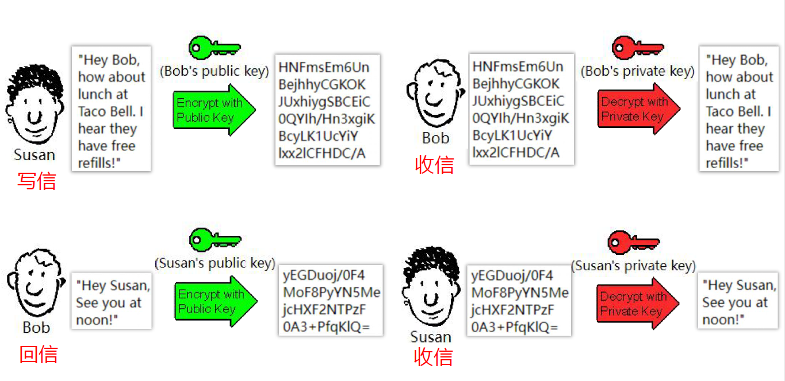

+ **私钥加密，公钥解密的作用是身份认证**

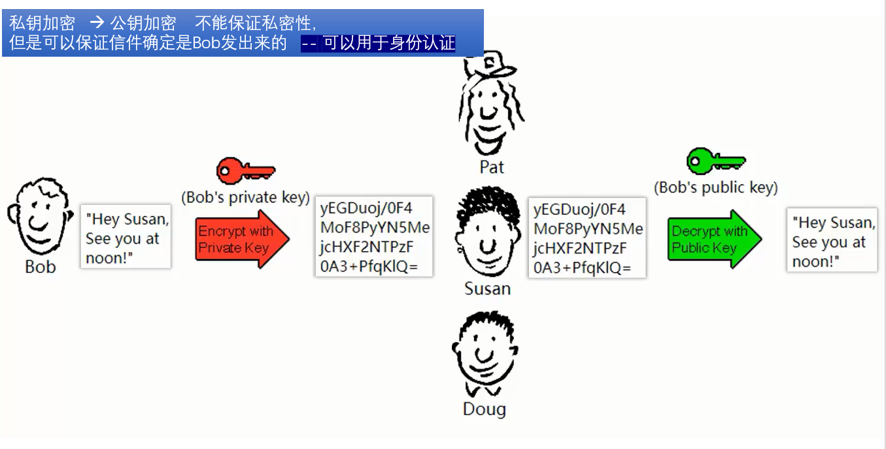

## 4、摘要算法（Digest Algorithm）

摘要算法就是我们常说的散列函数、哈希函数（Hash Function），它能够把任意长度的数据“压缩”成固定长度、而且独一无二的“摘要”字符串，就好像是给这段数据生成了一个数字“指纹”。
**作用：**
保证信息的完整性
**特性：**

+ 不可逆：只有算法，没有秘钥，只能加密，不能解密

+ 难题友好性：想要破解，只能暴力枚举

+ 发散性：只要对原文进行一点点改动，摘要就会发生剧烈变化

+ 抗碰撞性：原文不同，计算后的摘要也要不同

  

**常见摘要算法：**
MD5、SHA1、SHA2（SHA224、SHA256、SHA384）

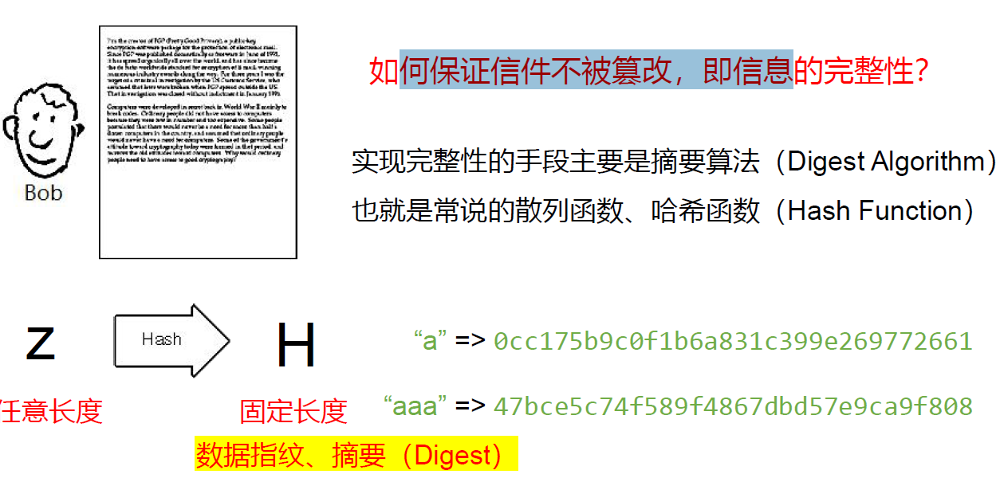

下面流程存在漏洞：会存在**中间者修改内容重新生成摘要**，pat不能发现  -- 解决：使用加密

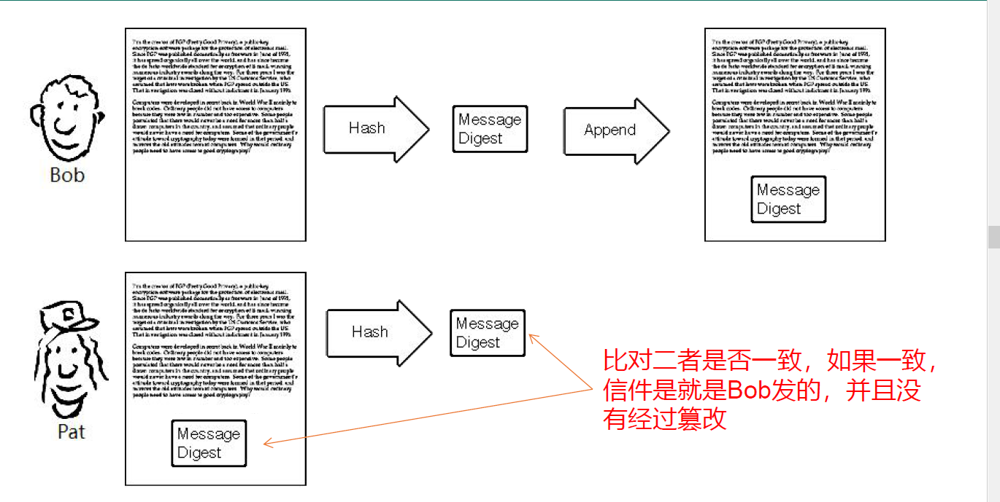

## 5、数字签名

数字签名是使用**私钥对摘要加密生成签名**，需要由**公钥将签名解密后进行验证**，实现身份认证和不可否认

**签名和验证签名的流程：**

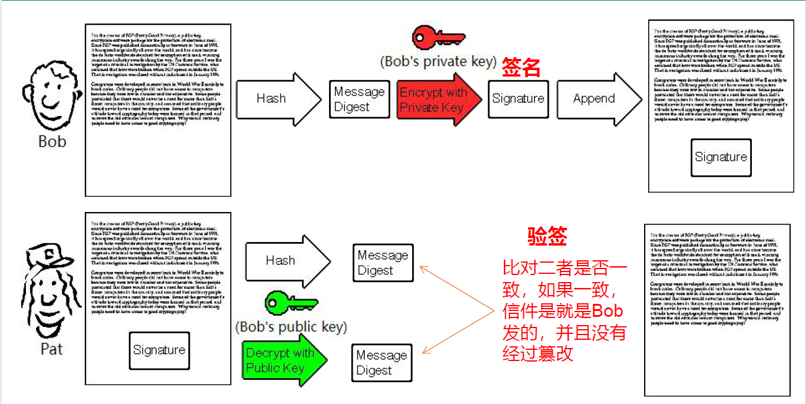

## 6、数字证书

**数字证书解决“公钥的信任”问题**，可以防止**黑客伪造公钥**。

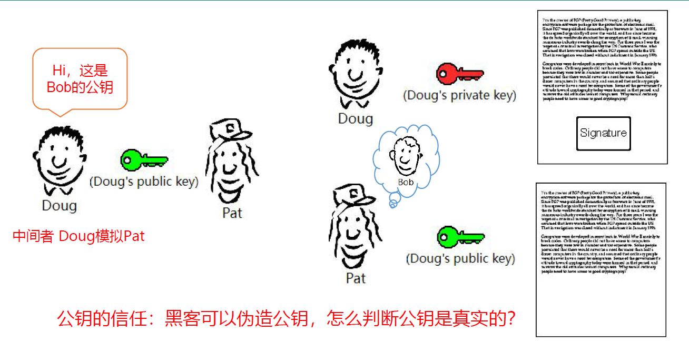

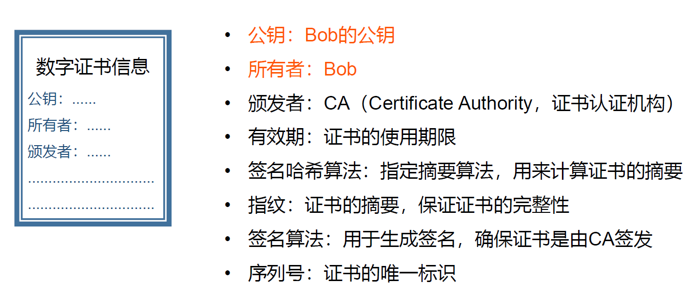

不能直接分发公钥，**公钥的分发必须使用数字证书**，数字证书由CA颁发，CA的公钥信任由操作系统和浏览器保证。

过程图：

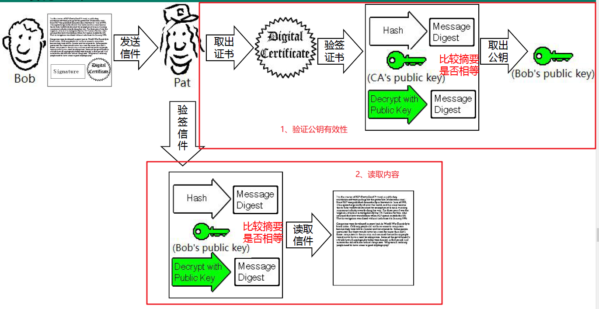

**https协议中的数字证书：**

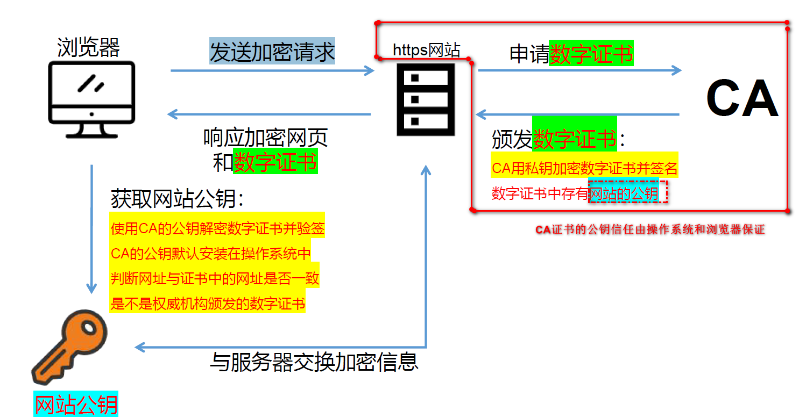

> **CA的公钥解私钥加密的证书，可以保证证书来源**。

## 7、微信APIv3证书

**商户证书：**
商户API证书是指由商户申请的，包含商户的商户号、公司名称、公钥信息的证书。
商户证书在商户后台申请：https://pay.weixin.qq.com/index.php/core/cert/api_cert#/

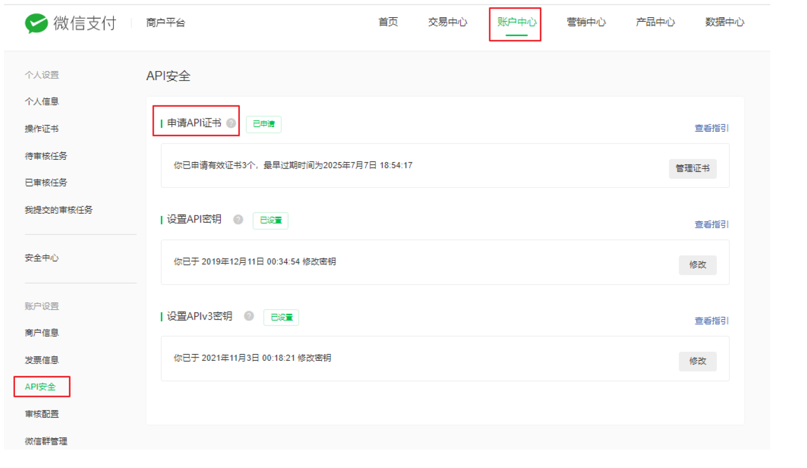

**平台证书（微信支付平台）：**
微信支付平台证书是指由微信支付 负责申请的，包含微信支付平台标识、公钥信息的证书。商户可以使
用平台证书中的公钥进行验签。

平台证书的获取：https://pay.weixin.qq.com/wiki/doc/apiv3/wechatpay/wechatpay3_0.shtml

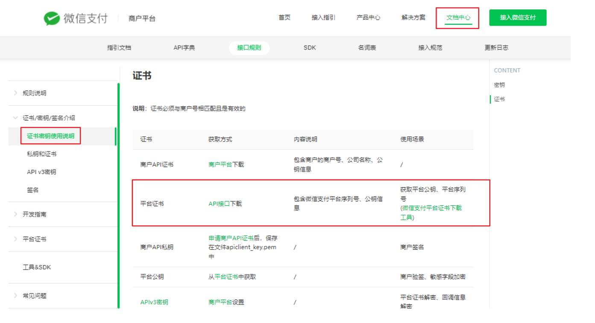

## 8、API密钥和APIv3密钥

都是**对称加密**需要使用的加密和解密密钥，一定要保管好，不能泄露。
API密钥对应V2版本的API
APIv3密钥对应V3版本的API

# 三、案例项目的创建

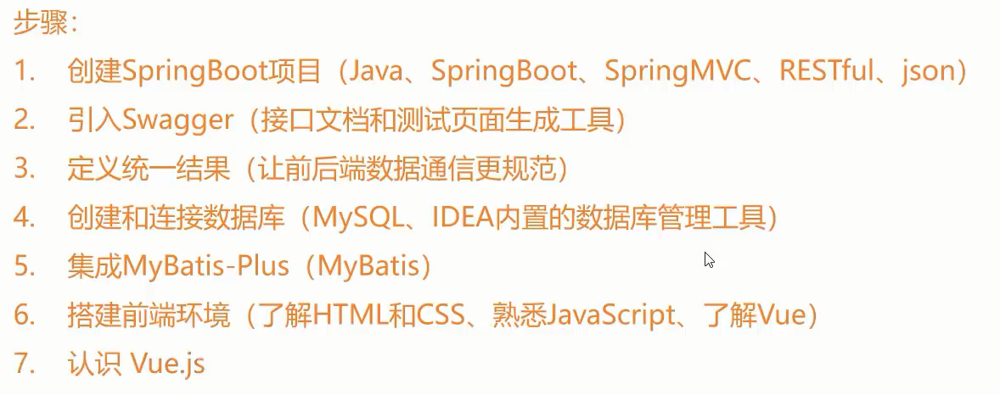

## 1、创建SpringBoot项目

### 1.1、新建项目

注意：Java版本选择8


### 1.2、添加依赖

添加SpringBoot web依赖

```xml
<dependency>
	<groupId>org.springframework.boot</groupId>
	<artifactId>spring-boot-starter-web</artifactId>
</dependency>
```

### 1.3、配置application.yml文件

```yaml
server:
    port: 8090 #服务端口
spring:
    application:
        name: payment-demo # 应用名称
```

### 1.4、创建controller

创建controller包，创建ProductController类

```java
package com.atguigu.paymentdemo.controller;
import org.springframework.web.bind.annotation.GetMapping;
import org.springframework.web.bind.annotation.RequestMapping;
import org.springframework.web.bind.annotation.RestController;
@RestController
@RequestMapping("/api/product")
@CrossOrigin //跨域
public class ProductController {
    @GetMapping("/test")
    public String test(){
        return "hello";
    }
}
```

### 1.5、测试

访问：http://localhost:8090/api/product/test

## 2、引入Swagger

作用：自动生成接口文档和测试页面。

### 2.1、引入依赖

```xml
<!--swagger-->
<dependency>
    <groupId>io.springfox</groupId>
    <artifactId>springfox-swagger2</artifactId>
    <version>2.7.0</version>
</dependency>
<!--swagger ui-->
<dependency>
    <groupId>io.springfox</groupId>
    <artifactId>springfox-swagger-ui</artifactId>
    <version>2.7.0</version>
</dependency>
```

### 2.2、Swagger配置文件

创建config包，创建Swagger2Config类

```java
import org.springframework.context.annotation.Bean;
import org.springframework.context.annotation.Configuration;
import springfox.documentation.builders.ApiInfoBuilder;
import springfox.documentation.spi.DocumentationType;
import springfox.documentation.spring.web.plugins.Docket;
import springfox.documentation.swagger2.annotations.EnableSwagger2;

@Configuration
@EnableSwagger2
public class Swagger2Config {
    @Bean
    public Docket docket() {
        return new Docket(DocumentationType.SWAGGER_2)
                .apiInfo(new ApiInfoBuilder().title("微信支付案例接口文档").build());
    }
}
```

### 2.3、Swagger注解

controller中可以添加常用注解

```java
@Api(tags="商品管理") //用在类上

@ApiOperation("测试接口") //用在方法上
```

### 2.4、测试

访问：http://localhost:8090/swagger-ui.html

## 3、定义统一结果

作用：定义统一响应结果，为前端返回标准格式的数据。

### 3.1、引入lombok依赖

简化实体类的开发

```xml
<!--实体对象工具类：低版本idea需要安装lombok插件-->
<dependency>
    <groupId>org.projectlombok</groupId>
    <artifactId>lombok</artifactId>
</dependency>
```

### 3.2、创建R类

创建统一结果类

```java
package com.atguigu.paymentdemo.vo;

import lombok.Data;

import java.util.HashMap;
import java.util.Map;

@Data //生成set、get等方法
public class R {
    private Integer code;
    private String message;
    private Map<String, Object> data = new HashMap<>();

    public static R ok() {
        R r = new R();
        r.setCode(0);
        r.setMessage("成功");
        return r;
    }

    public static R error() {
        R r = new R();
        r.setCode(-1);
        r.setMessage("失败");
        return r;
    }

    public R data(String key, Object value) {
        this.data.put(key, value);
        return this;
    }
}
```

### 3.3、修改controller

修改test方法，返回统一结果

```java
    @ApiOperation("测试接口")
    @GetMapping("/test")
    public R test() {
        return R
                .ok()
                .data("message", "hello")
                .data("now", new Date());
    }
```

### 3.4、配置json时间格式

```yaml
spring:
    jackson:
        date-format: yyyy-MM-dd HH:mm:ss
        time-zone: GMT+8
```

### 3.5、Swagger测试


## 4、创建数据库

### 4.1、创建数据库+表

```sql
create database IF NOT EXISTS payment_demo  ;
USE `payment_demo`;

/*Table structure for table `t_order_info` */

CREATE TABLE `t_order_info` (
  `id` bigint(11) unsigned NOT NULL AUTO_INCREMENT COMMENT '订单id',
  `title` varchar(256) DEFAULT NULL COMMENT '订单标题',
  `order_no` varchar(50) DEFAULT NULL COMMENT '商户订单编号',
  `user_id` bigint(20) DEFAULT NULL COMMENT '用户id',
  `product_id` bigint(20) DEFAULT NULL COMMENT '支付产品id',
  `total_fee` int(11) DEFAULT NULL COMMENT '订单金额(分)',
  `code_url` varchar(50) DEFAULT NULL COMMENT '订单二维码连接',
  `order_status` varchar(10) DEFAULT NULL COMMENT '订单状态',
  `create_time` datetime DEFAULT CURRENT_TIMESTAMP COMMENT '创建时间',
  `update_time` datetime DEFAULT CURRENT_TIMESTAMP ON UPDATE CURRENT_TIMESTAMP COMMENT '更新时间',
  PRIMARY KEY (`id`)
) ENGINE=InnoDB AUTO_INCREMENT=1 DEFAULT CHARSET=utf8mb4;


/*Table structure for table `t_payment_info` */

CREATE TABLE `t_payment_info` (
  `id` bigint(20) unsigned NOT NULL AUTO_INCREMENT COMMENT '支付记录id',
  `order_no` varchar(50) DEFAULT NULL COMMENT '商户订单编号',
  `transaction_id` varchar(50) DEFAULT NULL COMMENT '支付系统交易编号',
  `payment_type` varchar(20) DEFAULT NULL COMMENT '支付类型',
  `trade_type` varchar(20) DEFAULT NULL COMMENT '交易类型',
  `trade_state` varchar(50) DEFAULT NULL COMMENT '交易状态',
  `payer_total` int(11) DEFAULT NULL COMMENT '支付金额(分)',
  `content` text COMMENT '通知参数',
  `create_time` datetime DEFAULT CURRENT_TIMESTAMP COMMENT '创建时间',
  `update_time` datetime DEFAULT CURRENT_TIMESTAMP ON UPDATE CURRENT_TIMESTAMP COMMENT '更新时间',
  PRIMARY KEY (`id`)
) ENGINE=InnoDB AUTO_INCREMENT=1 DEFAULT CHARSET=utf8mb4;


/*Table structure for table `t_product` */

CREATE TABLE `t_product` (
  `id` bigint(20) NOT NULL AUTO_INCREMENT COMMENT '商品id',
  `title` varchar(20) DEFAULT NULL COMMENT '商品名称',
  `price` int(11) DEFAULT NULL COMMENT '价格（分）',
  `create_time` datetime DEFAULT CURRENT_TIMESTAMP COMMENT '创建时间',
  `update_time` datetime DEFAULT CURRENT_TIMESTAMP ON UPDATE CURRENT_TIMESTAMP COMMENT '更新时间',
  PRIMARY KEY (`id`)
) ENGINE=InnoDB AUTO_INCREMENT=1 DEFAULT CHARSET=utf8mb4;

/*Data for the table `t_product` */

insert  into `t_product`(`title`,`price`) values ('Java课程',1);
insert  into `t_product`(`title`,`price`) values ('大数据课程',1);
insert  into `t_product`(`title`,`price`) values ('前端课程',1);
insert  into `t_product`(`title`,`price`) values ('UI课程',1);

/*Table structure for table `t_refund_info` */

CREATE TABLE `t_refund_info` (
  `id` bigint(20) unsigned NOT NULL AUTO_INCREMENT COMMENT '退款单id',
  `order_no` varchar(50) DEFAULT NULL COMMENT '商户订单编号',
  `refund_no` varchar(50) DEFAULT NULL COMMENT '商户退款单编号',
  `refund_id` varchar(50) DEFAULT NULL COMMENT '支付系统退款单号',
  `total_fee` int(11) DEFAULT NULL COMMENT '原订单金额(分)',
  `refund` int(11) DEFAULT NULL COMMENT '退款金额(分)',
  `reason` varchar(50) DEFAULT NULL COMMENT '退款原因',
  `refund_status` varchar(10) DEFAULT NULL COMMENT '退款状态',
  `content_return` text COMMENT '申请退款返回参数',
  `content_notify` text COMMENT '退款结果通知参数',
  `create_time` datetime DEFAULT CURRENT_TIMESTAMP COMMENT '创建时间',
  `update_time` datetime DEFAULT CURRENT_TIMESTAMP ON UPDATE CURRENT_TIMESTAMP COMMENT '更新时间',
  PRIMARY KEY (`id`)
) ENGINE=InnoDB AUTO_INCREMENT=1 DEFAULT CHARSET=utf8mb4;

```

### 4.2、IDEA配置数据库连接

## 5、集成MyBatis-Plus

### 5.1、引入依赖

```xml
<!--mysql驱动-->
<dependency>
    <groupId>mysql</groupId>
    <artifactId>mysql-connector-java</artifactId>
</dependency>
<!--持久层-->
<dependency>
    <groupId>com.baomidou</groupId>
    <artifactId>mybatis-plus-boot-starter</artifactId>
    <version>3.3.1</version>
</dependency>
```

### 5.2、配置数据库连接

```yml
spring:
    datasource: #mysql数据库连接
        url: jdbc:mysql://localhost:3306/payment_demo?serverTimezone=GMT%2B8&characterEncoding=utf-8
        driver-class-name: com.mysql.cj.jdbc.Driver
        username: root
        password: root
```

### 5.3、定义实体类

BaseEntity是父类，其他类继承BaseEntity

```java
@Data
public class BaseEntity {

    //定义主键策略：跟随数据库的主键自增
    @TableId(value = "id", type = IdType.AUTO)
    private String id; //主键

    private Date createTime;//创建时间

    private Date updateTime;//更新时间
}

@Data
@TableName("t_order_info")
public class OrderInfo  extends BaseEntity{

    private String title;//订单标题

    private String orderNo;//商户订单编号

    private Long userId;//用户id

    private Long productId;//支付产品id

    private Integer totalFee;//订单金额(分)

    private String codeUrl;//订单二维码连接

    private String orderStatus;//订单状态
}

@Data
@TableName("t_payment_info")
public class PaymentInfo extends BaseEntity{

    private String orderNo;//商品订单编号

    private String transactionId;//支付系统交易编号

    private String paymentType;//支付类型

    private String tradeType;//交易类型

    private String tradeState;//交易状态

    private Integer payerTotal;//支付金额(分)

    private String content;//通知参数
}

@Data
@TableName("t_product")
public class Product extends BaseEntity{

    private String title; //商品名称

    private Integer price; //价格（分）
}


@Data
@TableName("t_refund_info")
public class RefundInfo extends BaseEntity{

    private String orderNo;//商品订单编号

    private String refundNo;//退款单编号

    private String refundId;//支付系统退款单号

    private Integer totalFee;//原订单金额(分)

    private Integer refund;//退款金额(分)

    private String reason;//退款原因

    private String refundStatus;//退款单状态

    private String contentReturn;//申请退款返回参数

    private String contentNotify;//退款结果通知参数
}

```

### 5.4、定义持久层

定义Mapper接口继承 `BaseMapper<>`，
定义xml配置文件

### 5.5、定义MyBatis-Plus的配置文件

在config包中创建配置文件 MybatisPlusConfig

```java
package com.atguigu.paymentdemo.config;

import org.mybatis.spring.annotation.MapperScan;
import org.springframework.context.annotation.Configuration;
import org.springframework.transaction.annotation.EnableTransactionManagement;

@Configuration
@MapperScan("com.atguigu.paymentdemo.mapper") //持久层扫描
@EnableTransactionManagement //启用事务管理
public class MybatisPlusConfig {
}
```

### 5.6、定义yml配置文件

添加持久层日志和xml文件位置的配置

```yml
mybatis-plus:
    mapper-locations: classpath:com/atguigu/paymentdemo/mapper/xml/*.xml
    configuration: #sql日志
        log-impl: org.apache.ibatis.logging.stdout.StdOutImpl
```

### 5.7、定义业务层

定义业务层接口继承 IService<>
定义业务层接口的实现类，并继承 ServiceImpl<,>

### 5.8、定义接口方法查询所有商品

```java
    @Resource
    private ProductService productService;

    @ApiOperation("商品列表")
    @GetMapping("/list")
    public R list() {
        List<Product> list = productService.list();
        return R.ok().data("productList", list);
    }
```


### 5.9、Swagger中测试

### 5.10、pom中配置build节点

因为maven工程在默认情况下 src/main/java 目录下的所有资源文件是不发布到 target 目录下的，我们在 pom 文件的 节点下配置一个资源发布过滤器

```xml
    <build>
        <!-- 项目打包时会将java目录中的*.xml文件也进行打包 -->
        <resources>
            <resource>
                <directory>src/main/java</directory>
                <includes>
                    <include>**/*.xml</include>
                </includes>
                <filtering>false</filtering>
            </resource>
        </resources>

    </build>
```

## 6.1、安装Node.js

### 6.1、安装Node.js

Node.js是一个基于JavaScript引擎的服务器端环境，前端项目在开发环境下要基于Node.js来运行
安装：`node-v14.18.0-x64.msi`


### 6.2、运行前端项目

将项目放在磁盘的一个目录中，例如 D:\demo\payment-demo-front
进入项目目录，运行下面的命令启动项目：

```bash
npm run serve
```

### 6.3、安装VSCode

安装插件Vetur   VueHelper

## 7、Vue.js入门

官网：https://cn.vuejs.org/
Vue.js是一个前端框架，帮助我们快速构建前端项目。
使用vue有两种方式，一个是传统的在 html 文件中引入 js 脚本文件的方式，另一个是脚手架的方式。
我们的项目，使用的是脚手架的方式

### 7.1、安装脚手架

配置淘宝镜像

```bash
#经过下面的配置，所有的 npm install 都会经过淘宝的镜像地址下载
npm config set registry https://registry.npm.taobao.org
```

全局安装脚手架

```bash
npm install -g @vue/cli
```

### 7.2、创建一个项目

先进入项目目录（Ctrl + ~），然后创建一个项目

```bash
vue create vue-demo
```

### 7.3、运行项目

```bash
npm run serve
#指定运行端口
npm run serve -- --port 8888
```

### 7.4、数据绑定

```vue
<!--定义页面结构-->
<template>
    <div>
        <h1>Vue案例</h1>
        <!-- 插值 -->
        <p>{{course}}</p>
    </div>
</template>
<!--定义页面脚本-->
<script>
export default {
// 定义数据
    data () {
        return {
            course: '微信支付'
        }
    }
}
</script>
```

### 7.5、安装Vue调试工具

在Chrome的扩展程序中安装：Vue.jsDevtools.zip
**（1）扩展程序的安装**

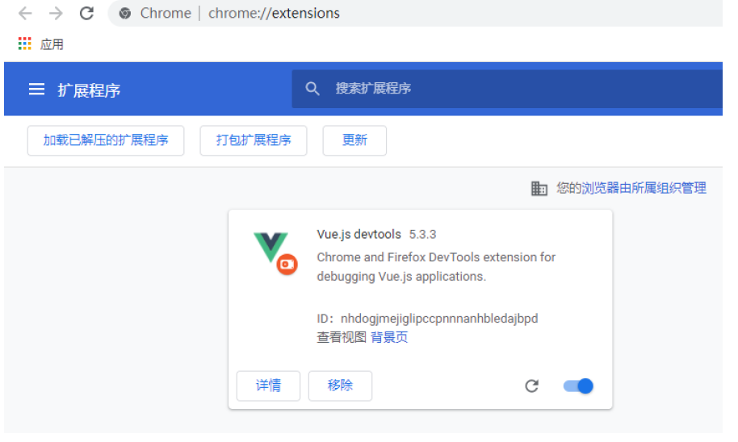

**（2）扩展程序的使用**

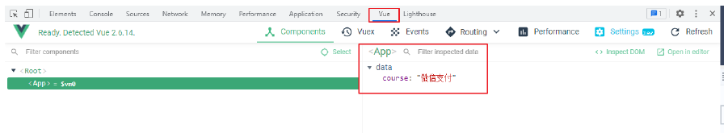

### 7.6、双向数据绑定

数据会绑定到组件，组件的改变也会影响数据定义

```vue
<p>
    <!-- 指令 -->
    <input type="text" v-model="course">
</p>
```

### 7.7、事件处理

**（1）定义事件**

```vue
// 定义方法
methods: {
    toPay(){
    	console.log('去支付')
    }
}
```

**（2）调用事件**

```vue
<p>
    <!-- 事件 -->
    <button @click="toPay()">去支付</button>
</p>
```

# 四、基础支付API V3

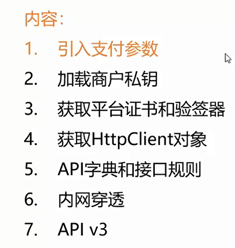

## 1、引入支付参数

### 1.1、定义微信支付相关参数

将资料文件夹中的 `wxpay.properties` 复制到resources目录中
这个文件定义了之前我们准备的微信支付相关的参数，例如商户号、APPID、API秘钥等等

```properties
# 微信支付相关参数
# 商户号
wxpay.mch-id=1558950191
# 商户API证书序列号
wxpay.mch-serial-no=34345964330B66427E0D3D28826C4993C77E631F
# 商户私钥文件
wxpay.private-key-path=apiclient_key.pem
# APIv3密钥
wxpay.api-v3-key=UDuLFDcmy5Eb6o0nTNZdu6ek4DDh4K8B
# APPID
wxpay.appid=wx74862e0dfcf69954
# 微信服务器地址
wxpay.domain=https://api.mch.weixin.qq.com
# 接收结果通知地址
wxpay.notify-domain=https://7d92-115-171-63-135.ngrok.io
```

### 1.2、读取支付参数

将资料文件夹中的 config 目录中的 WxPayConfig.java 复制到源码目录中。

```java
package com.atguigu.paymentdemo.config;

import lombok.Data;
import org.springframework.boot.context.properties.ConfigurationProperties;
import org.springframework.context.annotation.Configuration;
import org.springframework.context.annotation.PropertySource;


@Configuration
@PropertySource("classpath:wxpay.properties") //读取配置文件
@ConfigurationProperties(prefix="wxpay") //读取wxpay节点
@Data //使用set方法将wxpay节点中的值填充到当前类的属性中
public class WxPayConfig {

    /**商户号*/
    private String mchId;

    /**商户API证书序列号*/
    private String mchSerialNo;

    /**商户私钥文件*/
    private String privateKeyPath;

    /**APIv3密钥*/
    private String apiV3Key;

    /**APPID*/
    private String appid;

    /**微信服务器地址*/
    private String domain;

    /**接收结果通知地址*/
    private String notifyDomain;

}
```

### 1.3、测试支付参数的获取

在 controller 包中创建 TestController

```java
package com.atguigu.paymentdemo.controller;

import com.atguigu.paymentdemo.config.WxPayConfig;
import com.atguigu.paymentdemo.vo.R;
import io.swagger.annotations.Api;
import org.springframework.web.bind.annotation.GetMapping;
import org.springframework.web.bind.annotation.RequestMapping;
import org.springframework.web.bind.annotation.RestController;

import javax.annotation.Resource;

@Api(tags = "测试控制器")
@RestController
@RequestMapping("/api/test")
public class TestController {

    @Resource
    private WxPayConfig wxPayConfig;

    @GetMapping("/get-wx-pay-config")
    public R getWxPayConfig() {
        String mchId = wxPayConfig.getMchId();
        return R.ok().data("mchId", mchId);
    }
}
```

### 1.4、配置 Annotation Processor

优化：可以帮助我们生成自定义配置的元数据信息，让配置文件和Java代码之间的对应参数可以自动定位，方
便开发。

```xml
<dependency>
    <groupId>org.springframework.boot</groupId>
    <artifactId>spring-boot-configuration-processor</artifactId>
    <optional>true</optional>
</dependency>
```


### 1.5、在IDEA中设置 SpringBoot 配置文件

让IDEA可以识别配置文件，将配置文件的图标展示成SpringBoot的图标，同时配置文件的内容可以高
亮显示
File -> Project Structure -> Modules -> 选择小叶子  -->点击（+） 图标 -- >选中文件

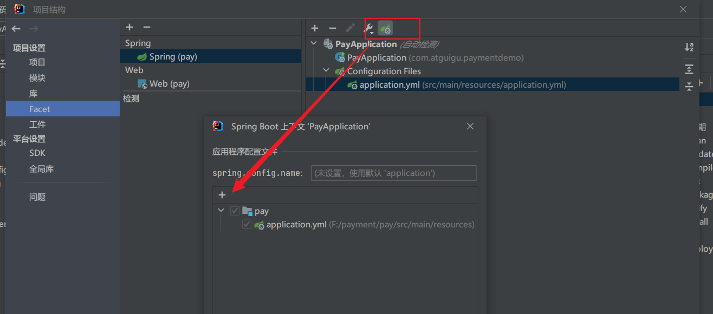

添加后点击确定  --> 即可实现wxpay.properties 配置项和配置类中自动跳转【颜色变化】

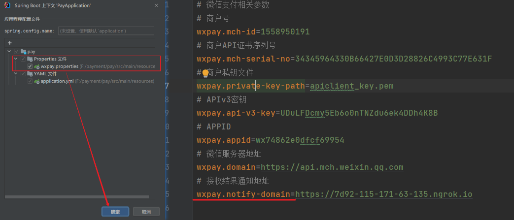

## 2、加载商户私钥

### 2.1、复制商户私钥

将下载的私钥文件复制到项目根目录下：

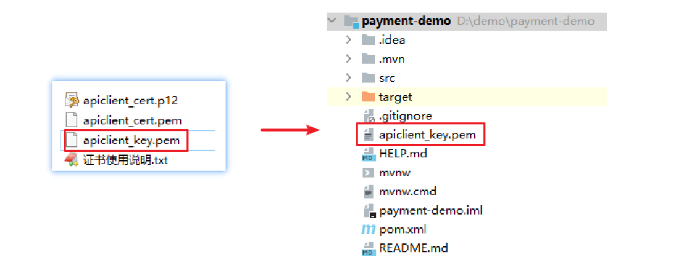

### 2.2、引入SDK

https://pay.weixin.qq.com/wiki/doc/apiv3/wechatpay/wechatpay6_0.shtml
我们可以使用官方提供的 SDK，帮助我们完成开发。实现了请求签名的生成和应答签名的验证。

github地址：https://github.com/wechatpay-apiv3/wechatpay-apache-httpclient

```xml
<!--微信支付SDK-->
<dependency>
    <groupId>com.github.wechatpay-apiv3</groupId>
    <artifactId>wechatpay-apache-httpclient</artifactId>
    <version>0.3.0</version>
</dependency>
```

### 2.3、获取商户私钥

https://github.com/wechatpay-apiv3/wechatpay-apache-httpclient （如何加载商户私钥

WxPayConfig

```java
/**
* 通过私钥证书  获取商户私钥
* @param filename
* @return
*/
public PrivateKey getPrivateKey(String filename){
    try {
         return PemUtil.loadPrivateKey(new FileInputStream(filename));
    } catch (FileNotFoundException e) {
    	throw new RuntimeException("私钥文件不存在", e);
    }
}
```

> 源码显示，把私钥证书的开始和结束替换掉，base64解码后，使用JDK的RAS加密工具，生成对应的私钥对象

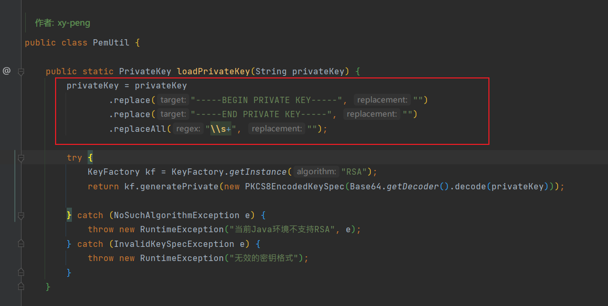


### 2.4、测试商户私钥的获取

在 PaymentDemoApplicationTests 测试类中添加如下方法，测试私钥对象是否能够获取出来。
（将前面的方法改成public的再进行测试）

```java
package com.atguigu.paymentdemo;

import com.atguigu.paymentdemo.config.WxPayConfig;
import org.junit.jupiter.api.Test;
import org.springframework.boot.test.context.SpringBootTest;

import javax.annotation.Resource;
import java.security.PrivateKey;

@SpringBootTest
class PaymentDemoApplicationTests {
    @Resource
    private WxPayConfig wxPayConfig;

    /**
     * 获取商户私钥
     */
    @Test
    public void testGetPrivateKey() {
        //获取私钥路径
        String privateKeyPath = wxPayConfig.getPrivateKeyPath();
        //获取商户私钥
        PrivateKey privateKey = wxPayConfig.getPrivateKey(privateKeyPath);
        System.out.println(privateKey);
    }
}
```

## 3、获取签名验证器和HttpClient

### 3.1、证书密钥使用说明

https://pay.weixin.qq.com/wiki/doc/apiv3_partner/wechatpay/wechatpay3_0.shtml

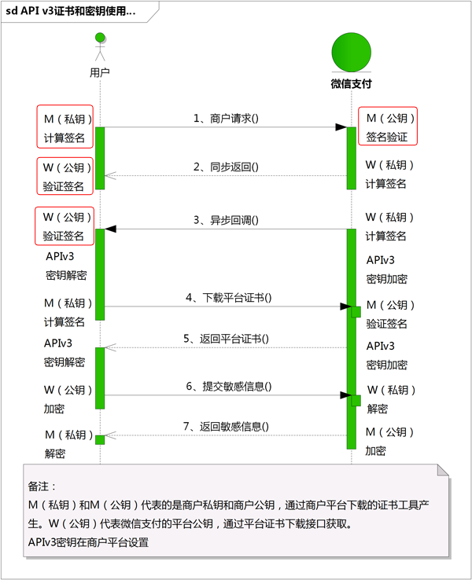

### 3.2、获取签名验证器

https://github.com/wechatpay-apiv3/wechatpay-apache-httpclient 

（定时更新平台证书功能）
平台证书：平台证书封装了微信的公钥，商户可以使用平台证书中的公钥进行验签。
签名验证器：帮助我们进行验签工作，我们单独将它定义出来，方便后面的开发。

```java
    /**
     * 获取签名验证器
     * 下载平台证书
     */
    @Bean
    public ScheduledUpdateCertificatesVerifier getVerifier() {
        //获取商户私钥
        PrivateKey privateKey = getPrivateKey(privateKeyPath);
        //私钥签名对象（签名）
        PrivateKeySigner privateKeySigner = new PrivateKeySigner(mchSerialNo,
                privateKey);
        //身份认证对象（验签）
        WechatPay2Credentials wechatPay2Credentials = new WechatPay2Credentials(mchId, privateKeySigner);
        // 使用定时更新的签名验证器，不需要传入证书
        ScheduledUpdateCertificatesVerifier verifier = new ScheduledUpdateCertificatesVerifier(
                wechatPay2Credentials,
                apiV3Key.getBytes(StandardCharsets.UTF_8)
        );
        return verifier;
    }
```

### 3.4、获取 HttpClient 对象

https://github.com/wechatpay-apiv3/wechatpay-apache-httpclient （定时更新平台证书功能）
HttpClient 对象：是建立远程连接的基础，我们通过SDK创建这个对象。

```java
    /**
     * 获取HttpClient对象  -- 请求带自动签名功能
     *
     * @param verifier
     * @return
     */
    @Bean
    public CloseableHttpClient getWxPayClient(ScheduledUpdateCertificatesVerifier verifier) {
        //获取商户私钥
        PrivateKey privateKey = getPrivateKey(privateKeyPath);


        //用于构造HttpClient
        WechatPayHttpClientBuilder builder = WechatPayHttpClientBuilder.create()
                .withMerchant(mchId, mchSerialNo, privateKey)
                .withValidator(new WechatPay2Validator(verifier));
        // ... 接下来，你仍然可以通过builder设置各种参数，来配置你的HttpClient
        // 通过WechatPayHttpClientBuilder构造的HttpClient，会自动的处理签名和验签，并进行证

        CloseableHttpClient httpClient = builder.build();
        return httpClient;
    }
```

## 4、API字典和相关工具

### 4.1、API列表

https://pay.weixin.qq.com/wiki/doc/apiv3/open/pay/chapter2_7_3.shtml
我们的项目中要实现以下所有API的功能。

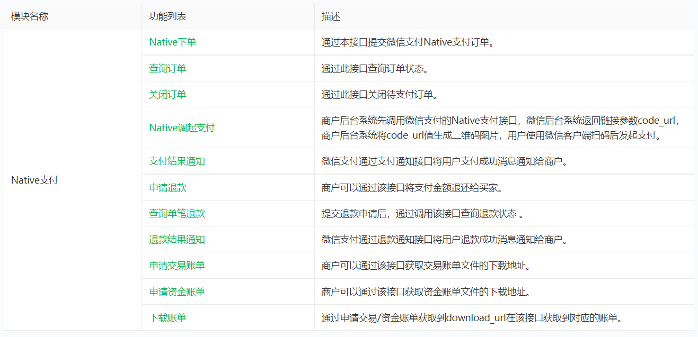

### 4.2、接口规则

https://pay.weixin.qq.com/wiki/doc/apiv3/wechatpay/wechatpay2_0.shtml
微信支付 APIv3 使用 JSON 作为消息体的数据交换格式。

```xml
<!--json处理-->
<dependency>
    <groupId>com.google.code.gson</groupId>
    <artifactId>gson</artifactId>
</dependency>
```

### 4.3、定义枚举

将资料文件夹中的 enums 目录复制到源码目录中。
为了开发方便，我们预先在项目中定义一些枚举。枚举中定义的内容包括接口地址，支付状态等信息。

#### WxApiType

```java
package com.atguigu.paymentdemo.enums.wxpay;

import lombok.AllArgsConstructor;
import lombok.Getter;

@AllArgsConstructor
@Getter
public enum WxApiType {

	/**
	 * Native下单
	 */
	NATIVE_PAY("/v3/pay/transactions/native"),

	/**
	 * 查询订单
	 */
	ORDER_QUERY_BY_NO("/v3/pay/transactions/out-trade-no/%s"),

	/**
	 * 关闭订单
	 */
	CLOSE_ORDER_BY_NO("/v3/pay/transactions/out-trade-no/%s/close"),

	/**
	 * 申请退款
	 */
	DOMESTIC_REFUNDS("/v3/refund/domestic/refunds"),

	/**
	 * 查询单笔退款
	 */
	DOMESTIC_REFUNDS_QUERY("/v3/refund/domestic/refunds/%s"),

	/**
	 * 申请交易账单
	 */
	TRADE_BILLS("/v3/bill/tradebill"),

	/**
	 * 申请资金账单
	 */
	FUND_FLOW_BILLS("/v3/bill/fundflowbill");


	/**
	 * 类型
	 */
	private final String type;
}

```

#### WxNotifyType

```java

package com.atguigu.paymentdemo.enums.wxpay;

import lombok.AllArgsConstructor;
import lombok.Getter;

@AllArgsConstructor
@Getter
public enum WxNotifyType {

	/**
	 * 支付通知
	 */
	NATIVE_NOTIFY("/api/wx-pay/native/notify"),


	/**
	 * 退款结果通知
	 */
	REFUND_NOTIFY("/api/wx-pay/refunds/notify");

	/**
	 * 类型
	 */
	private final String type;
}

```
#### WxRefundStatus

```java
package com.atguigu.paymentdemo.enums.wxpay;

import lombok.AllArgsConstructor;
import lombok.Getter;

@AllArgsConstructor
@Getter
public enum WxRefundStatus {

    /**
     * 退款成功
     */
    SUCCESS("SUCCESS"),

    /**
     * 退款关闭
     */
    CLOSED("CLOSED"),

    /**
     * 退款处理中
     */
    PROCESSING("PROCESSING"),

    /**
     * 退款异常
     */
    ABNORMAL("ABNORMAL");

    /**
     * 类型
     */
    private final String type;
}

```
#### WxTradeState

```java
package com.atguigu.paymentdemo.enums.wxpay;

import lombok.AllArgsConstructor;
import lombok.Getter;

@AllArgsConstructor
@Getter
public enum WxTradeState {

    /**
     * 支付成功
     */
    SUCCESS("SUCCESS"),

    /**
     * 未支付
     */
    NOTPAY("NOTPAY"),

    /**
     * 已关闭
     */
    CLOSED("CLOSED"),

    /**
     * 转入退款
     */
    REFUND("REFUND");

    /**
     * 类型
     */
    private final String type;
}

```
#### OrderStatus

```java
package com.atguigu.paymentdemo.enums;

import lombok.AllArgsConstructor;
import lombok.Getter;

@AllArgsConstructor
@Getter
public enum OrderStatus {
    /**
     * 未支付
     */
    NOTPAY("未支付"),


    /**
     * 支付成功
     */
    SUCCESS("支付成功"),

    /**
     * 已关闭
     */
    CLOSED("超时已关闭"),

    /**
     * 已取消
     */
    CANCEL("用户已取消"),

    /**
     * 退款中
     */
    REFUND_PROCESSING("退款中"),

    /**
     * 已退款
     */
    REFUND_SUCCESS("已退款"),

    /**
     * 退款异常
     */
    REFUND_ABNORMAL("退款异常");

    /**
     * 类型
     */
    private final String type;
}

```
#### PayType

```java
package com.atguigu.paymentdemo.enums;

import lombok.AllArgsConstructor;
import lombok.Getter;

@AllArgsConstructor
@Getter
public enum PayType {
    /**
     * 微信
     */
    WXPAY("微信"),


    /**
     * 支付宝
     */
    ALIPAY("支付宝");

    /**
     * 类型
     */
    private final String type;
}

```


### 4.4、添加工具类

将资料文件夹中的 util 目录复制到源码目录中，我们将会使用这些辅助工具简化项目的开发

#### HttpClientUtils

```java
package com.atguigu.paymentdemo.util;

import org.apache.http.Consts;
import org.apache.http.HttpEntity;
import org.apache.http.NameValuePair;
import org.apache.http.client.ClientProtocolException;
import org.apache.http.client.entity.UrlEncodedFormEntity;
import org.apache.http.client.methods.*;
import org.apache.http.conn.ssl.SSLConnectionSocketFactory;
import org.apache.http.conn.ssl.SSLContextBuilder;
import org.apache.http.conn.ssl.TrustStrategy;
import org.apache.http.entity.StringEntity;
import org.apache.http.impl.client.CloseableHttpClient;
import org.apache.http.impl.client.HttpClients;
import org.apache.http.message.BasicNameValuePair;
import org.apache.http.util.EntityUtils;

import javax.net.ssl.SSLContext;
import java.io.IOException;
import java.security.cert.CertificateException;
import java.security.cert.X509Certificate;
import java.text.ParseException;
import java.util.HashMap;
import java.util.LinkedList;
import java.util.List;
import java.util.Map;

/**
 * http请求客户端
 */
public class HttpClientUtils {
	private String url;
	private Map<String, String> param;
	private int statusCode;
	private String content;
	private String xmlParam;
	private boolean isHttps;

	public boolean isHttps() {
		return isHttps;
	}

	public void setHttps(boolean isHttps) {
		this.isHttps = isHttps;
	}

	public String getXmlParam() {
		return xmlParam;
	}

	public void setXmlParam(String xmlParam) {
		this.xmlParam = xmlParam;
	}

	public HttpClientUtils(String url, Map<String, String> param) {
		this.url = url;
		this.param = param;
	}

	public HttpClientUtils(String url) {
		this.url = url;
	}

	public void setParameter(Map<String, String> map) {
		param = map;
	}

	public void addParameter(String key, String value) {
		if (param == null)
			param = new HashMap<String, String>();
		param.put(key, value);
	}

	public void post() throws ClientProtocolException, IOException {
		HttpPost http = new HttpPost(url);
		setEntity(http);
		execute(http);
	}

	public void put() throws ClientProtocolException, IOException {
		HttpPut http = new HttpPut(url);
		setEntity(http);
		execute(http);
	}

	public void get() throws ClientProtocolException, IOException {
		if (param != null) {
			StringBuilder url = new StringBuilder(this.url);
			boolean isFirst = true;
			for (String key : param.keySet()) {
				if (isFirst) {
					url.append("?");
					isFirst = false;
				}else {
					url.append("&");
				}
				url.append(key).append("=").append(param.get(key));
			}
			this.url = url.toString();
		}
		HttpGet http = new HttpGet(url);
		execute(http);
	}

	/**
	 * set http post,put param
	 */
	private void setEntity(HttpEntityEnclosingRequestBase http) {
		if (param != null) {
			List<NameValuePair> nvps = new LinkedList<NameValuePair>();
			for (String key : param.keySet())
				nvps.add(new BasicNameValuePair(key, param.get(key))); // 参数
			http.setEntity(new UrlEncodedFormEntity(nvps, Consts.UTF_8)); // 设置参数
		}
		if (xmlParam != null) {
			http.setEntity(new StringEntity(xmlParam, Consts.UTF_8));
		}
	}

	private void execute(HttpUriRequest http) throws ClientProtocolException,
			IOException {
		CloseableHttpClient httpClient = null;
		try {
			if (isHttps) {
				SSLContext sslContext = new SSLContextBuilder()
						.loadTrustMaterial(null, new TrustStrategy() {
							// 信任所有
							public boolean isTrusted(X509Certificate[] chain,
									String authType)
									throws CertificateException {
								return true;
							}
						}).build();
				SSLConnectionSocketFactory sslsf = new SSLConnectionSocketFactory(
						sslContext);
				httpClient = HttpClients.custom().setSSLSocketFactory(sslsf)
						.build();
			} else {
				httpClient = HttpClients.createDefault();
			}
			CloseableHttpResponse response = httpClient.execute(http);
			try {
				if (response != null) {
					if (response.getStatusLine() != null)
						statusCode = response.getStatusLine().getStatusCode();
					HttpEntity entity = response.getEntity();
					// 响应内容
					content = EntityUtils.toString(entity, Consts.UTF_8);
				}
			} finally {
				response.close();
			}
		} catch (Exception e) {
			e.printStackTrace();
		} finally {
			httpClient.close();
		}
	}

	public int getStatusCode() {
		return statusCode;
	}

	public String getContent() throws ParseException, IOException {
		return content;
	}

}
```

#### OrderNoUtils

```java
package com.atguigu.paymentdemo.util;

import java.text.SimpleDateFormat;
import java.util.Date;
import java.util.Random;

/**
 * 订单号工具类
 *
 * @author qy
 * @since 1.0
 */
public class OrderNoUtils {

    /**
     * 获取订单编号
     * @return
     */
    public static String getOrderNo() {
        return "ORDER_" + getNo();
    }

    /**
     * 获取退款单编号
     * @return
     */
    public static String getRefundNo() {
        return "REFUND_" + getNo();
    }

    /**
     * 获取编号
     * @return
     */
    public static String getNo() {
        SimpleDateFormat sdf = new SimpleDateFormat("yyyyMMddHHmmss");
        String newDate = sdf.format(new Date());
        String result = "";
        Random random = new Random();
        for (int i = 0; i < 3; i++) {
            result += random.nextInt(10);
        }
        return newDate + result;
    }

}
```

## 5、Native下单API

### 5.1、Native支付流程

https://pay.weixin.qq.com/wiki/doc/apiv3/apis/chapter3_4_4.shtml

用户点击生成订单按钮后，后台系统生成订单

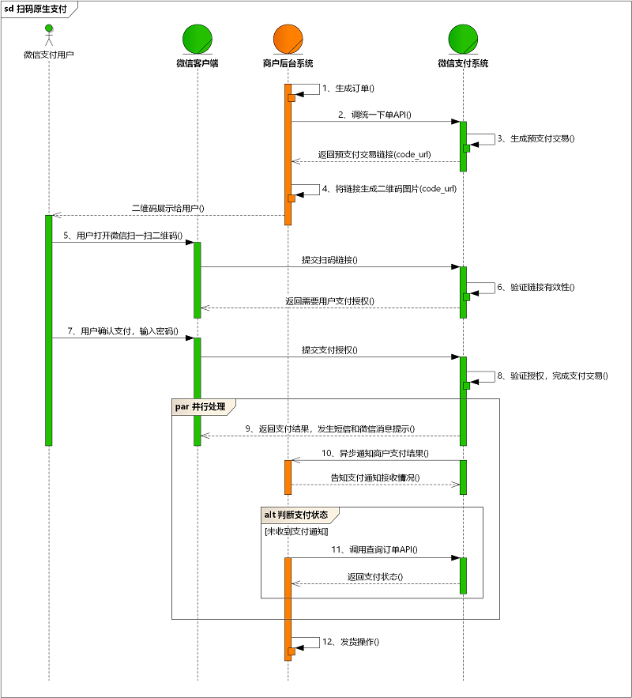

### 5.2、Native下单API

https://pay.weixin.qq.com/wiki/doc/apiv3/apis/chapter3_4_1.shtml
商户端发起支付请求，微信端创建支付订单并生成支付二维码链接，微信端将支付二维码返回给商户端，商户端显示支付二维码，用户使用微信客户端扫码后发起支付。

#### （1）创建 WxPayController

```java
package com.atguigu.paymentdemo.controller;

import io.swagger.annotations.Api;
import lombok.extern.slf4j.Slf4j;
import org.springframework.web.bind.annotation.CrossOrigin;
import org.springframework.web.bind.annotation.RequestMapping;
import org.springframework.web.bind.annotation.RestController;

@Api(tags = "网站微信支付")
@CrossOrigin
@RestController
@RequestMapping("/api/wx-pay")
@Slf4j
public class WxPayController {
    
}

```

#### （2）创建 WxPayService

接口

```java
package com.atguigu.paymentdemo.service;

public interface WxPayService {
}
```

实现

```java
package com.atguigu.paymentdemo.service.impl;

import com.atguigu.paymentdemo.service.WxPayService;
import lombok.extern.slf4j.Slf4j;
import org.springframework.stereotype.Service;

@Service
@Slf4j
public class WxPayServiceImpl implements WxPayService {
}
```

#### （3）定义WxPayController方法

```java
    @Resource
    private WxPayService wxPayService;

    /**
     * Native下单
     *
     * @param productId
     * @return 返回支付二维码连接和订单号
     * @throws Exception
     */
    @ApiOperation("调用统一下单API，生成支付二维码")
    @PostMapping("/native/{productId}")
    public R nativePay(@PathVariable Long productId) throws Exception {
        log.info("发起支付请求");
        //返回支付二维码连接和订单号
        Map<String, Object> map = wxPayService.nativePay(productId);
        return R.ok().setData(map);
    }
```

R对象中添加 @Accessors(chain = true)，使其可以链式操作

```java
@Data
@Accessors(chain = true) //链式操作
public class R {
```

#### （4）定义WxPayService方法

> 参考：
> API字典 -> 基础支付 -> Native支付 -> Native下单：
> https://pay.weixin.qq.com/wiki/doc/apiv3/apis/chapter3_4_1.shtml
> 指引文档 -> 基础支付 -> Native支付 -> 开发指引 ->【服务端】Native下单：
> https://pay.weixin.qq.com/wiki/doc/apiv3/open/pay/chapter2_7_2.shtml

接口

```java
    /**
     * 创建订单，调用Native支付接口
     *
     * @param productId
     * @return code_url 和 订单号
     * @throws Exception
     */
    Map<String, Object> nativePay(Long productId) throws IOException;
```

实现

```java
    @Resource
    private WxPayConfig wxPayConfig;
    @Resource
    private CloseableHttpClient wxPayClient;  

	/**
     * 创建订单，调用Native支付接口
     *
     * @param productId
     * @return code_url 和 订单号
     * @throws Exception
     */
    @Override
    public Map<String, Object> nativePay(Long productId) throws Exception {
        log.info("生成订单");
        //生成订单
        OrderInfo orderInfo = new OrderInfo();
        orderInfo.setTitle("test");
        orderInfo.setOrderNo(OrderNoUtils.getOrderNo()); //订单号
        orderInfo.setProductId(productId);
        orderInfo.setTotalFee(1); //分
        orderInfo.setOrderStatus(OrderStatus.NOTPAY.getType());
        //TODO：存入数据库
        log.info("调用统一下单API");
        //调用统一下单API
        String uri = wxPayConfig.getDomain().concat(WxApiType.NATIVE_PAY.getType());
        HttpPost httpPost = new HttpPost(uri);

         // 请求body参数
        Gson gson = new Gson();
        Map<String,Object> paramsMap = new HashMap<>();
        paramsMap.put("appid", wxPayConfig.getAppid());//应用ID
        paramsMap.put("mchid", wxPayConfig.getMchId());//直连商户号
        paramsMap.put("description", orderInfo.getTitle());//商品描述
        paramsMap.put("out_trade_no", orderInfo.getOrderNo());//商户订单号
        //支付成功微信回调本系统地址  需要内网穿透
        paramsMap.put("notify_url", wxPayConfig.getNotifyDomain().concat(WxNotifyType.NATIVE_NOTIFY.getType()));//通知地址

        Map<String, Object> amountMap = new HashMap<>();
        paramsMap.put("amount", amountMap);//订单金额
            amountMap.put("total", orderInfo.getTotalFee());//总金额
            amountMap.put("currency", "CNY");//货币类型
        
         //将参数转换成json字符串
        String jsonParams = gson.toJson(paramsMap);
        log.info("请求参数 ===> {}" + jsonParams);
        StringEntity entity = new StringEntity(jsonParams, "utf-8");

        //请求头
        entity.setContentType("application/json");
        httpPost.setEntity(entity);
        httpPost.setHeader("Accept", "application/json");
        
        //完成签名并执行请求
        CloseableHttpResponse response = wxPayClient.execute(httpPost);
        try {
            String bodyAsString = EntityUtils.toString(response.getEntity());//响应体
            int statusCode = response.getStatusLine().getStatusCode();//响应状态码
            if (statusCode == 200) { //处理成功
                log.info("成功, 返回结果 = " + bodyAsString);
            } else if (statusCode == 204) { //处理成功，无返回Body
                log.info("成功");
            } else {
                log.info("Native下单失败,响应码 = " + statusCode + ",返回结果 = " +
                        bodyAsString);
                throw new IOException("request failed");
            }
            //响应结果
            Map<String, String> resultMap = gson.fromJson(bodyAsString,
                    HashMap.class);
            //二维码
            String codeUrl = resultMap.get("code_url");
            Map<String, Object> map = new HashMap<>();
            map.put("codeUrl", codeUrl);
            map.put("orderNo", orderInfo.getOrderNo());
            return map;
        } finally {
            response.close();
        }
    }
```

#### 前端

使用`*"vue-qriously"*: "^1.1.1",`将url渲染成二维码形式

```vue
<template>
  <div class="bg-fa of">
    <section id="index" class="container">
      <header class="comm-title">
        <h2 class="fl tac">
          <span class="c-333">课程列表</span>
        </h2>
      </header>
      <ul>
        <li v-for="product in productList" :key="product.id">
          <a :class="['orderBtn', {current:payOrder.productId === product.id}]" 
            @click="selectItem(product.id)" 
            href="javascript:void(0);" >
            {{product.title}} 
            ¥{{product.price / 100}}
          </a>
        </li>
      </ul>

      
      <div class="PaymentChannel_payment-channel-panel">
        <h3 class="PaymentChannel_title"> 
          选择支付方式 
        </h3>
        <div class="PaymentChannel_channel-options" >

          <!-- 选择微信 -->
          <div :class="['ChannelOption_payment-channel-option', {current:payOrder.payType === 'wxpay'}]"
          @click="selectPayType('wxpay')">
            <div class="ChannelOption_channel-icon">
              
            </div>
            <div class="ChannelOption_channel-info">
              <div class="ChannelOption_channel-label">
                <div class="ChannelOption_label">微信支付</div>
                <div class="ChannelOption_sub-label"></div>
                <div class="ChannelOption_check-option"></div>
              </div>
            </div>
          </div>

          <!-- 选择支付宝 -->
          <div :class="['ChannelOption_payment-channel-option', {current:payOrder.payType === 'alipay'}]"
          @click="selectPayType('alipay')">
            <div class="ChannelOption_channel-icon">
              
            </div>
            <div class="ChannelOption_channel-info">
              <div class="ChannelOption_channel-label">
                <div class="ChannelOption_label">支付宝</div>
                <div class="ChannelOption_sub-label"></div>
                <div class="ChannelOption_check-option"></div>
              </div>
            </div>
          </div>

        </div>
      </div>

      <div class="payButtom">
        <el-button 
        :disabled="payBtnDisabled"
        type="warning" 
        round 
        style="width: 180px;height: 44px;font-size: 18px;"
        @click="toPay()">
          确认支付
        </el-button>
      </div>
    </section>

    <!-- 微信支付二维码 -->
    <el-dialog
      :visible.sync="codeDialogVisible"
      :show-close="false"
      @close="closeDialog"
      width="350px"
      center>
     <qriously :value="codeUrl" :size="300"/>
        <!-- <br> -->
        使用微信扫码支付
    </el-dialog>
  </div>
</template>

<script>
import productApi from '../api/product'
import wxPayApi from '../api/wxPay'
import orderInfoApi from '../api/orderInfo'

export default {

  data () {
    return {
      payBtnDisabled: false, //确认支付按钮是否禁用
      codeDialogVisible: false, //微信支付二维码弹窗
      productList: [], //商品列表
      payOrder: { //订单信息
        productId: '', //商品id
        payType: 'wxpay' //支付方式
      },
      codeUrl: '', // 二维码
      orderNo: '', //订单号
      timer: null // 定时器
    }
  },

  created () {
    //获取商品列表
    productApi.list().then(response => {
      this.productList = response.data.productList
      this.payOrder.productId = this.productList[0].id
    })
  },
  
  methods: {
    //选择商品
    selectItem(productId) {
      console.log('商品id：' + productId)
      this.payOrder.productId = productId
      console.log(this.payOrder)
      //this.$router.push({ path: '/order' })
    },

    //选择支付方式
    selectPayType(type) {
      console.log('支付方式：' + type)
      this.payOrder.payType = type
      //this.$router.push({ path: '/order' })
    },

    //确认支付
    toPay(){
      this.payBtnDisabled = true

      //微信支付
      if(this.payOrder.payType === 'wxpay'){
          //调用统一下单接口
        wxPayApi.nativePay(this.payOrder.productId).then(response => {
          this.codeUrl = response.data.codeUrl
          this.orderNo = response.data.orderNo
          this.codeDialogVisible = true

          // 启动定时器
          this.timer = setInterval(() => {
            this.queryOrderStatus()
          }, 3000)
        })
      }
    },

    //关闭微信支付二维码对话框时启用“确认支付”按钮
    closeDialog(){
      console.log('close.................')
      this.payBtnDisabled = false
      console.log('清除定时器')
      clearInterval(this.timer)
    },


    // 查询订单状态
    queryOrderStatus() {

      orderInfoApi.queryOrderStatus(this.orderNo).then(response => {
        console.log('查询订单状态：' + response.code)

        // 支付成功后的页面跳转
        if (response.code === 0) {
          console.log('清除定时器')
          clearInterval(this.timer)
          // 三秒后跳转到订单列表
          setTimeout(() => {
            this.$router.push({ path: '/orders' })
          }, 3000)
        }
      })
    }
  }
}
</script>
```

### 5.3、签名和验签源码解析

#### （1）签名原理

开启debug日志

```yaml
logging:
    level:
        root: debug
```


微信支付API v3 要求商户对请求进行签名。微信支付会在收到请求后进行签名的验证。如果签名验证不通过，微信支付API v3将会拒绝处理请求，并返回`401 Unauthorized`。

**签名生成流程：**
https://pay.weixin.qq.com/wiki/doc/apiv3/wechatpay/wechatpay4_0.shtml
签名生成流程：

1. **构造签名串**

   ```sh
   HTTP请求方法\n
   URL\n
   请求时间戳\n   # 时间发送和接收时间不能超过5min，防止拦截处理。【注意本地系统时间】
   请求随机串\n
   请求报文主体\n
   
   示例：
   GET\n/v3/certificates\n1554208460\n593BEC0C930BF1AFEB40B4A08C8FB242\n\n
   ```

2. **计算签名值**

   使用商户私钥对*待签名串*进行SHA256 with RSA签名，并对签名结果进行*Base64编码*得到签名值。

   > ```sh
   > $ echo -n -e \
   > "GET\n/v3/certificates\n1554208460\n593BEC0C930BF1AFEB40B4A08C8FB242\n\n" \
   > | openssl dgst -sha256 -sign apiclient_key.pem \  # sha256加密算法  apiclient_key.pem私钥文件
   > | openssl base64 -A  # 对签名结果base64编码
   > 
   > uOVRnA4qG/MNnYzdQxJanN+zU+lTgIcnU9BxGw5dKjK+VdEUz2FeIoC+D5sB/LN+nGzX3hfZg6r5wT1pl2ZobmIc6p0ldN7J6yDgUzbX8Uk3sD4a4eZVPTBvqNDoUqcYMlZ9uuDdCvNv4TM3c1WzsXUrExwVkI1XO5jCNbgDJ25nkT/c1gIFvqoogl7MdSFGc4W4xZsqCItnqbypR3RuGIlR9h9vlRsy7zJR9PBI83X8alLDIfR1ukt1P7tMnmogZ0cuDY8cZsd8ZlCgLadmvej58SLsIkVxFJ8XyUgx9FmutKSYTmYtWBZ0+tNvfGmbXU7cob8H/4nLBiCwIUFluw==   
   > ```

3. **设置HTTP头**

   微信支付商户API v3要求请求通过`HTTP Authorization`头来传递签名。` Authorization`由*认证类型*和*签名信息*两个部分组成。

   `Authorization: 认证类型 签名信息`

   1.认证类型，目前为WECHATPAY2-SHA256-RSA2048

   2.签名信息

   - 发起请求的商户（包括直连商户、服务商或渠道商）的商户号` mchid`
   - [商户API证书](https://pay.weixin.qq.com/wiki/doc/apiv3/wechatpay/wechatpay3_1.shtml)`序列号serial_no`，用于[声明所使用的证书](https://pay.weixin.qq.com/wiki/doc/apiv3/wechatpay/wechatpay3_1.shtml#part-3)
   - 请求随机串`nonce_str`
   - 时间戳`timestamp`
   - 签名值`signature`
   - 注：以上五项签名信息，无顺序要求。

   - 实例如下：

   ```sh
   Authorization: WECHATPAY2-SHA256-RSA2048 mchid="1900009191",nonce_str="593BEC0C930BF1AFEB40B4A08C8FB242",signature="uOVRnA4qG/MNnYzdQxJanN+zU+lTgIcnU9BxGw5dKjK+VdEUz2FeIoC+D5sB/LN+nGzX3hfZg6r5wT1pl2ZobmIc6p0ldN7J6yDgUzbX8Uk3sD4a4eZVPTBvqNDoUqcYMlZ9uuDdCvNv4TM3c1WzsXUrExwVkI1XO5jCNbgDJ25nkT/c1gIFvqoogl7MdSFGc4W4xZsqCItnqbypR3RuGIlR9h9vlRsy7zJR9PBI83X8alLDIfR1ukt1P7tMnmogZ0cuDY8cZsd8ZlCgLadmvej58SLsIkVxFJ8XyUgx9FmutKSYTmYtWBZ0+tNvfGmbXU7cob8H/4nLBiCwIUFluw==",timestamp="1554208460",serial_no="1DDE55AD98ED71D6EDD4A4A16996DE7B47773A8C"
   ```

**签名生成对应源码：**

`com.wechat.pay.contrib.apache.httpclient.SignatureExec`

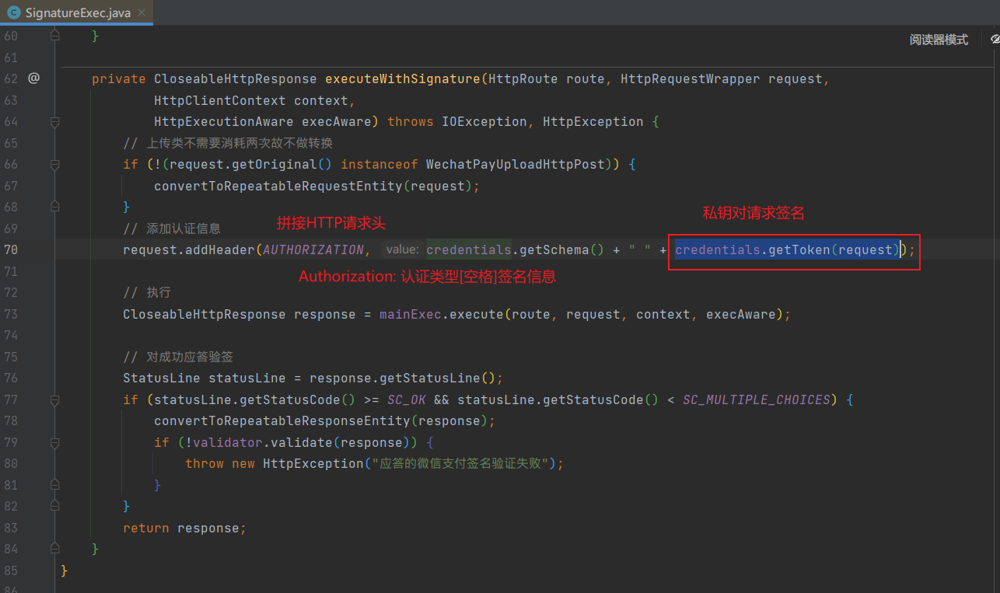

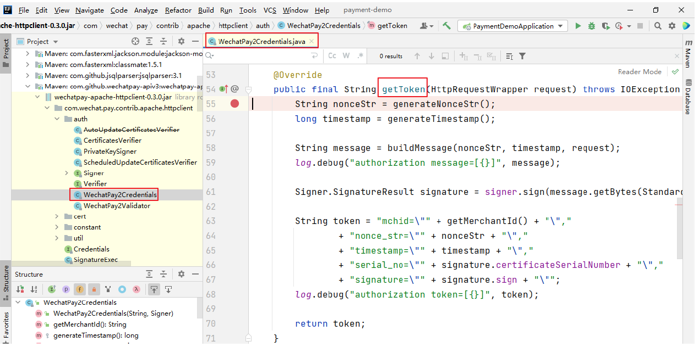

#### （2）验签原理

微信支付会在回调的HTTP头部中包括回调报文的签名。商户*必须* 验证回调的签名，以**确保回调是由微信支付发送**。【微信私钥 应答签名  --> 商户使用微信 平台证书[公钥验签]】

**签名验证流程：**
https://pay.weixin.qq.com/wiki/doc/apiv3/wechatpay/wechatpay4_1.shtml

1. 获取平台证书

   微信支付API v3使用*微信支付* 的平台私钥（不是*商户私钥* ）进行应答签名。相应的，商户的技术人员应使用微信支付平台证书中的公钥验签。目前平台证书只提供API进行下载

2. 检查平台证书序列号

3. 构造验签名串：从微信应答报文中提取出  `应答时间戳\n+应答随机串\n+应答报文主体\n`，拼接用于验签

   如某个应答的HTTP报文为（省略了ciphertext的具体内容）：

   ```sh
   HTTP/1.1 200 OK
   Server: nginx
   Date: Tue, 02 Apr 2019 12:59:40 GMT
   Content-Type: application/json; charset=utf-8
   Content-Length: 2204
   Connection: keep-alive
   Keep-Alive: timeout=8
   Content-Language: zh-CN
   Request-ID: e2762b10-b6b9-5108-a42c-16fe2422fc8a
   Wechatpay-Nonce: c5ac7061fccab6bf3e254dcf98995b8c   
   Wechatpay-Signature: CtcbzwtQjN8rnOXItEBJ5aQFSnIXESeV28Pr2YEmf9wsDQ8Nx25ytW6FXBCAFdrr0mgqngX3AD9gNzjnNHzSGTPBSsaEkIfhPF4b8YRRTpny88tNLyprXA0GU5ID3DkZHpjFkX1hAp/D0fva2GKjGRLtvYbtUk/OLYqFuzbjt3yOBzJSKQqJsvbXILffgAmX4pKql+Ln+6UPvSCeKwznvtPaEx+9nMBmKu7Wpbqm/+2ksc0XwjD+xlvlECkCxfD/OJ4gN3IurE0fpjxIkvHDiinQmk51BI7zQD8k1znU7r/spPqB+vZjc5ep6DC5wZUpFu5vJ8MoNKjCu8wnzyCFdA==
   Wechatpay-Timestamp: 1554209980   # 时间戳
   Wechatpay-Serial: 5157F09EFDC096DE15EBE81A47057A7232F1B8E1  # 随机串
   Cache-Control: no-cache, must-revalidate
   
   {"data":[{"serial_no":"5157F09EFDC096DE15EBE81A47057A7232F1B8E1","effective_time":"2018-03-26T11:39:50+08:00","expire_time":"2023-03-25T11:39:50+08:00","encrypt_certificate":{"algorithm":"AEAD_AES_256_GCM","nonce":"4de73afd28b6","associated_data":"certificate","ciphertext":"..."}}]}   # 应答主体
                 
   ```

   则验签名串拼接为

   ```sh
   1554209980
   c5ac7061fccab6bf3e254dcf98995b8c
   {"data":[{"serial_no":"5157F09EFDC096DE15EBE81A47057A7232F1B8E1","effective_time":"2018-03-26T11:39:50+08:00","expire_time":"2023-03-25T11:39:50+08:00","encrypt_certificate":{"algorithm":"AEAD_AES_256_GCM","nonce":"4de73afd28b6","associated_data":"certificate","ciphertext":"..."}}]}
   ```

4. 获取应答签名

   微信支付的应答签名通过HTTP头`Wechatpay-Signature`传递。（注意，示例因为排版可能存在换行，实际数据应在一行）,对` Wechatpay-Signature`的字段值使用Base64进行解码，得到应答签名。

   ```
   Wechatpay-Signature: CtcbzwtQjN8rnOXItEBJ5aQFSnIXESeV28Pr2YEmf9wsDQ8Nx25ytW6FXBCAFdrr0mgqngX3AD9gNzjnNHzSGTPBSsaEkIfhPF4b8YRRTpny88tNLyprXA0GU5ID3DkZHpjFkX1hAp/D0fva2GKjGRLtvYbtUk/OLYqFuzbjt3yOBzJSKQqJsvbXILffgAmX4pKql+Ln+6UPvSCeKwznvtPaEx+9nMBmKu7Wpbqm/+2ksc0XwjD+xlvlECkCxfD/OJ4gN3IurE0fpjxIkvHDiinQmk51BI7zQD8k1znU7r/spPqB+vZjc5ep6DC5wZUpFu5vJ8MoNKjCu8wnzyCFdA==
   ```

5. 验证签名

   很多编程语言的签名验证函数支持对*验签名串和签名* 进行签名验证。强烈建议商户调用该类函数，使用微信支付平台公钥对*验签名串和签名*进行SHA256 with RSA签名验证。

   下面展示使用命令行演示如何进行验签。假设我们已经获取了平台证书并保存为`1900009191_wxp_cert.pem` 。

   首先，从微信支付平台证书导出微信支付平台公钥

   ```sh
   $ openssl x509 -in 1900009191_wxp_cert.pem -pubkey -noout > 1900009191_wxp_pub.pem
   $ cat 1900009191_wxp_pub.pem
   -----BEGIN PUBLIC KEY-----
   MIIBIjANBgkqhkiG9w0BAQEFAAOCAQ8AMIIBCgKCAQEA4zej1cqugGQtVSY2Ah8R
   MCKcr2UpZ8Npo+5Ja9xpFPYkWHaF1Gjrn3d5kcwAFuHHcfdc3yxDYx6+9grvJnCA
   2zQzWjzVRa3BJ5LTMj6yqvhEmtvjO9D1xbFTA2m3kyjxlaIar/RYHZSslT4VmjIa
   tW9KJCDKkwpM6x/RIWL8wwfFwgz2q3Zcrff1y72nB8p8P12ndH7GSLoY6d2Tv0OB
   2+We2Kyy2+QzfGXOmLp7UK/pFQjJjzhSf9jxaWJXYKIBxpGlddbRZj9PqvFPTiep
   8rvfKGNZF9Q6QaMYTpTp/uKQ3YvpDlyeQlYe4rRFauH3mOE6j56QlYQWivknDX9V
   rwIDAQAB
   -----END PUBLIC KEY-----
   ```

   Java支持使用证书初始化签名对象，详见 [initVerify(Certificate)](https://docs.oracle.com/javase/8/docs/api/java/security/Signature.html#initVerify-java.security.cert.Certificate-)，并不需要先导出公钥。

   然后，把签名base64解码后保存为文件`signature.txt`

   ```sh
   $ openssl base64 -d -A <<< \ 'CtcbzwtQjN8rnOXItEBJ5aQFSnIXESeV28Pr2YEmf9wsDQ8Nx25ytW6FXBCAFdrr0mgqngX3AD9gNzjnNHzSGTPBSsaEkIfhPF4b8YRRTpny88tNLyprXA0GU5ID3DkZHpjFkX1hAp/D0fva2GKjGRLtvYbtUk/OLYqFuzbjt3yOBzJSKQqJsvbXILffgAmX4pKql+Ln+6UPvSCeKwznvtPaEx+9nMBmKu7Wpbqm/+2ksc0XwjD+xlvlECkCxfD/OJ4gN3IurE0fpjxIkvHDiinQmk51BI7zQD8k1znU7r/spPqB+vZjc5ep6DC5wZUpFu5vJ8MoNKjCu8wnzyCFdA==' > signature.txt
   ```

   最后，验证签名【公钥解密应答签名  -->  与验签名串比对】

   ```sh
   $ openssl dgst -sha256 -verify 1900009191_wxp_pub.pem -signature signature.txt << EOF
   1554209980
   c5ac7061fccab6bf3e254dcf98995b8c
   {"data":[{"serial_no":"5157F09EFDC096DE15EBE81A47057A7232F1B8E1","effective_time":"2018-03-26T11:39:50+08:00","expire_time":"2023-03-25T11:39:50+08:00","encrypt_certificate":{"algorithm":"AEAD_AES_256_GCM","nonce":"d215b0511e9c","associated_data":"certificate","ciphertext":"..."}}]}
   EOF
   Verified OK
   ```

   


**签名验证源码：**

下载和更新验签需要的平台证书：--> 解析出公钥

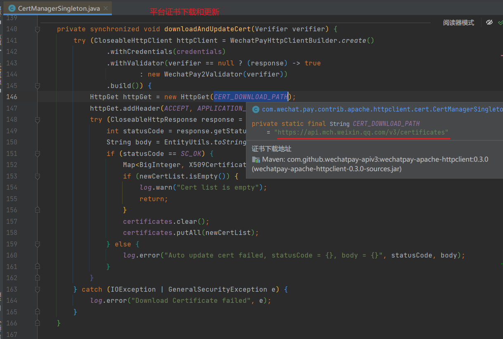

验签入口：

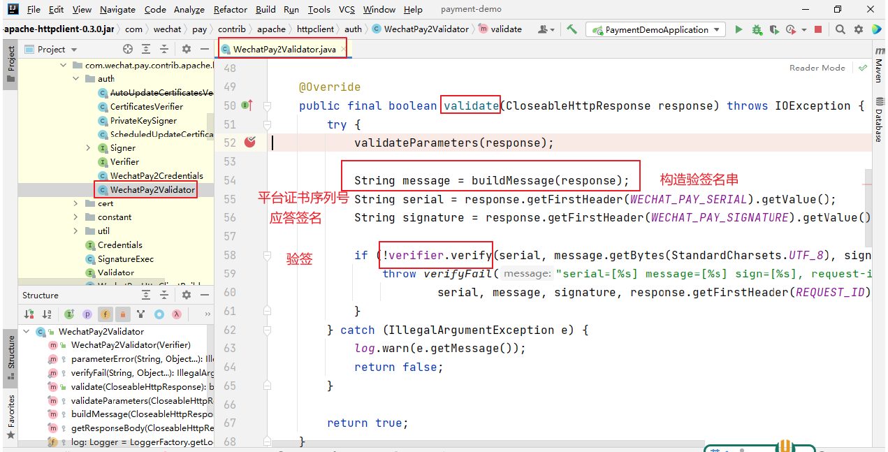


### 5.4、创建课程订单

#### （1）保存订单

OrderInfoService
接口：

```java
OrderInfo createOrderByProductId(Long productId);
```

实现：

```java
	@Resource
    private ProductMapper productMapper;

    @Override
    public OrderInfo createOrderByProductId(Long productId) {

        //查找已存在但未支付的订单
        OrderInfo orderInfo = this.getNoPayOrderByProductId(productId);
        if (orderInfo != null) {
            return orderInfo;
        }
        //获取商品信息
        Product product = productMapper.selectById(productId);
        //生成订单
        orderInfo = new OrderInfo();
        orderInfo.setTitle(product.getTitle());
        orderInfo.setOrderNo(OrderNoUtils.getOrderNo()); //订单号
        orderInfo.setProductId(productId);
        orderInfo.setTotalFee(product.getPrice()); //分
        orderInfo.setOrderStatus(OrderStatus.NOTPAY.getType());
        baseMapper.insert(orderInfo);
        return orderInfo;
    }
```

查找未支付订单：OrderInfoService中添加辅助方法

```java
    /**
     * 根据商品id查询未支付订单
     * 防止重复创建订单对象
     *
     * @param productId
     * @return
     */
    private OrderInfo getNoPayOrderByProductId(Long productId) {
        QueryWrapper<OrderInfo> queryWrapper = new QueryWrapper<>();
        queryWrapper.eq("product_id", productId);
        queryWrapper.eq("order_status", OrderStatus.NOTPAY.getType());
        // queryWrapper.eq("user_id", userId);
        OrderInfo orderInfo = baseMapper.selectOne(queryWrapper);
        return orderInfo;
    }
```

#### （2）缓存二维码

OrderInfoService
接口：

```java
void saveCodeUrl(String orderNo, String codeUrl);
```

实现

```java
    /**
     * 存储订单二维码
     *
     * @param orderNo
     * @param codeUrl
     */
    @Override
    public void saveCodeUrl(String orderNo, String codeUrl) {
        QueryWrapper<OrderInfo> queryWrapper = new QueryWrapper<>();
        queryWrapper.eq("order_no", orderNo);
        OrderInfo orderInfo = new OrderInfo();
        orderInfo.setCodeUrl(codeUrl);
        baseMapper.update(orderInfo, queryWrapper);
    }
```

#### （3）修改WxPayServiceImpl 的 nativePay 方法

```java
@Resource
private OrderInfoService orderInfoService;
/**
* 创建订单，调用Native支付接口
* @param productId
* @return code_url 和 订单号
* @throws Exception
*/
@Override
public Map<String, Object> nativePay(Long productId) throws Exception {

	log.info("生成订单");
	//生成订单
	OrderInfo orderInfo = orderInfoService.createOrderByProductId(productId);
	String codeUrl = orderInfo.getCodeUrl();
	if(orderInfo != null && !StringUtils.isEmpty(codeUrl)){
		log.info("订单已存在，二维码已保存");
		//返回二维码
		Map<String, Object> map = new HashMap<>();
		map.put("codeUrl", codeUrl);
		map.put("orderNo", orderInfo.getOrderNo());
		return map;
	}
	log.info("调用统一下单API");

	//其他代码。。。。。。
	try {
		//其他代码。。。。。。
		//保存二维码
		String orderNo = orderInfo.getOrderNo();
		orderInfoService.saveCodeUrl(orderNo, codeUrl);
		//返回二维码
		//其他代码。。。。。。
	} finally {
		response.close();
	}
}
```

### 5.5、显示订单列表

在我的订单页面按时间倒序显示订单列表

#### （1）创建OrderInfoController

```java
package com.atguigu.paymentdemo.controller;

import com.atguigu.paymentdemo.entity.OrderInfo;
import com.atguigu.paymentdemo.enums.OrderStatus;
import com.atguigu.paymentdemo.service.OrderInfoService;
import com.atguigu.paymentdemo.vo.R;
import io.swagger.annotations.Api;
import io.swagger.annotations.ApiOperation;
import org.springframework.web.bind.annotation.*;

import javax.annotation.Resource;
import java.util.List;

@CrossOrigin //开放前端的跨域访问
@Api(tags = "商品订单管理")
@RestController
@RequestMapping("/api/order-info")
public class OrderInfoController {

    @Resource
    private OrderInfoService orderInfoService;

    @ApiOperation("订单列表")
    @GetMapping("/list")
    public R list(){

        List<OrderInfo> list = orderInfoService.listOrderByCreateTimeDesc();
        return R.ok().data("list", list);
    }
}
```

#### （2）定义 OrderInfoService 方法

接口

```java
List<OrderInfo> listOrderByCreateTimeDesc();
```

实现

```java
    /**
     * 查询订单列表，并倒序查询
     *
     * @return
     */
    @Override
    public List<OrderInfo> listOrderByCreateTimeDesc() {
        QueryWrapper<OrderInfo> queryWrapper = new QueryWrapper<OrderInfo>
                ().orderByDesc("create_time");
        return baseMapper.selectList(queryWrapper);
    }
```

## 6、支付通知API

### 6.1、内网穿透

#### （1）访问ngrok官网

https://ngrok.com/

#### （2）注册账号、登录

#### （3）下载内网穿透工具

ngrok-stable-windows-amd64.zip

#### （4）设置你的 authToken

为本地计算机做授权配置

```sh
ngrok authtoken 6aYc6Kp7kpxVr8pY88LkG_6x9o18yMY8BASrXiDFMeS
```

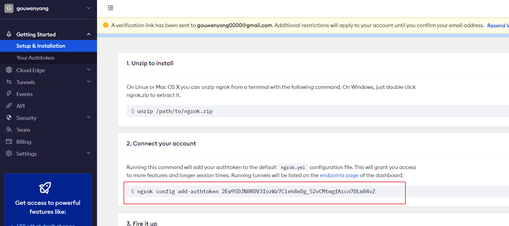

#### （5）启动服务

映射本地服务端口8090

```sh
ngrok http 8090
```

#### （6）测试外网访问

```sh
你获得的外网地址/api/test
```

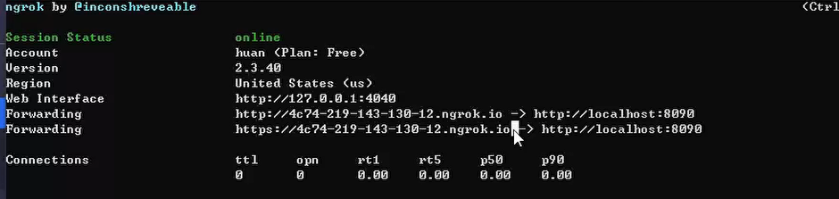

### 6.2、接收通知和返回应答

支付通知API：https://pay.weixin.qq.com/wiki/doc/apiv3/apis/chapter3_4_5.shtml

#### （1）启动ngrok

```h
ngrok http 8090
```

（2）设置通知地址

wxpay.properties
注意：每次重新启动ngrok，都需要根据实际情况修改这个配置

```h
wxpay.notify-domain=https://7d92-115-171-63-135.ngrok.io
```

#### （3）创建通知接口

通知规则：用户支付完成后，微信会把相关支付结果和用户信息发送给商户，商户需要接收处理该消息，并返回应答。对后台通知交互时，如果微信收到商户的应答不符合规范或超时，微信认为通知失败，微信会通过一定的策略定期重新发起通知，尽可能提高通知的成功率，但微信不保证通知最终能成功。（通知频率为
15s/15s/30s/3m/10m/20m/30m/30m/30m/60m/3h/3h/3h/6h/6h - 总计 24h4m）

`WxPayController`

```java
    /**
     * 支付通知  注意和WxNotifyType#NATIVE_NOTIFY枚举地址一致
     * 微信支付通过支付通知接口将用户支付成功消息通知给商户
     */
    @ApiOperation("支付通知")
    @PostMapping("/native/notify")
    public String nativeNotify(HttpServletRequest request, HttpServletResponse response) {
        Gson gson = new Gson();
        Map<String, String> map = new HashMap<>();//应答对象
        //处理通知参数
        String body = HttpUtils.readData(request);
        Map<String, Object> bodyMap = gson.fromJson(body, HashMap.class);
        log.info("支付通知的id ===> {}", bodyMap.get("id"));
        log.info("支付通知的完整数据 ===> {}", body);
        //TODO : 签名的验证
        //TODO : 处理订单
        //成功应答：成功应答必须为200或204，否则就是失败应答
        response.setStatus(200);
        map.put("code", "SUCCESS");
        map.put("message", "成功");
        return gson.toJson(map);

    }
```

#### （4）测试失败应答

用失败应答替换成功应答

```java
	@PostMapping("/native/notify")
    public String nativeNotify(HttpServletRequest request, HttpServletResponser   response) throws Exception {
        Gson gson = new Gson();
        Map<String, String> map = new HashMap<>();
        try {
         int i =  1/0;
        } catch (Exception e) {
            e.printStackTrace();
            // 测试错误应答
            response.setStatus(500);
            map.put("code", "ERROR");
            map.put("message", "系统错误");
            return gson.toJson(map);
        }
}
```

#### （5）测试超时应答

回调通知注意事项：https://pay.weixin.qq.com/wiki/doc/apiv3/Practices/chapter1_1_5.shtml
商户系统收到支付结果通知，需要在5秒内返回应答报文，否则微信支付认为通知失败，后续会重复发送通知。

```java
// 测试超时应答：添加睡眠时间使应答超时
TimeUnit.SECONDS.sleep(5);
```

### 6.3、验签

微信异步回调通知系统后台，  验证请求 来源于微信【微信平台私钥加密数据  --> 用户使用微信平台公钥解密验签】

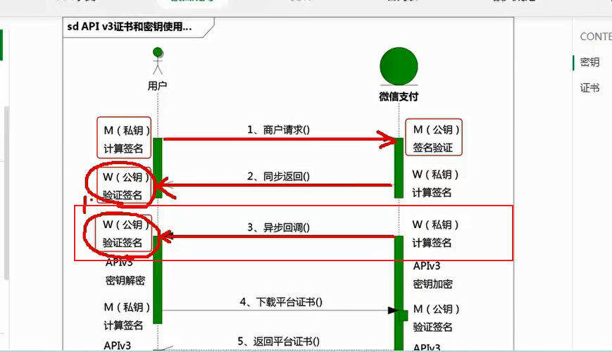

#### （1）工具类

参考SDK源码中的 WechatPay2Validator 创建通知验签工具类 WechatPay2ValidatorForRequest

```java
package com.atguigu.paymentdemo.util;


import com.wechat.pay.contrib.apache.httpclient.auth.Verifier;
import org.apache.http.HttpEntity;
import org.apache.http.client.methods.CloseableHttpResponse;
import org.apache.http.util.EntityUtils;
import org.slf4j.Logger;
import org.slf4j.LoggerFactory;

import javax.servlet.http.HttpServletRequest;
import java.io.IOException;
import java.nio.charset.StandardCharsets;
import java.time.DateTimeException;
import java.time.Duration;
import java.time.Instant;

import static com.wechat.pay.contrib.apache.httpclient.constant.WechatPayHttpHeaders.*;

/**
 * @author xy-peng
 */
public class WechatPay2ValidatorForRequest {

    protected static final Logger log = LoggerFactory.getLogger(WechatPay2ValidatorForRequest.class);
    /**
     * 应答超时时间，单位为分钟
     */
    protected static final long RESPONSE_EXPIRED_MINUTES = 5;
    protected final Verifier verifier;
    protected final String requestId;
    protected final String body;


    public WechatPay2ValidatorForRequest(Verifier verifier, String requestId, String body) {
        this.verifier = verifier;
        this.requestId = requestId;
        this.body = body;
    }

    protected static IllegalArgumentException parameterError(String message, Object... args) {
        message = String.format(message, args);
        return new IllegalArgumentException("parameter error: " + message);
    }

    protected static IllegalArgumentException verifyFail(String message, Object... args) {
        message = String.format(message, args);
        return new IllegalArgumentException("signature verify fail: " + message);
    }

    public final boolean validate(HttpServletRequest request) throws IOException {
        try {
            //处理请求参数
            validateParameters(request);

            //构造验签名串
            String message = buildMessage(request);

            String serial = request.getHeader(WECHAT_PAY_SERIAL);//商户序列号
            String signature = request.getHeader(WECHAT_PAY_SIGNATURE);//请求中的签名

            //验签
            if (!verifier.verify(serial, message.getBytes(StandardCharsets.UTF_8), signature)) {
                throw verifyFail("serial=[%s] message=[%s] sign=[%s], request-id=[%s]",
                        serial, message, signature, requestId);
            }
        } catch (IllegalArgumentException e) {
            log.warn(e.getMessage());
            return false;
        }

        return true;
    }

    protected final void validateParameters(HttpServletRequest request) {

        // NOTE: ensure HEADER_WECHAT_PAY_TIMESTAMP at last
        String[] headers = {WECHAT_PAY_SERIAL, WECHAT_PAY_SIGNATURE, WECHAT_PAY_NONCE, WECHAT_PAY_TIMESTAMP};

        String header = null;
        for (String headerName : headers) {
            header = request.getHeader(headerName);
            if (header == null) {
                throw parameterError("empty [%s], request-id=[%s]", headerName, requestId);
            }
        }

        //判断请求是否过期
        String timestampStr = header;
        try {
            Instant responseTime = Instant.ofEpochSecond(Long.parseLong(timestampStr));
            // 拒绝过期请求
            if (Duration.between(responseTime, Instant.now()).abs().toMinutes() >= RESPONSE_EXPIRED_MINUTES) {
                throw parameterError("timestamp=[%s] expires, request-id=[%s]", timestampStr, requestId);
            }
        } catch (DateTimeException | NumberFormatException e) {
            throw parameterError("invalid timestamp=[%s], request-id=[%s]", timestampStr, requestId);
        }
    }

    protected final String buildMessage(HttpServletRequest request) throws IOException {
        String timestamp = request.getHeader(WECHAT_PAY_TIMESTAMP);
        String nonce = request.getHeader(WECHAT_PAY_NONCE);
        return timestamp + "\n"
                + nonce + "\n"
                + body + "\n";
    }

    protected final String getResponseBody(CloseableHttpResponse response) throws IOException {
        HttpEntity entity = response.getEntity();
        return (entity != null && entity.isRepeatable()) ? EntityUtils.toString(entity) : "";
    }

}

```

#### （2）验签

```java
@Resource
private Verifier verifier;
```

```java
//签名的验证
WechatPay2ValidatorForRequest wechatPay2ValidatorForRequest
        = new WechatPay2ValidatorForRequest(verifier, requestId, body);
if (!wechatPay2ValidatorForRequest.validate(request)) {

    log.error("通知验签失败");
    //失败应答
    response.setStatus(500);
    map.put("code", "ERROR");
    map.put("message", "通知验签失败");
    return gson.toJson(map);
}
log.info("通知验签成功");
```

### 6.4、报文解密

回调规范：https://pay.weixin.qq.com/wiki/doc/apiv3/apis/chapter3_4_5.shtml

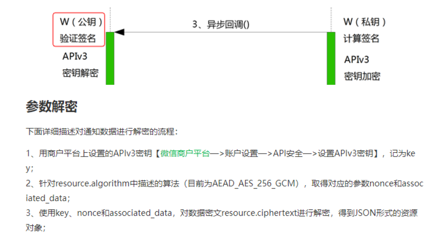

SDK解密工具：

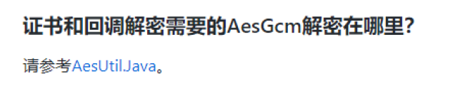

#### （1）WxPayController

nativeNotify 方法中添加处理订单的代码

```java
//处理订单
wxPayService.processOrder(bodyMap);
```

#### （2）WxPayService

接口：

```java
    void processOrder(Map<String, Object> bodyMap);
```

实现：

```java
    @Override
    public void processOrder(Map<String, Object> bodyMap) {
        log.info("处理订单");
        String plainText = decryptFromResource(bodyMap);
        //转换明文
        
        //更新订单状态
        
        //记录支付日志
        
    }
```

辅助方法：

```java
    /**
     * 对称解密
     *
     * @param bodyMap
     * @return
     */
    private String decryptFromResource(Map<String, Object> bodyMap) throws GeneralSecurityException {
        log.info("密文解密");
        //通知数据
        Map<String, String> resourceMap = (Map) bodyMap.get("resource");
        //数据密文
        String ciphertext = resourceMap.get("ciphertext");
        //随机串
        String nonce = resourceMap.get("nonce");
        //附加数据
        String associatedData = resourceMap.get("associated_data");

        log.info("密文 ===> {}", ciphertext);
        AesUtil aesUtil = new AesUtil(wxPayConfig.getApiV3Key().getBytes(StandardCharsets.UTF_8));
        String plainText = aesUtil.decryptToString(
                associatedData.getBytes(StandardCharsets.UTF_8),
                nonce.getBytes(StandardCharsets.UTF_8),
                ciphertext);
        log.info("明文 ===> {}", plainText);
        return plainText;

    }
```

### 6.5、处理订单

#### （1）完善processOrder方法

```java
@Resource
private PaymentInfoService paymentInfoService;

@Override
public void processOrder(Map<String, Object> bodyMap) throws GeneralSecurityException {
    log.info("处理订单");
    String plainText = decryptFromResource(bodyMap);
    //转换明文
    Gson gson = new Gson();
    Map<String, Object> plainTextMap = gson.fromJson(plainText, HashMap.class);
    String orderNo = (String)plainTextMap.get("out_trade_no");
    //更新订单状态
    orderInfoService.updateStatusByOrderNo(orderNo, OrderStatus.SUCCESS);
    //记录支付日志
    paymentInfoService.createPaymentInfo(plainText);
}
```

#### （2）更新订单状态

OrderInfoService
接口：

```java
 void updateStatusByOrderNo(String orderNo, OrderStatus success);
```

实现：

```java
    /**
     * 根据订单号更新订单状态
     *
     * @param orderNo
     * @param orderStatus
     */
    @Override
    public void updateStatusByOrderNo(String orderNo, OrderStatus orderStatus) {

        log.info("更新订单状态 ===> {}", orderStatus.getType());

        QueryWrapper<OrderInfo> queryWrapper = new QueryWrapper<>();
        queryWrapper.eq("order_no", orderNo);

        OrderInfo orderInfo = new OrderInfo();
        orderInfo.setOrderStatus(orderStatus.getType());

        baseMapper.update(orderInfo, queryWrapper);
    }
```

#### （3）处理支付日志

PaymentInfoService
接口：

```java
  void createPaymentInfo(String plainText);
```

实现：

```java
 /**
     * 记录支付日志
     *
     * @param plainText
     */
    @Override
    public void createPaymentInfo(String plainText) {

        log.info("记录支付日志");

        Gson gson = new Gson();
        HashMap plainTextMap = gson.fromJson(plainText, HashMap.class);

        //订单号
        String orderNo = (String) plainTextMap.get("out_trade_no");
        //业务编号
        String transactionId = (String) plainTextMap.get("transaction_id");
        //支付类型
        String tradeType = (String) plainTextMap.get("trade_type");
        //交易状态
        String tradeState = (String) plainTextMap.get("trade_state");
        //用户实际支付金额
        Map<String, Object> amount = (Map) plainTextMap.get("amount");
        Integer payerTotal = ((Double) amount.get("payer_total")).intValue();

        PaymentInfo paymentInfo = new PaymentInfo();
        paymentInfo.setOrderNo(orderNo);
        paymentInfo.setPaymentType(PayType.WXPAY.getType());
        paymentInfo.setTransactionId(transactionId);
        paymentInfo.setTradeType(tradeType);
        paymentInfo.setTradeState(tradeState);
        paymentInfo.setPayerTotal(payerTotal);
        paymentInfo.setContent(plainText);

        baseMapper.insert(paymentInfo);
    }
```

### 6.6、处理重复通知

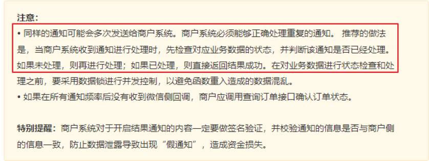

#### （1）测试重复的通知

```java
//应答超时
//设置响应超时，可以接收到微信支付的重复的支付结果通知。
//通知重复，数据库会记录多余的支付日志
TimeUnit.SECONDS.sleep(5);
```

#### （2）处理重复通知

在 processOrder 方法中，更新订单状态之前，添加如下代码

```java
//处理重复通知
//保证接口调用的幂等性：无论接口被调用多少次，产生的结果是一致的
String orderStatus = orderInfoService.getOrderStatus(orderNo);
if (!OrderStatus.NOTPAY.getType().equals(orderStatus)) {
    	return;
}
```

OrderInfoService

接口：

```java
   String getOrderStatus(String orderNo);
```

实现：

```java
  /**
     * 根据订单号获取订单状态
     *
     * @param orderNo
     * @return
     */
    @Override
    public String getOrderStatus(String orderNo) {
        QueryWrapper<OrderInfo> queryWrapper = new QueryWrapper<>();
        queryWrapper.eq("order_no", orderNo);
        OrderInfo orderInfo = baseMapper.selectOne(queryWrapper);

        //防止被删除的订单的回调通知的调用
        if (orderInfo == null) {
            return null;
        }
        return orderInfo.getOrderStatus();
    }
```

### 6.7、数据锁

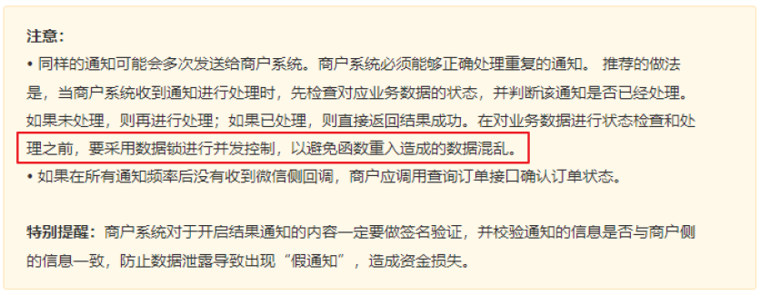

#### （1）测试通知并发

```java
//处理重复的通知
//模拟通知并发
try {
	TimeUnit.SECONDS.sleep(5);
} catch (InterruptedException e) {
	e.printStackTrace();
}
//更新订单状态
//记录支付日志
```

#### （2）定义ReentrantLock

定义 ReentrantLock 进行并发控制。注意，必须手动释放锁。

```java
private final ReentrantLock lock = new ReentrantLock();
```

```java
  @Override
    public void processOrder(Map<String, Object> bodyMap) throws GeneralSecurityException {
        log.info("处理订单");
        String plainText = decryptFromResource(bodyMap);
        //转换明文
        Gson gson = new Gson();
        Map<String, Object> plainTextMap = gson.fromJson(plainText, HashMap.class);
        String orderNo = (String) plainTextMap.get("out_trade_no");//系统订单号


         /*在对业务数据进行状态检查和处理之前，
            要采用数据锁进行并发控制，
            以避免函数重入造成的数据混乱
        */

        //尝试获取锁：
        // 成功获取则立即返回true，获取失败则立即返回false。不必一直等待锁的释放
        if (lock.tryLock()) {
            try {
                //处理重复的通知
                //接口调用的幂等性：无论接口被调用多少次，产生的结果是一致的。
                String orderStatus = orderInfoService.getOrderStatus(orderNo);
                if (!OrderStatus.NOTPAY.getType().equals(orderStatus)) {
                    return;
                }
                //模拟通知并发
                try {
                    TimeUnit.SECONDS.sleep(5);
                } catch (InterruptedException e) {
                    e.printStackTrace();
                }
                //更新订单状态
                orderInfoService.updateStatusByOrderNo(orderNo,   OrderStatus.SUCCESS);
                //记录支付日志
                paymentInfoService.createPaymentInfo(plainText);
            } finally {
                //要主动释放锁
                lock.unlock();
            }
            
        }
    }
```

## 7、商户定时查询本地订单

### 7.1、后端定义商户查单接口

支付成功后，商户侧查询本地数据库，订单是否支付成功

OrderInfoController

```java
/**
* 查询本地订单状态
*
* @param orderNo
* @return
*/
@ApiOperation("查询本地订单状态")
@GetMapping("/query-order-status/{orderNo}")
public R queryOrderStatus(@PathVariable String orderNo) {

    String orderStatus = orderInfoService.getOrderStatus(orderNo);
    if (OrderStatus.SUCCESS.getType().equals(orderStatus)) {
        return R.ok().setMessage("支付成功"); //支付成功
    }

    return R.ok().setCode(101).setMessage("支付中......");
}
```

### 7.2、前端定时轮询查单

在二维码展示页面，前端定时轮询查询订单是否已支付，如果支付成功则跳转到订单页面

#### （1）定义定时器

```js
//启动定时器
this.timer = setInterval(() => {
    //查询订单是否支付成功
    this.queryOrderStatus()
}, 3000)
```

#### （2）查询订单

```js
// 查询订单状态
queryOrderStatus() {

    orderInfoApi.queryOrderStatus(this.orderNo).then(response => {
        console.log('查询订单状态：' + response.code)

        // 支付成功后的页面跳转
        if (response.code === 0) {
            console.log('清除定时器')
            clearInterval(this.timer)
            // 三秒后跳转到订单列表
            setTimeout(() => {
                this.$router.push({ path: '/orders' })
            }, 3000)
        }
    })
}
```

## 8、用户取消订单API

https://pay.weixin.qq.com/wiki/doc/apiv3/apis/chapter3_4_3.shtml

实现用户主动取消订单的功能

### 8.1、定义取消订单接口

WxPayController中添加接口方法

```java
/**
* 用户取消订单
* @param orderNo
* @return
* @throws Exception
*/
@ApiOperation("用户取消订单")
@PostMapping("/cancel/{orderNo}")
public R cancel(@PathVariable String orderNo) throws Exception {
    log.info("取消订单");
    wxPayService.cancelOrder(orderNo);
    return R.ok().setMessage("订单已取消");
}
```

### 8.2、WxPayService

接口

```java
void cancelOrder(String orderNo) throws Exception;
```

实现

```java
/**
 * 用户取消订单
 *
 * @param orderNo
 */
@Override
public void cancelOrder(String orderNo) throws Exception {
    //调用微信支付的关单接口
    this.closeOrder(orderNo);
    //更新商户端的订单状态
    orderInfoService.updateStatusByOrderNo(orderNo, OrderStatus.CANCEL);
}
```

关单方法

```java
   /**
     * 关单接口的调用
     *
     * @param orderNo
     */
    private void closeOrder(String orderNo) throws Exception {

        log.info("关单接口的调用，订单号 ===> {}", orderNo);

        //创建远程请求对象
        String url = String.format(WxApiType.CLOSE_ORDER_BY_NO.getType(), orderNo);
        url = wxPayConfig.getDomain().concat(url);
        HttpPost httpPost = new HttpPost(url);

        //组装json请求体
        Gson gson = new Gson();
        Map<String, String> paramsMap = new HashMap<>();
        paramsMap.put("mchid", wxPayConfig.getMchId());
        String jsonParams = gson.toJson(paramsMap);
        log.info("请求参数 ===> {}", jsonParams);

        //将请求参数设置到请求对象中
        StringEntity entity = new StringEntity(jsonParams, "utf-8");
        entity.setContentType("application/json");
        httpPost.setEntity(entity);
        httpPost.setHeader("Accept", "application/json");

        //完成签名并执行请求
        CloseableHttpResponse response = wxPayClient.execute(httpPost);

        try {
            int statusCode = response.getStatusLine().getStatusCode();//响应状态码
            if (statusCode == 200) { //处理成功
                log.info("成功200");
            } else if (statusCode == 204) { //处理成功，无返回Body
                log.info("成功204");
            } else {
                log.info("Native下单失败,响应码 = " + statusCode);
                throw new IOException("request failed");
            }

        } finally {
            response.close();
        }
    }
```

## 9、微信支付查单API

https://pay.weixin.qq.com/wiki/doc/apiv3/apis/chapter3_4_2.shtml

### 9.1、查单接口的调用

商户后台未收到异步支付结果通知时，商户应该主动调用《微信支付查单接口》，同步订单状态。

#### （1）WxPayController

```java
    /**
     * 查询订单
     *
     * @param orderNo
     * @return
     */
    @ApiOperation("查询订单：测试订单状态用")
    @GetMapping("query/{orderNo}")
    public R queryOrder(@PathVariable String orderNo) throws Exception {
        log.info("查询订单");
        String bodyAsString = wxPayService.queryOrder(orderNo);
        return R.ok().setMessage("查询成功").data("bodyAsString", bodyAsString);
    }
```

#### （2）WxPayService

接口

```java
String queryOrder(String orderNo) throws Exception;
```

实现

```java
    /**
     * 查单接口调用
     */
    @Override
    public String queryOrder(String orderNo) throws Exception {

        log.info("查单接口调用 ===> {}", orderNo);

        String url = String.format(WxApiType.ORDER_QUERY_BY_NO.getType(), orderNo);
        url = wxPayConfig.getDomain().concat(url).concat("?mchid=").concat(wxPayConfig.getMchId());

        HttpGet httpGet = new HttpGet(url);
        httpGet.setHeader("Accept", "application/json");

        //完成签名并执行请求
        CloseableHttpResponse response = wxPayClient.execute(httpGet);

        try {
            String bodyAsString = EntityUtils.toString(response.getEntity());//响应体
            int statusCode = response.getStatusLine().getStatusCode();//响应状态码
            if (statusCode == 200) { //处理成功
                log.info("成功, 返回结果 = " + bodyAsString);
            } else if (statusCode == 204) { //处理成功，无返回Body
                log.info("成功");
            } else {
                log.info("查单接口调用,响应码 = " + statusCode + ",返回结果 = " + bodyAsString);
                throw new IOException("request failed");
            }

            return bodyAsString;

        } finally {
            response.close();
        }

    }
```

### 9.2、集成Spring Task

Spring 3.0后提供Spring Task实现任务调度

#### （1）启动类添加注解

statistics启动类添加注解

```java
@EnableScheduling
```

#### （2）测试定时任务

创建 task 包，创建 WxPayTask.java

```java
package com.atguigu.paymentdemo.task;

import lombok.extern.slf4j.Slf4j;
import org.springframework.scheduling.annotation.Scheduled;
import org.springframework.stereotype.Component;

@Slf4j
@Component
public class WxPayTask {
    /**
     * 测试
     * (cron="秒 分 时 日 月 周")
     * *：每隔一秒执行
     * 0/3：从第0秒开始，每隔3秒执行一次
     * 1-3: 从第1秒开始执行，到第3秒结束执行
     * 1,2,3：第1、2、3秒执行
     * ?：不指定，若指定日期，则不指定周，反之同理
     */
    @Scheduled(cron = "0/3 * * * * ?")
    public void task1() {
        log.info("task1 执行");
    }
}
```

### 9.3、定时查找超时订单

#### （1）WxPayTask

```java
    @Resource
    private OrderInfoService orderInfoService;

    @Resource
    private WxPayService wxPayService;


    /**
     * 从第0秒开始每隔30秒执行1次，查询创建超过5分钟，并且未支付的订单
     */
    @Scheduled(cron = "0/30 * * * * ?")
    public void orderConfirm() throws Exception {
        log.info("orderConfirm 被执行......");

        List<OrderInfo> orderInfoList = orderInfoService.getNoPayOrderByDuration(5);

        for (OrderInfo orderInfo : orderInfoList) {
            String orderNo = orderInfo.getOrderNo();
            log.warn("超时订单 ===> {}", orderNo);

            //核实订单状态：调用微信支付查单接口
            wxPayService.checkOrderStatus(orderNo);
        }
    }
```

#### （2）OrderInfoService

接口

```java
List<OrderInfo> getNoPayOrderByDuration(int minutes);
```

实现

```java
    /**
     * 查询创建超过minutes分钟并且未支付的订单
     *
     * @param minutes
     * @return
     */
    @Override
    public List<OrderInfo> getNoPayOrderByDuration(int minutes) {

        Instant instant = Instant.now().minus(Duration.ofMinutes(minutes));

        QueryWrapper<OrderInfo> queryWrapper = new QueryWrapper<>();
        queryWrapper.eq("order_status", OrderStatus.NOTPAY.getType());
        queryWrapper.le("create_time", instant);

        List<OrderInfo> orderInfoList = baseMapper.selectList(queryWrapper);

        return orderInfoList;
    }
```

### 9.4、处理超时订单

WxPayService
核实订单状态
接口：

```java
void checkOrderStatus(String orderNo) throws Exception;
```

实现：

```java
   /**
     * 根据订单号查询微信支付查单接口，核实订单状态
     * 如果订单已支付，则更新商户端订单状态，并记录支付日志
     * 如果订单未支付，则调用关单接口关闭订单，并更新商户端订单状态
     *
     * @param orderNo
     */
    @Transactional(rollbackFor = Exception.class)
    @Override
    public void checkOrderStatus(String orderNo) throws Exception {

        log.warn("根据订单号核实订单状态 ===> {}", orderNo);

        //调用微信支付查单接口
        String result = this.queryOrder(orderNo);

        Gson gson = new Gson();
        Map<String, String> resultMap = gson.fromJson(result, HashMap.class);

        //获取微信支付端的订单状态
        String tradeState = resultMap.get("trade_state");

        //判断订单状态
        if (WxTradeState.SUCCESS.getType().equals(tradeState)) {

            log.warn("核实订单已支付 ===> {}", orderNo);

            //如果确认订单已支付则更新本地订单状态
            orderInfoService.updateStatusByOrderNo(orderNo, OrderStatus.SUCCESS);
            //记录支付日志
            paymentInfoService.createPaymentInfo(result);
        }

        if (WxTradeState.NOTPAY.getType().equals(tradeState)) {
            log.warn("核实订单未支付 ===> {}", orderNo);

            //如果订单未支付，则调用关单接口
            this.closeOrder(orderNo);

            //更新本地订单状态
            orderInfoService.updateStatusByOrderNo(orderNo, OrderStatus.CLOSED);
        }

    }
```

## 11、申请退款API

文档：https://pay.weixin.qq.com/wiki/doc/apiv3/apis/chapter3_4_9.shtml

### 11.1、申请退款

#### （1）WxPayController

```java
    @ApiOperation("申请退款")
    @PostMapping("/refunds/{orderNo}/{reason}")
    public R refunds(@PathVariable String orderNo, @PathVariable String reason)
            throws Exception {
        log.info("申请退款");
        wxPayService.refund(orderNo, reason);
        return R.ok();
    }
```

#### （2）WxPayService

接口：

```java
void refund(String orderNo, String reason) throws Exception;
```

实现

```java
/**
 * 退款
 *
 * @param orderNo
 * @param reason
 * @throws IOException
 */
@Transactional(rollbackFor = Exception.class)
@Override
public void refund(String orderNo, String reason) throws Exception {

    log.info("创建退款单记录");
    //根据订单编号创建退款单
    RefundInfo refundsInfo = refundsInfoService.createRefundByOrderNo(orderNo, reason);

    log.info("调用退款API");

    //调用统一下单API
    String url = wxPayConfig.getDomain().concat(WxApiType.DOMESTIC_REFUNDS.getType());
    HttpPost httpPost = new HttpPost(url);

    // 请求body参数
    Gson gson = new Gson();
    Map paramsMap = new HashMap();
    paramsMap.put("out_trade_no", orderNo);//订单编号
    paramsMap.put("out_refund_no", refundsInfo.getRefundNo());//退款单编号
    paramsMap.put("reason", reason);//退款原因
    paramsMap.put("notify_url", wxPayConfig.getNotifyDomain().concat(WxNotifyType.REFUND_NOTIFY.getType()));//退款通知地址

    Map amountMap = new HashMap();
    amountMap.put("refund", refundsInfo.getRefund());//退款金额
    amountMap.put("total", refundsInfo.getTotalFee());//原订单金额
    amountMap.put("currency", "CNY");//退款币种
    paramsMap.put("amount", amountMap);

    //将参数转换成json字符串
    String jsonParams = gson.toJson(paramsMap);
    log.info("请求参数 ===> {}" + jsonParams);

    StringEntity entity = new StringEntity(jsonParams, "utf-8");
    entity.setContentType("application/json");//设置请求报文格式
    httpPost.setEntity(entity);//将请求报文放入请求对象
    httpPost.setHeader("Accept", "application/json");//设置响应报文格式

    //完成签名并执行请求，并完成验签
    CloseableHttpResponse response = wxPayClient.execute(httpPost);

    try {

        //解析响应结果
        String bodyAsString = EntityUtils.toString(response.getEntity());
        int statusCode = response.getStatusLine().getStatusCode();
        if (statusCode == 200) {
            log.info("成功, 退款返回结果 = " + bodyAsString);
        } else if (statusCode == 204) {
            log.info("成功");
        } else {
            throw new RuntimeException("退款异常, 响应码 = " + statusCode + ", 退款返回结果 = " + bodyAsString);
        }

        //更新订单状态
        orderInfoService.updateStatusByOrderNo(orderNo, OrderStatus.REFUND_PROCESSING);

        //更新退款单
        refundsInfoService.updateRefund(bodyAsString);

    } finally {
        response.close();
    }
}
```

### 11.2、创建退款单

#### （1）根据订单号查询订单

OrderInfoService
接口：

```java
OrderInfo getOrderByOrderNo(String orderNo);
```

实现：

```java
/**
 * 根据订单号获取订单
 *
 * @param orderNo
 * @return
 */
@Override
public OrderInfo getOrderByOrderNo(String orderNo) {
    QueryWrapper<OrderInfo> queryWrapper = new QueryWrapper<>();
    queryWrapper.eq("order_no", orderNo);
    OrderInfo orderInfo = baseMapper.selectOne(queryWrapper);
    return orderInfo;
}
```

#### （2）创建退款单记录

RefundsInfoService
接口：

```java
RefundInfo createRefundByOrderNo(String orderNo, String reason);
```

实现：

```java
@Resource
private OrderInfoService orderInfoService;

/**
 * 根据订单号创建退款订单
 *
 * @param orderNo
 * @return
 */
@Override
public RefundInfo createRefundByOrderNo(String orderNo, String reason) {
    //根据订单号获取订单信息
    OrderInfo orderInfo = orderInfoService.getOrderByOrderNo(orderNo);
    //根据订单号生成退款订单
    RefundInfo refundInfo = new RefundInfo();
    refundInfo.setOrderNo(orderNo);//订单编号
    refundInfo.setRefundNo(OrderNoUtils.getRefundNo());//退款单编号
    refundInfo.setTotalFee(orderInfo.getTotalFee());//原订单金额(分)
    refundInfo.setRefund(orderInfo.getTotalFee());//退款金额(分)
    refundInfo.setReason(reason);//退款原因
    //保存退款订单
    baseMapper.insert(refundInfo);
    return refundInfo;
}
```

### 11.3、更新退款单

RefundInfoService
接口：

```java
void updateRefund(String content);
```

实现

```java
 /**
     * 记录退款记录
     *
     * @param content
     */
    @Override
    public void updateRefund(String content) {

        //将json字符串转换成Map
        Gson gson = new Gson();
        Map<String, String> resultMap = gson.fromJson(content, HashMap.class);

        //根据退款单编号修改退款单
        QueryWrapper<RefundInfo> queryWrapper = new QueryWrapper<>();
        queryWrapper.eq("refund_no", resultMap.get("out_refund_no"));

        //设置要修改的字段
        RefundInfo refundInfo = new RefundInfo();

        refundInfo.setRefundId(resultMap.get("refund_id"));//微信支付退款单号

        //查询退款和申请退款中的返回参数
        if (resultMap.get("status") != null) {
            refundInfo.setRefundStatus(resultMap.get("status"));//退款状态
            refundInfo.setContentReturn(content);//将全部响应结果存入数据库的content字段
        }
        //退款回调中的回调参数
        if (resultMap.get("refund_status") != null) {
            refundInfo.setRefundStatus(resultMap.get("refund_status"));//退款状态
            refundInfo.setContentNotify(content);//将全部响应结果存入数据库的content字段
        }

        //更新退款单
        baseMapper.update(refundInfo, queryWrapper);
    }
```

## 12、查询退款API

文档：https://pay.weixin.qq.com/wiki/doc/apiv3/apis/chapter3_4_10.shtml

### 12.1、查单接口的调用

#### （1）WxPayController

```java
    /**
     * 查询退款
     *
     * @param refundNo
     * @return
     * @throws Exception
     */
    @ApiOperation("查询退款：测试用")
    @GetMapping("/query-refund/{refundNo}")
    public R queryRefund(@PathVariable String refundNo) throws Exception {
        log.info("查询退款");
        String result = wxPayService.queryRefund(refundNo);
        return R.ok().setMessage("查询成功").data("result", result);
    }
```

#### （2）WxPayService

接口：

```java
String queryRefund(String orderNo) throws Exception;
```

实现：

```java
   /**
     * 查询退款接口调用
     *
     * @param refundNo
     * @return
     */
    @Override
    public String queryRefund(String refundNo) throws Exception {

        log.info("查询退款接口调用 ===> {}", refundNo);

        String url = String.format(WxApiType.DOMESTIC_REFUNDS_QUERY.getType(), refundNo);
        url = wxPayConfig.getDomain().concat(url);

        //创建远程Get 请求对象
        HttpGet httpGet = new HttpGet(url);
        httpGet.setHeader("Accept", "application/json");

        //完成签名并执行请求
        CloseableHttpResponse response = wxPayClient.execute(httpGet);

        try {
            String bodyAsString = EntityUtils.toString(response.getEntity());
            int statusCode = response.getStatusLine().getStatusCode();
            if (statusCode == 200) {
                log.info("成功, 查询退款返回结果 = " + bodyAsString);
            } else if (statusCode == 204) {
                log.info("成功");
            } else {
                throw new RuntimeException("查询退款异常, 响应码 = " + statusCode + ", 查询退款返回结果 = " + bodyAsString);
            }

            return bodyAsString;

        } finally {
            response.close();
        }
    }
```

### 12.2、定时查找退款中的订单

#### （1）WxPayTask

```java
    /**
     * 从第0秒开始每隔30秒执行1次，查询创建超过5分钟，并且未成功的退款单
     */
    @Scheduled(cron = "0/30 * * * * ?")
    public void refundConfirm() throws Exception {
        log.info("refundConfirm 被执行......");

        //找出申请退款超过5分钟并且未成功的退款单
        List<RefundInfo> refundInfoList = refundInfoService.getNoRefundOrderByDuration(1);

        for (RefundInfo refundInfo : refundInfoList) {
            String refundNo = refundInfo.getRefundNo();
            log.warn("超时未退款的退款单号 ===> {}", refundNo);

            //核实订单状态：调用微信支付查询退款接口
            wxPayService.checkRefundStatus(refundNo);
        }
    }
```

#### （2）RefundInfoService

接口

```java
List<RefundInfo> getNoRefundOrderByDuration(int minutes);
```

实现

```java
    /**
     * 找出申请退款超过minutes分钟并且未成功的退款单
     *
     * @param minutes
     * @return
     */
    @Override
    public List<RefundInfo> getNoRefundOrderByDuration(int minutes) {

        //minutes分钟之前的时间
        Instant instant = Instant.now().minus(Duration.ofMinutes(minutes));

        QueryWrapper<RefundInfo> queryWrapper = new QueryWrapper<>();
        queryWrapper.eq("refund_status", WxRefundStatus.PROCESSING.getType());
        queryWrapper.le("create_time", instant);
        List<RefundInfo> refundInfoList = baseMapper.selectList(queryWrapper);
        return refundInfoList;
    }
```

### 12.3、处理超时未退款订单

WxPayService
核实订单状态
接口：

```java
void checkRefundStatus(String refundNo) throws Exception
```

实现

```java
/**
 * 根据退款单号核实退款单状态
 *
 * @param refundNo
 * @return
 */
@Transactional(rollbackFor = Exception.class)
@Override
public void checkRefundStatus(String refundNo) throws Exception {

    log.warn("根据退款单号核实退款单状态 ===> {}", refundNo);

    //调用查询退款单接口
    String result = this.queryRefund(refundNo);

    //组装json请求体字符串
    Gson gson = new Gson();
    Map<String, String> resultMap = gson.fromJson(result, HashMap.class);

    //获取微信支付端退款状态
    String status = resultMap.get("status");

    String orderNo = resultMap.get("out_trade_no");

    if (WxRefundStatus.SUCCESS.getType().equals(status)) {

        log.warn("核实订单已退款成功 ===> {}", refundNo);

        //如果确认退款成功，则更新订单状态
        orderInfoService.updateStatusByOrderNo(orderNo, OrderStatus.REFUND_SUCCESS);

        //更新退款单
        refundsInfoService.updateRefund(result);
    }

    if (WxRefundStatus.ABNORMAL.getType().equals(status)) {

        log.warn("核实订单退款异常  ===> {}", refundNo);

        //如果确认退款成功，则更新订单状态
        orderInfoService.updateStatusByOrderNo(orderNo, OrderStatus.REFUND_ABNORMAL);

        //更新退款单
        refundsInfoService.updateRefund(result);
    }
}
```

## 13、退款结果通知API

文档：https://pay.weixin.qq.com/wiki/doc/apiv3/apis/chapter3_4_11.shtml

### 13.1、接收退款通知

WxPayController

```java
  /**
     * 退款结果通知
     * 退款状态改变后，微信会把相关退款结果发送给商户。
     */
    @ApiOperation("退款结果通知")
    @PostMapping("/refunds/notify")
    public String refundsNotify(HttpServletRequest request, HttpServletResponse response) {

        log.info("退款通知执行");
        Gson gson = new Gson();
        Map<String, String> map = new HashMap<>();//应答对象

        try {
            //处理通知参数
            String body = HttpUtils.readData(request);
            Map<String, Object> bodyMap = gson.fromJson(body, HashMap.class);
            String requestId = (String) bodyMap.get("id");
            log.info("支付通知的id ===> {}", requestId);

            //签名的验证
            WechatPay2ValidatorForRequest wechatPay2ValidatorForRequest
                    = new WechatPay2ValidatorForRequest(verifier, requestId, body);
            if (!wechatPay2ValidatorForRequest.validate(request)) {

                log.error("通知验签失败");
                //失败应答
                response.setStatus(500);
                map.put("code", "ERROR");
                map.put("message", "通知验签失败");
                return gson.toJson(map);
            }
            log.info("通知验签成功");

            //处理退款单
            wxPayService.processRefund(bodyMap);

            //成功应答
            response.setStatus(200);
            map.put("code", "SUCCESS");
            map.put("message", "成功");
            return gson.toJson(map);

        } catch (Exception e) {
            e.printStackTrace();
            //失败应答
            response.setStatus(500);
            map.put("code", "ERROR");
            map.put("message", "失败");
            return gson.toJson(map);
        }
    }
```

### 13.2、处理订单和退款单

WxPayService
接口：

```java
void processRefund(Map<String, Object> bodyMap) throws Exception
```

实现

```java
/**
 * 处理退款单
 */
@Transactional(rollbackFor = Exception.class)
@Override
public void processRefund(Map<String, Object> bodyMap) throws Exception {

    log.info("退款单");

    //解密报文
    String plainText = decryptFromResource(bodyMap);

    //将明文转换成map
    Gson gson = new Gson();
    HashMap plainTextMap = gson.fromJson(plainText, HashMap.class);
    String orderNo = (String) plainTextMap.get("out_trade_no");

    if (lock.tryLock()) {
        try {

            String orderStatus = orderInfoService.getOrderStatus(orderNo);
            if (!OrderStatus.REFUND_PROCESSING.getType().equals(orderStatus)) {
                return;
            }

            //更新订单状态
            orderInfoService.updateStatusByOrderNo(orderNo, OrderStatus.REFUND_SUCCESS);

            //更新退款单
            refundsInfoService.updateRefund(plainText);

        } finally {
            //要主动释放锁
            lock.unlock();
        }
    }
}
```

## 14、账单

### 14.1、申请交易账单和资金账单

#### （1）WxPayController

```java
@ApiOperation("获取账单url：测试用")
@GetMapping("/querybill/{billDate}/{type}")
public R queryTradeBill(
    @PathVariable String billDate,
    @PathVariable String type) throws Exception {
    log.info("获取账单url");
    String downloadUrl = wxPayService.queryBill(billDate, type);
    return R.ok().setMessage("获取账单url成功").data("downloadUrl", downloadUrl);
}
```

#### （2）WxPayService

接口：

```java
String queryBill(String billDate, String type) throws Exception;
```

java

```java
 /**
     * 申请账单
     * @param billDate
     * @param type
     * @return
     * @throws Exception
     */
    @Override
    public String queryBill(String billDate, String type) throws Exception {
        log.warn("申请账单接口调用 {}", billDate);

        String url = "";
        if("tradebill".equals(type)){
            url =  WxApiType.TRADE_BILLS.getType();
        }else if("fundflowbill".equals(type)){
            url =  WxApiType.FUND_FLOW_BILLS.getType();
        }else{
            throw new RuntimeException("不支持的账单类型");
        }

        url = wxPayConfig.getDomain().concat(url).concat("?bill_date=").concat(billDate);

        //创建远程Get 请求对象
        HttpGet httpGet = new HttpGet(url);
        httpGet.addHeader("Accept", "application/json");

        //使用wxPayClient发送请求得到响应
        CloseableHttpResponse response = wxPayClient.execute(httpGet);

        try {

            String bodyAsString = EntityUtils.toString(response.getEntity());

            int statusCode = response.getStatusLine().getStatusCode();
            if (statusCode == 200) {
                log.info("成功, 申请账单返回结果 = " + bodyAsString);
            } else if (statusCode == 204) {
                log.info("成功");
            } else {
                throw new RuntimeException("申请账单异常, 响应码 = " + statusCode+ ", 申请账单返回结果 = " + bodyAsString);
            }

            //获取账单下载地址
            Gson gson = new Gson();
            Map<String, String> resultMap = gson.fromJson(bodyAsString, HashMap.class);
            return resultMap.get("download_url");

        } finally {
            response.close();
        }
    }
```

### 14.2、下载账单

#### （1）WxPayController

```java
@ApiOperation("下载账单")
@GetMapping("/downloadbill/{billDate}/{type}")
public R downloadBill(
    @PathVariable String billDate,
    @PathVariable String type) throws Exception {

    log.info("下载账单");
    String result = wxPayService.downloadBill(billDate, type);

    return R.ok().data("result", result);
}
```

#### （2）WxPayService

接口：

```java
String downloadBill(String billDate, String type) throws Exception;
```

实现：

```java
 /**
     * 下载账单
     * @param billDate
     * @param type
     * @return
     * @throws Exception
     */
    @Override
    public String downloadBill(String billDate, String type) throws Exception {
        log.warn("下载账单接口调用 {}, {}", billDate, type);

        //获取账单url地址
        String downloadUrl = this.queryBill(billDate, type);
        //创建远程Get 请求对象
        HttpGet httpGet = new HttpGet(downloadUrl);
        httpGet.addHeader("Accept", "application/json");

        //使用wxPayClient发送请求得到响应
        CloseableHttpResponse response = wxPayNoSignClient.execute(httpGet);

        try {

            String bodyAsString = EntityUtils.toString(response.getEntity());

            int statusCode = response.getStatusLine().getStatusCode();
            if (statusCode == 200) {
                log.info("成功, 下载账单返回结果 = " + bodyAsString);
            } else if (statusCode == 204) {
                log.info("成功");
            } else {
                throw new RuntimeException("下载账单异常, 响应码 = " + statusCode+ ", 下载账单返回结果 = " + bodyAsString);
            }

            return bodyAsString;

        } finally {
            response.close();
        }
    }
```

# 五、基础支付API V2

## 1、V2和V3的比较

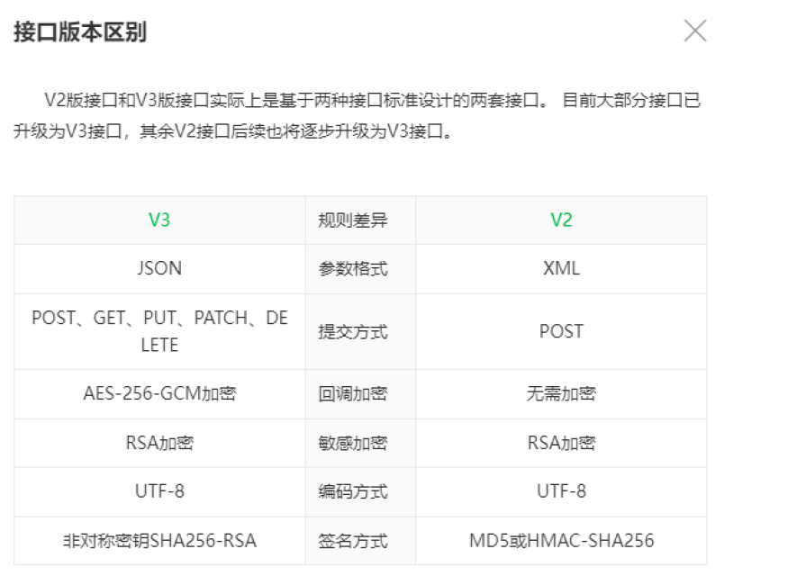

## 2、引入依赖和工具

### 2.1、引入依赖

```xml
<!--微信支付-->
<dependency>
    <groupId>com.github.wxpay</groupId>
    <artifactId>wxpay-sdk</artifactId>
    <version>0.0.3</version>
</dependency>
```

### 2.1、复制工具类

```java
package com.atguigu.paymentdemo.util;

import org.apache.http.Consts;
import org.apache.http.HttpEntity;
import org.apache.http.NameValuePair;
import org.apache.http.client.ClientProtocolException;
import org.apache.http.client.entity.UrlEncodedFormEntity;
import org.apache.http.client.methods.*;
import org.apache.http.conn.ssl.SSLConnectionSocketFactory;
import org.apache.http.conn.ssl.SSLContextBuilder;
import org.apache.http.conn.ssl.TrustStrategy;
import org.apache.http.entity.StringEntity;
import org.apache.http.impl.client.CloseableHttpClient;
import org.apache.http.impl.client.HttpClients;
import org.apache.http.message.BasicNameValuePair;
import org.apache.http.util.EntityUtils;

import javax.net.ssl.SSLContext;
import java.io.IOException;
import java.security.cert.CertificateException;
import java.security.cert.X509Certificate;
import java.text.ParseException;
import java.util.HashMap;
import java.util.LinkedList;
import java.util.List;
import java.util.Map;

/**
 * http请求客户端
 */
public class HttpClientUtils {
	private String url;
	private Map<String, String> param;
	private int statusCode;
	private String content;
	private String xmlParam;
	private boolean isHttps;

	public boolean isHttps() {
		return isHttps;
	}

	public void setHttps(boolean isHttps) {
		this.isHttps = isHttps;
	}

	public String getXmlParam() {
		return xmlParam;
	}

	public void setXmlParam(String xmlParam) {
		this.xmlParam = xmlParam;
	}

	public HttpClientUtils(String url, Map<String, String> param) {
		this.url = url;
		this.param = param;
	}

	public HttpClientUtils(String url) {
		this.url = url;
	}

	public void setParameter(Map<String, String> map) {
		param = map;
	}

	public void addParameter(String key, String value) {
		if (param == null)
			param = new HashMap<String, String>();
		param.put(key, value);
	}

	public void post() throws ClientProtocolException, IOException {
		HttpPost http = new HttpPost(url);
		setEntity(http);
		execute(http);
	}

	public void put() throws ClientProtocolException, IOException {
		HttpPut http = new HttpPut(url);
		setEntity(http);
		execute(http);
	}

	public void get() throws ClientProtocolException, IOException {
		if (param != null) {
			StringBuilder url = new StringBuilder(this.url);
			boolean isFirst = true;
			for (String key : param.keySet()) {
				if (isFirst) {
					url.append("?");
					isFirst = false;
				}else {
					url.append("&");
				}
				url.append(key).append("=").append(param.get(key));
			}
			this.url = url.toString();
		}
		HttpGet http = new HttpGet(url);
		execute(http);
	}

	/**
	 * set http post,put param
	 */
	private void setEntity(HttpEntityEnclosingRequestBase http) {
		if (param != null) {
			List<NameValuePair> nvps = new LinkedList<NameValuePair>();
			for (String key : param.keySet())
				nvps.add(new BasicNameValuePair(key, param.get(key))); // 参数
			http.setEntity(new UrlEncodedFormEntity(nvps, Consts.UTF_8)); // 设置参数
		}
		if (xmlParam != null) {
			http.setEntity(new StringEntity(xmlParam, Consts.UTF_8));
		}
	}

	private void execute(HttpUriRequest http) throws ClientProtocolException,
			IOException {
		CloseableHttpClient httpClient = null;
		try {
			if (isHttps) {
				SSLContext sslContext = new SSLContextBuilder()
						.loadTrustMaterial(null, new TrustStrategy() {
							// 信任所有
							public boolean isTrusted(X509Certificate[] chain,
									String authType)
									throws CertificateException {
								return true;
							}
						}).build();
				SSLConnectionSocketFactory sslsf = new SSLConnectionSocketFactory(
						sslContext);
				httpClient = HttpClients.custom().setSSLSocketFactory(sslsf)
						.build();
			} else {
				httpClient = HttpClients.createDefault();
			}
			CloseableHttpResponse response = httpClient.execute(http);
			try {
				if (response != null) {
					if (response.getStatusLine() != null)
						statusCode = response.getStatusLine().getStatusCode();
					HttpEntity entity = response.getEntity();
					// 响应内容
					content = EntityUtils.toString(entity, Consts.UTF_8);
				}
			} finally {
				response.close();
			}
		} catch (Exception e) {
			e.printStackTrace();
		} finally {
			httpClient.close();
		}
	}

	public int getStatusCode() {
		return statusCode;
	}

	public String getContent() throws ParseException, IOException {
		return content;
	}

}

```

### 2.3、添加商户APIv2 key

yml文件

```
# APIv2密钥
wxpay.partnerKey: T6m9iK73b0kn9g5v426MKfHQH7X8rKwb
```

WxPayConfig.java

```
private String partnerKey;
```

### 2.4、添加枚举

enum WxApiType

```
/**
* Native下单V2
*/
NATIVE_PAY_V2("/pay/unifiedorder"),
```

enum WxNotifyType

```
/**
* 支付通知V2
*/
NATIVE_NOTIFY_V2("/api/wx-pay-v2/native/notify"),
```

## 3、统一下单

### 3.1、创建WxPayV2Controller

```java
package com.atguigu.paymentdemo.controller;

import com.atguigu.paymentdemo.config.WxPayConfig;
import com.atguigu.paymentdemo.entity.OrderInfo;
import com.atguigu.paymentdemo.enums.OrderStatus;
import com.atguigu.paymentdemo.service.OrderInfoService;
import com.atguigu.paymentdemo.service.PaymentInfoService;
import com.atguigu.paymentdemo.service.WxPayService;
import com.atguigu.paymentdemo.util.HttpUtils;
import com.atguigu.paymentdemo.vo.R;
import com.github.wxpay.sdk.WXPayUtil;
import io.swagger.annotations.Api;
import io.swagger.annotations.ApiOperation;
import lombok.extern.slf4j.Slf4j;
import org.springframework.web.bind.annotation.*;

import javax.annotation.Resource;
import javax.servlet.http.HttpServletRequest;
import java.util.HashMap;
import java.util.Map;
import java.util.concurrent.locks.ReentrantLock;

@CrossOrigin //跨域
@RestController
@RequestMapping("/api/wx-pay-v2")
@Api(tags = "网站微信支付APIv2")
@Slf4j
public class WxPayV2Controller {

    @Resource
    private WxPayService wxPayService;

    @Resource
    private WxPayConfig wxPayConfig;

    @Resource
    private OrderInfoService orderInfoService;

    @Resource
    private PaymentInfoService paymentInfoService;

    private final ReentrantLock lock = new ReentrantLock();


    /**
     * Native下单
     * @param productId
     * @return
     * @throws Exception
     */
    @ApiOperation("调用统一下单API，生成支付二维码")
    @PostMapping("/native/{productId}")
    public R createNative(@PathVariable Long productId, HttpServletRequest request) throws Exception {

        log.info("发起支付请求 v2");

        String remoteAddr = request.getRemoteAddr();
        Map<String, Object> map = wxPayService.nativePayV2(productId, remoteAddr);
        return R.ok().setData(map);
    }
}
```


### 3.2、WxPayService

接口：

```java
Map<String, Object> nativePayV2(Long productId, String remoteAddr) throws Exception;
```

实现：

```java
@Override
public Map<String, Object> nativePayV2(Long productId, String remoteAddr) throws Exception {

    log.info("生成订单");

    //生成订单
    OrderInfo orderInfo = orderInfoService.createOrderByProductId(productId);
    String codeUrl = orderInfo.getCodeUrl();
    if(orderInfo != null && !StringUtils.isEmpty(codeUrl)){
    log.info("订单已存在，二维码已保存");
    //返回二维码
    Map<String, Object> map = new HashMap<>();
    map.put("codeUrl", codeUrl);
    map.put("orderNo", orderInfo.getOrderNo());
    return map;
    }

    log.info("调用统一下单API");

    HttpClientUtils client = new HttpClientUtils(wxPayConfig.getDomain().concat(WxApiType.NATIVE_PAY_V2.getType()));

    //组装接口参数
    Map<String, String> params = new HashMap<>();
    params.put("appid", wxPayConfig.getAppid());//关联的公众号的appid
    params.put("mch_id", wxPayConfig.getMchId());//商户号
    params.put("nonce_str", WXPayUtil.generateNonceStr());//生成随机字符串
    params.put("body", orderInfo.getTitle());
    params.put("out_trade_no", orderInfo.getOrderNo());

    //注意，这里必须使用字符串类型的参数（总金额：分）
    String totalFee = orderInfo.getTotalFee() + "";
    params.put("total_fee", totalFee);

    params.put("spbill_create_ip", remoteAddr);
    params.put("notify_url", wxPayConfig.getNotifyDomain().concat(WxNotifyType.NATIVE_NOTIFY_V2.getType()));
    params.put("trade_type", "NATIVE");

    //将参数转换成xml字符串格式：生成带有签名的xml格式字符串
    String xmlParams = WXPayUtil.generateSignedXml(params, wxPayConfig.getPartnerKey());
    log.info("\n xmlParams：\n" + xmlParams);

    client.setXmlParam(xmlParams);//将参数放入请求对象的方法体
    client.setHttps(true);//使用https形式发送
    client.post();//发送请求
    String resultXml = client.getContent();//得到响应结果
    log.info("\n resultXml：\n" + resultXml);
    //将xml响应结果转成map对象
    Map<String, String> resultMap = WXPayUtil.xmlToMap(resultXml);

    //错误处理
    if("FAIL".equals(resultMap.get("return_code")) || "FAIL".equals(resultMap.get("result_code"))){
    log.error("微信支付统一下单错误 ===> {} ", resultXml);
    throw new RuntimeException("微信支付统一下单错误");
    }

    //二维码
    codeUrl = resultMap.get("code_url");

    //保存二维码
    String orderNo = orderInfo.getOrderNo();
    orderInfoService.saveCodeUrl(orderNo, codeUrl);

    //返回二维码
    Map<String, Object> map = new HashMap<>();
    map.put("codeUrl", codeUrl);
    map.put("orderNo", orderInfo.getOrderNo());

    return map;
}
```

## 4、支付回调

WxPayV2Controller

```java
  @Resource
    private WxPayService wxPayService;

    @Resource
    private WxPayConfig wxPayConfig;

    @Resource
    private OrderInfoService orderInfoService;

    @Resource
    private PaymentInfoService paymentInfoService;

    private final ReentrantLock lock = new ReentrantLock();

    /**
     * 支付通知
     * 微信支付通过支付通知接口将用户支付成功消息通知给商户
     */
    @PostMapping("/native/notify")
    public String wxNotify(HttpServletRequest request) throws Exception {

        System.out.println("微信发送的回调");
        Map<String, String> returnMap = new HashMap<>();//应答对象

        //处理通知参数
        String body = HttpUtils.readData(request);

        //验签
        if(!WXPayUtil.isSignatureValid(body, wxPayConfig.getPartnerKey())) {
            log.error("通知验签失败");
            //失败应答
            returnMap.put("return_code", "FAIL");
            returnMap.put("return_msg", "验签失败");
            String returnXml = WXPayUtil.mapToXml(returnMap);
            return returnXml;
        }

        //解析xml数据
        Map<String, String> notifyMap = WXPayUtil.xmlToMap(body);
        //判断通信和业务是否成功
        if(!"SUCCESS".equals(notifyMap.get("return_code")) || !"SUCCESS".equals(notifyMap.get("result_code"))) {
            log.error("失败");
            //失败应答
            returnMap.put("return_code", "FAIL");
            returnMap.put("return_msg", "失败");
            String returnXml = WXPayUtil.mapToXml(returnMap);
            return returnXml;
        }

        //获取商户订单号
        String orderNo = notifyMap.get("out_trade_no");
        OrderInfo orderInfo = orderInfoService.getOrderByOrderNo(orderNo);
        //并校验返回的订单金额是否与商户侧的订单金额一致
        if (orderInfo != null && orderInfo.getTotalFee() != Long.parseLong(notifyMap.get("total_fee"))) {
            log.error("金额校验失败");
            //失败应答
            returnMap.put("return_code", "FAIL");
            returnMap.put("return_msg", "金额校验失败");
            String returnXml = WXPayUtil.mapToXml(returnMap);
            return returnXml;
        }

        //处理订单
        if(lock.tryLock()){
            try {
                //处理重复的通知
                //接口调用的幂等性：无论接口被调用多少次，产生的结果是一致的。
                String orderStatus = orderInfoService.getOrderStatus(orderNo);
                if(OrderStatus.NOTPAY.getType().equals(orderStatus)){
                    //更新订单状态
                    orderInfoService.updateStatusByOrderNo(orderNo, OrderStatus.SUCCESS);

                    //记录支付日志
                    paymentInfoService.createPaymentInfo(body);
                }
            } finally {
                //要主动释放锁
                lock.unlock();
            }
        }

        returnMap.put("return_code", "SUCCESS");
        returnMap.put("return_msg", "OK");
        String returnXml = WXPayUtil.mapToXml(returnMap);
        log.info("支付成功，已应答");
        return returnXml;
    }
```

