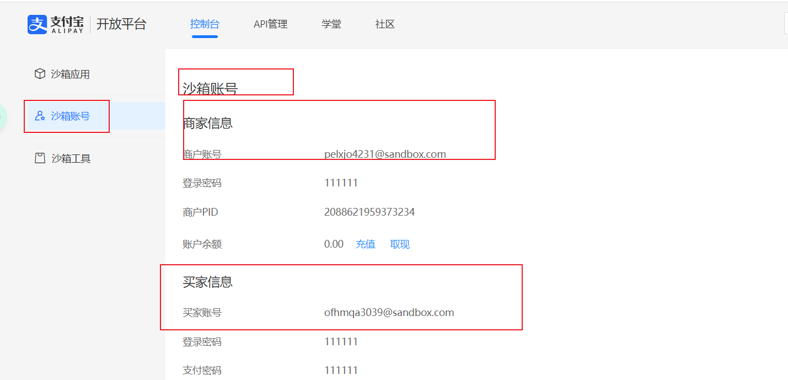

# ⼀、⽀付宝⽀付介绍和接⼊指引

## 1、准备⼯作

### 1.1、创建案例项⽬


### 1.2、⽀付安全相关知识


## 2、⽀付宝开放能⼒介绍

### 2.1、能⼒地图

⽀付能⼒、⽀付扩展、资⾦能⼒、⼝碑能⼒、营销能⼒、会员能⼒、⾏业能⼒、安全能⼒、基础能⼒

### 2.2、电脑⽹站⽀付产品介绍

应⽤场景、准⼊条件、计费模式

## 3、接⼊准备

### 3.1、开放平台账号注册

https://open.alipay.com/
step1：


step2：


step3：


### 3.2、常规接⼊流程

+ **创建应⽤**：选择应⽤类型、填写应⽤基本信息、添加应⽤功能、配置应⽤环境（获取⽀付宝公
  钥、应⽤公钥、应⽤私钥、⽀付宝⽹关地址，配置接⼝内容加密⽅式）、查看 APPID
  
  
  
  
  
+ **绑定应⽤：**将开发者账号中的APPID和商家账号PID进⾏绑定

  

+ **配置秘钥：**即创建应⽤中的“配置应⽤环境”步骤

  

+ **上线应⽤：**将应⽤提交审核

+ **签约功能：**在商家中⼼上传营业执照、已备案⽹站信息等，提交审核进⾏签约


### 3.3、使⽤沙箱

https://open.alipay.com/develop/sandbox/app

沙箱环境配置：https://opendocs.alipay.com/common/02kkv7


#### **基本信息**


#### **加密信息** 

【应用公钥   应用私钥  支付宝公钥】


#### **支付宝网关地址**

`https://openapi.alipaydev.com/gateway.do`

#### **接口内容加密方式**


#### 沙箱账号



#### 沙箱工具【仅提供Android版本】

使用沙箱账号的买家账号登陆，否则商家账号会提示网络正忙


沙箱版⽀付宝的下载和登录：https://open.alipay.com/platform/appDaily.htm?tab=tool

# ⼆、运⾏和配置案例项⽬

## 1、还原数据库

payment_demo.sql，执⾏以下命令还原数据库

```bash
mysql -uroot -p <D:\支付\支付宝\04-资料\02-运行案例项目\payment_demo.sql
```


```sql
/*
SQLyog Ultimate v12.09 (64 bit)
MySQL - 5.7.28-log : Database - payment_demo
*********************************************************************
*/


/*!40101 SET NAMES utf8 */;

/*!40101 SET SQL_MODE=''*/;

/*!40014 SET @OLD_UNIQUE_CHECKS=@@UNIQUE_CHECKS, UNIQUE_CHECKS=0 */;
/*!40014 SET @OLD_FOREIGN_KEY_CHECKS=@@FOREIGN_KEY_CHECKS, FOREIGN_KEY_CHECKS=0 */;
/*!40101 SET @OLD_SQL_MODE=@@SQL_MODE, SQL_MODE='NO_AUTO_VALUE_ON_ZERO' */;
/*!40111 SET @OLD_SQL_NOTES=@@SQL_NOTES, SQL_NOTES=0 */;
CREATE DATABASE /*!32312 IF NOT EXISTS*/`payment_demo` /*!40100 DEFAULT CHARACTER SET utf8mb4 */;

USE `payment_demo`;

/*Table structure for table `t_order_info` */

CREATE TABLE `t_order_info` (
  `id` bigint(11) unsigned NOT NULL AUTO_INCREMENT COMMENT '订单id',
  `title` varchar(256) DEFAULT NULL COMMENT '订单标题',
  `order_no` varchar(50) DEFAULT NULL COMMENT '商户订单编号',
  `payment_type` varchar(20) DEFAULT NULL,
  `user_id` bigint(20) DEFAULT NULL COMMENT '用户id',
  `product_id` bigint(20) DEFAULT NULL COMMENT '支付产品id',
  `total_fee` int(11) DEFAULT NULL COMMENT '订单金额(分)',
  `code_url` varchar(50) DEFAULT NULL COMMENT '订单二维码连接',
  `order_status` varchar(10) DEFAULT NULL COMMENT '订单状态',
  `create_time` datetime DEFAULT CURRENT_TIMESTAMP COMMENT '创建时间',
  `update_time` datetime DEFAULT CURRENT_TIMESTAMP ON UPDATE CURRENT_TIMESTAMP COMMENT '更新时间',
  PRIMARY KEY (`id`)
) ENGINE=InnoDB AUTO_INCREMENT=126 DEFAULT CHARSET=utf8mb4;


CREATE TABLE `t_payment_info` (
  `id` bigint(20) unsigned NOT NULL AUTO_INCREMENT COMMENT '支付记录id',
  `order_no` varchar(50) DEFAULT NULL COMMENT '商户订单编号',
  `transaction_id` varchar(50) DEFAULT NULL COMMENT '支付系统交易编号',
  `payment_type` varchar(20) DEFAULT NULL COMMENT '支付类型',
  `trade_type` varchar(20) DEFAULT NULL COMMENT '交易类型',
  `trade_state` varchar(50) DEFAULT NULL COMMENT '交易状态',
  `payer_total` int(11) DEFAULT NULL COMMENT '支付金额(分)',
  `content` text COMMENT '通知参数',
  `create_time` datetime DEFAULT CURRENT_TIMESTAMP COMMENT '创建时间',
  `update_time` datetime DEFAULT CURRENT_TIMESTAMP ON UPDATE CURRENT_TIMESTAMP COMMENT '更新时间',
  PRIMARY KEY (`id`)
) ENGINE=InnoDB AUTO_INCREMENT=47 DEFAULT CHARSET=utf8mb4;


CREATE TABLE `t_product` (
  `id` bigint(20) NOT NULL AUTO_INCREMENT COMMENT '商品id',
  `title` varchar(20) DEFAULT NULL COMMENT '商品名称',
  `price` int(11) DEFAULT NULL COMMENT '价格（分）',
  `create_time` datetime DEFAULT CURRENT_TIMESTAMP COMMENT '创建时间',
  `update_time` datetime DEFAULT CURRENT_TIMESTAMP ON UPDATE CURRENT_TIMESTAMP COMMENT '更新时间',
  PRIMARY KEY (`id`)
) ENGINE=InnoDB AUTO_INCREMENT=5 DEFAULT CHARSET=utf8mb4;


CREATE TABLE `t_refund_info` (
  `id` bigint(20) unsigned NOT NULL AUTO_INCREMENT COMMENT '退款单id',
  `order_no` varchar(50) DEFAULT NULL COMMENT '商户订单编号',
  `refund_no` varchar(50) DEFAULT NULL COMMENT '商户退款单编号',
  `refund_id` varchar(50) DEFAULT NULL COMMENT '支付系统退款单号',
  `total_fee` int(11) DEFAULT NULL COMMENT '原订单金额(分)',
  `refund` int(11) DEFAULT NULL COMMENT '退款金额(分)',
  `reason` varchar(50) DEFAULT NULL COMMENT '退款原因',
  `refund_status` varchar(50) DEFAULT NULL COMMENT '退款状态',
  `content_return` text COMMENT '申请退款返回参数',
  `content_notify` text COMMENT '退款结果通知参数',
  `create_time` datetime DEFAULT CURRENT_TIMESTAMP COMMENT '创建时间',
  `update_time` datetime DEFAULT CURRENT_TIMESTAMP ON UPDATE CURRENT_TIMESTAMP COMMENT '更新时间',
  PRIMARY KEY (`id`)
) ENGINE=InnoDB AUTO_INCREMENT=23 DEFAULT CHARSET=utf8mb4;
```

## 2、运⾏后端项⽬

⽤idea打开payment-demo，确认maven仓库的位置，修改`application.yml`中的数据库连接配置，运⾏项⽬

## 3、运⾏前端项⽬

安装node.js，如果你希望⽅便的查看和修改前端代码，可以安装⼀个VSCode和相关插件，⽤VSCode打开前端项⽬payment-demo-front，运⾏前端项⽬

```bash
#先进入到前端项目目录
npm run serve
```

## 4、引⼊⽀付参数

### 4.1、引⼊沙箱配置⽂件

将之前准备好的 alipay-sandbox.properties 复制到项⽬的 resources ⽬录中


```properties
# 支付宝支付相关参数

# 应用ID,您的APPID，收款账号既是您的APPID对应支付宝账号
alipay.app-id=2021000120616573

# 商户PID,卖家支付宝账号ID
alipay.seller-id=2088621959373234

# 支付宝网关
alipay.gateway-url=https://openapi.alipaydev.com/gateway.do

# 商户私钥，您的PKCS8格式RSA2私钥
alipay.merchant-private-key=MIIEvgIBADANBgkqhkiG9w0BAQEFAASCBKgwggSkAgEAAoIBAQDb2dMKr4i8nfjcUSHNFHft9b42JcxGvjP/n2MvrlrsOLKNRSe80ue6/n03diYbGZ1Ys1mWp4FMTQnoyqQMkoZG8uu4gSvLeMRy3Iz4J/vIm6MXLfztTB5beXUfQX7ugbgZa7FqVEgFbOrz2OeHrmFQiSfKfsRlYZwqr/HirJAFbB+WtCWJG0bWliaeJfE20mmvLX2DXFiYLH+NXY/j2kVKC00qvvg0KRaA9zAmEAYRy+saA5ZUl7v54lNHyKRLLqvU5E7qiJ509XbvOBFIK2LlzwS6nt2HoI0++htS/k4wRzMaHZ5AnBRQLPKytXTQjLDBTOcKgYrWqTq1H7I/vizRAgMBAAECggEAHZneiHnJ91ttvnxOCMbQvwFvcurz7jJ93dUgDbN0GoonwE2nZA0hllPdmDIYP13bia3cSiSTjCpzQxzFqcuwuKzMgDMkKmlAShbYBDGd/Qy3kM9oVqsBC1/3HRY8ePCOUR3m7WIbsF9R4zM5OVOJVsagzOr0lpHl7PlzoAmL+q6sJfnsx2QiLCC07GCOnsajaSHK20GCDvCnlYaDq0oGUK8Gt78rz7QGG5ij4f1RAhloP3Rx5o2qupsm9BVb/HDxc+1rflOWOokcg7WVvwNLjQLs/FzK5ySZ0xBsdGkKxICE+E9rzM4f8pNefpeN5eURznnA5e6TOgDuUTnyV8PG4QKBgQD+xRxsZVswVHe39a03JXYgbphIC/OzD75+em1EBXgvYvloSSUwSDlUfcpA/Vm3FzQ6EjqLoqeK1765lfdvAAOgzgkDGX+IMTI4P39uNxyORrqKI/HUjj6wExJfmUXsW/x6fLWC111XBqKJRCx3wW/oyAtHJp5C3SrEyy4yhUAqhwKBgQDc6Y3lMwrG5HF91C2sZMMKXIPrDMA5XS50A3GJyRjt52EOOslBzcTiSNcTDq7LZftsiZ85uSVN57Z4hvybmFAB1XQH77LZC9jbcToadjiIfE9fdEY9FMinVdlbf4mF4AiIFUWjS7aYIcGehkPtHlg0uRhUd/qwZnUq4oI449wL5wKBgQDhHt+M0MsRG7Jl9UrH7exBoDgjgZwn34OeUyP19TdL+BMWmXuo/EjcZgKwBq6d4H0fyze8Z0/Qme9IIkHv7X1HPIguGvvcJkyP81vw0fYDqm/u3PA1uDOgdlnH67IjtuyUd1oUcaVi3tQEox7/+weeFBYTGwbBYpkGJ9t8fM5ERQKBgBFwxukPbIxjQKqEc86mbdeFkkyeRxbASoiSNQaBv9wYZksvTPBLBH4w7fntMNOSC5V4EAAIo+9QmdFOJudJ0Rcz+OMfg2krTEWW3NV1++Sam9GXZmwwFd9QIcbdfMf69fF4bHUF5zZ/g7+2LeqseJ5A9rDEgCApFpr6IvnG03qFAoGBAPT6+RK4esm/mSz6wZZoYgMknx12rscrHCJpbpBzXJlvvRagQ1jm8En9bMtu+Ej0FX0gIj30rrsaMRP960DN7FM9OcEqAzyd5zSFW1rW1YisSv2pr3bz+D5rE6+r8+usPt9Dtss4PsLP8xj2lUTupR4BAONnpgIuZXlxsT/XCGXs

# 支付宝公钥,查看地址：https://openhome.alipay.com/platform/keyManage.htm 对应APPID下的支付宝公钥
alipay.alipay-public-key=MIIBIjANBgkqhkiG9w0BAQEFAAOCAQ8AMIIBCgKCAQEAhz2Z0PGEyB2QyJrxoblhd4v85JNHxfaAQggh3E3UCteIZzF5gRZfde4PHkwe8NNl969P0mqPfRf85oG4bjzOab1sSan7Oq/oXUPQj+/4tr43zp+4j9PdqmTcCMx5cvrKciZso/TtwmPXD1BxAENkRYVc++p2Q7OE7nFV+FQJ7Dix4QTebmjlA8IdQ8v6cY+0mzd5VkpNVSwDFYpAWc5pOuv15Xa7T9Ouety1A5VyNW17OQXTeVtNruY72XgnWM/D/nYjC6BjlBvbYc9vmvhlArMOvYF8JdJsmR3tDf7p2xklFkU7wOXkwgFXaVhAr0kEHdblJwnftkDI64FtRam4EQIDAQAB

# 接口内容加密秘钥，对称秘钥
alipay.content-key=YNm7RfscBvyDq/ViyVn3zQ==

# 页面跳转同步通知页面路径
alipay.return-url=http://localhost:8080/#/success

# 服务器异步通知页面路径  需http://格式的完整路径，不能加?id=123这类自定义参数，必须外网可以正常访问
# 注意：每次重新启动ngrok，都需要根据实际情况修改这个配置
alipay.notify-url=https://77ea-221-239-177-21.ngrok.io/api/ali-pay/trade/notify
```

并将其设置为 spring 配置⽂件


### 4.2、创建配置⽂件

在config包中创建`AlipayClientConfig`

```java
package com.atguigu.paymentdemo.config;
@Configuration
//加载配置文件
@PropertySource("classpath:alipay-sandbox.properties")
public class AlipayClientConfig {
}
```

### 4.3、测试配置⽂件的引⼊

```java
package com.atguigu.paymentdemo;

import lombok.extern.slf4j.Slf4j;
import org.junit.jupiter.api.Test;
import org.springframework.boot.test.context.SpringBootTest;
import org.springframework.core.env.Environment;

import javax.annotation.Resource;

@SpringBootTest
@Slf4j
public class AlipayTests {

    @Resource
    private Environment config;

    @Test
    public void testAlipayConfig(){
        log.info(config.getProperty("alipay.app-id"));
    }
}
```

## 5、引⼊服务端SDK

### 5.1、引⼊依赖

参考⽂档：开放平台 => ⽂档 => 开发⼯具 => 服务端SDK => Java => 通⽤版 => Maven项⽬依赖
https://search.maven.org/artifact/com.alipay.sdk/alipay-sdk-java

```xml
        <!--支付宝 SDK-->
        <dependency>
            <groupId>com.alipay.sdk</groupId>
            <artifactId>alipay-sdk-java</artifactId>
            <version>4.22.57.ALL</version>
        </dependency>
```

### 5.2、创建客⼾端连接对象

创建带数据签名的客⼾端对象
参考⽂档：开放平台 => ⽂档 => 开发⼯具 => 技术接⼊指南 => 数据签名

https://opendocs.alipay.com/common/02kf5q
参考⽂档中`公钥方式`完善 AlipayClientConfig 类，添加 alipayClient() ⽅法 初始化 AlipayClient 对象

公钥方式是指开发者将 APPID、应用私钥（private key）、支付宝公钥（alipay public key）配置在代码中对请求内容进行签名，并对支付宝返回的内容进行验签的方法。

开放平台 SDK 封装了签名实现，只需在创建 `DefaultAlipayClient` 对象时，设置请求网关（gateway）、应用 ID（app_id）、应用私钥（private_key）、编码格式（charset）、支付宝公钥（alipay_public_key）、签名类型（sign_type）即可，报文请求时会自动进行签名。

```java
package com.atguigu.paymentdemo.config;

import com.alipay.api.*;
import org.springframework.context.annotation.Bean;
import org.springframework.context.annotation.Configuration;
import org.springframework.context.annotation.PropertySource;
import org.springframework.core.env.Environment;

import javax.annotation.Resource;

@Configuration
//加载配置文件
@PropertySource("classpath:alipay-sandbox.properties")
public class AlipayClientConfig {

    @Resource
    private Environment config;

    @Bean
    public AlipayClient alipayClient() throws AlipayApiException {

        AlipayConfig alipayConfig = new AlipayConfig();

        //设置网关地址
        alipayConfig.setServerUrl(config.getProperty("alipay.gateway-url"));
        //设置应用Id
        alipayConfig.setAppId(config.getProperty("alipay.app-id"));
        //设置应用私钥
        alipayConfig.setPrivateKey(config.getProperty("alipay.merchant-private-key"));
        //设置请求格式，固定值json
        alipayConfig.setFormat(AlipayConstants.FORMAT_JSON);
        //设置字符集
        alipayConfig.setCharset(AlipayConstants.CHARSET_UTF8);
        //设置支付宝公钥
        alipayConfig.setAlipayPublicKey(config.getProperty("alipay.alipay-public-key"));
        //设置签名类型
        alipayConfig.setSignType(AlipayConstants.SIGN_TYPE_RSA2);
        //构造client
        AlipayClient alipayClient = new DefaultAlipayClient(alipayConfig);

        return alipayClient;
    }
}
```

# 三、⽀付功能开发

## 1、统⼀收单下单并⽀付⻚⾯

### 1.1、⽀付调⽤流程

https://opendocs.alipay.com/open/270/105899


调用流程如下：

1. 商家系统调用 [alipay.trade.page.pay](https://opendocs.alipay.com/open/028r8t?scene=22)（统一收单下单并支付页面接口）向支付宝发起支付请求，支付宝对商家请求参数进行校验，而后返回一个form表单，重新定向至支付宝用户登录页面。
2. 用户确认支付后，支付宝通过 get 请求 returnUrl（商户入参传入），返回同步返回参数。
3. 交易成功后，支付宝通过 post 请求 notifyUrl（商户入参传入），返回异步通知参数。
4. 若由于网络等原因，导致商家系统没有收到异步通知，商家可自行调用 [alipay.trade.query](https://opendocs.alipay.com/open/028woa)（统一收单线下交易查询接口）查询交易以及支付信息（商家也可以直接调用该查询接口，不需要依赖异步通知）。

**注意**： 

- 由于同步返回的不可靠性，支付结果必须以异步通知或查询接口返回为准，不能依赖同步跳转。
- 商家系统接收到异步通知以后，必须通过验签（验证通知中的 sign 参数）来确保支付通知是由支付宝发送的。详细验签规则可查看 [异步通知验签](https://opendocs.alipay.com/open/270/105902#s7)。
- 接收到异步通知并验签通过后，请务必核对通知中的 app_id、out_trade_no、total_amount 等参数值是否与请求中的一致，并根据 trade_status 进行后续业务处理。
- 在支付宝端，partnerId 与 out_trade_no 唯一对应一笔单据，商家端保证不同次支付 out_trade_no 不可重复；若重复，支付宝会关联到原单据，基本信息一致的情况下会以原单据为准进行支付。

### 1.2、接⼝说明

API：https://opendocs.alipay.com/apis/028r8t?scene=22

API：https://opendocs.alipay.com/open/028r8t?scene=22

公共请求参数：所有接⼝都需要的参数
请求参数：当前接⼝需要的参数
公共响应参数：所有接⼝的响应中都包含的数据
响应参数：当前接⼝的响应中包含的数据

### 1.3、发起⽀付请求

#### （1）创建 AliPayController

```java
package com.atguigu.paymentdemo.controller;

import com.atguigu.paymentdemo.service.AliPayService;
import com.atguigu.paymentdemo.vo.R;
import io.swagger.annotations.Api;
import io.swagger.annotations.ApiOperation;
import lombok.extern.slf4j.Slf4j;
import org.springframework.web.bind.annotation.*;

import javax.annotation.Resource;

@CrossOrigin
@RestController
@RequestMapping("/api/ali-pay")
@Api(tags = "网站支付宝支付")
@Slf4j
public class AliPayController {

    @Resource
    private AliPayService aliPayService;
    

    @ApiOperation("统一收单下单并支付页面接口的调用")
    @PostMapping("/trade/page/pay/{productId}")
    public R tradePagePay(@PathVariable Long productId){

        log.info("统一收单下单并支付页面接口的调用");
        //支付宝开放平台接受 request 请求对象后
        // 会为开发者生成一个html 形式的 form表单，包含自动提交的脚本
        String formStr = aliPayService.tradeCreate(productId);
        //我们将form表单字符串返回给前端程序，之后前端将会调用自动提交脚本，进行表单的提交
        //此时，表单会自动提交到action属性所指向的支付宝开放平台中，从而为用户展示一个支付页面
        return R.ok().data("formStr", formStr);
    }
    
}

```

#### （2）创建 AliPayService

接⼝

```java
package com.atguigu.paymentdemo.service;

public interface AliPayService {
	 /**
     * 支付宝开放平台接受 request 请求对象后
     * 会为开发者生成一个html 形式的 form表单，包含自动提交的脚本
     *
     * @param productId
     * @return
     */
    String tradeCreate(Long productId);
}
```

实现

```java
@Service
@Slf4j
public class AliPayServiceImpl implements AliPayService {

    @Resource
    private OrderInfoService orderInfoService;

    @Resource
    private AlipayClient alipayClient;

    @Resource
    private Environment config;

    @Transactional(rollbackFor = Exception.class)
    @Override
    public String tradeCreate(Long productId) {

        try {
            //生成订单
            log.info("生成订单");
            OrderInfo orderInfo = orderInfoService.createOrderByProductId(productId, PayType.ALIPAY.getType());

            //调用支付宝接口
            AlipayTradePagePayRequest request = new AlipayTradePagePayRequest();
            //配置需要的公共请求参数
            //支付完成后，支付宝向谷粒学院发起异步通知的地址
            request.setNotifyUrl(config.getProperty("alipay.notify-url"));
            //支付完成后，我们想让页面跳转回谷粒学院的页面，配置returnUrl
            request.setReturnUrl(config.getProperty("alipay.return-url"));

            //组装当前业务方法的请求参数
            JSONObject bizContent = new JSONObject();
            bizContent.put("out_trade_no", orderInfo.getOrderNo());//商户订单号
            BigDecimal total = new BigDecimal(orderInfo.getTotalFee().toString()).divide(new BigDecimal("100"));
            bizContent.put("total_amount", total);//金额
            bizContent.put("subject", orderInfo.getTitle());//订单标题
            bizContent.put("product_code", "FAST_INSTANT_TRADE_PAY");
            

            request.setBizContent(bizContent.toString());

            //执行请求，调用支付宝接口
            AlipayTradePagePayResponse response = alipayClient.pageExecute(request);

            if(response.isSuccess()){
                log.info("调用成功，返回结果 ===> " + response.getBody());
                return response.getBody();
            } else {
                log.info("调用失败，返回码 ===> " + response.getCode() + ", 返回描述 ===> " + response.getMsg());
                throw new RuntimeException("创建支付交易失败");
            }
        } catch (AlipayApiException e) {
            e.printStackTrace();
            throw new RuntimeException("创建支付交易失败");
        }
    }
}
```


```html
// 响应为表单格式，可嵌入页面，具体以返回的结果为准
<form name="submit_form" method="post" action="https://openapi.alipay.com/gateway.do?charset=UTF-8&method=alipay.trade.page.pay&sign=k0w1DePFqNMQWyGBwOaEsZEJuaIEQufjoPLtwYBYgiX%2FRSkBFY38VuhrNumXpoPY9KgLKtm4nwWz4DEQpGXOOLaqRZg4nDOGOyCmwHmVSV5qWKDgWMiW%2BLC2f9Buil%2BEUdE8CFnWhM8uWBZLGUiCrAJA14hTjVt4BiEyiPrtrMZu0o6%2FXsBu%2Fi6y4xPR%2BvJ3KWU8gQe82dIQbowLYVBuebUMc79Iavr7XlhQEFf%2F7WQcWgdmo2pnF4tu0CieUS7Jb0FfCwV%2F8UyrqFXzmCzCdI2P5FlMIMJ4zQp%2BTBYsoTVK6tg12stpJQGa2u3%2BzZy1r0KNzxcGLHL%2BwWRTx%2FCU%2Fg%3D%3D&notify_url=http%3A%2F%2F114.55.81.185%2Fopendevtools%2Fnotify%2Fdo%2Fbf70dcb4-13c9-4458-a547-3a5a1e8ead04&version=1.0&app_id=2014100900013222&sign_type=RSA&timestamp=2021-02-02+14%3A11%3A40&alipay_sdk=alipay-sdk-java-dynamicVersionNo&format=json">
<input type="submit" value="提交" style="display:none" >
</form>
<script>document.forms[0].submit();</script>
```


### 1.4、前端⽀付按钮

### （1）index.vue

```js
  //确认支付
    toPay() {
      //禁用按钮，防止重复提交
      this.payBtnDisabled = true

      //微信支付
      if (this.payOrder.payType === 'wxpay') {
        //调用统一下单接口
        wxPayApi.nativePay(this.payOrder.productId).then((response) => {
			...
        })

        //支付宝支付
      } else if (this.payOrder.payType === 'alipay') {

        //调用支付宝统一收单下单并支付页面接口
        aliPayApi.tradePagePay(this.payOrder.productId).then((response) => {
          //将支付宝返回的表单字符串写在浏览器中，表单会自动触发submit提交
          document.write(response.data.formStr)
        })
      }
    },
```

### （2）aliPay.js

```js
// axios 发送ajax请求
import request from '@/utils/request'
export default{
    //发起支付请求
    tradePagePay(productId) {
        return request({
            url: '/api/ali-pay/trade/page/pay/' + productId,
            method: 'post'
        })
    }
}
```

## 2、⽀付结果通知

### 2.1、设置异步通知地址

在`AliPayServiceImpl` 的`tradeCreate` ⽅法中设置异步通知地址

```java
//配置需要的公共请求参数
//支付完成后，支付宝向谷粒学院发起异步通知的地址
request.setNotifyUrl(config.getProperty("alipay.notify-url"));
```

### 2.2、启动内⽹穿透ngrok

```bash
ngrok http 8090
```

### 2.3、修改内⽹穿透配置

根据ngrok每次启动的情况，修改`alipay-sandbox.properties` ⽂件中的`alipay.notify-url`

```properties
# 服务器异步通知页面路径 需http://格式的完整路径，不能加?id=123这类自定义参数，必须外网可以正常
访问
# 注意：每次重新启动ngrok，都需要根据实际情况修改这个配置
alipay.notify-url=https://a863-180-174-204-169.ngrok.io/api/ali-pay/trade/notify
```

### 2.4、开发异步通知接⼝

https://opendocs.alipay.com/open/270/105902


#### （1）AliPayController

```java
    @Resource
    private Environment config;

    @Resource
    private OrderInfoService orderInfoService;

    @ApiOperation("支付通知")
    @PostMapping("/trade/notify")
    public String tradeNotify(@RequestParam Map<String, String> params){

        log.info("支付通知正在执行");
        log.info("通知参数 ===> {}", params);

        String result = "failure";

        try {
            //异步通知验签
            boolean signVerified = AlipaySignature.rsaCheckV1(
                    params,
                    config.getProperty("alipay.alipay-public-key"),
                    AlipayConstants.CHARSET_UTF8,
                    AlipayConstants.SIGN_TYPE_RSA2); //调用SDK验证签名

            if(!signVerified){
                //验签失败则记录异常日志，并在response中返回failure.
                log.error("支付成功异步通知验签失败！");
                return result;
            }

            // 验签成功后
            log.info("支付成功异步通知验签成功！");

            //按照支付结果异步通知中的描述，对支付结果中的业务内容进行二次校验，
            //1 商户需要验证该通知数据中的 out_trade_no 是否为商户系统中创建的订单号
            String outTradeNo = params.get("out_trade_no");
            OrderInfo order = orderInfoService.getOrderByOrderNo(outTradeNo);
            if(order == null){
                log.error("订单不存在");
                return result;
            }

            //2 判断 total_amount 是否确实为该订单的实际金额（即商户订单创建时的金额）
            String totalAmount = params.get("total_amount");
            int totalAmountInt = new BigDecimal(totalAmount).multiply(new BigDecimal("100")).intValue();
            int totalFeeInt = order.getTotalFee().intValue();
            if(totalAmountInt != totalFeeInt){
                log.error("金额校验失败");
                return result;
            }

            //3 校验通知中的 seller_id（或者 seller_email) 是否为 out_trade_no 这笔单据的对应的操作方
            String sellerId = params.get("seller_id");
            String sellerIdProperty = config.getProperty("alipay.seller-id");
            if(!sellerId.equals(sellerIdProperty)){
                log.error("商家pid校验失败");
                return result;
            }

            //4 验证 app_id 是否为该商户本身
            String appId = params.get("app_id");
            String appIdProperty = config.getProperty("alipay.app-id");
            if(!appId.equals(appIdProperty)){
                log.error("appid校验失败");
                return result;
            }

            //在支付宝的业务通知中，只有交易通知状态为 TRADE_SUCCESS时，
            // 支付宝才会认定为买家付款成功。
            String tradeStatus = params.get("trade_status");
            if(!"TRADE_SUCCESS".equals(tradeStatus)){
                log.error("支付未成功");
                return result;
            }

            //处理业务 修改订单状态 记录支付日志
            aliPayService.processOrder(params);

            //校验成功后在response中返回success并继续商户自身业务处理，校验失败返回failure
            result = "success";
        } catch (AlipayApiException e) {
            e.printStackTrace();
        }
        return result;
    }

```

#### （2）AliPayService

接⼝

```java
void processOrder(Map<String, String> params);
```

实现

```java
    /**
     * 处理订单
     * @param params
     */
    @Transactional(rollbackFor = Exception.class)
    @Override
    public void processOrder(Map<String, String> params) {

        log.info("处理订单");
        //获取订单号
        String orderNo = params.get("out_trade_no");
        //更新订单状态
        orderInfoService.updateStatusByOrderNo(orderNo, OrderStatus.SUCCESS);
        //记录支付日志
        paymentInfoService.createPaymentInfoForAliPay(params);

    }
```

### 2.5、记录⽀付⽇志

PaymentInfoService
接⼝

```java
void createPaymentInfoForAliPay(Map<String, String> params);
```

实现

```java
   /**
     * 记录支付日志：支付宝
     * @param params
     */
    @Override
    public void createPaymentInfoForAliPay(Map<String, String> params) {

        log.info("记录支付日志");

        //获取订单号
        String orderNo = params.get("out_trade_no");
        //业务编号
        String transactionId = params.get("trade_no");
        //交易状态
        String tradeStatus = params.get("trade_status");
        //交易金额
        String totalAmount = params.get("total_amount");
        int totalAmountInt = new BigDecimal(totalAmount).multiply(new BigDecimal("100")).intValue();


        PaymentInfo paymentInfo = new PaymentInfo();
        paymentInfo.setOrderNo(orderNo);
        paymentInfo.setPaymentType(PayType.ALIPAY.getType());
        paymentInfo.setTransactionId(transactionId);
        paymentInfo.setTradeType("电脑网站支付");
        paymentInfo.setTradeState(tradeStatus);
        paymentInfo.setPayerTotal(totalAmountInt);

        Gson gson = new Gson();
        String json = gson.toJson(params, HashMap.class);
        paymentInfo.setContent(json);

        baseMapper.insert(paymentInfo);
    }
```

### 2.6、更新订单状态记录⽀付⽇志


在 `processOrder` ⽅法中，更新订单状态之前，添加如下代码

```java
//处理重复通知
//接口调用的幂等性：无论接口被调用多少次，以下业务执行一次
String orderStatus = orderInfoService.getOrderStatus(orderNo);
if (!OrderStatus.NOTPAY.getType().equals(orderStatus)) {
	return;
}
```

### 2.7、数据锁

在`AliPayServiceImpl` 中定义 `ReentrantLock` 进⾏并发控制。注意，必须⼿动释放锁。

```java
private final ReentrantLock lock = new ReentrantLock();
```

完整的`processOrder` ⽅法

```java
    /**
     * 处理订单
     * @param params
     */
    @Transactional(rollbackFor = Exception.class)
    @Override
    public void processOrder(Map<String, String> params) {

        log.info("处理订单");

        //获取订单号
        String orderNo = params.get("out_trade_no");

        /*在对业务数据进行状态检查和处理之前，
        要采用数据锁进行并发控制，
        以避免函数重入造成的数据混乱*/
        //尝试获取锁：
        // 成功获取则立即返回true，获取失败则立即返回false。不必一直等待锁的释放
        if(lock.tryLock()) {
            try {

                //处理重复通知
                //接口调用的幂等性：无论接口被调用多少次，以下业务执行一次
                String orderStatus = orderInfoService.getOrderStatus(orderNo);
                if (!OrderStatus.NOTPAY.getType().equals(orderStatus)) {
                    return;
                }

                //更新订单状态
                orderInfoService.updateStatusByOrderNo(orderNo, OrderStatus.SUCCESS);

                //记录支付日志
                paymentInfoService.createPaymentInfoForAliPay(params);

            } finally {
                //要主动释放锁
                lock.unlock();
            }
        }

    }
```

## 3、订单表优化

### 3.1、表修改

`t_order_info` 表中添加`payment_type` 字段

### 3.2、业务修改

（1）修改⽀付业务代码
修改`AliPayServiceImpl` 、`WxPayServiceImpl` 代码中对如下⽅法的调⽤， 添加参数`PayType.ALIPAY.getType()`

```java
log.info("生成订单");
OrderInfo orderInfo = orderInfoService.createOrderByProductId(productId,
PayType.ALIPAY.getType());
```

（2）修改OrderInfoService
接⼝的createOrderByProductId ⽅法中添加参数 String paymentType

```java
OrderInfo createOrderByProductId(Long productId, String paymentType);
```

实现类的createOrderByProductId ⽅法中添加参数String paymentType
对getNoPayOrderByProductId ⽅法的调⽤时添加参数paymentType
⽣成订单的过程中添加orderInfo.setPaymentType(paymentType);

```java
@Override
public OrderInfo createOrderByProductId(Long productId, String paymentType) {
    //查找已存在但未支付的订单
    OrderInfo orderInfo = this.getNoPayOrderByProductId(productId, paymentType);
    if( orderInfo != null){
    	return orderInfo;
    }
    //获取商品信息
    Product product = productMapper.selectById(productId);
    //生成订单
    orderInfo = new OrderInfo();
    orderInfo.setTitle(product.getTitle());
    orderInfo.setOrderNo(OrderNoUtils.getOrderNo()); //订单号
    orderInfo.setProductId(productId);
    orderInfo.setTotalFee(product.getPrice()); //分
    orderInfo.setOrderStatus(OrderStatus.NOTPAY.getType()); //未支付
    orderInfo.setPaymentType(paymentType);
    baseMapper.insert(orderInfo);
    return orderInfo;
}
```

对getNoPayOrderByProductId ⽅法的定义时添加参数paymentType
添加查询条件queryWrapper.eq("payment_type", paymentType);

```java
/**
* 根据商品id查询未支付订单
* 防止重复创建订单对象
* @param productId
* @return
*/
private OrderInfo getNoPayOrderByProductId(Long productId, String paymentType){
    QueryWrapper<OrderInfo> queryWrapper = new QueryWrapper<>();
    queryWrapper.eq("product_id", productId);
    queryWrapper.eq("order_status", OrderStatus.NOTPAY.getType());
    queryWrapper.eq("payment_type", paymentType);
    // queryWrapper.eq("user_id", userId);
    OrderInfo orderInfo = baseMapper.selectOne(queryWrapper);
    return orderInfo;
}
```

## 4、统⼀收单交易关闭

### 4.1、定义⽤⼾取消订单接⼝

在AliPayController 中添加⽅法

```java
/**
* 用户取消订单
* @param orderNo
* @return
*/
@ApiOperation("用户取消订单")
@PostMapping("/trade/close/{orderNo}")
public R cancel(@PathVariable String orderNo){
    log.info("取消订单");
    aliPayService.cancelOrder(orderNo);
    return R.ok().setMessage("订单已取消");
}
```

### 4.2、关单并修改订单状态

AliPayService 接⼝

```java
/**
* 用户取消订单
* @param orderNo
*/
void cancelOrder(String orderNo);
```

AliPayServiceImpl 实现

```java
@Override
public void cancelOrder(String orderNo) {
    //调用支付宝提供的统一收单交易关闭接口
    this.closeOrder(orderNo);
    //更新用户订单状态
    orderInfoService.updateStatusByOrderNo(orderNo, OrderStatus.CANCEL);
}
```

### 4.3、调⽤⽀付宝接⼝

AliPayServiceImpl 中添加辅助⽅法

```java
/**
* 关单接口的调用
* @param orderNo 订单号
*/
private void closeOrder(String orderNo) {
    try {
        log.info("关单接口的调用，订单号 ===> {}", orderNo);
        AlipayTradeCloseRequest request = new AlipayTradeCloseRequest();
        JSONObject bizContent = new JSONObject();
        bizContent.put("out_trade_no", orderNo);
        request.setBizContent(bizContent.toString());
        AlipayTradeCloseResponse response = alipayClient.execute(request);
        if(response.isSuccess()){
            log.info("调用成功，返回结果 ===> " + response.getBody());
        } else {
            log.info("调用失败，返回码 ===> " + response.getCode() + ", 返回描述    ===> " + response.getMsg());
        //throw new RuntimeException("关单接口的调用失败");
        }
    } catch (AlipayApiException e) {
    	e.printStackTrace();
    	throw new RuntimeException("关单接口的调用失败");
    }
}
```

### 4.4、测试

注意：针对⼆维码⽀付，只有经过扫码的订单才在⽀付宝端有交易记录。针对⽀付宝账号⽀付，只有经过登录的订单才在⽀付宝端有交易记录。

## 5、统⼀收单线下交易查询

### 5.1、查单接⼝的调⽤

商⼾后台未收到异步⽀付结果通知时，商⼾应该主动调⽤《统⼀收单线下交易查询接⼝》，同步订单状态。

#### （1）AliPayController

```java
/**
* 查询订单
* @param orderNo
* @return
* @throws Exception
*/
@ApiOperation("查询订单：测试订单状态用")
@GetMapping("/trade/query/{orderNo}")
public R queryOrder(@PathVariable String orderNo) {
    log.info("查询订单");
    String result = aliPayService.queryOrder(orderNo);
    return R.ok().setMessage("查询成功").data("result", result);
}
```

### （2）AliPayService

接⼝

```java
String queryOrder(String orderNo);
```

实现

```java
/**
  * 查询订单
  * @param orderNo
  * @return 返回订单查询结果，如果返回null则表示支付宝端尚未创建订单
  */
@Override
public String queryOrder(String orderNo) {

    try {
        log.info("查单接口调用 ===> {}", orderNo);

        AlipayTradeQueryRequest request = new AlipayTradeQueryRequest();
        JSONObject bizContent = new JSONObject();
        bizContent.put("out_trade_no", orderNo);
        request.setBizContent(bizContent.toString());

        AlipayTradeQueryResponse response = alipayClient.execute(request);
        if(response.isSuccess()){
            log.info("调用成功，返回结果 ===> " + response.getBody());
            return response.getBody();
        } else {
            log.info("调用失败，返回码 ===> " + response.getCode() + ", 返回描述 ===> " + response.getMsg());
            //throw new RuntimeException("查单接口的调用失败");
            return null;//【订单不存在】
        }

    } catch (AlipayApiException e) {
        e.printStackTrace();
        throw new RuntimeException("查单接口的调用失败");
    }
}
```

### 5.2、定时查单

#### （1）创建AliPayTask

```java
package com.atguigu.paymentdemo.task;

import com.atguigu.paymentdemo.entity.OrderInfo;
import com.atguigu.paymentdemo.enums.PayType;
import com.atguigu.paymentdemo.service.AliPayService;
import com.atguigu.paymentdemo.service.OrderInfoService;
import lombok.extern.slf4j.Slf4j;
import org.springframework.scheduling.annotation.Scheduled;
import org.springframework.stereotype.Component;

import javax.annotation.Resource;
import java.util.List;

@Slf4j
@Component
public class AliPayTask {

    @Resource
    private OrderInfoService orderInfoService;

    @Resource
    private AliPayService aliPayService;

    /**
     * 从第0秒开始每隔30秒执行1次，查询创建超过5分钟，并且未支付的订单
     */
    @Scheduled(cron = "0/30 * * * * ?")
    public void orderConfirm(){

        log.info("orderConfirm 被执行......");

        List<OrderInfo> orderInfoList = orderInfoService.getNoPayOrderByDuration(1, PayType.ALIPAY.getType());

        for (OrderInfo orderInfo : orderInfoList) {
            String orderNo = orderInfo.getOrderNo();
            log.warn("超时订单 ===> {}", orderNo);

            //核实订单状态：调用支付宝查单接口
            aliPayService.checkOrderStatus(orderNo);
        }
    }
}

```

#### （2）修改OrderInfoService

接⼝添加参数`String paymentType`

```java
List<OrderInfo> getNoPayOrderByDuration(int minutes, String paymentType);
```

实现添加参数String paymentType ， 添加查询条件queryWrapper.eq("payment_type",paymentType);

```java
/**
* 找出创建超过minutes分钟并且未支付的订单
* @param minutes
* @return
*/
@Override
public List<OrderInfo> getNoPayOrderByDuration(int minutes, String paymentType) {
    //minutes分钟之前的时间
    Instant instant = Instant.now().minus(Duration.ofMinutes(minutes));
    QueryWrapper<OrderInfo> queryWrapper = new QueryWrapper<>();
    queryWrapper.eq("order_status", OrderStatus.NOTPAY.getType());
    queryWrapper.le("create_time", instant);
    queryWrapper.eq("payment_type", paymentType);
    List<OrderInfo> orderInfoList = baseMapper.selectList(queryWrapper);
    return orderInfoList;
}
```

#### （3）修改WxPayTask

将之前微信⽀付的⽅法调⽤也做⼀个优化
orderConfirm ⽅法中对getNoPayOrderByDuration 的调⽤添加参数 PayType.WXPAY.getType()

```java
List<OrderInfo> orderInfoList = orderInfoService.getNoPayOrderByDuration(1,
PayType.WXPAY.getType());
```

### 5.3、处理查询到的订单

#### （1）AliPayTask

在定时任务的for循环最后添加以下代码

```java
//核实订单状态：调用支付宝查单接口
aliPayService.checkOrderStatus(orderNo);
```

#### （2）AliPayService

核实订单状态

```java
void checkOrderStatus(String orderNo);
```

实现：

```java
    /**
     * 根据订单号调用支付宝查单接口，核实订单状态
     * 如果订单未创建，则更新商户端订单状态
     * 如果订单未支付，则调用关单接口关闭订单，并更新商户端订单状态
     * 如果订单已支付，则更新商户端订单状态，并记录支付日志
     * @param orderNo
     */
    @Override
    public void checkOrderStatus(String orderNo) {

        log.warn("根据订单号核实订单状态 ===> {}", orderNo);

        String result = this.queryOrder(orderNo);

        //订单未创建
        if(result == null){
            log.warn("核实订单未创建 ===> {}", orderNo);
            //更新本地订单状态
            orderInfoService.updateStatusByOrderNo(orderNo, OrderStatus.CLOSED);
        }

        //解析查单响应结果
        Gson gson = new Gson();
        HashMap<String, LinkedTreeMap> resultMap = gson.fromJson(result, HashMap.class);
        LinkedTreeMap alipayTradeQueryResponse = resultMap.get("alipay_trade_query_response");

        String tradeStatus = (String)alipayTradeQueryResponse.get("trade_status");
        if(AliPayTradeState.NOTPAY.getType().equals(tradeStatus)){
            log.warn("核实订单未支付 ===> {}", orderNo);

            //如果订单未支付，则调用关单接口关闭订单
            this.closeOrder(orderNo);

            // 并更新商户端订单状态
            orderInfoService.updateStatusByOrderNo(orderNo, OrderStatus.CLOSED);
        }

        if(AliPayTradeState.SUCCESS.getType().equals(tradeStatus)){
            log.warn("核实订单已支付 ===> {}", orderNo);

            //如果订单已支付，则更新商户端订单状态
            orderInfoService.updateStatusByOrderNo(orderNo, OrderStatus.SUCCESS);

            //并记录支付日志
            paymentInfoService.createPaymentInfoForAliPay(alipayTradeQueryResponse);
        }

    }
```

## 6、统⼀收单交易退款

### 6.1、退款接⼝

#### （1）AliPayController

```java
/**
* 申请退款
* @param orderNo
* @param reason
* @return
*/
@ApiOperation("申请退款")
@PostMapping("/trade/refund/{orderNo}/{reason}")
public R refunds(@PathVariable String orderNo, @PathVariable String reason){
    log.info("申请退款");
    aliPayService.refund(orderNo, reason);
    return R.ok();
}
```

#### （2）AliPayService

接⼝

```java
void refund(String orderNo, String reason);
```

实现

```java
    /**
     * 退款
     * @param orderNo
     * @param reason
     */
    @Transactional(rollbackFor = Exception.class)
    @Override
    public void refund(String orderNo, String reason) {

        try {
            log.info("调用退款API");

            //创建退款单
            RefundInfo refundInfo = refundsInfoService.createRefundByOrderNoForAliPay(orderNo, reason);

            //调用统一收单交易退款接口
            AlipayTradeRefundRequest request = new AlipayTradeRefundRequest ();

            //组装当前业务方法的请求参数
            JSONObject bizContent = new JSONObject();
            bizContent.put("out_trade_no", orderNo);//订单编号
            BigDecimal refund = new BigDecimal(refundInfo.getRefund().toString()).divide(new BigDecimal("100"));
            //BigDecimal refund = new BigDecimal("2").divide(new BigDecimal("100"));
            bizContent.put("refund_amount", refund);//退款金额：不能大于支付金额
            bizContent.put("refund_reason", reason);//退款原因(可选)

            request.setBizContent(bizContent.toString());

            //执行请求，调用支付宝接口
            AlipayTradeRefundResponse response = alipayClient.execute(request);

            if(response.isSuccess()){
                log.info("调用成功，返回结果 ===> " + response.getBody());

                //更新订单状态
                orderInfoService.updateStatusByOrderNo(orderNo, OrderStatus.REFUND_SUCCESS);

                //更新退款单
                refundsInfoService.updateRefundForAliPay(
                        refundInfo.getRefundNo(),
                        response.getBody(),
                        AliPayTradeState.REFUND_SUCCESS.getType()); //退款成功

            } else {
                log.info("调用失败，返回码 ===> " + response.getCode() + ", 返回描述 ===> " + response.getMsg());

                //更新订单状态
                orderInfoService.updateStatusByOrderNo(orderNo, OrderStatus.REFUND_ABNORMAL);

                //更新退款单
                refundsInfoService.updateRefundForAliPay(
                        refundInfo.getRefundNo(),
                        response.getBody(),
                        AliPayTradeState.REFUND_ERROR.getType()); //退款失败
            }


        } catch (AlipayApiException e) {
            e.printStackTrace();
            throw new RuntimeException("创建退款申请失败");
        }
    }
```

### 6.2、创建退款记录

RefundInfoService
接⼝

```java
RefundInfo createRefundByOrderNoForAliPay(String orderNo, String reason);
```

实现

```java
/**
* 根据订单号创建退款订单
* @param orderNo
* @return
*/
@Override
public RefundInfo createRefundByOrderNoForAliPay(String orderNo, String reason) {
    //根据订单号获取订单信息
    OrderInfo orderInfo = orderInfoService.getOrderByOrderNo(orderNo);
    //根据订单号生成退款订单
    RefundInfo refundInfo = new RefundInfo();
    refundInfo.setOrderNo(orderNo);//订单编号
    refundInfo.setRefundNo(OrderNoUtils.getRefundNo());//退款单编号
    refundInfo.setTotalFee(orderInfo.getTotalFee());//原订单金额(分)
    refundInfo.setRefund(orderInfo.getTotalFee());//退款金额(分)
    refundInfo.setReason(reason);//退款原因
    //保存退款订单
    baseMapper.insert(refundInfo);
    return refundInfo;
}
```

### 6.3、更新退款记录

RefundInfoService
接⼝

```java
void updateRefundForAliPay(String refundNo, String content, String refundStatus);
```

实现

```java
/**
 * 更新退款记录
 * @param refundNo
 * @param content
 * @param refundStatus
 */
@Override
public void updateRefundForAliPay(String refundNo, String content, String refundStatus) {

    //根据退款单编号修改退款单
    QueryWrapper<RefundInfo> queryWrapper = new QueryWrapper<>();
    queryWrapper.eq("refund_no", refundNo);

    //设置要修改的字段
    RefundInfo refundInfo = new RefundInfo();
    refundInfo.setRefundStatus(refundStatus);//退款状态
    refundInfo.setContentReturn(content);//将全部响应结果存入数据库的content字段

    //更新退款单
    baseMapper.update(refundInfo, queryWrapper);

}
```

## 7、统⼀收单交易退款查询

### 7.1 退款查询

#### （1）AliPayController

```java
/**
* 查询退款
* @param orderNo
* @return
* @throws Exception
*/
@ApiOperation("查询退款：测试用")
@GetMapping("/trade/fastpay/refund/{orderNo}")
public R queryRefund(@PathVariable String orderNo) throws Exception {
    log.info("查询退款");
    String result = aliPayService.queryRefund(orderNo);
    return R.ok().setMessage("查询成功").data("result", result);
}
```

#### （2）AliPayService

接⼝

```java
String queryRefund(String orderNo);
```

实现

```java
    /**
     * 查询退款
     * @param orderNo
     * @return
     */
    @Override
    public String queryRefund(String orderNo) {

        try {
            log.info("查询退款接口调用 ===> {}", orderNo);

            AlipayTradeFastpayRefundQueryRequest request = new AlipayTradeFastpayRefundQueryRequest();
            JSONObject bizContent = new JSONObject();
            bizContent.put("out_trade_no", orderNo);
            bizContent.put("out_request_no", orderNo);
            request.setBizContent(bizContent.toString());

            AlipayTradeFastpayRefundQueryResponse response = alipayClient.execute(request);
            if(response.isSuccess()){
                log.info("调用成功，返回结果 ===> " + response.getBody());
                return response.getBody();
            } else {
                log.info("调用失败，返回码 ===> " + response.getCode() + ", 返回描述 ===> " + response.getMsg());
                //throw new RuntimeException("查单接口的调用失败");
                return null;//订单不存在
            }

        } catch (AlipayApiException e) {
            e.printStackTrace();
            throw new RuntimeException("查单接口的调用失败");
        }
    }
```

## 8、收单退款冲退完成通知

退款存在退到银⾏卡场景下时，收单会根据银⾏回执消息发送退款完成信息。
开发流程类似⽀付结果通知。

## 9、对账

### 9.1 查询对账单下载地址接⼝

#### （1）AliPayController

```java
    /**
     * 根据账单类型和日期获取账单url地址
     *
     * @param billDate
     * @param type
     * @return
     */
    @ApiOperation("获取账单url")
    @GetMapping("/bill/downloadurl/query/{billDate}/{type}")
    public R queryTradeBill(
            @PathVariable String billDate,
            @PathVariable String type)  {
        log.info("获取账单url");
        String downloadUrl = aliPayService.queryBill(billDate, type);
        return R.ok().setMessage("获取账单url成功").data("downloadUrl", downloadUrl);
    }
```

（2）AliPayService
接⼝

```java
String queryBill(String billDate, String type);
```

实现

```java
    /**
     * 申请账单
     * @param billDate
     * @param type
     * @return
     */
    @Override
    public String queryBill(String billDate, String type) {

        try {

            AlipayDataDataserviceBillDownloadurlQueryRequest request = new AlipayDataDataserviceBillDownloadurlQueryRequest();
            JSONObject bizContent = new JSONObject();
            bizContent.put("bill_type", type);
            bizContent.put("bill_date", billDate);
            request.setBizContent(bizContent.toString());
            AlipayDataDataserviceBillDownloadurlQueryResponse response = alipayClient.execute(request);

            if(response.isSuccess()){
                log.info("调用成功，返回结果 ===> " + response.getBody());

                //获取账单下载地址
                Gson gson = new Gson();
                HashMap<String, LinkedTreeMap> resultMap = gson.fromJson(response.getBody(), HashMap.class);
                LinkedTreeMap billDownloadurlResponse = resultMap.get("alipay_data_dataservice_bill_downloadurl_query_response");
                String billDownloadUrl = (String)billDownloadurlResponse.get("bill_download_url");

                return billDownloadUrl;
            } else {
                log.info("调用失败，返回码 ===> " + response.getCode() + ", 返回描述 ===> " + response.getMsg());
                throw new RuntimeException("申请账单失败");
            }

        } catch (AlipayApiException e) {
            e.printStackTrace();
            throw new RuntimeException("申请账单失败");
        }
    }
```

