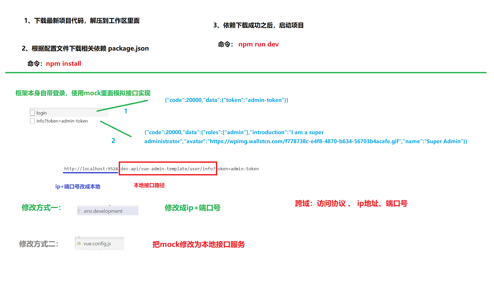
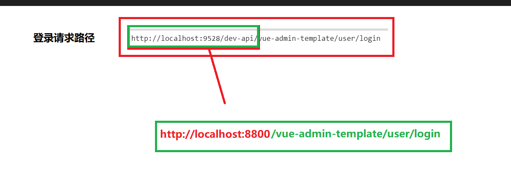

# 云尚办公系统：角色管理前端

## 一、前端框架



### 1、**vue-element-admin** 

vue-element-admin是基于element-ui 的一套后台管理系统集成方案。

**功能：**https://panjiachen.github.io/vue-element-admin-site/zh/guide/#功能

**GitHub地址：**https://github.com/PanJiaChen/vue-element-admin

**项目在线预览：**[https://panjiachen.gitee.io/vue-element-admin](https://panjiachen.gitee.io/vue-element-admin/#/login?redirect=%2Fdashboard)

### 2、vue-admin-template

#### 2.1、简介

vue-admin-template是基于vue-element-admin的一套后台管理系统基础模板（最少精简版），可作为模板进行二次开发。

**GitHub地址：**https://github.com/PanJiaChen/vue-admin-template

**建议：**你可以在 `vue-admin-template` 的基础上进行二次开发，把 `vue-element-admin`当做工具箱，想要什么功能或者组件就去 `vue-element-admin` 那里复制过来。

#### 2.2、安装

```
#修改项目名称 vue-admin-template 改为 guigu-auth-ui
# 解压压缩包
# 进入目录
cd guigu-auth-ui
# 安装依赖
npm install
# 启动。执行后，浏览器自动弹出并访问http://localhost:9528/
npm run dev
```

#### 2.3、源码目录结构

```
|-dist 生产环境打包生成的打包项目
|-mock 使用mockjs来mock接口
|-public 包含会被自动打包到项目根路径的文件夹
	|-index.html 唯一的页面
|-src
	|-api 包含接口请求函数模块
		|-table.js  表格列表mock数据接口的请求函数
		|-user.js  用户登陆相关mock数据接口的请求函数
	|-assets 组件中需要使用的公用资源
		|-404_images 404页面的图片
	|-components 非路由组件
		|-SvgIcon svg图标组件
		|-Breadcrumb 面包屑组件(头部水平方向的层级组件)
		|-Hamburger 用来点击切换左侧菜单导航的图标组件
	|-icons
		|-svg 包含一些svg图片文件
		|-index.js 全局注册SvgIcon组件,加载所有svg图片并暴露所有svg文件名的数组
	|-layout
		|-components 组成整体布局的一些子组件
		|-mixin 组件中可复用的代码
		|-index.vue 后台管理的整体界面布局组件
	|-router
		|-index.js 路由器
	|-store
		|-modules
			|-app.js 管理应用相关数据
			|-settings.js 管理设置相关数据
			|-user.js 管理后台登陆用户相关数据
		|-getters.js 提供子模块相关数据的getters计算属性
		|-index.js vuex的store
	|-styles
		|-xxx.scss 项目组件需要使用的一些样式(使用scss)
	|-utils 一些工具函数
		|-auth.js 操作登陆用户的token cookie
		|-get-page-title.js 得到要显示的网页title
		|-request.js axios二次封装的模块
		|-validate.js 检验相关工具函数
		|-index.js 日期和请求参数处理相关工具函数
	|-views 路由组件文件夹
		|-dashboard 首页
		|-login 登陆
	|-App.vue 应用根组件
	|-main.js 入口js
	|-permission.js 使用全局守卫实现路由权限控制的模块
	|-settings.js 包含应用设置信息的模块
|-.env.development 指定了开发环境的代理服务器前缀路径
|-.env.production 指定了生产环境的代理服务器前缀路径
|-.eslintignore eslint的忽略配置
|-.eslintrc.js eslint的检查配置
|-.gitignore git的忽略配置
|-.npmrc 指定npm的淘宝镜像和sass的下载地址
|-babel.config.js babel的配置
|-jsconfig.json 用于vscode引入路径提示的配置
|-package.json 当前项目包信息
|-package-lock.json 当前项目依赖的第三方包的精确信息
|-vue.config.js webpack相关配置(如: 代理服务器)
```

#### 2.4、实现登录&退出登录

##### 2.4.1、vue.config.js

- 注释掉mock接口配置
- 配置代理转发请求到目标接口

```js
// before: require('./mock/mock-server.js')
proxy: {
  '/dev-api': { // 匹配所有以 '/dev-api'开头的请求路径
    target: 'http://localhost:8800',
    changeOrigin: true, // 支持跨域
    pathRewrite: { // 重写路径: 去掉路径中开头的'/dev-api'
      '^/dev-api': ''
    }
  }
}
```



##### 2.4.2、utils/request.js

请求自动携带token, 且请求头名称为 token

```js
const token = store.getters.token
if (token) {
  // let each request carry token
  // ['X-Token'] is a custom headers key
  // please modify it according to the actual situation
  // config.headers['X-Token'] = getToken()
  config.headers['token'] = token
}
```

```js
if (res.code !== 200) {
  Message({
    message: res.message || 'Error',
    type: 'error',
    duration: 5 * 1000
  })
  return Promise.reject(new Error(res.message || 'Error'))
} else {
  return res
}
```

##### 2.4.3、api/user.js

```js
import request from '@/utils/request'

export function login(data) {
  return request({
    url: '/admin/system/index/login',
    method: 'post',
    data
  })
}

export function getInfo(token) {
  return request({
    url: '/admin/system/index/info',
    method: 'get',
    params: { token }
  })
}

export function logout() {
  return request({
    url: '/admin/system/index/logout',
    method: 'post'
  })
}
```

##### 2.4.5、服务器端增加接口

```java
package com.atguigu.system.controller;

import com.atguigu.common.result.Result;
import io.swagger.annotations.Api;
import org.springframework.web.bind.annotation.GetMapping;
import org.springframework.web.bind.annotation.PostMapping;
import org.springframework.web.bind.annotation.RequestMapping;
import org.springframework.web.bind.annotation.RestController;

import java.util.HashMap;
import java.util.Map;

/**
 * <p>
 * 后台登录登出
 * </p>
 */
@Api(tags = "后台登录管理")
@RestController
@RequestMapping("/admin/system/index")
public class IndexController {


    /**
     * 登录
     * @return
     */
    @PostMapping("login")
    public Result login() {
        Map<String, Object> map = new HashMap<>();
        map.put("token","admin");
        return Result.ok(map);
    }
    /**
     * 获取用户信息
     * @return
     */
    @GetMapping("info")
    public Result info() {
        Map<String, Object> map = new HashMap<>();
        map.put("roles","[admin]");
        map.put("name","admin");
        map.put("avatar","https://oss.aliyuncs.com/aliyun_id_photo_bucket/default_handsome.jpg");
        return Result.ok(map);
    }
    /**
     * 退出
     * @return
     */
    @PostMapping("logout")
    public Result logout(){
        return Result.ok();
    }

}
```

##### 2.4.5、store/modules/user.js

不用指定token参数

```js
getInfo({ commit, state }) {
  return new Promise((resolve, reject) => {
    getInfo().then(response => {
      const { data } = response

      if (!data) {
        return reject('Verification failed, please Login again.')
      }

      const { name, avatar } = data

      commit('SET_NAME', name)
      commit('SET_AVATAR', avatar)
      resolve(data)
    }).catch(error => {
      reject(error)
    })
  })
},
```

##### 2.4.6、views/login/index.vue

更改页面标题

```vue
<div class="title-container">
  <h3 class="title">硅谷通用权限系统</h3>
</div>
```

用户名检查只检查长度

```js
const validateUsername = (rule, value, callback) => {
  if (value.length<5) {
    callback(new Error('Please enter the correct user name'))
  } else {
    callback()
  }
}
const validatePassword = (rule, value, callback) => {
  if (value.length < 6) {
    callback(new Error('The password can not be less than 6 digits'))
  } else {
    callback()
  }
}
```

##### 2.4.7、src/router/index.js

删除多余路由

```js
export const constantRoutes = [
  {
    path: '/login',
    component: () => import('@/views/login/index'),
    hidden: true
  },

  {
    path: '/404',
    component: () => import('@/views/404'),
    hidden: true
  },

  {
    path: '/',
    component: Layout,
    redirect: '/dashboard',
    children: [{
      path: 'dashboard',
      name: 'Dashboard',
      component: () => import('@/views/dashboard/index'),
      meta: { title: 'Dashboard', icon: 'dashboard' }
    }]
  },

  // 404 page must be placed at the end !!!
  { path: '*', redirect: '/404', hidden: true }
]
```

##### 2.4.8、测试登录


## 二、角色列表

### 1、修改路由

**修改 src/router/index.js 文件，重新定义constantRoutes**

```js
 export const constantRoutes = [
  {
    path: '/login',
    component: () => import('@/views/login/index'),
    hidden: true
  },

  {
    path: '/404',
    component: () => import('@/views/404'),
    hidden: true
  },

  {
    path: '/',
    component: Layout,
    redirect: '/dashboard',
    children: [
      {
        path: 'dashboard',
        name: 'Dashboard',
        component: () => import('@/views/dashboard/index'),
        meta: { title: 'Dashboard', icon: 'dashboard' }
      }
    ]
  },


  {
    path: '/system',
    component: Layout,
    meta: {
      title: '系统管理',
      icon: 'el-icon-s-tools'
    },
    alwaysShow: true,
    children: [
      {
        path: 'sysRole',
        component: () => import('@/views/system/sysRole/list'),
        meta: {
          title: '角色管理',
          icon: 'el-icon-s-help'
        },
      }
    ]
  },
  // 404 page must be placed at the end !!!
  { path: '*', redirect: '/404', hidden: true }
]
```

### 2、创建vue组件

在src/views文件夹下创建以下文件夹和文件

**创建文件夹：system/sysRole**

**创建文件：list.vue**

```vue
<template>
  <div class="app-container">
    角色列表
  </div>
</template>
```

### 3、定义api 

**创建文件 src/api/system/sysRole.js**

```js
/*
角色管理相关的API请求函数
*/
import request from '@/utils/request'

const api_name = '/admin/system/sysRole'

export default {

  /*
  获取角色分页列表(带搜索)
  */
  getPageList(page, limit, searchObj) {
    return request({
      url: `${api_name}/${page}/${limit}`,
      method: 'get',
    //如果普通对象参数写法 params:对象参数名称
    //如果使用json格式传递，data:对象参数名称 requertBody获取
      params: searchObj
    })
  }
}
```

### 4、初始化vue组件

**src/views/system/sysRole/list.vue**

```vue
<template>
  <div class="app-container">
    角色列表
  </div>
</template>
<script>
import api from '@/api/system/sysRole'
export default {
  // 定义数据模型
  data() {
    return {
    }
  },
  // 页面渲染成功后获取数据
  created() {
    this.fetchData()
  },
  // 定义方法
  methods: {
    fetchData() {
    }
  }
}
</script>
```

### 5、定义data

```js
  // 定义数据模型
  data() {
    return {
      list: [], // 列表
      total: 0, // 总记录数
      page: 1, // 页码
      limit: 10, // 每页记录数
      searchObj: {}, // 查询条件
      multipleSelection: []// 批量删除选中的记录列表
    }
  },
```

### 6、定义methods

```js
  methods: {
    fetchData(current=1) {
      this.page = current
      // 调用api
      api.getPageList(this.page, this.limit, this.searchObj).then(response => {
        this.list = response.data.records
        this.total = response.data.total
      })
    },
  }
```

### 7、表格渲染

```vue
<div class="app-container">
    <!-- 表格 -->
    <el-table
      v-loading="listLoading"
      :data="list"
      stripe
      border
      style="width: 100%;margin-top: 10px;"
      @selection-change="handleSelectionChange">

      <el-table-column type="selection"/>

      <el-table-column
        label="序号"
        width="70"
        align="center">
        <template slot-scope="scope">
          {{ (page - 1) * limit + scope.$index + 1 }}
        </template>
      </el-table-column>

      <el-table-column prop="roleName" label="角色名称" />
      <el-table-column prop="roleCode" label="角色编码" />
      <el-table-column prop="createTime" label="创建时间" width="160"/>
      <el-table-column label="操作" width="200" align="center">
        <template slot-scope="scope">
          <el-button type="primary" icon="el-icon-edit" size="mini" @click="edit(scope.row.id)" title="修改"/>
          <el-button type="danger" icon="el-icon-delete" size="mini" @click="removeDataById(scope.row.id)" title="删除"/>
        </template>
      </el-table-column>
    </el-table>
  </div>
```

### 8、分页组件

```vue
<!-- 分页组件 -->
<el-pagination
    :current-page="page"
    :total="total"
    :page-size="limit"
    style="padding: 30px 0; text-align: center;"
    layout="total, prev, pager, next, jumper"
    @current-change="fetchData"
/>
```

### 9、顶部查询表单

```vue
<!--查询表单-->
<div class="search-div">
      <el-form label-width="70px" size="small">
        <el-row>
          <el-col :span="24">
            <el-form-item label="角色名称">
              <el-input style="width: 100%" v-model="searchObj.roleName" placeholder="角色名称"></el-input>
            </el-form-item>
          </el-col>
        </el-row>
        <el-row style="display:flex">
          <el-button type="primary" icon="el-icon-search" size="mini" :loading="loading" @click="fetchData()">搜索</el-button>
          <el-button icon="el-icon-refresh" size="mini" @click="resetData">重置</el-button>
        </el-row>
      </el-form>
    </div>
```

**分页和清空方法**

```js
// 重置表单
resetData() {
    console.log('重置查询表单')
    this.searchObj = {}
    this.fetchData()
}
```


## 三、角色删除

### 1、定义api

**src/api/system/sysRole.js**

```js
removeById(id) {
  return request({
    url: `${api_name}/remove/${id}`,
    method: 'delete'
  })
}
```

### 2、定义methods

**src/views/system/sysRole/list.vue**

使用MessageBox 弹框组件

```js
// 根据id删除数据
removeDataById(id) {
    // debugger
    this.$confirm('此操作将永久删除该记录, 是否继续?', '提示', {
        confirmButtonText: '确定',
        cancelButtonText: '取消',
        type: 'warning'
    }).then(() => { // promise
        // 点击确定，远程调用ajax
        return api.removeById(id)
    }).then((response) => {
        this.fetchData(this.page)
        this.$message.success(response.message || '删除成功')
    })
}
```


## 四、角色添加

### 1、定义api

 **src/api/system/sysRole.js**

```js
save(role) {
  return request({
    url: `${api_name}/save`,
    method: 'post',
    data: role
  })
}
```

### 2、定义data

```js
export default {
  // 定义数据模型
  data() {
    return {
      list: [], // 讲师列表
      total: 0, // 总记录数
      page: 1, // 页码
      limit: 10, // 每页记录数
      searchObj: {}, // 查询条件
      multipleSelection: [],// 批量删除选中的记录列表

      dialogVisible: false,
      sysRole: {},
      saveBtnDisabled: false
    }
  },
  ...
}
```

### 3、定义添加按钮

**src/views/system/sysRole/list.vue**

表格上面添加按钮

```vue
<!-- 工具条 -->
<div class="tools-div">
  <el-button type="success" icon="el-icon-plus" size="mini" @click="add">添 加</el-button>
</div>
```

### 4、定义弹出层

**src/views/system/sysRole/list.vue**

表格最下面添加弹出层

```vue
<el-dialog title="添加/修改" :visible.sync="dialogVisible" width="40%" >
      <el-form ref="dataForm" :model="sysRole" label-width="150px" size="small" style="padding-right: 40px;">
        <el-form-item label="角色名称">
          <el-input v-model="sysRole.roleName"/>
        </el-form-item>
        <el-form-item label="角色编码">
          <el-input v-model="sysRole.roleCode"/>
        </el-form-item>
      </el-form>
      <span slot="footer" class="dialog-footer">
        <el-button @click="dialogVisible = false" size="small" icon="el-icon-refresh-right">取 消</el-button>
        <el-button type="primary" icon="el-icon-check" @click="saveOrUpdate()" size="small">确 定</el-button>
      </span>
    </el-dialog>
```

### 5、实现功能

```js
add(){
  this.dialogVisible = true
},

saveOrUpdate() {
  this.saveBtnDisabled = true // 防止表单重复提交
  if (!this.sysRole.id) {
    this.saveData()
  } else {
    this.updateData()
  }
},

// 新增
saveData() {
  api.save(this.sysRole).then(response => {
    this.$message.success(response.message || '操作成功')
    this.dialogVisible = false
    this.fetchData(this.page)
  })
}
```


## 五、角色修改与数据回显

### 1、定义api

 **src/api/system/sysRole.js**

```js
getById(id) {
  return request({
    url: `${api_name}/get/${id}`,
    method: 'get'
  })
},

updateById(role) {
  return request({
    url: `${api_name}/update`,
    method: 'put',
    data: role
  })
}
```

### 2、组件中调用api

**methods中定义fetchDataById**

```js
edit(id) {
  this.dialogVisible = true
  this.fetchDataById(id)
},

fetchDataById(id) {
  api.getById(id).then(response => {
    this.sysRole = response.data
  })
}
```

### 3、修改提交

```js
updateData() {
  api.updateById(this.sysRole).then(response => {
    this.$message.success(response.message || '操作成功')
    this.dialogVisible = false
    this.fetchData(this.page)
  })
}
```


## 六、批量删除

### 1、定义api

 **src/api/system/sysRole.js**

```js
batchRemove(idList) {
  return request({
    url: `${api_name}/batchRemove`,
    method: `delete`,
    data: idList
  })
},
```

### 2、初始化组件

**src/views/system/sysRole/list.vue**

在table组件上添加 **批量删除 按钮**

```vue
<!-- 工具条 -->
<div class="tools-div">
  <el-button type="success" icon="el-icon-plus" size="mini" @click="add">添 加</el-button>
  <el-button class="btn-add" size="mini" @click="batchRemove()" >批量删除</el-button>
</div>
```

**在table组件上添加复选框**

```vue
<el-table
  v-loading="listLoading"
  :data="list"
  stripe
  border
  style="width: 100%;margin-top: 10px;"
  @selection-change="handleSelectionChange">
  <el-table-column type="selection"/>
```

### 3、实现功能

**data定义数据**

```js
multipleSelection: []// 批量删除选中的记录列表
```

**完善方法**

```js
// 当多选选项发生变化的时候调用
handleSelectionChange(selection) {
  console.log(selection)
  this.multipleSelection = selection
},
// 批量删除
batchRemove() {
  if (this.multipleSelection.length === 0) {
    this.$message.warning('请选择要删除的记录！')
    return
  }
  this.$confirm('此操作将永久删除该记录, 是否继续?', '提示', {
    confirmButtonText: '确定',
    cancelButtonText: '取消',
    type: 'warning'
  }).then(() => {
    // 点击确定，远程调用ajax
    // 遍历selection，将id取出放入id列表
    var idList = []
    this.multipleSelection.forEach(item => {
      idList.push(item.id)
    })
    // 调用api
    return api.batchRemove(idList)
  }).then((response) => {
    this.fetchData()
    this.$message.success(response.message)
  })
}
```

