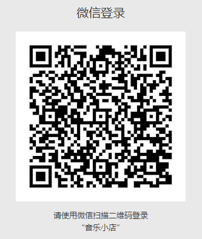
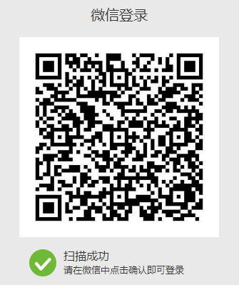
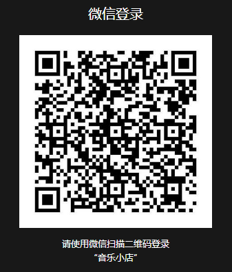
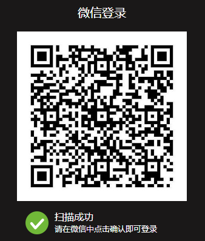
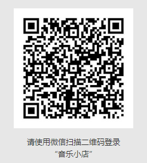
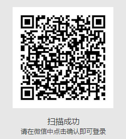

> 本文由 [简悦 SimpRead](http://ksria.com/simpread/) 转码， 原文地址 [developers.weixin.qq.com](https://developers.weixin.qq.com/doc/oplatform/Website_App/WeChat_Login/Wechat_Login.html)

> 微信登录功能, 网站应用微信登录开发指南, 准备工作

# [#](#准备工作) 准备工作

网站应用微信登录是基于 OAuth2.0 协议标准构建的微信 OAuth2.0 授权登录系统。 在进行微信 OAuth2.0 授权登录接入之前，在微信开放平台注册开发者账号，并拥有一个已审核通过的网站应用，并获得相应的 `AppID 和 AppSecret`，申请微信登录且通过审核后，可开始接入流程。

# [#](#授权流程说明) 授权流程说明

微信 OAuth2.0 授权登录让微信用户使用微信身份安全登录第三方应用或网站，在微信用户授权登录已接入微信 OAuth2.0 的第三方应用后，第三方可以获取到用户的接口调用凭证（access_token），通过 access_token 可以进行微信开放平台授权关系接口调用，从而可实现获取微信用户基本开放信息和帮助用户实现基础开放功能等。 微信 OAuth2.0 授权登录目前支持 authorization_code 模式，适用于拥有 server 端的应用授权。该模式整体流程为：

获取 access_token 时序图：


## **第一步：请求 CODE**

第三方使用网站应用授权登录前请注意已获取相应网页授权作用域（scope=snsapi_login），则可以通过在 PC 端打开以下链接： https://open.weixin.qq.com/connect/qrconnect?appid=APPID&redirect_uri=REDIRECT_URI&response_type=code&scope=SCOPE&state=STATE#wechat_redirect 若提示 “该链接无法访问”，请检查参数是否填写错误，如 redirect_uri 的域名与审核时填写的授权域名不一致或 scope 不为 snsapi_login。

**参数说明**

<table><thead><tr><th>参数</th><th>是否必须</th><th>说明</th></tr></thead><tbody><tr><td>appid</td><td>是</td><td>应用唯一标识</td></tr><tr><td>redirect_uri</td><td>是</td><td>请使用 urlEncode 对链接进行处理</td></tr><tr><td>response_type</td><td>是</td><td>填 code</td></tr><tr><td>scope</td><td>是</td><td>应用授权作用域，拥有多个作用域用逗号（,）分隔，网页应用目前仅填写 snsapi_login</td></tr><tr><td>state</td><td>否</td><td>用于保持请求和回调的状态，授权请求后原样带回给第三方。该参数可用于防止 csrf 攻击（跨站请求伪造攻击），建议第三方带上该参数，可设置为简单的随机数加 session 进行校验</td></tr><tr><td>lang</td><td>否</td><td>界面语言，支持 cn（中文简体）与 en（英文），默认为 cn</td></tr></tbody></table>

**返回说明**

用户允许授权后，将会重定向到 redirect_uri 的网址上，并且带上 code 和 state 参数

```
redirect_uri?code=CODE&state=STATE
```

若用户禁止授权，则不会发生重定向。

**请求示例**

登录一号店网站应用 https://test.yhd.com/wechat/login.do 打开后，一号店会生成 state 参数，跳转到 https://open.weixin.qq.com/connect/qrconnect?appid=wxbdc5610cc59c1631&redirect_uri=https%3A%2F%2Fpassport.yhd.com%2Fwechat%2Fcallback.do&response_type=code&scope=snsapi_login&state=3d6be0a4035d839573b04816624a415e#wechat_redirect 微信用户使用微信扫描二维码并且确认登录后，PC 端会跳转到 https://test.yhd.com/wechat/callback.do?code=CODE&state=3d6be0a40sssssxxxxx6624a415e

**将微信登录二维码内嵌到自己页面**

为了满足网站更定制化的需求，我们还提供了第二种获取 code 的方式，支持网站将微信登录二维码内嵌到自己页面中，用户使用微信扫码授权后通过 JS 将 code 返回给网站。 JS 微信登录主要用途：网站希望用户在网站内就能完成登录，无需跳转到微信域下登录后再返回，提升微信登录的流畅性与成功率。 网站内嵌二维码微信登录 JS 实现办法：

步骤1：在页面中先引入如下JS文件（支持https）：

```text
http://res.wx.qq.com/connect/zh_CN/htmledition/js/wxLogin.js
```

步骤2：在需要使用微信登录的地方实例以下JS对象：

```text
 var obj = new WxLogin({
 self_redirect:true,
 id:"login_container", 
 appid: "", 
 scope: "", 
 redirect_uri: "",
  state: "",
 style: "",
 href: ""
 });
```

**参数说明**

<table><thead><tr><th>参数</th><th>是否必须</th><th>说明</th></tr></thead><tbody><tr><td>self_redirect</td><td>否</td><td>true：手机点击确认登录后可以在 iframe 内跳转到 redirect_uri，false：手机点击确认登录后可以在 top window 跳转到 redirect_uri。默认为 false。</td></tr><tr><td>id</td><td>是</td><td>第三方页面显示二维码的容器 id</td></tr><tr><td>appid</td><td>是</td><td>应用唯一标识，在微信开放平台提交应用审核通过后获得</td></tr><tr><td>scope</td><td>是</td><td>应用授权作用域，拥有多个作用域用逗号（,）分隔，网页应用目前仅填写 snsapi_login 即可</td></tr><tr><td>redirect_uri</td><td>是</td><td>重定向地址，需要进行 UrlEncode</td></tr><tr><td>state</td><td>否</td><td>用于保持请求和回调的状态，授权请求后原样带回给第三方。该参数可用于防止 csrf 攻击（跨站请求伪造攻击），建议第三方带上该参数，可设置为简单的随机数加 session 进行校验</td></tr><tr><td>style</td><td>否</td><td>提供 "black"、"white" 可选，默认为黑色文字描述。详见文档底部 FAQ</td></tr><tr><td>href</td><td>否</td><td>自定义样式链接，第三方可根据实际需求覆盖默认样式。详见文档底部 FAQ</td></tr></tbody></table>

## **第二步：通过 code 获取 access_token**

### 通过 code 获取 access_token

通过code获取access_token

```text
https://api.weixin.qq.com/sns/oauth2/access_token?appid=APPID&secret=SECRET&code=CODE&grant_type=authorization_code
```

**参数说明**

<table><thead><tr><th>参数</th><th>是否必须</th><th>说明</th></tr></thead><tbody><tr><td>appid</td><td>是</td><td>应用唯一标识，在微信开放平台提交应用审核通过后获得</td></tr><tr><td>secret</td><td>是</td><td>应用密钥 AppSecret，在微信开放平台提交应用审核通过后获得</td></tr><tr><td>code</td><td>是</td><td>填写第一步获取的 code 参数</td></tr><tr><td>grant_type</td><td>是</td><td>填 authorization_code</td></tr></tbody></table>

**返回说明**

正确的返回：

```json
{ 
"access_token":"ACCESS_TOKEN", 
"expires_in":7200, 
"refresh_token":"REFRESH_TOKEN",
"openid":"OPENID", 
"scope":"SCOPE",
"unionid": "o6_bmasdasdsad6_2sgVt7hMZOPfL"
}
```

**参数说明**

<table><thead><tr><th>参数</th><th>说明</th></tr></thead><tbody><tr><td>access_token</td><td>接口调用凭证</td></tr><tr><td>expires_in</td><td>access_token 接口调用凭证超时时间，单位（秒）</td></tr><tr><td>refresh_token</td><td>用户刷新 access_token</td></tr><tr><td>openid</td><td>授权用户唯一标识</td></tr><tr><td>scope</td><td>用户授权的作用域，使用逗号（,）分隔</td></tr><tr><td>unionid</td><td>当且仅当该网站应用已获得该用户的 userinfo 授权时，才会出现该字段。</td></tr></tbody></table>

错误返回样例：

```json
{"errcode":40029,"errmsg":"invalid code"}
```

### **刷新 access_token 有效期**

access_token是调用授权关系接口的调用凭证，由于access_token有效期（目前为2个小时）较短，当access_token超时后，可以使用refresh_token进行刷新，access_token刷新结果有两种：

```text
1. 若access_token已超时，那么进行refresh_token会获取一个新的access_token，新的超时时间；
2. 若access_token未超时，那么进行refresh_token不会改变access_token，但超时时间会刷新，相当于续期access_token。
```

refresh_token拥有较长的有效期（30天），当refresh_token失效的后，需要用户重新授权。

**请求方法**

获取第一步的code后，请求以下链接进行refresh_token：

```text
https://api.weixin.qq.com/sns/oauth2/refresh_token?appid=APPID&grant_type=refresh_token&refresh_token=REFRESH_TOKEN
```

**参数说明**

<table><thead><tr><th>参数</th><th>是否必须</th><th>说明</th></tr></thead><tbody><tr><td>appid</td><td>是</td><td>应用唯一标识</td></tr><tr><td>grant_type</td><td>是</td><td>填 refresh_token</td></tr><tr><td>refresh_token</td><td>是</td><td>填写通过 access_token 获取到的 refresh_token 参数</td></tr></tbody></table>

**返回说明**

正确的返回：

```json
{ 
"access_token":"ACCESS_TOKEN", 
"expires_in":7200, 
"refresh_token":"REFRESH_TOKEN", 
"openid":"OPENID", 
"scope":"SCOPE" 
}
```

**参数说明**

<table><thead><tr><th>参数</th><th>说明</th></tr></thead><tbody><tr><td>access_token</td><td>接口调用凭证</td></tr><tr><td>expires_in</td><td>access_token 接口调用凭证超时时间，单位（秒）</td></tr><tr><td>refresh_token</td><td>用户刷新 access_token</td></tr><tr><td>openid</td><td>授权用户唯一标识</td></tr><tr><td>scope</td><td>用户授权的作用域，使用逗号（,）分隔</td></tr></tbody></table>

错误返回样例：

```text
{"errcode":40030,"errmsg":"invalid refresh_token"}
```

注意：

```text
1、Appsecret 是应用接口使用密钥，泄漏后将可能导致应用数据泄漏、应用的用户数据泄漏等高风险后果；存储在客户端，极有可能被恶意窃取（如反编译获取Appsecret）；
2、access_token 为用户授权第三方应用发起接口调用的凭证（相当于用户登录态），存储在客户端，可能出现恶意获取access_token 后导致的用户数据泄漏、用户微信相关接口功能被恶意发起等行为；
3、refresh_token 为用户授权第三方应用的长效凭证，仅用于刷新access_token，但泄漏后相当于access_token 泄漏，风险同上。

建议将secret、用户数据（如access_token）放在App云端服务器，由云端中转接口调用请求。
```

### 检验授权凭证（access_token）是否有效

**请求说明**

http请求方式: 

```text
GET
https://api.weixin.qq.com/sns/auth?access_token=ACCESS_TOKEN&openid=OPENID
```

**参数说明**

| 参数         | 是否必须 | 说明                           |
| :----------- | :------- | :----------------------------- |
| access_token | 是       | 调用接口凭证                   |
| openid       | 是       | 普通用户标识，对该公众账号唯一 |

**返回说明**

正确的Json返回结果：

```text
{
"errcode":0,"errmsg":"ok"
}
```

错误的Json返回示例:

```text
{
"errcode":40003,"errmsg":"invalid openid"
}
```


## **第三步：通过 access_token 调用接口**

获取 access_token 后，进行接口调用，有以下前提：

```text
1. access_token有效且未超时；
2. 微信用户已授权给第三方应用账号相应接口作用域（scope）。
```

对于接口作用域（scope），能调用的接口有以下：

<table><thead><tr><th>授权作用域（scope）</th><th>接口</th><th>接口说明</th></tr></thead><tbody><tr><td>snsapi_base</td><td>/sns/oauth2/access_token</td><td>通过 code 换取 access_token、refresh_token 和已授权 scope</td></tr><tr><td>snsapi_base</td><td>/sns/oauth2/refresh_token</td><td>刷新或续期 access_token 使用</td></tr><tr><td>snsapi_base</td><td>/sns/auth</td><td>检查 access_token 有效性</td></tr><tr><td>snsapi_userinfo</td><td>/sns/userinfo</td><td>获取用户个人信息</td></tr></tbody></table>

其中 snsapi_base 属于基础接口，若应用已拥有其它 scope 权限，则默认拥有 snsapi_base 的权限。使用 snsapi_base 可以让移动端网页授权绕过跳转授权登录页请求用户授权的动作，直接跳转第三方网页带上授权临时票据（code），但会使得用户已授权作用域（scope）仅为 snsapi_base，从而导致无法获取到需要用户授权才允许获得的数据和基础功能。 接口调用方法可查阅[《微信授权关系接口调用指南》](https://developers.weixin.qq.com/doc/oplatform/Website_App/WeChat_Login/Authorized_Interface_Calling_UnionID.html)

## F.A.Q

1. 什么是授权临时票据（code）？ 

   答：第三方通过 code 进行获取 access_token 的时候需要用到，code 的超时时间为 10 分钟，一个 code 只能成功换取一次 access_token 即失效。code 的临时性和一次保障了微信授权登录的安全性。第三方可通过使用 https 和 state 参数，进一步加强自身授权登录的安全性。

2. 什么是授权作用域（scope）？ 

   答：授权作用域（scope）代表用户授权给第三方的接口权限，第三方应用需要向微信开放平台申请使用相应 scope 的权限后，使用文档所述方式让用户进行授权，经过用户授权，获取到相应 access_token 后方可对接口进行调用。

3. 网站内嵌二维码微信登录 JS 代码中 style 字段作用？ 答：第三方页面颜色风格可能为浅色调或者深色调，若第三方页面为浅色背景，style 字段应提供 "black" 值（或者不提供，black 为默认值），则对应的微信登录文字样式为黑色。相关效果如下：


 

若提供 "white" 值，则对应的文字描述将显示为白色，适合深色背景。相关效果如下：

 

4. 网站内嵌二维码微信登录 JS 代码中 href 字段作用？ 

   答：如果第三方觉得微信团队提供的默认样式与自己的页面样式不匹配，可以自己提供样式文件来覆盖默认样式。举个例子，如第三方觉得默认二维码过大，可以提供相关 css 样式文件，并把链接地址填入 href 字段

   ```text
   .impowerBox .qrcode {width: 200px;}
   .impowerBox .title {display: none;}
   .impowerBox .info {width: 200px;}
   .status_icon {display: none}
   .impowerBox .status {text-align: center;} 
   ```

相关效果如下：

 


# access_token介绍

access_token是公众号的全局唯一接口调用凭据，公众号调用各接口时都需使用access_token。开发者需要进行妥善保存。access_token的存储至少要保留512个字符空间。access_token的有效期目前为2个小时，需定时刷新，重复获取将导致上次获取的access_token失效。

公众平台的API调用所需的access_token的使用及生成方式说明：

1、建议公众号开发者使用中控服务器统一获取和刷新access_token，其他业务逻辑服务器所使用的access_token均来自于该中控服务器，不应该各自去刷新，否则容易造成冲突，导致access_token覆盖而影响业务；

2、目前access_token的有效期通过返回的expires_in来传达，目前是7200秒之内的值。中控服务器需要根据这个有效时间提前去刷新新access_token。在刷新过程中，中控服务器可对外继续输出的老access_token，此时公众平台后台会保证在5分钟内，新老access_token都可用，这保证了第三方业务的平滑过渡；

3、access_token的有效时间可能会在未来有调整，所以中控服务器不仅需要内部定时主动刷新，还需要提供被动刷新access_token的接口，这样便于业务服务器在API调用获知access_token已超时的情况下，可以触发access_token的刷新流程。

4、对于可能存在风险的调用，在开发者进行获取 access_token调用时进入风险调用确认流程，需要用户管理员确认后才可以成功获取。具体流程为：

开发者通过某IP发起调用->平台返回错误码[89503]并同时下发模板消息给公众号管理员->公众号管理员确认该IP可以调用->开发者使用该IP再次发起调用->调用成功。

如公众号管理员第一次拒绝该IP调用，用户在1个小时内将无法使用该IP再次发起调用，如公众号管理员多次拒绝该IP调用，该IP将可能长期无法发起调用。平台建议开发者在发起调用前主动与管理员沟通确认调用需求，或请求管理员开启IP白名单功能并将该IP加入IP白名单列表。

公众号和小程序均可以使用AppID和AppSecret调用本接口来获取access_token。AppID和AppSecret可在“微信公众平台-开发-基本配置”页中获得（需要已经成为开发者，且账号没有异常状态）。**调用接口时，请登录“微信公众平台-开发-基本配置”提前将服务器IP地址添加到IP白名单中，点击查看设置方法，否则将无法调用成功。**小程序无需配置IP白名单。